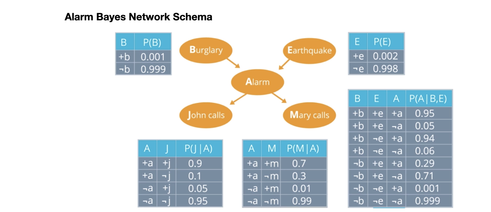
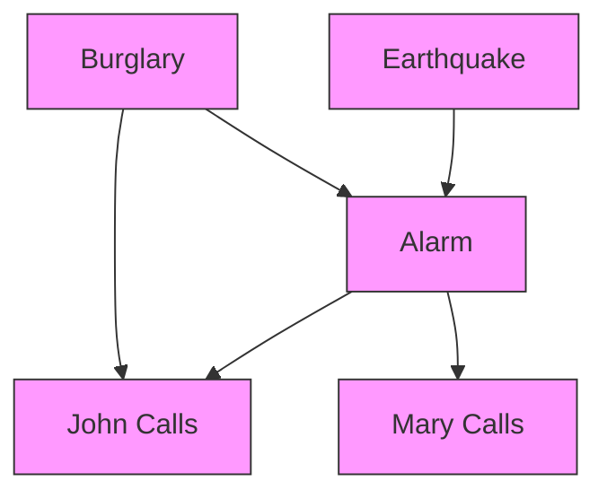
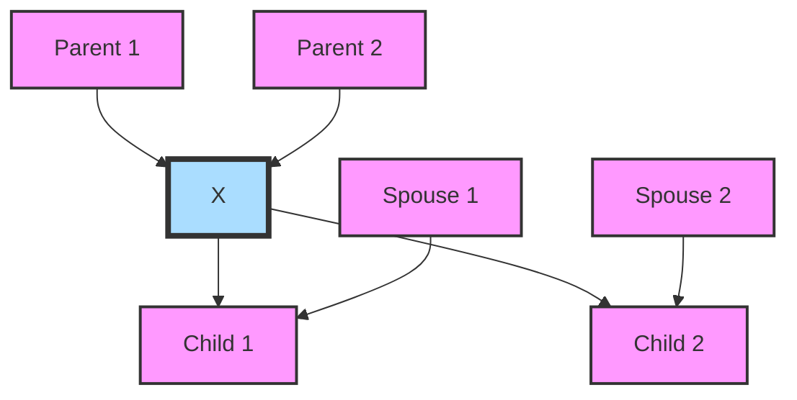
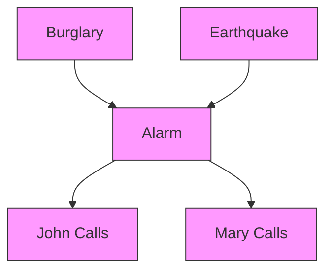
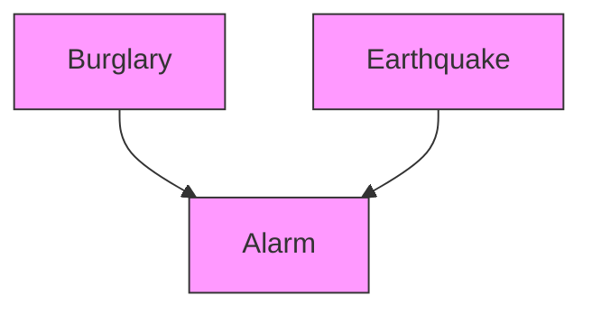
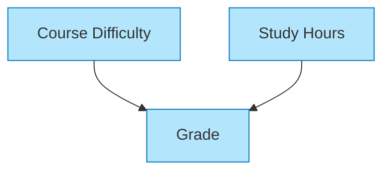
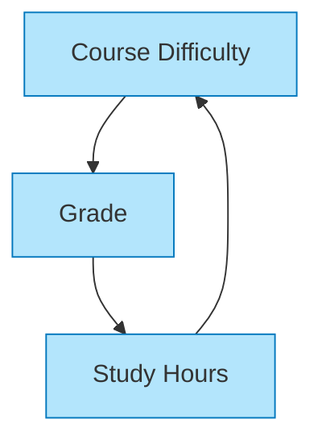
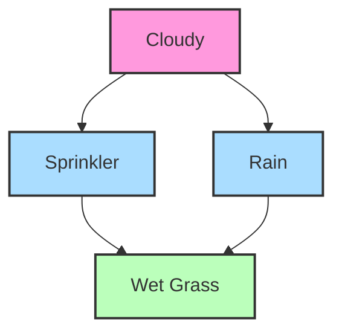
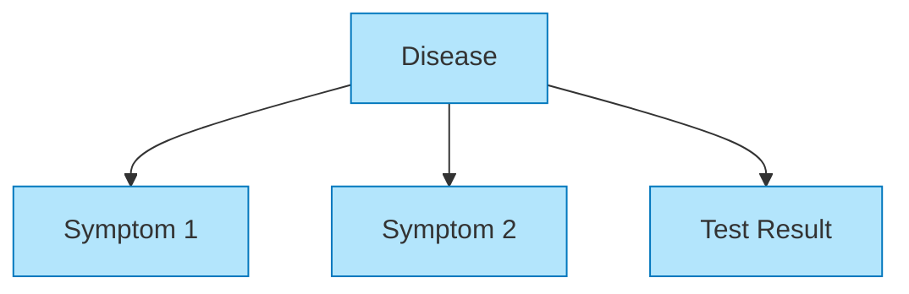
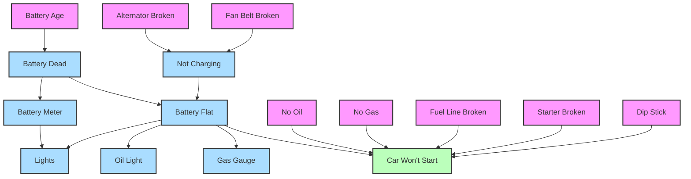

# S-4: Fundamentals of Probabilistic Graphical Models

# C-1: Foundations of Probabilistic Reasoning

1. Introduction to Probabilistic Models

    - Why Use Probabilistic Models
    - Bayesian Network Fundamentals
    - Core Components of Graphical Models
    - Mathematical Foundation
    - Key Applications and Features

2. Bayesian Networks (Bayes Nets)
    - Network Structure and Representation
    - Directed Acyclic Graphs (DAGs)
    - Conditional Probability Tables
    - Factorization of Joint Distributions
    - Building Intuition Through Examples

#### Introduction to Probabilistic Models

##### Why Use Probabilistic Models

Knowledge-based AI systems need to operate in an uncertain world. Unlike traditional logic systems that work with
absolute certainty (true/false statements), most real-world reasoning requires handling degrees of belief and combining
evidence from multiple sources.

Probabilistic models provide a mathematically sound framework for AI agents to:

1. Quantify uncertainty using probability theory
2. Update beliefs when new evidence arrives
3. Make optimal decisions under uncertainty
4. Combine multiple sources of uncertain information

Consider a medical diagnosis system: A patient might have symptoms that could indicate several different conditions, and
the doctor only has partial information. Probabilistic reasoning allows the system to weigh different possibilities and
update its beliefs as new test results come in.

While logical systems use strict rules to separate possible worlds from impossible ones, probabilistic systems assign
degrees of probability to different possible worlds, allowing for more nuanced reasoning under uncertainty.

##### Bayesian Network Fundamentals

Bayesian Networks (Bayes Nets) are a type of probabilistic graphical model that represents variables and their
conditional dependencies using a directed acyclic graph (DAG). They provide an elegant way to represent complex
probability distributions in a compact and intuitive format.

At their core, Bayesian Networks combine graph theory and probability theory to model uncertain domains. The network
structure explicitly shows which variables directly influence others, making the relationships between variables
intuitive to understand.

A classic example is the "Alarm Network":

<div align="center">

<p style="color: #555;">Figure: Classic Alarm Bayesian Network showing relationships between burglary, earthquake, alarm, and phone calls</p>
</div>

This network models a home alarm system that can be triggered by either a burglary or an earthquake. When the alarm
sounds, two neighbors (John and Mary) might call the homeowner. The graph structure captures the direct causal
relationships, while the probability tables quantify the strength of these relationships.

##### Core Components of Graphical Models

Bayesian Networks consist of three essential components:

1. **Graph Structure**: A directed acyclic graph where:
    - Nodes represent random variables (events or states)
    - Directed edges represent direct dependencies
    - Absence of edges indicates conditional independence
2. **Conditional Probability Tables (CPTs)**: Each node has an associated table specifying:
    - P(Node | Parents) - the probability of the node given its parents
    - For root nodes (without parents), this is simply the prior probability P(Node)
3. **Joint Probability Factorization**: The network represents the full joint probability distribution as a product of
   conditional probabilities:

$$P(X_1, X_2, ..., X_n) = \prod_{i=1}^{n} P(X_i | \text{Parents}(X_i))$$

This factorization is the key to the efficiency of Bayesian Networks, as it breaks down complex joint distributions into
smaller, more manageable pieces.

##### Mathematical Foundation

The power of Bayesian Networks comes from their mathematical foundation in probability theory, particularly the chain
rule of probability and conditional independence.

The chain rule allows us to express a joint probability as a product of conditional probabilities:

$$P(X_1, X_2, ..., X_n) = P(X_1) \times P(X_2|X_1) \times P(X_3|X_1,X_2) \times ... \times P(X_n|X_1,X_2,...,X_{n-1})$$

Bayesian Networks take advantage of conditional independence relationships to simplify this expression. If a variable
$X_i$ is conditionally independent of some of its predecessors given its parents, we can simplify its conditional
probability term to depend only on its parents.

For example, in the Alarm Network, given the state of the Alarm (A), John's call (J) is conditionally independent of
Burglary (B) and Earthquake (E):

$$P(J|A,B,E) = P(J|A)$$

This significantly reduces the number of parameters needed to specify the model. The Markov Property of Bayesian
Networks states that each variable is conditionally independent of its non-descendants, given its parents. This property
allows us to factorize the joint distribution into local conditional distributions as shown earlier.

The number of parameters needed for a node in a Bayesian Network is calculated as:

$$\text{Parameters} = (|S| - 1) \times \prod_{i} |P_i|$$

Where:

- |S| = Number of states for the node
- |Pᵢ| = Number of states for the i-th parent
- ∏ᵢ = Product over all parents

For example, the Alarm node in our network:

- Has 2 states (On, Off)
- Has 2 parents: Burglary (2 states) and Earthquake (2 states)
- Requires (2-1) × (2×2) = 4 parameters

This is much more efficient than specifying the full joint distribution, which would require 2⁵-1 = 31 parameters for
the entire alarm network.

###### Conditional Independence in Bayesian Networks

The equation P(J|A,B,E) = P(J|A) represents a fundamental property called conditional independence. Let's examine this
formally and conceptually.

The equation states that the probability of John calling (J) given the alarm state (A), burglary state (B), and
earthquake state (E) is equal to the probability of John calling given only the alarm state. This can be formally
expressed as:

$$P(J|A,B,E) = P(J|A)$$

This equality indicates that once we know whether the alarm has sounded (A), additional information about whether a
burglary occurred (B) or an earthquake happened (E) provides no additional information about whether John will call.

###### The Markov Blanket Principle

This example illustrates a fundamental principle in Bayesian networks known as the Markov blanket property. For any node
in a Bayesian network, its Markov blanket—consisting of its parents, children, and children's other parents—renders it
conditionally independent of all other nodes in the network.

In our case, the Markov blanket of node J (John calls) consists solely of node A (Alarm). Once we know the state of A,
no other variables in the network provide additional information about J.

###### Misconception Analysis

Your interpretation suggests that J (John's call) should be dependent on B (Burglary) and E (Earthquake) because these
events precede J temporally. This represents a common misconception about Bayesian networks that conflates temporal
sequence with conditional dependence.

While B and E temporally precede J, the network structure encodes a more subtle relationship: B and E affect J only
through their effect on A. This is the essence of the directed graphical model—it captures the direct causal mechanisms
rather than just temporal ordering.

Let's analyze the causal pathway:

1. Burglary (B) or Earthquake (E) can trigger the Alarm (A)
2. The Alarm (A) can cause John to call (J)

The crucial insight is that B and E affect the probability of A, but once we know the actual state of A with certainty,
B and E become irrelevant for predicting J. This is analogous to how knowing the position of a chess piece makes the
previous moves that led to that position irrelevant for predicting future legal moves.

###### D-Separation in Graphical Models

This conditional independence is formalized in Bayesian network theory through the concept of d-separation. In our
network structure:

```
B → A → J
↑   ↓
E → M
```

The nodes B and E are d-separated from J given A, which means that when A is observed, there is no active path from B or
E to J.

###### Alternative Scenario for Contrast

To understand this better, consider an alternative network structure where John might call based not only on the alarm
but also directly on seeing a burglar:



In this modified network, we would have P(J|A,B,E) ≠ P(J|A) because B provides additional information about J beyond
what A tells us.

###### Empirical Validation Through Examples

Consider the practical implications:

- If John only calls when he hears the alarm and has no other way of knowing about burglaries or earthquakes, then
  knowing the alarm state tells us everything relevant about whether John will call.
- If the alarm is triggered (A=true), the probability of John calling is the same regardless of what caused the alarm
  (burglary or earthquake).
- If the alarm is silent (A=false), John won't call regardless of whether there was a burglary or earthquake that failed
  to trigger the alarm.

This property significantly simplifies probabilistic calculations and is a key advantage of Bayesian networks for
handling complex probabilistic systems efficiently.

###### The Markov Blanket: A Comprehensive Analysis

The Markov blanket is a fundamental concept in probabilistic graphical models that elegantly formalizes the notion of
conditional independence. Understanding this concept provides deep insight into the efficiency and power of Bayesian
networks as a representation of complex probability distributions.

###### Formal Definition

In a Bayesian network, the Markov blanket of a node X is the minimal set of nodes that, when observed, renders X
conditionally independent of all other nodes in the network. Mathematically, if MB(X) represents the Markov blanket of
node X, then:

$$P(X | \text{MB}(X), Y) = P(X | \text{MB}(X))$$

for any node Y that is not in the Markov blanket of X nor X itself.

###### Structural Composition

The Markov blanket of a node X consists of three components:

1. The parents of X (direct causes)
2. The children of X (direct effects)
3. The other parents of X's children (often called "co-parents" or "spouses")

This can be visualized as follows:



In this diagram, the Markov blanket of node X consists of {P1, P2, C1, C2, S1, S2}.

###### Theoretical Significance

The Markov blanket concept is powerful because it encapsulates the "screening off" property in probabilistic systems.
Once we know the values of all variables in the Markov blanket of X, no other variable in the network provides any
additional information about X. This is a direct consequence of the local Markov property that Bayesian networks
satisfy.

The concept is named after Andrey Markov, whose work on stochastic processes laid the foundation for much of modern
probability theory. In Markov processes, the future state depends only on the present state, not on the sequence of
events that preceded it. The Markov blanket extends this idea to graphical models, specifying precisely which variables
constitute the "present state" for a given variable.

###### Application to the Alarm Network Example

Returning to our alarm network example:



We can identify the Markov blankets for each node:

- MB(B) = {A}
- MB(E) = {A}
- MB(A) = {B, E, J, M}
- MB(J) = {A}
- MB(M) = {A}

This explains why P(J|A,B,E) = P(J|A). Since the Markov blanket of J consists only of A, once we know the state of A,
the states of B and E provide no additional information about J.

###### Computational Implications

The Markov blanket has profound implications for inference algorithms in Bayesian networks:

1. **Parameter Efficiency**: It dramatically reduces the number of parameters needed to specify the joint distribution.
2. **Inference Optimization**: When computing the posterior probability of a variable, we need only consider its Markov
   blanket rather than the entire network.
3. **Parallel Processing**: Variables that are conditionally independent given their Markov blankets can be updated in
   parallel during inference.
4. **Feature Selection**: In machine learning, the Markov blanket provides a principled way to identify the most
   relevant features for predicting a target variable.

###### Statistical Learning Perspective

From a statistical learning perspective, the Markov blanket represents the optimal feature subset for predicting a
variable. If we were to build a classifier to predict variable X, including all variables in its Markov blanket and
excluding all others would theoretically provide the best prediction accuracy (assuming the network structure correctly
represents the true dependencies).

This property has led to the development of Markov blanket discovery algorithms, which aim to identify the Markov
blanket of a target variable directly from data, without first learning the entire network structure.

###### Philosophical Implications

The Markov blanket concept has interesting philosophical implications regarding causality and information flow. It
provides a formal way to define the boundary between a system and its environment, where information from the
environment can only influence the system through the Markov blanket.

Some researchers in theoretical neuroscience have even proposed that the brain's hierarchical organization can be
understood in terms of nested Markov blankets, with each level maintaining a predictive model of its environment
mediated by its Markov blanket.

###### Practical Example: Medical Diagnosis

Consider a medical diagnosis system where "Disease" (D) has parents "Risk Factors" (RF), children "Symptoms" (S), and
the symptoms have other parents "Confounding Conditions" (CC). The Markov blanket of D would be {RF, S, CC}.

Once we observe all risk factors, symptoms, and potentially confounding conditions, no other information in the medical
record would improve our ability to diagnose the disease. This provides a principled way to focus attention on the most
relevant clinical information.

###### D-Separation: A Fundamental Concept in Bayesian Networks

D-separation (directional separation) is a crucial concept in Bayesian networks that provides a graphical criterion for
identifying conditional independence relationships encoded in the network structure. Understanding d-separation allows
us to determine, by inspecting the graph alone, whether two sets of variables are conditionally independent given a
third set.

###### The Concept of Active and Blocked Paths

To understand d-separation, we need to first grasp the concept of active and blocked paths in a directed graph:

- A **path** in a Bayesian network is a sequence of nodes connected by edges (regardless of edge direction)
- A path can be either **active** or **blocked** with respect to a conditioning set Z
- An active path allows probabilistic influence to flow between its endpoints
- A blocked path prevents probabilistic influence from flowing

Two sets of nodes X and Y are d-separated by a set Z if all paths between any node in X and any node in Y are blocked by
Z.

###### Connection Patterns and Blocking Conditions

There are three fundamental connection patterns in Bayesian networks, each with different blocking conditions:

1. **Serial (Chain) Connection**: X → Z → Y

    ```mermaid
    graph LR
        X --> Z --> Y

        classDef default fill:#f9f,stroke:#333,stroke-width:1px;
    ```

    - Blocked if Z is observed (Z ∈ conditioning set)
    - Active if Z is not observed

2. **Diverging (Fork) Connection**: X ← Z → Y

    ```mermaid
    graph LR
        X <-- Z --> Y

        classDef default fill:#f9f,stroke:#333,stroke-width:1px;
    ```

    - Blocked if Z is observed
    - Active if Z is not observed

3. **Converging (V-structure/Collider) Connection**: X → Z ← Y

    ```mermaid
    graph LR
        X --> Z
        Y --> Z

        style X fill:#f9f,stroke:#333,stroke-width:1px
        style Y fill:#f9f,stroke:#333,stroke-width:1px
        style Z fill:#f9f,stroke:#333,stroke-width:1px
    ```

    - Blocked if Z is NOT observed AND no descendant of Z is observed
    - Active if Z OR any descendant of Z is observed

This third case is counterintuitive and captures the "explaining away" phenomenon in probabilistic reasoning.

###### Applying D-Separation to the Alarm Network

Let's apply these principles to the alarm network structure you provided:


Let's examine several d-separation queries:

1. **Are B and E d-separated (without conditioning on any variables)?**

    B and E have no path between them, so they are trivially d-separated. This means B and E are marginally independent:
    P(B,E) = P(B)P(E).

2. **Are B and J d-separated given A?**

    The path B → A → J is a serial connection through A. Since we're conditioning on A, this path is blocked. Therefore,
    B and J are d-separated given A, which means: P(B|A,J) = P(B|A).

3. **Are B and E d-separated given A?**

    B and E are connected via a converging connection at A: B → A ← E. When we condition on A, this path becomes active!
    This means B and E are NOT d-separated given A, and thus: P(B|A,E) ≠ P(B|A).

4. **Are J and M d-separated given A?**

    The path J ← A → M is a diverging connection from A. Since we're conditioning on A, this path is blocked. Therefore,
    J and M are d-separated given A, which means: P(J|A,M) = P(J|A).

5. **Are J and E d-separated (without conditioning)?**

    The path J ← A ← E is a serial connection. Without conditioning on A, this path is active. Therefore, J and E are
    NOT d-separated unconditionally, meaning J and E are marginally dependent: P(J|E) ≠ P(J).

###### The "Explaining Away" Phenomenon

The third case of converging connections (colliders) is particularly interesting because it creates a conditional
dependence between otherwise independent variables. This is known as "explaining away":



- Without knowing anything about the alarm (A), knowing there was an earthquake (E) tells us nothing about whether there
  was a burglary (B). They are marginally independent.
- However, if we know the alarm went off (A is observed), then learning there was an earthquake (E) makes a burglary (B)
  less likely, since the earthquake already explains why the alarm triggered.

This pattern captures human intuitive reasoning: when multiple causes can produce the same effect, observing one cause
makes other potential causes less necessary (they get "explained away").

###### Formal Algorithm for D-Separation

The formal algorithm for determining whether a set Z d-separates sets X and Y involves:

1. Identify all undirected paths between any node in X and any node in Y
2. For each path, determine if it is blocked or active given Z using the rules above
3. If all paths are blocked, then Z d-separates X and Y

###### Implications for Inference in Bayesian Networks

D-separation has profound implications for probabilistic inference:

1. It provides a graphical method to identify all conditional independence relationships encoded in a Bayesian network
2. It allows efficient factorization of the joint probability distribution
3. It guides the design of efficient inference algorithms by identifying which variables need to be considered together
4. It helps explain unintuitive reasoning patterns like "explaining away"

###### Why P(J|A,B,E) = P(J|A) Holds

Returning to our original equation, we can now explain why P(J|A,B,E) = P(J|A) holds through d-separation:

The set {A} d-separates J from the set {B,E} because:

- The path J ← A ← B is a serial connection that is blocked when A is observed
- The path J ← A ← E is a serial connection that is blocked when A is observed
- There are no other paths between J and either B or E

Therefore, J is conditionally independent of both B and E given A, which is precisely what the equation P(J|A,B,E) =
P(J|A) states.

This exemplifies how d-separation provides a powerful graphical criterion for reading off conditional independence
relationships directly from the structure of a Bayesian network, without having to perform probabilistic calculations.

##### Key Applications and Features

Bayesian Networks have been successfully applied across numerous domains:

1. **Medical Diagnosis**: Modeling relationships between diseases, symptoms, and test results to aid diagnostic
   reasoning
2. **Risk Assessment**: Quantifying risk factors and their interdependencies in fields like finance, insurance, and
   safety engineering
3. **Natural Language Processing**: Part-of-speech tagging, semantic analysis, and disambiguation
4. **Computer Vision**: Object recognition and scene understanding
5. **Decision Support Systems**: Helping make optimal decisions under uncertainty

Key features that make Bayesian Networks particularly useful include:

1. **Compact Representation**: They represent complex probability distributions using far fewer parameters than would be
   needed for the full joint distribution
2. **Bidirectional Inference**: They support both causal reasoning (from causes to effects) and diagnostic reasoning
   (from effects to causes)
3. **Handling Missing Data**: They can make inferences even when some variables are unobserved
4. **Incremental Learning**: They can be updated as new data becomes available
5. **Interpretability**: Their graphical structure makes the model more interpretable than many black-box approaches

The "explaining away" effect is one particularly interesting aspect of reasoning in Bayesian Networks. In the alarm
example, Burglary (B) and Earthquake (E) are marginally independent, but they become conditionally dependent given the
alarm state (A). If we observe that the alarm has triggered and then learn that an earthquake definitely occurred, it
reduces the probability that a burglary also occurred, since the earthquake already "explains away" why the alarm went
off. This captures a common pattern in human reasoning: finding one explanation for an observation makes alternative
explanations less necessary.


The above diagram illustrates the Bayesian Network representing the alarm scenario. This structure shows how burglary
and earthquake can both cause the alarm to go off, which in turn may cause John and Mary to call. The network structure
makes the conditional independence assumptions explicit: once we know the state of the alarm, the calls from John and
Mary are independent of the original causes (burglary or earthquake).

These features allow Bayesian Networks to serve as powerful tools for modeling and reasoning about complex uncertain
domains in a way that is both computationally efficient and conceptually transparent.

#### Bayesian Networks (Bayes Nets)

##### Network Structure and Representation

Bayesian Networks represent knowledge through a graphical structure that captures the relationships between variables in
our domain. This representation makes both the dependencies and independencies in our model explicit and intuitive.

At its core, a Bayesian Network consists of two main components: a qualitative component (the graph structure) and a
quantitative component (the probability distributions). The graph encodes which variables directly influence others,
while the probability distributions quantify the strength of these influences.

Let's consider a simple example of a student's grade in a course. Their grade might depend on the difficulty of the
course and how much they studied. We can represent this as a network where arrows point from causes to effects:



This graph tells us that both "Course Difficulty" and "Study Hours" directly influence the student's "Grade," but there
is no direct relationship between difficulty and study hours (they are independent in this model).

The structure of a Bayesian Network isn't just decorative—it encodes fundamental assumptions about the domain we're
modeling. Each edge represents a direct dependency, and the absence of an edge represents a conditional independence
statement. This makes Bayesian Networks powerful not just for computation but also for communicating our understanding
of a domain to others.

##### Directed Acyclic Graphs (DAGs)

Bayesian Networks use Directed Acyclic Graphs (DAGs) as their structural framework. There are two key properties to
understand:

1. **Directed**: The edges have arrows indicating the direction of influence (typically causal). In our student example,
   course difficulty affects grades, not the other way around.
2. **Acyclic**: The graph contains no cycles or loops. You cannot follow the arrows and return to the same node. This
   constraint ensures that no variable can be its own cause, either directly or indirectly.

The acyclic property is essential because it allows us to factor the joint probability distribution in a consistent way.
It also enables efficient inference algorithms that would not work with cyclic dependencies.

Consider what would happen if we tried to create a cycle:



This cyclic graph creates a logical inconsistency: course difficulty affects grades, which affect study hours, which
then affect course difficulty again. Such circular reasoning isn't allowed in Bayesian Networks.

The DAG structure allows us to define a partial ordering over the variables, which becomes important for both
representation and inference. This ordering ensures we can always find a way to enumerate the variables such that
parents come before their children in the ordering.

##### Conditional Probability Tables

Each node in a Bayesian Network is associated with a Conditional Probability Table (CPT) that quantifies the
relationship between the node and its parents. For a node X with parents Parents(X), the CPT specifies P(X | Parents(X))
for all possible combinations of values.

For example, let's assume our variables are binary (for simplicity):

- Course Difficulty: Easy (E) or Hard (H)
- Study Hours: Low (L) or High (H)
- Grade: Pass (P) or Fail (F)

The CPT for "Grade" might look like:

| Difficulty | Study Hours | P(Grade=Pass) | P(Grade=Fail) |
| ---------- | ----------- | ------------- | ------------- |
| Easy       | High        | 0.9           | 0.1           |
| Easy       | Low         | 0.5           | 0.5           |
| Hard       | High        | 0.7           | 0.3           |
| Hard       | Low         | 0.1           | 0.9           |

This table tells us that a student who studies a lot will likely pass even a hard course (0.7 probability), while a
student who studies little will likely fail a hard course (0.9 probability).

For root nodes (nodes without parents), the CPT simplifies to a prior probability table. For example:

| P(Difficulty=Easy) | P(Difficulty=Hard) |
| ------------------ | ------------------ |
| 0.6                | 0.4                |

This indicates that 60% of courses are easy and 40% are hard in our model.

The number of parameters needed for a node's CPT grows exponentially with the number of parents. For a node with $n$
binary parents, we need $2^n$ probability values (actually, $2^n \times (2-1)$ since each row must sum to 1). This is
why Bayesian Networks with sparse connections are particularly efficient.

##### Factorization of Joint Distributions

The real power of Bayesian Networks lies in their ability to represent complex joint probability distributions
efficiently. The joint probability over all variables can be factorized according to the network structure:

$$P(X_1, X_2, ..., X_n) = \prod_{i=1}^{n} P(X_i | \text{Parents}(X_i))$$

For our student example with three variables, the joint distribution becomes:

$$P(\text{Difficulty}, \text{Study}, \text{Grade}) = P(\text{Difficulty}) \times P(\text{Study}) \times P(\text{Grade} | \text{Difficulty}, \text{Study})$$

This factorization dramatically reduces the number of parameters needed to specify the joint distribution. For n binary
variables, the full joint distribution would require $2^n-1$ parameters. With a Bayesian Network, the number of
parameters depends on the network structure and can be much smaller.

Consider our three binary variables:

- Full joint distribution: $2^3 - 1 = 7$ parameters
- Bayesian Network: 1 (for Difficulty) + 1 (for Study) + 4 (for Grade) = 6 parameters

The savings become even more dramatic as the number of variables increases, especially if the network is sparse (has few
connections). For example, with 10 binary variables:

- Full joint distribution: $2^{10} - 1 = 1,023$ parameters
- Bayesian Network with at most 2 parents per node: at most $10 \times (2^2) = 40$ parameters

This efficiency in representation is what makes Bayesian Networks practical for modeling complex domains with many
variables.

##### Building Intuition Through Examples

Let's examine a classic example that helps build intuition for Bayesian Networks: the "Wet Grass" problem.

Imagine you come home and notice your grass is wet. Did it rain, or did the sprinkler run? Here's a Bayesian Network for
this scenario:



The network encodes several intuitive notions:

- Cloudy weather affects both rain and sprinkler use (you're less likely to use the sprinkler if it's cloudy)
- Both rain and the sprinkler can make the grass wet
- Rain and sprinkler use are conditionally dependent given cloudy weather (they're not directly connected, but knowing
  it's cloudy tells us something about both)

This network supports various types of reasoning:

- **Causal reasoning**: "If it's cloudy, what's the probability it will rain?"
- **Evidential reasoning**: "The grass is wet; did it rain?"
- **Intercausal reasoning**: "The grass is wet and I know it rained; what's the probability the sprinkler ran?"

The last type, known as "explaining away," is particularly interesting. If we know the grass is wet and it rained, the
sprinkler becomes less likely to have been on (since rain already explains the wet grass).

Probability tables for this network might look like:

**P(Cloudy):**

- P(Cloudy=Yes) = 0.5
- P(Cloudy=No) = 0.5

**P(Sprinkler | Cloudy):**

- P(Sprinkler=On | Cloudy=Yes) = 0.1
- P(Sprinkler=On | Cloudy=No) = 0.5

**P(Rain | Cloudy):**

- P(Rain=Yes | Cloudy=Yes) = 0.8
- P(Rain=Yes | Cloudy=No) = 0.2

**P(WetGrass | Sprinkler, Rain):**

- P(WetGrass=Yes | Sprinkler=On, Rain=Yes) = 0.99
- P(WetGrass=Yes | Sprinkler=On, Rain=No) = 0.9
- P(WetGrass=Yes | Sprinkler=Off, Rain=Yes) = 0.9
- P(WetGrass=Yes | Sprinkler=Off, Rain=No) = 0.01

Another useful example is the medical diagnosis network:



This structure captures how a disease causes various symptoms and affects test results. It allows a doctor to reason
from symptoms to diseases (diagnosis) or from diseases to symptoms (prediction).

The "Car Failure Network" represents a more complex example modeling the causes and indicators of car failure:



This network models:

1. Root causes of failure (battery age, broken components)
2. Intermediate states (battery charge, electrical system)
3. Observable symptoms (lights, gauges)
4. The target outcome (car not starting)

Such a network helps diagnose the most likely cause of car failure given observed symptoms.

These examples illustrate how Bayesian Networks encode domain knowledge in an intuitive way, while also providing a
rigorous mathematical framework for probabilistic reasoning. They allow us to model complex systems with uncertainty and
perform various types of reasoning that align with human intuition, making them powerful tools for AI systems that need
to operate in uncertain environments.
