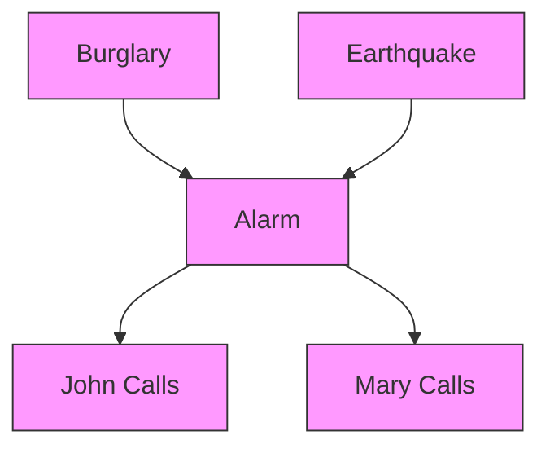
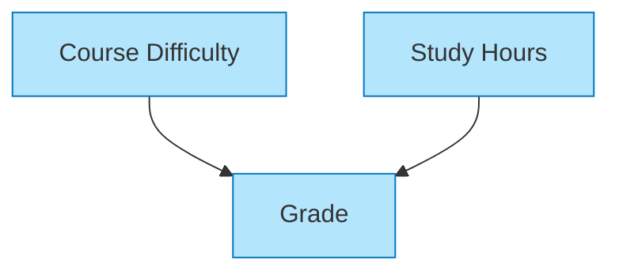
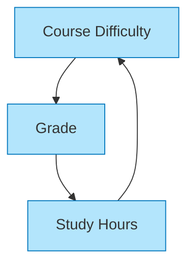
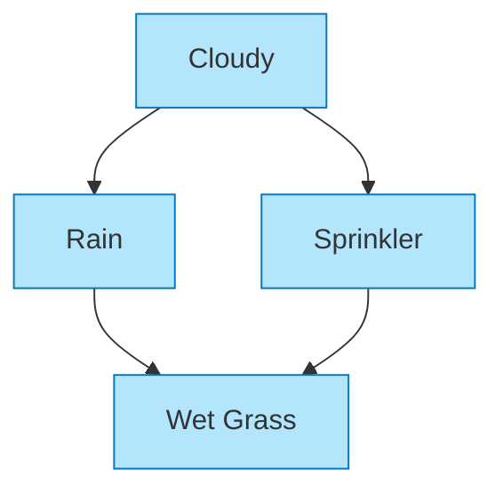
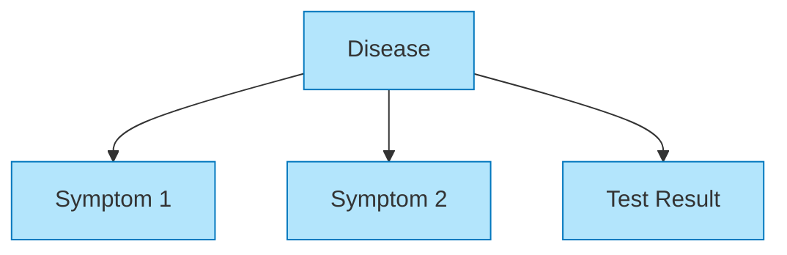

# S-4: Fundamentals of Probabilistic Graphical Models

# C-1: Foundations of Probabilistic Reasoning

1. Introduction to Probabilistic Models

    - Why Use Probabilistic Models
    - Bayesian Network Fundamentals
    - Core Components of Graphical Models
    - Mathematical Foundation
    - Key Applications and Features

2. Bayesian Networks (Bayes Nets)
    - Network Structure and Representation
    - Directed Acyclic Graphs (DAGs)
    - Conditional Probability Tables
    - Factorization of Joint Distributions
    - Building Intuition Through Examples

#### Introduction to Probabilistic Models

##### Why Use Probabilistic Models

Knowledge-based AI systems need to operate in an uncertain world. Unlike traditional logic systems that work with
absolute certainty (true/false statements), most real-world reasoning requires handling degrees of belief and combining
evidence from multiple sources.

Probabilistic models provide a mathematically sound framework for AI agents to:

1. Quantify uncertainty using probability theory
2. Update beliefs when new evidence arrives
3. Make optimal decisions under uncertainty
4. Combine multiple sources of uncertain information

Consider a medical diagnosis system: A patient might have symptoms that could indicate several different conditions, and
the doctor only has partial information. Probabilistic reasoning allows the system to weigh different possibilities and
update its beliefs as new test results come in.

While logical systems use strict rules to separate possible worlds from impossible ones, probabilistic systems assign
degrees of probability to different possible worlds, allowing for more nuanced reasoning under uncertainty.

##### Bayesian Network Fundamentals

Bayesian Networks (Bayes Nets) are a type of probabilistic graphical model that represents variables and their
conditional dependencies using a directed acyclic graph (DAG). They provide an elegant way to represent complex
probability distributions in a compact and intuitive format.

At their core, Bayesian Networks combine graph theory and probability theory to model uncertain domains. The network
structure explicitly shows which variables directly influence others, making the relationships between variables
intuitive to understand.

A classic example is the "Alarm Network":

Figure: Classic Alarm Bayesian Network showing relationships between burglary, earthquake, alarm, and phone calls

This network models a home alarm system that can be triggered by either a burglary or an earthquake. When the alarm
sounds, two neighbors (John and Mary) might call the homeowner. The graph structure captures the direct causal
relationships, while the probability tables quantify the strength of these relationships.

### Core Components of Graphical Models

Bayesian Networks consist of three essential components:

1. **Graph Structure**: A directed acyclic graph where:
    - Nodes represent random variables (events or states)
    - Directed edges represent direct dependencies
    - Absence of edges indicates conditional independence
2. **Conditional Probability Tables (CPTs)**: Each node has an associated table specifying:
    - P(Node | Parents) - the probability of the node given its parents
    - For root nodes (without parents), this is simply the prior probability P(Node)
3. **Joint Probability Factorization**: The network represents the full joint probability distribution as a product of
   conditional probabilities:

$$P(X_1, X_2, ..., X_n) = \prod_{i=1}^{n} P(X_i | \text{Parents}(X_i))$$

This factorization is the key to the efficiency of Bayesian Networks, as it breaks down complex joint distributions into
smaller, more manageable pieces.

### Mathematical Foundation

The power of Bayesian Networks comes from their mathematical foundation in probability theory, particularly the chain
rule of probability and conditional independence.

The chain rule allows us to express a joint probability as a product of conditional probabilities:

$$P(X_1, X_2, ..., X_n) = P(X_1) \times P(X_2|X_1) \times P(X_3|X_1,X_2) \times ... \times P(X_n|X_1,X_2,...,X_{n-1})$$

Bayesian Networks take advantage of conditional independence relationships to simplify this expression. If a variable
$X_i$ is conditionally independent of some of its predecessors given its parents, we can simplify its conditional
probability term to depend only on its parents.

For example, in the Alarm Network, given the state of the Alarm (A), John's call (J) is conditionally independent of
Burglary (B) and Earthquake (E):

$$P(J|A,B,E) = P(J|A)$$

This significantly reduces the number of parameters needed to specify the model.

### Key Applications and Features

Bayesian Networks have been successfully applied across numerous domains:

1. **Medical Diagnosis**: Modeling relationships between diseases, symptoms, and test results to aid diagnostic
   reasoning
2. **Risk Assessment**: Quantifying risk factors and their interdependencies in fields like finance, insurance, and
   safety engineering
3. **Natural Language Processing**: Part-of-speech tagging, semantic analysis, and disambiguation
4. **Computer Vision**: Object recognition and scene understanding
5. **Decision Support Systems**: Helping make optimal decisions under uncertainty

Key features that make Bayesian Networks particularly useful include:

1. **Compact Representation**: They represent complex probability distributions using far fewer parameters than would be
   needed for the full joint distribution
2. **Bidirectional Inference**: They support both causal reasoning (from causes to effects) and diagnostic reasoning
   (from effects to causes)
3. **Handling Missing Data**: They can make inferences even when some variables are unobserved
4. **Incremental Learning**: They can be updated as new data becomes available
5. **Interpretability**: Their graphical structure makes the model more interpretable than many black-box approaches

These features allow Bayesian Networks to serve as powerful tools for modeling and reasoning about complex uncertain
domains in a way that is both computationally efficient and conceptually transparent.

The above diagram illustrates a simple Bayesian Network representing the alarm scenario. This structure shows how
burglary and earthquake can both cause the alarm to go off, which in turn may cause John and Mary to call. The network
structure makes the conditional independence assumptions explicit: once we know the state of the alarm, the calls from
John and Mary are independent of the original causes (burglary or earthquake).

#### Bayesian Networks (Bayes Nets)

##### Network Structure and Representation

Bayesian Networks represent knowledge through a graphical structure that captures the relationships between variables in
our domain. This representation makes both the dependencies and independencies in our model explicit and intuitive.

At its core, a Bayesian Network consists of two main components: a qualitative component (the graph structure) and a
quantitative component (the probability distributions). The graph encodes which variables directly influence others,
while the probability distributions quantify the strength of these influences.

Let's consider a simple example of a student's grade in a course. Their grade might depend on the difficulty of the
course and how much they studied. We can represent this as a network where arrows point from causes to effects:

This graph tells us that both "Course Difficulty" and "Study Hours" directly influence the student's "Grade," but there
is no direct relationship between difficulty and study hours (they are independent in this model).

##### Directed Acyclic Graphs (DAGs)

Bayesian Networks use Directed Acyclic Graphs (DAGs) as their structural framework. There are two key properties to
understand:

1. **Directed**: The edges have arrows indicating the direction of influence (typically causal). In our student example,
   course difficulty affects grades, not the other way around.
2. **Acyclic**: The graph contains no cycles or loops. You cannot follow the arrows and return to the same node. This
   constraint ensures that no variable can be its own cause, either directly or indirectly.

The acyclic property is essential because it allows us to factor the joint probability distribution in a consistent way.
It also enables efficient inference algorithms that would not work with cyclic dependencies.

Consider what would happen if we tried to create a cycle:

This cyclic graph creates a logical inconsistency: course difficulty affects grades, which affect study hours, which
then affect course difficulty again. Such circular reasoning isn't allowed in Bayesian Networks.

##### Conditional Probability Tables

Each node in a Bayesian Network is associated with a Conditional Probability Table (CPT) that quantifies the
relationship between the node and its parents. For a node X with parents Parents(X), the CPT specifies P(X | Parents(X))
for all possible combinations of values.

For example, let's assume our variables are binary (for simplicity):

- Course Difficulty: Easy (E) or Hard (H)
- Study Hours: Low (L) or High (H)
- Grade: Pass (P) or Fail (F)

The CPT for "Grade" might look like:

| Difficulty | Study Hours | P(Grade=Pass) | P(Grade=Fail) |
| ---------- | ----------- | ------------- | ------------- |
| Easy       | High        | 0.9           | 0.1           |
| Easy       | Low         | 0.5           | 0.5           |
| Hard       | High        | 0.7           | 0.3           |
| Hard       | Low         | 0.1           | 0.9           |

This table tells us that a student who studies a lot will likely pass even a hard course (0.7 probability), while a
student who studies little will likely fail a hard course (0.9 probability).

For root nodes (nodes without parents), the CPT simplifies to a prior probability table. For example:

| P(Difficulty=Easy) | P(Difficulty=Hard) |
| ------------------ | ------------------ |
| 0.6                | 0.4                |

This indicates that 60% of courses are easy and 40% are hard in our model.

##### Factorization of Joint Distributions

The real power of Bayesian Networks lies in their ability to represent complex joint probability distributions
efficiently. The joint probability over all variables can be factorized according to the network structure:

$$P(X_1, X_2, ..., X_n) = \prod_{i=1}^{n} P(X_i | \text{Parents}(X_i))$$

For our student example with three variables, the joint distribution becomes:

$$P(\text{Difficulty}, \text{Study}, \text{Grade}) = P(\text{Difficulty}) \times P(\text{Study}) \times P(\text{Grade} | \text{Difficulty}, \text{Study})$$

This factorization dramatically reduces the number of parameters needed to specify the joint distribution. For n binary
variables, the full joint distribution would require 2^n-1 parameters. With a Bayesian Network, the number of parameters
depends on the network structure and can be much smaller.

Consider our three binary variables:

- Full joint distribution: 2^3 - 1 = 7 parameters
- Bayesian Network: 1 (for Difficulty) + 1 (for Study) + 4 (for Grade) = 6 parameters

The savings become even more dramatic as the number of variables increases, especially if the network is sparse (has few
connections).

##### Building Intuition Through Examples

Let's examine a classic example that helps build intuition for Bayesian Networks: the "Wet Grass" problem.

Imagine you come home and notice your grass is wet. Did it rain, or did the sprinkler run? Here's a Bayesian Network for
this scenario:

The network encodes several intuitive notions:

- Cloudy weather affects both rain and sprinkler use (you're less likely to use the sprinkler if it's cloudy)
- Both rain and the sprinkler can make the grass wet
- Rain and sprinkler use are conditionally dependent given cloudy weather (they're not directly connected, but knowing
  it's cloudy tells us something about both)

This network supports various types of reasoning:

- **Causal reasoning**: "If it's cloudy, what's the probability it will rain?"
- **Evidential reasoning**: "The grass is wet; did it rain?"
- **Intercausal reasoning**: "The grass is wet and I know it rained; what's the probability the sprinkler ran?"

The last type, known as "explaining away," is particularly interesting. If we know the grass is wet and it rained, the
sprinkler becomes less likely to have been on (since rain already explains the wet grass).

Another useful example is the medical diagnosis network:

This structure captures how a disease causes various symptoms and affects test results. It allows a doctor to reason
from symptoms to diseases (diagnosis) or from diseases to symptoms (prediction).

These examples illustrate how Bayesian Networks encode domain knowledge in an intuitive way, while also providing a
rigorous mathematical framework for probabilistic reasoning.
