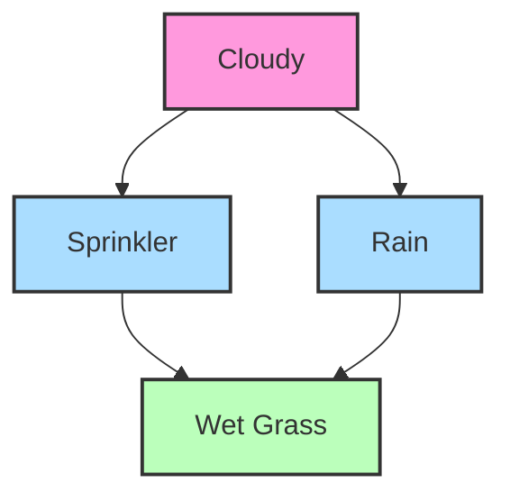
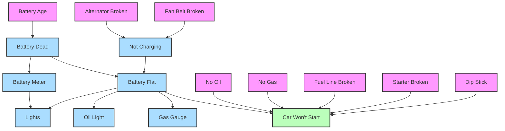
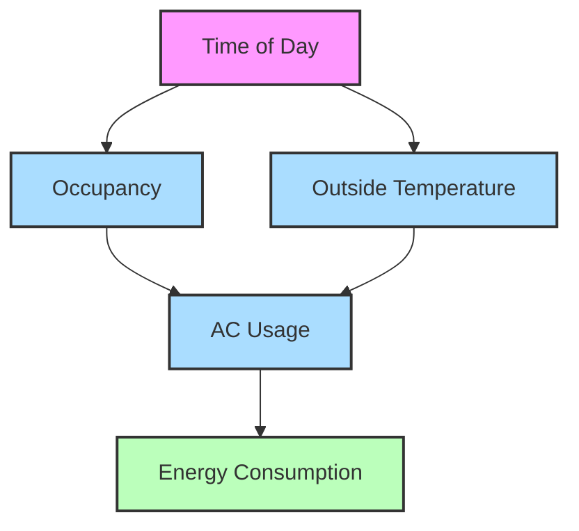
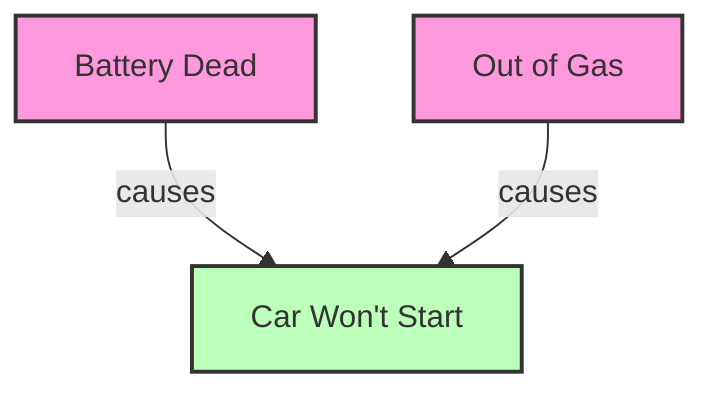

6. **Bayesian Networks**

   - Definition and structure
   - Nodes and conditional dependencies
   - Parameter computation
   - Example networks (weather, car failure, smart home)

7. **Conditional Independence**
   - Definition and notation (⊥ symbol)
   - Absolute vs. conditional independence
   - Examples with different variable relationships

# Bayesian Networks

Bayesian Networks (also called Bayes Nets or Belief Networks) are powerful graphical models that represent probabilistic relationships among a set of variables. They provide an elegant mathematical framework for modeling complex systems with uncertainty.

## Definition and Structure

A Bayesian Network consists of two main components:

1. **Structure**: A directed acyclic graph (DAG) where:

   - Each node represents a random variable
   - Directed edges (arrows) represent direct probabilistic dependencies
   - The absence of an edge indicates conditional independence

2. **Parameters**: Conditional probability distributions that quantify the relationships between connected nodes

The DAG structure is critical because it must not contain any directed cycles (loops) - this ensures that no variable can be its own ancestor or descendant, which would create logical inconsistencies in the probability model.

In this classic "Wet Grass" example:

- "Cloudy" directly influences both "Sprinkler" and "Rain"
- Both "Sprinkler" and "Rain" directly influence "Wet Grass"
- "Cloudy" indirectly influences "Wet Grass" through its children

## Nodes and Conditional Dependencies

Nodes in a Bayesian Network can represent various types of variables:

1. **Discrete variables**: Variables with a finite set of mutually exclusive states

   - Example: Weather (Sunny, Cloudy, Rainy)
   - Binary variables (True/False) are a common special case

2. **Continuous variables**: Variables with infinite possible values
   - Example: Temperature (any real number)
   - These often require special handling techniques like discretization

The network structure encodes important conditional independence assumptions:

**Markov Property**: Each variable is conditionally independent of its non-descendants, given its parents.

For instance, in our Wet Grass example:

- Given the state of "Rain," the state of "Cloudy" provides no additional information about "Wet Grass"
- Mathematically: P(Wet Grass | Rain, Cloudy) = P(Wet Grass | Rain)

This property allows us to factor the joint probability distribution into smaller, more manageable pieces:

$$P(X_1, X_2, ..., X_n) = \prod_{i=1}^{n} P(X_i | \text{Parents}(X_i))$$

Where Parents(Xᵢ) represents the set of parent nodes for variable Xᵢ.

## Parameter Computation

Each node in a Bayesian Network requires a Conditional Probability Table (CPT) or distribution that specifies the probability of that variable taking each possible value, given every possible combination of its parent variables' values.

The number of parameters needed for a node is calculated as:

$$\text{Parameters} = (|S| - 1) \times \prod_{i} |P_i|$$

Where:

- |S| = Number of states for the node
- |Pᵢ| = Number of states for the i-th parent
- ∏ᵢ = Product over all parents

Let's break down why this formula works:

1. For each combination of parent values, we need probabilities for all possible states of the child node
2. Since probabilities must sum to 1, we only need to specify (|S| - 1) values (the final value can be calculated)
3. The number of parent value combinations is the product of the number of states for each parent

### Example Parameter Calculation:

For a node "Wet Grass" with:

- 2 states (Wet, Dry)
- Parent "Sprinkler" with 2 states (On, Off)
- Parent "Rain" with 2 states (Yes, No)

Parameters = (2 - 1) × (2 × 2) = 1 × 4 = 4

This means we need 4 probability values to fully specify the CPT for "Wet Grass":

- P(Wet | Sprinkler=On, Rain=Yes)
- P(Wet | Sprinkler=On, Rain=No)
- P(Wet | Sprinkler=Off, Rain=Yes)
- P(Wet | Sprinkler=Off, Rain=No)

The corresponding probabilities for "Dry" are calculated as 1 minus these values.

## Example Networks

### Weather Network (Wet Grass)

As shown in our earlier diagram, this network models the causal relationships between weather conditions:

Probability tables for this network might look like:

**P(Cloudy):**

- P(Cloudy=Yes) = 0.5
- P(Cloudy=No) = 0.5

**P(Sprinkler | Cloudy):**

- P(Sprinkler=On | Cloudy=Yes) = 0.1
- P(Sprinkler=On | Cloudy=No) = 0.5

**P(Rain | Cloudy):**

- P(Rain=Yes | Cloudy=Yes) = 0.8
- P(Rain=Yes | Cloudy=No) = 0.2

**P(WetGrass | Sprinkler, Rain):**

- P(WetGrass=Yes | Sprinkler=On, Rain=Yes) = 0.99
- P(WetGrass=Yes | Sprinkler=On, Rain=No) = 0.9
- P(WetGrass=Yes | Sprinkler=Off, Rain=Yes) = 0.9
- P(WetGrass=Yes | Sprinkler=Off, Rain=No) = 0.01

This network allows us to answer queries like:

- "What's the probability the grass is wet if it's cloudy?"
- "If the grass is wet, what's the probability it's raining?"

### Car Failure Network

This more complex network models the causes and indicators of car failure:

This network models:

1. Root causes of failure (battery age, broken components)
2. Intermediate states (battery charge, electrical system)
3. Observable symptoms (lights, gauges)
4. The target outcome (car not starting)

Such a network helps diagnose the most likely cause of car failure given observed symptoms.

### Smart Home Energy Consumption

This network models factors affecting energy consumption in a smart home:

Nodes in this example include:

- Time of Day (Morning, Afternoon, Evening)
- Occupancy (Occupied, Unoccupied)
- Outside Temperature (Hot, Mild, Cold)
- AC Usage (On, Off)
- Energy Consumption (High, Medium, Low)

This network can help:

- Predict energy consumption based on time, occupancy, and temperature
- Diagnose why energy consumption is high at unexpected times
- Make decisions about optimal AC settings to balance comfort and efficiency

## Advantages and Applications

Bayesian Networks offer several key advantages:

1. **Interpretability**: The graphical structure provides clear visualization of dependencies

2. **Modularity**: The network can be constructed incrementally, with each node representing a distinct concept

3. **Efficiency**: Conditional independence assumptions reduce the number of parameters needed

4. **Flexibility**: Can model complex systems with both causal and non-causal relationships

5. **Uncertainty handling**: Naturally represents probabilistic knowledge and reasoning

Common applications include:

- Medical diagnosis
- Fault diagnosis in complex systems
- Risk assessment and decision support
- Natural language processing
- Computer vision
- Bioinformatics
- Environmental modeling

In summary, Bayesian Networks provide a powerful framework for reasoning under uncertainty by decomposing complex joint probability distributions into simpler, localized relationships between variables. Their ability to represent both the qualitative structure of dependencies and the quantitative strength of these relationships makes them invaluable tools across many domains.

# Conditional Independence

Conditional independence is a foundational concept in probability theory and lies at the heart of Bayesian networks. It defines situations where learning information about one variable doesn't affect our beliefs about another variable, given that we already know the value of a third variable.

## Definition and Notation

Two random variables A and B are conditionally independent given a third variable C if knowing the value of B provides no additional information about A when we already know C, and vice versa.

This relationship is typically denoted using the "perpendicular" symbol (⊥):

$$A \perp B | C$$

Read as "A is conditionally independent of B given C."

Mathematically, conditional independence is defined as:

$$P(A|B,C) = P(A|C)$$

Or equivalently:

$$P(A,B|C) = P(A|C) \times P(B|C)$$

This means that once we know C, learning B doesn't change our probability assessment of A.

## Absolute vs. Conditional Independence

There are two primary forms of independence to understand:

### Absolute (Marginal) Independence

When two variables A and B are absolutely independent (also called marginally independent), learning the value of one provides no information about the other, regardless of any other variables:

$$A \perp B$$

Mathematically expressed as:

$$P(A|B) = P(A)$$

Or equivalently:

$$P(A,B) = P(A) \times P(B)$$

### Conditional Independence

Conditional independence involves a third variable C, and holds when:

$$P(A|B,C) = P(A|C)$$

This means that while A and B might be dependent when considered alone, they become independent when conditioned on C.

### Critical Relationship

It's vital to understand that absolute independence and conditional independence don't imply each other:

1. **A ⊥ B does not imply A ⊥ B|C**: Variables that are absolutely independent can become dependent when conditioning on another variable.

2. **A ⊥ B|C does not imply A ⊥ B**: Variables that are conditionally independent given C might still be dependent when considered without C.

These relationships are marked as "False" because they don't hold in general.

## Examples with Different Variable Relationships

Let's explore several examples that demonstrate these concepts.

### Example 1: The Umbrella and Raincoat Case

Consider these variables:
- A = "Taking an umbrella"
- B = "Wearing a raincoat"
- C = "It's raining"

Initially, your choice of taking an umbrella might be independent of wearing a raincoat (A ⊥ B). But if you know it's raining (conditioning on C), these choices become dependent because people tend to use either one or both when it rains.

This illustrates how variables that are independent can become dependent when conditioned on a third variable.

### Example 2: Fire Alarm and Sprinklers

Consider:
- A = "Fire alarm going off"
- B = "Sprinklers activated"
- C = "Fire in building"

Given that there's a fire (C), the fire alarm and sprinklers might activate independently based on their own sensor mechanisms (A ⊥ B|C). But without knowing about the fire, seeing the sprinklers on makes the fire alarm more likely (and vice versa), so A and B are not marginally independent.

This example demonstrates how variables can be conditionally independent but marginally dependent.

### Example 3: Medical Example

Consider:
- A = "Headache"
- B = "Stomach pain"
- C = "Food poisoning"

Normally, headaches and stomach pain might occur independently (A ⊥ B). However, if we know someone has food poisoning (C), then learning they have a headache doesn't give us additional information about whether they have stomach pain, as both are common symptoms of food poisoning (A ⊥ B|C).

In this case, we have both marginal independence and conditional independence.

### Example 4: "Explaining Away" Phenomenon

Consider:
- A = "Battery dead"
- B = "Out of gas"
- C = "Car won't start"

Normally, having a dead battery and being out of gas are independent events (A ⊥ B). But if we know the car won't start (C), learning that the battery is dead makes it less likely that the car is also out of gas (A and B are not conditionally independent given C).

This illustrates the "explaining away" effect, where two independent causes of a common effect become dependent when the effect is observed.

## Applications in Bayesian Networks

Conditional independence is the foundation of Bayesian networks. The structure of a Bayesian network encodes conditional independence assumptions that allow us to represent complex joint distributions more efficiently.

In a Bayesian network:
- Each node is conditionally independent of its non-descendants, given its parents
- This property allows the joint distribution to be factorized into local conditional distributions:

$$P(X_1, X_2, ..., X_n) = \prod_{i=1}^{n} P(X_i | \text{Parents}(X_i))$$

Understanding conditional independence helps us:
1. Design more accurate probabilistic models
2. Identify which variables need to be observed to break certain dependencies
3. Determine when we can simplify calculations by treating variables as independent
4. Recognize situations where seemingly unrelated variables might become related after new observations

By mastering conditional independence, we gain a powerful tool for reasoning about complex probabilistic systems and understanding how information propagates through networks of dependent variables.
