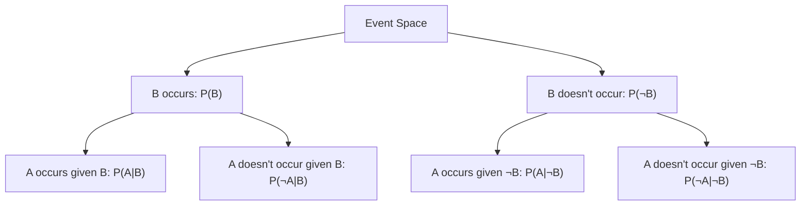
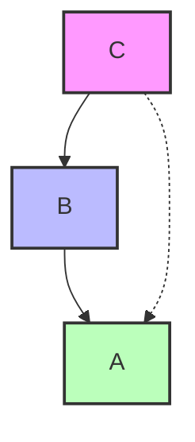
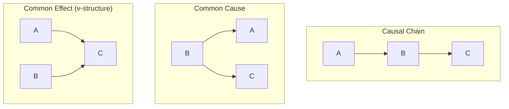
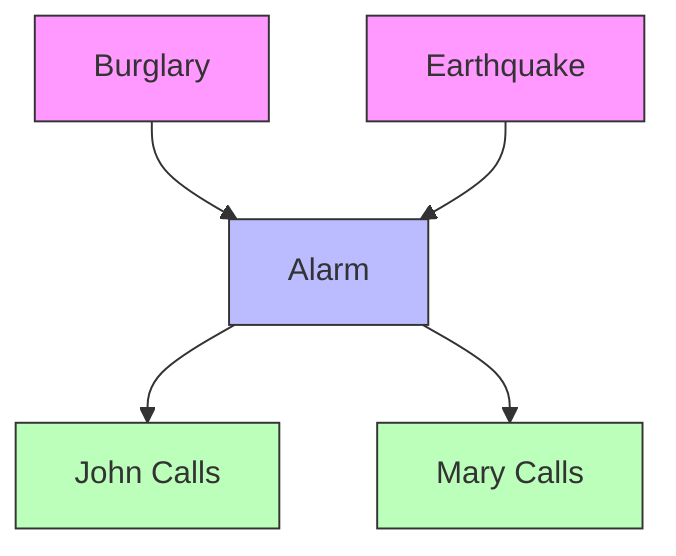
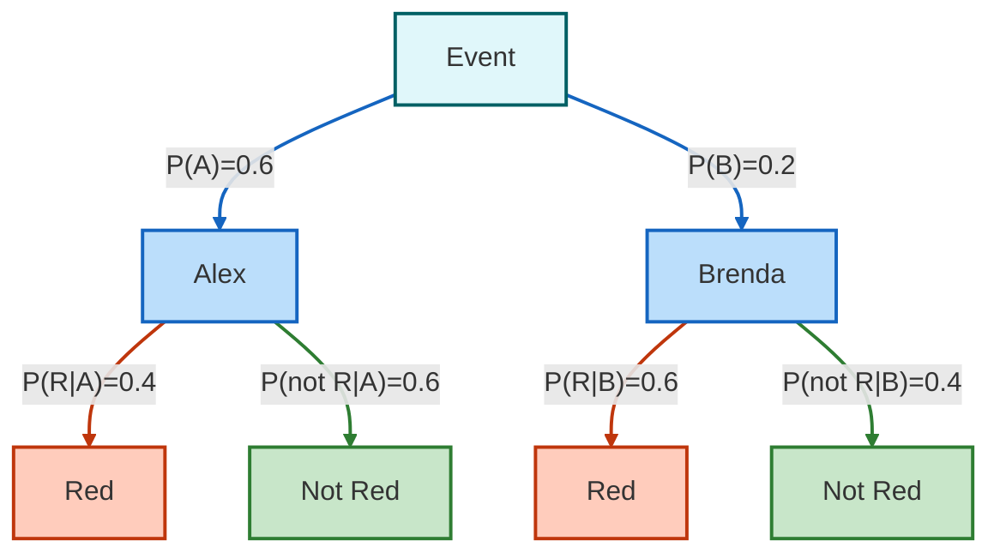

# C-2: Probability Theory and Bayesian Methods

1. Fundamentals of Probability

    - Law of Conditional Probability
    - Law of Total Probability
    - Chain Rule of Probability
    - Bayes' Theorem and Its Applications
    - Independence and Conditional Independence

2. Working with Probability Distributions
    - Discrete Probability Distributions
    - Joint and Marginal Probabilities
    - Calculating Conditional Probabilities
    - Normalization Methods
    - Complex Probability Examples


#### Fundamentals of Probability

##### Law of Conditional Probability

Conditional probability is the foundation of Bayesian reasoning. It answers the question: "Given that event B has occurred, what is the probability that event A will occur?" This is written as P(A|B).

The formal definition of conditional probability is:

$$P(A|B) = \frac{P(A \cap B)}{P(B)}$$

Where:

- P(A|B) is the probability of event A given that event B has occurred
- P(A ∩ B) is the probability of both events A and B occurring (joint probability)
- P(B) is the probability of event B occurring (and must be greater than zero)

This can be rearranged to give us the multiplication rule:

$$P(A \cap B) = P(A|B) \times P(B)$$

This form tells us how to calculate the joint probability of two events.

For example, if we know the probability of rain tomorrow is 0.3, and the probability of heavy traffic given that it rains is 0.8, then the probability of both rain and heavy traffic tomorrow is:

$$P(\text{Rain} \cap \text{Traffic}) = P(\text{Traffic}|\text{Rain}) \times P(\text{Rain}) = 0.8 \times 0.3 = 0.24$$

Conditional probability has several important properties:

1. **Range constraint**: $0 \leq P(A|B) \leq 1$
   - Like all probabilities, conditional probabilities must be between 0 and 1
2. **Nonzero denominator**: $P(B)$ must be greater than 0
   - We can only condition on events that have a nonzero probability of occurring
3. **Asymmetry**: $P(A|B) \neq P(B|A)$ in general
   - The probability of A given B is typically different from the probability of B given A
   - This asymmetry is what makes Bayes' theorem so useful
4. **Independence**: When A and B are independent events, $P(A \cap B) = P(A)P(B)$ and $P(A|B) = P(A)$
   - If A and B are independent, knowing B occurred doesn't change the probability of A occurring

Conditional probability is often illustrated using tree diagrams or tables to visualize the branching possibilities:



We can extend conditional probability to three or more events by applying the same principle repeatedly:

For three events A, B, and C:

$$P(A|B,C) = \frac{P(A \cap B \cap C)}{P(B \cap C)}$$

This can be rearranged to:

$$P(A \cap B \cap C) = P(A|B,C) \times P(B \cap C)$$

Understanding conditional probability is essential for reasoning about uncertain events and forms the foundation for more advanced concepts like Bayes' theorem and probabilistic graphical models.

##### Law of Total Probability

The Law of Total Probability allows us to calculate the probability of an event by considering all the ways that event can occur through mutually exclusive pathways. It's particularly useful when we have information about conditional probabilities but need the overall probability.

For any partition {B₁, B₂, ..., Bₙ} of the sample space (where the Bᵢ are mutually exclusive and exhaustive):

$$P(A) = \sum_{i=1}^{n} P(A|B_i) \times P(B_i)$$

In the simplest case with just two complementary events B and ¬B:

$$P(A) = P(A|B) \times P(B) + P(A|\neg B) \times P(\neg B)$$

This formula tells us that the total probability of A is the weighted sum of conditional probabilities, where the weights are the probabilities of the conditioning events.

We can derive the Law of Total Probability using basic set theory and the definition of conditional probability:

1. Start with the fact that the events B₁, B₂, ..., Bₙ form a partition of the sample space, meaning:
   - They are mutually exclusive: $B_i \cap B_j = \emptyset$ for i ≠ j
   - They are exhaustive: $B_1 \cup B_2 \cup ... \cup B_n = \Omega$ (the entire sample space)
2. Any event A can be expressed as the union of its intersections with each B₁: $A = A \cap \Omega = A \cap (B_1 \cup B_2 \cup ... \cup B_n) = (A \cap B_1) \cup (A \cap B_2) \cup ... \cup (A \cap B_n)$
3. Since these intersections are mutually exclusive, we can add their probabilities: $P(A) = P(A \cap B_1) + P(A \cap B_2) + ... + P(A \cap B_n)$
4. Using the definition of conditional probability, $P(A \cap B_i) = P(A|B_i)P(B_i)$: $P(A) = P(A|B_1)P(B_1) + P(A|B_2)P(B_2) + ... + P(A|B_n)P(B_n)$
5. Which gives us the Law of Total Probability: $P(A) = \sum_{i=1}^{n} P(A|B_i)P(B_i)$

For example, to find the probability of having a fever, we might consider whether a person has an infection:

$$P(\text{Fever}) = P(\text{Fever}|\text{Infection}) \times P(\text{Infection}) + P(\text{Fever}|\text{No Infection}) \times P(\text{No Infection})$$

If P(Fever|Infection) = 0.9, P(Infection) = 0.1, P(Fever|No Infection) = 0.05, and P(No Infection) = 0.9, then:

$$P(\text{Fever}) = 0.9 \times 0.1 + 0.05 \times 0.9 = 0.09 + 0.045 = 0.135$$

So the overall probability of fever is 13.5%.

The Law of Total Probability also has a conditional form. For any events A and C, and a partition {B, B̄}, we can derive:

$$P(A|C) = P(A|B,C)P(B|C) + P(A|\bar{B},C)P(\bar{B}|C)$$

This allows us to compute conditional probabilities by considering all possible paths through the partition.

##### Chain Rule of Probability

The Chain Rule of Probability, also known as the general product rule, extends the multiplication rule to multiple events. It provides a way to break down joint probabilities into a product of conditional probabilities:

$$P(A_1, A_2, ..., A_n) = P(A_1) \times P(A_2|A_1) \times P(A_3|A_1, A_2) \times ... \times P(A_n|A_1, A_2, ..., A_{n-1})$$

This rule is crucial for Bayesian networks because it shows how a joint probability distribution can be decomposed into simpler conditional probabilities.

For example, the joint probability of three events A, B, and C is:

$$P(A, B, C) = P(A) \times P(B|A) \times P(C|A, B)$$

We can prove the Chain Rule by repeatedly applying the definition of conditional probability. Let's start with the simplest case of two variables:

1. Start with the definition of conditional probability: $$P(A|B) = \frac{P(A,B)}{P(B)}$$
2. Rearranging this equation: $$P(A,B) = P(A|B)P(B)$$

This gives us the Chain Rule for two variables. Now let's extend to three variables:

1. For three variables A, B, and C, start with: $$P(A,B,C) = P(A|B,C)P(B,C)$$
2. Now expand P(B,C) using the rule we just derived for two variables: $$P(B,C) = P(B|C)P(C)$$
3. Substitute this back into our equation from step 3: $$P(A,B,C) = P(A|B,C)P(B|C)P(C)$$

This pattern continues for any number of variables, which we can prove by induction.

The Chain Rule becomes particularly powerful when combined with conditional independence assumptions. If variables are conditionally independent, we can simplify the expressions.

For example, if A is conditionally independent of B given C, written as A ⊥ B | C, then:

$$P(A|B,C) = P(A|C)$$

This allows us to simplify chain rule expressions. Consider a Bayesian network where:

- A depends on B and C
- B depends on C
- C is a root node



The Chain Rule would give:

$$P(A,B,C) = P(A|B,C) \times P(B|C) \times P(C)$$

If we had additional conditional independence (e.g., if A only depends on B, not on C), we could simplify further:

$$P(A,B,C) = P(A|B) \times P(B|C) \times P(C)$$

In the context of our earlier "Wet Grass" example, we can use the chain rule to express the full joint probability:

$$P(\text{Cloudy}, \text{Rain}, \text{Sprinkler}, \text{Wet}) = P(\text{Cloudy}) \times P(\text{Rain}|\text{Cloudy}) \times P(\text{Sprinkler}|\text{Cloudy}) \times P(\text{Wet}|\text{Rain}, \text{Sprinkler})$$

Note that we exploited the conditional independence of "Rain" and "Sprinkler" given "Cloudy" to simplify the expression.

##### Bayes' Theorem and Its Applications

Bayes' Theorem is the cornerstone of Bayesian inference. It provides a way to update our beliefs based on new evidence. The theorem is derived from the definition of conditional probability:

$$P(A|B) = \frac{P(B|A) \times P(A)}{P(B)}$$

Where:

- P(A|B) is the posterior probability: what we want to know after seeing evidence B
- P(B|A) is the likelihood: how probable is the evidence if A is true
- P(A) is the prior probability: our initial belief in A
- P(B) is the evidence: the total probability of observing B

<div align="center">  <p style="color: #555;">Figure: Application of Bayes' Theorem in the Alarm Network</p> </div>

The denominator $P(B)$ serves as a normalization constant that ensures the posterior probability is a proper probability (between 0 and 1). We can expand this term using the Law of Total Probability:

$$P(B) = P(B|A) \times P(A) + P(B|\neg A) \times P(\neg A)$$

Where $\neg A$ represents "not A" (the complement of event A).

Substituting this expansion into the original formula:

$$P(A|B) = \frac{P(B|A) \times P(A)}{P(B|A) \times P(A) + P(B|\neg A) \times P(\neg A)}$$

We can prove Bayes' Theorem from the definition of conditional probability:

1. Start with the definition of conditional probability for $P(A|B)$: $$P(A|B) = \frac{P(A \cap B)}{P(B)}$$
2. Similarly, for $P(B|A)$: $$P(B|A) = \frac{P(A \cap B)}{P(A)}$$
3. Rearranging the second equation to solve for $P(A \cap B)$: $$P(A \cap B) = P(B|A) \times P(A)$$
4. Substituting this into the first equation: $$P(A|B) = \frac{P(B|A) \times P(A)}{P(B)}$$

Bayes' theorem is particularly valuable when we know P(B|A) but need P(A|B) - often the case in diagnostic reasoning. For example, we might know the probability of a positive test result given a disease, but what we want is the probability of the disease given a positive test.

A canonical example is medical testing:

- P(Disease) = 0.01 (1% of population has the disease)
- P(Positive|Disease) = 0.95 (test is 95% sensitive)
- P(Positive|No Disease) = 0.05 (test is 95% specific)

Using Bayes' theorem to find P(Disease|Positive):

$$P(\text{Disease}|\text{Positive}) = \frac{P(\text{Positive}|\text{Disease}) \times P(\text{Disease})}{P(\text{Positive})}$$

The denominator can be expanded using the law of total probability:

$$P(\text{Positive}) = P(\text{Positive}|\text{Disease}) \times P(\text{Disease}) + P(\text{Positive}|\text{No Disease}) \times P(\text{No Disease})$$ $$P(\text{Positive}) = 0.95 \times 0.01 + 0.05 \times 0.99 = 0.0095 + 0.0495 = 0.059$$

Now we can calculate:

$$P(\text{Disease}|\text{Positive}) = \frac{0.95 \times 0.01}{0.059} \approx 0.161$$

This means despite the 95% test accuracy, the probability of having the disease given a positive test is only about 16%. This counter-intuitive result, known as the base rate fallacy, highlights the importance of considering prior probabilities.

Often in practice, we care more about comparing relative probabilities than calculating exact values. In such cases, we can use the proportional form of Bayes' Theorem:

$$P(A|B) \propto P(B|A) \times P(A)$$

Where the symbol $\propto$ means "proportional to." This form is particularly useful when we're only interested in which event is more likely, or when the denominator $P(B)$ is complex to calculate.

##### Independence and Conditional Independence

Two events A and B are independent if the occurrence of one doesn't affect the probability of the other:

$$P(A|B) = P(A)$$

Equivalently:

$$P(A \cap B) = P(A) \times P(B)$$

Independence is a powerful simplifying assumption in probabilistic models. When events are independent, we can simply multiply their probabilities to find joint probabilities.

Conditional independence is a more nuanced concept. Events A and B are conditionally independent given event C if, once we know C has occurred, information about B doesn't change our beliefs about A:

$$P(A|B,C) = P(A|C)$$

This is written as A ⊥ B | C (A is independent of B given C).

Conditional independence is central to Bayesian networks. In the network structure, a node is conditionally independent of its non-descendants given its parents. This property enables the compact factorization of joint distributions.

Consider three types of conditional independence patterns in Bayesian networks:

1. **Causal chain (A → B → C)**:
   - A and C are dependent
   - A and C are conditionally independent given B
   - Example: Disease → Symptom → Treatment
2. **Common cause (A ← B → C)**:
   - A and C are dependent
   - A and C are conditionally independent given B
   - Example: Fever ← Infection → Cough
3. **Common effect (A → C ← B)**:
   - A and B are independent
   - A and B are conditionally dependent given C (explaining away)
   - Example: Rain → Wet Grass ← Sprinkler



The v-structure (common effect) exhibits a particularly interesting property called "explaining away." If we observe the effect C, then learning about cause A changes our beliefs about cause B, even though A and B were initially independent. For example, if we know the grass is wet and we learn it rained, the probability of the sprinkler having been on decreases.

Understanding these patterns of independence is crucial for both constructing Bayesian networks and performing efficient inference in them. The conditional independence relationships encoded in the network structure allow us to reduce the number of parameters needed and enable more efficient algorithms for probabilistic reasoning.

It's important to understand that absolute independence and conditional independence don't imply each other:

1. **A ⊥ B does not imply A ⊥ B|C**: Variables that are absolutely independent can become dependent when conditioning on another variable.
2. **A ⊥ B|C does not imply A ⊥ B**: Variables that are conditionally independent given C might still be dependent when considered without C.

These relationships underscore the complex ways that information can flow through probabilistic models, and they form the foundation for understanding the behavior of Bayesian networks in practice.

#### Working with Probability Distributions

##### Discrete Probability Distributions

Discrete probability distributions model random variables that can take only distinct, separate values. These are fundamental building blocks for probabilistic graphical models, especially when modeling categorical variables like disease states, weather conditions, or parts of speech.

A discrete probability distribution assigns a probability to each possible value of the random variable, with the total probability summing to 1. For a random variable X with possible values {x₁, x₂, ..., xₙ}, the probability mass function P(X) must satisfy:

1. Non-negativity: P(X = xᵢ) ≥ 0 for all i
2. Normalization: ∑ᵢ P(X = xᵢ) = 1

Common discrete distributions include:

- **Bernoulli distribution**: Models a binary outcome (success/failure) with probability p of success
  - P(X = 1) = p
  - P(X = 0) = 1-p
  - Example: Modeling whether a patient has a disease
- **Binomial distribution**: Models the number of successes in n independent Bernoulli trials
  - P(X = k) = (n choose k) × pᵏ × (1-p)ⁿ⁻ᵏ
  - Example: Number of patients who recover out of 10 treated
- **Categorical distribution**: Generalizes Bernoulli to more than two outcomes
  - P(X = xᵢ) = pᵢ where ∑ᵢ pᵢ = 1
  - Example: Modeling parts of speech (noun, verb, adjective, etc.)

In Bayesian networks, each node typically has a discrete probability distribution conditioned on its parents. For root nodes, we specify a prior distribution; for child nodes, we specify a conditional distribution for each combination of parent values.

For example, in our alarm Bayesian network, the "Alarm" node has a conditional probability distribution P(Alarm | Burglary, Earthquake) that specifies the probability of the alarm being triggered for each combination of its parent values (whether a burglary occurred and whether there was an earthquake).



In this network, each node has a discrete distribution:

- Burglary: Bernoulli (yes/no)
- Earthquake: Bernoulli (yes/no)
- Alarm: Conditional Bernoulli given Burglary and Earthquake
- John Calls: Conditional Bernoulli given Alarm
- Mary Calls: Conditional Bernoulli given Alarm

The power of discrete distributions lies in their simplicity and interpretability, making them ideal for modeling many real-world phenomena in a probabilistic graphical framework.

##### Joint and Marginal Probabilities

Joint probability distributions model the probabilities of multiple random variables simultaneously. For two discrete random variables X and Y, the joint distribution P(X,Y) gives the probability of each combination of values (x,y).

For example, in a medical diagnosis context, we might have:

```
P(Disease=present, Symptom=present) = 0.08
P(Disease=present, Symptom=absent) = 0.02
P(Disease=absent, Symptom=present) = 0.12
P(Disease=absent, Symptom=absent) = 0.78
```

This joint distribution contains complete information about the probabilistic relationship between Disease and Symptom. From it, we can derive marginal and conditional distributions.

The marginal distribution of a single variable is obtained by summing over all values of the other variables. For example:

$$P(X = x) = \sum_y P(X = x, Y = y)$$

Using our example:

$$P(\text{Disease=present}) = P(\text{Disease=present, Symptom=present}) + P(\text{Disease=present, Symptom=absent}) = 0.08 + 0.02 = 0.10$$

$$P(\text{Symptom=present}) = P(\text{Disease=present, Symptom=present}) + P(\text{Disease=absent, Symptom=present}) = 0.08 + 0.12 = 0.20$$

Marginalization is a fundamental operation in probabilistic inference. When we have evidence about some variables in a Bayesian network and want to infer others, we often need to sum out (marginalize) the hidden variables.

For multiple variables, the joint distribution grows exponentially with the number of variables. For n binary variables, we need 2ⁿ values to specify the full joint distribution. This is where Bayesian networks become powerful: they allow us to represent the joint distribution more compactly by exploiting conditional independence relationships.

<div align="center">  <p style="color: #555;">Figure: Joint probability distribution factored according to a Bayesian network</p> </div>

In the alarm network above, the full joint distribution P(Burglary, Earthquake, Alarm, JohnCalls, MaryCalls) would require 2⁵ = 32 parameters. However, using the factorization provided by the Bayesian network structure, we only need 1 + 1 + 4 + 2 + 2 = 10 parameters, a significant reduction in complexity.

##### Calculating Conditional Probabilities

Conditional probabilities can be derived from joint probabilities using the definition:

$$P(X|Y) = \frac{P(X,Y)}{P(Y)}$$

For each value y of Y, P(X|Y=y) is a probability distribution over X. Continuing our medical example:

$$P(\text{Disease=present}|\text{Symptom=present}) = \frac{P(\text{Disease=present, Symptom=present})}{P(\text{Symptom=present})}$$

$$P(\text{Disease=present}|\text{Symptom=present}) = \frac{0.08}{0.08 + 0.12} = \frac{0.08}{0.20} = 0.40$$

This tells us that if a patient has the symptom, there's a 40% chance they have the disease.

In Bayesian networks, conditional probability tables (CPTs) explicitly represent these conditional distributions. For each node, its CPT specifies the distribution over its values for each combination of parent values.

For example, in our alarm network, the CPT for the Alarm node might look like:

| Burglary | Earthquake | P(Alarm=true) | P(Alarm=false) |
| -------- | ---------- | ------------- | -------------- |
| true     | true       | 0.95          | 0.05           |
| true     | false      | 0.94          | 0.06           |
| false    | true       | 0.29          | 0.71           |
| false    | false      | 0.001         | 0.999          |

This table shows, for instance, that when both a burglary and an earthquake occur, there's a 95% chance the alarm will sound.

Note that while we can calculate conditional probabilities from joint probabilities, a key insight of Bayesian networks is that we can reconstruct the full joint distribution if we know the conditional probabilities following the network structure:

$$P(X_1, X_2, ..., X_n) = \prod_{i=1}^{n} P(X_i | \text{Parents}(X_i))$$

This allows us to compute any conditional probability query by first computing the relevant joint probabilities and then normalizing.

##### Normalization Methods

Normalization is a fundamental operation in Bayesian inference. When updating beliefs based on evidence, we often first calculate proportional probabilities (unnormalized) and then normalize them to ensure they sum to 1.

For a discrete probability distribution P'(X) that is proportional to the true distribution P(X), we normalize by dividing by the sum:

$$P(X = x_i) = \frac{P'(X = x_i)}{\sum_j P'(X = x_j)}$$

The normalization factor, often denoted by α or η, is just the reciprocal of this sum:

$$P(X = x_i) = \alpha \times P'(X = x_i) \text{ where } \alpha = \frac{1}{\sum_j P'(X = x_j)}$$

This process appears frequently in Bayesian inference. When applying Bayes' theorem:

$$P(A|B) = \frac{P(B|A)P(A)}{P(B)}$$

We can compute P(B|A)P(A) for each value of A, and then normalize to find P(A|B).

Let's derive the normalization constant step by step using Bayes' Rule for a binary variable A. We start with the unnormalized forms:

$$P'(A|B) = P(B|A)P(A)$$ $$P'(\neg A|B) = P(B|\neg A)P(\neg A)$$

Where P' indicates unnormalized probabilities.

Since probabilities must sum to 1: $$P(A|B) + P(\neg A|B) = 1$$

If we define a normalization constant η: $$P(A|B) = \eta \times P'(A|B)$$ $$P(\neg A|B) = \eta \times P'(\neg A|B)$$

Then: $$\eta \times P'(A|B) + \eta \times P'(\neg A|B) = 1$$ $$\eta \times [P'(A|B) + P'(\neg A|B)] = 1$$ $$\eta = \frac{1}{P'(A|B) + P'(\neg A|B)}$$ $$\eta = \frac{1}{P(B|A)P(A) + P(B|\neg A)P(\neg A)}$$ $$\eta = \frac{1}{P(B)}$$

This shows that η = 1/P(B), confirming that our normalization approach is consistent with Bayes' Theorem.

Example: Consider a simple diagnostic test for a disease with:

- Prior: P(Disease) = 0.01
- Likelihood: P(Positive|Disease) = 0.95, P(Positive|No Disease) = 0.05

For a positive test result:

1. Unnormalized posterior:
   - P'(Disease|Positive) = P(Positive|Disease) × P(Disease) = 0.95 × 0.01 = 0.0095
   - P'(No Disease|Positive) = P(Positive|No Disease) × P(No Disease) = 0.05 × 0.99 = 0.0495
2. Normalization:
   - Sum = 0.0095 + 0.0495 = 0.059
   - P(Disease|Positive) = 0.0095 / 0.059 ≈ 0.161
   - P(No Disease|Positive) = 0.0495 / 0.059 ≈ 0.839

This approach of calculating unnormalized posteriors and then normalizing is often more practical than directly computing the denominator in Bayes' theorem, especially in complex models with many variables.

##### Complex Probability Examples

Let's examine a more complex example that integrates multiple concepts: the famous "Monty Hall problem."

In this game show scenario:

- There are three doors (A, B, C)
- A car is behind one door, goats behind the others
- The contestant picks a door, e.g., door A
- The host (who knows where the car is) opens another door with a goat, e.g., door C
- The contestant can stick with door A or switch to door B
- The question is: Should they switch?

We can solve this using Bayes' theorem:

Let:

- Cₐ = Car is behind door A
- Cᵦ = Car is behind door B
- Cᶜ = Car is behind door C
- H₍c₎ = Host opens door C

We want to compare P(Cₐ|H₍c₎) versus P(Cᵦ|H₍c₎)

For P(Cₐ|H₍c₎): $$P(C_a|H_{(c)}) = \frac{P(H_{(c)}|C_a) \times P(C_a)}{P(H_{(c)})}$$

- P(Cₐ) = 1/3 (prior)
- P(H₍c₎|Cₐ) = 1/2 (host chooses randomly between B and C)
- P(H₍c₎) = normalization factor

For P(Cᵦ|H₍c₎): $$P(C_b|H_{(c)}) = \frac{P(H_{(c)}|C_b) \times P(C_b)}{P(H_{(c)})}$$

- P(Cᵦ) = 1/3 (prior)
- P(H₍c₎|Cᵦ) = 1 (host must choose C)
- P(H₍c₎) = same normalization factor

Comparing the unnormalized posteriors:

- P'(Cₐ|H₍c₎) = 1/2 × 1/3 = 1/6
- P'(Cᵦ|H₍c₎) = 1 × 1/3 = 1/3

After normalization:

- P(Cₐ|H₍c₎) = 1/3
- P(Cᵦ|H₍c₎) = 2/3

Therefore, switching doubles the probability of winning!

Another compelling example is the "Two-Test Cancer Scenario":

A patient takes two tests for a rare disease (1% prevalence). Each test is 90% sensitive (90% true positive rate) and 80% specific (80% true negative rate). Both tests come back positive.

What is the probability the patient has the disease?

Using Bayes' theorem with multiple pieces of evidence:

$$P(C|T_1=+,T_2=+) = \frac{P(T_1=+,T_2=+|C) \times P(C)}{P(T_1=+,T_2=+)}$$

Assuming the tests are conditionally independent given disease status:

$$P(T_1=+,T_2=+|C) = P(T_1=+|C) \times P(T_2=+|C) = 0.9 \times 0.9 = 0.81$$ $$P(T_1=+,T_2=+|¬C) = P(T_1=+|¬C) \times P(T_2=+|¬C) = 0.2 \times 0.2 = 0.04$$

Calculating the unnormalized posterior:

- P'(C|T₁=+,T₂=+) = 0.81 × 0.01 = 0.0081
- P'(¬C|T₁=+,T₂=+) = 0.04 × 0.99 = 0.0396

After normalization:

- P(C|T₁=+,T₂=+) = 0.0081 / (0.0081 + 0.0396) ≈ 0.17

Despite two positive tests, the post-test probability is only 17% due to the low prevalence of the disease. This illustrates the challenge of diagnostic testing for rare conditions and the importance of considering both sensitivity/specificity and base rates.

Let's consider one more complex example: the "Office Attendance and Clothing Color" problem:

Alex comes to the office 3 days a week and Brenda comes to the office 1 day a week. We observed a person wearing a red sweater. Alex wears red 2 times a week and Brenda wears red 3 times a week. The scenario assumes they work remotely from home the rest of the days and can wear red even when working from home.

Information:

- Alex: Comes to office 3/5 days = 0.6 (Prior P(A))
- Alex: Wears red 2/5 times = 0.4 (P(R|A))
- Brenda: Comes to office 1/5 days = 0.2 (Prior P(B))
- Brenda: Wears red 3/5 times = 0.6 (P(R|B))
- Red wearing is independent of office attendance

We need to find P(A|R) - the probability it was Alex given we observed a red sweater.

Using Bayes' Theorem: $$P(A|R) = \frac{P(R|A) \times P(A)}{P(R)}$$

Where the denominator P(R) is calculated using the Law of Total Probability: $$P(R) = P(R|A) \times P(A) + P(R|B) \times P(B)$$ $$P(R) = 0.4 \times 0.6 + 0.6 \times 0.2 = 0.24 + 0.12 = 0.36$$

Now we can calculate: $$P(A|R) = \frac{0.4 \times 0.6}{0.36} = \frac{0.24}{0.36} = \frac{2}{3} \approx 66.7%$$

This means there's a 66.7% probability that the person we saw wearing red was Alex.





These examples demonstrate how probability theory provides a rigorous framework for reasoning under uncertainty, especially when dealing with multiple sources of evidence or counterintuitive situations. The principles of conditional probability, Bayes' theorem, and normalization give us powerful tools to update our beliefs as new evidence arrives, making them essential for both probabilistic graphical models and real-world decision making.
