# C-2: Probability Theory and Bayesian Methods

1. Fundamentals of Probability

    - Law of Conditional Probability
    - Law of Total Probability
    - Chain Rule of Probability
    - Bayes' Theorem and Its Applications
    - Independence and Conditional Independence

2. Working with Probability Distributions
    - Discrete Probability Distributions
    - Joint and Marginal Probabilities
    - Calculating Conditional Probabilities
    - Normalization Methods
    - Complex Probability Examples

#### Fundamentals of Probability

##### Law of Conditional Probability

Conditional probability is the foundation of Bayesian reasoning. It answers the question: "Given that event B has
occurred, what is the probability that event A will occur?" This is written as P(A|B).

The formal definition of conditional probability is:

$$P(A|B) = \frac{P(A \cap B)}{P(B)}$$

Where:

- P(A|B) is the probability of event A given that event B has occurred
- P(A ∩ B) is the probability of both events A and B occurring (joint probability)
- P(B) is the probability of event B occurring (and must be greater than zero)

This can be rearranged to give us the multiplication rule:

$$P(A \cap B) = P(A|B) \times P(B)$$

This form tells us how to calculate the joint probability of two events.

For example, if we know the probability of rain tomorrow is 0.3, and the probability of heavy traffic given that it
rains is 0.8, then the probability of both rain and heavy traffic tomorrow is:

$$P(\text{Rain} \cap \text{Traffic}) = P(\text{Traffic}|\text{Rain}) \times P(\text{Rain}) = 0.8 \times 0.3 = 0.24$$

Conditional probability has several important properties:

1. **Range constraint**: $0 \leq P(A|B) \leq 1$
    - Like all probabilities, conditional probabilities must be between 0 and 1
2. **Nonzero denominator**: $P(B)$ must be greater than 0
    - We can only condition on events that have a nonzero probability of occurring
3. **Asymmetry**: $P(A|B) \neq P(B|A)$ in general
    - The probability of A given B is typically different from the probability of B given A
    - This asymmetry is what makes Bayes' theorem so useful
4. **Independence**: When A and B are independent events, $P(A \cap B) = P(A)P(B)$ and $P(A|B) = P(A)$
    - If A and B are independent, knowing B occurred doesn't change the probability of A occurring

Conditional probability is often illustrated using tree diagrams or tables to visualize the branching possibilities:

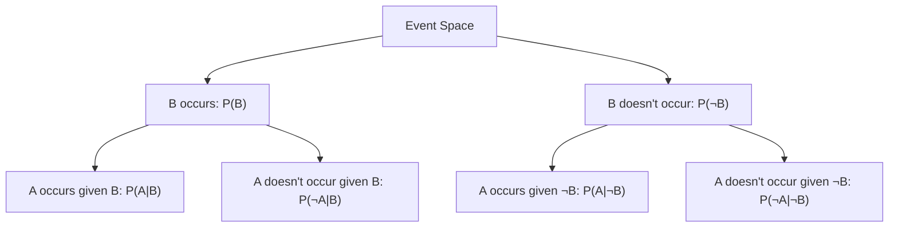

We can extend conditional probability to three or more events by applying the same principle repeatedly:

For three events A, B, and C:

$$P(A|B,C) = \frac{P(A \cap B \cap C)}{P(B \cap C)}$$

This can be rearranged to:

$$P(A \cap B \cap C) = P(A|B,C) \times P(B \cap C)$$

Understanding conditional probability is essential for reasoning about uncertain events and forms the foundation for
more advanced concepts like Bayes' theorem and probabilistic graphical models.

##### Law of Conditional Probability

The law of conditional probability is a fundamental concept that helps us calculate the probability of one event
occurring when we know another event has already occurred.

###### Core Definition

Conditional probability is defined by the formula:

**P(A|B) = P(A ∩ B) / P(B)**

Where:

- **P(A|B)** means "the probability of A given B"
- **P(A ∩ B)** means "the probability of both A and B occurring"
- **P(B)** means "the probability of B occurring"

This formula only works when P(B) > 0, since we can't condition on an impossible event.

###### Intuitive Understanding

Think of conditional probability as focusing on a smaller universe where B has already happened. Within this reduced
space, we ask what portion also includes event A.

For example, if we know a student was accepted to a selective program (event B), how does that change our estimate of
whether they have high test scores (event A)?

###### The Multiplication Rule

We can rearrange the conditional probability formula to get:

**P(A ∩ B) = P(A|B) × P(B)**

This multiplication rule lets us find the probability of two events happening together by first finding the probability
of one event, then multiplying by the conditional probability of the second given the first.

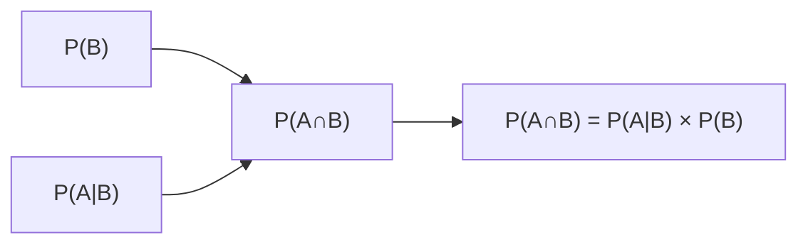

###### Key Properties

1. Like all probabilities, P(A|B) ranges from 0 to 1
2. Generally, P(A|B) is not equal to P(B|A)
3. P(B) must be greater than zero
4. For any fixed event B, the sum of conditional probabilities P(X|B) across all possible outcomes X equals 1

###### Independence

Events A and B are independent if knowing B occurred doesn't change the probability of A. Mathematically:

**If A and B are independent, then P(A|B) = P(A)**

When independence holds, we can simplify to: **P(A ∩ B) = P(A) × P(B)**

This provides a powerful simplification in many probability problems.

###### Chain Rule for Multiple Events

For three events, we can extend our approach:

**P(A,B,C) = P(A|B,C) × P(B|C) × P(C)**

This results from applying the multiplication rule twice:

1. First, P(A,B,C) = P(A|B,C) × P(B,C)
2. Then, substituting P(B,C) = P(B|C) × P(C)

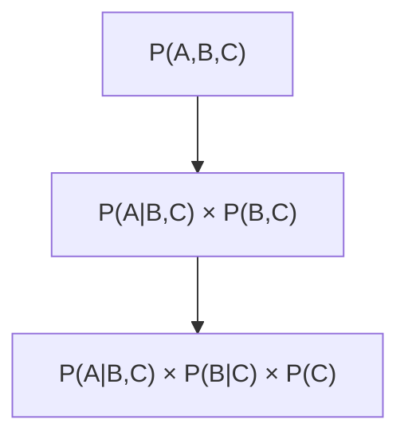

This chain rule forms the mathematical foundation for Bayesian networks and other probabilistic graphical models by
allowing us to break down complex joint probabilities into simpler conditional components.

###### Example Application

Consider a medical test scenario:

- 1% of the population has a certain disease (P(D) = 0.01)
- The test is 95% accurate for detecting the disease (P(T|D) = 0.95)
- The false positive rate is 10% (P(T|not D) = 0.10)

If someone tests positive, what's the probability they actually have the disease?

We need P(D|T), which we can find using conditional probability: P(D|T) = P(T|D) × P(D) / P(T)

Where P(T) = P(T|D) × P(D) + P(T|not D) × P(not D) = 0.95 × 0.01 + 0.10 × 0.99 = 0.0095 + 0.099 = 0.1085

Therefore: P(D|T) = 0.95 × 0.01 / 0.1085 ≈ 0.088 or about 8.8%

This example illustrates how conditional probability helps us update our beliefs based on new evidence—a concept at the
heart of Bayesian reasoning.

The law of conditional probability is a fundamental concept that helps us calculate the probability of one event
occurring when we know another event has already occurred.

###### Core Definition

Conditional probability is defined by the formula:

**P(A|B) = P(A ∩ B) / P(B)**

Where:

- **P(A|B)** means "the probability of A given B"
- **P(A ∩ B)** means "the probability of both A and B occurring"
- **P(B)** means "the probability of B occurring"

This formula only works when P(B) > 0, since we can't condition on an impossible event.

###### Intuitive Understanding

Think of conditional probability as focusing on a smaller universe where B has already happened. Within this reduced
space, we ask what portion also includes event A.

For example, if we know a student was accepted to a selective program (event B), how does that change our estimate of
whether they have high test scores (event A)?

###### The Multiplication Rule

We can rearrange the conditional probability formula to get:

**P(A ∩ B) = P(A|B) × P(B)**

This multiplication rule lets us find the probability of two events happening together by first finding the probability
of one event, then multiplying by the conditional probability of the second given the first.

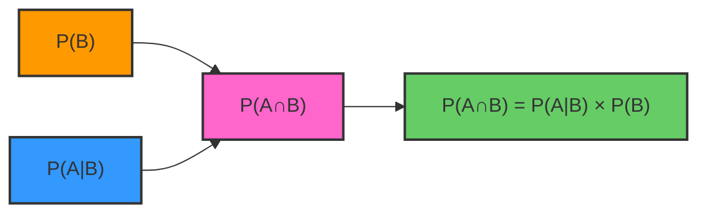

###### Key Properties

1. Like all probabilities, P(A|B) ranges from 0 to 1
2. Generally, P(A|B) is not equal to P(B|A)
3. P(B) must be greater than zero
4. For any fixed event B, the sum of conditional probabilities P(X|B) across all possible outcomes X equals 1

###### Independence

Events A and B are independent if knowing B occurred doesn't change the probability of A. Mathematically:

**If A and B are independent, then P(A|B) = P(A)**

When independence holds, we can simplify to: **P(A ∩ B) = P(A) × P(B)**

This provides a powerful simplification in many probability problems.

###### Chain Rule for Multiple Events

For three events, we can extend our approach:

**P(A,B,C) = P(A|B,C) × P(B|C) × P(C)**

This results from applying the multiplication rule twice:

1. First, P(A,B,C) = P(A|B,C) × P(B,C)
2. Then, substituting P(B,C) = P(B|C) × P(C)

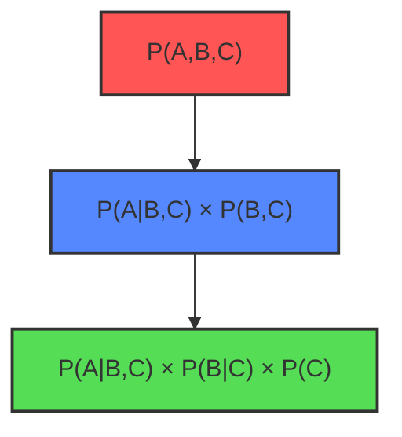

This chain rule forms the mathematical foundation for Bayesian networks and other probabilistic graphical models by
allowing us to break down complex joint probabilities into simpler conditional components.

###### Example Application

Consider a medical test scenario:

- 1% of the population has a certain disease (P(D) = 0.01)
- The test is 95% accurate for detecting the disease (P(T|D) = 0.95)
- The false positive rate is 10% (P(T|not D) = 0.10)

If someone tests positive, what's the probability they actually have the disease?

We need P(D|T), which we can find using conditional probability: P(D|T) = P(T|D) × P(D) / P(T)

Where P(T) = P(T|D) × P(D) + P(T|not D) × P(not D) = 0.95 × 0.01 + 0.10 × 0.99 = 0.0095 + 0.099 = 0.1085

Therefore: P(D|T) = 0.95 × 0.01 / 0.1085 ≈ 0.088 or about 8.8%

This example illustrates how conditional probability helps us update our beliefs based on new evidence—a concept at the
heart of Bayesian reasoning.

##### Law of Total Probability

The Law of Total Probability allows us to calculate the probability of an event by considering all the ways that event
can occur through mutually exclusive pathways. It's particularly useful when we have information about conditional
probabilities but need the overall probability.

For any partition {B₁, B₂, ..., Bₙ} of the sample space (where the Bᵢ are mutually exclusive and exhaustive):

$$P(A) = \sum_{i=1}^{n} P(A|B_i) \times P(B_i)$$

In the simplest case with just two complementary events B and ¬B:

$$P(A) = P(A|B) \times P(B) + P(A|\neg B) \times P(\neg B)$$

This formula tells us that the total probability of A is the weighted sum of conditional probabilities, where the
weights are the probabilities of the conditioning events.

We can derive the Law of Total Probability using basic set theory and the definition of conditional probability:

1. Start with the fact that the events B₁, B₂, ..., Bₙ form a partition of the sample space, meaning:
    - They are mutually exclusive: $B_i \cap B_j = \emptyset$ for i ≠ j
    - They are exhaustive: $B_1 \cup B_2 \cup ... \cup B_n = \Omega$ (the entire sample space)
2. Any event A can be expressed as the union of its intersections with each B₁:
   $A = A \cap \Omega = A \cap (B_1 \cup B_2 \cup ... \cup B_n) = (A \cap B_1) \cup (A \cap B_2) \cup ... \cup (A \cap B_n)$
3. Since these intersections are mutually exclusive, we can add their probabilities:
   $P(A) = P(A \cap B_1) + P(A \cap B_2) + ... + P(A \cap B_n)$
4. Using the definition of conditional probability, $P(A \cap B_i) = P(A|B_i)P(B_i)$:
   $P(A) = P(A|B_1)P(B_1) + P(A|B_2)P(B_2) + ... + P(A|B_n)P(B_n)$
5. Which gives us the Law of Total Probability: $P(A) = \sum_{i=1}^{n} P(A|B_i)P(B_i)$

For example, to find the probability of having a fever, we might consider whether a person has an infection:

$$P(\text{Fever}) = P(\text{Fever}|\text{Infection}) \times P(\text{Infection}) + P(\text{Fever}|\text{No Infection}) \times P(\text{No Infection})$$

If P(Fever|Infection) = 0.9, P(Infection) = 0.1, P(Fever|No Infection) = 0.05, and P(No Infection) = 0.9, then:

$$P(\text{Fever}) = 0.9 \times 0.1 + 0.05 \times 0.9 = 0.09 + 0.045 = 0.135$$

So the overall probability of fever is 13.5%.

The Law of Total Probability also has a conditional form. For any events A and C, and a partition {B, B̄}, we can derive:

$$P(A|C) = P(A|B,C)P(B|C) + P(A|\bar{B},C)P(\bar{B}|C)$$

This allows us to compute conditional probabilities by considering all possible paths through the partition.

The Law of Total Probability is a fundamental principle that allows us to calculate the total probability of an event by
breaking it down across different scenarios. It provides a systematic way to compute probabilities when direct
calculation might be difficult.

###### Core Definition

For any events A and B, and a set of mutually exclusive and exhaustive events {C, ¬C}:

**P(A|B) = P(A|C,B)P(C|B) + P(A|¬C,B)P(¬C|B)**

Where:

- P(A|B) is the total conditional probability of A given B
- {C, ¬C} form a partition of the sample space meaning:
    - They are mutually exclusive: P(C ∩ ¬C) = 0 (they cannot both occur)
    - They are exhaustive: P(C) + P(¬C) = 1 (one of them must occur)
    - Similarly, P(C|B) + P(¬C|B) = 1 (conditioned on B, one must occur)

###### General Form

This extends to any complete partition {C₁, C₂, ..., Cₙ} of the sample space:

**P(A) = ∑ᵢ P(A|Cᵢ)P(Cᵢ)**

Or for conditional probability:

**P(A|B) = ∑ᵢ P(A|Cᵢ,B)P(Cᵢ|B)**

###### Mathematical Derivation

We can derive the Law of Total Probability from first principles:

1. Starting with the definition of conditional probability for P(A|B): **P(A|B) = P(A,B)/P(B)**
2. Since C and ¬C partition the sample space, we can split P(A,B): P(A,B) = P(A,B,C) + P(A,B,¬C)
3. Substituting into our original equation: P(A|B) = [P(A,B,C) + P(A,B,¬C)]/P(B)
4. Applying the chain rule to each term:
    - P(A,B,C) = P(A|B,C)P(B,C) = P(A|B,C)P(C|B)P(B)
    - P(A,B,¬C) = P(A|B,¬C)P(B,¬C) = P(A|B,¬C)P(¬C|B)P(B)
5. Substituting back and simplifying: P(A|B) = [P(A|B,C)P(C|B)P(B) + P(A|B,¬C)P(¬C|B)P(B)]/P(B) P(A|B) =
   P(A|C,B)P(C|B) + P(A|¬C,B)P(¬C|B)

This demonstrates how we express P(A|B) in terms of conditional probabilities involving C and ¬C.

###### Intuitive Understanding

The Law of Total Probability allows us to break down complex probability problems by considering different scenarios
(the Cᵢ events) separately.

Think of it as a weighted average. Each scenario Cᵢ has:

- A probability of occurring: P(Cᵢ)
- A conditional probability of A given that scenario: P(A|Cᵢ)

We multiply these together for each scenario and sum them up to get the total probability of A.

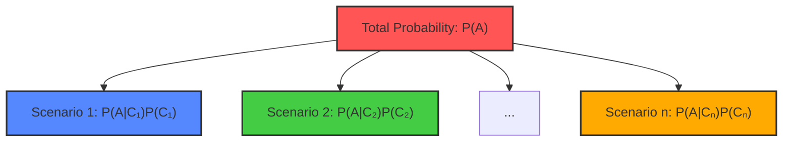

###### Practical Example

Consider a medical diagnosis scenario:

- Let A be "patient has disease"
- Let C be "test is positive" and ¬C be "test is negative"

We know:

- P(C|A) = 0.95 (test sensitivity - 95% of sick people test positive)
- P(¬C|¬A) = 0.90 (test specificity - 90% of healthy people test negative)
- P(A) = 0.01 (disease prevalence - 1% of population has disease)

To find the probability a patient has the disease given a positive test (P(A|C)), we can use Bayes' theorem, but first
we need P(C), which we can calculate using the Law of Total Probability:

P(C) = P(C|A)P(A) + P(C|¬A)P(¬A) = 0.95 × 0.01 + (1-0.90) × (1-0.01) = 0.0095 + 0.10 × 0.99 = 0.0095 + 0.099 = 0.1085

Now we can calculate: P(A|C) = P(C|A)P(A)/P(C) = 0.95 × 0.01/0.1085 ≈ 0.088 or about 8.8%

This example demonstrates how the Law of Total Probability helps us solve real-world probability problems by breaking
them down across different scenarios.

###### Applications in Bayesian Networks

The Law of Total Probability forms the foundation for inference in Bayesian networks, where we often need to marginalize
(sum out) hidden variables. It allows us to compute the probability of evidence by considering all possible
configurations of unobserved variables, weighted by their probabilities.

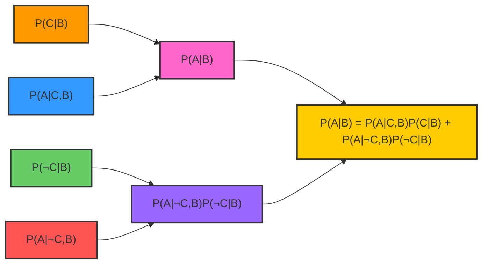

Understanding the Law of Total Probability is crucial for mastering probabilistic reasoning, as it provides a systematic
approach to tackling complex probability questions by breaking them down into manageable components.

##### Chain Rule of Probability

The Chain Rule of Probability, also known as the general product rule, extends the multiplication rule to multiple
events. It provides a way to break down joint probabilities into a product of conditional probabilities:

$$P(A_1, A_2, ..., A_n) = P(A_1) \times P(A_2|A_1) \times P(A_3|A_1, A_2) \times ... \times P(A_n|A_1, A_2, ..., A_{n-1})$$

This rule is crucial for Bayesian networks because it shows how a joint probability distribution can be decomposed into
simpler conditional probabilities.

For example, the joint probability of three events A, B, and C is:

$$P(A, B, C) = P(A) \times P(B|A) \times P(C|A, B)$$

We can prove the Chain Rule by repeatedly applying the definition of conditional probability. Let's start with the
simplest case of two variables:

1. Start with the definition of conditional probability: $$P(A|B) = \frac{P(A,B)}{P(B)}$$
2. Rearranging this equation: $$P(A,B) = P(A|B)P(B)$$

This gives us the Chain Rule for two variables. Now let's extend to three variables:

1. For three variables A, B, and C, start with: $$P(A,B,C) = P(A|B,C)P(B,C)$$
2. Now expand P(B,C) using the rule we just derived for two variables: $$P(B,C) = P(B|C)P(C)$$
3. Substitute this back into our equation from step 3: $$P(A,B,C) = P(A|B,C)P(B|C)P(C)$$

This pattern continues for any number of variables, which we can prove by induction.

The Chain Rule becomes particularly powerful when combined with conditional independence assumptions. If variables are
conditionally independent, we can simplify the expressions.

For example, if A is conditionally independent of B given C, written as A ⊥ B | C, then:

$$P(A|B,C) = P(A|C)$$

This allows us to simplify chain rule expressions. Consider a Bayesian network where:

- A depends on B and C
- B depends on C
- C is a root node

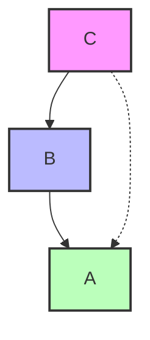

The Chain Rule would give:

$$P(A,B,C) = P(A|B,C) \times P(B|C) \times P(C)$$

If we had additional conditional independence (e.g., if A only depends on B, not on C), we could simplify further:

$$P(A,B,C) = P(A|B) \times P(B|C) \times P(C)$$

In the context of our earlier "Wet Grass" example, we can use the chain rule to express the full joint probability:

$$P(\text{Cloudy}, \text{Rain}, \text{Sprinkler}, \text{Wet}) = P(\text{Cloudy}) \times P(\text{Rain}|\text{Cloudy}) \times P(\text{Sprinkler}|\text{Cloudy}) \times P(\text{Wet}|\text{Rain}, \text{Sprinkler})$$

Note that we exploited the conditional independence of "Rain" and "Sprinkler" given "Cloudy" to simplify the expression.

The Chain Rule of Probability is a fundamental principle that allows us to express joint probabilities as products of
conditional probabilities. This powerful tool helps us break down complex probability scenarios into more manageable
components.

###### Core Definition

For any n events A₁, A₂, ..., Aₙ, the Chain Rule states:

**P(A₁, A₂, ..., Aₙ) = P(A₁) × P(A₂|A₁) × P(A₃|A₁,A₂) × ... × P(Aₙ|A₁,A₂,...,Aₙ₋₁)**

This formula shows that we can decompose the joint probability into a product of conditional probabilities, where each
event is conditioned on all previous events.

###### Mathematical Proof

We can derive the Chain Rule directly from the definition of conditional probability:

1. Starting with two variables and the law of conditional probability:

    P(A|B) = P(A,B)/P(B)

    Rearranging: P(A,B) = P(A|B)P(B)

2. For three variables, we begin with:

    P(A,B,C) = P(A|B,C)P(B,C)

    Here, we're treating (B,C) as a single joint event.

3. We can further expand P(B,C) using the same conditional probability rule:

    P(B,C) = P(B|C)P(C)

4. Substituting this back:

    P(A,B,C) = P(A|B,C)P(B|C)P(C)

This process can be continued for any number of variables, leading to the general form of the Chain Rule.

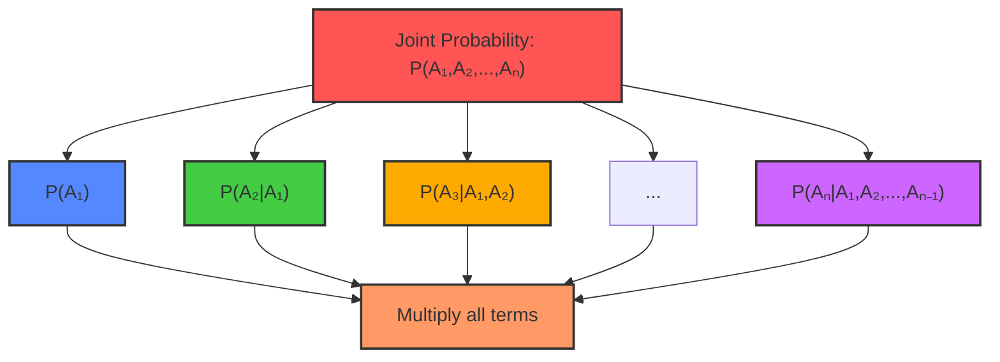

###### Alternative Form

The Chain Rule can also be written in an alternative, yet equivalent form:

**P(A₁,A₂,...,Aₙ) = P(A₁|A₂,...,Aₙ) × P(A₂|A₃,...,Aₙ) × ... × P(Aₙ₋₁|Aₙ) × P(Aₙ)**

This formulation starts by conditioning on the last event and works backward, which can be useful in certain contexts.

###### Chain Rule with Conditioning

The Chain Rule extends naturally to conditional probabilities. For example, for events A, B, C given condition D:

**P(A, B, C | D) = P(A | B, C, D) × P(B | C, D) × P(C | D)**

This formula breaks down the joint conditional probability step by step:

1. **First term - P(C | D)**: The probability of C occurring, given that D has occurred.
2. **Second term - P(B | C, D)**: The probability of B occurring, given that both C and D have occurred.
3. **Third term - P(A | B, C, D)**: The probability of A occurring, given that B, C, and D have all occurred.

This sequential conditioning approach helps us compute complex joint probabilities by breaking them down into simpler
components.

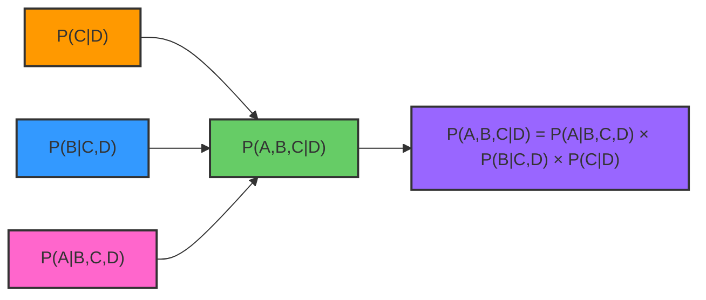

###### Practical Example

Imagine we're modeling the probability of a person's daily activities with events:

- A: Person goes for a run
- B: Person eats breakfast
- C: Person wakes up early
- D: It's a weekday

We want to calculate P(A,B,C|D) - the probability that on a weekday, the person wakes up early, eats breakfast, and goes
for a run.

Using the Chain Rule: P(A,B,C|D) = P(A|B,C,D) × P(B|C,D) × P(C|D)

This allows us to break down our calculation into:

1. P(C|D): Probability of waking up early on a weekday
2. P(B|C,D): Probability of eating breakfast, given they woke up early on a weekday
3. P(A|B,C,D): Probability of going for a run, given they woke up early and ate breakfast on a weekday

Each of these conditional probabilities might be easier to estimate or calculate than trying to determine the joint
probability directly.

###### Significance in Graphical Models

The Chain Rule forms the mathematical foundation for Bayesian networks, where joint distributions are factorized
according to conditional independence relationships represented by a directed acyclic graph. This decomposition
significantly reduces the number of parameters needed to specify complex joint distributions.

By using the Chain Rule in conjunction with conditional independence assumptions, we can represent large,
high-dimensional probability distributions efficiently. For example, in a Bayesian network with n variables, instead of
storing 2ⁿ-1 parameters for the full joint distribution, we only need to store the conditional probability distributions
for each variable given its parents in the graph.

The Chain Rule of Probability is an essential tool that enables us to work with complex probability scenarios by
breaking them down into more manageable components, making it a cornerstone concept in probabilistic reasoning and
graphical models.

##### Bayes' Theorem and Its Applications

Bayes' Theorem is the cornerstone of Bayesian inference. It provides a way to update our beliefs based on new evidence.
The theorem is derived from the definition of conditional probability:

$$P(A|B) = \frac{P(B|A) \times P(A)}{P(B)}$$

Where:

- P(A|B) is the posterior probability: what we want to know after seeing evidence B
- P(B|A) is the likelihood: how probable is the evidence if A is true
- P(A) is the prior probability: our initial belief in A
- P(B) is the evidence: the total probability of observing B

<div align="center">

<p style="color: #555;">Figure: Application of Bayes' Theorem in the Alarm Network</p>
</div>

The denominator $P(B)$ serves as a normalization constant that ensures the posterior probability is a proper probability
(between 0 and 1). We can expand this term using the Law of Total Probability:

$$P(B) = P(B|A) \times P(A) + P(B|\neg A) \times P(\neg A)$$

Where $\neg A$ represents "not A" (the complement of event A).

Substituting this expansion into the original formula:

$$P(A|B) = \frac{P(B|A) \times P(A)}{P(B|A) \times P(A) + P(B|\neg A) \times P(\neg A)}$$

We can prove Bayes' Theorem from the definition of conditional probability:

1. Start with the definition of conditional probability for $P(A|B)$: $$P(A|B) = \frac{P(A \cap B)}{P(B)}$$
2. Similarly, for $P(B|A)$: $$P(B|A) = \frac{P(A \cap B)}{P(A)}$$
3. Rearranging the second equation to solve for $P(A \cap B)$: $$P(A \cap B) = P(B|A) \times P(A)$$
4. Substituting this into the first equation: $$P(A|B) = \frac{P(B|A) \times P(A)}{P(B)}$$

##### Normalizing Bayes' Rule: Mathematical Foundation

The normalization process in Bayes' rule provides a powerful way to compute posterior probabilities without directly
calculating the evidence term. This approach simplifies many practical applications of Bayesian methods.

###### Standard Form of Bayes' Rule

Bayes' rule in its standard form is:

$$P(A|B) = \frac{P(B|A)P(A)}{P(B)}$$

The complementary form for the opposite hypothesis (¬A) is:

$$P(¬A|B) = \frac{P(B|¬A)P(¬A)}{P(B)}$$

###### Introducing Unnormalized Probabilities

We can define unnormalized posterior probabilities (denoted with a prime):

$$P'(A|B) = P(B|A)P(A)$$ $$P'(¬A|B) = P(B|¬A)P(¬A)$$

These represent the numerators in Bayes' rule without dividing by the evidence P(B).

###### The Normalization Constraint

Since A and ¬A form a complete partition of the sample space, we know:

$$P(A|B) + P(¬A|B) = 1$$

This constraint must hold for proper probability distributions.

###### Introducing the Normalization Constant

We can express the normalized probabilities in terms of unnormalized ones using a normalization constant η (eta):

$$P(A|B) = \eta \cdot P'(A|B)$$ $$P(¬A|B) = \eta \cdot P'(¬A|B)$$

Where η acts as a scaling factor that ensures our probabilities sum to 1.

###### Finding the Value of η

Applying our normalization constraint:

$$\eta \cdot P'(A|B) + \eta \cdot P'(¬A|B) = 1$$ $$\eta \cdot [P'(A|B) + P'(¬A|B)] = 1$$
$$\eta = \frac{1}{P'(A|B) + P'(¬A|B)}$$

###### Connection to P(B)

This normalization constant has a direct relationship to P(B):

$$P(B) = P'(A|B) + P'(¬A|B) = P(B|A)P(A) + P(B|¬A)P(¬A)$$

Which means:

$$\eta = \frac{1}{P(B)}$$

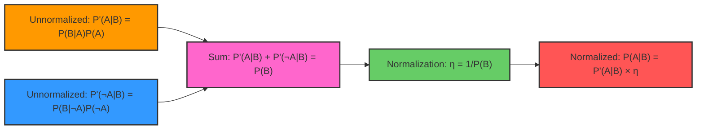

###### Step-by-Step Substitution

Starting with our normalized form:

$$P(A|B) = \eta \cdot P'(A|B)$$

Substituting η:

$$P(A|B) = \frac{P'(A|B)}{P'(A|B) + P'(¬A|B)}$$

Substituting the unnormalized terms:

$$P(A|B) = \frac{P(B|A)P(A)}{P(B|A)P(A) + P(B|¬A)P(¬A)}$$

Since P(B) = P(B|A)P(A) + P(B|¬A)P(¬A), we've arrived back at the original form:

$$P(A|B) = \frac{P(B|A)P(A)}{P(B)}$$

###### Practical Significance

This normalization approach offers several practical advantages:

1. **Computational Efficiency**: We can work with unnormalized probabilities during calculations and normalize only at
   the end.
2. **Classification Tasks**: For binary classification, we can compare unnormalized scores directly - if P'(A|B) >
   P'(¬A|B), then P(A|B) > P(¬A|B).
3. **Avoiding Underflow**: When dealing with many small probabilities (as in Naive Bayes), working with unnormalized
   values helps avoid numerical underflow issues.
4. **Incremental Updates**: In sequential Bayesian updating, this approach simplifies the calculation process.

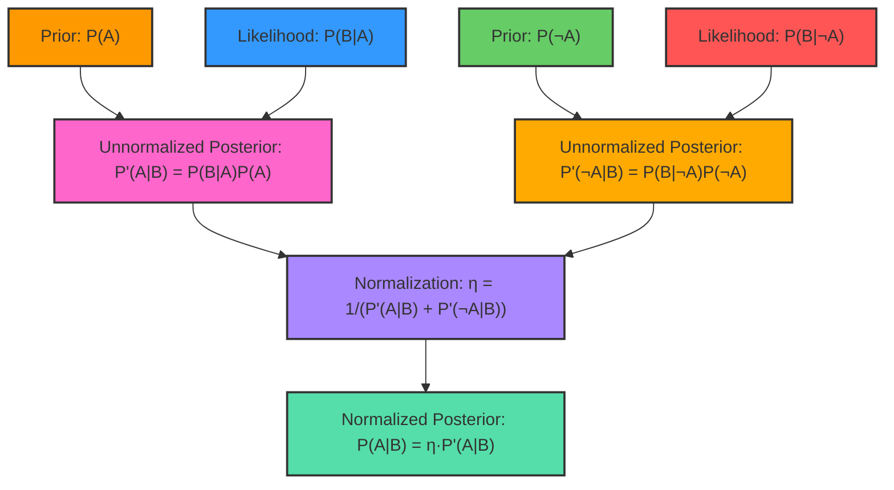

Understanding normalization in Bayes' rule provides insight into why proportional forms are so widely used in practical
Bayesian methods, from simple classifiers to complex graphical models. By separating the unnormalized calculation from
the normalization step, we gain both conceptual clarity and computational advantages.

Bayes' theorem is particularly valuable when we know P(B|A) but need P(A|B) - often the case in diagnostic reasoning.
For example, we might know the probability of a positive test result given a disease, but what we want is the
probability of the disease given a positive test.

A canonical example is medical testing:

- P(Disease) = 0.01 (1% of population has the disease)
- P(Positive|Disease) = 0.95 (test is 95% sensitive)
- P(Positive|No Disease) = 0.05 (test is 95% specific)

Using Bayes' theorem to find P(Disease|Positive):

$$P(\text{Disease}|\text{Positive}) = \frac{P(\text{Positive}|\text{Disease}) \times P(\text{Disease})}{P(\text{Positive})}$$

The denominator can be expanded using the law of total probability:

$$P(\text{Positive}) = P(\text{Positive}|\text{Disease}) \times P(\text{Disease}) + P(\text{Positive}|\text{No Disease}) \times P(\text{No Disease})$$
$$P(\text{Positive}) = 0.95 \times 0.01 + 0.05 \times 0.99 = 0.0095 + 0.0495 = 0.059$$

Now we can calculate:

$$P(\text{Disease}|\text{Positive}) = \frac{0.95 \times 0.01}{0.059} \approx 0.161$$

This means despite the 95% test accuracy, the probability of having the disease given a positive test is only about 16%.
This counter-intuitive result, known as the base rate fallacy, highlights the importance of considering prior
probabilities.

Often in practice, we care more about comparing relative probabilities than calculating exact values. In such cases, we
can use the proportional form of Bayes' Theorem:

$$P(A|B) \propto P(B|A) \times P(A)$$

Where the symbol $\propto$ means "proportional to." This form is particularly useful when we're only interested in which
event is more likely, or when the denominator $P(B)$ is complex to calculate.

This problem illustrates a classic application of Bayes' theorem in medical testing. When disease prevalence is very
low, even highly accurate tests can lead to surprising results.

###### Problem Analysis

Let's clarify the given information:

- S: Patient is sick (has the disease)
- H: Patient is healthy (does not have the disease)
- +: Test result is positive
- -: Test result is negative

Given probabilities:

- Disease prevalence: P(S) = 1/10,000 = 0.0001
- Healthy prevalence: P(H) = 1 - 0.0001 = 0.9999
- Test sensitivity (true positive rate): P(+|S) = 0.99
- False positive rate: P(+|H) = 0.01 (assuming 99% accuracy means both sensitivity and specificity are 99%)

We want to find P(S|+) - the probability that a person actually has the disease given that they tested positive.

###### Solution Using Bayes' Theorem

Bayes' theorem gives us:

$$P(S|+) = \frac{P(+|S) \times P(S)}{P(+)}$$

Where P(+) is the total probability of a positive test result, calculated using the Law of Total Probability:

$$P(+) = P(+|S) \times P(S) + P(+|H) \times P(H)$$

Substituting our values:

$$P(+) = 0.99 \times 0.0001 + 0.01 \times 0.9999 = 0.000099 + 0.009999 = 0.010098$$

Now we can calculate P(S|+):

$$P(S|+) = \frac{0.99 \times 0.0001}{0.010098} = \frac{0.000099}{0.010098} \approx 0.0098 \approx 0.98%$$

This means that even with a positive test result, there's only about a 1% chance that the person actually has the
disease.

###### Intuitive Explanation With Expected Numbers

Let's consider what would happen in a population of 1,000,000 people:

- Number of sick people: 1,000,000 × 0.0001 = 100
- Number of healthy people: 1,000,000 × 0.9999 = 999,900

Of these:

- Sick people with positive tests (true positives): 100 × 0.99 = 99
- Sick people with negative tests (false negatives): 100 × 0.01 = 1
- Healthy people with positive tests (false positives): 999,900 × 0.01 = 9,999
- Healthy people with negative tests (true negatives): 999,900 × 0.99 = 989,901

Total positive test results: 99 + 9,999 = 10,098

Therefore:

- P(S|+) = 99/10,098 ≈ 0.0098 ≈ 0.98%

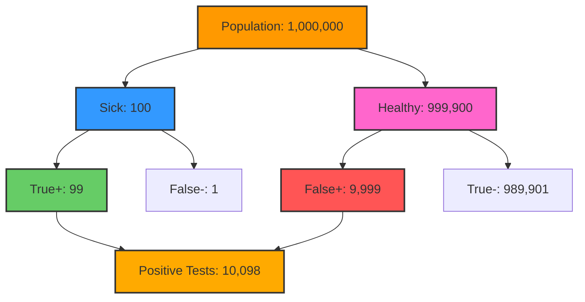

###### Why This Result Is Counterintuitive

This result often surprises people. How can a 99% accurate test give a positive result that's only 1% likely to be
correct? This is known as the "base rate fallacy" or "prevalence effect."

The key insight is that when a disease is very rare (low prevalence), even a small false positive rate can lead to many
more false positives than true positives in absolute numbers.

Let's put it another way: Of all positive test results, the vast majority (9,999 out of 10,098, or about 99%) are false
positives, simply because there are so many more healthy people than sick people in the population.

###### Implications For Medical Testing

This example demonstrates why doctors often:

1. Use multiple tests for rare conditions
2. Only test people with symptoms or risk factors (to increase the pre-test probability)
3. Carefully explain test results in context of disease prevalence

The calculation we performed is critical in medical decision-making, helping doctors understand the true predictive
value of positive test results, especially for rare conditions.

###### Mathematical Formulation

The general form of what we've calculated is:

$$P(S|+) = \frac{P(S)P(+|S)}{P(S)P(+|S) + P(H)P(+|H)}$$

This equation shows that the posterior probability depends on:

1. The prior probability (disease prevalence)
2. The test's sensitivity (true positive rate)
3. The test's false positive rate

When the disease is rare, P(S) is very small, and even with a high sensitivity and low false positive rate, the
posterior probability can remain surprisingly low.

This problem illustrates the critical importance of considering base rates when interpreting test results, a fundamental
concept in probabilistic reasoning and medical diagnostics.

##### Two Test Cancer Example: Applying Bayes' Theorem with Multiple Tests

This example demonstrates how to apply Bayesian reasoning when we have multiple test results for a medical condition.
We'll see how combining test results can significantly change our posterior probability estimates.

###### Problem Setup

We're given a scenario with the following information:

- Prior probability of having cancer: P(C) = 0.01 (1%)
- Prior probability of not having cancer: P(¬C) = 0.99 (99%)
- Test reliability when cancer is present: P(+|C) = 0.9 (90% sensitivity)
- Test reliability when cancer is absent: P(-|¬C) = 0.8 (80% specificity)

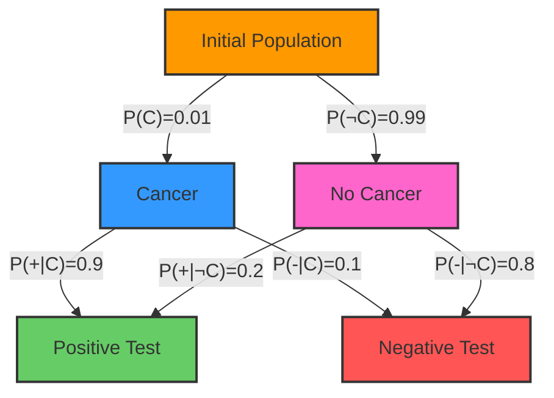

###### Calculating P(C|++) - Two Positive Tests

When both tests come back positive, we need to calculate P(C|T₁=+,T₂=+), or P(C|++) for short.

Using Bayes' Theorem and assuming independence between tests (the "naive" assumption):

$$P(C|++) = \frac{P(++|C)P(C)}{P(++)}$$

Where:

- P(++|C) = P(+|C) × P(+|C) = 0.9 × 0.9 = 0.81
- P(++|¬C) = P(+|¬C) × P(+|¬C) = 0.2 × 0.2 = 0.04
- P(++) = P(++|C)P(C) + P(++|¬C)P(¬C) = 0.81 × 0.01 + 0.04 × 0.99 = 0.0081 + 0.0396 = 0.0477

Therefore: $$P(C|++) = \frac{0.81 \times 0.01}{0.0477} = \frac{0.0081}{0.0477} = 0.1698$$

This means if both tests come back positive, the probability of having cancer rises from 1% to approximately 17%.

###### Using Unnormalized Probabilities

We can simplify this calculation using unnormalized probabilities (P'):

$$P'(C) = P(C) \times P(+|C) \times P(+|C) = 0.01 \times 0.9 \times 0.9 = 0.0081$$
$$P'(¬C) = P(¬C) \times P(+|¬C) \times P(+|¬C) = 0.99 \times 0.2 \times 0.2 = 0.0396$$

Then normalize:
$$P(C|++) = \frac{P'(C)}{P'(C) + P'(¬C)} = \frac{0.0081}{0.0081 + 0.0396} = \frac{0.0081}{0.0477} = 0.1698$$

###### Calculating P(C|+-) - Mixed Test Results

When the first test is positive but the second is negative, we calculate P(C|T₁=+,T₂=-), or P(C|+-):

$$P'(C) = P(C) \times P(+|C) \times P(-|C) = 0.01 \times 0.9 \times 0.1 = 0.0009$$
$$P'(¬C) = P(¬C) \times P(+|¬C) \times P(-|¬C) = 0.99 \times 0.2 \times 0.8 = 0.1584$$

Normalizing: $$P(C|+-) = \frac{0.0009}{0.0009 + 0.1584} = \frac{0.0009}{0.1593} = 0.0056$$

This shows that with mixed test results, the probability of having cancer drops to just 0.56%.

###### Summary Table

```
     Prior   +     -     P'(C|+-)    P(C|+-)
C    0.01   0.9   0.1    0.0009      0.0056
¬C   0.99   0.2   0.8    0.1584      0.9944
                         0.1593        1.0
```

###### Understanding the Mathematics

These calculations are applications of Bayes' Theorem with multiple pieces of evidence. The key steps are:

1. Original Bayes' Theorem: $$P(C|T₁,T₂) = \frac{P(T₁,T₂|C)P(C)}{P(T₁,T₂)}$$
2. Naive independence assumption: $$P(T₁,T₂|C) = P(T₁|C) \times P(T₂|C)$$
3. Total probability formula for denominator: $$P(T₁,T₂) = P(T₁,T₂|C)P(C) + P(T₁,T₂|¬C)P(¬C)$$
4. Combined form:
   $$P(C|T₁=+,T₂=+) = \frac{P(+|C) \times P(+|C) \times P(C)}{P(+|C) \times P(+|C) \times P(C) + P(+|¬C) \times P(+|¬C) \times P(¬C)}$$
5. Simplified with unnormalized probabilities: $$P(C|T₁=+,T₂=+) = \frac{P'(C)}{P'(C) + P'(¬C)}$$

###### Predicting the Second Test Result

We can also calculate the probability of the second test being positive if we already know the first test was positive:

$$P(T₂=+ | T₁=+) = P(T₂=+|T₁=+,C)P(C|T₁=+) + P(T₂=+|T₁=+,¬C)P(¬C|T₁=+)$$

Due to our independence assumption:

- P(T₂=+|T₁=+,C) = P(T₂=+|C) = 0.9
- P(T₂=+|T₁=+,¬C) = P(T₂=+|¬C) = 0.2

First, we need P(C|T₁=+):
$$P(C|T₁=+) = \frac{P(T₁=+|C)P(C)}{P(T₁=+|C)P(C) + P(T₁=+|¬C)P(¬C)} = \frac{0.9 \times 0.01}{0.9 \times 0.01 + 0.2 \times 0.99} = \frac{0.009}{0.207} \approx 0.0435$$

Therefore, P(¬C|T₁=+) = 1 - 0.0435 = 0.9565

Now, we calculate: $$P(T₂=+ | T₁=+) = 0.9 \times 0.0435 + 0.2 \times 0.9565 = 0.03915 + 0.1913 = 0.23045 \approx 0.23$$

This means there's about a 23% chance the second test will be positive, given that the first test was positive.

###### Clinical Implications

This example highlights several important points about medical testing:

1. **Base Rate Consideration**: Even with two positive tests, the probability of cancer only rises to about 17% because
   the initial prevalence is very low (1%).
2. **Test Agreement Matters**: When tests agree (both positive), the posterior probability shifts more dramatically than
   with mixed results.
3. **Independence Assumption**: Our calculations assume tests are conditionally independent given disease status, which
   may not always be true in reality.
4. **Sequential Testing Impact**: The first positive test raises cancer probability to about 4.35%, and this becomes our
   new prior when evaluating the second test.

This example demonstrates why medical professionals must interpret test results in the context of prior probabilities
and understand how multiple test results can be combined to improve diagnostic accuracy.

##### Independence and Conditional Independence

Two events A and B are independent if the occurrence of one doesn't affect the probability of the other:

$$P(A|B) = P(A)$$

Equivalently:

$$P(A \cap B) = P(A) \times P(B)$$

Independence is a powerful simplifying assumption in probabilistic models. When events are independent, we can simply
multiply their probabilities to find joint probabilities.

Conditional independence is a more nuanced concept. Events A and B are conditionally independent given event C if, once
we know C has occurred, information about B doesn't change our beliefs about A:

$$P(A|B,C) = P(A|C)$$

This is written as A ⊥ B | C (A is independent of B given C).

Conditional independence is central to Bayesian networks. In the network structure, a node is conditionally independent
of its non-descendants given its parents. This property enables the compact factorization of joint distributions.

Consider three types of conditional independence patterns in Bayesian networks:

1. **Causal chain (A → B → C)**:
    - A and C are dependent
    - A and C are conditionally independent given B
    - Example: Disease → Symptom → Treatment
2. **Common cause (A ← B → C)**:
    - A and C are dependent
    - A and C are conditionally independent given B
    - Example: Fever ← Infection → Cough
3. **Common effect (A → C ← B)**:
    - A and B are independent
    - A and B are conditionally dependent given C (explaining away)
    - Example: Rain → Wet Grass ← Sprinkler

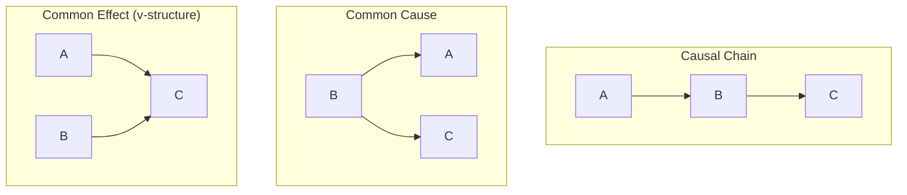

The v-structure (common effect) exhibits a particularly interesting property called "explaining away." If we observe the
effect C, then learning about cause A changes our beliefs about cause B, even though A and B were initially independent.
For example, if we know the grass is wet and we learn it rained, the probability of the sprinkler having been on
decreases.

Understanding these patterns of independence is crucial for both constructing Bayesian networks and performing efficient
inference in them. The conditional independence relationships encoded in the network structure allow us to reduce the
number of parameters needed and enable more efficient algorithms for probabilistic reasoning.

It's important to understand that absolute independence and conditional independence don't imply each other:

1. **A ⊥ B does not imply A ⊥ B|C**: Variables that are absolutely independent can become dependent when conditioning on
   another variable.
2. **A ⊥ B|C does not imply A ⊥ B**: Variables that are conditionally independent given C might still be dependent when
   considered without C.

These relationships underscore the complex ways that information can flow through probabilistic models, and they form
the foundation for understanding the behavior of Bayesian networks in practice.

I'll rewrite the document to improve clarity and explanation while keeping all your original content, using the heading
structure you specified.

##### Absolute and Conditional Independence in Probability Theory

Independence is a fundamental concept in probability theory that helps us understand relationships between random
variables. Let's explore both absolute and conditional independence.

###### Core Independence Concepts

In probability theory, we use the symbol ⊥ (inverted T) to represent independence:

- A ⊥ B means "A is independent of B"
    - Mathematically: P(A|B) = P(A) or equivalently P(A,B) = P(A)P(B)
- A ⊥ B|C means "A is conditionally independent of B given C"
    - Mathematically: P(A|B,C) = P(A|C) or P(A,B|C) = P(A|C)P(B|C)

###### Important Relationships

Two critical facts about independence relationships:

- A ⊥ B → A ⊥ B|C False [X]
- A ⊥ B|C → A ⊥ B False [X]

This means that absolute independence does not imply conditional independence, and conditional independence does not
imply absolute independence.

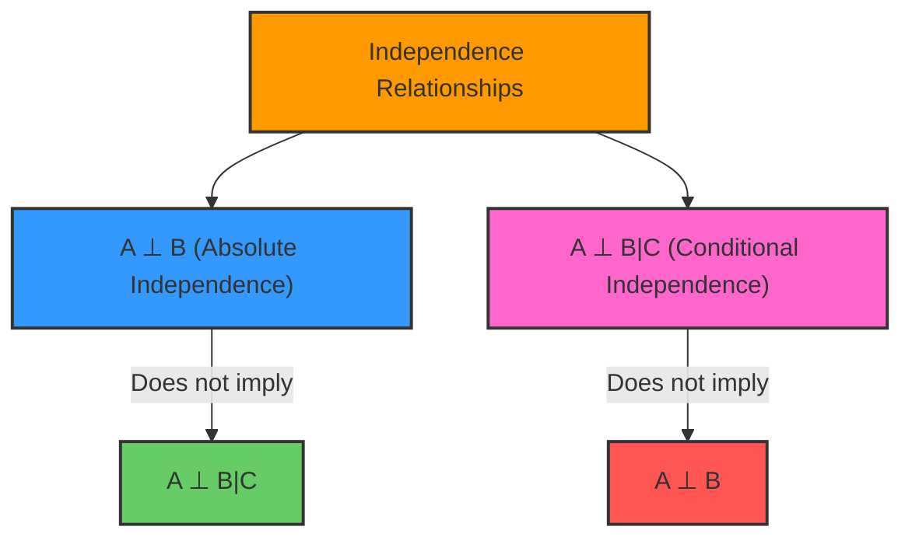

###### Real-World Examples

Example 1: Weather Protection

- A = "Taking an umbrella"
- B = "Wearing a raincoat"
- C = "It's raining"

Initially, your choice of taking an umbrella might be independent of wearing a raincoat (A ⊥ B). But if you know it's
raining (conditioning on C), these choices become dependent because people tend to use either one or both when it rains.
This phenomenon is known as "explaining away."

Example 2: Building Safety Systems

- A = "Fire alarm going off"
- B = "Sprinklers activated"
- C = "Fire in building"

Given that we know there's a fire (C), the fire alarm and sprinklers might activate independently (A ⊥ B|C). But without
knowing about the fire, seeing the sprinklers on makes the fire alarm more likely (and vice versa), so A and B are not
independent.

###### Implications for Bayesian Networks

These independence relationships are crucial in Bayesian networks:

- Variables can be dependent but conditionally independent
- Variables can be independent but conditionally dependent
- Having a common cause (C) can create dependencies between otherwise independent variables

###### Inference Algorithms in Bayesian Networks

There are two algorithms to compute exact inferences:

1. Enumeration: The query's conditional probability is computed by summing the terms from the full joint distribution.
2. Variable Elimination: An algorithm to reduce the enumeration computation by doing the repeated calculations once and
   storing the results for later re-use.

However, it is computationally expensive to make exact inference from a large and highly connected Bayes Network. In
these cases, we can approximate inferences by sampling. Sampling is a technique to select and count the occurrences of
the query and evidence variables to estimate the probability distributions in the network.

###### Sampling Techniques

We can use four sampling techniques:

1. Direct sampling: The simplest form of samples generation from a known probability distribution. For example, to
   sample the odds of Head or Tail in a coin flip, we can randomly generate the events based on uniform probability
   distribution (assuming we use a non-bias coin).
2. Rejection sampling: Generates samples from the known distribution in the network and rejects the non-matching
   evidence.
3. Likelihood sampling: Is similar to rejection sampling but generating only events that are consistent with the
   evidence.
4. Gibbs sampling: Initiates an arbitrary state and generates the next state by randomly sampling a non-evidence
   variable, while keeping all evidence variables fixed.

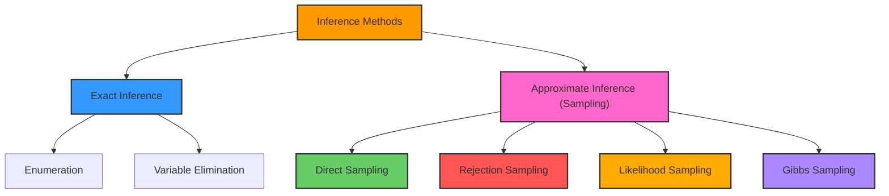

###### Application to Medical Testing

In our specific case with cancer (C) and two test results (T1 and T2), we have using chain rule of probability:

$$P(C, T1=+, T2=+) = P(C) \times P(T1=+|C) \times P(T2=+|C,T1=+)$$

However, we typically assume that the test results are conditionally independent given the disease status. This means
that knowing the result of one test doesn't affect the probability of the result of the other test, given that we know
whether the person has cancer or not. Under this assumption:

$$P(T2=+|C,T1=+) = P(T2=+|C)$$

Which is why we can simplify to:

$$P(C, T1=+, T2=+) = P(C) \times P(T1=+|C) \times P(T2=+|C)$$

This assumption of conditional independence is common in many probabilistic models, including Naive Bayes classifiers,
but it's important to recognize that it's an assumption that may not always hold in real-world scenarios.

###### Bayes' Theorem Applied to Multiple Tests

General form of Bayes' theorem:

$$P(A|B) = \frac{P(B|A) \times P(A)}{P(B)}$$

In our specific case:

$$P(C|T1=+,T2=+) = \frac{P(T1=+,T2=+|C) \times P(C)}{P(T1=+,T2=+)}$$

Where:

- A is C (having cancer)
- B is (T1=+,T2=+) (both tests being positive)

Breaking it down further:

1. P(T1=+,T2=+|C) × P(C) is equivalent to P(C,T1=+,T2=+), by the chain rule of probability:

    $$P(C,T1=+,T2=+) = P(T1=+,T2=+|C) \times P(C)$$

2. P(T1=+,T2=+) in the denominator can be expanded using the law of total probability. The Law of Total Probability
   states that for any event B and a set of mutually exclusive and exhaustive events A₁, A₂, ..., Aₙ:

    $$P(B) = P(B|A₁)P(A₁) + P(B|A₂)P(A₂) + ... + P(B|Aₙ)P(Aₙ)$$

    So, we find:

    $$P(T1=+,T2=+) = P(T1=+,T2=+|C) \times P(C) + P(T1=+,T2=+|¬C) \times P(¬C)$$

So, the full expansion of the formula in terms of the general Bayes' theorem would be:

$$P(C|T1=+,T2=+) = \frac{P(T1=+,T2=+|C) \times P(C)}{P(T1=+,T2=+)}$$

$$P(C|T1=+,T2=+) = \frac{P(C,T1=+,T2=+)}{P(T1=+,T2=+)}$$

###### Fundamental Connection to Conditional Probability

This is a direct application of the definition of conditional probability:

For any events X and Y: P(X|Y) = P(X,Y)/P(Y)

In our case:

- X is the event C (having cancer)
- Y is the joint event (T1=+,T2=+)

We can rewrite the equation for 3 events A, B, and C as:

$$P(C|A,B) = \frac{P(C,A,B)}{P(A,B)}$$

This form directly shows how we're updating our prior belief P(C) based on the likelihood of the test results given
cancer P(T1=+,T2=+|C) and normalizing it by the total probability of getting these test results.

#### Working with Probability Distributions

##### Discrete Probability Distributions

Discrete probability distributions model random variables that can take only distinct, separate values. These are
fundamental building blocks for probabilistic graphical models, especially when modeling categorical variables like
disease states, weather conditions, or parts of speech.

A discrete probability distribution assigns a probability to each possible value of the random variable, with the total
probability summing to 1. For a random variable X with possible values {x₁, x₂, ..., xₙ}, the probability mass function
P(X) must satisfy:

1. Non-negativity: P(X = xᵢ) ≥ 0 for all i
2. Normalization: ∑ᵢ P(X = xᵢ) = 1

Common discrete distributions include:

- **Bernoulli distribution**: Models a binary outcome (success/failure) with probability p of success
    - P(X = 1) = p
    - P(X = 0) = 1-p
    - Example: Modeling whether a patient has a disease
- **Binomial distribution**: Models the number of successes in n independent Bernoulli trials
    - P(X = k) = (n choose k) × pᵏ × (1-p)ⁿ⁻ᵏ
    - Example: Number of patients who recover out of 10 treated
- **Categorical distribution**: Generalizes Bernoulli to more than two outcomes
    - P(X = xᵢ) = pᵢ where ∑ᵢ pᵢ = 1
    - Example: Modeling parts of speech (noun, verb, adjective, etc.)

In Bayesian networks, each node typically has a discrete probability distribution conditioned on its parents. For root
nodes, we specify a prior distribution; for child nodes, we specify a conditional distribution for each combination of
parent values.

For example, in our alarm Bayesian network, the "Alarm" node has a conditional probability distribution P(Alarm |
Burglary, Earthquake) that specifies the probability of the alarm being triggered for each combination of its parent
values (whether a burglary occurred and whether there was an earthquake).

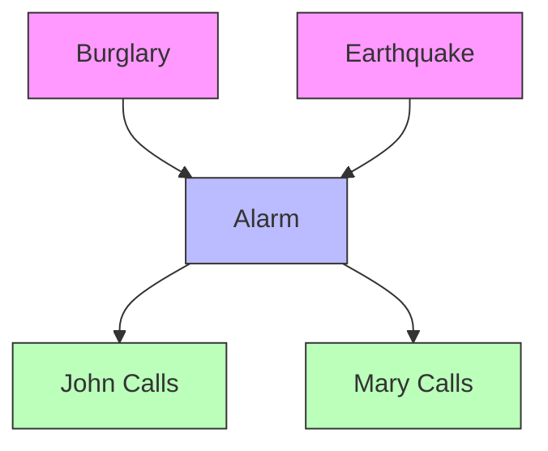

In this network, each node has a discrete distribution:

- Burglary: Bernoulli (yes/no)
- Earthquake: Bernoulli (yes/no)
- Alarm: Conditional Bernoulli given Burglary and Earthquake
- John Calls: Conditional Bernoulli given Alarm
- Mary Calls: Conditional Bernoulli given Alarm

The power of discrete distributions lies in their simplicity and interpretability, making them ideal for modeling many
real-world phenomena in a probabilistic graphical framework.

##### Joint and Marginal Probabilities

Joint probability distributions model the probabilities of multiple random variables simultaneously. For two discrete
random variables X and Y, the joint distribution P(X,Y) gives the probability of each combination of values (x,y).

For example, in a medical diagnosis context, we might have:

```
P(Disease=present, Symptom=present) = 0.08
P(Disease=present, Symptom=absent) = 0.02
P(Disease=absent, Symptom=present) = 0.12
P(Disease=absent, Symptom=absent) = 0.78
```

This joint distribution contains complete information about the probabilistic relationship between Disease and Symptom.
From it, we can derive marginal and conditional distributions.

The marginal distribution of a single variable is obtained by summing over all values of the other variables. For
example:

$$P(X = x) = \sum_y P(X = x, Y = y)$$

Using our example:

$$P(\text{Disease=present}) = P(\text{Disease=present, Symptom=present}) + P(\text{Disease=present, Symptom=absent}) = 0.08 + 0.02 = 0.10$$

$$P(\text{Symptom=present}) = P(\text{Disease=present, Symptom=present}) + P(\text{Disease=absent, Symptom=present}) = 0.08 + 0.12 = 0.20$$

Marginalization is a fundamental operation in probabilistic inference. When we have evidence about some variables in a
Bayesian network and want to infer others, we often need to sum out (marginalize) the hidden variables.

For multiple variables, the joint distribution grows exponentially with the number of variables. For n binary variables,
we need 2ⁿ values to specify the full joint distribution. This is where Bayesian networks become powerful: they allow us
to represent the joint distribution more compactly by exploiting conditional independence relationships.

<div align="center">

<p style="color: #555;">Figure: Joint probability distribution factored according to a Bayesian network</p>
</div>

In the alarm network above, the full joint distribution P(Burglary, Earthquake, Alarm, JohnCalls, MaryCalls) would
require 2⁵ = 32 parameters. However, using the factorization provided by the Bayesian network structure, we only need
1 + 1 + 4 + 2 + 2 = 10 parameters, a significant reduction in complexity.

##### Calculating Conditional Probabilities

Conditional probabilities can be derived from joint probabilities using the definition:

$$P(X|Y) = \frac{P(X,Y)}{P(Y)}$$

For each value y of Y, P(X|Y=y) is a probability distribution over X. Continuing our medical example:

$$P(\text{Disease=present}|\text{Symptom=present}) = \frac{P(\text{Disease=present, Symptom=present})}{P(\text{Symptom=present})}$$

$$P(\text{Disease=present}|\text{Symptom=present}) = \frac{0.08}{0.08 + 0.12} = \frac{0.08}{0.20} = 0.40$$

This tells us that if a patient has the symptom, there's a 40% chance they have the disease.

In Bayesian networks, conditional probability tables (CPTs) explicitly represent these conditional distributions. For
each node, its CPT specifies the distribution over its values for each combination of parent values.

For example, in our alarm network, the CPT for the Alarm node might look like:

| Burglary | Earthquake | P(Alarm=true) | P(Alarm=false) |
| -------- | ---------- | ------------- | -------------- |
| true     | true       | 0.95          | 0.05           |
| true     | false      | 0.94          | 0.06           |
| false    | true       | 0.29          | 0.71           |
| false    | false      | 0.001         | 0.999          |

This table shows, for instance, that when both a burglary and an earthquake occur, there's a 95% chance the alarm will
sound.

Note that while we can calculate conditional probabilities from joint probabilities, a key insight of Bayesian networks
is that we can reconstruct the full joint distribution if we know the conditional probabilities following the network
structure:

$$P(X_1, X_2, ..., X_n) = \prod_{i=1}^{n} P(X_i | \text{Parents}(X_i))$$

This allows us to compute any conditional probability query by first computing the relevant joint probabilities and then
normalizing.

##### Normalization Methods

Normalization is a fundamental operation in Bayesian inference. When updating beliefs based on evidence, we often first
calculate proportional probabilities (unnormalized) and then normalize them to ensure they sum to 1.

For a discrete probability distribution P'(X) that is proportional to the true distribution P(X), we normalize by
dividing by the sum:

$$P(X = x_i) = \frac{P'(X = x_i)}{\sum_j P'(X = x_j)}$$

The normalization factor, often denoted by α or η, is just the reciprocal of this sum:

$$P(X = x_i) = \alpha \times P'(X = x_i) \text{ where } \alpha = \frac{1}{\sum_j P'(X = x_j)}$$

This process appears frequently in Bayesian inference. When applying Bayes' theorem:

$$P(A|B) = \frac{P(B|A)P(A)}{P(B)}$$

We can compute P(B|A)P(A) for each value of A, and then normalize to find P(A|B).

Let's derive the normalization constant step by step using Bayes' Rule for a binary variable A. We start with the
unnormalized forms:

$$P'(A|B) = P(B|A)P(A)$$ $$P'(\neg A|B) = P(B|\neg A)P(\neg A)$$

Where P' indicates unnormalized probabilities.

Since probabilities must sum to 1: $$P(A|B) + P(\neg A|B) = 1$$

If we define a normalization constant η: $$P(A|B) = \eta \times P'(A|B)$$ $$P(\neg A|B) = \eta \times P'(\neg A|B)$$

Then: $$\eta \times P'(A|B) + \eta \times P'(\neg A|B) = 1$$ $$\eta \times [P'(A|B) + P'(\neg A|B)] = 1$$
$$\eta = \frac{1}{P'(A|B) + P'(\neg A|B)}$$ $$\eta = \frac{1}{P(B|A)P(A) + P(B|\neg A)P(\neg A)}$$
$$\eta = \frac{1}{P(B)}$$

This shows that η = 1/P(B), confirming that our normalization approach is consistent with Bayes' Theorem.

Example: Consider a simple diagnostic test for a disease with:

- Prior: P(Disease) = 0.01
- Likelihood: P(Positive|Disease) = 0.95, P(Positive|No Disease) = 0.05

For a positive test result:

1. Unnormalized posterior:
    - P'(Disease|Positive) = P(Positive|Disease) × P(Disease) = 0.95 × 0.01 = 0.0095
    - P'(No Disease|Positive) = P(Positive|No Disease) × P(No Disease) = 0.05 × 0.99 = 0.0495
2. Normalization:
    - Sum = 0.0095 + 0.0495 = 0.059
    - P(Disease|Positive) = 0.0095 / 0.059 ≈ 0.161
    - P(No Disease|Positive) = 0.0495 / 0.059 ≈ 0.839

This approach of calculating unnormalized posteriors and then normalizing is often more practical than directly
computing the denominator in Bayes' theorem, especially in complex models with many variables.

##### Complex Probability Examples

Let's examine a more complex example that integrates multiple concepts: the famous "Monty Hall problem."

In this game show scenario:

- There are three doors (A, B, C)
- A car is behind one door, goats behind the others
- The contestant picks a door, e.g., door A
- The host (who knows where the car is) opens another door with a goat, e.g., door C
- The contestant can stick with door A or switch to door B
- The question is: Should they switch?

We can solve this using Bayes' theorem:

Let:

- Cₐ = Car is behind door A
- Cᵦ = Car is behind door B
- Cᶜ = Car is behind door C
- H₍c₎ = Host opens door C

We want to compare P(Cₐ|H₍c₎) versus P(Cᵦ|H₍c₎)

For P(Cₐ|H₍c₎): $$P(C_a|H_{(c)}) = \frac{P(H_{(c)}|C_a) \times P(C_a)}{P(H_{(c)})}$$

- P(Cₐ) = 1/3 (prior)
- P(H₍c₎|Cₐ) = 1/2 (host chooses randomly between B and C)
- P(H₍c₎) = normalization factor

For P(Cᵦ|H₍c₎): $$P(C_b|H_{(c)}) = \frac{P(H_{(c)}|C_b) \times P(C_b)}{P(H_{(c)})}$$

- P(Cᵦ) = 1/3 (prior)
- P(H₍c₎|Cᵦ) = 1 (host must choose C)
- P(H₍c₎) = same normalization factor

Comparing the unnormalized posteriors:

- P'(Cₐ|H₍c₎) = 1/2 × 1/3 = 1/6
- P'(Cᵦ|H₍c₎) = 1 × 1/3 = 1/3

After normalization:

- P(Cₐ|H₍c₎) = 1/3
- P(Cᵦ|H₍c₎) = 2/3

Therefore, switching doubles the probability of winning!

Another compelling example is the "Two-Test Cancer Scenario":

A patient takes two tests for a rare disease (1% prevalence). Each test is 90% sensitive (90% true positive rate) and
80% specific (80% true negative rate). Both tests come back positive.

What is the probability the patient has the disease?

Using Bayes' theorem with multiple pieces of evidence:

$$P(C|T_1=+,T_2=+) = \frac{P(T_1=+,T_2=+|C) \times P(C)}{P(T_1=+,T_2=+)}$$

Assuming the tests are conditionally independent given disease status:

$$P(T_1=+,T_2=+|C) = P(T_1=+|C) \times P(T_2=+|C) = 0.9 \times 0.9 = 0.81$$
$$P(T_1=+,T_2=+|¬C) = P(T_1=+|¬C) \times P(T_2=+|¬C) = 0.2 \times 0.2 = 0.04$$

Calculating the unnormalized posterior:

- P'(C|T₁=+,T₂=+) = 0.81 × 0.01 = 0.0081
- P'(¬C|T₁=+,T₂=+) = 0.04 × 0.99 = 0.0396

After normalization:

- P(C|T₁=+,T₂=+) = 0.0081 / (0.0081 + 0.0396) ≈ 0.17

Despite two positive tests, the post-test probability is only 17% due to the low prevalence of the disease. This
illustrates the challenge of diagnostic testing for rare conditions and the importance of considering both
sensitivity/specificity and base rates.

Let's consider one more complex example: the "Office Attendance and Clothing Color" problem:

Alex comes to the office 3 days a week and Brenda comes to the office 1 day a week. We observed a person wearing a red
sweater. Alex wears red 2 times a week and Brenda wears red 3 times a week. The scenario assumes they work remotely from
home the rest of the days and can wear red even when working from home.

Information:

- Alex: Comes to office 3/5 days = 0.6 (Prior P(A))
- Alex: Wears red 2/5 times = 0.4 (P(R|A))
- Brenda: Comes to office 1/5 days = 0.2 (Prior P(B))
- Brenda: Wears red 3/5 times = 0.6 (P(R|B))
- Red wearing is independent of office attendance

We need to find P(A|R) - the probability it was Alex given we observed a red sweater.

Using Bayes' Theorem: $$P(A|R) = \frac{P(R|A) \times P(A)}{P(R)}$$

Where the denominator P(R) is calculated using the Law of Total Probability:
$$P(R) = P(R|A) \times P(A) + P(R|B) \times P(B)$$ $$P(R) = 0.4 \times 0.6 + 0.6 \times 0.2 = 0.24 + 0.12 = 0.36$$

Now we can calculate: $$P(A|R) = \frac{0.4 \times 0.6}{0.36} = \frac{0.24}{0.36} = \frac{2}{3} \approx 66.7%$$

This means there's a 66.7% probability that the person we saw wearing red was Alex.

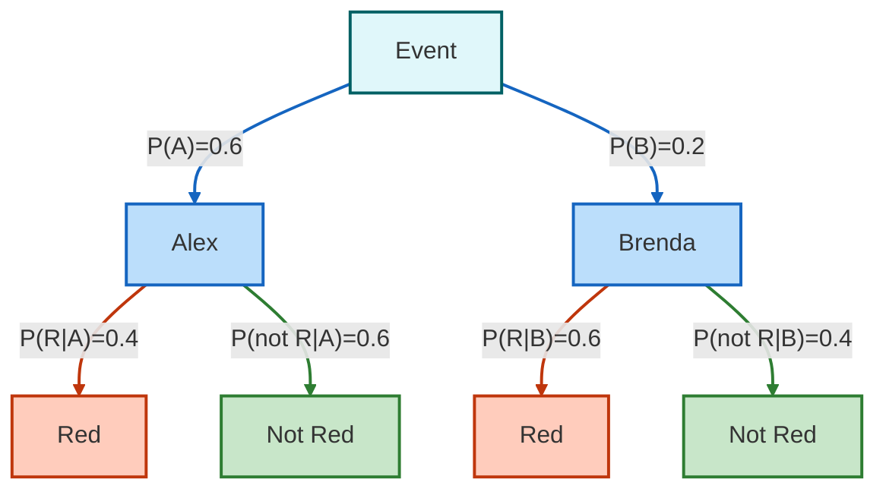

These examples demonstrate how probability theory provides a rigorous framework for reasoning under uncertainty,
especially when dealing with multiple sources of evidence or counterintuitive situations. The principles of conditional
probability, Bayes' theorem, and normalization give us powerful tools to update our beliefs as new evidence arrives,
making them essential for both probabilistic graphical models and real-world decision making.

This problem requires us to determine the probability that a person wearing a red sweater at the office is Alex, given
the information we have about both Alex and Brenda's office attendance and clothing habits.

###### Problem Analysis

Let's clarify the given information:

For Alex (A):

- Comes to office 3 days out of 5 work days: P(A) = 3/5 = 0.6
- Wears red 2 days out of 5: P(R|A) = 2/5 = 0.4
- Red sweater wearing is independent of office attendance

For Brenda (B):

- Comes to office 1 day out of 5 work days: P(B) = 1/5 = 0.2
- Wears red 3 days out of 5: P(R|B) = 3/5 = 0.6
- Red sweater wearing is independent of office attendance

I notice that we need to adjust the initial probabilities, as it appears there's a discrepancy in the setup:

- If Alex comes 3/5 days and Brenda comes 1/5 days, P(A) = 0.6 and P(B) = 0.2
- However, if we're looking at conditional probability given someone was at the office, we need to normalize these
  values:
    - P(A) = 3/(3+1) = 3/4 = 0.75
    - P(B) = 1/(3+1) = 1/4 = 0.25

This adjustment makes sense because we're given the condition that we saw a person at the office, so we're working
within the subset of events where either Alex or Brenda is present at the office.

###### Solution Using Bayes' Theorem

We want to find P(A|R) - the probability it was Alex given we saw someone wearing red.

Bayes' Theorem states:

$$P(A|R) = \frac{P(R|A) \times P(A)}{P(R)}$$

Where P(R) is the total probability of seeing red, calculated using the Law of Total Probability:

$$P(R) = P(R|A) \times P(A) + P(R|B) \times P(B)$$

Substituting our values:

$$P(R) = 0.4 \times 0.75 + 0.6 \times 0.25 = 0.3 + 0.15 = 0.45$$

Now we can calculate P(A|R):

$$P(A|R) = \frac{0.4 \times 0.75}{0.45} = \frac{0.3}{0.45} = \frac{2}{3} \approx 66.7%$$

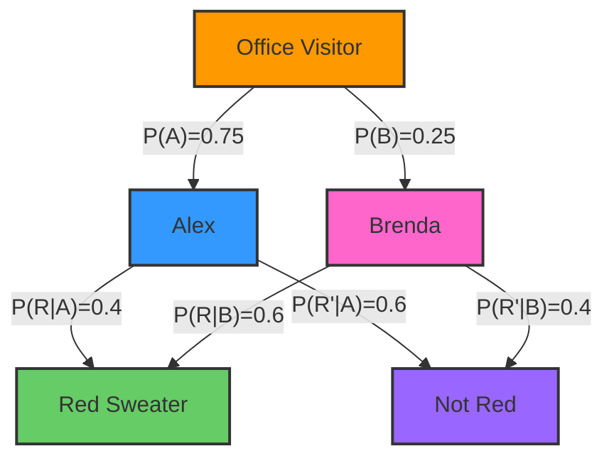

###### Verification

We can verify our result by checking that P(A|R) + P(B|R) = 1:

$$P(B|R) = \frac{P(R|B) \times P(B)}{P(R)} = \frac{0.6 \times 0.25}{0.45} = \frac{0.15}{0.45} = \frac{1}{3} \approx 33.3%$$

And indeed: 66.7% + 33.3% = 100%

###### Mathematical Formulation

The general form of what we've calculated can be expressed as:

$$P(A|R) = \frac{P(A)P(R|A)}{P(A)P(R|A) + P(B)P(R|B)}$$ $$P(B|R) = \frac{P(B)P(R|B)}{P(A)P(R|A) + P(B)P(R|B)}$$

This is a direct application of Bayes' theorem where:

- The prior probabilities P(A) and P(B) represent our beliefs about who is likely to be at the office
- The likelihoods P(R|A) and P(R|B) represent the probabilities of wearing red given the person
- The posterior probability P(A|R) represents our updated belief after observing the red sweater

###### Key Insights

1. **Independence Assumption**: The problem assumes that wearing a red sweater is independent of coming to the office.
   This simplifies our calculations as we don't need to consider conditional dependencies between these events.
2. **Prior Adjustment**: We adjusted the prior probabilities to reflect the condition that we saw someone at the office,
   which means we're already working in a restricted probability space.
3. **Likelihood Ratio**: The ratio of P(A|R) to P(B|R) depends on both the prior odds (P(A)/P(B) = 3) and the likelihood
   ratio (P(R|A)/P(R|B) = 2/3). The prior favors Alex, but the likelihood favors Brenda. The combination of these
   factors gives us our final result.
4. **Posterior Probability**: Despite Brenda being more likely to wear red (60% vs 40% for Alex), Alex is still more
   likely to be the person we saw because Alex comes to the office much more frequently.

The solution indicates that there's approximately a 66.7% chance that the person wearing the red sweater at the office
was Alex.

##### Summary: Probability Theory

Probability theory provides powerful tools for reasoning under uncertainty. Here are the key concepts that form the
foundation of probabilistic reasoning:

###### Five Key Concepts in Probability Theory

1. Bayesian Inference:
    - Uses Bayes' theorem to update probabilities based on new evidence.
    - P(A|B) = P(B|A) × P(A) / P(B)
    - This formula shows how we can convert from the likelihood (P(B|A)) to the posterior probability (P(A|B)) by
      incorporating our prior belief (P(A)) and normalizing by the evidence (P(B)).
2. Probabilistic Graphical Models:
    - Represent dependencies between variables (Cancer → Test1, Test2).
    - Allows for intuitive visualization of the problem structure.
    - These models use graphs where nodes represent random variables and edges represent conditional dependencies,
      making complex probability relationships easier to understand and work with.
3. Conditional Independence:
    - Assume T1 and T2 are conditionally independent given C.
    - P(T1,T2|C) = P(T1|C) × P(T2|C)
    - This powerful simplification means that once we know the state of C, information about T1 doesn't affect our
      beliefs about T2, and vice versa.
4. Chain Rule of Probability:
    - P(A,B,C) = P(A) × P(B|A) × P(C|A,B)
    - This formula allows us to break down complex joint probabilities into simpler conditional probabilities, making
      calculations more manageable.
5. Law of Total Probability:
    - P(B) = P(B|A) × P(A) + P(B|¬A) × P(¬A)
    - This formula helps us compute the total probability of an event by considering all possible ways it can occur
      across different scenarios or conditions.

```mermaid
flowchart TD
    A["Probability Theory"] --> B["Bayesian Inference"]
    A --> C["Graphical Models"]
    A --> D["Conditional Independence"]
    A --> E["Chain Rule"]
    A --> F["Law of Total Probability"]
    style A fill:#ff9900,stroke:#333,stroke-width:2px
    style B fill:#3399ff,stroke:#333,stroke-width:2px
    style C fill:#ff66cc,stroke:#333,stroke-width:2px
    style D fill:#66cc66,stroke:#333,stroke-width:2px
    style E fill:#ff5555,stroke:#333,stroke-width:2px
    style F fill:#ffaa00,stroke:#333,stroke-width:2px
```

###### Understanding Conditional Notation

P(A | X, Y) is read as "the probability of A given X and Y" or "the probability of A in the presence of both X and Y."

More specifically:

1. P(A | X, Y) represents the conditional probability of event A occurring, given that both events X and Y have
   occurred.
2. It means we're considering the probability of A in the subset of scenarios where both X and Y are true or have
   happened.
3. This notation is used when the probability of A depends on or is influenced by the joint occurrence of X and Y.
4. In practical terms, it could represent situations like:
    - The probability of a certain medical condition (A) given two specific symptoms (X and Y)
    - The likelihood of a stock price increase (A) given both positive market trends (X) and good company earnings (Y)
5. It's important to note that P(A | X, Y) may be different from P(A | X) or P(A | Y) individually, as the combination
   of X and Y together might affect the probability of A in ways that X or Y alone do not.
6. In some cases, if X and Y are independent with respect to A, then P(A | X, Y) might equal P(A | X) or P(A | Y), but
   this is not generally assumed without evidence.

This concept is crucial in probability theory, especially in complex scenarios where multiple conditions or events can
influence the outcome we're interested in.

###### Conditional Probability Problem: Happiness and Raise

This problem examines how we can use conditional probability to find relationships between getting a raise at work (R),
it being sunny (S), and being happy (H).

###### Finding P(R|H,S) - Probability of a Raise Given Happiness and Sunshine

1. Start with Bayes' Theorem for multiple conditions. For someone who is happy on a sunny day, the probability of
   getting a raise is:

    $$P(R|H,S) = \frac{P(R,H,S)}{P(H,S)}$$

2. For the numerator $P(R,H,S)$, we can use the chain rule to break this joint probability into simpler parts:

    $$P(R,H,S) = P(H|R,S) \times P(R,S)$$ $$P(R,S) = P(R|S) \times P(S)$$

    Therefore:

    $$P(R,H,S) = P(H|R,S) \times P(R|S) \times P(S)$$

3. For the denominator $P(H,S)$, we use a simple application of conditional probability:

    $$P(H,S) = P(H|S) \times P(S)$$

4. Putting it all together:

    $$P(R|H,S) = \frac{P(R,H,S)}{P(H,S)} = \frac{P(H|R,S) \times P(R|S) \times P(S)}{P(H|S) \times P(S)} = \frac{P(H|R,S) \times P(R|S)}{P(H|S)}$$

5. The Law of Total Probability states that for any events A and B, and a complete set of mutually exclusive events C
   and ¬C:

    $$P(A|B) = P(A|C,B)P(C|B) + P(A|\neg C,B)P(\neg C|B)$$

    So for our problem:

    $$P(H|S) = P(H|R,S)P(R|S) + P(H|\neg R,S)P(\neg R|S)$$

    If R and S are independent, then $P(R|S) = P(R)$, so:

    $$P(H|S) = P(H|R,S)P(R) + P(H|\neg R,S)P(\neg R)$$

6. Finally, our formula becomes:

    $$P(R|H,S) = \frac{P(H|R,S) \times P(R)}{P(H|R,S)P(R) + P(H|\neg R,S)P(\neg R)}$$

###### Calculating with Given Probabilities

Given:

- $P(S) = 0.7$ (70% chance of a sunny day)
- $P(R) = 0.01$ (1% chance of getting a raise)
- $P(R|S) = 0.01$ (Weather doesn't affect raise probability)
- Conditional happiness probabilities:
    - $P(H|S,R) = 1$ (100% happy when sunny with raise)
    - $P(H|\neg S,R) = 0.9$ (90% happy when not sunny but with raise)
    - $P(H|S,\neg R) = 0.7$ (70% happy when sunny but no raise)
    - $P(H|\neg S,\neg R) = 0.1$ (10% happy when not sunny and no raise)

We can calculate: $$P(R|H,S) = \frac{P(H|R,S) \times P(R)}{P(H|R,S)P(R) + P(H|\neg R,S)P(\neg R)}$$
$$= \frac{1 \times 0.01}{1 \times 0.01 + 0.7 \times 0.99}$$ $$= \frac{0.01}{0.01 + 0.693}$$ $$= \frac{0.01}{0.703}$$
$$= 0.0142$$

Therefore, if someone is happy on a sunny day, the probability they got a raise is 0.0142, which is 1.42%.

```mermaid
flowchart LR
    A["Person on Sunny Day"] --> B["Happy"]
    B --> C["Got Raise: 1.42%"]
    B --> D["No Raise: 98.58%"]
    style A fill:#ff9900,stroke:#333,stroke-width:2px
    style B fill:#3399ff,stroke:#333,stroke-width:2px
    style C fill:#66cc66,stroke:#333,stroke-width:2px
    style D fill:#ff5555,stroke:#333,stroke-width:2px
```

###### The Probability of a Raise Given Happiness (Without Weather Information)

This is an application of the Law of Total Probability across two independent variables (S and R).

For any event A and a partition of the sample space into mutually exclusive and exhaustive events, the Law of Total
Probability states:

$$P(A) = \sum_{i} P(A|C_i)P(C_i)$$

In this case:

We want $P(H)$ (probability of being happy) with two binary variables S and R, creating four mutually exclusive and
exhaustive events:

1. (S,R): Sunny and Raise
2. (¬S,R): Not Sunny and Raise
3. (S,¬R): Sunny and No Raise
4. (¬S,¬R): Not Sunny and No Raise

Applying the Law of Total Probability across all four possibilities:

$$P(H) = P(H|S,R)P(S,R) + P(H|\neg S,R)P(\neg S,R) + P(H|S,\neg R)P(S,\neg R) + P(H|\neg S,\neg R)P(\neg S,\neg R)$$

This formula accounts for all possible ways someone could be happy.

Let's calculate step by step:

1. Calculate $P(S,R)$: Since S and R are independent (given $P(R|S) = P(R) = 0.01$)
   $$P(S,R) = P(S)P(R) = 0.7 \times 0.01 = 0.007$$
2. Calculate $P(\neg S,R)$: $$P(\neg S) = 1 - P(S) = 1 - 0.7 = 0.3$$
   $$P(\neg S,R) = P(\neg S)P(R) = 0.3 \times 0.01 = 0.003$$
3. Calculate $P(S,\neg R)$: $$P(\neg R) = 1 - P(R) = 1 - 0.01 = 0.99$$
   $$P(S,\neg R) = P(S)P(\neg R) = 0.7 \times 0.99 = 0.693$$
4. Calculate $P(\neg S,\neg R)$: $$P(\neg S,\neg R) = P(\neg S)P(\neg R) = 0.3 \times 0.99 = 0.297$$

Now we can calculate the overall probability of being happy:

$$P(H) = (1 \times 0.007) + (0.9 \times 0.003) + (0.7 \times 0.693) + (0.1 \times 0.297)$$
$$= 0.007 + 0.0027 + 0.4851 + 0.0297$$ $$= 0.5245$$

Therefore, $P(H) = 0.5245$ or about 52.45%

This means there's about a 52.45% chance of being happy overall, considering all possible combinations of weather and
raise status.

To find the probability of a raise when I'm happy $P(R|H)$, we use Bayes' Theorem:

$$P(R|H) = \frac{P(H|R)P(R)}{P(H)}$$

First, we need $P(H|R)$: $$P(H|R) = P(H|R,S)P(S) + P(H|R,\neg S)P(\neg S)$$ $$= 1 \times 0.7 + 0.9 \times 0.3$$
$$= 0.7 + 0.27$$ $$= 0.97$$

Now we can calculate: $$P(R|H) = \frac{0.97 \times 0.01}{0.5245}$$ $$= \frac{0.0097}{0.5245}$$ $$= 0.0185$$

Therefore, if you're happy, the probability you got a raise is about 1.85%, which is higher than the base rate of 1% but
still quite low - suggesting happiness often comes from factors other than raises.

###### Key Insights:

- Being happy slightly increases the probability of having received a raise (from 1% to 1.85%).
- Sunny weather and happiness together only marginally increase the probability of a raise (to 1.42%).
- The overall probability of happiness (52.45%) is influenced more by sunny weather than by getting a raise, due to the
  low probability of getting a raise.

###### Probability of a Raise Given Happiness When It's Not Sunny

1. Applying Bayes' Theorem:

    $$P(R|H,\neg S) = \frac{P(H,\neg S|R)P(R)}{P(H,\neg S)}$$

2. The Chain Rule states that for any events A, B, and C:

    $$P(A,B|C) = P(A|B,C)P(B|C)$$

    So:

    $$P(H,\neg S|R) = P(H|\neg S,R)P(\neg S|R)$$

    Since R and S are independent, $P(\neg S|R) = P(\neg S)$, so:

    $$P(H,\neg S|R) = P(H|\neg S,R)P(\neg S)$$

3. Therefore:

    $$P(R|H,\neg S) = \frac{P(H|\neg S,R)P(\neg S)P(R)}{P(H,\neg S)}$$

4. For denominator $P(H,\neg S)$:

    $$P(H,\neg S) = P(H|\neg S)P(\neg S)$$

5. Substituting:

    $$P(R|H,\neg S) = \frac{P(H|\neg S,R)P(\neg S)P(R)}{P(H|\neg S)P(\neg S)}$$

6. The $P(\neg S)$ terms cancel out:

    $$P(R|H,\neg S) = \frac{P(H|\neg S,R)P(R)}{P(H|\neg S)}$$

7. Since R and S are independent:

    $$P(R) = P(R|\neg S) = P(R|S)$$

    $$P(R|H,\neg S) = \frac{P(H|\neg S,R)P(R|\neg S)}{P(H|\neg S)}$$

8. For $P(H|\neg S)$, we use the Law of Total Probability:

    $$P(H|\neg S) = P(H|R,\neg S)P(R|\neg S) + P(H|\neg R,\neg S)P(\neg R|\neg S)$$

9. Substituting:

    $$P(R|H,\neg S) = \frac{P(H|\neg S,R)P(R|\neg S)}{P(H|R,\neg S)P(R|\neg S) + P(H|\neg R,\neg S)P(\neg R|\neg S)}$$

Using our values:

- $P(S) = 0.7$
- $P(R) = 0.01$
- $P(R|S) = 0.01$
- $P(H|S,R) = 1$
- $P(H|\neg S,R) = 0.9$
- $P(H|S,\neg R) = 0.7$
- $P(H|\neg S,\neg R) = 0.1$

We calculate:
$$P(R|H,\neg S) = \frac{P(H|\neg S,R)P(R|\neg S)}{P(H|R,\neg S)P(R|\neg S) + P(H|\neg R,\neg S)P(\neg R|\neg S)}$$
$$= \frac{0.9 \times 0.01}{0.9 \times 0.01 + 0.1 \times 0.99}$$ $$= \frac{0.009}{0.009 + 0.099}$$
$$= \frac{0.009}{0.108}$$ $$= 0.0833$$

This means if you're happy when it's not sunny, there's about an 8.33% chance you got a raise. This is higher than:

- Base rate of raises (1%)
- Probability of raise given just happiness (1.85%)
- Probability of raise given happiness on a sunny day (1.42%)

```mermaid
flowchart TD
    A["Conditional Probability Comparisons"] --> B["Base Rate: 1%"]
    A --> C["Given Happiness: 1.85%"]
    A --> D["Given Happiness + Sunny: 1.42%"]
    A --> E["Given Happiness + Not Sunny: 8.33%"]
    style A fill:#ff9900,stroke:#333,stroke-width:2px
    style B fill:#3399ff,stroke:#333,stroke-width:2px
    style C fill:#ff66cc,stroke:#333,stroke-width:2px
    style D fill:#66cc66,stroke:#333,stroke-width:2px
    style E fill:#ff5555,stroke:#333,stroke-width:2px
```

This makes sense because being happy on a non-sunny day is more likely to be due to something like a raise rather than
the weather. When it's not sunny and someone is still happy, there's a stronger indication that something special (like
a raise) might have happened to cause their happiness.
