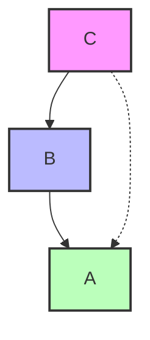
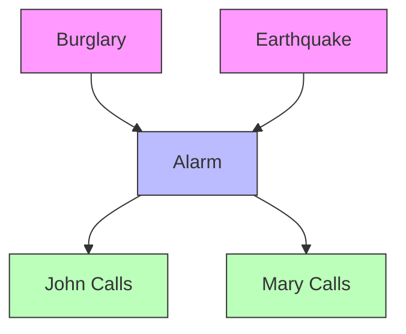

1. **Law of Conditional Probability**

   - Definition and formula: P(A|B) = P(A,B)/P(B)
   - Properties and constraints
   - Extension to multiple events

2. **Law of Total Probability**

   - Formula derivation
   - Application with partitioned sample spaces
   - Proof using conditional probability

3. **Chain Rule of Probability**

   - General formula for joint probability
   - Proof using conditional probability
   - Extension to multiple variables
   - Application with conditional independence

4. **Bayes' Theorem**

   - Core formula: P(A|B) = P(B|A)P(A)/P(B)
   - Normalization constant
   - Proportional form using ∝ notation
   - Prior and posterior probabilities

5. **Probability Problem Examples**

   - Office attendance and clothing color
   - Disease diagnostic testing
   - Spam classification
   - Happiness, weather, and raises
   - Burglary alarm system

6. **Probability Theory Fundamentals**
   - Joint, marginal, and conditional probabilities
   - Normalization principles
   - Mutually exclusive and exhaustive events

# Law of Conditional Probability

The law of conditional probability is one of the fundamental concepts in probability theory, describing how to calculate the probability of an event given that another event has occurred.

## Basic Definition

For any two events A and B, the conditional probability of A given B is defined as:

$$P(A|B) = \frac{P(A \cap B)}{P(B)}$$

Where:

- $P(A|B)$ represents the probability of event A occurring, given that event B has occurred
- $P(A \cap B)$ represents the probability of both events A and B occurring (their intersection)
- $P(B)$ represents the probability of event B occurring

This formula can be rearranged to give us the multiplication rule:

$$P(A \cap B) = P(A|B) \times P(B)$$

## Key Properties

The conditional probability formula has several important properties:

1. **Range constraint**: $0 \leq P(A|B) \leq 1$

   - Like all probabilities, conditional probabilities must be between 0 and 1

2. **Nonzero denominator**: $P(B)$ must be greater than 0

   - We can only condition on events that have a nonzero probability of occurring

3. **Asymmetry**: $P(A|B) \neq P(B|A)$ in general

   - The probability of A given B is typically different from the probability of B given A
   - This asymmetry is what makes Bayes' theorem so useful

4. **Independence**: When A and B are independent events, $P(A \cap B) = P(A)P(B)$ and $P(A|B) = P(A)$
   - If A and B are independent, knowing B occurred doesn't change the probability of A occurring

## Extension to Multiple Events

We can extend conditional probability to three or more events by applying the same principle repeatedly:

For three events A, B, and C:

$$P(A|B,C) = \frac{P(A \cap B \cap C)}{P(B \cap C)}$$

This can be rearranged to:

$$P(A \cap B \cap C) = P(A|B,C) \times P(B \cap C)$$

Using the same principle again:

$$P(B \cap C) = P(B|C) \times P(C)$$

Substituting this into our earlier equation:

$$P(A \cap B \cap C) = P(A|B,C) \times P(B|C) \times P(C)$$

This is a specific case of the chain rule of probability, which we'll explore in more detail later.

## Intuitive Understanding

Conditional probability answers questions like: "Given that B has happened, what is the probability that A will happen?"

For example, if B represents "it is raining" and A represents "the ground is wet":

- $P(A|B)$ asks: "If it's raining, what's the probability that the ground is wet?"
- This probability would be very high, close to 1

Conversely:

- $P(B|A)$ asks: "If the ground is wet, what's the probability that it's raining?"
- This probability would be lower, since the ground could be wet for other reasons (sprinklers, etc.)

Understanding conditional probability is essential for reasoning about uncertain events and forms the foundation for more advanced concepts like Bayes' theorem and probabilistic graphical models.

# Law of Total Probability

The Law of Total Probability is a fundamental rule that allows us to calculate the total probability of an event by considering all the possible ways that event can occur through mutually exclusive scenarios. It provides a method to "divide and conquer" complex probability problems.

## Basic Definition

For any event A and a set of mutually exclusive and exhaustive events {B₁, B₂, ..., Bₙ} that form a partition of the sample space, the Law of Total Probability states:

$$P(A) = \sum_{i=1}^{n} P(A|B_i)P(B_i)$$

For the simple case with just two complementary events B and its complement B̄:

$$P(A) = P(A|B)P(B) + P(A|\bar{B})P(\bar{B})$$

## Formula Derivation

We can derive the Law of Total Probability using basic set theory and the definition of conditional probability:

1. Start with the fact that the events B₁, B₂, ..., Bₙ form a partition of the sample space, meaning:

   - They are mutually exclusive: $B_i \cap B_j = \emptyset$ for i ≠ j
   - They are exhaustive: $B_1 \cup B_2 \cup ... \cup B_n = \Omega$ (the entire sample space)

2. Any event A can be expressed as the union of its intersections with each B₁:
   $A = A \cap \Omega = A \cap (B_1 \cup B_2 \cup ... \cup B_n) = (A \cap B_1) \cup (A \cap B_2) \cup ... \cup (A \cap B_n)$

3. Since these intersections are mutually exclusive, we can add their probabilities:
   $P(A) = P(A \cap B_1) + P(A \cap B_2) + ... + P(A \cap B_n)$

4. Using the definition of conditional probability, $P(A \cap B_i) = P(A|B_i)P(B_i)$:
   $P(A) = P(A|B_1)P(B_1) + P(A|B_2)P(B_2) + ... + P(A|B_n)P(B_n)$

5. Which gives us the Law of Total Probability:
   $P(A) = \sum_{i=1}^{n} P(A|B_i)P(B_i)$

## Proof of the Conditional Form

For any events A and C, and a partition {B, B̄}, we can derive:

$$P(A|C) = P(A|B,C)P(B|C) + P(A|\bar{B},C)P(\bar{B}|C)$$

Here's the step-by-step proof:

1. We start with the definition of conditional probability for P(A|C):

   $$P(A|C) = \frac{P(A \cap C)}{P(C)}$$

2. Since B and B̄ partition the sample space, we can split P(A ∩ C):

   $$P(A \cap C) = P(A \cap C \cap B) + P(A \cap C \cap \bar{B})$$

3. Substituting this into our first equation:

   $$P(A|C) = \frac{P(A \cap C \cap B) + P(A \cap C \cap \bar{B})}{P(C)}$$

4. Using the chain rule on each term:

   $$P(A \cap C \cap B) = P(A|B,C)P(B,C) = P(A|B,C)P(B|C)P(C)$$
   $$P(A \cap C \cap \bar{B}) = P(A|\bar{B},C)P(\bar{B},C) = P(A|\bar{B},C)P(\bar{B}|C)P(C)$$

5. Substituting these back:

   $$P(A|C) = \frac{P(A|B,C)P(B|C)P(C) + P(A|\bar{B},C)P(\bar{B}|C)P(C)}{P(C)}$$

6. The P(C) terms cancel out:

   $$P(A|C) = P(A|B,C)P(B|C) + P(A|\bar{B},C)P(\bar{B}|C)$$

This shows how we can express P(A|C) in terms of the conditional probabilities involving B and B̄.

## Practical Applications

The Law of Total Probability is especially useful in these scenarios:

1. **Medical testing**: To find the overall probability of a positive test result by considering both true positives (from sick patients) and false positives (from healthy patients)

2. **Risk assessment**: Calculating overall risk by breaking it down into different scenarios with their associated probabilities

3. **Decision trees**: Computing the probability of outcomes by considering all possible paths

4. **Machine learning**: In algorithms like Naive Bayes, to calculate probabilities across different feature variables

## Example Application

Consider a medical test for a disease that affects 1% of the population:

- The test is 99% accurate for both positive and negative results
- This means: P(positive|sick) = 0.99 and P(negative|healthy) = 0.99

What is the probability of a positive test result, P(positive)?

Using the Law of Total Probability:

$$P(\text{positive}) = P(\text{positive}|\text{sick})P(\text{sick}) + P(\text{positive}|\text{healthy})P(\text{healthy})$$
$$P(\text{positive}) = 0.99 \times 0.01 + 0.01 \times 0.99 = 0.0099 + 0.0099 = 0.0198$$

So approximately 1.98% of tests will be positive, even though only 1% of the population is sick. This illustrates how the Law of Total Probability helps us understand the overall probabilities by considering all contributing scenarios.

# Chain Rule of Probability

The Chain Rule of Probability, also known as the general product rule, is a fundamental principle that allows us to decompose complex joint probabilities into simpler conditional probabilities. This rule is particularly useful when working with multiple random variables and forms the foundation for many concepts in probabilistic modeling.

## General Formula

For n events A₁, A₂, ..., Aₙ, the Chain Rule of Probability states:

$$P(A_1, A_2, ..., A_n) = P(A_1) \times P(A_2|A_1) \times P(A_3|A_1,A_2) \times ... \times P(A_n|A_1,A_2,...,A_{n-1})$$

This formula expresses the joint probability of n events as a product of conditional probabilities, where each term conditions on all previous events.

## Proof Using Conditional Probability

We can prove the Chain Rule by repeatedly applying the definition of conditional probability. Let's start with the simplest case of two variables:

1. Start with the definition of conditional probability:

   $$P(A|B) = \frac{P(A,B)}{P(B)}$$

2. Rearranging this equation:

   $$P(A,B) = P(A|B)P(B)$$

This gives us the Chain Rule for two variables. Now let's extend to three variables:

3. For three variables A, B, and C, start with:

   $$P(A,B,C) = P(A|B,C)P(B,C)$$

   This follows from applying the definition of conditional probability, treating B,C as a single event.

4. Now expand P(B,C) using the rule we just derived for two variables:

   $$P(B,C) = P(B|C)P(C)$$

5. Substitute this back into our equation from step 3:

   $$P(A,B,C) = P(A|B,C)P(B|C)P(C)$$

This gives us the Chain Rule for three variables. The pattern continues for any number of variables, which we can prove by induction.

## Extension to Multiple Variables

For four events A, B, C, and D, we apply the same principle:

$$P(A, B, C, D) = P(A|B,C,D) \times P(B|C,D) \times P(C|D) \times P(D)$$

This can be further extended to n variables, giving us the general form of the Chain Rule.

We can also apply the Chain Rule to conditional probabilities. For example, for events A, B, C conditioned on event D:

$$P(A, B, C | D) = P(A | B, C, D) \times P(B | C, D) \times P(C | D)$$

This formula shows how we sequentially condition each event on all previous events and the given condition D.

## Application with Conditional Independence

The Chain Rule becomes particularly powerful when combined with conditional independence assumptions. If variables are conditionally independent, we can simplify the expressions.

For example, if A is conditionally independent of B given C, written as A ⊥ B | C, then:

$$P(A|B,C) = P(A|C)$$

This allows us to simplify chain rule expressions. Consider a Bayesian network where:

- A depends on B and C
- B depends on C
- C is a root node

The Chain Rule would give:

$$P(A,B,C) = P(A|B,C) \times P(B|C) \times P(C)$$

If we had additional conditional independence (e.g., if A only depends on B, not on C), we could simplify further:

$$P(A,B,C) = P(A|B) \times P(B|C) \times P(C)$$



In this diagram, the dotted line represents a potential dependency that would be removed if A is conditionally independent of C given B.

## Practical Example

Let's consider a concrete example with three variables:

- C = Cloudy (yes/no)
- R = Rain (yes/no)
- W = Wet Grass (yes/no)

The full joint probability P(C,R,W) can be decomposed using the Chain Rule:

$$P(C,R,W) = P(C) \times P(R|C) \times P(W|C,R)$$

If we know that whether the grass is wet depends only on whether it rains (not directly on cloudiness), then W is conditionally independent of C given R:

$$P(W|C,R) = P(W|R)$$

This simplifies our Chain Rule expression to:

$$P(C,R,W) = P(C) \times P(R|C) \times P(W|R)$$

This simplified form reduces the number of parameters we need to specify, making our probabilistic model more manageable.

## Importance in Machine Learning

The Chain Rule of Probability is fundamental to many machine learning algorithms and models:

1. **Bayesian Networks**: The joint probability distribution is factorized using the Chain Rule based on conditional independence assumptions

2. **Hidden Markov Models**: Use the Chain Rule to model sequences of observations

3. **Language Models**: N-gram models use the Chain Rule to compute the probability of a sequence of words

4. **Variable Elimination**: Algorithms for exact inference in graphical models rely on the Chain Rule

By breaking down complex joint probabilities into simpler conditional probabilities, the Chain Rule allows us to build and work with sophisticated probabilistic models that would otherwise be intractable.


# Bayes' Theorem

Bayes' Theorem is one of the most powerful and important principles in probability theory and statistics. Named after Reverend Thomas Bayes, this theorem allows us to update our beliefs about events as we gather new evidence—essentially describing how to think rationally in an uncertain world.

## Core Formula

The standard form of Bayes' Theorem states:

$$P(A|B) = \frac{P(B|A) \times P(A)}{P(B)}$$

Where:
- $P(A|B)$ is the posterior probability: the probability of event A given that B has occurred
- $P(B|A)$ is the likelihood: the probability of event B given that A has occurred
- $P(A)$ is the prior probability: our initial belief about the probability of A
- $P(B)$ is the marginal probability: the overall probability of observing event B

## Normalization Constant

The denominator $P(B)$ serves as a normalization constant that ensures the posterior probability is a proper probability (between 0 and 1). We can expand this term using the Law of Total Probability:

$$P(B) = P(B|A) \times P(A) + P(B|\neg A) \times P(\neg A)$$

Where $\neg A$ represents "not A" (the complement of event A).

Substituting this expansion into the original formula:

$$P(A|B) = \frac{P(B|A) \times P(A)}{P(B|A) \times P(A) + P(B|\neg A) \times P(\neg A)}$$

We can think of this normalization constant as ensuring that probabilities of all possible events (in this case, A and not A) sum to 1 after we've incorporated the new evidence B.

## Proportional Form

Often in practice, we care more about comparing relative probabilities than calculating exact values. In such cases, we can use the proportional form of Bayes' Theorem:

$$P(A|B) \propto P(B|A) \times P(A)$$

Where the symbol $\propto$ means "proportional to." This form is particularly useful when:

1. We're only interested in which event is more likely
2. The denominator $P(B)$ is complex to calculate
3. We plan to normalize the results at the end anyway

For example, if we're comparing the posterior probabilities of two hypotheses $A_1$ and $A_2$ given evidence B:

$$\frac{P(A_1|B)}{P(A_2|B)} = \frac{P(B|A_1) \times P(A_1)}{P(B|A_2) \times P(A_2)}$$

The denominator $P(B)$ cancels out, simplifying our calculation.

## Formal Derivation

Let's prove Bayes' Theorem from the definition of conditional probability:

1. Start with the definition of conditional probability for $P(A|B)$:
   $$P(A|B) = \frac{P(A \cap B)}{P(B)}$$

2. Similarly, for $P(B|A)$:
   $$P(B|A) = \frac{P(A \cap B)}{P(A)}$$

3. Rearranging the second equation to solve for $P(A \cap B)$:
   $$P(A \cap B) = P(B|A) \times P(A)$$

4. Substituting this into the first equation:
   $$P(A|B) = \frac{P(B|A) \times P(A)}{P(B)}$$

And we've derived Bayes' Theorem.

## Prior and Posterior Probabilities

A key concept in Bayesian inference is the relationship between prior and posterior probabilities:

- **Prior probability $P(A)$**: Our belief about A before considering evidence B
- **Posterior probability $P(A|B)$**: Our updated belief about A after considering evidence B

Bayes' Theorem provides the mathematical framework for updating these beliefs. After we calculate a posterior probability, it can become the prior probability for a subsequent application of Bayes' Theorem with new evidence—allowing for sequential updating of probabilities as new information arrives.

## Alternative Forms and Notation

In many applications, we use different notation to highlight the role of Bayes' Theorem in hypothesis testing:

$$P(H|E) = \frac{P(E|H) \times P(H)}{P(E)}$$

Where:
- $H$ represents a hypothesis
- $E$ represents evidence
- $P(H)$ is the prior probability of the hypothesis
- $P(H|E)$ is the posterior probability after observing evidence
- $P(E|H)$ is the likelihood of observing the evidence if the hypothesis is true

## Mathematical Example

Let's derive the normalization constant step by step using Bayes' Rule. We start with the unnormalized forms:

$$P'(A|B) = P(B|A)P(A)$$
$$P'(\neg A|B) = P(B|\neg A)P(\neg A)$$

Where $P'$ indicates unnormalized probabilities.

Since probabilities must sum to 1:
$$P(A|B) + P(\neg A|B) = 1$$

If we define a normalization constant $\eta$:
$$P(A|B) = \eta \times P'(A|B)$$
$$P(\neg A|B) = \eta \times P'(\neg A|B)$$

Then:
$$\eta \times P'(A|B) + \eta \times P'(\neg A|B) = 1$$
$$\eta \times [P'(A|B) + P'(\neg A|B)] = 1$$
$$\eta = \frac{1}{P'(A|B) + P'(\neg A|B)}$$
$$\eta = \frac{1}{P(B|A)P(A) + P(B|\neg A)P(\neg A)}$$
$$\eta = \frac{1}{P(B)}$$

This shows that $\eta = \frac{1}{P(B)}$, and therefore:
$$P(A|B) = \frac{P(B|A)P(A)}{P(B)}$$

Which is exactly Bayes' Theorem.

## Practical Applications

Bayes' Theorem is extraordinarily versatile, finding applications in:

1. **Medical diagnosis**: Updating the probability of a disease given test results
2. **Spam filtering**: Determining if an email is spam given its content
3. **Machine learning**: Naive Bayes classifiers, Bayesian networks, and many other algorithms
4. **Legal reasoning**: Evaluating the probability of guilt given evidence
5. **Scientific research**: Updating confidence in hypotheses as new data emerges

```mermaid
graph LR
    A[Prior P(H)] --> B[Posterior P(H|E)]
    C[Likelihood P(E|H)] --> B
    D[Evidence P(E)] --> B
    style A fill:#d0e0ff,stroke:#333
    style B fill:#c0f0c0,stroke:#333
    style C fill:#ffe0d0,stroke:#333
    style D fill:#f0d0f0,stroke:#333
```

This diagram illustrates how Bayes' Theorem combines prior beliefs with new evidence to form updated posterior beliefs—the cornerstone of Bayesian reasoning.

Understanding Bayes' Theorem allows us to reason more effectively in uncertain situations by properly incorporating new information into our existing beliefs, making it one of the most important tools in probabilistic reasoning and data-driven decision making.

# Probability Problem Examples

These worked examples demonstrate how the theoretical concepts in probability are applied to real-world problems. Each example illustrates different probability principles and calculation techniques.

## Office Attendance and Clothing Color

### Problem Statement:
Alex comes to the office 3 days a week and Brenda comes to the office 1 day a week. We observed a person wearing a red sweater. Alex wears red 2 times a week and Brenda wears red 3 times a week. The scenario assumes they work remotely from home the rest of the days and can wear red even when working from home.

### Information:
- Alex: Comes to office 3/5 days = 0.6 (Prior P(A))
- Alex: Wears red 2/5 times = 0.4 (P(R|A))
- Brenda: Comes to office 1/5 days = 0.2 (Prior P(B))
- Brenda: Wears red 3/5 times = 0.6 (P(R|B))
- Red wearing is independent of office attendance

### Solution:
We need to find P(A|R) - the probability it was Alex given we observed a red sweater.

Using Bayes' Theorem:
$$P(A|R) = \frac{P(R|A) \times P(A)}{P(R)}$$

Where the denominator P(R) is calculated using the Law of Total Probability:
$$P(R) = P(R|A) \times P(A) + P(R|B) \times P(B)$$
$$P(R) = 0.4 \times 0.6 + 0.6 \times 0.2 = 0.24 + 0.12 = 0.36$$

Now we can calculate:
$$P(A|R) = \frac{0.4 \times 0.6}{0.36} = \frac{0.24}{0.36} = \frac{2}{3} \approx 66.7\%$$

This means there's a 66.7% probability that the person we saw wearing red was Alex.

```mermaid
graph TD
    Event --> |P(A)=0.6| A[Alex]
    Event --> |P(B)=0.2| B[Brenda]
    A --> |P(R|A)=0.4| R1[Red]
    A --> |P(not R|A)=0.6| NR1[Not Red]
    B --> |P(R|B)=0.6| R2[Red]
    B --> |P(not R|B)=0.4| NR2[Not Red]

    style R1 fill:#f99,stroke:#333
    style R2 fill:#f99,stroke:#333
    style NR1 fill:#ddd,stroke:#333
    style NR2 fill:#ddd,stroke:#333
```

## Disease Diagnostic Testing

### Problem Statement:
A diagnostic test for a disease has 99% accuracy, and 1 out of 10,000 people are actually sick. What is the probability that a person is sick if the test result is positive?

### Information:
- P(S) = 0.0001 (Prior probability of being sick: 1/10,000)
- P(H) = 0.9999 (Prior probability of being healthy)
- P(+|S) = 0.99 (Test sensitivity: 99% accuracy for sick people)
- P(+|H) = 0.01 (False positive rate: 1% of healthy people test positive)

### Solution:
We need to find P(S|+) - the probability of being sick given a positive test result.

Using Bayes' Theorem:
$$P(S|+) = \frac{P(+|S) \times P(S)}{P(+)}$$

Where:
$$P(+) = P(+|S) \times P(S) + P(+|H) \times P(H)$$
$$P(+) = 0.99 \times 0.0001 + 0.01 \times 0.9999 = 0.000099 + 0.009999 = 0.010098$$

Now we can calculate:
$$P(S|+) = \frac{0.99 \times 0.0001}{0.010098} \approx \frac{0.000099}{0.010098} \approx 0.0098 \approx 0.98\%$$

This result demonstrates the base rate fallacy: even with a 99% accurate test, the probability that a person who tests positive actually has the disease is less than 1%. This is because the disease is so rare in the population.

To visualize this more clearly, imagine testing 1,000,000 people:
- 100 would be sick (0.0001 × 1,000,000)
- 99 of these sick people would test positive (0.99 × 100)
- 999,900 would be healthy (0.9999 × 1,000,000)
- 9,999 of these healthy people would falsely test positive (0.01 × 999,900)
- Total positive tests: 99 + 9,999 = 10,098
- Probability of being sick given positive test: 99/10,098 ≈ 0.98%

## Spam Classification

### Problem Statement:
We're building a spam email classifier based on word occurrence. We have a training set of spam and non-spam (ham) emails, and we need to calculate the probability that an email is spam given it contains certain words.

### Information:
From our training data:
- P(spam) = 3/8 (Prior probability of any email being spam)
- P(ham) = 5/8 (Prior probability of any email being ham)
- Word "easy" appears in 1/3 of spam emails and 1/5 of ham emails
- Word "money" appears in 2/3 of spam emails and 1/5 of ham emails

### Calculation for P(spam | "easy"):
Using Bayes' Theorem:
$$P(spam|"easy") = \frac{P("easy"|spam) \times P(spam)}{P("easy")}$$

Where:
$$P("easy") = P("easy"|spam) \times P(spam) + P("easy"|ham) \times P(ham)$$
$$P("easy") = \frac{1}{3} \times \frac{3}{8} + \frac{1}{5} \times \frac{5}{8} = \frac{1}{8} + \frac{1}{8} = \frac{2}{8} = \frac{1}{4}$$

Now calculating:
$$P(spam|"easy") = \frac{\frac{1}{3} \times \frac{3}{8}}{\frac{1}{4}} = \frac{\frac{3}{24}}{\frac{1}{4}} = \frac{3}{24} \times 4 = \frac{3}{6} = \frac{1}{2} = 50\%$$

### Calculation for P(spam | "money"):
Using Bayes' Theorem again:
$$P(spam|"money") = \frac{P("money"|spam) \times P(spam)}{P("money")}$$

Where:
$$P("money") = P("money"|spam) \times P(spam) + P("money"|ham) \times P(ham)$$
$$P("money") = \frac{2}{3} \times \frac{3}{8} + \frac{1}{5} \times \frac{5}{8} = \frac{2}{8} + \frac{1}{8} = \frac{3}{8}$$

Now calculating:
$$P(spam|"money") = \frac{\frac{2}{3} \times \frac{3}{8}}{\frac{3}{8}} = \frac{\frac{6}{24}}{\frac{3}{8}} = \frac{6}{24} \times \frac{8}{3} = \frac{16}{24} = \frac{2}{3} \approx 66.7\%$$

This shows that "money" is a stronger indicator of spam than "easy" in our dataset.

## Happiness, Weather, and Raises

### Problem Statement:
We want to find the probability of receiving a raise given that a person is happy and it's sunny, compared to the probability of receiving a raise given that a person is happy but it's not sunny.

### Information:
- P(S) = 0.7 (Probability it's sunny)
- P(R) = 0.01 (Probability of getting a raise)
- P(H|S,R) = 1.0 (Probability of being happy when sunny and received a raise)
- P(H|¬S,R) = 0.9 (Probability of being happy when not sunny but received a raise)
- P(H|S,¬R) = 0.7 (Probability of being happy when sunny but no raise)
- P(H|¬S,¬R) = 0.1 (Probability of being happy when not sunny and no raise)
- R and S are independent events (whether it's sunny doesn't affect raise probability)

### Calculating P(R|H,S):
Using Bayes' Theorem:
$$P(R|H,S) = \frac{P(H|R,S) \times P(R|S) \times P(S)}{P(H,S)}$$

Given R and S are independent: P(R|S) = P(R) = 0.01

For the denominator P(H,S), we use the Law of Total Probability:
$$P(H|S) = P(H|R,S)P(R) + P(H|¬R,S)P(¬R)$$
$$P(H|S) = 1 \times 0.01 + 0.7 \times 0.99 = 0.01 + 0.693 = 0.703$$

$$P(H,S) = P(H|S) \times P(S) = 0.703 \times 0.7 = 0.4921$$

Now calculating:
$$P(R|H,S) = \frac{1 \times 0.01 \times 0.7}{0.4921} = \frac{0.007}{0.4921} \approx 0.0142 = 1.42\%$$

### Calculating P(R|H,¬S):
Using similar steps:
$$P(R|H,¬S) = \frac{P(H|R,¬S) \times P(R|¬S) \times P(¬S)}{P(H,¬S)}$$

For the denominator:
$$P(H|¬S) = P(H|R,¬S)P(R) + P(H|¬R,¬S)P(¬R)$$
$$P(H|¬S) = 0.9 \times 0.01 + 0.1 \times 0.99 = 0.009 + 0.099 = 0.108$$

$$P(H,¬S) = P(H|¬S) \times P(¬S) = 0.108 \times 0.3 = 0.0324$$

Now calculating:
$$P(R|H,¬S) = \frac{0.9 \times 0.01 \times 0.3}{0.0324} = \frac{0.0027}{0.0324} = 0.0833 = 8.33\%$$

This shows that if a person is happy when it's not sunny, there's a much higher probability they received a raise (8.33%) compared to if they're happy when it is sunny (1.42%). This makes intuitive sense because happiness on a non-sunny day is more likely to be due to something like a raise, while happiness on a sunny day could simply be due to the pleasant weather.

## Burglary Alarm System

### Problem Statement:
We have a home alarm system that can be triggered by either a burglary or an earthquake. Two neighbors, John and Mary, might call the police when they hear the alarm. We want to calculate the probability of a burglary given that both John and Mary have called.

### Information:
- P(B) = 0.001 (Prior probability of burglary)
- P(E) = 0.002 (Prior probability of earthquake)
- P(A|B,E) = 0.95 (Probability alarm triggers given both burglary and earthquake)
- P(A|B,¬E) = 0.94 (Probability alarm triggers given burglary, no earthquake)
- P(A|¬B,E) = 0.29 (Probability alarm triggers given earthquake, no burglary)
- P(A|¬B,¬E) = 0.001 (Probability alarm triggers with no burglary, no earthquake)
- P(J|A) = 0.9 (Probability John calls given alarm)
- P(J|¬A) = 0.05 (Probability John calls given no alarm)
- P(M|A) = 0.7 (Probability Mary calls given alarm)
- P(M|¬A) = 0.01 (Probability Mary calls given no alarm)

### Solution:
We need to find P(B|J,M) - the probability of burglary given both John and Mary called.

This is a complex calculation involving hidden variables (Alarm and Earthquake). Using Bayes' Network principles, we can break this down:



We can use the chain rule of probability and conditional independence to calculate:

$$P(B,J,M) = \sum_E \sum_A P(B) \times P(E) \times P(A|B,E) \times P(J|A) \times P(M|A)$$

For each combination of E (earthquake) and A (alarm), we calculate:

1. When E=true, A=true:
   $$f(+E,+A) = P(B) \times P(+E) \times P(+A|B,+E) \times P(J|+A) \times P(M|+A)$$
   $$f(+E,+A) = 0.001 \times 0.002 \times 0.95 \times 0.9 \times 0.7 = 1.197 \times 10^{-6}$$

2. When E=true, A=false:
   $$f(+E,-A) = P(B) \times P(+E) \times P(-A|B,+E) \times P(J|-A) \times P(M|-A)$$
   $$f(+E,-A) = 0.001 \times 0.002 \times 0.05 \times 0.05 \times 0.01 = 5 \times 10^{-11}$$

3. When E=false, A=true:
   $$f(-E,+A) = P(B) \times P(-E) \times P(+A|B,-E) \times P(J|+A) \times P(M|+A)$$
   $$f(-E,+A) = 0.001 \times 0.998 \times 0.94 \times 0.9 \times 0.7 = 5.9 \times 10^{-4}$$

4. When E=false, A=false:
   $$f(-E,-A) = P(B) \times P(-E) \times P(-A|B,-E) \times P(J|-A) \times P(M|-A)$$
   $$f(-E,-A) = 0.001 \times 0.998 \times 0.06 \times 0.05 \times 0.01 = 2.994 \times 10^{-8}$$

Similarly, we calculate P(¬B,J,M) by replacing P(B) with P(¬B) and using the appropriate conditional probabilities.

After summing all these terms, the final calculation shows:

$$P(B|J,M) \approx 0.284 = 28.4\%$$

This means that despite the alarm system's limitations and the uncertainty of John and Mary's calls, there's about a 28.4% probability that a burglary actually occurred given that both neighbors called. While much higher than the prior probability of 0.1%, it's still far from certain, highlighting the importance of considering all evidence carefully.

These examples demonstrate how Bayesian reasoning can help us update our beliefs based on evidence and make informed decisions under uncertainty across a wide range of scenarios.

# Probability Theory Fundamentals

Probability theory provides the mathematical foundation for reasoning about uncertainty. This framework allows us to quantify and manipulate uncertainty in a rigorous way, making it essential for fields ranging from statistics and machine learning to physics and economics.

## Joint, Marginal, and Conditional Probabilities

These three types of probability form the building blocks of probability theory, allowing us to represent and reason about relationships between multiple events.

### Joint Probability

Joint probability measures the likelihood of two or more events occurring simultaneously. For events A and B, we denote the joint probability as P(A,B) or P(A∩B).

For example, if we consider:
- A = "It will rain today"
- B = "The temperature will be above 70°F"

Then P(A,B) represents the probability that it will both rain today AND the temperature will be above 70°F.

Joint probabilities can be extended to multiple events:
- P(A,B,C) is the probability that events A, B, and C all occur together
- The joint probability distribution over multiple variables provides a complete description of their probabilistic relationships

### Marginal Probability

Marginal probability refers to the probability of a single event, regardless of other events. If we have a joint probability P(A,B), we can obtain the marginal probability P(A) by summing (or integrating, for continuous variables) over all possible values of B:

$$P(A) = \sum_{b \in B} P(A,b)$$

This process is called marginalization. It allows us to focus on one variable by "averaging out" the effects of other variables.

For example, if we know the joint probability of rain and temperature, we can calculate the marginal probability of rain by summing over all possible temperature values:

$$P(\text{rain}) = P(\text{rain}, T > 70) + P(\text{rain}, T \leq 70)$$

### Conditional Probability

Conditional probability measures the likelihood of an event given that another event has occurred. For events A and B, the conditional probability of A given B is denoted as P(A|B).

$$P(A|B) = \frac{P(A,B)}{P(B)}$$

This formula, when rearranged, gives us the multiplication rule:

$$P(A,B) = P(A|B) \times P(B)$$

Conditional probability captures how our beliefs about one event should change when we learn about another event. For example, P(rain|cloudy) represents the probability of rain given that it's cloudy.

### Relationships Between Joint, Marginal, and Conditional Probabilities

These three types of probability are deeply interconnected:

1. **From joint to marginal**: Through marginalization
   $$P(A) = \sum_{b \in B} P(A,b)$$

2. **From joint to conditional**: Through the definition of conditional probability
   $$P(A|B) = \frac{P(A,B)}{P(B)}$$

3. **From conditional and marginal to joint**: Through the multiplication rule
   $$P(A,B) = P(A|B) \times P(B) = P(B|A) \times P(A)$$

These relationships allow us to convert between different probability representations as needed for a particular problem.

## Normalization Principles

Normalization ensures that probabilities are properly scaled and consistent. There are several key normalization principles in probability theory:

### Probability Range Constraint

For any event A:
$$0 \leq P(A) \leq 1$$

This constraint establishes that probabilities must be non-negative and cannot exceed 1. A probability of 0 indicates impossibility, while a probability of 1 indicates certainty.

### Total Probability Sums to 1

For a complete set of mutually exclusive and exhaustive events {A₁, A₂, ..., Aₙ}:

$$\sum_{i=1}^{n} P(A_i) = 1$$

This principle ensures that the total probability across all possible outcomes equals 1, representing the certainty that one of these outcomes must occur.

For example, if we're rolling a fair six-sided die, the probability of each number equals 1/6, and the sum across all six possible outcomes equals 1.

### Normalization in Conditional Probability

For any condition B, the conditional probabilities across all possible outcomes of A must sum to 1:

$$\sum_{i=1}^{n} P(A_i|B) = 1$$

This ensures that conditional probability distributions are properly normalized.

### Normalization in Bayes' Theorem

When using Bayes' Theorem, the normalization constant in the denominator ensures that the posterior probabilities sum to 1:

$$P(A|B) = \frac{P(B|A)P(A)}{P(B)}$$

Where P(B) acts as a normalization constant, often calculated as:

$$P(B) = \sum_{i=1}^{n} P(B|A_i)P(A_i)$$

### Practical Application of Normalization

In practice, normalization serves several important purposes:

1. **Verification**: Checking that probabilities sum to 1 helps identify errors in probability calculations.

2. **Simplification**: In some cases, we can work with unnormalized probabilities and normalize only at the end of a calculation.

3. **Proportional reasoning**: Using the proportional form (∝) of Bayes' Theorem:
   $$P(A|B) \propto P(B|A)P(A)$$

   We can compute relative probabilities and then normalize to get actual probabilities.

## Mutually Exclusive and Exhaustive Events

These concepts help us structure and reason about sets of events in probability theory.

### Mutually Exclusive Events

Events A and B are mutually exclusive (or disjoint) if they cannot occur simultaneously:

$$P(A \cap B) = 0$$

For mutually exclusive events, the probability of either event occurring is the sum of their individual probabilities:

$$P(A \cup B) = P(A) + P(B)$$

For example, when rolling a die, the events "rolling a 1" and "rolling a 6" are mutually exclusive—you cannot roll both numbers on a single throw.

Visually, mutually exclusive events have no overlap in a Venn diagram:

```
   A       B
 ┌───┐   ┌───┐
 │   │   │   │
 └───┘   └───┘
```

### Exhaustive Events

A set of events {A₁, A₂, ..., Aₙ} is exhaustive if at least one of the events must occur. Mathematically:

$$P(A_1 \cup A_2 \cup ... \cup A_n) = 1$$

For example, when flipping a coin, the events "heads" and "tails" form an exhaustive set (assuming the coin must land on one side or the other).

### Partition of the Sample Space

A set of events forms a partition of the sample space if the events are both:
1. Mutually exclusive (no overlap)
2. Exhaustive (cover all possibilities)

Such a partition is particularly useful in probability theory because:

1. Exactly one event in the partition must occur
2. The probabilities sum to 1: $\sum_{i=1}^{n} P(A_i) = 1$
3. They enable the Law of Total Probability:
   $$P(B) = \sum_{i=1}^{n} P(B|A_i)P(A_i)$$

A classic example is partitioning based on test results. If we define:
- A₁ = "Test positive and disease present" (true positive)
- A₂ = "Test positive and disease absent" (false positive)
- A₃ = "Test negative and disease present" (false negative)
- A₄ = "Test negative and disease absent" (true negative)

These four events form a partition of all possible test outcomes.

### Complementary Events

The complement of an event A, denoted A^c or ¬A, includes all outcomes where A does not occur. A and ¬A form a partition of the sample space, meaning:

1. They are mutually exclusive: $P(A \cap \neg A) = 0$
2. They are exhaustive: $P(A \cup \neg A) = 1$
3. Their probabilities sum to 1: $P(A) + P(\neg A) = 1$

This leads to the complement rule:
$$P(\neg A) = 1 - P(A)$$

For example, if the probability of rain tomorrow is 0.3, then the probability of no rain is 1 - 0.3 = 0.7.

## Applying These Fundamentals

These fundamental concepts of probability theory combine to provide a powerful framework for reasoning under uncertainty. Here's how they're applied in practice:

1. **Decision making**: Using probabilities to quantify uncertainty in different outcomes and make optimal decisions.

2. **Inference**: Updating beliefs based on new evidence using Bayes' Theorem, which combines prior beliefs with conditional probabilities of observed evidence.

3. **Prediction**: Using probabilistic models to estimate the likelihood of future events based on past observations.

4. **Machine learning**: Building models that can learn probability distributions from data and make predictions based on those distributions.

Understanding these fundamentals provides the basis for more advanced topics like Bayesian networks, which encode complex dependencies between multiple variables in a structured way, enabling efficient inference and reasoning in high-dimensional probability spaces.
