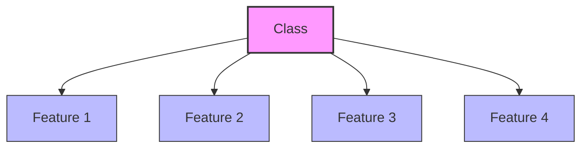
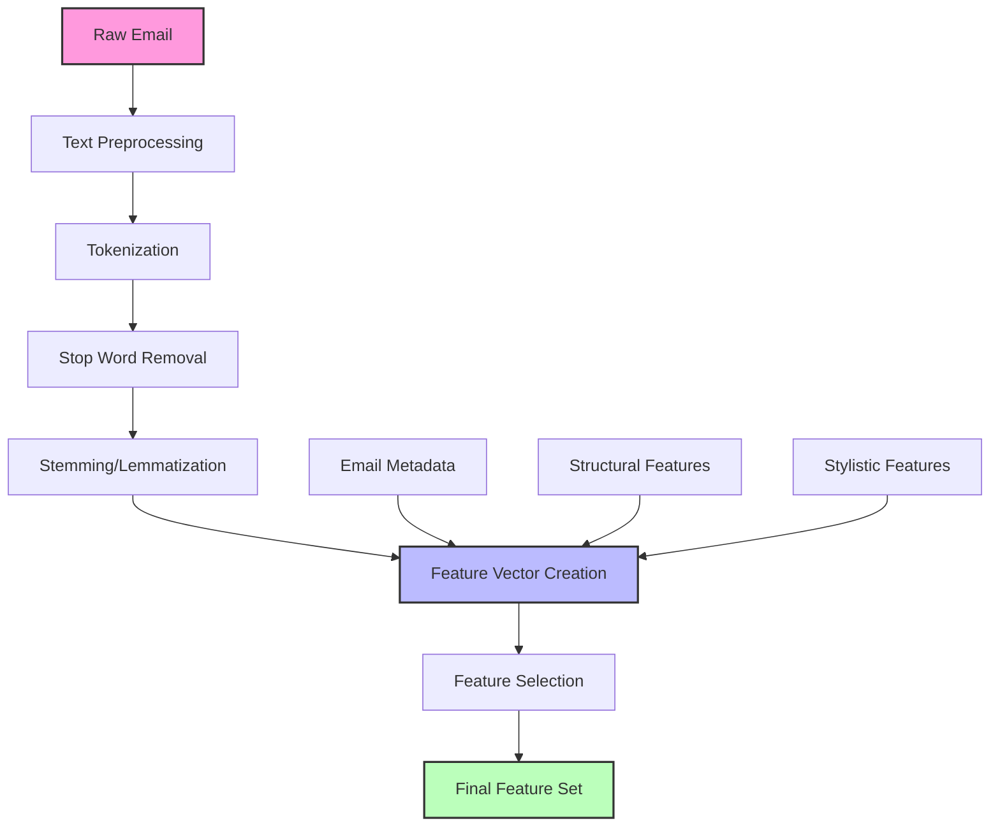
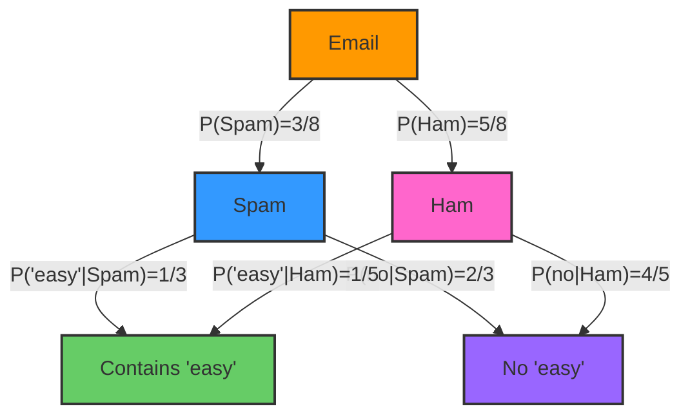
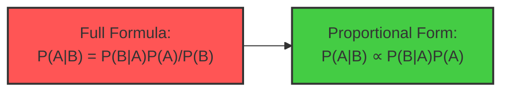

# C-3: Naive Bayes and Spam Classification

1. Naive Bayes Algorithm

    - Intuition Behind Naive Bayes
    - Independence Assumptions
    - Mathematical Formulation
    - Proportional Form Simplification
    - Logarithmic Calculations for Numerical Stability

2. Spam Classification Case Study
    - Feature Selection for Text Classification
    - Training a Naive Bayes Classifier
    - Worked Examples with Email Data
    - Performance and Limitations
    - Comparing with Alternative Approaches

#### Naive Bayes Algorithm

##### Intuition Behind Naive Bayes

Naive Bayes is a simple yet powerful probabilistic classification algorithm based on Bayes' theorem. The fundamental
insight of Naive Bayes is that we can use the probability of features given a class to predict the probability of the
class given those features.

Think of Naive Bayes as similar to how a doctor might diagnose a disease. If certain symptoms are commonly seen in
patients with a particular disease, then a new patient exhibiting those symptoms is more likely to have that disease.
However, instead of relying on intuition, Naive Bayes gives us a mathematical framework to quantify these probabilities.

The algorithm is called "naive" because it makes a simplifying assumption: it assumes that all features are
conditionally independent given the class. While this assumption rarely holds true in real-world scenarios, the
algorithm performs surprisingly well in practice, especially for text classification problems like spam detection.

For example, in email classification, the presence of words like "discount," "free," and "offer" might individually
suggest a higher probability of spam, while words like "meeting," "report," and "project" might suggest legitimate
email. Naive Bayes combines these individual probabilities to make an overall classification.

This intuitive approach can be formalized mathematically using Bayes' theorem, which allows us to reverse the
conditional probability: instead of knowing P(features|class), which we can estimate from training data, we calculate
P(class|features), which is what we need for classification.

##### Independence Assumptions

The "naive" part of Naive Bayes refers to the conditional independence assumption. For a set of features (X₁, X₂, ...,
Xₙ) and a class C, this assumption states:

$$P(X_1, X_2, ..., X_n | C) = P(X_1 | C) \times P(X_2 | C) \times ... \times P(X_n | C) = \prod_{i=1}^{n} P(X_i | C)$$

This means that knowing the class, the presence of one feature does not affect the probability of another feature. In
spam detection, this would imply that knowing an email contains "free" doesn't change the probability it contains
"discount," given we already know it's spam.

This assumption is clearly unrealistic in many cases. Words in natural language are correlated, symptoms in medical
diagnosis often occur together, and features in many classification problems are interrelated. For instance, the phrases
"free offer" and "discount prices" are more common than would be expected if the words were truly independent.

However, the independence assumption has two significant benefits:

1. It dramatically simplifies the model, requiring far fewer parameters to estimate
2. It enables efficient computation, even with large feature sets

Despite its simplifying assumption, Naive Bayes often works well in practice because:

- The classification output depends on the ranking of probabilities, not their exact values
- Even if the independence assumption is violated, the resulting biases often don't change the ranking
- In high-dimensional spaces, the independence assumption can actually help prevent overfitting

The diagram above illustrates the conditional independence assumption in Naive Bayes. The class variable is the parent
of all feature variables, and there are no connections between features. This structure encodes the assumption that
features only depend on the class and are independent of each other given the class.

##### Mathematical Formulation

The formal mathematical foundation of Naive Bayes begins with Bayes' theorem:

$$P(C|X) = \frac{P(X|C) \times P(C)}{P(X)}$$

Where:

- P(C|X) is the posterior probability of class C given features X
- P(X|C) is the likelihood of features X given class C
- P(C) is the prior probability of class C
- P(X) is the evidence or marginal probability of features X

For a spam classification problem, this becomes:

$$P(\text{spam}|\text{email}) = \frac{P(\text{email}|\text{spam}) \times P(\text{spam})}{P(\text{email})}$$

To apply this formula, we need to calculate P(email|spam), the probability of seeing this particular email given that
it's spam. This is challenging because there are countless possible emails. This is where the naive independence
assumption helps.

If we represent an email as a set of words or features [X₁, X₂, ..., Xₙ], then:

$$P(\text{email}|\text{spam}) = P(X_1, X_2, ..., X_n|\text{spam}) = \prod_{i=1}^{n} P(X_i|\text{spam})$$

Now the problem becomes manageable: we need to calculate the probability of each feature (word) occurring in spam
emails, which we can estimate from training data.

The complete Naive Bayes classification formula is:

$$P(C|X_1, X_2, ..., X_n) = \frac{P(C) \times \prod_{i=1}^{n} P(X_i|C)}{P(X_1, X_2, ..., X_n)}$$

For classification, we typically choose the class with the highest posterior probability:

$$\hat{C} = \arg\max_C P(C|X) = \arg\max_C P(C) \times \prod_{i=1}^{n} P(X_i|C)$$

Since P(X) is constant for all classes, we can omit it in the argmax calculation.

In practice, Naive Bayes classifiers come in different variants depending on the assumed distribution of features:

1. **Gaussian Naive Bayes** - For continuous features, assuming they follow a normal distribution
2. **Multinomial Naive Bayes** - For discrete features like word counts in text classification
3. **Bernoulli Naive Bayes** - For binary features (presence/absence)

For text classification like spam filtering, Multinomial and Bernoulli variants are most commonly used.

##### Proportional Form Simplification

When comparing probabilities to choose the most likely class, we only care about their relative values, not their
absolute values. This allows us to use a proportional form of Naive Bayes that simplifies computation.

Instead of calculating P(C|X) directly, we compute P(C|X) ∝ P(C) × ∏ᵢP(Xᵢ|C), where "∝" means "proportional to."

For a binary classification problem between spam and not-spam:

$$P(\text{spam}|X) \propto P(\text{spam}) \times \prod_{i=1}^{n} P(X_i|\text{spam})$$
$$P(\text{not-spam}|X) \propto P(\text{not-spam}) \times \prod_{i=1}^{n} P(X_i|\text{not-spam})$$

We then classify the email as spam if:

$$\frac{P(\text{spam}|X)}{P(\text{not-spam}|X)} > 1$$

This ratio approach avoids the need to calculate the denominator P(X) in Bayes' theorem, which would require summing
over all possible feature combinations.

The ratio can be expanded as:

$$\frac{P(\text{spam}|X)}{P(\text{not-spam}|X)} = \frac{P(\text{spam}) \times \prod_{i=1}^{n} P(X_i|\text{spam})}{P(\text{not-spam}) \times \prod_{i=1}^{n} P(X_i|\text{not-spam})}$$

This means we can directly compare the products of prior and likelihood terms without normalizing. If the ratio is
greater than 1, we classify as spam; otherwise, as not-spam.

This proportional form simplification is not just a mathematical convenience; it also makes the computation more
efficient, especially when dealing with high-dimensional feature spaces typical in text classification.

##### Logarithmic Calculations for Numerical Stability

One practical challenge with the Naive Bayes algorithm is numerical stability. When multiplying many small probabilities
(as in ∏ᵢP(Xᵢ|C)), the result can become extremely small, potentially causing floating-point underflow in computer
implementations.

To address this, we can take the logarithm of the probabilities and add them instead of multiplying, since log(a×b) =
log(a) + log(b). The logarithm is a monotonically increasing function, so it preserves the ordering of probabilities,
which is all we need for classification.

The log-transformed decision rule becomes:

$$\log(P(C|X)) \propto \log(P(C)) + \sum_{i=1}^{n} \log(P(X_i|C))$$

For a binary classifier, we can work with the log ratio:

$$\log\left(\frac{P(\text{spam}|X)}{P(\text{not-spam}|X)}\right) = \log(P(\text{spam})) - \log(P(\text{not-spam})) + \sum_{i=1}^{n} \left[ \log(P(X_i|\text{spam})) - \log(P(X_i|\text{not-spam})) \right]$$

This log-ratio is sometimes called the "log-odds" or "weight of evidence." If it's positive, we classify as spam; if
negative, as not-spam.

Working in the log domain not only prevents numerical underflow but can also make computations faster, as addition is
generally faster than multiplication in computer systems.

Another numerical issue arises when a word never appears in a particular class in the training data, giving it a
conditional probability of zero. This would make the entire product zero (or negative infinity in log space), regardless
of other words. To prevent this, we use smoothing techniques like Laplace (add-one) smoothing:

$$P(X_i|C) = \frac{\text{count}(X_i, C) + \alpha}{\text{count}(C) + \alpha \times |V|}$$

Where α is the smoothing parameter (often 1), and |V| is the vocabulary size. This ensures that no probability is
exactly zero, maintaining numerical stability.

For example, if "mortgage" appears 0 times in our ham training examples, without smoothing P("mortgage"|ham) would be 0,
causing issues. With Laplace smoothing, it becomes (0+1)/(total_ham_words + vocabulary_size), which is small but
non-zero.

These practical considerations—using proportional form, log space calculations, and smoothing—are essential for
implementing an effective Naive Bayes classifier in real-world applications.

#### Spam Classification Case Study

##### Feature Selection for Text Classification

Feature selection is a critical step in building an effective spam classifier. In text classification, we need to
convert emails—raw text documents—into numerical feature vectors that the Naive Bayes algorithm can process.

The most common approach is the "bag of words" model, where each feature represents the presence or absence of a
specific word. More sophisticated versions might count word frequencies or use term frequency-inverse document frequency
(TF-IDF) weights to capture the importance of words.

When selecting features for spam classification, several considerations are important:

First, we need to handle text preprocessing. This typically involves converting all text to lowercase, removing
punctuation, and tokenizing the text into individual words. We might also apply stemming or lemmatization to reduce
words to their root forms (e.g., "running," "runs," and "ran" all become "run").

Second, we must decide which words to include as features. Using every unique word in the corpus would create an
unwieldy number of features, many of which have little predictive value. Common approaches include:

1. Removing stop words (common words like "the," "and," "is") that appear in most documents and have little
   discriminative power
2. Selecting the top N most frequent words after removing stop words
3. Using information gain or chi-squared tests to identify words that best distinguish between spam and non-spam

Third, we can incorporate domain-specific features beyond simple words. For spam detection, useful features might
include:

- Email metadata (sender domain, time sent, number of recipients)
- Structural elements (HTML tags, presence of attachments)
- Stylistic markers (excessive capitalization, special character patterns)
- Hyperlink characteristics (number of links, suspicious domains)

The feature selection process significantly impacts the classifier's performance. Too few features might miss important
signals, while too many can lead to overfitting and increased computational costs. The right balance is typically found
through experimentation and validation.

This diagram illustrates a typical feature extraction and selection pipeline for spam classification. The process
transforms raw emails into a structured feature representation that can be fed into a Naive Bayes classifier.

##### Training a Naive Bayes Classifier

Training a Naive Bayes classifier for spam detection involves estimating the probabilities from a labeled dataset of
spam and non-spam (ham) emails. The process has several key steps:

Step 1: Collect and preprocess a labeled dataset of emails, tagged as either spam or ham. The preprocessing converts
each email into a feature vector based on the selected features.

Step 2: Calculate the prior probabilities of each class based on their frequency in the training data:

- P(spam) = (number of spam emails) / (total number of emails)
- P(ham) = (number of ham emails) / (total number of emails)

Step 3: For each feature (word), calculate its conditional probability given each class:

- P(word_i | spam) = (count of word_i in spam emails + α) / (total word count in spam emails + α × vocabulary size)
- P(word_i | ham) = (count of word_i in ham emails + α) / (total word count in ham emails + α × vocabulary size)

The α term represents Laplace smoothing, which prevents zero probabilities for words that don't appear in the training
examples of a particular class.

Step 4: Store these probabilities in the model for use during classification. The trained model consists of:

- The prior probabilities P(spam) and P(ham)
- The conditional probabilities P(word_i | spam) and P(word_i | ham) for all words in the vocabulary

Let's illustrate this with a simple example. Imagine we have the following tiny training dataset:

Spam:

1. "Win money now!"
2. "Make cash easy!"
3. "Cheap money, reply."

Ham:

1. "How are you?"
2. "There you are!"
3. "Can I borrow money?"
4. "Say hi to grandma."
5. "Was the exam easy?"

We calculate:

- P(spam) = 3/8 = 0.375
- P(ham) = 5/8 = 0.625

For the word "money", we compute:

- P("money" | spam) = (appears in 2 of 3 spam emails) ≈ 0.67
- P("money" | ham) = (appears in 1 of 5 ham emails) ≈ 0.20

The higher probability of "money" in spam helps the classifier identify potential spam messages containing this word.

For real-world implementations, there are several important considerations:

1. **Handling New Words**: During testing, we might encounter words not seen during training. This is typically handled
   through smoothing.
2. **Multi-word Features**: Sometimes phrases are more informative than individual words. For example, "free offer"
   might be a stronger spam indicator than either word alone.
3. **Case Sensitivity**: Deciding whether to treat "Free" and "free" as the same or different features can impact
   classification performance.
4. **Handling Imbalanced Datasets**: In real-world scenarios, ham emails often far outnumber spam. Techniques like
   oversampling or adjusted thresholds can help address this imbalance.

The output of the training process is a Naive Bayes model that can classify new, unseen emails based on the
probabilities estimated from the training data.

##### Worked Examples with Email Data

Let's work through a complete example to classify a new email: "Easy money opportunity."

First, we break this into individual words: ["easy", "money", "opportunity"]

Using the probabilities calculated from our training data (including some we didn't explicitly show above):

P(spam) = 0.375 P(ham) = 0.625

P("easy" | spam) = 0.33 P("easy" | ham) = 0.20 P("money" | spam) = 0.67 P("money" | ham) = 0.20 P("opportunity" | spam)
= 0.10 (after smoothing, assuming it wasn't in training data) P("opportunity" | ham) = 0.05 (after smoothing)

Calculate proportional posterior probabilities:

P(spam | email) ∝ P(spam) × P("easy" | spam) × P("money" | spam) × P("opportunity" | spam) P(spam | email) ∝ 0.375 ×
0.33 × 0.67 × 0.10 ≈ 0.00825

P(ham | email) ∝ P(ham) × P("easy" | ham) × P("money" | ham) × P("opportunity" | ham) P(ham | email) ∝ 0.625 × 0.20 ×
0.20 × 0.05 ≈ 0.00125

Since 0.00825 > 0.00125, we classify this email as spam.

Alternatively, using log probabilities for numerical stability:

log(P(spam | email)) ∝ log(0.375) + log(0.33) + log(0.67) + log(0.10) ≈ -0.98 - 1.11 - 0.40 - 2.30 ≈ -4.79

log(P(ham | email)) ∝ log(0.625) + log(0.20) + log(0.20) + log(0.05) ≈ -0.47 - 1.61 - 1.61 - 3.00 ≈ -6.69

Since -4.79 > -6.69, we classify as spam (less negative means higher probability).

Let's examine another example: "Project meeting tomorrow"

Assume we have these probabilities: P("project" | spam) = 0.05 P("project" | ham) = 0.30 P("meeting" | spam) = 0.10
P("meeting" | ham) = 0.40 P("tomorrow" | spam) = 0.15 P("tomorrow" | ham) = 0.25

Calculate using log probabilities:

log(P(spam | email)) ∝ log(0.375) + log(0.05) + log(0.10) + log(0.15) ≈ -0.98 - 3.00 - 2.30 - 1.90 ≈ -8.18

log(P(ham | email)) ∝ log(0.625) + log(0.30) + log(0.40) + log(0.25) ≈ -0.47 - 1.20 - 0.92 - 1.39 ≈ -3.98

Since -8.18 < -3.98, we classify as ham.

These examples demonstrate how the Naive Bayes classifier combines evidence from multiple words to make a classification
decision. Words like "project" and "meeting" contribute evidence toward the ham classification, while words like "money"
and "easy" push toward spam classification. The classifier effectively aggregates these individual pieces of evidence to
make a final decision.

This word-by-word evidence accumulation is what makes Naive Bayes intuitive and transparent. Each feature contributes
independently to the final classification, and we can examine the influence of individual words on the outcome.

##### Naive Bayes Algorithm for Spam Classification

Naive Bayes is a powerful probabilistic classification technique based on Bayes' Theorem, particularly well-suited for
text classification tasks like spam detection. Let's explore this algorithm and its application to spam filtering.

###### Core Concept: Bayes' Theorem in Classification

The fundamental principle behind Naive Bayes classification is Bayes' Theorem, which allows us to update our belief
about a hypothesis (spam or not spam) based on observed evidence (words in an email):

$$P(\text{spam}|\text{words}) = \frac{P(\text{words}|\text{spam}) \times P(\text{spam})}{P(\text{words})}$$

Where:

- $P(\text{spam}|\text{words})$ is the probability an email is spam given it contains certain words
- $P(\text{words}|\text{spam})$ is the probability of those words appearing in spam emails
- $P(\text{spam})$ is the prior probability of any email being spam
- $P(\text{words})$ is the overall probability of those words appearing in any email

###### The "Naive" Assumption

What makes this approach "naive" is its core assumption that all features (words in an email) are conditionally
independent given the class. This means the algorithm assumes there's no relationship between words like "money" and
"easy" appearing together.

In reality, words in spam often have strong relationships (phrases like "easy money" are common), but this simplifying
assumption makes the calculations much more tractable while still yielding surprisingly effective results.

###### Working Example: Single Feature Classification

Let's analyze the example from the document:

Given:

- P(Spam) = 3/8 = 0.375
- P(Ham) = 5/8 = 0.625
- P('easy'|Spam) = 1/3 = 0.333
- P('easy'|Ham) = 1/5 = 0.2

To calculate P(Spam|'easy'), we apply Bayes' Theorem:

$$P(\text{Spam}|\text{'easy'}) = \frac{P(\text{'easy'}|\text{Spam}) \times P(\text{Spam})}{P(\text{'easy'})}$$

Where:
$$P(\text{'easy'}) = P(\text{'easy'}|\text{Spam}) \times P(\text{Spam}) + P(\text{'easy'}|\text{Ham}) \times P(\text{Ham})$$
$$P(\text{'easy'}) = 1/3 \times 3/8 + 1/5 \times 5/8 = 1/8 + 1/8 = 2/8 = 0.25$$

Therefore: $$P(\text{Spam}|\text{'easy'}) = \frac{1/3 \times 3/8}{2/8} = \frac{1/8}{2/8} = \frac{1}{2} = 0.5$$

This means when we see the word "easy" in an email, there's a 50% probability it's spam.

###### Multiple Features: The Power of Naive Bayes

For multiple words, using our independence assumption, we can simply multiply the individual conditional probabilities:

$$P(\text{Spam}|\text{'easy', 'money'}) \propto P(\text{'easy'}|\text{Spam}) \times P(\text{'money'}|\text{Spam}) \times P(\text{Spam})$$

Given:

- P('money'|Spam) = 2/3
- P('money'|Ham) = 1/5

For Spam: $$P(\text{Spam}|\text{'easy', 'money'}) \propto 1/3 \times 2/3 \times 3/8 = 2/36 = 1/18 \approx 0.056$$

For Ham: $$P(\text{Ham}|\text{'easy', 'money'}) \propto 1/5 \times 1/5 \times 5/8 = 1/40 = 0.025$$

Since 0.056 > 0.025, the classifier would label an email containing both "easy" and "money" as spam.

To get actual probabilities, we normalize these values:
$$P(\text{Spam}|\text{'easy', 'money'}) = \frac{0.056}{0.056 + 0.025} \approx 0.69$$

So there's about a 69% chance this email is spam.

###### The Proportional Form Advantage

Notice that we used the proportional form (∝) in our calculation:

$$P(A|B) \propto P(B|A)P(A)$$

This simplifies our work by avoiding calculation of P(B), which can be complex especially when dealing with many
features. We only need to compare relative values to make classification decisions, and can normalize at the end if
absolute probabilities are required.

###### Practical Implementation Considerations

In practice, several enhancements make Naive Bayes even more effective:

1. **Logarithmic Transformation**: To prevent numerical underflow when multiplying many small probabilities, we often
   work with log probabilities:
   $$\log(P(\text{Spam}|\text{words})) \propto \log(P(\text{Spam})) + \sum_i \log(P(\text{word}_i|\text{Spam}))$$
2. **Laplace Smoothing**: To handle words that haven't appeared in the training data for a particular class, we add a
   small count (typically 1) to all word counts:
   $$P(\text{word}|\text{class}) = \frac{\text{count}(\text{word in class}) + 1}{\text{count}(\text{all words in class}) + \text{vocabulary size}}$$
3. **Feature Selection**: Not all words are equally informative. Techniques like chi-square testing or mutual
   information can select the most discriminative words.

###### Why Naive Bayes Works Well for Text

Despite its simplifying assumptions, Naive Bayes is remarkably effective for text classification because:

1. The conditional independence assumption, while incorrect, often doesn't significantly impact classification
   decisions.
2. It requires relatively little training data to estimate parameters.
3. It's computationally efficient, allowing for real-time classification.
4. It handles high-dimensional data (many different words) naturally.
5. The model is easy to interpret and update as new data becomes available.

###### Applications Beyond Spam

Naive Bayes extends well beyond spam filtering to:

- Document categorization (news, sports, politics, etc.)
- Sentiment analysis (positive/negative reviews)
- Author attribution
- Medical diagnosis (where symptoms might be treated as independent features)
- Recommendation systems

This algorithm demonstrates how a mathematically sound yet computationally simple approach can yield powerful practical
applications, and how sometimes a "naive" solution can be surprisingly effective for complex real-world problems.

##### Performance and Limitations

Naive Bayes classifiers for spam detection typically achieve good performance, with accuracy often in the 80-95% range,
depending on the dataset and feature engineering. The algorithm has several strengths that make it well-suited for spam
classification:

1. Efficient training and classification, even with large vocabularies
2. Performs well with limited training data
3. Naturally handles multi-class problems
4. Relatively robust to irrelevant features
5. Provides probabilistic outputs, not just binary classifications

However, the Naive Bayes approach also has significant limitations:

1. The independence assumption often doesn't hold in real text. Word combinations like "New York" or "credit card" have
   very different meanings than the individual words would suggest, but Naive Bayes treats them independently.
2. The classifier can be sensitive to data preprocessing and feature selection. Different tokenization approaches or
   stop word lists can materially affect results.
3. It doesn't capture word order or document structure. The sentence "I don't want spam emails" contains the word "spam"
   but is clearly not spam itself.
4. Class imbalance can cause problems. If the training data has many more ham than spam examples (which is typical), the
   classifier might be biased toward predicting ham.
5. Feature redundancy can overemphasize certain aspects. If multiple features essentially capture the same information
   (like "free," "FREE," and "fr33"), they're counted as independent evidence, potentially skewing predictions.
6. Spammers adapt their tactics over time, leading to concept drift. A classifier trained on older data may perform
   poorly on newer spam techniques.

A practical illustration of the independence assumption limitation can be seen in the difference between "cheap stocks"
(likely spam about penny stocks) and "stocks cheap" (possibly legitimate discussion about undervalued stocks). Since
Naive Bayes ignores word order, it cannot distinguish between these phrases.

To address some of these limitations, spam filters often combine Naive Bayes with other techniques, like maintaining
blacklists of known spam sources or using more sophisticated text representation methods.

##### Comparing with Alternative Approaches

While Naive Bayes remains popular for spam filtering, several alternative approaches offer different trade-offs:

1. **Support Vector Machines (SVM)**: SVMs can capture more complex decision boundaries between spam and ham. They often
   outperform Naive Bayes but require more computational resources and careful parameter tuning.
2. **Random Forests and Gradient Boosting**: These ensemble methods can capture non-linear relationships between
   features and may perform better than Naive Bayes, especially with categorical features or when feature interactions
   are important.
3. **Logistic Regression**: Similar in complexity to Naive Bayes but doesn't make the independence assumption. It can be
   more accurate when features are correlated but requires more training data to estimate parameters reliably.
4. **Deep Learning Approaches**: Techniques like word embeddings, convolutional neural networks (CNNs), and recurrent
   neural networks (RNNs) can capture semantic meaning and word order, potentially leading to better classification.
   However, they require substantially more data and computational resources.
5. **Content-Based Filtering**: Techniques that analyze the structure and content of emails beyond simple word
   frequency, looking at HTML patterns, image-to-text ratios, or linguistic features.
6. **Collaborative Filtering**: Systems that use feedback from many users to identify spam. If many users mark a similar
   email as spam, the system will flag it for others.

A comparative analysis might look like:

| Approach       | Advantages                                                                        | Disadvantages                                                      |
| -------------- | --------------------------------------------------------------------------------- | ------------------------------------------------------------------ |
| Naive Bayes    | Fast training and prediction, works well with limited data, probabilistic outputs | Independence assumption often violated, doesn't capture word order |
| SVM            | Better accuracy, handles correlated features                                      | Slower training, sensitive to parameter tuning                     |
| Random Forest  | Captures feature interactions, handles mixed data types                           | More complex, higher memory requirements                           |
| Deep Learning  | Captures semantic meaning and structure                                           | Requires large training datasets, computationally intensive        |
| Hybrid Systems | Combines strengths of multiple approaches                                         | More complex implementation and maintenance                        |

In practice, many commercial spam filters use a combination of techniques. They might start with a simple Naive Bayes
filter for efficiency, then apply more computationally intensive methods to borderline cases. They also typically
incorporate user feedback to continuously update and improve their models.

The best approach depends on specific requirements around accuracy, computational resources, interpretability, and the
ability to adapt to evolving spam tactics. Despite its simplicity, Naive Bayes often serves as a strong baseline and
remains relevant in production systems due to its efficiency and reasonable performance.

Modern spam filters have evolved beyond simple word-based classification to combat sophisticated spamming techniques.
They now incorporate:

- Reputation-based filtering (tracking sender IP addresses and domains)
- Behavioral analysis (looking at email sending patterns)
- URL and attachment scanning
- Advanced linguistic analysis (detecting obfuscated text)

However, the principles of probabilistic classification pioneered by Naive Bayes remain at the core of many of these
systems, making it an essential algorithm to understand when working with text classification problems.
