# C-4: Bayesian Networks and Inference Methods

1. Bayesian Network Architecture

    - Parameter Calculation and Storage
    - D-Separation and Information Flow
    - Markov Blanket and Local Dependencies
    - Network Construction Methods
    - Parameter Estimation from Data

2. Inference in Bayesian Networks

    - Exact vs. Approximate Inference

    - Variable Elimination Algorithm

    - Sampling-Based Methods

    - Inference Types and Queries

    - Computational Complexity Challenges

    - Enumeration in Probabilistic Reasoning

#### Bayesian Network Architecture

##### Parameter Calculation and Storage

Bayesian networks achieve their remarkable efficiency by factoring joint probability distributions according to
conditional independence relationships. This factorization directly affects how we calculate and store the parameters of
the network.

For a Bayesian network with $n$ variables, each parameter represents a conditional probability value. The total number
of parameters depends on the network structure and the cardinality (number of possible values) of each variable. For a
node with k possible values and parents with a combined total of j possible configurations, we need k-1 parameters for
each parent configuration, resulting in j(k-1) parameters for that node.

The formula for calculating the number of parameters for a node X is:

$$\text{Parameters for node } X = (|X| - 1) \times \prod_{Y \in \text{Parents}(X)} |Y|$$

Where |X| represents the number of possible values (states) of X.

Let's understand this with an example. Consider a simple weather model with three binary nodes (each having two states:
True/False):

- Cloudy (C)
- Rain (R, depends on Cloudy)
- WetGrass (W, depends on Rain)

For the Cloudy node (a root node with no parents), we need |C|-1 = 2-1 = 1 parameter (just P(C=True), as P(C=False) =
1-P(C=True)).

For the Rain node (with Cloudy as parent), we need (|R|-1) × |C| = 1 × 2 = 2 parameters: P(R=True|C=True) and
P(R=True|C=False).

For the WetGrass node (with Rain as parent), we need (|W|-1) × |R| = 1 × 2 = 2 parameters: P(W=True|R=True) and
P(W=True|R=False).

In total, this simple network requires 1 + 2 + 2 = 5 parameters, much fewer than the 2³-1 = 7 parameters needed to
specify the full joint distribution directly.

This efficiency becomes even more dramatic in larger networks. For instance, a network with 20 binary variables where
each has at most 3 parents would require at most 20 × 2³ = 160 parameters, compared to 2²⁰-1 ≈ 1 million parameters for
the full joint distribution.

Parameters are typically stored in Conditional Probability Tables (CPTs) or, for continuous variables, as parametric
distributions (like Gaussians). Modern implementations may use various compact representations for CPTs, such as:

1. Tree-structured CPTs that exploit context-specific independence
2. Rule-based representations that combine similar parameter values
3. Noisy-OR/Noisy-AND models for large parent sets
4. Algebraic Decision Diagrams (ADDs) for efficient storage and manipulation

These compact representations not only save memory but can also accelerate inference algorithms by exploiting the
regularities in the probability distributions.

A Bayesian Network (Bayes Net) is a probabilistic graphical model that represents variables and their conditional
dependencies using a directed acyclic graph (DAG). This powerful framework allows us to model complex relationships and
reason under uncertainty.

###### Components of a Bayes Net

A Bayesian Network consists of:

1. Random variables (In the example: S for Sunny, R for Raise, H for Happiness)
2. Conditional independence relationships (represented by the graph structure)
3. Probability distributions (prior and conditional probabilities)

The graph structure shows S and R as parent nodes to H, indicating that happiness is directly influenced by both weather
conditions and receiving a raise. S and R are not connected, implying they are independent. However, they become
conditionally dependent when we observe H (a phenomenon known as the "explaining away" effect).

###### Probability Distributions in Bayes Nets

Bayesian Networks require two types of probability specifications:

- Prior probabilities for root nodes (nodes without parents): P(S), P(R)
- Conditional probabilities for child nodes: P(H|S,R), P(H|¬S,R), P(H|S,¬R), P(H|¬S,¬R)

These probabilities allow us to perform various types of inference, such as calculating P(R|H,S) or P(R|H,¬S), which
represent the probability of receiving a raise given happiness and weather conditions.

###### Explaining Away Phenomenon

The "explaining away" effect is demonstrated by the difference between P(R|H,S) and P(R|H,¬S). The probability of a
raise is higher when someone is happy on a non-sunny day (8.33%) compared to a sunny day (1.42%). This occurs because
when it's not sunny, a raise better explains the observed happiness since good weather isn't available as an
explanation.

###### Calculating Parameters in Bayesian Networks

The number of parameters needed to define a node's conditional probability distribution follows this formula:

$$\text{Parameters} = (|S| - 1) \times \prod_i |P_i|$$

Where:

- |S| = Number of states for the node
- |Pᵢ| = Number of states for the i-th parent
- ∏ᵢ = Product over all parents

In simpler terms:

$$\text{Parameters} = (\text{Number of states} - 1) \times (\text{Product of parent states})$$

###### Understanding the Parameter Formula

Let's break down why this formula works:

1. **(Number of states - 1)**: For any node with n states, we only need to specify n-1 probabilities because the last
   one can be calculated (probabilities must sum to 1).

    For example, with a "Weather" node having states [Sunny, Rainy, Cloudy]:

    - If P(Sunny) = 0.6 and P(Rainy) = 0.3
    - Then P(Cloudy) = 1 - 0.6 - 0.3 = 0.1

2. **(Product of parent states)**: We need different probability distributions for each possible combination of parent
   states.

    For a node with two parents:

    - Weather: [Sunny, Rainy] (2 states)
    - Temperature: [Hot, Cold] (2 states)

    This creates 2 × 2 = 4 different contexts for which we need probability distributions.

###### Example: Ice Cream Sales Network

Consider a Bayesian network about ice cream sales:

1. "Weather" (Parent 1): [Sunny, Rainy, Cloudy] (3 states)
2. "Temperature" (Parent 2): [Hot, Cold] (2 states)
3. "Ice Cream Sales" (Child node): [High, Medium, Low] (3 states)

To calculate parameters needed for "Ice Cream Sales":

- Number of states - 1 = 3 - 1 = 2 parameters per combination
- Product of parent states = 3 (Weather states) × 2 (Temperature states) = 6 combinations
- Total parameters = 2 × 6 = 12 parameters

For each combination of Weather and Temperature (6 combinations):

- Sunny & Hot
- Sunny & Cold
- Rainy & Hot
- Rainy & Cold
- Cloudy & Hot
- Cloudy & Cold

We need to specify probabilities for 2 of the 3 states (High, Medium) for each combination. The third state (Low) can be
calculated since probabilities must sum to 1.

For example, given Sunny & Hot:

- P(Sales=High | Sunny, Hot) = 0.7
- P(Sales=Medium | Sunny, Hot) = 0.2
- P(Sales=Low | Sunny, Hot) = 0.1 (calculated: 1 - 0.7 - 0.2)

###### Common Cases in Parameter Calculation

1. Root nodes (no parents):
    - Only need (states - 1) parameters
    - Single state root nodes need 0 parameters
2. Binary nodes (2 states):
    - Need 1 parameter per parent combination
    - Common in real-world applications
3. Multiple parents:
    - Parameters grow exponentially with parent count
    - Demonstrates why efficient network structure matters

This parameter counting method ensures we capture all necessary probabilities while avoiding redundancy, making Bayesian
Networks both expressive and computationally manageable for representing complex probabilistic relationships.

###### Required probability values to specify this Bayes Network

In Bayesian networks, we need to specify probability distributions for each node. Let's analyze how many parameters are
needed for different network structures.

###### First Network Example

The first network has this structure:

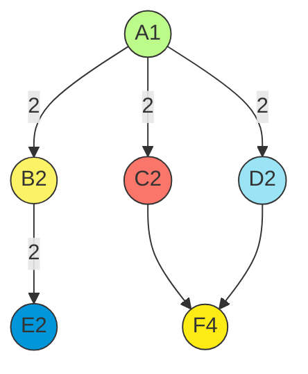

Each node is labeled with its number of states in parentheses (e.g., A(1) means node A has 1 state).

Let's calculate the required parameters for each node:

1. **Node A (1 state, root node)**:
    - Formula: states - 1
    - Calculation: 1 - 1 = 0 parameters
2. **Nodes B, C, D (each 2 states, parent A has 1 state)**:
    - Formula: (states - 1) × parent states
    - For each node: (2 - 1) × 1 = 1 parameter
    - Total for these nodes: 3 × 1 = 3 parameters
3. **Node E (2 states, parent B has 2 states)**:
    - Formula: (states - 1) × parent states
    - Calculation: (2 - 1) × 2 = 2 parameters
4. **Node F (4 states, parents C and D each have 2 states)**:
    - Formula: (states - 1) × (product of parent states)
    - Calculation: (4 - 1) × (2 × 2) = 3 × 4 = 12 parameters

Total parameters for the first network:

- Root Node: 0
- Nodes B, C, D: 3
- Node E: 2
- Node F: 12
- Total: 0 + 3 + 2 + 12 = 17 parameters

This calculation shows that 17 parameters are needed to fully specify this network, with each node's parameter count
determined by its states and its parents' states.

###### Second Network Example

The second network has this structure:

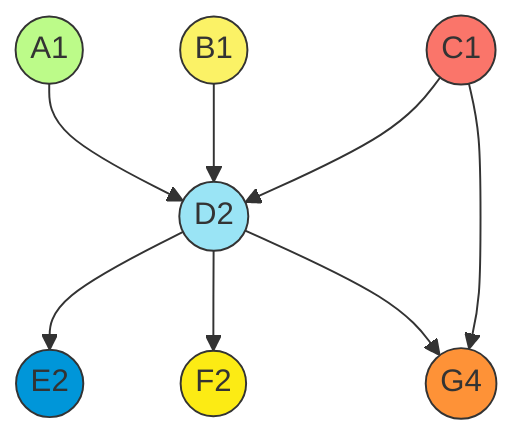

Let's calculate the required parameters:

1. **Nodes A, B, C (each 1 state, root nodes)**:
    - Formula: states - 1
    - Calculation: 1 - 1 = 0 parameters each
    - Total for root nodes: 0 parameters
2. **Node D (2 states, parents A, B, C each with 1 state)**:
    - Formula: (states - 1) × (product of parent states)
    - Calculation: (2 - 1) × (1 × 1 × 1) = 1 parameter
3. **Nodes E and F (each 2 states, parent D has 2 states)**:
    - Formula: (states - 1) × parent states
    - For each node: (2 - 1) × 2 = 2 parameters
    - Total for nodes E and F: 2 × 2 = 4 parameters
4. **Node G (4 states, parents D(2) and C(1))**:
    - Formula: (states - 1) × (product of parent states)
    - Calculation: (4 - 1) × (2 × 1) = 3 × 2 = 6 parameters

Total parameters for the second network:

- Root Nodes (A, B, C): 0
- Node D: 1
- Nodes E and F: 4
- Node G: 6
- Total: 0 + 1 + 4 + 6 = 11 parameters

Wait, there seems to be a discrepancy in the original calculation for Node G. Let me double-check:

- Node G has 4 states (4-1 = 3 parameters needed per parent combination)
- Parents are D(2) and C(1), giving 2×1 = 2 parent combinations
- Total parameters for G: 3×2 = 6 (not 14 as shown in the original)

The correct total for the second network should be 11 parameters, not 19 as originally calculated.

###### Understanding the Parameter Calculation

The formula (states - 1) × (product of parent states) works because:

1. For any node with n states, we only need n-1 probabilities (the last one can be calculated since they sum to 1)
2. We need a different set of probabilities for each possible combination of parent states
3. The number of combinations is the product of the number of states each parent can take

This parameter counting method ensures we capture all necessary probabilities while maintaining computational efficiency
by avoiding redundancy.

###### Car Start Failure Analysis

Bayesian networks provide a powerful framework for modeling complex systems with multiple interacting components. This
example examines how various car components can affect whether a car starts properly.

###### Network Visualization

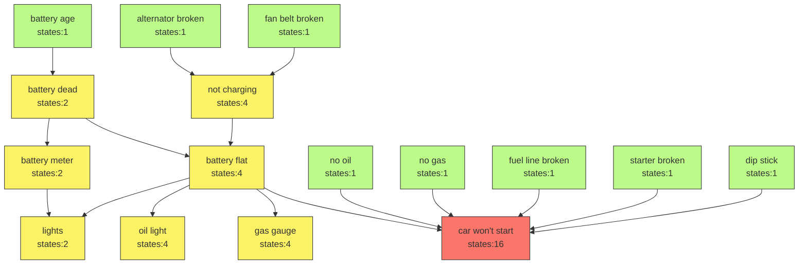

In this diagram:

- Nodes are labeled with their names and number of states
- Root nodes (initial causes) appear in light blue
- Intermediate nodes (system states) appear in light orange
- The target node (car won't start) appears in light red
- Arrows indicate causal relationships between components

###### Network Structure Description

This Bayesian network models various factors that can cause a car not to start, organized in a hierarchical structure:

1. Battery System Chain:

    - Battery Age

        (1 state) influences:

        - Battery Dead

            (2 states), which affects:

            - **Battery Meter** (2 states) → controls **Lights** (2 states)
            - **Battery Flat** (4 states) → influences multiple indicators

2. Charging System Chain:

    - Alternator Broken

        (1 state) and

        Fan Belt Broken

        (1 state) both affect:

        - **Not Charging** (4 states) → leads to **Battery Flat**

3. Indicator Systems:

    - Battery Flat

        influences multiple indicators:

        - **Lights** (2 states)
        - **Oil Light** (4 states)
        - **Gas Gauge** (4 states)

4. Direct Failure Causes: Multiple components directly affect **Car Won't Start** (16 states):

    - **Battery Flat** (4 states)
    - **No Oil** (1 state)
    - **No Gas** (1 state)
    - **Fuel Line Broken** (1 state)
    - **Starter Broken** (1 state)
    - **Dip Stick** (1 state)

The network effectively models how different car components interact and how their failures propagate through the system
to ultimately cause the car not to start, while also including observable symptoms that can help in diagnosis.

###### Parameter Calculation Analysis

When working with Bayesian networks, we need to determine how many parameters are required to specify the model. A
common mistake is to use a naive approach that ignores the network structure.

The naive join approach incorrectly assumes we need to consider every possible combination of every state of every node:

For a network with 16 nodes, a naive calculation might suggest 2¹⁶ - 1 = 65,535 combinations.

This approach is incorrect because:

1. It treats every node as binary (2 states) when many nodes have 1, 4, or 16 states
2. It ignores the network structure and dependencies
3. It calculates ALL possible combinations rather than just the necessary conditional probabilities
4. It doesn't follow the Bayesian network parameter formula: (States-1) × (Product of parent states)

###### Correct Parameter Calculation

The proper way to calculate parameters is to use the formula for each node:

**Parameters = (States-1) × (Product of parent states)**

Let's apply this node by node:

1. Root Nodes (all 1 state): All have (1-1) = 0 parameters each
    - Battery Age (1): 0
    - Alternator Broken (1): 0
    - Fan Belt Broken (1): 0
    - Starter Broken (1): 0
    - Fuel Line Broken (1): 0
    - Dip Stick (1): 0
    - No Oil (1): 0
    - No Gas (1): 0 Total: 0
2. Battery Chain:
    - Battery Dead (2 states, parent: Battery Age[1]): (2-1) × 1 = 1
    - Battery Meter (2 states, parent: Battery Dead[2]): (2-1) × 2 = 2
3. Charging Chain:
    - Not Charging (4 states, parents: Alternator[1], Fan Belt[1]): (4-1) × (1 × 1) = 3
    - Battery Flat (4 states, parents: Battery Dead[2], Not Charging[4]): (4-1) × (2 × 4) = 3 × 8 = 24
4. Indicator Nodes:
    - Lights (2 states, parents: Battery Meter[2], Battery Flat[4]): (2-1) × (2 × 4) = 8
    - Oil Light (4 states, parent: Battery Flat[4]): (4-1) × 4 = 12
    - Gas Gauge (4 states, parent: Battery Flat[4]): (4-1) × 4 = 12
5. Target Node:
    - Car Won't Start (16 states, parents: Battery Flat[4], No Oil[1], No Gas[1], Fuel Line[1], Starter[1], Dip
      Stick[1]): (16-1) × (4 × 1 × 1 × 1 × 1 × 1) = 15 × 4 = 60

Adding all parameters: 0 + 1 + 2 + 3 + 24 + 8 + 12 + 12 + 60 = 122 parameters

This calculation shows that the Bayesian network approach is much more efficient than a naive joint probability
distribution would be. While 122 parameters might still seem like a lot, it's vastly fewer than the 65,535 that a naive
approach would suggest.

The efficiency comes from the network structure capturing the conditional independence relationships between variables,
allowing us to factorize the joint distribution into smaller conditional probabilities that require fewer parameters to
specify.

##### D-Separation and Information Flow

D-separation (directional separation) is a fundamental concept in Bayesian networks that determines whether variables
are conditionally independent given observed evidence. It provides a graphical criterion for reading independence
relationships directly from the network structure, without performing numerical calculations.

The core insight of d-separation is that information flows through a Bayesian network in specific patterns, and this
flow can be blocked under certain conditions. Understanding these patterns helps us reason about independence
relationships and design efficient inference algorithms.

There are three basic connection patterns in Bayesian networks:

1. **Serial Connection (Chain)**: $X → Y → Z$

    - Information flows through Y if Y is not observed
    - If Y is observed, X and Z become conditionally independent
    - Example: Disease → Symptom → Treatment
    - If we know the symptom (Y), then knowledge about the disease (X) doesn't provide additional information about the
      treatment (Z)

        ```mermaid
        graph TD
            subgraph "Serial Connection"
            A1[X] --> B1[Y]
            B1 --> C1[Z]
            end
  
            style A1 fill:#BCFB89,stroke:#333,stroke-width:1px
            style B1 fill:#FBF266,stroke:#333,stroke-width:1px
            style C1 fill:#FA756A,stroke:#333,stroke-width:1px
        ```

2. **Diverging Connection (Fork)**: $X ← Y → Z$

    - Information flows through Y if Y is not observed
    - If Y is observed, X and Z become conditionally independent
    - Example: Fever ← Infection → Rash
    - If we know about the infection (Y), then information about fever (X) doesn't change our beliefs about rash (Z)

        ```mermaid
        graph TD
            subgraph "Diverging Connection"
            B2[Y] --> A2[X]
            B2 --> C2[Z]
            end
    
            style A2 fill:#9AE4F5,stroke:#333,stroke-width:1px
            style B2 fill:#0096D9,stroke:#333,stroke-width:1px
            style C2 fill:#FCEB14,stroke:#333,stroke-width:1px
        ```

3. **Converging Connection (V-structure)**: $X → Y ← Z$

    - Information is blocked if Y and all Y's descendants are not observed
    - Information flows if Y or any of Y's descendants are observed
    - Example: Rain → WetGrass ← Sprinkler
    - If we observe wet grass (Y), then rain (X) and sprinkler (Z) become dependent

        ```mermaid
        graph TD
            subgraph "Converging Connection"
            A3[X] --> C3[Y]
            B3[Z] --> C3
            end
        
            style A3 fill:#FE9237,stroke:#333,stroke-width:1px
            style B3 fill:#BCFB89,stroke:#333,stroke-width:1px
            style C3 fill:#FBF266,stroke:#333,stroke-width:1px
        ```

Using these patterns, we can determine if two variables A and B are d-separated by a set of observed variables Z by
checking all paths between A and B. If every path is blocked (according to the rules above), then A and B are
d-separated given Z, which means they are conditionally independent given Z.

This has important practical implications:

- It tells us which variables need to be considered during inference
- It identifies irrelevant variables that can be safely ignored
- It guides the design of inference algorithms by revealing the flow of information
- It helps validate the structure of Bayesian networks against domain knowledge

For a more complex example, consider the classic "Asia" network used in medical diagnosis. Here, determining whether
symptoms like Dyspnea and X-ray results are d-separated given knowledge of lung cancer can guide which variables need to
be included in the diagnostic reasoning process.

D-separation is a formal criterion used in Bayesian networks to determine when variables are conditionally independent
given a set of observed variables. This concept is essential for understanding how information flows through a
probabilistic graphical model and has important implications for inference algorithms.

###### D-separation Rules

Two variables X and Y are D-separated by a set of variables Z if and only if:

1. All paths between X and Y are blocked given Z
2. A path is blocked if it contains:
    - A serial or diverging connection where the middle node is in Z (observed)
    - A converging connection where neither the middle node nor any of its descendants are in Z

Variables that are not D-separated are D-connected, meaning information can flow between them even when conditioning on
Z.

###### Practical Application: Tree Structure

Let's analyze D-separation in a simple tree structure:

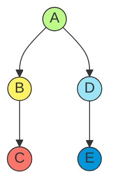

This diagram represents the tree structure described in the d-separation example, where A is the root node with two children (B and D), B has a child C, and D has a child E. The structure is important for understanding d-separation properties where we analyze whether paths between nodes are blocked or not depending on which variables are observed.

1. **C ⊥ A (No)** - Not D-separated
    - Path: $C ← B ← A$
    - This is a serial connection (chain)
    - B is not observed
    - Information can flow from A to C through B
    - Result: C and A are dependent
    
2. **C ⊥ A|B (Yes)** - D-separated
    
    - Path: $C ← B ← A$
    - B is observed (given in the condition)
    - B blocks the path between A and C when observed
    - Result: C and A are conditionally independent given B
    
3. **C ⊥ D (No)** - Not D-separated
    
    - Path: $C ← B ← A → D$
    
    - This is a diverging connection at A
    
    - A is not observed
    
    - Information can flow from C to D through their common ancestor A
    
    - Result: C and D are dependent
    
      When we're analyzing whether C and D are d-separated, we need to carefully trace the path between them and examine the nature of the connections along this path.
    
      In this case, the path between C and D is: $C ← B ← A → D$
    
      This path contains what's called a "diverging connection" (also known as a "fork pattern") at node A. A diverging connection occurs when we have a pattern like $X ← Y → Z$, where Y is the common parent of both X and Z. In our example, A is the common ancestor of both C and D.
    
      ```mermaid
      graph TD
          A((A)) --> B((B))
          A --> D((D))
          B --> C((C))
          D --> E((E))
      
          style A fill:#BCFB89,stroke:#333,stroke-width:1px
          style B fill:#FBF266,stroke:#333,stroke-width:1px
          style C fill:#FA756A,stroke:#333,stroke-width:1px
          style D fill:#9AE4F5,stroke:#333,stroke-width:1px
          style E fill:#0096D9,stroke:#333,stroke-width:1px
      ```
    
      For diverging connections, the rule for d-separation states:
    
      - If the middle node (A in this case) is **not observed**, then information can flow through this connection
      - If the middle node is observed, then the path is blocked and no information flows
    
      In the statement "C ⊥ D (No)", the symbol "⊥" means "is independent of" and "No" indicates that this independence claim is false. So this is saying "C is NOT independent of D" when we have no observations.
    
      Why? Because:
    
      1. The path between C and D goes through A
      2. This forms a diverging connection at A (the pattern C ← B ← A → D)
      3. Node A is not observed (not in our conditioning set)
      4. Without observing A, information can flow from C to D through their common ancestor
      5. Therefore, C and D are dependent - they are not d-separated
    
      This makes intuitive sense: knowing something about C gives us information about its ancestor A, which in turn gives us information about D. For example, if we observe that C has some property that tends to be inherited from A, then we'd update our belief about whether A has that property, which would then update our belief about whether D might have inherited that property.
    
      If we were to observe A (condition on A), then C and D would become conditionally independent - a phenomenon that's explicitly noted in another example in the document as "C ⊥ D|A (Yes)".
    
4. **C ⊥ D|A (Yes)** - D-separated
    
    - Path: C ← B ← A → D
    
    - A is observed (given in the condition)
    
    - A blocks the path when observed in a diverging connection
    
    - Result: C and D are conditionally independent given A
    
      ###### The Path Analysis
    
      When we look at the statement "C ⊥ D|A (Yes)", it means "C is independent of D given A" (the vertical bar | means "given" or "conditioned on"). The "Yes" confirms this independence claim is true.
    
      The path between C and D is: C ← B ← A → D
    
      This path contains a diverging connection (fork pattern) at node A, where information flows from a common cause (A) to multiple effects (eventually reaching both C and D).
    
      ###### How Conditioning Works in Diverging Connections
    
      In a diverging connection like X ← Y → Z, we have this key rule:
    
      - When the middle node (Y) is **observed**, the path is **blocked**
      - When the middle node is **not observed**, the path is **open**
    
      In our case, A is the middle node in this diverging pattern, and we are observing A (conditioning on it).
    
      ###### Why This Makes C and D Independent
    
      When we observe A:
    
      1. We fix A to a specific value (let's say A = a)
      2. All information that would normally flow from C to A to D is blocked
      3. Knowing the value of C no longer tells us anything new about A (since we already know A = a)
      4. And therefore, C cannot give us any information about D
    
      ###### Intuitive Example
    
      Imagine A represents whether it rained last night, B represents whether the grass is wet in the front yard, C represents whether your shoes get wet when walking through the front yard, and D represents whether the grass is wet in the backyard.
    
      Normally (without observing A), if you notice your shoes are wet after walking in the front yard (C), you might infer it probably rained last night (A), which would increase your belief that the backyard grass is also wet (D).
    
      But if you already know for certain whether it rained last night (A is observed), then learning your shoes got wet in the front yard (C) doesn't change your belief about the backyard grass (D). If you know it rained, you already expect the backyard to be wet; if you know it didn't rain, then your wet shoes must be due to something else (like a sprinkler) that doesn't affect your belief about the backyard.
    
      ###### Mathematical Perspective
    
      Conditioning on A means:
    
      - P(C,D|A) = P(C|A) × P(D|A)
    
      This factorization is the mathematical definition of conditional independence. The joint probability of C and D given A is simply the product of their individual probabilities given A.
    
      This is the formal criterion for d-separation: when all paths between two variables are blocked by observed variables, the two variables are conditionally independent given those observations.
    
5. **E ⊥ C|D (Yes)** - D-separated
    
    - Path: $E ← D ← A → B → C$
    
    - This path contains both diverging (at A) and serial (through B) connections
    
    - D is observed (given in the condition)
    
    - D blocks the path in the serial connection
    
    - Result: E and C are conditionally independent given D
    
      The statement "$E ⊥ C|D$ (Yes)" indicates that E and C are conditionally independent given D. This means that once we know the value of D, learning information about E tells us nothing new about C (and vice versa). 
    
      "Given D" means exactly that - D is observed or known. When we write E ⊥ C|D, the vertical bar | represents conditioning, which means we're considering a scenario where we already know the value of variable D. This is a fundamental concept in probability theory called conditional independence. When we say "E is conditionally independent of C given D," we're stating that if we already know the value of D, then learning the value of E provides no additional information about the value of C (and vice versa). Let's analyze why this conditional independence holds true:
    
      The path between E and C is: $E ← D ← A → B → C$
    
      This path contains multiple connection types:
    
      - A serial connection (chain) between E and D ($E ← D$)
      - A serial connection between D and A ($D ← A$)
      - A diverging connection (fork) at node A ($D ← A → B$)
      - A serial connection between B and C ($B → C$)
    
      ```mermaid
      graph TD
          A((A)) --> B((B))
          A --> D((D))
          B --> C((C))
          D --> E((E))
      
          style A fill:#BCFB89,stroke:#333,stroke-width:1px
          style B fill:#FBF266,stroke:#333,stroke-width:1px
          style C fill:#FA756A,stroke:#333,stroke-width:1px
          style D fill:#9AE4F5,stroke:#333,stroke-width:1px
          style E fill:#0096D9,stroke:#333,stroke-width:1px
      ```
    
      
    
      When we observe D (condition on D), we need to check whether this observation blocks the path between E and C.
    
      In serial connections (chains like $X → Y → Z$), if the middle node Y is observed, then X and Z become conditionally independent given Y. This is because Y "screens off" the influence of X on Z when Y is known.
    
      In our case, D lies on the path between E and C, and we're observing D. Since D is part of a serial connection E ← D, this observation blocks information flow between E and everything else along the path to C.
    
      To use an analogy: imagine A represents the weather, D represents road conditions, E represents travel time, B represents outdoor event attendance, and C represents outdoor event parking availability. If you already know the road conditions (D), then learning about your travel time (E) doesn't give you any additional information about parking availability (C). The road conditions effectively block the information flow in this chain.
    
      This creates conditional independence between E and C given D, which is precisely what "E ⊥ C|D (Yes)" is stating. The "Yes" confirms this independence claim is true according to d-separation rules in Bayesian networks.

###### V-Structure Analysis

This diagram shows a V-structure where nodes A and B converge to C (creating the "V"), and then C has two children, D and E. This type of structure has interesting conditional independence properties. In particular, A and B are marginally independent (when C is not observed), but they become conditionally dependent when C or any of C's descendants (D or E) are observed. This phenomenon is known as "explaining away" and is one of the distinctive features of Bayesian networks that allows them to capture complex reasoning patterns.

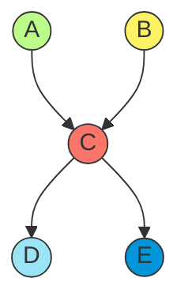

1. **A ⊥ E (No)** - Not D-separated
    - Path: A → C → E
    - This is a serial connection through C
    - C is not observed
    - Information can flow from A to E through C
    - Result: A and E are dependent
2. **A ⊥ E|B (No)** - Not D-separated
    - Path: A → C → E
    - B is observed but not on the path between A and E
    - C is still not observed
    - Information can still flow from A to E through C
    - Result: A and E remain dependent even when conditioning on B
3. **A ⊥ E|C (Yes)** - D-separated
    - Path: A → C → E
    - C is observed (given in the condition)
    - C blocks the path when observed in a serial connection
    - Result: A and E are conditionally independent given C
4. **A ⊥ B (Yes)** - D-separated
    - Path: A → C ← B
    - This is a converging connection (V-structure) at C
    - C is not observed
    - In a V-structure, parents are independent when the child is not observed
    - Result: A and B are independent (when C is not observed)
5. **A ⊥ B|C (No)** - Not D-separated
    - Path: A → C ← B
    - This is a converging connection at C
    - C is observed (given in the condition)
    - In a V-structure, observing the child activates a dependency between the parents
    - Result: A and B are dependent given C

Note: This is the opposite behavior from serial and diverging connections. In V-structures, observing the common child
creates a dependency between the parents that wasn't there before.

###### Complex Network Analysis

Let's analyze a more complex network with multiple paths:

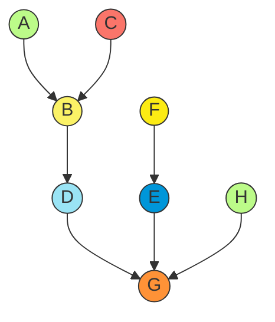


1. **F ⊥ A (No)** - Not D-separated
    - Possible paths:
        - $F → E → G ← D ← B ← A$
        - $F → E → G ← H$
    - Multiple paths exist between F and A
    - Contains both serial connections and V-structures
    - Neither D nor G (the intermediate nodes) are observed
    - Information can flow through the path $F → E → G ← D ← B ← A$
    - Result: F and A are dependent
2. **F ⊥ A|D (Yes)** - D-separated
    - Paths to consider:
        - F → E → G ← D ← B ← A
        - F → E → G ← H
    - D is observed (given in the condition)
    - D blocks the path in the serial connection
    - The path through H is still blocked at G (converging connection without G being observed)
    - Result: F and A are conditionally independent given D
3. **F ⊥ A|G (No)** - Not D-separated
    - Paths to consider:
        - F → E → G ← D ← B ← A
        - F → E → G ← H
    - G is observed (given in the condition)
    - G is a converging node (V-structure)
    - When G is observed, it activates the path between its parents (D and E)
    - This creates an active path between F and A
    - Result: F and A are dependent given G
4. **F ⊥ A|H (No)** - Not D-separated
    - Paths to consider:
        - F → E → G ← D ← B ← A
        - F → E → G ← H
    - H is observed (given in the condition)
    - H is a parent of G (converging node)
    - Observing H doesn't block the path F → E → G ← D ← B ← A
    - The path remains active through the other route
    - Result: F and A are dependent given H

###### Practical Significance of D-separation

Understanding D-separation has several important applications:

1. **Efficient Inference**: By identifying conditionally independent variables, we can simplify probability calculations
   and reduce computational complexity.
2. **Knowledge Engineering**: When building Bayesian networks, D-separation helps ensure the structure correctly
   captures the independence relationships in the domain.
3. **Structure Learning**: Algorithms for learning network structure from data often use D-separation as a criterion to
   evaluate candidate structures.
4. **Causal Reasoning**: D-separation is closely related to causal inference, helping distinguish between correlation
   and causation in complex systems.

The key insight is that D-separation provides a graphical criterion for identifying conditional independence without
having to perform probabilistic calculations. By examining the network structure and the set of observed variables, we
can determine which variables will influence each other and which ones can be safely ignored during inference.

##### Markov Blanket and Local Dependencies

The Markov blanket of a node in a Bayesian network defines a boundary within which all the information relevant to that
node is contained. Specifically, the Markov blanket of a node X consists of:

1. Its parents
2. Its children
3. The other parents of its children (co-parents)

The Markov blanket has a crucial property: a node is conditionally independent of all other nodes in the network given
its Markov blanket. Mathematically, if MB(X) is the Markov blanket of X, then for any variable Y not in the Markov blanket:

$$P(X | \text{MB}(X), Y) = P(X | \text{MB}(X))$$

This property has profound implications for both inference and learning:

1. For inference, it means we only need to consider the Markov blanket when calculating probabilities for a node, not
   the entire network. This locality principle enables efficient algorithms that focus computation on relevant parts of
   the network.
2. For learning, it means we can learn parameters for each node by looking only at its Markov blanket, allowing for
   distributed learning algorithms.
3. For feature selection in machine learning, identifying the Markov blanket of a target variable provides the minimal
   set of features needed for optimal prediction.

Let's illustrate with an example from a medical diagnosis network:

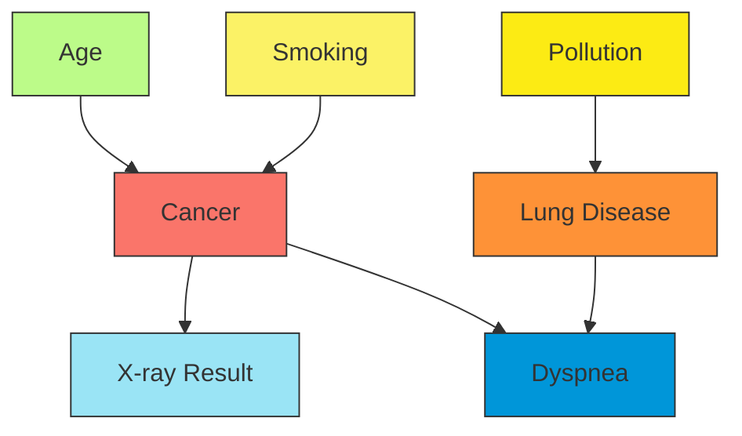

The Markov blanket of Cancer (C) consists of:

- Parents: Age (A) and Smoking (S)
- Children: X-ray Result (X) and Dyspnea (D)
- Co-parents: Lung Disease (L), which is also a parent of Dyspnea

Given this Markov blanket, Cancer is conditionally independent of Pollution. This makes intuitive sense: if we already
know whether the patient has lung disease, then information about pollution levels doesn't provide additional
information about cancer probability.

The Markov blanket concept helps us understand the local structure of dependencies in Bayesian networks and is
fundamental to many inference and learning algorithms.

##### Network Construction Methods

Building a Bayesian network involves two main challenges: determining the structure (which variables directly influence
which others) and estimating the parameters (the conditional probabilities). There are several approaches to network
construction:

1. **Expert-Driven Construction**: This approach relies on domain experts to specify the network structure based on
   causal relationships in the domain. Experts identify relevant variables, determine direct dependencies, and often
   provide initial estimates of probabilities.

    Advantages:

    - Incorporates expert knowledge that might not be present in data
    - Can build networks even with limited data
    - The resulting network is often interpretable and matches causal understanding

    Disadvantages:

    - Experts may disagree or have incomplete knowledge
    - Time-consuming and expensive for large networks
    - May incorporate subjective biases

2. **Data-Driven Construction**: This approach uses machine learning algorithms to learn both structure and parameters
   from data. Two main categories of algorithms exist:

    a) **Constraint-based algorithms** (like PC, FCI):

    - Test for conditional independence relationships in the data
    - Use these tests to constrain the possible network structures
    - Usually faster but sensitive to errors in independence tests

    b) **Score-based algorithms** (like K2, greedy search, genetic algorithms):

    - Define a scoring function that measures how well a structure fits the data
    - Search the space of possible structures for the one with the best score
    - Can find better structures but more computationally intensive

    Advantages of data-driven approaches:

    - Automatically discover relationships that might not be obvious to experts
    - Objectively represent patterns in the data
    - Can adapt as new data becomes available

    Disadvantages:

    - Require large amounts of data for reliable learning
    - May find correlations rather than causal relationships
    - Computationally expensive for large networks (the space of possible structures grows super-exponentially)

3. **Hybrid Methods**: These combine expert knowledge with data-driven learning:

    - Experts provide constraints or prior knowledge to guide structural learning
    - Learning algorithms work within these constraints to find the best structure
    - Parameters are typically estimated from data, possibly with expert priors

    This approach often provides the best balance between incorporating domain knowledge and adapting to patterns in
    data.

4. **Template-Based Methods**: For domains with repeated structure (like time series or multiple similar entities),
   template-based methods define a generic structure that is instantiated multiple times:

    - Dynamic Bayesian Networks (DBNs) for temporal processes
    - Object-Oriented Bayesian Networks (OOBNs) for systems with multiple similar components
    - Plate notation for representing repeated structure

    These approaches allow compact representation of complex networks and efficient inference algorithms that exploit
    the repeated structure.

In practice, the choice of construction method depends on the availability of domain experts, the amount and quality of
data, the purpose of the network (prediction, explanation, decision support), and computational constraints.

##### Parameter Estimation from Data

Once the network structure is established, we need to estimate the parameters—the conditional probability distributions
for each node given its parents. Several methods are available, with the choice depending on data availability, prior
knowledge, and computational constraints.

1. **Maximum Likelihood Estimation (MLE)**: The simplest approach is to estimate probabilities directly from frequency
   counts in the data. For a discrete variable X with parents Pa(X), the maximum likelihood estimate is:

    $$P(X = x | \text{Pa}(X) = \text{pa}) = \large \frac{N(X = x, \text{Pa}(X) = \text{pa})}{N(\text{Pa}(X) = \text{pa})}$$

    Where N(·) counts the number of instances in the data.

    For example, if in our medical data, 80 out of 100 smokers developed lung disease, the MLE would be
    P(LungDisease=True|Smoking=True) = 80/100 = 0.8.

    While simple, MLE has a significant drawback: it assigns zero probability to events not seen in the training data,
    which can cause problems during inference.

2. **Bayesian Parameter Estimation**: This approach incorporates prior knowledge about parameters and updates it with
   observed data. For discrete variables, we typically use Dirichlet priors, which lead to simple posterior
   calculations:

    $$P(X = x | \text{Pa}(X) = \text{pa}) = \large \frac{N(X = x, \text{Pa}(X) = \text{pa}) + \alpha_{x,\text{pa}}}{N(\text{Pa}(X) = \text{pa}) + \sum_{x'} \alpha_{x',\text{pa}}}$$

    Where αₓ,ₚₐ are the pseudo-counts from the prior.

    For example, if we have a prior belief that the probability of lung disease given smoking is around 0.7 with a
    confidence equivalent to 10 observations, we might set αTrue,True = 7 and αFalse,True = 3. If we then observe 80
    smokers with lung disease and 20 without, the Bayesian estimate would be:

    $$P(\text{LungDisease=True}|\text{Smoking=True}) = \frac{80 + 7}{100 + 10} = \frac{87}{110} \approx 0.79$$

    This approach addresses the zero-probability problem and allows incorporation of prior knowledge.

3. **Expectation-Maximization (EM)**: When data has missing values or hidden variables (nodes that are never observed),
   MLE and simple Bayesian estimation aren't directly applicable. The EM algorithm iteratively:

    - E-step: Estimates the distribution of the missing/hidden variables given current parameters
    - M-step: Updates parameters using these estimated distributions as if they were observed

    EM is widely used for learning parameters in networks with latent variables, like hidden Markov models or mixture
    models.

4. **Regularization Techniques**: To prevent overfitting, especially with limited data, various regularization methods
   can be applied:

    - Laplace (add-one) smoothing: Adds pseudo-counts to all combinations
    - Parameter tying: Forces certain parameters to be identical
    - Shrinkage estimators: Pull estimates toward a prior or a simpler model

    These methods help when data is sparse or noisy.

5. **Learning from Incomplete Data**: Real-world datasets often have missing values. Approaches include:

    - Complete-case analysis: Use only complete records (wasteful)
    - Available-case analysis: Use all available data for each parameter
    - Data imputation: Fill in missing values before parameter estimation
    - Model-based methods: Treat missing values as hidden variables and use EM

    The best approach depends on the pattern of missingness (MCAR, MAR, MNAR).

The quality of parameter estimates directly affects inference accuracy. When possible, it's good practice to:

- Use large, representative datasets
- Perform sensitivity analysis to understand how parameter uncertainty affects conclusions
- Update parameters as new data becomes available
- Validate the learned parameters against domain knowledge

For continuous variables, parametric forms like Gaussian distributions are often used, with parameters (mean, variance)
estimated using methods analogous to those described above.

#### Inference in Bayesian Networks

Inference in Bayesian networks is the process of answering probabilistic queries about variables within the network
given evidence. It's one of the most important features of Bayesian networks as it allows us to use these models to
reason under uncertainty by updating our beliefs based on new evidence.

At its core, inference in Bayesian networks involves calculating the posterior probability distribution of one or more
variables given observed values for other variables in the network. This can be formally expressed as computing
P(Y|E=e), where Y represents the query variables and E=e represents the evidence.

###### Bayesian Network Inference: A Practical Example

Bayesian network inference allows us to update our beliefs about certain variables when we observe evidence about other variables. Let me walk you through a concrete example to illustrate this powerful capability.

Consider a simple medical diagnosis scenario modeled as a Bayesian network:

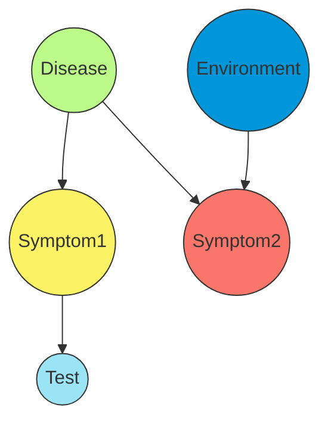

In this network:

- $D$ represents a disease (present or absent)
- $S_1$ and $S_2$ represent two different symptoms
- $T$ represents a medical test result
- $E$ represents an environmental factor that can cause $S_2$ independently of the disease

Let's suppose we have the following probabilities:

- $P(D=\text{present}) = 0.01$ (1% of the population has this disease)
- $P(S_1=\text{present}|D=\text{present}) = 0.9$ (90% of people with the disease show Symptom1)
- $P(S_1=\text{present}|D=\text{absent}) = 0.2$ (20% of healthy people show Symptom1)
- $P(S_2=\text{present}|D=\text{present}) = 0.7$ (70% of people with the disease show Symptom2)
- $P(S_2=\text{present}|D=\text{absent},E=\text{absent}) = 0.1$ (10% of healthy people show Symptom2 without environmental exposure)
- $P(S_2=\text{present}|D=\text{absent},E=\text{present}) = 0.6$ (60% of healthy people show Symptom2 with environmental exposure)
- $P(E=\text{present}) = 0.3$ (30% of people are exposed to the environmental factor)
- $P(T=\text{positive}|S_1=\text{present}) = 0.8$ (80% sensitivity - test detects Symptom1 when present)
- $P(T=\text{positive}|S_1=\text{absent}) = 0.1$ (10% false positive rate)

Now, imagine a patient comes in showing Symptom2 and their test result is positive. We want to know: What's the probability this patient has the disease?

This is a probabilistic query of the form $P(D=\text{present}|S_2=\text{present},T=\text{positive})$.

To solve this inference problem, we need to:

1. Identify the evidence variables ($S_2=\text{present}$, $T=\text{positive}$)
2. Identify our query variable ($D$)
3. Use Bayes' rule and marginalization over the hidden variables ($S_1$, $E$)

The calculation would proceed as follows:

$$P(D=\text{present}|S_2=\text{present},T=\text{positive}) = \alpha \times \sum_{S_1} \sum_{E} P(D=\text{present},S_1,S_2=\text{present},T=\text{positive},E)$$

Where $\alpha$ is a normalization constant to ensure probabilities sum to 1.

Expanding using the chain rule and conditional independence properties of our network:

$$\begin{align}P(D=\text{present},S_1,S_2 &=\text{present},T=\text{positive},E) = P(D=\text{present}) \\ &\;\;\;\;\times P(S_1|D=\text{present}) \\ &\;\;\;\;\times P(S_2=\text{present}|D=\text{present}) \\ &\;\;\;\;\times P(T=\text{positive}|S_1) \times P(E)\end{align}$$

We would compute this for each possible combination of values for the hidden variables $S_1$ and $E$, then sum these results and normalize.

Without showing all the calculations, the result might be something like: $$P(D=\text{present}|S_2=\text{present},T=\text{positive}) \approx 0.12$$

This means that despite the disease being rare in the general population (1%), the evidence of Symptom2 and a positive test increases our belief in the disease to 12% - a significant increase that might warrant further investigation.

This example illustrates how Bayesian networks excel at:

1. Diagnostic reasoning (from effects/symptoms back to causes/diseases)
2. Handling multiple pieces of evidence simultaneously
3. Accounting for alternative explanations (like the environmental factor)
4. Dealing with uncertain relationships (probabilities rather than certainties)
5. Updating beliefs rationally based on available evidence

In clinical practice, much more complex networks with dozens or hundreds of variables might be used, making efficient inference algorithms (like variable elimination or sampling methods) absolutely essential for practical applications.

###### Deriving the Formula for Joint Probability in Bayesian Networks

To understand how we arrive at the formula you've shared, I need to explain how we can derive joint probability expressions in Bayesian networks using the chain rule of probability and the conditional independence assumptions encoded in the network structure.

###### The General Form: Chain Rule and Bayesian Networks

The general chain rule of probability states that for any set of random variables $X_1, X_2, ..., X_n$, their joint probability can be factored as:

$$P(X_1, X_2, ..., X_n) = P(X_1) \times P(X_2|X_1) \times P(X_3|X_1,X_2) \times ... \times P(X_n|X_1,X_2,...,X_{n-1})$$

However, Bayesian networks leverage conditional independence relationships to simplify this expression. In a Bayesian network, each variable $X_i$ is conditionally independent of its non-descendants given its parents. This allows us to write:

$$P(X_1, X_2, ..., X_n) = \prod_{i=1}^{n} P(X_i|\text{Parents}(X_i))$$

Where $\text{Parents}(X_i)$ represents the parent nodes of $X_i$ in the network graph.

###### Applying the Formula to Our Medical Example

Let's look at our medical diagnosis network again:


To derive the joint probability formula for all variables $(D, S_1, S_2, T, E)$, we identify the parents of each node:

- $\text{Parents}(D) = \emptyset$ (Disease has no parents)
- $\text{Parents}(S_1) = {D}$ (Symptom1 depends only on Disease)
- $\text{Parents}(S_2) = {D, E}$ (Symptom2 depends on both Disease and Environment)
- $\text{Parents}(T) = {S_1}$ (Test depends only on Symptom1)
- $\text{Parents}(E) = \emptyset$ (Environment has no parents)

Applying our general formula:

$$P(D, S_1, S_2, T, E) = P(D) \times P(S_1|D) \times P(S_2|D,E) \times P(T|S_1) \times P(E)$$

Now, let's examine the specific formula you provided:

$$\begin{align}P(D=\text{present}, S_1, S_2=\text{present}, T=\text{positive}, E) &= P(D=\text{present}) \\ &\quad\times P(S_1|D=\text{present}) \\ &\quad\times P(S_2=\text{present}|D=\text{present}) \\ &\quad\times P(T=\text{positive}|S_1) \times P(E)\end{align}$$

I notice there's a simplification in this formula. According to our network structure, $S_2$ depends on both $D$ and $E$, so we should have $P(S_2=\text{present}|D=\text{present},E)$ instead of just $P(S_2=\text{present}|D=\text{present})$.

This could be a simplification if we're assuming that once we know the disease is present, the environmental factor doesn't add any more information about Symptom2. In probabilistic terms, this would mean:

$$P(S_2|D=\text{present},E) = P(S_2|D=\text{present})$$

This is a stronger independence assumption than what is directly encoded in the graph. If this assumption is valid for our specific scenario, then the formula you provided is correct. Otherwise, we should use the more general form that includes the dependency of $S_2$ on both $D$ and $E$.

###### Verifying with a Specific Example

Let's work through a concrete example to show how we would calculate the joint probability of a specific configuration:

For the configuration {$D=\text{present}$, $S_1=\text{present}$, $S_2=\text{present}$, $T=\text{positive}$, $E=\text{present}$}:

$$\begin{align*} P(D=\text{present}, S_1=\text{present}, S_2=\text{present}, T=\text{positive}, E=\text{present}) &= \ P(D=\text{present}) \\ &\quad \times P(S_1=\text{present}|D=\text{present}) \\ &\quad \times P(S_2=\text{present}|D=\text{present},E=\text{present}) \\ &\quad \times P(T=\text{positive}|S_1=\text{present}) \\ &\quad \times P(E=\text{present}) = \ 0.01 \\ &\quad \times 0.9 \times P(S_2=\text{present}|D=\text{present},E=\text{present}) \\ &\quad \times 0.8 \times 0.3 \end{align*}$$

Here, we need the specific value of $P(S_2=\text{present}|D=\text{present},E=\text{present})$, which wasn't explicitly provided in our initial parameters. If we assume the simplified formula is correct for our domain (i.e., $E$ doesn't affect $S_2$ when $D$ is present), then we can use $P(S_2=\text{present}|D=\text{present}) = 0.7$:

$$0.01 \times 0.9 \times 0.7 \times 0.8 \times 0.3 = 0.00151$$

This gives us the joint probability of this specific configuration of all variables. To perform inference like calculating $P(D=\text{present}|S_2=\text{present},T=\text{positive})$, we would sum over all possible values of the hidden variables $S_1$ and $E$, then normalize.

This example demonstrates how the conditional independence assumptions encoded in a Bayesian network allow us to compute complex joint probabilities through a simpler factorization, making probabilistic inference much more tractable.

##### Exact vs. Approximate Inference

Exact inference methods calculate the precise probabilities for the queries of interest, while approximate methods
provide estimations that trade-off some accuracy for computational efficiency. The choice between these approaches
depends on the network structure, size, and the specific requirements of the application.

**Exact Inference**

Exact inference methods provide mathematically precise answers to probability queries. These methods are guaranteed to
give the correct probability values, but may become computationally intractable for large or densely connected networks.

Key exact inference techniques include:

1. **Enumeration**: The most straightforward but least efficient approach. It explicitly calculates joint probabilities
   by summing over all possible configurations of hidden variables.
2. **Variable Elimination**: A more efficient algorithm that systematically eliminates variables not in the query or
   evidence by marginalizing them out one by one.
3. **Junction Tree Algorithm**: Transforms the Bayesian network into a tree structure called a junction tree, where
   standard tree-based inference algorithms can be applied.

For example, in a simple query to find P(B|A=true) in a small network, exact inference would compute:

$$P(B|A=true) = \frac{P(B, A=true)}{P(A=true)} = \frac{\sum_{C} P(A=true, B, C)}{\sum_{B,C} P(A=true, B, C)}$$

Where the summation extends over all possible values of the hidden variables.

**Approximate Inference**

When exact inference is computationally prohibitive, approximate methods provide estimates of the desired probabilities.
These methods are especially useful for large networks or time-sensitive applications.

Major approximate inference approaches include:

1. **Sampling Methods**: Generate random samples from the network's distribution and use these samples to estimate
   probabilities. Examples include:
    - Direct sampling (prior sampling)
    - Rejection sampling
    - Likelihood weighting
    - Gibbs sampling (MCMC)
2. **Variational Methods**: Approximate complex probability distributions with simpler ones that are easier to compute.
3. **Loopy Belief Propagation**: Apply message-passing algorithms to networks with loops, though convergence is not
   guaranteed.

<div align="center">

<p style="color: #555;">Figure: The classic Alarm Bayesian Network used for demonstrating inference</p>
</div>

The tradeoff between exact and approximate inference is clear: exact methods provide precise answers but may be
computationally infeasible for complex networks, while approximate methods scale better but introduce some error into
the results.

###### Bayes' Theorem Application in Burglary Detection System Analysis

The burglary alarm system provides an excellent case study for understanding how Bayesian networks model real-world
systems with multiple interconnected variables. This classic example helps us visualize conditional probability
relationships in an intuitive way.

###### System Variables and Structure

This network models a home security scenario with five key variables:

1. **Burglary (B)**: Indicates whether a burglary is occurring
    - States: True (burglary), False (no burglary)
    - Root node with no parents
2. **Earthquake (E)**: Indicates whether an earthquake is occurring
    - States: True (earthquake), False (no earthquake)
    - Root node with no parents
3. **Alarm (A)**: Indicates whether the alarm is sounding
    - States: True (alarm on), False (alarm off)
    - Influenced by both Burglary and Earthquake
    - The alarm can be triggered by either event (or both)
4. **John Calls (J)**: Indicates whether John calls to report the alarm
    - States: True (calls), False (doesn't call)
    - Depends solely on Alarm
    - John calls when he hears the alarm (with some probability)
5. **Mary Calls (M)**: Indicates whether Mary calls to report the alarm
    - States: True (calls), False (doesn't call)
    - Depends solely on Alarm
    - Mary calls when she hears the alarm (with some probability)

The network structure represents these relationships through a directed acyclic graph:

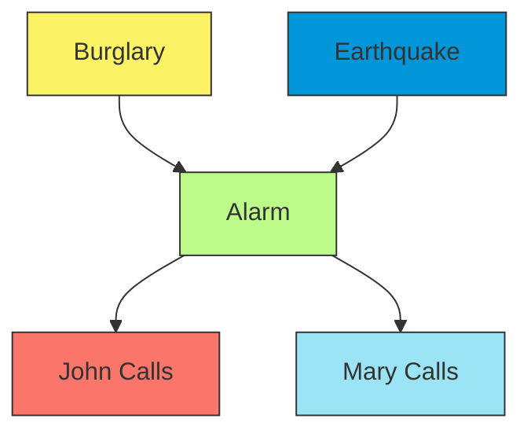

This structure contains several important patterns:

- A V-structure (converging connection): Burglary → Alarm ← Earthquake
- Serial connections: John Calls ← Alarm → Mary Calls
- Root nodes: Burglary, Earthquake
- Middle node: Alarm
- Leaf nodes: John Calls, Mary Calls

###### Types of Inference in This Network

The burglary alarm network allows us to perform several types of reasoning:

1. **Causal Reasoning**: Moving from causes to effects
    - Example: P(Alarm | Burglary) - "If there's a burglary, will the alarm sound?"
2. **Diagnostic Reasoning**: Moving from effects to causes
    - Example: P(Burglary | John Calls, Mary Calls) - "If both John and Mary call, what's the probability of a
      burglary?"
3. **Intercausal Reasoning**: Reasoning between causes
    - Example: P(Earthquake | Burglary, Alarm) - "If the alarm is on and we know there's a burglary, what's the
      probability of an earthquake?"

###### Types of Variables in Inference Queries

When conducting probabilistic inference in this network, we classify variables into three categories:

1. **Evidence variables**: Variables with known values (our observations)
2. **Query variables**: Variables whose values we want to determine
3. **Hidden variables**: Variables that are neither evidence nor query, but must be accounted for

For example, if we want to know P(Burglary | John Calls, Mary Calls):

- Query variable: Burglary
- Evidence variables: John Calls, Mary Calls
- Hidden variables: Alarm, Earthquake

###### Deriving the Probability of a Burglary Given Calls

Let's calculate the probability of a burglary given that both John and Mary have called. We'll use shorthand notation
where "+" means the variable is true and "¬" means it's false.

Our target probability is $P(+b|+j,+m)$, which represents "the probability of a burglary occurring given that both John
and Mary called."

Using Bayes' theorem:

$$P(+b|+j,+m) = \frac{P(+b,+j,+m)}{P(+j,+m)}$$

The challenge is that we have hidden variables - earthquake ($e$) and alarm ($a$) - that we need to account for. To find
the joint probability without these variables, we sum over all their possible values:

$$P(+b,+j,+m) = P(+b,+j,+m,+e,+a) + P(+b,+j,+m,+e,\neg a) + P(+b,+j,+m,\neg e,+a) + P(+b,+j,+m,\neg e,\neg a)$$

This can be written more concisely as:

$$P(+b,+j,+m) = \sum_{e}\sum_{a} P(+b,+j,+m,e,a)$$

###### Breaking Down the Joint Probability

Now we need to break down the joint probability $P(+b,+j,+m,e,a)$ into more manageable parts using the chain rule:

$$P(+b,+j,+m,e,a) = P(+b) \times P(e|+b) \times P(a|+b,e) \times P(+m|+b,e,a) \times P(+j|+b,e,a,+m)$$

This equation can be simplified based on the conditional independence relationships in our network:

1. Earthquake is independent of Burglary: $P(e|+b) = P(e)$
2. Mary's call depends only on the alarm state: Once we know whether the alarm is on, knowing about a burglary or
   earthquake doesn't provide additional information about Mary calling. Therefore: $P(+m|+b,e,a) = P(+m|a)$
3. Similarly, John's call depends only on the alarm state: $P(+j|+b,e,a,+m) = P(+j|a)$

After applying these simplifications, our equation becomes:

$$P(+b,+j,+m,e,a) = P(+b) \times P(e) \times P(a|+b,e) \times P(+m|a) \times P(+j|a)$$

###### Calculating the Final Probability

Let's define functions for each possible combination of our hidden variables:

$$f(+e,+a) = P(+b) \times P(+e) \times P(+a|+b,+e) \times P(+j|+a) \times P(+m|+a)$$
$$f(+e,\neg a) = P(+b) \times P(+e) \times P(\neg a|+b,+e) \times P(+j|\neg a) \times P(+m|\neg a)$$
$$f(\neg e,+a) = P(+b) \times P(\neg e) \times P(+a|+b,\neg e) \times P(+j|+a) \times P(+m|+a)$$
$$f(\neg e,\neg a) = P(+b) \times P(\neg e) \times P(\neg a|+b,\neg e) \times P(+j|\neg a) \times P(+m|\neg a)$$

The sum of these terms gives us our joint probability $P(+b,+j,+m)$:

$$P(+b,+j,+m) = f(+e,+a) + f(+e,\neg a) + f(\neg e,+a) + f(\neg e,\neg a)$$

For the denominator in Bayes' theorem, $P(+j,+m)$, we need to sum over all possible combinations of burglary,
earthquake, and alarm:

$$P(+j,+m) = \sum_{b}\sum_{e}\sum_{a} P(b,+j,+m,e,a)$$

Let's call this sum $f(e,a)$ for simplicity. Our final equation becomes:

$$P(+b|+j,+m) = \frac{P(+b) \times \sum_{e} P(e) \times \sum_{a} [P(a|+b,e) \times P(+j|a) \times P(+m|a)]}{f(e,a)}$$

###### Probability Tables for the Burglary Alarm System

To calculate the actual probability values, we need the probability tables that define our model:

**Prior Probabilities**

| B   | P(B)  | E   | P(E)  |
| --- | ----- | --- | ----- |
| +b  | 0.001 | +e  | 0.002 |
| ¬b  | 0.999 | ¬e  | 0.998 |

**Conditional Probabilities for Calls**

| A   | J   | P(J\|A) | A   | M   | P(M\|A) |
| --- | --- | ------- | --- | --- | ------- |
| +a  | +j  | 0.9     | +a  | +m  | 0.7     |
| +a  | ¬j  | 0.1     | +a  | ¬m  | 0.3     |
| ¬a  | +j  | 0.05    | ¬a  | +m  | 0.01    |
| ¬a  | ¬j  | 0.95    | ¬a  | ¬m  | 0.99    |

**Conditional Probabilities for Alarm**

| B   | E   | A   | P(A\|B,E) |
| --- | --- | --- | --------- |
| +b  | +e  | +a  | 0.95      |
| +b  | +e  | ¬a  | 0.05      |
| +b  | ¬e  | +a  | 0.94      |
| +b  | ¬e  | ¬a  | 0.06      |
| ¬b  | +e  | +a  | 0.29      |
| ¬b  | +e  | ¬a  | 0.71      |
| ¬b  | ¬e  | +a  | 0.001     |
| ¬b  | ¬e  | ¬a  | 0.999     |

Using these probability values, we can calculate our final result. For example, part of our calculation would be:

$$P(+b) \times P(+e) \times P(+a|+b,+e) \times P(+j|+a) \times P(+m|+a) = 0.001 \times 0.002 \times 0.95 \times 0.9 \times 0.7$$

By completing similar calculations for each term and combining them according to our formula, we can determine the exact
probability of a burglary given that both John and Mary called.

This example demonstrates how Bayesian networks allow us to combine multiple pieces of evidence to reach probabilistic
conclusions, even when some variables remain unobserved. It also shows how the network structure captures the
independence relationships that allow us to simplify our calculations.

##### Variable Elimination Algorithm

Variable elimination is one of the most fundamental exact inference algorithms for Bayesian networks. It efficiently
computes conditional probabilities by eliminating variables through marginalization, one at a time.

**Core Concept**

The key insight of variable elimination is to reorganize the computation of joint probabilities to avoid redundant
calculations. Rather than naively computing the full joint probability distribution, it calculates factors (local
probability distributions) and progressively eliminates (marginalizes out) variables that are not part of the query or
evidence.

**Algorithm Steps**

1. **Express the joint probability** using the chain rule factorization based on the Bayesian network structure.
2. **Restrict factors** according to the evidence (observed variables).
3. **Choose a variable elimination ordering** (this choice affects efficiency).
4. For each non-query, non-evidence variable:
    - **Identify all factors** containing the variable to be eliminated.
    - **Multiply these factors** to create a new factor.
    - **Sum out (marginalize)** the variable from this new factor.
    - **Replace the original factors** with this new marginalized factor.
5. **Multiply remaining factors** and normalize to obtain the final conditional probability.

**Example Calculation**

Let's consider a simple Rain-Traffic-Late network where we want to compute P(L|R=true), that is, the probability of
being late given that it's raining:

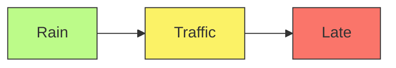

Given:

- P(R=true) = 0.1, P(R=false) = 0.9
- P(T=heavy|R=true) = 0.8, P(T=light|R=true) = 0.2
- P(T=heavy|R=false) = 0.1, P(T=light|R=false) = 0.9
- P(L=true|T=heavy) = 0.3, P(L=false|T=heavy) = 0.7
- P(L=true|T=light) = 0.1, P(L=false|T=light) = 0.9

To compute P(L|R=true), variable elimination would:

1. Start with the factorization: P(R,T,L) = P(R) × P(T|R) × P(L|T)
2. Restrict factors for R=true: P(T|R=true) × P(L|T)
3. Eliminate variable T by summing it out: $$P(L|R=true) = \sum_T P(T|R=true) \times P(L|T)$$

Let's calculate this for L=true:

- P(L=true|R=true) = P(T=heavy|R=true) × P(L=true|T=heavy) + P(T=light|R=true) × P(L=true|T=light)
- P(L=true|R=true) = 0.8 × 0.3 + 0.2 × 0.1 = 0.24 + 0.02 = 0.26

###### Rain-Traffic-Late Network Example

The Rain-Traffic-Late network provides an excellent introductory example of a simple Bayesian network with a chain
structure. This example helps us understand the basics of joint probability calculations and marginalization.

###### Network Structure and Variables

This Bayesian network models a simple causal relationship: rain affects traffic conditions, which in turn affect whether
someone arrives late. The network consists of three binary variables connected in a chain:

$$R \rightarrow T \rightarrow L$$

Where:

- $R$ = Rain (either raining or not raining)
- $T$ = Traffic (either heavy traffic or no heavy traffic)
- $L$ = Late (either late or not late)

The direction of the arrows indicates causal influence. Rain directly affects traffic conditions, but only indirectly
affects lateness through its impact on traffic.

###### Probability Tables

For this network, we need three probability tables to fully specify its parameters:

**Prior Probability of Rain P(R)**

| R   | P(R) |
| --- | ---- |
| +r  | 0.1  |
| -r  | 0.9  |

This table tells us that it rains 10% of the time.

**Conditional Probability of Traffic Given Rain P(T|R)**

| R   | T   | P(T\|R) |
| --- | --- | ------- |
| +r  | +t  | 0.8     |
| +r  | -t  | 0.2     |
| -r  | +t  | 0.1     |
| -r  | -t  | 0.9     |

This table shows that:

- When it's raining, there's an 80% chance of heavy traffic
- When it's not raining, there's only a 10% chance of heavy traffic

**Joint Probability of Rain and Traffic P(R,T)**

| R   | T   | P(R,T) |
| --- | --- | ------ |
| +r  | +t  | 0.08   |
| +r  | -t  | 0.02   |
| -r  | +t  | 0.09   |
| -r  | -t  | 0.81   |

The joint probability table can be calculated from the prior and conditional probabilities:

- $P(+r,+t) = P(+r) \times P(+t|+r) = 0.1 \times 0.8 = 0.08$
- $P(+r,-t) = P(+r) \times P(-t|+r) = 0.1 \times 0.2 = 0.02$
- $P(-r,+t) = P(-r) \times P(+t|-r) = 0.9 \times 0.1 = 0.09$
- $P(-r,-t) = P(-r) \times P(-t|-r) = 0.9 \times 0.9 = 0.81$

Note that these joint probabilities sum to 1, covering all possible combinations of rain and traffic.

**Conditional Probability of Being Late Given Traffic P(L|T)**

| T   | L   | P(L\|T) |
| --- | --- | ------- |
| +t  | +l  | 0.3     |
| +t  | -l  | 0.7     |
| -t  | +l  | 0.1     |
| -t  | -l  | 0.9     |

This table indicates that:

- When there's heavy traffic, there's a 30% chance of being late
- When there's no heavy traffic, there's only a 10% chance of being late

###### Worked Example: Calculating the Probability of Being Late

One common query in Bayesian networks is calculating the marginal probability of a variable. Let's calculate $P(+l)$,
the probability of being late regardless of rain or traffic conditions.

To do this, we need to marginalize out both rain and traffic variables:

$$P(+l) = \sum_r \sum_t P(r,t,+l)$$

Using the chain rule and the conditional independence properties of our network:

$$P(+l) = \sum_r \sum_t P(r)P(t|r)P(+l|t)$$

We can break this calculation down step by step:

1. For $r = +r$ and $t = +t$: $P(+r)P(+t|+r)P(+l|+t) = 0.1 \times 0.8 \times 0.3 = 0.024$
2. For $r = +r$ and $t = -t$: $P(+r)P(-t|+r)P(+l|-t) = 0.1 \times 0.2 \times 0.1 = 0.002$
3. For $r = -r$ and $t = +t$: $P(-r)P(+t|-r)P(+l|+t) = 0.9 \times 0.1 \times 0.3 = 0.027$
4. For $r = -r$ and $t = -t$: $P(-r)P(-t|-r)P(+l|-t) = 0.9 \times 0.9 \times 0.1 = 0.081$

Summing these values: $$P(+l) = 0.024 + 0.002 + 0.027 + 0.081 = 0.134$$

We can also simplify this calculation by first marginalizing out rain to get $P(t)$:

$$P(+l) = \sum_t P(t)P(+l|t)$$

Where:

- $P(+t) = P(+r,+t) + P(-r,+t) = 0.08 + 0.09 = 0.17$
- $P(-t) = P(+r,-t) + P(-r,-t) = 0.02 + 0.81 = 0.83$

Then: $$P(+l) = P(+t)P(+l|+t) + P(-t)P(+l|-t) = 0.17 \times 0.3 + 0.83 \times 0.1 = 0.051 + 0.083 = 0.134$$

This means there's a 13.4% chance of being late overall, considering all possible rain and traffic scenarios.

###### Law of Total Probability in Bayesian Networks

A fundamental principle in Bayesian networks is that probabilities for all possible values of a variable must sum to 1.
Let's verify this for our example:

1. **Rain (R)**: $P(+r) + P(-r) = 0.1 + 0.9 = 1$
2. **Traffic given Rain (T|R)**:
    - When it's raining: $P(+t|+r) + P(-t|+r) = 0.8 + 0.2 = 1$
    - When it's not raining: $P(+t|-r) + P(-t|-r) = 0.1 + 0.9 = 1$
3. **Late given Traffic (L|T)**:
    - With heavy traffic: $P(+l|+t) + P(-l|+t) = 0.3 + 0.7 = 1$
    - Without heavy traffic: $P(+l|-t) + P(-l|-t) = 0.1 + 0.9 = 1$

This property is essential for a valid probability model. If probabilities don't sum to 1, it indicates errors such as
missing outcomes, double-counting, or invalid probability assignments.

###### Comparing Alternative Network Structures

We can represent the same situation with different network structures, which affect both the model's semantics and its
parameter requirements.

**Chain Structure (R → T → L)**

The chain structure we've been using implies that:

- Rain affects Traffic directly
- Traffic affects Lateness directly
- Rain affects Lateness only indirectly through Traffic

This structure exhibits conditional independence: $P(L|T,R) = P(L|T)$, meaning that if we know the traffic condition,
additional information about rain doesn't change the probability of being late.

This structure requires 5 parameters total:

- $P(R)$: 1 parameter (for a binary variable, we only need one probability as the other can be derived)
- $P(T|R)$: 2 parameters (one for each state of R)
- $P(L|T)$: 2 parameters (one for each state of T)

**Combined Structure (with R and T both directly affecting L)**

An alternative structure would have both Rain and Traffic directly affecting Lateness:

$$ \begin{array}{ccc} R & \rightarrow & T \ \downarrow & & \downarrow \ & L & \end{array} $$

This structure does not exhibit the same conditional independence. It allows rain to have a direct effect on lateness,
independent of its effect through traffic.

This structure requires 7 parameters total:

- $P(R)$: 1 parameter
- $P(T|R)$: 2 parameters
- $P(L|R,T)$: 4 parameters (one for each combination of R and T states)

The increased number of parameters in the combined structure comes from needing to specify how lateness depends on both
rain and traffic together, rather than just traffic alone.

###### Parameter Calculation Details

For binary variables (with states + and -), we need only one parameter per conditioning context, since the probabilities
must sum to 1. This means:

1. For $P(R)$, we need 1 parameter: $P(+r)$, since $P(-r) = 1 - P(+r)$
2. For $P(T|R)$, we need 2 parameters:
    - $P(+t|+r)$, since $P(-t|+r) = 1 - P(+t|+r)$
    - $P(+t|-r)$, since $P(-t|-r) = 1 - P(+t|-r)$
3. For $P(L|T)$, we need 2 parameters:
    - $P(+l|+t)$, since $P(-l|+t) = 1 - P(+l|+t)$
    - $P(+l|-t)$, since $P(-l|-t) = 1 - P(+l|-t)$

For the combined structure, $P(L|R,T)$ would require 4 parameters:

- $P(+l|+r,+t)$
- $P(+l|+r,-t)$
- $P(+l|-r,+t)$
- $P(+l|-r,-t)$

This parameter count difference highlights the tradeoff between model expressiveness and complexity. The chain structure
is simpler and requires fewer parameters, but it makes stronger independence assumptions. The combined structure can
represent more complex relationships but requires more parameters to be specified.

This Rain-Traffic-Late example demonstrates how Bayesian networks allow us to represent probabilistic relationships
between variables, calculate various probabilities of interest, and make meaningful inferences about real-world
scenarios.

**Factor Operations**

Two key operations in variable elimination are:

1. **Factor Product**: Combines two factors by multiplying the probabilities for compatible configurations of the
   variables.
2. **Factor Marginalization**: Eliminates a variable by summing over all its possible values.

**Elimination Ordering**

The order in which variables are eliminated can dramatically affect computational efficiency. Finding the optimal
elimination ordering is NP-hard, but several heuristics exist:

- Min-neighbors: Eliminate the variable connected to the fewest other variables
- Min-fill: Eliminate the variable that adds the fewest edges to the graph when removed
- Weighted min-fill: Consider both the number of new edges and the domain sizes of variables

**Advantages and Limitations**

Advantages:

- More efficient than naive enumeration
- Provides exact probabilities
- Works well for tree-structured networks or networks with low treewidth

Limitations:

- Still exponential in the worst case
- Performance highly dependent on network structure and elimination ordering
- Can be impractical for densely connected networks

Variable elimination forms the backbone of many more sophisticated exact inference algorithms and is a fundamental
technique in probabilistic reasoning.

##### Sampling-Based Methods

When exact inference becomes computationally intractable, sampling-based methods offer practical alternatives by
approximating probabilities through statistical sampling. These methods generate representative samples from the joint
distribution defined by the Bayesian network and use these samples to estimate the required probabilities.

**Basic Concept**

Sampling-based methods work by generating many random instances (samples) from the distribution represented by the
network. As the number of samples increases, the frequency of specific variable configurations converges to their true
probabilities according to the law of large numbers.

**Common Sampling Algorithms**

1. **Prior (Direct) Sampling**

    The simplest sampling approach involves:

    - Sampling variables in topological order (parents before children)
    - Using each node's conditional probability table to sample values
    - Counting the frequency of query events in the generated samples

    For a query P(Y|E=e), the estimate is: $$P(Y|E=e) \approx \frac{\text{Count}(Y, E=e)}{\text{Count}(E=e)}$$

    However, this method is inefficient when evidence is rare, as many samples will be rejected.

2. **Rejection Sampling**

    An improvement over prior sampling that:

    - Generates samples using the same process as prior sampling
    - Discards samples inconsistent with the evidence
    - Uses only the remaining samples to estimate conditional probabilities

    While more focused than prior sampling, rejection sampling still wastes computation when evidence has low
    probability. For rare evidence, most samples will be rejected.

3. **Likelihood Weighting**

    A more efficient approach that:

    - Fixes evidence variables to their observed values
    - Samples only non-evidence variables
    - Weights each sample by the likelihood of the evidence
    - Uses these weighted samples to estimate probabilities

    The weight for each sample is the product of conditional probabilities of evidence variables given their parents:
    $$w = \prod_{i \in evidence} P(e_i | parents(X_i))$$

    Likelihood weighting ensures every sample is consistent with the evidence, making it more efficient than rejection
    sampling, especially with rare evidence.

4. **Gibbs Sampling**

    A Markov Chain Monte Carlo (MCMC) technique that:

    - Starts with an arbitrary assignment to non-evidence variables
    - Repeatedly resamples one variable at a time, conditioned on all others
    - Uses the frequency of variable values in the sampling chain to estimate probabilities

    Gibbs sampling performs well with complex conditional dependencies and can handle networks where other sampling
    methods struggle. However, it may require more samples to converge to accurate estimates, especially if variables
    are highly correlated.

###### Gibbs Sampling

Gibbs sampling is a powerful Markov Chain Monte Carlo (MCMC) technique used for approximate inference in Bayesian
networks. It's particularly valuable for high-dimensional probability distributions where exact inference becomes
computationally infeasible.

###### Core Concept

The fundamental idea behind Gibbs sampling is to generate samples by iteratively sampling each variable in turn,
conditioned on the current values of all other variables in the network. This creates a Markov chain whose stationary
distribution converges to the joint distribution we're trying to approximate.

To understand this process, let's apply it to our Rain-Traffic-Late network (R → T → L):

###### Step-by-Step Sampling Process

**Step 1: Initialize the chain** We begin with arbitrary values for all variables. For example:

- R = +r (It is raining)
- T = -t (No heavy traffic)
- L = +l (Person is late)

**Step 2: Iterative Sampling**

1. **Sample R given T and L:**

    $$P(R | T=-t, L=+l) \propto P(R) \times P(T=-t | R) \times P(L=+l | T=-t)$$

    We calculate this for both R=+r and R=-r:

    $$P(R=+r | T=-t, L=+l) \propto 0.1 \times 0.2 \times 0.1 = 0.002$$
    $$P(R=-r | T=-t, L=+l) \propto 0.9 \times 0.9 \times 0.1 = 0.081$$

    After normalizing: $$P(R=+r | T=-t, L=+l) \approx \frac{0.002}{0.002 + 0.081} \approx 0.024$$
    $$P(R=-r | T=-t, L=+l) \approx \frac{0.081}{0.002 + 0.081} \approx 0.976$$

    We then sample from this distribution. Let's say we get R=-r.

2. **Sample T given the new R and L:**

    $$P(T | R=-r, L=+l) \propto P(T | R=-r) \times P(L=+l | T)$$

    Calculating for both values: $$P(T=+t | R=-r, L=+l) \propto 0.1 \times 0.3 = 0.03$$
    $$P(T=-t | R=-r, L=+l) \propto 0.9 \times 0.1 = 0.09$$

    After normalizing: $$P(T=+t | R=-r, L=+l) \approx \frac{0.03}{0.03 + 0.09} \approx 0.25$$
    $$P(T=-t | R=-r, L=+l) \approx \frac{0.09}{0.03 + 0.09} \approx 0.75$$

    We sample from this distribution. Let's say we get T=-t.

3. **Sample L given the new R and T:**

    If L is our evidence variable (meaning we've observed it to be +l), we don't actually sample it - we keep it fixed
    at its observed value throughout the sampling process.

    If L weren't fixed, we would sample it using: $$P(L | R=-r, T=-t) \propto P(L | T=-t)$$

**Step 3: Repeat the Process**

We repeat steps 1-3 for many iterations (typically hundreds or thousands), creating a sequence of samples. The first
portion of these samples is usually discarded as "burn-in," allowing the Markov chain to converge to its stationary
distribution.

**Step 4: Analysis of Results**

After the burn-in period, we analyze the remaining samples. To estimate a probability like $P(R=+r | L=+l)$, we simply
count the proportion of samples where R=+r among all the samples with L=+l.

###### Key Advantages of Gibbs Sampling

1. **Simplicity**: Each step only requires us to sample from univariate conditional distributions, which is often
   straightforward.
2. **Efficiency in High Dimensions**: Gibbs sampling can be more efficient than other MCMC methods when the
   dimensionality is high but the conditional distributions are easy to sample from.
3. **Handling Complex Dependencies**: It can effectively capture complex dependencies between variables that might be
   difficult to model directly.
4. **Evidence Integration**: It naturally incorporates evidence by simply fixing the values of observed variables.

###### Practical Considerations

1. **Convergence**: It's important to run enough iterations to ensure the chain has converged to the stationary
   distribution. Diagnostic tools can help assess convergence.
2. **Burn-in Period**: The initial samples may not accurately represent the target distribution and are typically
   discarded.
3. **Correlation between Samples**: Successive samples are correlated, which can reduce the effective sample size.
   Techniques like "thinning" (keeping only every kth sample) can help address this.
4. **Conditional Distribution Calculation**: For each variable, we need to be able to efficiently calculate and sample
   from its conditional distribution given all other variables.

Gibbs sampling is particularly useful in cases where direct sampling from the joint distribution is difficult, but
sampling from the conditional distributions is relatively straightforward - a common scenario in many Bayesian network
applications.

###### Bayesian Network: Cloudy → (Sprinkler, Rain) → WetGrass

This Bayesian network represents a classic scenario where multiple causes can lead to a common effect. The network
models the relationships between weather conditions (cloudy), possible causes of wet grass (sprinkler system and rain),
and the resulting observation (wet grass).

###### Network Structure

The structure of this Bayesian network can be visualized as:

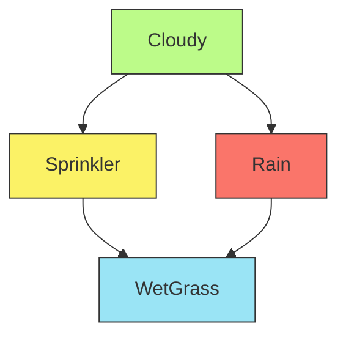

This graph encodes several important causal relationships:

- Cloudy weather affects both the likelihood of rain and whether the sprinkler system is used
- Both rain and the sprinkler system can cause the grass to become wet
- The network captures the intuition that people are less likely to use sprinklers when it's cloudy (since it might
  rain)

###### Probability Tables

To fully specify this Bayesian network, we need probability tables for each node:

**Prior Probability of Cloudy P(C)**

```
P(C) - Cloudy prior:
+C | 0.5    (50% chance of cloudy weather)
-C | 0.5    (50% chance of clear weather)
```

**Conditional Probability of Sprinkler Given Cloudy P(S|C)**

```
P(S|C) - Sprinkler given Cloudy:
+C +S | 0.1    (10% chance sprinkler is on when cloudy)
+C -S | 0.9    (90% chance sprinkler is off when cloudy)
-C +S | 0.5    (50% chance sprinkler is on when not cloudy)
-C -S | 0.5    (50% chance sprinkler is off when not cloudy)
```

**Conditional Probability of Rain Given Cloudy P(R|C)**

```
P(R|C) - Rain given Cloudy:
+C +R | 0.8    (80% chance of rain when cloudy)
+C -R | 0.2    (20% chance of no rain when cloudy)
-C +R | 0.2    (20% chance of rain when not cloudy)
-C -R | 0.8    (80% chance of no rain when not cloudy)
```

**Conditional Probability of WetGrass Given Sprinkler and Rain P(W|S,R)**

```
P(W|S,R) - WetGrass given Sprinkler and Rain:
+S +R +W | 0.99    (99% chance grass is wet when both sprinkler and rain)
+S +R -W | 0.01    (1% chance grass is dry when both sprinkler and rain)
+S -R +W | 0.90    (90% chance grass is wet when sprinkler but no rain)
+S -R -W | 0.10    (10% chance grass is dry when sprinkler but no rain)
-S +R +W | 0.90    (90% chance grass is wet when rain but no sprinkler)
-S +R -W | 0.10    (10% chance grass is dry when rain but no sprinkler)
-S -R +W | 0.01    (1% chance grass is wet when no sprinkler and no rain)
-S -R -W | 0.99    (99% chance grass is dry when no sprinkler and no rain)
```

These probability tables quantify the strength of relationships between variables in our model. For example, we can see
that cloudy weather strongly increases the chance of rain (from 20% to 80%) while decreasing the likelihood that the
sprinkler is on (from 50% to 10%).

In the example, a specific sample is shown: +C, -S, +R, +W. This represents a situation where:

- It is cloudy (+C)
- The sprinkler is off (-S)
- It is raining (+R)
- The grass is wet (+W)

This particular combination makes intuitive sense: it's cloudy and raining, so the grass is wet, and the sprinkler is
off (likely because it's not needed when it's raining).

###### Rejection Sampling

Rejection sampling is an approximate inference technique used to generate samples from a Bayesian network that match
observed evidence. It works by generating complete samples from the network and keeping only those that match our
observations.

The basic process of rejection sampling is:

1. Generate samples from the entire network using prior sampling
2. Keep only samples where the evidence variables match their observed values
3. Use these accepted samples to estimate probabilities for query variables

###### Example: Rejection Sampling with the Wet Grass Network

Let's say we have observed that the grass is wet (W = +W), and we want to infer the probability distribution over the
other variables (Cloudy, Sprinkler, and Rain).

The rejection sampling process would work as follows:

1. Sample the Cloudy variable (C) based on its prior probability P(C)
2. Sample the Rain variable (R) based on the conditional probability P(R|C)
3. Sample the Sprinkler variable (S) based on the conditional probability P(S|C)
4. Sample the WetGrass variable (W) based on the conditional probability P(W|S,R)
5. Accept the sample only if W = +W (the grass is wet); otherwise, reject it

Here are some example samples:

**Sample 1**: +C, -S, +R, +W ✓ (Accept)

- It's cloudy, the sprinkler is off, it's raining, and the grass is wet
- This matches our evidence (W = +W), so we accept this sample

**Sample 2**: -C, -S, -R, -W ✗ (Reject)

- It's not cloudy, the sprinkler is off, it's not raining, and the grass is dry
- This doesn't match our evidence (W = +W), so we reject this sample

**Sample 3**: +C, +S, -R, +W ✓ (Accept)

- It's cloudy, the sprinkler is on, it's not raining, and the grass is wet
- This matches our evidence (W = +W), so we accept this sample

After generating many samples and keeping only those where the grass is wet, we can estimate any probabilistic query.
For example, to estimate P(R=+R|W=+W) (the probability it's raining given the grass is wet), we would count the
proportion of accepted samples where R = +R.

###### Advantages and Disadvantages of Rejection Sampling

Rejection sampling has several important characteristics:

**Advantages**:

- Conceptually simple and easy to implement
- Produces unbiased estimates (converges to the true probabilities with enough samples)
- Generated samples are independent, which simplifies statistical analysis

**Disadvantages**:

- Can be very inefficient when the evidence has low probability
- Many samples may be rejected, wasting computational effort
- Performance degrades dramatically with unlikely evidence

For instance, if the probability of our evidence (W = +W) is only 1%, then approximately 99% of our samples will be
rejected. This makes rejection sampling impractical for rare events or when we have multiple pieces of evidence that are
jointly unlikely.

Despite these limitations, rejection sampling serves as a foundational approximate inference method in Bayesian networks
and provides a stepping stone to more sophisticated sampling techniques like likelihood weighting and Gibbs sampling.

###### Bayesian Network for Smart Home Energy Consumption

Bayesian networks provide a powerful framework for modeling complex systems with multiple interacting variables. In this
case, we're examining how various factors influence energy consumption in a smart home environment, particularly
focusing on air conditioning usage.

###### Network Structure and Variables

The network consists of five key variables that capture the main factors affecting energy consumption:

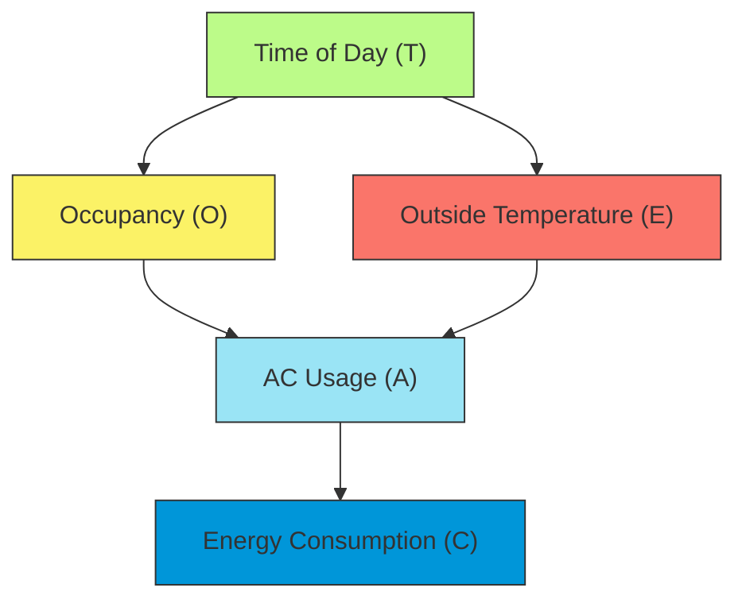

**Nodes:**

1. **Time of Day (T)**: Morning, Afternoon, Evening
2. **Occupancy (O)**: Occupied, Unoccupied
3. **Outside Temperature (E)**: Hot, Mild, Cold
4. **AC Usage (A)**: On, Off
5. **Energy Consumption (C)**: High, Medium, Low

**Edges:**

This diagram shows:

1. Time of Day (T) influences both:
    - Occupancy (O)
    - Outside Temperature (E)
2. AC Usage (A) depends on:
    - Occupancy (O)
    - Outside Temperature (E)
3. Energy Consumption (C) depends directly on:
    - AC Usage (A)

Considering the following relationships:

1. Time of Day → Occupancy
2. Time of Day → Outside Temperature
3. Occupancy → AC Usage
4. Outside Temperature → AC Usage
5. AC Usage → Energy Consumption

The arrows represent direct causal relationships and conditional dependencies between variables in the smart building
energy management system.

###### Inference in the AC Usage Bayesian Network:

1. Types of Inference:

    a) Predictive Inference: Reasoning from causes to effects. Example: What's the probability of high energy
    consumption given that it's a hot afternoon?

    b) Diagnostic Inference: Reasoning from effects to causes. Example: If energy consumption is high, what's the
    probability that the AC is on?

    c) Intercausal Inference: Reasoning between causes of a common effect. Example: If energy consumption is high and
    it's occupied, how does this affect the probability of it being hot outside?

2. Inference Methods:

    a) Exact Inference:

    - Variable Elimination: Systematically "sum out" variables not involved in the query.
    - Junction Tree Algorithm: Create a tree structure for efficient exact inference.

    b) Approximate Inference:

    - Monte Carlo methods: Use random sampling to estimate probabilities.
    - Variational methods: Approximate complex distributions with simpler ones.

3. Example Inference Task:

    Query: $P(A = \text{On} | T = \text{Afternoon}, C = \text{High})$ "What's the probability the AC is on given it's
    afternoon and energy consumption is high?"

    Steps:

    1. Apply Bayes' Rule: $P(A|T,C) = P(C|A,T) \times P(A|T) / P(C|T)$
    2. Expand using marginalization: $P(A|T,C) = \sum_{O,E} P(C|A) \times P(A|O,E) \times P(O|T) \times P(E|T) / P(C|T)$
    3. Use probability tables to compute each term.
    4. Sum over all possible values of O and E.

4. Challenges in Inference:

    - Computational Complexity: As the network grows, exact inference can become intractable.
    - Continuous Variables: Many algorithms are designed for discrete variables; continuous variables may require
      discretization or special techniques.
    - Incomplete Data: Handling missing values in the evidence.

5. Applications of Inference:

    - Prediction: Estimating future energy consumption based on current conditions.
    - Diagnosis: Identifying potential causes of unexpected energy usage patterns.
    - Decision Making: Determining optimal AC settings to balance comfort and energy efficiency.

###### Probability of AC Usage Given Time of Day and Energy Consumption

$P(A|T,C)$ represents the probability of AC Usage (A) given Time of Day (T) and Energy Consumption (C). The formula uses
marginalization over hidden variables Occupancy (O) and Outside Temperature (E).

$$P(A|T,C) = P(C|A,T) \times P(A|T) / P(C|T) \text{ [Note: Bayes Theorem]}$$

According to the Law of Total Probability, for any events X and Y, where $Y_1, Y_2, ..., Y_n$ form a partition of the
sample space:

$$P(X) = \sum_{i} P(X|Y_i)P(Y_i)$$

In our case, we want $P(A|T)$, and we have two hidden variables O and E:

1. Each combination of O and E values forms a partition
2. For example, if O is binary (occupied/unoccupied) and E is ternary (hot/mild/cold), we have 6 possible combinations

$$P(A|T) = \sum_{O,E} P(A|O,E,T)P(O,E|T)$$ $$= \sum_{O,E} P(A,O,E|T) \text{ [Note: Law of Conditional Probability]}$$

This is marginalization - we're "summing out" the variables O and E to get the probability of A given T. It's like
saying: "To find the probability of AC usage at a given time, consider all possible combinations of occupancy and
temperature at that time, and sum their contributions". For example, if O = {0,1} and E = {hot,mild,cold}:

$$P(A|T) = P(A,O=0,E=\text{hot}|T) + P(A,O=0,E=\text{mild}|T) + P(A,O=0,E=\text{cold}|T) +$$
$$P(A,O=1,E=\text{hot}|T) + P(A,O=1,E=\text{mild}|T) + P(A,O=1,E=\text{cold}|T)$$

Hence, our formula becomes:

$$P(A|T,C) = P(C|A,T) \times P(A|T) / P(C|T)$$ $$= P(C|A,T) \times \sum_{O,E} P(A,O,E|T) / P(C|T)$$

According to the Chain Law of Probability,

$$P(A,O,E|T) = P(A|O,E,T) \times P(O,E|T)$$

$$P(A|T,C) = P(C|A,T) \times \sum_{O,E} P(A,O,E|T) / P(C|T)$$
$$= P(C|A,T) \times \sum_{O,E} P(A|O,E,T) \times P(O,E|T) / P(C|T)$$


Due to conditional independence in the Bayesian network:

1. A is conditionally independent of T given O and E
2. O and E are conditionally independent given T

Hence, we have:

$$P(A|O,E,T) = P(A|O,E)$$ $$P(O,E|T) = P(O|T) \times P(E|T)$$

Substituting back:

$$P(A|T,C) = P(C|A,T) \times \sum_{O,E} P(A|O,E,T) \times P(O,E|T) / P(C|T)$$
$$= P(C|A,T) \times \sum_{O,E} P(A|O,E) \times P(O|T) \times P(E|T) / P(C|T)$$

Now for $P(C|A,T)$, by conditional independence, C depends only on A in the network structure. Specifically,

$$P(C|A,T) = P(C|A)$$

Putting it all together:

$$P(A|T,C) = P(C|A) \times [\sum_{O,E} P(A|O,E) \times P(O|T) \times P(E|T)] / P(C|T)$$
$$= \sum_{O,E} P(C|A) \times P(A|O,E) \times P(O|T) \times P(E|T) / P(C|T)$$

So, our final equation becomes:

$$P(A|T,C) = \sum_{O,E} P(C|A) \times P(A|O,E) \times P(O|T) \times P(E|T) / P(C|T)$$

This equation calculates "the probability of AC being ON given the Time of Day and Energy Consumption" where:

###### Probability Terms

1. **$P(C|A)$**: Probability of seeing this Energy Consumption given AC state
    - Example: $P(\text{Energy=High} | \text{AC=ON})$
2. **$P(A|O,E)$**: Probability of AC being ON given Occupancy and Temperature
    - Example: $P(\text{AC=ON} | \text{Room=Occupied}, \text{Temp=Hot})$
3. **$P(O|T)$**: Probability of Occupancy at given Time
    - Example: $P(\text{Room=Occupied} | \text{Time=Afternoon})$
4. **$P(E|T)$**: Probability of Temperature at given Time
    - Example: $P(\text{Temp=Hot} | \text{Time=Afternoon})$
5. **$P(C|T)$**: Normalization term (probability of Energy Consumption at Time)

###### Summation Explanation

The $\sum_{O,E}$ means we sum over all possible combinations of:

- Occupancy (O): {Occupied, Unoccupied}
- Temperature (E): {Hot, Mild, Cold}

###### Real-World Example

If we want to know $P(\text{AC=ON} | \text{Time=Afternoon}, \text{Energy=High})$, we:

1. Consider every possible combination of occupancy and temperature
2. Multiply the probabilities for each combination
3. Sum all these products
4. Divide by the normalization term

This accounts for all possible scenarios that could lead to the AC being ON at that time with high energy consumption.

###### Applying Likelihood Weighting Example

Consider our Rain-Traffic-Late network again. To estimate P(L=true|R=true) using likelihood weighting:

1. Fix R=true in all samples
2. For each sample:
    - Sample Traffic (T) from P(T|R=true)
    - Sample Late (L) from P(L|T)
    - Assign weight w = 1 (since we directly fixed R to its evidence value)
3. Estimate: P(L=true|R=true) ≈ (Sum of weights for samples where L=true) / (Sum of all weights)

<div align="center">

<p style="color: #555;">Figure: Hidden Markov Model with transition and emission probabilities visualized</p>
</div>

**Practical Considerations**

1. **Sample Size**: More samples generally lead to more accurate probability estimates, but with diminishing returns.
   The error typically decreases as 1/√n, where n is the number of samples.
2. **Convergence**: For complex networks, determining when sampling has converged to good estimates can be challenging.
   Convergence diagnostics can help assess whether enough samples have been collected.
3. **Sequential Importance Sampling (SIS)**: An extension of likelihood weighting that dynamically adjusts sampling to
   focus on regions of higher posterior probability.
4. **Combining Methods**: Hybrid approaches often perform best, such as using Gibbs sampling for some variables and
   likelihood weighting for others.

Sampling methods scale better than exact inference for large networks, making them invaluable for practical applications
in complex domains.

##### Inference Types and Queries

Bayesian networks support various types of inference queries, each answering different questions about the domain.
Understanding these query types helps in selecting appropriate inference algorithms and interpreting results correctly.

**Major Types of Inference**

1. **Causal Inference**
    - Reasoning from causes to effects (following the direction of edges)
    - Queries like: "If I take this medication, what's the probability my symptoms will improve?"
    - Example: P(Symptoms=improved | Medication=taken)
    - Relatively straightforward computation following the network structure
2. **Diagnostic Inference**
    - Reasoning from effects to causes (opposite to edge direction)
    - Queries like: "If I observe these symptoms, what's the probability the patient has disease X?"
    - Example: P(Disease=present | Symptoms=observed)
    - Uses Bayes' rule to invert the direction of reasoning
3. **Intercausal Inference**
    - Reasoning between causes of a common effect ("explaining away")
    - Queries like: "If the alarm is sounding and I know there's been a burglary, what's the probability an earthquake
      occurred?"
    - Example: P(Earthquake=true | Alarm=on, Burglary=true)
    - Often counter-intuitive because knowing one cause can make other causes less likely
4. **Mixed Inference**
    - Combines multiple types of reasoning
    - Queries like: "If the patient has symptom X and took medication Y, what's the probability they have disease Z and
      will develop symptom W?"
    - Involves both diagnostic and predictive components

**Common Query Formulations**

1. **Posterior Probability Queries**
    - Computing probability distributions over variables given evidence
    - P(Y|E=e) where Y is the query variable(s) and E=e is the evidence
    - Most basic type of query in Bayesian networks
2. **Most Likely Explanation (MLE)/Maximum a Posteriori (MAP)**
    - Finding the most probable assignment to all unobserved variables given evidence
    - argmax<sub>X</sub> P(X|E=e) where X includes all non-evidence variables
    - Used in diagnosis, fault detection, and classification tasks
3. **Maximum Likelihood Estimation (MLE)**
    - Finding the most likely assignment to a subset of variables given evidence
    - argmax<sub>Y</sub> P(Y|E=e) where Y is a subset of unobserved variables
    - More focused than MAP queries
4. **Sensitivity Analysis**
    - Evaluating how changes in model parameters affect inference results
    - Used for robustness testing and understanding model limitations

**Example: Alarm Network Queries**

Using the classic Alarm network, some example queries include:

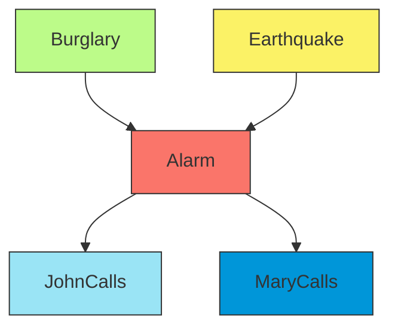

1. Causal query: P(JohnCalls=true | Burglary=true) "If there's a burglary, will John call?"
2. Diagnostic query: P(Burglary=true | JohnCalls=true, MaryCalls=true) "If both John and Mary call, was there a
   burglary?"
3. Intercausal query: P(Earthquake=true | Alarm=true, Burglary=true) "If the alarm is on and there was a burglary, was
   there also an earthquake?"

**Inference in Temporal Models**

Special types of Bayesian networks handle time-sequential data:

1. **Filtering**: Computing the belief state (probability distribution) at the current time given all evidence up to now
    - P(X<sub>t</sub> | e<sub>1:t</sub>)
2. **Prediction**: Estimating the probability of future states given current evidence
    - P(X<sub>t+k</sub> | e<sub>1:t</sub>) for k > 0
3. **Smoothing**: Determining past states given evidence up to the present
    - P(X<sub>t-k</sub> | e<sub>1:t</sub>) for k > 0
4. **Most likely sequence**: Finding the most probable sequence of states given evidence (Viterbi algorithm)
    - argmax<sub>X<sub>1:t</sub></sub> P(X<sub>1:t</sub> | e<sub>1:t</sub>)

<div align="center">

<p style="color: #555;">Figure: A complete Hidden Markov Model showing both hidden states (parts of speech) and observations (words), with the path representing sequence inference.</p>
</div>

**Advanced Query Processing**

For complex queries, inference can be optimized by:

1. **Query decomposition**: Breaking down complex queries into simpler sub-queries
2. **Relevance-based pruning**: Identifying and using only the relevant portions of the network
3. **Evidence propagation**: Efficiently updating beliefs as new evidence arrives
4. **Incremental inference**: Reusing previous computations when evidence changes slightly

Selecting the appropriate query formulation and inference algorithm depends on the specific problem, the network
structure, and computational constraints. In practice, a combination of techniques often yields the best results.

##### Computational Complexity Challenges

Inference in Bayesian networks faces significant computational challenges that limit the practical application of exact
methods to large or complex networks. Understanding these limitations helps in selecting appropriate inference
algorithms and designing computationally tractable networks.

**Theoretical Complexity Results**

1. **Exact Inference Hardness**
    - Exact inference in general Bayesian networks is NP-hard
    - Even approximate inference to within a constant factor is NP-hard
    - The complexity depends on the network's structure, not just its size
2. **Tractable Cases**

    - Polytrees (singly connected networks): Linear time complexity
    - Networks with bounded treewidth: Exponential only in the treewidth
    - Tree-structured networks: Linear time using message passing algorithms

3. Complexity Parameters
    - n: Number of variables
    - d: Maximum domain size of any variable
    - w: Treewidth of the network (roughly, the size of the largest cluster in an optimal junction tree)
    - Worst-case time complexity for exact inference: O(n·d^(w+1))

**Bottlenecks in Exact Inference**

1. **Factor Size Explosion**
    - Variable elimination creates intermediate factors
    - These factors can grow exponentially in the number of variables they contain
    - Example: Eliminating a variable connected to k others creates a factor with at least k variables
2. **Clique Tree Construction**
    - Junction tree algorithms build cliques (fully connected subgraphs)
    - The size of the largest clique determines computational complexity
    - Finding the optimal junction tree is itself NP-hard
3. **Memory Requirements**
    - Storing conditional probability tables requires space exponential in the number of parents
    - Intermediate results in exact inference can require prohibitive amounts of memory

**Approximate Inference Challenges**

1. **Sampling Convergence**
    - Sampling methods may require many samples for convergence
    - Convergence can be especially slow with deterministic or near-deterministic relationships
2. **Evidence Rarity Problem**
    - Evidence with low prior probability is problematic for rejection sampling
    - Example: If P(E=e) = 0.001, approximately 999 out of 1000 samples will be rejected
3. **Local Optima in MCMC Methods**
    - Markov Chain Monte Carlo methods (like Gibbs sampling) can get stuck in local probability maxima
    - Mixing time (time to adequately explore the probability space) can be very long

**Optimization Strategies**

1. **Network Structure Optimization**
    - Design networks with lower treewidth when possible
    - Use d-separation to identify independence relationships
    - Limit the number of parents per node
2. **Variable Elimination Ordering**
    - Use heuristics like min-fill or min-weight to find good elimination orderings
    - Pre-compute elimination orderings for repeated queries
3. **Exploiting Local Structure**
    - Use context-specific independence
    - Employ structured representations like algebraic decision diagrams
    - Factorize large tables when possible (canonical models like noisy-OR)
4. **Approximate Inference Enhancements**
    - Adaptive importance sampling
    - Annealed importance sampling
    - Rao-Blackwellized particle filtering
    - Variational methods with richer approximating families

<div align="center">

<p style="color: #555;">Figure: Visualization of the Viterbi algorithm identifying the most likely path through a hidden Markov model, demonstrating efficient sequence inference.</p>
</div>

**Case Study: Part-of-Speech Tagging Complexity**

The part-of-speech tagging problem demonstrates computational complexity challenges:

- For a sentence with n words and p possible tags per word, there are p^n possible tag sequences
- Naive evaluation would be exponential: O(p^n)
- Dynamic programming approaches like the Viterbi algorithm reduce this to O(np^2)
- This is why efficient algorithms are essential, even for moderately sized problems

**Practical Implications**

1. **Hybrid Approaches**
    - Use exact inference when possible, approximate otherwise
    - Apply exact methods to critical parts of the network
    - Use domain knowledge to simplify complex regions
2. **Online vs. Offline Inference**
    - Precompute results for common queries when possible
    - Balance accuracy requirements against time constraints for real-time applications
3. **Model Simplification**
    - Simplify models by removing weak dependencies
    - Use parameter tying to reduce the number of distinct parameters
    - Consider alternative models like Naive Bayes that sacrifice accuracy for simplicity
4. **Hardware Acceleration**
    - Parallel implementation of sampling methods
    - GPU acceleration for matrix operations
    - Specialized hardware for probabilistic inference

The computational challenges of Bayesian network inference highlight the importance of careful model design and
algorithm selection. While exact inference is theoretically optimal, practical applications often require compromises
between computational feasibility and inference accuracy.

#### Inference in Bayesian Networks

Inference in Bayesian networks is the process of answering probabilistic queries about variables within the network
given evidence. It's one of the most important features of Bayesian networks as it allows us to use these models to
reason under uncertainty by updating our beliefs based on new evidence.

At its core, inference in Bayesian networks involves calculating the posterior probability distribution of one or more
variables given observed values for other variables in the network. This can be formally expressed as computing
P(Y|E=e), where Y represents the query variables and E=e represents the evidence.

##### Exact vs. Approximate Inference

Exact inference methods calculate the precise probabilities for the queries of interest, while approximate methods
provide estimations that trade-off some accuracy for computational efficiency. The choice between these approaches
depends on the network structure, size, and the specific requirements of the application.

**Exact Inference**

Exact inference methods provide mathematically precise answers to probability queries. These methods are guaranteed to
give the correct probability values, but may become computationally intractable for large or densely connected networks.

Key exact inference techniques include:

1. **Enumeration**: The most straightforward but least efficient approach. It explicitly calculates joint probabilities
   by summing over all possible configurations of hidden variables.
2. **Variable Elimination**: A more efficient algorithm that systematically eliminates variables not in the query or
   evidence by marginalizing them out one by one.
3. **Junction Tree Algorithm**: Transforms the Bayesian network into a tree structure called a junction tree, where
   standard tree-based inference algorithms can be applied.

For example, in a simple query to find P(B|A=true) in a small network, exact inference would compute:

$$P(B|A=true) = \frac{P(B, A=true)}{P(A=true)} = \frac{\sum_{C} P(A=true, B, C)}{\sum_{B,C} P(A=true, B, C)}$$

Where the summation extends over all possible values of the hidden variables.

**Approximate Inference**

When exact inference is computationally prohibitive, approximate methods provide estimates of the desired probabilities.
These methods are especially useful for large networks or time-sensitive applications.

Major approximate inference approaches include:

1. **Sampling Methods**: Generate random samples from the network's distribution and use these samples to estimate
   probabilities. Examples include:
    - Direct sampling (prior sampling)
    - Rejection sampling
    - Likelihood weighting
    - Gibbs sampling (MCMC)
2. **Variational Methods**: Approximate complex probability distributions with simpler ones that are easier to compute.
3. **Loopy Belief Propagation**: Apply message-passing algorithms to networks with loops, though convergence is not
   guaranteed.

<div align="center">

<p style="color: #555;">Figure: The classic Alarm Bayesian Network used for demonstrating inference techniques. The network models relationships between a possible burglary, earthquake, alarm system, and neighboring responses.</p>
</div>

The tradeoff between exact and approximate inference is clear: exact methods provide precise answers but may be
computationally infeasible for complex networks, while approximate methods scale better but introduce some error into
the results.

##### Variable Elimination Algorithm

Variable elimination is one of the most fundamental exact inference algorithms for Bayesian networks. It efficiently
computes conditional probabilities by eliminating variables through marginalization, one at a time.

**Core Concept**

The key insight of variable elimination is to reorganize the computation of joint probabilities to avoid redundant
calculations. Rather than naively computing the full joint probability distribution, it calculates factors (local
probability distributions) and progressively eliminates (marginalizes out) variables that are not part of the query or
evidence.

**Algorithm Steps**

1. **Express the joint probability** using the chain rule factorization based on the Bayesian network structure.
2. **Restrict factors** according to the evidence (observed variables).
3. **Choose a variable elimination ordering** (this choice affects efficiency).
4. For each non-query, non-evidence variable:
    - **Identify all factors** containing the variable to be eliminated.
    - **Multiply these factors** to create a new factor.
    - **Sum out (marginalize)** the variable from this new factor.
    - **Replace the original factors** with this new marginalized factor.
5. **Multiply remaining factors** and normalize to obtain the final conditional probability.

**Example Calculation**

Let's consider a simple Rain-Traffic-Late network where we want to compute P(L|R=true), that is, the probability of
being late given that it's raining:

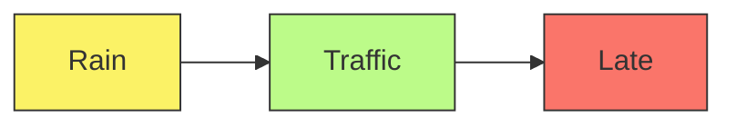

Given:

- P(R=true) = 0.1, P(R=false) = 0.9
- P(T=heavy|R=true) = 0.8, P(T=light|R=true) = 0.2
- P(T=heavy|R=false) = 0.1, P(T=light|R=false) = 0.9
- P(L=true|T=heavy) = 0.3, P(L=false|T=heavy) = 0.7
- P(L=true|T=light) = 0.1, P(L=false|T=light) = 0.9

To compute P(L|R=true), variable elimination would:

1. Start with the factorization: P(R,T,L) = P(R) × P(T|R) × P(L|T)
2. Restrict factors for R=true: P(T|R=true) × P(L|T)
3. Eliminate variable T by summing it out: $$P(L|R=true) = \sum_T P(T|R=true) \times P(L|T)$$

Let's calculate this for L=true:

- P(L=true|R=true) = P(T=heavy|R=true) × P(L=true|T=heavy) + P(T=light|R=true) × P(L=true|T=light)
- P(L=true|R=true) = 0.8 × 0.3 + 0.2 × 0.1 = 0.24 + 0.02 = 0.26

**Factor Operations**

Two key operations in variable elimination are:

1. **Factor Product**: Combines two factors by multiplying the probabilities for compatible configurations of the
   variables.
2. **Factor Marginalization**: Eliminates a variable by summing over all its possible values.

**Elimination Ordering**

The order in which variables are eliminated can dramatically affect computational efficiency. Finding the optimal
elimination ordering is NP-hard, but several heuristics exist:

- Min-neighbors: Eliminate the variable connected to the fewest other variables
- Min-fill: Eliminate the variable that adds the fewest edges to the graph when removed
- Weighted min-fill: Consider both the number of new edges and the domain sizes of variables

**Advantages and Limitations**

Advantages:

- More efficient than naive enumeration
- Provides exact probabilities
- Works well for tree-structured networks or networks with low treewidth

Limitations:

- Still exponential in the worst case
- Performance highly dependent on network structure and elimination ordering
- Can be impractical for densely connected networks

Variable elimination forms the backbone of many more sophisticated exact inference algorithms and is a fundamental
technique in probabilistic reasoning.

##### Sampling-Based Methods

When exact inference becomes computationally intractable, sampling-based methods offer practical alternatives by
approximating probabilities through statistical sampling. These methods generate representative samples from the joint
distribution defined by the Bayesian network and use these samples to estimate the required probabilities.

**Basic Concept**

Sampling-based methods work by generating many random instances (samples) from the distribution represented by the
network. As the number of samples increases, the frequency of specific variable configurations converges to their true
probabilities according to the law of large numbers.

**Common Sampling Algorithms**

1. **Prior (Direct) Sampling**

    The simplest sampling approach involves:

    - Sampling variables in topological order (parents before children)
    - Using each node's conditional probability table to sample values
    - Counting the frequency of query events in the generated samples

    For a query P(Y|E=e), the estimate is: $$P(Y|E=e) \approx \frac{\text{Count}(Y, E=e)}{\text{Count}(E=e)}$$

    However, this method is inefficient when evidence is rare, as many samples will be rejected.

2. **Rejection Sampling**

    An improvement over prior sampling that:

    - Generates samples using the same process as prior sampling
    - Discards samples inconsistent with the evidence
    - Uses only the remaining samples to estimate conditional probabilities

    While more focused than prior sampling, rejection sampling still wastes computation when evidence has low
    probability. For rare evidence, most samples will be rejected.

3. **Likelihood Weighting**

    A more efficient approach that:

    - Fixes evidence variables to their observed values
    - Samples only non-evidence variables
    - Weights each sample by the likelihood of the evidence
    - Uses these weighted samples to estimate probabilities

    The weight for each sample is the product of conditional probabilities of evidence variables given their parents:
    $$w = \prod_{i \in evidence} P(e_i | parents(X_i))$$

    Likelihood weighting ensures every sample is consistent with the evidence, making it more efficient than rejection
    sampling, especially with rare evidence.

4. **Gibbs Sampling**

    A Markov Chain Monte Carlo (MCMC) technique that:

    - Starts with an arbitrary assignment to non-evidence variables
    - Repeatedly resamples one variable at a time, conditioned on all others
    - Uses the frequency of variable values in the sampling chain to estimate probabilities

    Gibbs sampling performs well with complex conditional dependencies and can handle networks where other sampling
    methods struggle. However, it may require more samples to converge to accurate estimates, especially if variables
    are highly correlated.

**Example: Applying Likelihood Weighting**

Consider our Rain-Traffic-Late network again. To estimate P(L=true|R=true) using likelihood weighting:

1. Fix R=true in all samples
2. For each sample:
    - Sample Traffic (T) from P(T|R=true)
    - Sample Late (L) from P(L|T)
    - Assign weight w = 1 (since we directly fixed R to its evidence value)
3. Estimate: P(L=true|R=true) ≈ (Sum of weights for samples where L=true) / (Sum of all weights)

<div align="center">
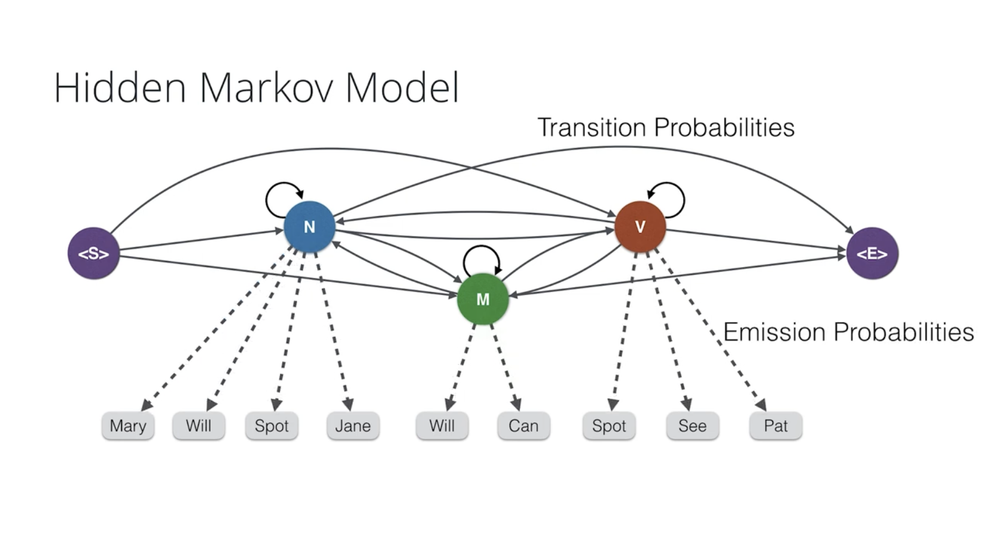
<p style="color: #555;">Figure: Hidden Markov Model with transition and emission probabilities visualized. The graph shows states (parts of speech) at the top level and their emissions (words) at the bottom.</p>
</div>

**Practical Considerations**

1. **Sample Size**: More samples generally lead to more accurate probability estimates, but with diminishing returns.
   The error typically decreases as 1/√n, where n is the number of samples.
2. **Convergence**: For complex networks, determining when sampling has converged to good estimates can be challenging.
   Convergence diagnostics can help assess whether enough samples have been collected.
3. **Sequential Importance Sampling (SIS)**: An extension of likelihood weighting that dynamically adjusts sampling to
   focus on regions of higher posterior probability.
4. **Combining Methods**: Hybrid approaches often perform best, such as using Gibbs sampling for some variables and
   likelihood weighting for others.

Sampling methods scale better than exact inference for large networks, making them invaluable for practical applications
in complex domains.

##### Inference Types and Queries

Bayesian networks support various types of inference queries, each answering different questions about the domain.
Understanding these query types helps in selecting appropriate inference algorithms and interpreting results correctly.

**Major Types of Inference**

1. **Causal Inference**
    - Reasoning from causes to effects (following the direction of edges)
    - Queries like: "If I take this medication, what's the probability my symptoms will improve?"
    - Example: P(Symptoms=improved | Medication=taken)
    - Relatively straightforward computation following the network structure
2. **Diagnostic Inference**
    - Reasoning from effects to causes (opposite to edge direction)
    - Queries like: "If I observe these symptoms, what's the probability the patient has disease X?"
    - Example: P(Disease=present | Symptoms=observed)
    - Uses Bayes' rule to invert the direction of reasoning
3. **Intercausal Inference**
    - Reasoning between causes of a common effect ("explaining away")
    - Queries like: "If the alarm is sounding and I know there's been a burglary, what's the probability an earthquake
      occurred?"
    - Example: P(Earthquake=true | Alarm=on, Burglary=true)
    - Often counter-intuitive because knowing one cause can make other causes less likely
4. **Mixed Inference**
    - Combines multiple types of reasoning
    - Queries like: "If the patient has symptom X and took medication Y, what's the probability they have disease Z and
      will develop symptom W?"
    - Involves both diagnostic and predictive components

**Common Query Formulations**

1. **Posterior Probability Queries**
    - Computing probability distributions over variables given evidence
    - P(Y|E=e) where Y is the query variable(s) and E=e is the evidence
    - Most basic type of query in Bayesian networks
2. **Most Likely Explanation (MLE)/Maximum a Posteriori (MAP)**
    - Finding the most probable assignment to all unobserved variables given evidence
    - argmax<sub>X</sub> P(X|E=e) where X includes all non-evidence variables
    - Used in diagnosis, fault detection, and classification tasks
3. **Maximum Likelihood Estimation (MLE)**
    - Finding the most likely assignment to a subset of variables given evidence
    - argmax<sub>Y</sub> P(Y|E=e) where Y is a subset of unobserved variables
    - More focused than MAP queries
4. **Sensitivity Analysis**
    - Evaluating how changes in model parameters affect inference results
    - Used for robustness testing and understanding model limitations

**Example: Alarm Network Queries**

Using the classic Alarm network, some example queries include:


1. Causal query: P(JohnCalls=true | Burglary=true) "If there's a burglary, will John call?"
2. Diagnostic query: P(Burglary=true | JohnCalls=true, MaryCalls=true) "If both John and Mary call, was there a
   burglary?"
3. Intercausal query: P(Earthquake=true | Alarm=true, Burglary=true) "If the alarm is on and there was a burglary, was
   there also an earthquake?"

**Inference in Temporal Models**

Special types of Bayesian networks handle time-sequential data:

1. **Filtering**: Computing the belief state (probability distribution) at the current time given all evidence up to now
    - P(X<sub>t</sub> | e<sub>1:t</sub>)
2. **Prediction**: Estimating the probability of future states given current evidence
    - P(X<sub>t+k</sub> | e<sub>1:t</sub>) for k > 0
3. **Smoothing**: Determining past states given evidence up to the present
    - P(X<sub>t-k</sub> | e<sub>1:t</sub>) for k > 0
4. **Most likely sequence**: Finding the most probable sequence of states given evidence (Viterbi algorithm)
    - argmax<sub>X<sub>1:t</sub></sub> P(X<sub>1:t</sub> | e<sub>1:t</sub>)

<div align="center">

<p style="color: #555;">Figure: A complete Hidden Markov Model showing both hidden states (parts of speech) and observations (words), with the path representing sequence inference.</p>
</div>

**Advanced Query Processing**

For complex queries, inference can be optimized by:

1. **Query decomposition**: Breaking down complex queries into simpler sub-queries
2. **Relevance-based pruning**: Identifying and using only the relevant portions of the network
3. **Evidence propagation**: Efficiently updating beliefs as new evidence arrives
4. **Incremental inference**: Reusing previous computations when evidence changes slightly

Selecting the appropriate query formulation and inference algorithm depends on the specific problem, the network
structure, and computational constraints. In practice, a combination of techniques often yields the best results.

##### Computational Complexity Challenges

Inference in Bayesian networks faces significant computational challenges that limit the practical application of exact
methods to large or complex networks. Understanding these limitations helps in selecting appropriate inference
algorithms and designing computationally tractable networks.

**Theoretical Complexity Results**

1. **Exact Inference Hardness**
    - Exact inference in general Bayesian networks is NP-hard
    - Even approximate inference to within a constant factor is NP-hard
    - The complexity depends on the network's structure, not just its size
2. **Tractable Cases**
    - Polytrees (singly connected networks): Linear time complexity
    - Networks with bounded treewidth: Exponential only in the treewidth
    - Tree-structured networks: Linear time using message passing algorithms
3. **Complexity Parameters**
    - n: Number of variables
    - d: Maximum domain size of any variable
    - w: Treewidth of the network (roughly, the size of the largest cluster in an optimal junction tree)
    - Worst-case time complexity for exact inference: O(n·d^(w+1))

**Bottlenecks in Exact Inference**

1. **Factor Size Explosion**
    - Variable elimination creates intermediate factors
    - These factors can grow exponentially in the number of variables they contain
    - Example: Eliminating a variable connected to k others creates a factor with at least k variables
2. **Clique Tree Construction**
    - Junction tree algorithms build cliques (fully connected subgraphs)
    - The size of the largest clique determines computational complexity
    - Finding the optimal junction tree is itself NP-hard
3. **Memory Requirements**
    - Storing conditional probability tables requires space exponential in the number of parents
    - Intermediate results in exact inference can require prohibitive amounts of memory

**Approximate Inference Challenges**

1. **Sampling Convergence**
    - Sampling methods may require many samples for convergence
    - Convergence can be especially slow with deterministic or near-deterministic relationships
2. **Evidence Rarity Problem**
    - Evidence with low prior probability is problematic for rejection sampling
    - Example: If P(E=e) = 0.001, approximately 999 out of 1000 samples will be rejected
3. **Local Optima in MCMC Methods**
    - Markov Chain Monte Carlo methods (like Gibbs sampling) can get stuck in local probability maxima
    - Mixing time (time to adequately explore the probability space) can be very long

**Optimization Strategies**

1. **Network Structure Optimization**
    - Design networks with lower treewidth when possible
    - Use d-separation to identify independence relationships
    - Limit the number of parents per node
2. **Variable Elimination Ordering**
    - Use heuristics like min-fill or min-weight to find good elimination orderings
    - Pre-compute elimination orderings for repeated queries
3. **Exploiting Local Structure**
    - Use context-specific independence
    - Employ structured representations like algebraic decision diagrams
    - Factorize large tables when possible (canonical models like noisy-OR)
4. **Approximate Inference Enhancements**
    - Adaptive importance sampling
    - Annealed importance sampling
    - Rao-Blackwellized particle filtering
    - Variational methods with richer approximating families

<div align="center">

<p style="color: #555;">Figure: Visualization of the Viterbi algorithm identifying the most likely path through a hidden Markov model, demonstrating efficient sequence inference.</p>
</div>

**Case Study: Part-of-Speech Tagging Complexity**

The part-of-speech tagging problem demonstrates computational complexity challenges:

- For a sentence with n words and p possible tags per word, there are p^n possible tag sequences
- Naive evaluation would be exponential: O(p^n)
- Dynamic programming approaches like the Viterbi algorithm reduce this to O(np^2)
- This is why efficient algorithms are essential, even for moderately sized problems

**Practical Implications**

1. **Hybrid Approaches**
    - Use exact inference when possible, approximate otherwise
    - Apply exact methods to critical parts of the network
    - Use domain knowledge to simplify complex regions
2. **Online vs. Offline Inference**
    - Precompute results for common queries when possible
    - Balance accuracy requirements against time constraints for real-time applications
3. **Model Simplification**
    - Simplify models by removing weak dependencies
    - Use parameter tying to reduce the number of distinct parameters
    - Consider alternative models like Naive Bayes that sacrifice accuracy for simplicity
4. **Hardware Acceleration**
    - Parallel implementation of sampling methods
    - GPU acceleration for matrix operations
    - Specialized hardware for probabilistic inference

The computational challenges of Bayesian network inference highlight the importance of careful model design and
algorithm selection. While exact inference is theoretically optimal, practical applications often require compromises
between computational feasibility and inference accuracy.

##### Enumeration in Probabilistic Reasoning

Enumeration is a foundational exact inference algorithm in probabilistic reasoning and Bayesian networks. It provides a
systematic approach to computing precise probability distributions by methodically considering all possible combinations
of variables.

###### Core Principles

At its heart, enumeration is about exhaustively calculating probabilities by:

1. Summing over all possible values of hidden (unobserved) variables
2. Computing joint probabilities for each possible combination
3. Using these calculations to derive the posterior probability distribution

This approach directly implements the mathematical definitions of probability theory, making it conceptually
straightforward but computationally intensive.

###### Theoretical Foundation

Enumeration applies Bayes' rule in its most direct form:

$$P(X|e) = \alpha P(X,e)$$

Where:

- $X$ is the query variable we want to know about
- $e$ represents the observed evidence
- $\alpha$ is a normalization constant that ensures probabilities sum to 1

To compute the joint probability $P(X,e)$, we must account for all possible values of hidden variables $Y$ that aren't
part of our query or evidence:

$$P(X,e) = \sum_y P(X,e,y)$$

This summation over all possible configurations of hidden variables is what gives enumeration its name.

###### Algorithm Steps

The enumeration algorithm follows these systematic steps:

1. **Identify Variables**: Classify all network variables as query, evidence, or hidden
2. **Generate Combinations**: List all possible value combinations for hidden variables
3. **Compute Joint Probabilities**: For each combination:
    - Apply the chain rule to express the joint probability as a product of conditional probabilities
    - Look up the required probabilities from the Bayesian network
    - Multiply these probabilities together
4. **Sum Results**: Add up probabilities for configurations matching our query variable values
5. **Normalize**: Divide by the sum of all probabilities to ensure they sum to 1

###### Worked Example

Consider a simple Bayesian network with three binary variables: Rain (R), Sprinkler (S), and WetGrass (W), where:

- Rain can influence both Sprinkler and WetGrass
- Sprinkler can influence WetGrass

If we observe WetGrass is true (W=true) and want to compute P(R|W=true), we would:

1. Identify S as our hidden variable
2. Consider both possible values of S: true and false
3. Compute: $$P(R=true|W=true) = \alpha \sum_s P(R=true, W=true, S=s)$$
   $$= \alpha [P(R=true, W=true, S=true) + P(R=true, W=true, S=false)]$$
4. Apply the chain rule to expand each joint probability:
   $$P(R=true, W=true, S=true) = P(R=true) \times P(S=true|R=true) \times P(W=true|S=true, R=true)$$
   $$P(R=true, W=true, S=false) = P(R=true) \times P(S=false|R=true) \times P(W=true|S=false, R=true)$$
5. Look up these conditional probabilities in our Bayesian network, multiply them together, and sum the results
6. Repeat the process for R=false
7. Normalize both results to ensure P(R=true|W=true) + P(R=false|W=true) = 1

###### Computational Complexity

The primary challenge with enumeration is its computational complexity:

- If there are $n$ hidden variables, and each can take $d$ values, there are $d^n$ combinations to consider
- This exponential growth makes enumeration impractical for large networks
- For a network with just 20 binary variables, we would need to consider over a million combinations

This explains why, despite its conceptual simplicity, enumeration is rarely used in practice for complex networks.

###### Advantages and Limitations

Enumeration offers several benefits:

- Guarantees exact results (no approximation error)
- Provides a clear conceptual foundation for understanding probabilistic inference
- Works well for small networks with few variables
- Serves as a baseline for verifying other algorithms

However, its limitations are significant:

- Exponential time complexity makes it impractical for large networks
- Cannot handle continuous variables without discretization
- Becomes inefficient when there are many hidden variables
- Doesn't exploit conditional independence relationships in the network structure

###### Practical Significance

While direct enumeration is rarely used in practice due to its computational limitations, understanding it is valuable
for several reasons:

1. It forms the conceptual foundation for more efficient algorithms like variable elimination
2. It serves as a reference implementation for testing more complex algorithms
3. It illustrates the fundamental challenge of probabilistic inference (summing over hidden variables)
4. For very small networks or educational purposes, it remains useful

More efficient algorithms like variable elimination, belief propagation, and sampling methods build upon the principles
of enumeration while addressing its computational limitations.
