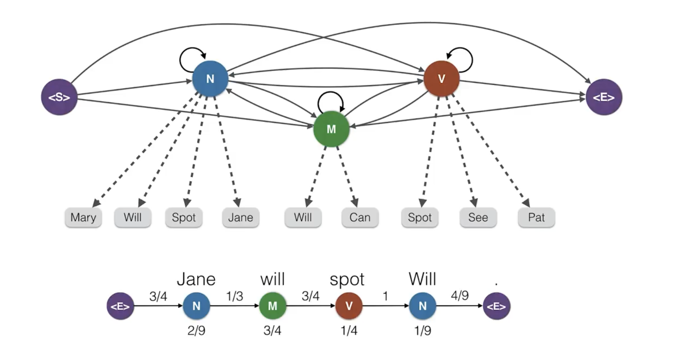

# C-4: Bayesian Networks and Inference Methods


1. Bayesian Network Architecture

    - Parameter Calculation and Storage
    - D-Separation and Information Flow
    - Markov Blanket and Local Dependencies
    - Network Construction Methods
    - Parameter Estimation from Data

2. Inference in Bayesian Networks
    - Exact vs. Approximate Inference
    
    - Variable Elimination Algorithm
    
    - Sampling-Based Methods
    
    - Inference Types and Queries
    
    - Computational Complexity Challenges
    
      
    

#### Bayesian Network Architecture

##### Parameter Calculation and Storage

Bayesian networks achieve their remarkable efficiency by factoring joint probability distributions according to conditional independence relationships. This factorization directly affects how we calculate and store the parameters of the network.

For a Bayesian network with n variables, each parameter represents a conditional probability value. The total number of parameters depends on the network structure and the cardinality (number of possible values) of each variable. For a node with k possible values and parents with a combined total of j possible configurations, we need k-1 parameters for each parent configuration, resulting in j(k-1) parameters for that node.

The formula for calculating the number of parameters for a node X is:

$$\text{Parameters for node } X = (|X| - 1) \times \prod_{Y \in \text{Parents}(X)} |Y|$$

Where |X| represents the number of possible values (states) of X.

Let's understand this with an example. Consider a simple weather model with three binary nodes (each having two states: True/False):

- Cloudy (C)
- Rain (R, depends on Cloudy)
- WetGrass (W, depends on Rain)

For the Cloudy node (a root node with no parents), we need |C|-1 = 2-1 = 1 parameter (just P(C=True), as P(C=False) = 1-P(C=True)).

For the Rain node (with Cloudy as parent), we need (|R|-1) × |C| = 1 × 2 = 2 parameters: P(R=True|C=True) and P(R=True|C=False).

For the WetGrass node (with Rain as parent), we need (|W|-1) × |R| = 1 × 2 = 2 parameters: P(W=True|R=True) and P(W=True|R=False).

In total, this simple network requires 1 + 2 + 2 = 5 parameters, much fewer than the 2³-1 = 7 parameters needed to specify the full joint distribution directly.

This efficiency becomes even more dramatic in larger networks. For instance, a network with 20 binary variables where each has at most 3 parents would require at most 20 × 2³ = 160 parameters, compared to 2²⁰-1 ≈ 1 million parameters for the full joint distribution.

Parameters are typically stored in Conditional Probability Tables (CPTs) or, for continuous variables, as parametric distributions (like Gaussians). Modern implementations may use various compact representations for CPTs, such as:

1. Tree-structured CPTs that exploit context-specific independence
2. Rule-based representations that combine similar parameter values
3. Noisy-OR/Noisy-AND models for large parent sets
4. Algebraic Decision Diagrams (ADDs) for efficient storage and manipulation

These compact representations not only save memory but can also accelerate inference algorithms by exploiting the regularities in the probability distributions.

A Bayesian Network (Bayes Net) is a probabilistic graphical model that represents variables and their conditional dependencies using a directed acyclic graph (DAG). This powerful framework allows us to model complex relationships and reason under uncertainty.

###### Components of a Bayes Net

A Bayesian Network consists of:

1. Random variables (In the example: S for Sunny, R for Raise, H for Happiness)
2. Conditional independence relationships (represented by the graph structure)
3. Probability distributions (prior and conditional probabilities)

The graph structure shows S and R as parent nodes to H, indicating that happiness is directly influenced by both weather conditions and receiving a raise. S and R are not connected, implying they are independent. However, they become conditionally dependent when we observe H (a phenomenon known as the "explaining away" effect).

###### Probability Distributions in Bayes Nets

Bayesian Networks require two types of probability specifications:

- Prior probabilities for root nodes (nodes without parents): P(S), P(R)
- Conditional probabilities for child nodes: P(H|S,R), P(H|¬S,R), P(H|S,¬R), P(H|¬S,¬R)

These probabilities allow us to perform various types of inference, such as calculating P(R|H,S) or P(R|H,¬S), which represent the probability of receiving a raise given happiness and weather conditions.

###### Explaining Away Phenomenon

The "explaining away" effect is demonstrated by the difference between P(R|H,S) and P(R|H,¬S). The probability of a raise is higher when someone is happy on a non-sunny day (8.33%) compared to a sunny day (1.42%). This occurs because when it's not sunny, a raise better explains the observed happiness since good weather isn't available as an explanation.

###### Calculating Parameters in Bayesian Networks

The number of parameters needed to define a node's conditional probability distribution follows this formula:

$$\text{Parameters} = (|S| - 1) \times \prod_i |P_i|$$

Where:

- |S| = Number of states for the node
- |Pᵢ| = Number of states for the i-th parent
- ∏ᵢ = Product over all parents

In simpler terms:

$$\text{Parameters} = (\text{Number of states} - 1) \times (\text{Product of parent states})$$

###### Understanding the Parameter Formula

Let's break down why this formula works:

1. **(Number of states - 1)**: For any node with n states, we only need to specify n-1 probabilities because the last one can be calculated (probabilities must sum to 1).

   For example, with a "Weather" node having states [Sunny, Rainy, Cloudy]:

   - If P(Sunny) = 0.6 and P(Rainy) = 0.3
   - Then P(Cloudy) = 1 - 0.6 - 0.3 = 0.1

2. **(Product of parent states)**: We need different probability distributions for each possible combination of parent states.

   For a node with two parents:

   - Weather: [Sunny, Rainy] (2 states)
   - Temperature: [Hot, Cold] (2 states)

   This creates 2 × 2 = 4 different contexts for which we need probability distributions.

###### Example: Ice Cream Sales Network

Consider a Bayesian network about ice cream sales:

1. "Weather" (Parent 1): [Sunny, Rainy, Cloudy] (3 states)
2. "Temperature" (Parent 2): [Hot, Cold] (2 states)
3. "Ice Cream Sales" (Child node): [High, Medium, Low] (3 states)

To calculate parameters needed for "Ice Cream Sales":

- Number of states - 1 = 3 - 1 = 2 parameters per combination
- Product of parent states = 3 (Weather states) × 2 (Temperature states) = 6 combinations
- Total parameters = 2 × 6 = 12 parameters

For each combination of Weather and Temperature (6 combinations):

- Sunny & Hot
- Sunny & Cold
- Rainy & Hot
- Rainy & Cold
- Cloudy & Hot
- Cloudy & Cold

We need to specify probabilities for 2 of the 3 states (High, Medium) for each combination. The third state (Low) can be calculated since probabilities must sum to 1.

For example, given Sunny & Hot:

- P(Sales=High | Sunny, Hot) = 0.7
- P(Sales=Medium | Sunny, Hot) = 0.2
- P(Sales=Low | Sunny, Hot) = 0.1 (calculated: 1 - 0.7 - 0.2)

###### Common Cases in Parameter Calculation

1. Root nodes (no parents):
   - Only need (states - 1) parameters
   - Single state root nodes need 0 parameters
2. Binary nodes (2 states):
   - Need 1 parameter per parent combination
   - Common in real-world applications
3. Multiple parents:
   - Parameters grow exponentially with parent count
   - Demonstrates why efficient network structure matters

This parameter counting method ensures we capture all necessary probabilities while avoiding redundancy, making Bayesian Networks both expressive and computationally manageable for representing complex probabilistic relationships.

###### Required probability values to specify this Bayes Network

In Bayesian networks, we need to specify probability distributions for each node. Let's analyze how many parameters are needed for different network structures.

###### First Network Example

The first network has this structure:


Each node is labeled with its number of states in parentheses (e.g., A(1) means node A has 1 state).

Let's calculate the required parameters for each node:

1. **Node A (1 state, root node)**:
   - Formula: states - 1
   - Calculation: 1 - 1 = 0 parameters
2. **Nodes B, C, D (each 2 states, parent A has 1 state)**:
   - Formula: (states - 1) × parent states
   - For each node: (2 - 1) × 1 = 1 parameter
   - Total for these nodes: 3 × 1 = 3 parameters
3. **Node E (2 states, parent B has 2 states)**:
   - Formula: (states - 1) × parent states
   - Calculation: (2 - 1) × 2 = 2 parameters
4. **Node F (4 states, parents C and D each have 2 states)**:
   - Formula: (states - 1) × (product of parent states)
   - Calculation: (4 - 1) × (2 × 2) = 3 × 4 = 12 parameters

Total parameters for the first network:

- Root Node: 0
- Nodes B, C, D: 3
- Node E: 2
- Node F: 12
- Total: 0 + 3 + 2 + 12 = 17 parameters

This calculation shows that 17 parameters are needed to fully specify this network, with each node's parameter count determined by its states and its parents' states.

###### Second Network Example

The second network has this structure:


Let's calculate the required parameters:

1. **Nodes A, B, C (each 1 state, root nodes)**:
   - Formula: states - 1
   - Calculation: 1 - 1 = 0 parameters each
   - Total for root nodes: 0 parameters
2. **Node D (2 states, parents A, B, C each with 1 state)**:
   - Formula: (states - 1) × (product of parent states)
   - Calculation: (2 - 1) × (1 × 1 × 1) = 1 parameter
3. **Nodes E and F (each 2 states, parent D has 2 states)**:
   - Formula: (states - 1) × parent states
   - For each node: (2 - 1) × 2 = 2 parameters
   - Total for nodes E and F: 2 × 2 = 4 parameters
4. **Node G (4 states, parents D(2) and C(1))**:
   - Formula: (states - 1) × (product of parent states)
   - Calculation: (4 - 1) × (2 × 1) = 3 × 2 = 6 parameters

Total parameters for the second network:

- Root Nodes (A, B, C): 0
- Node D: 1
- Nodes E and F: 4
- Node G: 6
- Total: 0 + 1 + 4 + 6 = 11 parameters

Wait, there seems to be a discrepancy in the original calculation for Node G. Let me double-check:

- Node G has 4 states (4-1 = 3 parameters needed per parent combination)
- Parents are D(2) and C(1), giving 2×1 = 2 parent combinations
- Total parameters for G: 3×2 = 6 (not 14 as shown in the original)

The correct total for the second network should be 11 parameters, not 19 as originally calculated.

###### Understanding the Parameter Calculation

The formula (states - 1) × (product of parent states) works because:

1. For any node with n states, we only need n-1 probabilities (the last one can be calculated since they sum to 1)
2. We need a different set of probabilities for each possible combination of parent states
3. The number of combinations is the product of the number of states each parent can take

This parameter counting method ensures we capture all necessary probabilities while maintaining computational efficiency by avoiding redundancy.

###### Car Start Failure Analysis

Bayesian networks provide a powerful framework for modeling complex systems with multiple interacting components. This example examines how various car components can affect whether a car starts properly.

###### Network Visualization


In this diagram:

- Nodes are labeled with their names and number of states
- Root nodes (initial causes) appear in light blue
- Intermediate nodes (system states) appear in light orange
- The target node (car won't start) appears in light red
- Arrows indicate causal relationships between components

###### Network Structure Description

This Bayesian network models various factors that can cause a car not to start, organized in a hierarchical structure:

1. Battery System Chain:

   - Battery Age

      (1 state) influences:

     - Battery Dead

        (2 states), which affects:

       - **Battery Meter** (2 states) → controls **Lights** (2 states)
       - **Battery Flat** (4 states) → influences multiple indicators

2. Charging System Chain:

   - Alternator Broken

      (1 state) and 

     Fan Belt Broken

      (1 state) both affect:

     - **Not Charging** (4 states) → leads to **Battery Flat**

3. Indicator Systems:

   - Battery Flat

      influences multiple indicators:

     - **Lights** (2 states)
     - **Oil Light** (4 states)
     - **Gas Gauge** (4 states)

4. Direct Failure Causes: Multiple components directly affect **Car Won't Start** (16 states):

   - **Battery Flat** (4 states)
   - **No Oil** (1 state)
   - **No Gas** (1 state)
   - **Fuel Line Broken** (1 state)
   - **Starter Broken** (1 state)
   - **Dip Stick** (1 state)

The network effectively models how different car components interact and how their failures propagate through the system to ultimately cause the car not to start, while also including observable symptoms that can help in diagnosis.

###### Parameter Calculation Analysis

When working with Bayesian networks, we need to determine how many parameters are required to specify the model. A common mistake is to use a naive approach that ignores the network structure.

The naive join approach incorrectly assumes we need to consider every possible combination of every state of every node:

For a network with 16 nodes, a naive calculation might suggest 2¹⁶ - 1 = 65,535 combinations.

This approach is incorrect because:

1. It treats every node as binary (2 states) when many nodes have 1, 4, or 16 states
2. It ignores the network structure and dependencies
3. It calculates ALL possible combinations rather than just the necessary conditional probabilities
4. It doesn't follow the Bayesian network parameter formula: (States-1) × (Product of parent states)

###### Correct Parameter Calculation

The proper way to calculate parameters is to use the formula for each node:

**Parameters = (States-1) × (Product of parent states)**

Let's apply this node by node:

1. Root Nodes (all 1 state): All have (1-1) = 0 parameters each
   - Battery Age (1): 0
   - Alternator Broken (1): 0
   - Fan Belt Broken (1): 0
   - Starter Broken (1): 0
   - Fuel Line Broken (1): 0
   - Dip Stick (1): 0
   - No Oil (1): 0
   - No Gas (1): 0 Total: 0
2. Battery Chain:
   - Battery Dead (2 states, parent: Battery Age[1]): (2-1) × 1 = 1
   - Battery Meter (2 states, parent: Battery Dead[2]): (2-1) × 2 = 2
3. Charging Chain:
   - Not Charging (4 states, parents: Alternator[1], Fan Belt[1]): (4-1) × (1 × 1) = 3
   - Battery Flat (4 states, parents: Battery Dead[2], Not Charging[4]): (4-1) × (2 × 4) = 3 × 8 = 24
4. Indicator Nodes:
   - Lights (2 states, parents: Battery Meter[2], Battery Flat[4]): (2-1) × (2 × 4) = 8
   - Oil Light (4 states, parent: Battery Flat[4]): (4-1) × 4 = 12
   - Gas Gauge (4 states, parent: Battery Flat[4]): (4-1) × 4 = 12
5. Target Node:
   - Car Won't Start (16 states, parents: Battery Flat[4], No Oil[1], No Gas[1], Fuel Line[1], Starter[1], Dip Stick[1]): (16-1) × (4 × 1 × 1 × 1 × 1 × 1) = 15 × 4 = 60

Adding all parameters: 0 + 1 + 2 + 3 + 24 + 8 + 12 + 12 + 60 = 122 parameters

This calculation shows that the Bayesian network approach is much more efficient than a naive joint probability distribution would be. While 122 parameters might still seem like a lot, it's vastly fewer than the 65,535 that a naive approach would suggest.

The efficiency comes from the network structure capturing the conditional independence relationships between variables, allowing us to factorize the joint distribution into smaller conditional probabilities that require fewer parameters to specify.

##### D-Separation and Information Flow

D-separation (directional separation) is a fundamental concept in Bayesian networks that determines whether variables are conditionally independent given observed evidence. It provides a graphical criterion for reading independence relationships directly from the network structure, without performing numerical calculations.

The core insight of d-separation is that information flows through a Bayesian network in specific patterns, and this flow can be blocked under certain conditions. Understanding these patterns helps us reason about independence relationships and design efficient inference algorithms.

There are three basic connection patterns in Bayesian networks:

1. **Serial Connection (Chain)**: X → Y → Z
   - Information flows through Y if Y is not observed
   - If Y is observed, X and Z become conditionally independent
   - Example: Disease → Symptom → Treatment
   - If we know the symptom (Y), then knowledge about the disease (X) doesn't provide additional information about the treatment (Z)
2. **Diverging Connection (Fork)**: X ← Y → Z
   - Information flows through Y if Y is not observed
   - If Y is observed, X and Z become conditionally independent
   - Example: Fever ← Infection → Rash
   - If we know about the infection (Y), then information about fever (X) doesn't change our beliefs about rash (Z)
3. **Converging Connection (V-structure)**: X → Y ← Z
   - Information is blocked if Y and all Y's descendants are not observed
   - Information flows if Y or any of Y's descendants are observed
   - Example: Rain → WetGrass ← Sprinkler
   - If we observe wet grass (Y), then rain (X) and sprinkler (Z) become dependent

Using these patterns, we can determine if two variables A and B are d-separated by a set of observed variables Z by checking all paths between A and B. If every path is blocked (according to the rules above), then A and B are d-separated given Z, which means they are conditionally independent given Z.


This has important practical implications:

- It tells us which variables need to be considered during inference
- It identifies irrelevant variables that can be safely ignored
- It guides the design of inference algorithms by revealing the flow of information
- It helps validate the structure of Bayesian networks against domain knowledge

For a more complex example, consider the classic "Asia" network used in medical diagnosis. Here, determining whether symptoms like Dyspnea and X-ray results are d-separated given knowledge of lung cancer can guide which variables need to be included in the diagnostic reasoning process.

D-separation is a formal criterion used in Bayesian networks to determine when variables are conditionally independent given a set of observed variables. This concept is essential for understanding how information flows through a probabilistic graphical model and has important implications for inference algorithms.

###### Fundamental Connection Types

There are three basic patterns of connections in Bayesian networks that determine whether information can flow between variables:

1. **Serial Connection (Chain)**: A → B → C

   When variables form a chain, information flows through the middle variable unless we observe it:

   - If B is observed: A and C are D-separated (conditionally independent)
   - If B is not observed: A and C are D-connected (dependent)

   Example: Battery Dead → Lights Dim → Visibility Poor

   If we know the lights are dim (B), then learning about the battery status (A) doesn't give us any additional information about visibility (C). The information flow is blocked by our observation of B.

2. **Diverging Connection (Common Cause)**:

   ```
     B
    ↙ ↘
   A   C
   ```

   When a parent influences multiple children, the children become dependent unless we observe their common parent:

   - If B is observed: A and C are D-separated
   - If B is not observed: A and C are D-connected

   Example: Battery Dead → Lights Off, Battery Dead → Radio Off

   If we know the battery is dead (B), then observing the lights are off (A) doesn't tell us anything new about the radio (C) – they're independent given B.

3. **Converging Connection (V-structure)**:

   ```
   A   C
    ↘ ↙
     B
   ```

   In a V-structure, parents are independent unless we observe their common child or any of the child's descendants:

   - If B or any of B's descendants are observed: A and C are D-connected
   - If B and its descendants are not observed: A and C are D-separated

   Example: Battery Dead → Car Won't Start ← Out of Gas

   If we observe the car won't start (B), then learning the battery is dead (A) gives us information about whether we're out of gas (C) – specifically, it makes it less likely we're out of gas since we already have an explanation for the car not starting.

###### D-separation Rules

Two variables X and Y are D-separated by a set of variables Z if and only if:

1. All paths between X and Y are blocked given Z
2. A path is blocked if it contains:
   - A serial or diverging connection where the middle node is in Z (observed)
   - A converging connection where neither the middle node nor any of its descendants are in Z

Variables that are not D-separated are D-connected, meaning information can flow between them even when conditioning on Z.

###### Practical Application: Tree Structure

Let's analyze D-separation in a simple tree structure:

```
A
├── B
│   └── C
└── D
    └── E
```

1. **C ⊥ A (No)** - Not D-separated
   - Path: C ← B ← A
   - This is a serial connection (chain)
   - B is not observed
   - Information can flow from A to C through B
   - Result: C and A are dependent
2. **C ⊥ A|B (Yes)** - D-separated
   - Path: C ← B ← A
   - B is observed (given in the condition)
   - B blocks the path between A and C when observed
   - Result: C and A are conditionally independent given B
3. **C ⊥ D (No)** - Not D-separated
   - Path: C ← B ← A → D
   - This is a diverging connection at A
   - A is not observed
   - Information can flow from C to D through their common ancestor A
   - Result: C and D are dependent
4. **C ⊥ D|A (Yes)** - D-separated
   - Path: C ← B ← A → D
   - A is observed (given in the condition)
   - A blocks the path when observed in a diverging connection
   - Result: C and D are conditionally independent given A
5. **E ⊥ C|D (Yes)** - D-separated
   - Path: E ← D ← A → B → C
   - This path contains both diverging (at A) and serial (through B) connections
   - D is observed (given in the condition)
   - D blocks the path in the serial connection
   - Result: E and C are conditionally independent given D

###### V-Structure Analysis

V-structures have particularly interesting properties. Let's examine a classic V-structure with extensions:

```
   A   B
    \ /
     C
    / \
   D   E
```

1. **A ⊥ E (No)** - Not D-separated
   - Path: A → C → E
   - This is a serial connection through C
   - C is not observed
   - Information can flow from A to E through C
   - Result: A and E are dependent
2. **A ⊥ E|B (No)** - Not D-separated
   - Path: A → C → E
   - B is observed but not on the path between A and E
   - C is still not observed
   - Information can still flow from A to E through C
   - Result: A and E remain dependent even when conditioning on B
3. **A ⊥ E|C (Yes)** - D-separated
   - Path: A → C → E
   - C is observed (given in the condition)
   - C blocks the path when observed in a serial connection
   - Result: A and E are conditionally independent given C
4. **A ⊥ B (Yes)** - D-separated
   - Path: A → C ← B
   - This is a converging connection (V-structure) at C
   - C is not observed
   - In a V-structure, parents are independent when the child is not observed
   - Result: A and B are independent (when C is not observed)
5. **A ⊥ B|C (No)** - Not D-separated
   - Path: A → C ← B
   - This is a converging connection at C
   - C is observed (given in the condition)
   - In a V-structure, observing the child activates a dependency between the parents
   - Result: A and B are dependent given C

Note: This is the opposite behavior from serial and diverging connections. In V-structures, observing the common child creates a dependency between the parents that wasn't there before.

###### Complex Network Analysis

Let's analyze a more complex network with multiple paths:

```
A   C     F
 \ /      |
  B       E
   \     /
    D   /
     \ /
      G
      ↑
      H
```

1. **F ⊥ A (No)** - Not D-separated
   - Possible paths:
     - F → E → G ← D ← B ← A
     - F → E → G ← H
   - Multiple paths exist between F and A
   - Contains both serial connections and V-structures
   - Neither D nor G (the intermediate nodes) are observed
   - Information can flow through the path F → E → G ← D ← B ← A
   - Result: F and A are dependent
2. **F ⊥ A|D (Yes)** - D-separated
   - Paths to consider:
     - F → E → G ← D ← B ← A
     - F → E → G ← H
   - D is observed (given in the condition)
   - D blocks the path in the serial connection
   - The path through H is still blocked at G (converging connection without G being observed)
   - Result: F and A are conditionally independent given D
3. **F ⊥ A|G (No)** - Not D-separated
   - Paths to consider:
     - F → E → G ← D ← B ← A
     - F → E → G ← H
   - G is observed (given in the condition)
   - G is a converging node (V-structure)
   - When G is observed, it activates the path between its parents (D and E)
   - This creates an active path between F and A
   - Result: F and A are dependent given G
4. **F ⊥ A|H (No)** - Not D-separated
   - Paths to consider:
     - F → E → G ← D ← B ← A
     - F → E → G ← H
   - H is observed (given in the condition)
   - H is a parent of G (converging node)
   - Observing H doesn't block the path F → E → G ← D ← B ← A
   - The path remains active through the other route
   - Result: F and A are dependent given H

###### Practical Significance of D-separation

Understanding D-separation has several important applications:

1. **Efficient Inference**: By identifying conditionally independent variables, we can simplify probability calculations and reduce computational complexity.
2. **Knowledge Engineering**: When building Bayesian networks, D-separation helps ensure the structure correctly captures the independence relationships in the domain.
3. **Structure Learning**: Algorithms for learning network structure from data often use D-separation as a criterion to evaluate candidate structures.
4. **Causal Reasoning**: D-separation is closely related to causal inference, helping distinguish between correlation and causation in complex systems.

The key insight is that D-separation provides a graphical criterion for identifying conditional independence without having to perform probabilistic calculations. By examining the network structure and the set of observed variables, we can determine which variables will influence each other and which ones can be safely ignored during inference.

##### Markov Blanket and Local Dependencies

The Markov blanket of a node in a Bayesian network defines a boundary within which all the information relevant to that node is contained. Specifically, the Markov blanket of a node X consists of:

1. Its parents
2. Its children
3. The other parents of its children (co-parents)

The Markov blanket has a crucial property: a node is conditionally independent of all other nodes in the network given its Markov blanket. Mathematically, if MB(X) is the Markov blanket of X, then:

$$P(X | \text{MB}(X), Y) = P(X | \text{MB}(X))$$

for any variable Y not in the Markov blanket.

This property has profound implications for both inference and learning:

1. For inference, it means we only need to consider the Markov blanket when calculating probabilities for a node, not the entire network. This locality principle enables efficient algorithms that focus computation on relevant parts of the network.
2. For learning, it means we can learn parameters for each node by looking only at its Markov blanket, allowing for distributed learning algorithms.
3. For feature selection in machine learning, identifying the Markov blanket of a target variable provides the minimal set of features needed for optimal prediction.

Let's illustrate with an example from a medical diagnosis network:


The Markov blanket of Cancer (C) consists of:

- Parents: Age (A) and Smoking (S)
- Children: X-ray Result (X) and Dyspnea (D)
- Co-parents: Lung Disease (L), which is also a parent of Dyspnea

Given this Markov blanket, Cancer is conditionally independent of Pollution. This makes intuitive sense: if we already know whether the patient has lung disease, then information about pollution levels doesn't provide additional information about cancer probability.

The Markov blanket concept helps us understand the local structure of dependencies in Bayesian networks and is fundamental to many inference and learning algorithms.

##### Network Construction Methods

Building a Bayesian network involves two main challenges: determining the structure (which variables directly influence which others) and estimating the parameters (the conditional probabilities). There are several approaches to network construction:

1. **Expert-Driven Construction**: This approach relies on domain experts to specify the network structure based on causal relationships in the domain. Experts identify relevant variables, determine direct dependencies, and often provide initial estimates of probabilities.

   Advantages:

   - Incorporates expert knowledge that might not be present in data
   - Can build networks even with limited data
   - The resulting network is often interpretable and matches causal understanding

   Disadvantages:

   - Experts may disagree or have incomplete knowledge
   - Time-consuming and expensive for large networks
   - May incorporate subjective biases

2. **Data-Driven Construction**: This approach uses machine learning algorithms to learn both structure and parameters from data. Two main categories of algorithms exist:

   a) **Constraint-based algorithms** (like PC, FCI):

   - Test for conditional independence relationships in the data
   - Use these tests to constrain the possible network structures
   - Usually faster but sensitive to errors in independence tests

   b) **Score-based algorithms** (like K2, greedy search, genetic algorithms):

   - Define a scoring function that measures how well a structure fits the data
   - Search the space of possible structures for the one with the best score
   - Can find better structures but more computationally intensive

   Advantages of data-driven approaches:

   - Automatically discover relationships that might not be obvious to experts
   - Objectively represent patterns in the data
   - Can adapt as new data becomes available

   Disadvantages:

   - Require large amounts of data for reliable learning
   - May find correlations rather than causal relationships
   - Computationally expensive for large networks (the space of possible structures grows super-exponentially)

3. **Hybrid Methods**: These combine expert knowledge with data-driven learning:

   - Experts provide constraints or prior knowledge to guide structural learning
   - Learning algorithms work within these constraints to find the best structure
   - Parameters are typically estimated from data, possibly with expert priors

   This approach often provides the best balance between incorporating domain knowledge and adapting to patterns in data.

4. **Template-Based Methods**: For domains with repeated structure (like time series or multiple similar entities), template-based methods define a generic structure that is instantiated multiple times:

   - Dynamic Bayesian Networks (DBNs) for temporal processes
   - Object-Oriented Bayesian Networks (OOBNs) for systems with multiple similar components
   - Plate notation for representing repeated structure

   These approaches allow compact representation of complex networks and efficient inference algorithms that exploit the repeated structure.

In practice, the choice of construction method depends on the availability of domain experts, the amount and quality of data, the purpose of the network (prediction, explanation, decision support), and computational constraints.

##### Parameter Estimation from Data

Once the network structure is established, we need to estimate the parameters—the conditional probability distributions for each node given its parents. Several methods are available, with the choice depending on data availability, prior knowledge, and computational constraints.

1. **Maximum Likelihood Estimation (MLE)**: The simplest approach is to estimate probabilities directly from frequency counts in the data. For a discrete variable X with parents Pa(X), the maximum likelihood estimate is:

   $$P(X = x | \text{Pa}(X) = \text{pa}) = \frac{N(X = x, \text{Pa}(X) = \text{pa})}{N(\text{Pa}(X) = \text{pa})}$$

   Where N(·) counts the number of instances in the data.

   For example, if in our medical data, 80 out of 100 smokers developed lung disease, the MLE would be P(LungDisease=True|Smoking=True) = 80/100 = 0.8.

   While simple, MLE has a significant drawback: it assigns zero probability to events not seen in the training data, which can cause problems during inference.

2. **Bayesian Parameter Estimation**: This approach incorporates prior knowledge about parameters and updates it with observed data. For discrete variables, we typically use Dirichlet priors, which lead to simple posterior calculations:

   $$P(X = x | \text{Pa}(X) = \text{pa}) = \frac{N(X = x, \text{Pa}(X) = \text{pa}) + \alpha_{x,\text{pa}}}{N(\text{Pa}(X) = \text{pa}) + \sum_{x'} \alpha_{x',\text{pa}}}$$

   Where αₓ,ₚₐ are the pseudo-counts from the prior.

   For example, if we have a prior belief that the probability of lung disease given smoking is around 0.7 with a confidence equivalent to 10 observations, we might set αTrue,True = 7 and αFalse,True = 3. If we then observe 80 smokers with lung disease and 20 without, the Bayesian estimate would be:

   $$P(\text{LungDisease=True}|\text{Smoking=True}) = \frac{80 + 7}{100 + 10} = \frac{87}{110} \approx 0.79$$

   This approach addresses the zero-probability problem and allows incorporation of prior knowledge.

3. **Expectation-Maximization (EM)**: When data has missing values or hidden variables (nodes that are never observed), MLE and simple Bayesian estimation aren't directly applicable. The EM algorithm iteratively:

   - E-step: Estimates the distribution of the missing/hidden variables given current parameters
   - M-step: Updates parameters using these estimated distributions as if they were observed

   EM is widely used for learning parameters in networks with latent variables, like hidden Markov models or mixture models.

4. **Regularization Techniques**: To prevent overfitting, especially with limited data, various regularization methods can be applied:

   - Laplace (add-one) smoothing: Adds pseudo-counts to all combinations
   - Parameter tying: Forces certain parameters to be identical
   - Shrinkage estimators: Pull estimates toward a prior or a simpler model

   These methods help when data is sparse or noisy.

5. **Learning from Incomplete Data**: Real-world datasets often have missing values. Approaches include:

   - Complete-case analysis: Use only complete records (wasteful)
   - Available-case analysis: Use all available data for each parameter
   - Data imputation: Fill in missing values before parameter estimation
   - Model-based methods: Treat missing values as hidden variables and use EM

   The best approach depends on the pattern of missingness (MCAR, MAR, MNAR).

The quality of parameter estimates directly affects inference accuracy. When possible, it's good practice to:

- Use large, representative datasets
- Perform sensitivity analysis to understand how parameter uncertainty affects conclusions
- Update parameters as new data becomes available
- Validate the learned parameters against domain knowledge

For continuous variables, parametric forms like Gaussian distributions are often used, with parameters (mean, variance) estimated using methods analogous to those described above.

#### Inference in Bayesian Networks

Inference in Bayesian networks is the process of answering probabilistic queries about variables within the network given evidence. It's one of the most important features of Bayesian networks as it allows us to use these models to reason under uncertainty by updating our beliefs based on new evidence.

At its core, inference in Bayesian networks involves calculating the posterior probability distribution of one or more variables given observed values for other variables in the network. This can be formally expressed as computing P(Y|E=e), where Y represents the query variables and E=e represents the evidence.

##### Exact vs. Approximate Inference

Exact inference methods calculate the precise probabilities for the queries of interest, while approximate methods provide estimations that trade-off some accuracy for computational efficiency. The choice between these approaches depends on the network structure, size, and the specific requirements of the application.

**Exact Inference**

Exact inference methods provide mathematically precise answers to probability queries. These methods are guaranteed to give the correct probability values, but may become computationally intractable for large or densely connected networks.

Key exact inference techniques include:

1. **Enumeration**: The most straightforward but least efficient approach. It explicitly calculates joint probabilities by summing over all possible configurations of hidden variables.
2. **Variable Elimination**: A more efficient algorithm that systematically eliminates variables not in the query or evidence by marginalizing them out one by one.
3. **Junction Tree Algorithm**: Transforms the Bayesian network into a tree structure called a junction tree, where standard tree-based inference algorithms can be applied.

For example, in a simple query to find P(B|A=true) in a small network, exact inference would compute:

$$P(B|A=true) = \frac{P(B, A=true)}{P(A=true)} = \frac{\sum_{C} P(A=true, B, C)}{\sum_{B,C} P(A=true, B, C)}$$

Where the summation extends over all possible values of the hidden variables.

**Approximate Inference**

When exact inference is computationally prohibitive, approximate methods provide estimates of the desired probabilities. These methods are especially useful for large networks or time-sensitive applications.

Major approximate inference approaches include:

1. **Sampling Methods**: Generate random samples from the network's distribution and use these samples to estimate probabilities. Examples include:
   - Direct sampling (prior sampling)
   - Rejection sampling
   - Likelihood weighting
   - Gibbs sampling (MCMC)
2. **Variational Methods**: Approximate complex probability distributions with simpler ones that are easier to compute.
3. **Loopy Belief Propagation**: Apply message-passing algorithms to networks with loops, though convergence is not guaranteed.

<div align="center">  <p style="color: #555;">Figure: The classic Alarm Bayesian Network used for demonstrating inference techniques. The network models relationships between a possible burglary, earthquake, alarm system, and neighboring responses.</p> </div>

The tradeoff between exact and approximate inference is clear: exact methods provide precise answers but may be computationally infeasible for complex networks, while approximate methods scale better but introduce some error into the results.

##### Variable Elimination Algorithm

Variable elimination is one of the most fundamental exact inference algorithms for Bayesian networks. It efficiently computes conditional probabilities by eliminating variables through marginalization, one at a time.

**Core Concept**

The key insight of variable elimination is to reorganize the computation of joint probabilities to avoid redundant calculations. Rather than naively computing the full joint probability distribution, it calculates factors (local probability distributions) and progressively eliminates (marginalizes out) variables that are not part of the query or evidence.

**Algorithm Steps**

1. **Express the joint probability** using the chain rule factorization based on the Bayesian network structure.
2. **Restrict factors** according to the evidence (observed variables).
3. **Choose a variable elimination ordering** (this choice affects efficiency).
4. For each non-query, non-evidence variable:
   - **Identify all factors** containing the variable to be eliminated.
   - **Multiply these factors** to create a new factor.
   - **Sum out (marginalize)** the variable from this new factor.
   - **Replace the original factors** with this new marginalized factor.
5. **Multiply remaining factors** and normalize to obtain the final conditional probability.

**Example Calculation**

Let's consider a simple Rain-Traffic-Late network where we want to compute P(L|R=true), that is, the probability of being late given that it's raining:


Given:

- P(R=true) = 0.1, P(R=false) = 0.9
- P(T=heavy|R=true) = 0.8, P(T=light|R=true) = 0.2
- P(T=heavy|R=false) = 0.1, P(T=light|R=false) = 0.9
- P(L=true|T=heavy) = 0.3, P(L=false|T=heavy) = 0.7
- P(L=true|T=light) = 0.1, P(L=false|T=light) = 0.9

To compute P(L|R=true), variable elimination would:

1. Start with the factorization: P(R,T,L) = P(R) × P(T|R) × P(L|T)
2. Restrict factors for R=true: P(T|R=true) × P(L|T)
3. Eliminate variable T by summing it out: $$P(L|R=true) = \sum_T P(T|R=true) \times P(L|T)$$

Let's calculate this for L=true:

- P(L=true|R=true) = P(T=heavy|R=true) × P(L=true|T=heavy) + P(T=light|R=true) × P(L=true|T=light)
- P(L=true|R=true) = 0.8 × 0.3 + 0.2 × 0.1 = 0.24 + 0.02 = 0.26

**Factor Operations**

Two key operations in variable elimination are:

1. **Factor Product**: Combines two factors by multiplying the probabilities for compatible configurations of the variables.
2. **Factor Marginalization**: Eliminates a variable by summing over all its possible values.

**Elimination Ordering**

The order in which variables are eliminated can dramatically affect computational efficiency. Finding the optimal elimination ordering is NP-hard, but several heuristics exist:

- Min-neighbors: Eliminate the variable connected to the fewest other variables
- Min-fill: Eliminate the variable that adds the fewest edges to the graph when removed
- Weighted min-fill: Consider both the number of new edges and the domain sizes of variables

**Advantages and Limitations**

Advantages:

- More efficient than naive enumeration
- Provides exact probabilities
- Works well for tree-structured networks or networks with low treewidth

Limitations:

- Still exponential in the worst case
- Performance highly dependent on network structure and elimination ordering
- Can be impractical for densely connected networks

Variable elimination forms the backbone of many more sophisticated exact inference algorithms and is a fundamental technique in probabilistic reasoning.

##### Sampling-Based Methods

When exact inference becomes computationally intractable, sampling-based methods offer practical alternatives by approximating probabilities through statistical sampling. These methods generate representative samples from the joint distribution defined by the Bayesian network and use these samples to estimate the required probabilities.

**Basic Concept**

Sampling-based methods work by generating many random instances (samples) from the distribution represented by the network. As the number of samples increases, the frequency of specific variable configurations converges to their true probabilities according to the law of large numbers.

**Common Sampling Algorithms**

1. **Prior (Direct) Sampling**

   The simplest sampling approach involves:

   - Sampling variables in topological order (parents before children)
   - Using each node's conditional probability table to sample values
   - Counting the frequency of query events in the generated samples

   For a query P(Y|E=e), the estimate is: $$P(Y|E=e) \approx \frac{\text{Count}(Y, E=e)}{\text{Count}(E=e)}$$

   However, this method is inefficient when evidence is rare, as many samples will be rejected.

2. **Rejection Sampling**

   An improvement over prior sampling that:

   - Generates samples using the same process as prior sampling
   - Discards samples inconsistent with the evidence
   - Uses only the remaining samples to estimate conditional probabilities

   While more focused than prior sampling, rejection sampling still wastes computation when evidence has low probability. For rare evidence, most samples will be rejected.

3. **Likelihood Weighting**

   A more efficient approach that:

   - Fixes evidence variables to their observed values
   - Samples only non-evidence variables
   - Weights each sample by the likelihood of the evidence
   - Uses these weighted samples to estimate probabilities

   The weight for each sample is the product of conditional probabilities of evidence variables given their parents: $$w = \prod_{i \in evidence} P(e_i | parents(X_i))$$

   Likelihood weighting ensures every sample is consistent with the evidence, making it more efficient than rejection sampling, especially with rare evidence.

4. **Gibbs Sampling**

   A Markov Chain Monte Carlo (MCMC) technique that:

   - Starts with an arbitrary assignment to non-evidence variables
   - Repeatedly resamples one variable at a time, conditioned on all others
   - Uses the frequency of variable values in the sampling chain to estimate probabilities

   Gibbs sampling performs well with complex conditional dependencies and can handle networks where other sampling methods struggle. However, it may require more samples to converge to accurate estimates, especially if variables are highly correlated.

**Example: Applying Likelihood Weighting**

Consider our Rain-Traffic-Late network again. To estimate P(L=true|R=true) using likelihood weighting:

1. Fix R=true in all samples
2. For each sample:
   - Sample Traffic (T) from P(T|R=true)
   - Sample Late (L) from P(L|T)
   - Assign weight w = 1 (since we directly fixed R to its evidence value)
3. Estimate: P(L=true|R=true) ≈ (Sum of weights for samples where L=true) / (Sum of all weights)

<div align="center">  <p style="color: #555;">Figure: Hidden Markov Model with transition and emission probabilities visualized. The graph shows states (parts of speech) at the top level and their emissions (words) at the bottom.</p> </div>

**Practical Considerations**

1. **Sample Size**: More samples generally lead to more accurate probability estimates, but with diminishing returns. The error typically decreases as 1/√n, where n is the number of samples.
2. **Convergence**: For complex networks, determining when sampling has converged to good estimates can be challenging. Convergence diagnostics can help assess whether enough samples have been collected.
3. **Sequential Importance Sampling (SIS)**: An extension of likelihood weighting that dynamically adjusts sampling to focus on regions of higher posterior probability.
4. **Combining Methods**: Hybrid approaches often perform best, such as using Gibbs sampling for some variables and likelihood weighting for others.

Sampling methods scale better than exact inference for large networks, making them invaluable for practical applications in complex domains.

##### Inference Types and Queries

Bayesian networks support various types of inference queries, each answering different questions about the domain. Understanding these query types helps in selecting appropriate inference algorithms and interpreting results correctly.

**Major Types of Inference**

1. **Causal Inference**
   - Reasoning from causes to effects (following the direction of edges)
   - Queries like: "If I take this medication, what's the probability my symptoms will improve?"
   - Example: P(Symptoms=improved | Medication=taken)
   - Relatively straightforward computation following the network structure
2. **Diagnostic Inference**
   - Reasoning from effects to causes (opposite to edge direction)
   - Queries like: "If I observe these symptoms, what's the probability the patient has disease X?"
   - Example: P(Disease=present | Symptoms=observed)
   - Uses Bayes' rule to invert the direction of reasoning
3. **Intercausal Inference**
   - Reasoning between causes of a common effect ("explaining away")
   - Queries like: "If the alarm is sounding and I know there's been a burglary, what's the probability an earthquake occurred?"
   - Example: P(Earthquake=true | Alarm=on, Burglary=true)
   - Often counter-intuitive because knowing one cause can make other causes less likely
4. **Mixed Inference**
   - Combines multiple types of reasoning
   - Queries like: "If the patient has symptom X and took medication Y, what's the probability they have disease Z and will develop symptom W?"
   - Involves both diagnostic and predictive components

**Common Query Formulations**

1. **Posterior Probability Queries**
   - Computing probability distributions over variables given evidence
   - P(Y|E=e) where Y is the query variable(s) and E=e is the evidence
   - Most basic type of query in Bayesian networks
2. **Most Likely Explanation (MLE)/Maximum a Posteriori (MAP)**
   - Finding the most probable assignment to all unobserved variables given evidence
   - argmax<sub>X</sub> P(X|E=e) where X includes all non-evidence variables
   - Used in diagnosis, fault detection, and classification tasks
3. **Maximum Likelihood Estimation (MLE)**
   - Finding the most likely assignment to a subset of variables given evidence
   - argmax<sub>Y</sub> P(Y|E=e) where Y is a subset of unobserved variables
   - More focused than MAP queries
4. **Sensitivity Analysis**
   - Evaluating how changes in model parameters affect inference results
   - Used for robustness testing and understanding model limitations

**Example: Alarm Network Queries**

Using the classic Alarm network, some example queries include:


1. Causal query: P(JohnCalls=true | Burglary=true) "If there's a burglary, will John call?"
2. Diagnostic query: P(Burglary=true | JohnCalls=true, MaryCalls=true) "If both John and Mary call, was there a burglary?"
3. Intercausal query: P(Earthquake=true | Alarm=true, Burglary=true) "If the alarm is on and there was a burglary, was there also an earthquake?"

**Inference in Temporal Models**

Special types of Bayesian networks handle time-sequential data:

1. **Filtering**: Computing the belief state (probability distribution) at the current time given all evidence up to now
   - P(X<sub>t</sub> | e<sub>1:t</sub>)
2. **Prediction**: Estimating the probability of future states given current evidence
   - P(X<sub>t+k</sub> | e<sub>1:t</sub>) for k > 0
3. **Smoothing**: Determining past states given evidence up to the present
   - P(X<sub>t-k</sub> | e<sub>1:t</sub>) for k > 0
4. **Most likely sequence**: Finding the most probable sequence of states given evidence (Viterbi algorithm)
   - argmax<sub>X<sub>1:t</sub></sub> P(X<sub>1:t</sub> | e<sub>1:t</sub>)

<div align="center">  <p style="color: #555;">Figure: A complete Hidden Markov Model showing both hidden states (parts of speech) and observations (words), with the path representing sequence inference.</p> </div>

**Advanced Query Processing**

For complex queries, inference can be optimized by:

1. **Query decomposition**: Breaking down complex queries into simpler sub-queries
2. **Relevance-based pruning**: Identifying and using only the relevant portions of the network
3. **Evidence propagation**: Efficiently updating beliefs as new evidence arrives
4. **Incremental inference**: Reusing previous computations when evidence changes slightly

Selecting the appropriate query formulation and inference algorithm depends on the specific problem, the network structure, and computational constraints. In practice, a combination of techniques often yields the best results.

##### Computational Complexity Challenges

Inference in Bayesian networks faces significant computational challenges that limit the practical application of exact methods to large or complex networks. Understanding these limitations helps in selecting appropriate inference algorithms and designing computationally tractable networks.

**Theoretical Complexity Results**

1. **Exact Inference Hardness**
   - Exact inference in general Bayesian networks is NP-hard
   - Even approximate inference to within a constant factor is NP-hard
   - The complexity depends on the network's structure, not just its size
2. **Tractable Cases**
   - Polytrees (singly connected networks): Linear time complexity
   - Networks with bounded treewidth: Exponential only in the treewidth
   - Tree-structured networks: Linear time using message passing algorithms

3. Complexity Parameters
   - n: Number of variables
   - d: Maximum domain size of any variable
   - w: Treewidth of the network (roughly, the size of the largest cluster in an optimal junction tree)
   - Worst-case time complexity for exact inference: O(n·d^(w+1))

**Bottlenecks in Exact Inference**

1. **Factor Size Explosion**
   - Variable elimination creates intermediate factors
   - These factors can grow exponentially in the number of variables they contain
   - Example: Eliminating a variable connected to k others creates a factor with at least k variables
2. **Clique Tree Construction**
   - Junction tree algorithms build cliques (fully connected subgraphs)
   - The size of the largest clique determines computational complexity
   - Finding the optimal junction tree is itself NP-hard
3. **Memory Requirements**
   - Storing conditional probability tables requires space exponential in the number of parents
   - Intermediate results in exact inference can require prohibitive amounts of memory

**Approximate Inference Challenges**

1. **Sampling Convergence**
   - Sampling methods may require many samples for convergence
   - Convergence can be especially slow with deterministic or near-deterministic relationships
2. **Evidence Rarity Problem**
   - Evidence with low prior probability is problematic for rejection sampling
   - Example: If P(E=e) = 0.001, approximately 999 out of 1000 samples will be rejected
3. **Local Optima in MCMC Methods**
   - Markov Chain Monte Carlo methods (like Gibbs sampling) can get stuck in local probability maxima
   - Mixing time (time to adequately explore the probability space) can be very long

**Optimization Strategies**

1. **Network Structure Optimization**
   - Design networks with lower treewidth when possible
   - Use d-separation to identify independence relationships
   - Limit the number of parents per node
2. **Variable Elimination Ordering**
   - Use heuristics like min-fill or min-weight to find good elimination orderings
   - Pre-compute elimination orderings for repeated queries
3. **Exploiting Local Structure**
   - Use context-specific independence
   - Employ structured representations like algebraic decision diagrams
   - Factorize large tables when possible (canonical models like noisy-OR)
4. **Approximate Inference Enhancements**
   - Adaptive importance sampling
   - Annealed importance sampling
   - Rao-Blackwellized particle filtering
   - Variational methods with richer approximating families

<div align="center">  <p style="color: #555;">Figure: Visualization of the Viterbi algorithm identifying the most likely path through a hidden Markov model, demonstrating efficient sequence inference.</p> </div>

**Case Study: Part-of-Speech Tagging Complexity**

The part-of-speech tagging problem demonstrates computational complexity challenges:

- For a sentence with n words and p possible tags per word, there are p^n possible tag sequences
- Naive evaluation would be exponential: O(p^n)
- Dynamic programming approaches like the Viterbi algorithm reduce this to O(np^2)
- This is why efficient algorithms are essential, even for moderately sized problems

**Practical Implications**

1. **Hybrid Approaches**
   - Use exact inference when possible, approximate otherwise
   - Apply exact methods to critical parts of the network
   - Use domain knowledge to simplify complex regions
2. **Online vs. Offline Inference**
   - Precompute results for common queries when possible
   - Balance accuracy requirements against time constraints for real-time applications
3. **Model Simplification**
   - Simplify models by removing weak dependencies
   - Use parameter tying to reduce the number of distinct parameters
   - Consider alternative models like Naive Bayes that sacrifice accuracy for simplicity
4. **Hardware Acceleration**
   - Parallel implementation of sampling methods
   - GPU acceleration for matrix operations
   - Specialized hardware for probabilistic inference

The computational challenges of Bayesian network inference highlight the importance of careful model design and algorithm selection. While exact inference is theoretically optimal, practical applications often require compromises between computational feasibility and inference accuracy.

#### Inference in Bayesian Networks

Inference in Bayesian networks is the process of answering probabilistic queries about variables within the network given evidence. It's one of the most important features of Bayesian networks as it allows us to use these models to reason under uncertainty by updating our beliefs based on new evidence.

At its core, inference in Bayesian networks involves calculating the posterior probability distribution of one or more variables given observed values for other variables in the network. This can be formally expressed as computing P(Y|E=e), where Y represents the query variables and E=e represents the evidence.

##### Exact vs. Approximate Inference

Exact inference methods calculate the precise probabilities for the queries of interest, while approximate methods provide estimations that trade-off some accuracy for computational efficiency. The choice between these approaches depends on the network structure, size, and the specific requirements of the application.

**Exact Inference**

Exact inference methods provide mathematically precise answers to probability queries. These methods are guaranteed to give the correct probability values, but may become computationally intractable for large or densely connected networks.

Key exact inference techniques include:

1. **Enumeration**: The most straightforward but least efficient approach. It explicitly calculates joint probabilities by summing over all possible configurations of hidden variables.
2. **Variable Elimination**: A more efficient algorithm that systematically eliminates variables not in the query or evidence by marginalizing them out one by one.
3. **Junction Tree Algorithm**: Transforms the Bayesian network into a tree structure called a junction tree, where standard tree-based inference algorithms can be applied.

For example, in a simple query to find P(B|A=true) in a small network, exact inference would compute:

$$P(B|A=true) = \frac{P(B, A=true)}{P(A=true)} = \frac{\sum_{C} P(A=true, B, C)}{\sum_{B,C} P(A=true, B, C)}$$

Where the summation extends over all possible values of the hidden variables.

**Approximate Inference**

When exact inference is computationally prohibitive, approximate methods provide estimates of the desired probabilities. These methods are especially useful for large networks or time-sensitive applications.

Major approximate inference approaches include:

1. **Sampling Methods**: Generate random samples from the network's distribution and use these samples to estimate probabilities. Examples include:
   - Direct sampling (prior sampling)
   - Rejection sampling
   - Likelihood weighting
   - Gibbs sampling (MCMC)
2. **Variational Methods**: Approximate complex probability distributions with simpler ones that are easier to compute.
3. **Loopy Belief Propagation**: Apply message-passing algorithms to networks with loops, though convergence is not guaranteed.

<div align="center">  <p style="color: #555;">Figure: The classic Alarm Bayesian Network used for demonstrating inference techniques. The network models relationships between a possible burglary, earthquake, alarm system, and neighboring responses.</p> </div>

The tradeoff between exact and approximate inference is clear: exact methods provide precise answers but may be computationally infeasible for complex networks, while approximate methods scale better but introduce some error into the results.

##### Variable Elimination Algorithm

Variable elimination is one of the most fundamental exact inference algorithms for Bayesian networks. It efficiently computes conditional probabilities by eliminating variables through marginalization, one at a time.

**Core Concept**

The key insight of variable elimination is to reorganize the computation of joint probabilities to avoid redundant calculations. Rather than naively computing the full joint probability distribution, it calculates factors (local probability distributions) and progressively eliminates (marginalizes out) variables that are not part of the query or evidence.

**Algorithm Steps**

1. **Express the joint probability** using the chain rule factorization based on the Bayesian network structure.
2. **Restrict factors** according to the evidence (observed variables).
3. **Choose a variable elimination ordering** (this choice affects efficiency).
4. For each non-query, non-evidence variable:
   - **Identify all factors** containing the variable to be eliminated.
   - **Multiply these factors** to create a new factor.
   - **Sum out (marginalize)** the variable from this new factor.
   - **Replace the original factors** with this new marginalized factor.
5. **Multiply remaining factors** and normalize to obtain the final conditional probability.

**Example Calculation**

Let's consider a simple Rain-Traffic-Late network where we want to compute P(L|R=true), that is, the probability of being late given that it's raining:


Given:

- P(R=true) = 0.1, P(R=false) = 0.9
- P(T=heavy|R=true) = 0.8, P(T=light|R=true) = 0.2
- P(T=heavy|R=false) = 0.1, P(T=light|R=false) = 0.9
- P(L=true|T=heavy) = 0.3, P(L=false|T=heavy) = 0.7
- P(L=true|T=light) = 0.1, P(L=false|T=light) = 0.9

To compute P(L|R=true), variable elimination would:

1. Start with the factorization: P(R,T,L) = P(R) × P(T|R) × P(L|T)
2. Restrict factors for R=true: P(T|R=true) × P(L|T)
3. Eliminate variable T by summing it out: $$P(L|R=true) = \sum_T P(T|R=true) \times P(L|T)$$

Let's calculate this for L=true:

- P(L=true|R=true) = P(T=heavy|R=true) × P(L=true|T=heavy) + P(T=light|R=true) × P(L=true|T=light)
- P(L=true|R=true) = 0.8 × 0.3 + 0.2 × 0.1 = 0.24 + 0.02 = 0.26

**Factor Operations**

Two key operations in variable elimination are:

1. **Factor Product**: Combines two factors by multiplying the probabilities for compatible configurations of the variables.
2. **Factor Marginalization**: Eliminates a variable by summing over all its possible values.

**Elimination Ordering**

The order in which variables are eliminated can dramatically affect computational efficiency. Finding the optimal elimination ordering is NP-hard, but several heuristics exist:

- Min-neighbors: Eliminate the variable connected to the fewest other variables
- Min-fill: Eliminate the variable that adds the fewest edges to the graph when removed
- Weighted min-fill: Consider both the number of new edges and the domain sizes of variables

**Advantages and Limitations**

Advantages:

- More efficient than naive enumeration
- Provides exact probabilities
- Works well for tree-structured networks or networks with low treewidth

Limitations:

- Still exponential in the worst case
- Performance highly dependent on network structure and elimination ordering
- Can be impractical for densely connected networks

Variable elimination forms the backbone of many more sophisticated exact inference algorithms and is a fundamental technique in probabilistic reasoning.

##### Sampling-Based Methods

When exact inference becomes computationally intractable, sampling-based methods offer practical alternatives by approximating probabilities through statistical sampling. These methods generate representative samples from the joint distribution defined by the Bayesian network and use these samples to estimate the required probabilities.

**Basic Concept**

Sampling-based methods work by generating many random instances (samples) from the distribution represented by the network. As the number of samples increases, the frequency of specific variable configurations converges to their true probabilities according to the law of large numbers.

**Common Sampling Algorithms**

1. **Prior (Direct) Sampling**

   The simplest sampling approach involves:

   - Sampling variables in topological order (parents before children)
   - Using each node's conditional probability table to sample values
   - Counting the frequency of query events in the generated samples

   For a query P(Y|E=e), the estimate is: $$P(Y|E=e) \approx \frac{\text{Count}(Y, E=e)}{\text{Count}(E=e)}$$

   However, this method is inefficient when evidence is rare, as many samples will be rejected.

2. **Rejection Sampling**

   An improvement over prior sampling that:

   - Generates samples using the same process as prior sampling
   - Discards samples inconsistent with the evidence
   - Uses only the remaining samples to estimate conditional probabilities

   While more focused than prior sampling, rejection sampling still wastes computation when evidence has low probability. For rare evidence, most samples will be rejected.

3. **Likelihood Weighting**

   A more efficient approach that:

   - Fixes evidence variables to their observed values
   - Samples only non-evidence variables
   - Weights each sample by the likelihood of the evidence
   - Uses these weighted samples to estimate probabilities

   The weight for each sample is the product of conditional probabilities of evidence variables given their parents: $$w = \prod_{i \in evidence} P(e_i | parents(X_i))$$

   Likelihood weighting ensures every sample is consistent with the evidence, making it more efficient than rejection sampling, especially with rare evidence.

4. **Gibbs Sampling**

   A Markov Chain Monte Carlo (MCMC) technique that:

   - Starts with an arbitrary assignment to non-evidence variables
   - Repeatedly resamples one variable at a time, conditioned on all others
   - Uses the frequency of variable values in the sampling chain to estimate probabilities

   Gibbs sampling performs well with complex conditional dependencies and can handle networks where other sampling methods struggle. However, it may require more samples to converge to accurate estimates, especially if variables are highly correlated.

**Example: Applying Likelihood Weighting**

Consider our Rain-Traffic-Late network again. To estimate P(L=true|R=true) using likelihood weighting:

1. Fix R=true in all samples
2. For each sample:
   - Sample Traffic (T) from P(T|R=true)
   - Sample Late (L) from P(L|T)
   - Assign weight w = 1 (since we directly fixed R to its evidence value)
3. Estimate: P(L=true|R=true) ≈ (Sum of weights for samples where L=true) / (Sum of all weights)

<div align="center">  <p style="color: #555;">Figure: Hidden Markov Model with transition and emission probabilities visualized. The graph shows states (parts of speech) at the top level and their emissions (words) at the bottom.</p> </div>

**Practical Considerations**

1. **Sample Size**: More samples generally lead to more accurate probability estimates, but with diminishing returns. The error typically decreases as 1/√n, where n is the number of samples.
2. **Convergence**: For complex networks, determining when sampling has converged to good estimates can be challenging. Convergence diagnostics can help assess whether enough samples have been collected.
3. **Sequential Importance Sampling (SIS)**: An extension of likelihood weighting that dynamically adjusts sampling to focus on regions of higher posterior probability.
4. **Combining Methods**: Hybrid approaches often perform best, such as using Gibbs sampling for some variables and likelihood weighting for others.

Sampling methods scale better than exact inference for large networks, making them invaluable for practical applications in complex domains.

##### Inference Types and Queries

Bayesian networks support various types of inference queries, each answering different questions about the domain. Understanding these query types helps in selecting appropriate inference algorithms and interpreting results correctly.

**Major Types of Inference**

1. **Causal Inference**
   - Reasoning from causes to effects (following the direction of edges)
   - Queries like: "If I take this medication, what's the probability my symptoms will improve?"
   - Example: P(Symptoms=improved | Medication=taken)
   - Relatively straightforward computation following the network structure
2. **Diagnostic Inference**
   - Reasoning from effects to causes (opposite to edge direction)
   - Queries like: "If I observe these symptoms, what's the probability the patient has disease X?"
   - Example: P(Disease=present | Symptoms=observed)
   - Uses Bayes' rule to invert the direction of reasoning
3. **Intercausal Inference**
   - Reasoning between causes of a common effect ("explaining away")
   - Queries like: "If the alarm is sounding and I know there's been a burglary, what's the probability an earthquake occurred?"
   - Example: P(Earthquake=true | Alarm=on, Burglary=true)
   - Often counter-intuitive because knowing one cause can make other causes less likely
4. **Mixed Inference**
   - Combines multiple types of reasoning
   - Queries like: "If the patient has symptom X and took medication Y, what's the probability they have disease Z and will develop symptom W?"
   - Involves both diagnostic and predictive components

**Common Query Formulations**

1. **Posterior Probability Queries**
   - Computing probability distributions over variables given evidence
   - P(Y|E=e) where Y is the query variable(s) and E=e is the evidence
   - Most basic type of query in Bayesian networks
2. **Most Likely Explanation (MLE)/Maximum a Posteriori (MAP)**
   - Finding the most probable assignment to all unobserved variables given evidence
   - argmax<sub>X</sub> P(X|E=e) where X includes all non-evidence variables
   - Used in diagnosis, fault detection, and classification tasks
3. **Maximum Likelihood Estimation (MLE)**
   - Finding the most likely assignment to a subset of variables given evidence
   - argmax<sub>Y</sub> P(Y|E=e) where Y is a subset of unobserved variables
   - More focused than MAP queries
4. **Sensitivity Analysis**
   - Evaluating how changes in model parameters affect inference results
   - Used for robustness testing and understanding model limitations

**Example: Alarm Network Queries**

Using the classic Alarm network, some example queries include:


1. Causal query: P(JohnCalls=true | Burglary=true) "If there's a burglary, will John call?"
2. Diagnostic query: P(Burglary=true | JohnCalls=true, MaryCalls=true) "If both John and Mary call, was there a burglary?"
3. Intercausal query: P(Earthquake=true | Alarm=true, Burglary=true) "If the alarm is on and there was a burglary, was there also an earthquake?"

**Inference in Temporal Models**

Special types of Bayesian networks handle time-sequential data:

1. **Filtering**: Computing the belief state (probability distribution) at the current time given all evidence up to now
   - P(X<sub>t</sub> | e<sub>1:t</sub>)
2. **Prediction**: Estimating the probability of future states given current evidence
   - P(X<sub>t+k</sub> | e<sub>1:t</sub>) for k > 0
3. **Smoothing**: Determining past states given evidence up to the present
   - P(X<sub>t-k</sub> | e<sub>1:t</sub>) for k > 0
4. **Most likely sequence**: Finding the most probable sequence of states given evidence (Viterbi algorithm)
   - argmax<sub>X<sub>1:t</sub></sub> P(X<sub>1:t</sub> | e<sub>1:t</sub>)

<div align="center">  <p style="color: #555;">Figure: A complete Hidden Markov Model showing both hidden states (parts of speech) and observations (words), with the path representing sequence inference.</p> </div>

**Advanced Query Processing**

For complex queries, inference can be optimized by:

1. **Query decomposition**: Breaking down complex queries into simpler sub-queries
2. **Relevance-based pruning**: Identifying and using only the relevant portions of the network
3. **Evidence propagation**: Efficiently updating beliefs as new evidence arrives
4. **Incremental inference**: Reusing previous computations when evidence changes slightly

Selecting the appropriate query formulation and inference algorithm depends on the specific problem, the network structure, and computational constraints. In practice, a combination of techniques often yields the best results.

##### Computational Complexity Challenges

Inference in Bayesian networks faces significant computational challenges that limit the practical application of exact methods to large or complex networks. Understanding these limitations helps in selecting appropriate inference algorithms and designing computationally tractable networks.

**Theoretical Complexity Results**

1. **Exact Inference Hardness**
   - Exact inference in general Bayesian networks is NP-hard
   - Even approximate inference to within a constant factor is NP-hard
   - The complexity depends on the network's structure, not just its size
2. **Tractable Cases**
   - Polytrees (singly connected networks): Linear time complexity
   - Networks with bounded treewidth: Exponential only in the treewidth
   - Tree-structured networks: Linear time using message passing algorithms
3. **Complexity Parameters**
   - n: Number of variables
   - d: Maximum domain size of any variable
   - w: Treewidth of the network (roughly, the size of the largest cluster in an optimal junction tree)
   - Worst-case time complexity for exact inference: O(n·d^(w+1))

**Bottlenecks in Exact Inference**

1. **Factor Size Explosion**
   - Variable elimination creates intermediate factors
   - These factors can grow exponentially in the number of variables they contain
   - Example: Eliminating a variable connected to k others creates a factor with at least k variables
2. **Clique Tree Construction**
   - Junction tree algorithms build cliques (fully connected subgraphs)
   - The size of the largest clique determines computational complexity
   - Finding the optimal junction tree is itself NP-hard
3. **Memory Requirements**
   - Storing conditional probability tables requires space exponential in the number of parents
   - Intermediate results in exact inference can require prohibitive amounts of memory

**Approximate Inference Challenges**

1. **Sampling Convergence**
   - Sampling methods may require many samples for convergence
   - Convergence can be especially slow with deterministic or near-deterministic relationships
2. **Evidence Rarity Problem**
   - Evidence with low prior probability is problematic for rejection sampling
   - Example: If P(E=e) = 0.001, approximately 999 out of 1000 samples will be rejected
3. **Local Optima in MCMC Methods**
   - Markov Chain Monte Carlo methods (like Gibbs sampling) can get stuck in local probability maxima
   - Mixing time (time to adequately explore the probability space) can be very long

**Optimization Strategies**

1. **Network Structure Optimization**
   - Design networks with lower treewidth when possible
   - Use d-separation to identify independence relationships
   - Limit the number of parents per node
2. **Variable Elimination Ordering**
   - Use heuristics like min-fill or min-weight to find good elimination orderings
   - Pre-compute elimination orderings for repeated queries
3. **Exploiting Local Structure**
   - Use context-specific independence
   - Employ structured representations like algebraic decision diagrams
   - Factorize large tables when possible (canonical models like noisy-OR)
4. **Approximate Inference Enhancements**
   - Adaptive importance sampling
   - Annealed importance sampling
   - Rao-Blackwellized particle filtering
   - Variational methods with richer approximating families

<div align="center">  <p style="color: #555;">Figure: Visualization of the Viterbi algorithm identifying the most likely path through a hidden Markov model, demonstrating efficient sequence inference.</p> </div>

**Case Study: Part-of-Speech Tagging Complexity**

The part-of-speech tagging problem demonstrates computational complexity challenges:

- For a sentence with n words and p possible tags per word, there are p^n possible tag sequences
- Naive evaluation would be exponential: O(p^n)
- Dynamic programming approaches like the Viterbi algorithm reduce this to O(np^2)
- This is why efficient algorithms are essential, even for moderately sized problems

**Practical Implications**

1. **Hybrid Approaches**
   - Use exact inference when possible, approximate otherwise
   - Apply exact methods to critical parts of the network
   - Use domain knowledge to simplify complex regions
2. **Online vs. Offline Inference**
   - Precompute results for common queries when possible
   - Balance accuracy requirements against time constraints for real-time applications
3. **Model Simplification**
   - Simplify models by removing weak dependencies
   - Use parameter tying to reduce the number of distinct parameters
   - Consider alternative models like Naive Bayes that sacrifice accuracy for simplicity
4. **Hardware Acceleration**
   - Parallel implementation of sampling methods
   - GPU acceleration for matrix operations
   - Specialized hardware for probabilistic inference

The computational challenges of Bayesian network inference highlight the importance of careful model design and algorithm selection. While exact inference is theoretically optimal, practical applications often require compromises between computational feasibility and inference accuracy.
