8. **D-Separation (Directional Separation)**
   - Three fundamental connection types
     - Serial connections (chains)
     - Diverging connections (common cause)
     - Converging connections (V-structure)
   - Active and blocked paths
   - Independence checking in networks

9. **Inference in Bayesian Networks**
   - Types of inference (predictive, diagnostic, intercausal)
   - Exact inference methods
   - Approximate inference methods

10. **Variable Elimination**
    - Factor creation
    - Variable elimination process
    - Efficiency considerations
    - Examples with step-by-step calculation

11. **Sampling Methods**
    - Direct sampling
    - Rejection sampling
    - Likelihood sampling
    - Gibbs sampling (MCMC technique)

13. **Network Parameter Analysis**
    - Computing number of parameters needed
    - Formula: (States-1) × (Product of parent states)
    - Network structure comparison

15. **Advanced Applications**
    - Explaining away effect
    - Alarm system case study
    - Smart home energy consumption example

# D-Separation (Directional Separation)

D-separation is a fundamental concept in Bayesian networks that allows us to determine whether two variables are conditionally independent given a set of observed variables. The "d" stands for "directional," highlighting how the direction of arrows in the network affects independence relationships.

## Three Fundamental Connection Types

To understand d-separation, we need to analyze how information flows through three basic connection patterns in Bayesian networks.

### 1. Serial Connections (Chains)

In a serial connection, variables form a chain where information flows through an intermediate variable:

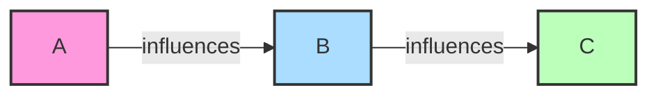

**Blocking rule for serial connections**: If the middle node (B) is observed, the path between A and C is blocked. In other words, A and C become conditionally independent given B.

**Example**: Consider A = "Battery Dead", B = "Lights Dim", C = "Visibility Poor"
- If we don't know the state of the lights (B), then learning the battery is dead (A) gives us information about potential poor visibility (C)
- However, if we already know the lights are dim (B), then learning about the battery condition doesn't provide additional information about visibility
- Mathematically: P(C|A,B) = P(C|B)

This makes intuitive sense because B "screens off" the influence of A on C. Once we know the state of B, the state of A becomes irrelevant for predicting C.

### 2. Diverging Connections (Common Cause)

In a diverging connection, one parent variable influences multiple children:

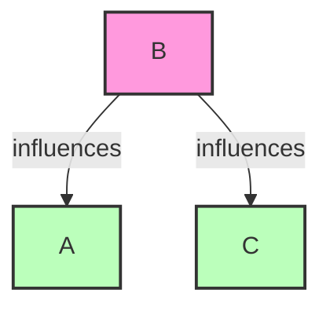

**Blocking rule for diverging connections**: If the common parent (B) is observed, the path between its children (A and C) is blocked. A and C become conditionally independent given B.

**Example**: Consider B = "Battery Dead", A = "Lights Off", C = "Radio Off"
- If we don't know the battery state (B), then learning the lights are off (A) gives us information about whether the radio might be off (C)
- However, if we already know the battery is dead (B), then information about the lights doesn't tell us anything new about the radio
- Mathematically: P(A|C,B) = P(A|B)

This makes sense because B is the common cause of both A and C. Once we know the state of the cause, the effects become independent of each other.

### 3. Converging Connections (V-structure)

In a converging connection (also called a "v-structure" or "explaining away"), multiple parent variables influence a common child:

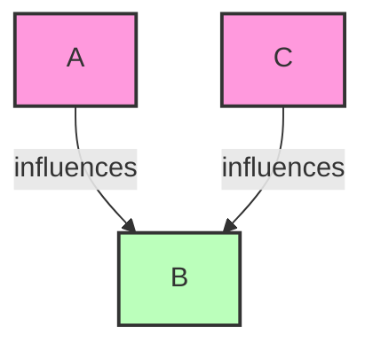

**Blocking rule for converging connections**: This case is different! The path between the parents (A and C) is blocked when the common child (B) and all of B's descendants are NOT observed. The path becomes active (unblocked) when B or any of B's descendants are observed.

**Example**: Consider A = "Battery Dead", C = "Out of Gas", B = "Car Won't Start"
- If we don't know whether the car starts (B), then knowing the battery is dead (A) tells us nothing about whether we're out of gas (C)
- However, if we know the car won't start (B), then learning the battery is fine makes it more likely we're out of gas
- Mathematically: When B is observed, P(A|C,B) ≠ P(A|B)

This counterintuitive pattern is called "explaining away" because one cause can "explain away" the need for another cause once we observe the common effect.

## Active and Blocked Paths

A path in a Bayesian network is a sequence of connected nodes, regardless of the direction of the arrows. D-separation helps us determine whether a path allows information to flow between two variables.

### Blocked Path

A path is blocked relative to a set of observed variables Z if any of these conditions is true:
1. The path contains a serial or diverging connection where the middle node is in Z (observed)
2. The path contains a converging connection where neither the middle node nor any of its descendants are in Z (not observed)

### Active Path

A path is active if it is not blocked. An active path allows probabilistic influence to flow between variables.

### D-Separation Definition

Two variables X and Y are d-separated by a set of variables Z if ALL paths between X and Y are blocked given Z. If X and Y are d-separated by Z, then X and Y are conditionally independent given Z.

## Independence Checking in Networks

Let's examine some examples to see how we can use d-separation to determine conditional independence in networks.

### Example 1: Tree Structure

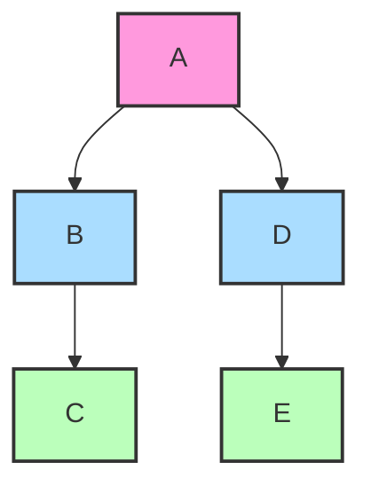

Let's check some independence relationships:

**1. C ⊥ A (Are C and A independent?)**
- Path: C ← B ← A (serial connection)
- B is not observed
- In serial connections, the path is active if the middle node is not observed
- Result: C and A are NOT d-separated (they are dependent)

**2. C ⊥ A|B (Are C and A independent given B?)**
- Path: C ← B ← A (serial connection)
- B is observed
- In serial connections, the path is blocked if the middle node is observed
- Result: C and A ARE d-separated given B (they are conditionally independent)

**3. C ⊥ D (Are C and D independent?)**
- Path: C ← B ← A → D (diverging at A)
- A is not observed
- In diverging connections, the path is active if the common parent is not observed
- Result: C and D are NOT d-separated (they are dependent)

**4. C ⊥ D|A (Are C and D independent given A?)**
- Path: C ← B ← A → D (diverging at A)
- A is observed
- In diverging connections, the path is blocked if the common parent is observed
- Result: C and D ARE d-separated given A (they are conditionally independent)

**5. E ⊥ C|D (Are E and C independent given D?)**
- Path: E ← D ← A → B → C
- D is observed, which blocks the path at the serial connection D
- Result: E and C ARE d-separated given D (they are conditionally independent)

### Example 2: V-Structure

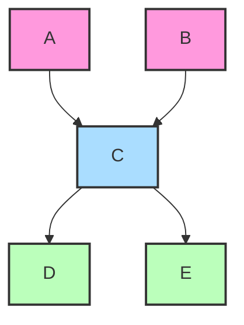

**1. A ⊥ B (Are A and B independent?)**
- Path: A → C ← B (converging at C)
- C is not observed
- In converging connections, the path is blocked if the common child is not observed
- Result: A and B ARE d-separated (they are independent)

**2. A ⊥ B|C (Are A and B independent given C?)**
- Path: A → C ← B (converging at C)
- C is observed
- In converging connections, the path is active if the common child is observed
- Result: A and B are NOT d-separated given C (they are conditionally dependent)

**3. A ⊥ B|D (Are A and B independent given D?)**
- Path: A → C ← B with C → D (D is a descendant of C)
- D is observed (descendant of converging node)
- Observing a descendant of a converging node activates the path
- Result: A and B are NOT d-separated given D (they are conditionally dependent)

**4. A ⊥ E (Are A and E independent?)**
- Path: A → C → E (serial connection)
- C is not observed
- In serial connections, the path is active if the middle node is not observed
- Result: A and E are NOT d-separated (they are dependent)

**5. D ⊥ E|C (Are D and E independent given C?)**
- Path: D ← C → E (diverging at C)
- C is observed
- In diverging connections, the path is blocked if the common parent is observed
- Result: D and E ARE d-separated given C (they are conditionally independent)

## Practical Applications of D-Separation

Understanding d-separation has several important applications:

1. **Efficient inference**: By identifying conditional independencies, we can simplify probabilistic calculations in Bayesian networks.

2. **Model validation**: We can test whether our modeled independencies match real-world data.

3. **Knowledge discovery**: Finding unexpected dependencies or independencies can reveal important insights about the domain.

4. **Model selection**: When learning network structure from data, d-separation helps evaluate candidate structures.

5. **Causal reasoning**: D-separation helps identify which variables should be controlled for when estimating causal effects.

When working with Bayesian networks, d-separation is the key to understanding how information flows through the network and which variables influence each other under different conditions of observed evidence. Mastering this concept is essential for correctly interpreting and reasoning with probabilistic graphical models.

# Inference in Bayesian Networks

Inference in Bayesian networks refers to the process of computing probabilities of interest from the network. It allows us to answer questions by using the encoded probabilistic relationships among variables, updating our beliefs when we observe evidence. This is one of the primary purposes of building Bayesian networks in the first place.

## Types of Inference

There are three fundamental types of inferential reasoning in Bayesian networks, each representing a different direction of reasoning:

### 1. Predictive Inference (Causal Reasoning)

Predictive inference follows the natural causal direction of the network, reasoning from causes to effects. This involves computing the probability of effect variables given evidence about their causes.

For example, in a medical diagnosis network:
- "What's the probability of observing certain symptoms given that a patient has a particular disease?"
- P(Symptoms | Disease)

In a weather network:
- "What's the probability of wet grass given that it's cloudy?"
- P(WetGrass | Cloudy)

Predictive inference follows the direction of the arrows in the network and represents the most natural form of reasoning about causal systems.

### 2. Diagnostic Inference (Evidential Reasoning)

Diagnostic inference works in the opposite direction, reasoning from effects back to their causes. This involves computing the probability of cause variables given evidence about their effects.

For example, in a medical diagnosis network:
- "What's the probability that a patient has a particular disease given their observed symptoms?"
- P(Disease | Symptoms)

In a car troubleshooting network:
- "What's the probability the battery is dead given that the car won't start?"
- P(BatteryDead | CarWontStart)

Diagnostic inference is particularly useful in domains like medicine, troubleshooting, and any situation where we observe outcomes and need to reason about their possible causes.

### 3. Intercausal Inference (Explaining Away)

Intercausal inference involves reasoning between causes of a common effect when the effect is observed. This creates induced dependencies between otherwise independent causes.

For example, in a car diagnosis network:
- "If the car won't start and we know the battery is fine, what's the probability we're out of gas?"
- P(OutOfGas | CarWontStart, BatteryFine)

In a medical context:
- "If a patient has fever and we know they don't have the flu, what's the probability they have pneumonia?"
- P(Pneumonia | Fever, ¬Flu)

Intercausal inference captures the "explaining away" effect: when one cause sufficiently explains the observed effect, the need for alternative causes is reduced.

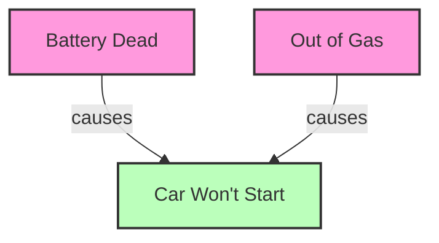

In this example, learning that the car won't start (C) makes both Battery Dead (A) and Out of Gas (B) more likely. But if we then learn the battery is definitely dead, it reduces the probability that the car is also out of gas, since we already have a sufficient explanation for why the car won't start.

## Exact Inference Methods

Exact inference methods provide precise probability calculations but can become computationally expensive for complex networks.

### 1. Enumeration (Brute Force)

The simplest approach is direct enumeration of the joint probability distribution, which involves:
1. Calculating the full joint probability distribution using the chain rule
2. Summing out (marginalizing over) the variables not involved in the query

For example, to compute P(A|B):
1. Calculate P(A,B) = ∑C,D,... P(A,B,C,D,...)
2. Calculate P(B) = ∑A,C,D,... P(A,B,C,D,...)
3. Compute P(A|B) = P(A,B)/P(B)

While conceptually straightforward, this approach becomes intractable for large networks, as the joint distribution grows exponentially with the number of variables.

### 2. Variable Elimination

Variable elimination improves on enumeration by performing calculations more efficiently. The key insight is to eliminate variables one by one, rather than dealing with the full joint distribution.

The algorithm works as follows:
1. Express the query in terms of factors (pieces of the joint distribution)
2. Select an elimination ordering for variables not in the query
3. For each variable to be eliminated:
   - Multiply all factors containing that variable
   - Sum out (marginalize) the variable from the resulting factor
4. Multiply the remaining factors to obtain the answer

For example, in the query P(A|B):
1. Express as P(A,B)/P(B)
2. For both numerator and denominator, eliminate variables one by one
3. Factors are combined only when necessary for elimination

Variable elimination is more efficient than enumeration, but its performance still depends heavily on the structure of the network and the chosen elimination order. Finding the optimal elimination order is itself an NP-hard problem.

### 3. Junction Tree Algorithm

The junction tree algorithm (also called clique tree propagation) is a more sophisticated exact inference method:
1. Convert the Bayesian network into an undirected graph (moral graph)
2. Triangulate the moral graph (add edges to eliminate "holes")
3. Identify cliques (fully connected subgraphs)
4. Organize cliques into a junction tree
5. Perform message passing on the junction tree to compute probabilities

This algorithm computes a data structure that can answer many queries efficiently after initial setup. It's particularly useful when multiple queries need to be answered on the same network with the same evidence.

## Approximate Inference Methods

When exact inference becomes computationally infeasible (which happens quickly as networks grow), approximate methods provide practical alternatives.

### 1. Sampling Methods (Monte Carlo)

Sampling methods generate random samples from the distribution represented by the network, then use these samples to estimate probabilities.

#### a. Direct Sampling

1. Generate samples from the joint distribution by sampling variables in topological order
2. Count the proportion of samples that match the query conditions

For example, to estimate P(A|B):
1. Generate many samples of all variables
2. Count samples where both A and B are true
3. Divide by the count of samples where B is true

#### b. Rejection Sampling

An improvement over direct sampling when we have evidence:
1. Generate samples as in direct sampling
2. Reject (ignore) samples that don't match the evidence
3. Estimate probabilities from the remaining samples

For example, to estimate P(A|B):
1. Generate samples of all variables
2. Keep only samples where B is true
3. Among those samples, count the proportion where A is true

#### c. Likelihood Weighting

Further improves sampling efficiency with evidence:
1. Fix the values of evidence variables
2. Sample only non-evidence variables
3. Weight each sample by the likelihood of the evidence given the sampled values
4. Use weighted samples to estimate probabilities

#### d. Gibbs Sampling

A Markov Chain Monte Carlo (MCMC) method:
1. Start with an arbitrary state consistent with the evidence
2. Repeatedly resample one variable at a time, conditioned on all others
3. After a "burn-in" period, use the generated samples to estimate probabilities

Gibbs sampling works well in high-dimensional spaces and can be more efficient than other sampling methods for certain types of networks.

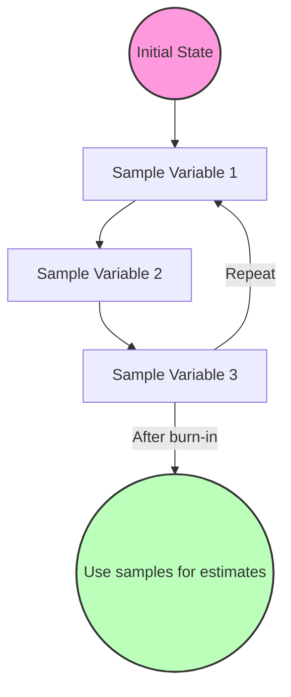

### 2. Variational Methods

Variational methods approach inference as an optimization problem:
1. Define a family of simpler distributions (variational distributions)
2. Find the member of that family that best approximates the true posterior
3. Use the approximation for inference

The most common approach minimizes the Kullback-Leibler (KL) divergence between the approximation and the true posterior. Variational methods often provide faster but less accurate results than sampling methods.

### 3. Loopy Belief Propagation

This method applies message-passing algorithms (designed for tree-structured networks) to networks with loops:
1. Ignore loops and apply standard belief propagation
2. Continue message passing until convergence (or a fixed number of iterations)

While not guaranteed to converge or give correct answers, loopy belief propagation often works well in practice, especially for applications like error-correcting codes and computer vision.

## Practical Considerations for Inference

When performing inference in Bayesian networks, several practical issues must be considered:

### 1. Complexity Factors

The computational complexity of inference depends on:
- Network size (number of variables)
- Network connectivity (more connections = more complex)
- Variable cardinality (number of states per variable)
- Evidence pattern (which variables are observed)

### 2. Inference Method Selection

Guidelines for choosing an inference method:
- For small, sparse networks: Exact methods are feasible and preferred
- For medium-sized networks: Variable elimination with a good ordering
- For large, complex networks: Approximate methods, especially sampling
- When high precision is critical: Exact methods or intensive sampling
- When speed is paramount: Variational methods or simpler approximations

### 3. Handling Continuous Variables

Most standard inference algorithms assume discrete variables. For continuous variables:
- Discretization: Divide continuous ranges into intervals
- Parameterized distributions: Use specialized techniques for Gaussian or other parametric distributions
- Specialized sampling: Continuous variable sampling techniques

### 4. Dynamic Bayesian Networks

For temporal processes modeled with Dynamic Bayesian Networks (DBNs):
- Filtering: Compute P(Xt|evidence1:t)
- Prediction: Compute P(Xt+k|evidence1:t)
- Smoothing: Compute P(Xt|evidence1:T) where T > t

These operations require specialized adaptations of the inference algorithms discussed above.

Understanding these different inference approaches allows practitioners to effectively extract information from Bayesian networks, balancing computational feasibility with the accuracy requirements of the application domain. The choice of inference method is often as important as the structure of the network itself in determining the utility of a Bayesian modeling approach.

# Variable Elimination

Variable elimination is a fundamental algorithm for exact inference in Bayesian networks. It provides an efficient way to compute conditional probabilities by systematically eliminating variables that aren't part of the query, allowing us to avoid computing the entire joint probability distribution.

## Factor Creation

The first step in variable elimination is to convert the network into a collection of factors. A factor is essentially a function that maps variable assignments to real numbers (typically probabilities).

### What is a Factor?

A factor φ(X₁, X₂, ..., Xₙ) represents a function over a set of variables. In Bayesian networks, we have two main types of factors:

1. **Conditional Probability Tables (CPTs)**: Each node in the Bayesian network comes with a CPT, which is a factor representing P(X|Parents(X)).

2. **Joint Probability Factors**: Created during the elimination process, these represent partial results of computation.

Factors are essentially multi-dimensional tables storing probability values for each combination of variable values. For example, a factor φ(A,B) where A and B are binary would have 4 entries corresponding to the probability values for (A=0,B=0), (A=0,B=1), (A=1,B=0), and (A=1,B=1).

### Creating Initial Factors

For a Bayesian network, we create one initial factor for each variable. Each factor represents the conditional probability of that variable given its parents:

For each variable X with parents Parents(X), create a factor:
φₓ(X, Parents(X)) = P(X|Parents(X))

For instance, in a simple Rain-Traffic-Late network (R → T → L), we would have the following initial factors:
- φᵣ(R) = P(R)
- φₜ(R,T) = P(T|R)
- φₗ(T,L) = P(L|T)

## Variable Elimination Process

The variable elimination algorithm computes probabilities by summing out (marginalizing) variables one by one. This process involves factor operations: multiplication and summation.

### Basic Operations on Factors

1. **Factor Multiplication**: Combines information from two factors.
   - If φ₁(X,Y) and φ₂(Y,Z) are two factors, their product is:
   - φ₃(X,Y,Z) = φ₁(X,Y) × φ₂(Y,Z)
   - Values in the new factor are products of corresponding values from original factors.

2. **Factor Marginalization (Summing Out)**: Eliminates a variable by summing over all its values.
   - To sum out variable Y from factor φ(X,Y,Z):
   - φ'(X,Z) = ∑ᵧ φ(X,Y=y,Z) for all possible values y of Y.

### Step-by-Step Algorithm

To compute a query P(Q|E=e) where Q is the query variables and E is the evidence:

1. **Setup**:
   - Create a factor for each variable based on the CPTs.
   - Restrict factors containing evidence variables to the observed values.

2. **Elimination**:
   - Choose an ordering for variables to eliminate (all variables except Q and E).
   - For each variable V in the elimination ordering:
     - Identify all factors containing V.
     - Multiply these factors to create a new factor.
     - Sum out V from the resulting factor.
     - Replace the original factors with this new factor.

3. **Result**:
   - After eliminating all variables, multiply the remaining factors.
   - Normalize the result to get P(Q|E=e).

## Efficiency Considerations

The efficiency of variable elimination heavily depends on the elimination ordering and the network structure.

### Elimination Ordering

The order in which variables are eliminated can dramatically affect performance. The goal is to minimize the size of the largest intermediate factor created during elimination.

Finding the optimal elimination ordering is NP-hard, but several heuristics work well in practice:

1. **Min-Fill**: Choose the variable that adds the fewest edges when removed from the graph.
2. **Min-Degree**: Choose the variable connected to the fewest other variables.
3. **Min-Weight**: Choose the variable that minimizes the product of domain sizes of variables in the new factor.

### Computational Complexity

The time and space complexity of variable elimination is determined by the size of the largest factor created during the process:

- If the largest factor involves k variables, each with domain size d, the complexity is O(d^k).
- This is why choosing a good elimination ordering is crucial.

### Network Structure Effects

Variable elimination is:
- Very efficient for tree-structured networks
- Reasonably efficient for sparse networks
- Potentially exponential for densely connected networks

Networks with high treewidth (a graph theory measure of "tree-likeness") are particularly challenging for variable elimination.

## Example with Step-by-Step Calculation

Let's work through an example using the Rain-Traffic-Late network:

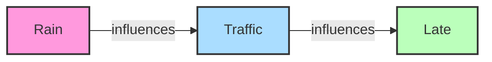

### Problem Setup

We want to compute P(L=+l), the probability of being late.

Given probability tables:

1. P(R):
   - P(+r) = 0.1
   - P(-r) = 0.9

2. P(T|R):
   - P(+t|+r) = 0.8
   - P(-t|+r) = 0.2
   - P(+t|-r) = 0.1
   - P(-t|-r) = 0.9

3. P(L|T):
   - P(+l|+t) = 0.3
   - P(-l|+t) = 0.7
   - P(+l|-t) = 0.1
   - P(-l|-t) = 0.9

### Solution Using Variable Elimination

**Step 1: Create initial factors**
- φᵣ(R) = P(R)
- φₜ(R,T) = P(T|R)
- φₗ(T,L) = P(L|T)

For our binary variables, these factors are:

φᵣ(R):
- φᵣ(+r) = 0.1
- φᵣ(-r) = 0.9

φₜ(R,T):
- φₜ(+r,+t) = 0.8
- φₜ(+r,-t) = 0.2
- φₜ(-r,+t) = 0.1
- φₜ(-r,-t) = 0.9

φₗ(T,L):
- φₗ(+t,+l) = 0.3
- φₗ(+t,-l) = 0.7
- φₗ(-t,+l) = 0.1
- φₗ(-t,-l) = 0.9

**Step 2: Eliminate variables (R and T)**

First, let's eliminate R:
1. Identify factors containing R: φᵣ(R) and φₜ(R,T)
2. Multiply these factors: φᵣₜ(R,T) = φᵣ(R) × φₜ(R,T)

   φᵣₜ(R,T):
   - φᵣₜ(+r,+t) = φᵣ(+r) × φₜ(+r,+t) = 0.1 × 0.8 = 0.08
   - φᵣₜ(+r,-t) = φᵣ(+r) × φₜ(+r,-t) = 0.1 × 0.2 = 0.02
   - φᵣₜ(-r,+t) = φᵣ(-r) × φₜ(-r,+t) = 0.9 × 0.1 = 0.09
   - φᵣₜ(-r,-t) = φᵣ(-r) × φₜ(-r,-t) = 0.9 × 0.9 = 0.81

3. Sum out R to create a new factor φₜ'(T):

   φₜ'(T):
   - φₜ'(+t) = φᵣₜ(+r,+t) + φᵣₜ(-r,+t) = 0.08 + 0.09 = 0.17
   - φₜ'(-t) = φᵣₜ(+r,-t) + φᵣₜ(-r,-t) = 0.02 + 0.81 = 0.83

Now, eliminate T:
1. Identify factors containing T: φₜ'(T) and φₗ(T,L)
2. Multiply these factors: φₜₗ(T,L) = φₜ'(T) × φₗ(T,L)

   φₜₗ(T,L):
   - φₜₗ(+t,+l) = φₜ'(+t) × φₗ(+t,+l) = 0.17 × 0.3 = 0.051
   - φₜₗ(+t,-l) = φₜ'(+t) × φₗ(+t,-l) = 0.17 × 0.7 = 0.119
   - φₜₗ(-t,+l) = φₜ'(-t) × φₗ(-t,+l) = 0.83 × 0.1 = 0.083
   - φₜₗ(-t,-l) = φₜ'(-t) × φₗ(-t,-l) = 0.83 × 0.9 = 0.747

3. Sum out T to create a new factor φₗ'(L):

   φₗ'(L):
   - φₗ'(+l) = φₜₗ(+t,+l) + φₜₗ(-t,+l) = 0.051 + 0.083 = 0.134
   - φₗ'(-l) = φₜₗ(+t,-l) + φₜₗ(-t,-l) = 0.119 + 0.747 = 0.866

**Step 3: Normalize the result**
Since we're computing a probability, the values should already be normalized. We can verify:
0.134 + 0.866 = 1.0

Therefore, P(L=+l) = 0.134 or 13.4%.

### Interpretation and Verification

To verify this result, we can calculate the same probability using the marginalization of the joint distribution:

P(+l) = ∑ᵣ ∑ₜ P(R=r, T=t, L=+l)
      = ∑ᵣ ∑ₜ P(L=+l|T=t) × P(T=t|R=r) × P(R=r)

Calculating this directly:
- P(+l|+t)P(+t|+r)P(+r) = 0.3 × 0.8 × 0.1 = 0.024
- P(+l|+t)P(+t|-r)P(-r) = 0.3 × 0.1 × 0.9 = 0.027
- P(+l|-t)P(-t|+r)P(+r) = 0.1 × 0.2 × 0.1 = 0.002
- P(+l|-t)P(-t|-r)P(-r) = 0.1 × 0.9 × 0.9 = 0.081

Sum: 0.024 + 0.027 + 0.002 + 0.081 = 0.134

This confirms our variable elimination result.

## Comparison with Other Inference Methods

Variable elimination offers several advantages over other inference methods:

1. **Compared to direct enumeration**: Variable elimination is much more efficient because it avoids computing the entire joint distribution. Instead, it focuses computation only on relevant variables.

2. **Compared to message passing (belief propagation)**: Variable elimination solves a single query, while message passing algorithms like the junction tree algorithm can efficiently answer multiple queries. If you only need one specific probability, variable elimination is often more straightforward.

3. **Compared to sampling methods**: Variable elimination provides exact answers, while sampling methods provide approximations. However, sampling methods can scale to much larger networks where exact inference becomes intractable.

Understanding variable elimination provides important insights into the fundamental computational challenges of probabilistic inference and the tradeoffs involved in different approaches. It forms the conceptual foundation for many more advanced inference algorithms used in practice today.

# Sampling Methods for Bayesian Networks

Sampling methods provide an alternative approach to exact inference in Bayesian networks. When networks become large or densely connected, exact inference methods like variable elimination can become computationally intractable. Sampling methods address this challenge by generating random samples from the network's distribution and using these samples to estimate probabilities.

## Direct Sampling

Direct sampling is the most straightforward sampling method for Bayesian networks. It generates complete samples from the joint distribution by sampling variables in topological order (parents before children).

### Algorithm

1. Sort variables in topological order (so parents come before children)
2. For each variable $X_i$ in order:
   - Sample $X_i$ from $P(X_i|\text{Parents}(X_i)=\text{parents}_i)$ where $\text{parents}_i$ are the values already sampled for the parents of $X_i$
3. The result is a complete sample from the joint distribution

### Probability Estimation

To estimate probabilities using direct sampling:

1. Generate $N$ samples using the algorithm above
2. To estimate $P(X=x)$:
   - Count the number of samples where $X=x$, call this $n_x$
   - $P(X=x) \approx \frac{n_x}{N}$

3. To estimate $P(X=x|E=e)$ (where $E$ is evidence):
   - Count the number of samples where $X=x$ and $E=e$, call this $n_{x,e}$
   - Count the number of samples where $E=e$, call this $n_e$
   - $P(X=x|E=e) \approx \frac{n_{x,e}}{n_e}$

### Example

Consider our Rain-Traffic-Late network (R → T → L):

To generate a sample:

1. Sample R from P(R):
   - If we sample R = +r (probability 0.1)

2. Sample T from P(T|R=+r):
   - If we sample T = +t (probability 0.8 given R = +r)

3. Sample L from P(L|T=+t):
   - If we sample L = -l (probability 0.7 given T = +t)

The complete sample is (R=+r, T=+t, L=-l).

With many such samples, we can estimate probabilities like P(L=+l) by counting the proportion of samples where L=+l.

### Advantages and Limitations

**Advantages:**
- Simple to implement
- Unbiased estimates
- Samples can be reused for different queries

**Limitations:**
- Inefficient for evidence-based queries (most samples might not match the evidence)
- Requires many samples for rare events
- Accuracy depends on sample size

## Rejection Sampling

Rejection sampling improves upon direct sampling when we have evidence by simply discarding samples that don't match the evidence.

### Algorithm

1. Generate samples using direct sampling
2. Reject (discard) any sample that doesn't match the evidence
3. Use the remaining samples to estimate probabilities

### Probability Estimation

To estimate $P(X=x|E=e)$:
1. Generate many samples using direct sampling
2. Keep only samples where $E=e$
3. Among the remaining samples, count the proportion where $X=x$

Mathematically: $P(X=x|E=e) \approx \frac{n_{x,e}}{n_e}$

Where:
- $n_{x,e}$ = number of samples where $X=x$ and $E=e$
- $n_e$ = number of samples where $E=e$

### Example

Using our Rain-Traffic-Late network, suppose we want to estimate P(R=+r|L=+l).

1. Generate many samples using direct sampling
2. Discard all samples where L ≠ +l
3. Among the remaining samples, count the proportion where R = +r

If we generate 1000 samples and 130 of them have L = +l, and among these, 40 also have R = +r, then:
$P(R=+r|L=+l) \approx \frac{40}{130} \approx 0.308$

### Advantages and Limitations

**Advantages:**
- Still relatively simple to implement
- Produces unbiased estimates of conditional probabilities
- Works correctly with any evidence pattern

**Limitations:**
- Very inefficient when evidence is unlikely (most samples get rejected)
- Exponentially inefficient with increasing evidence
- May need prohibitively many samples for rare evidence

## Likelihood Weighting

Likelihood weighting addresses the inefficiency of rejection sampling by ensuring every sample is consistent with the evidence. It fixes the values of evidence variables and samples only non-evidence variables.

### Algorithm

1. Fix evidence variables to their observed values
2. Sample non-evidence variables in topological order
3. Weight each sample by the likelihood of the evidence given its parents
4. Use weighted samples to estimate probabilities

### Probability Estimation

To estimate $P(X=x|E=e)$:
1. Generate $N$ weighted samples as described above
2. For each sample $i$, compute weight $w_i$:
   $w_i = \prod_{E_j \in E} P(E_j=e_j|\text{Parents}(E_j)=\text{parents}_j^i)$
3. Estimate:
   $P(X=x|E=e) \approx \frac{\sum_{i:X^i=x} w_i}{\sum_{i=1}^N w_i}$

Where:
- $X^i$ is the value of $X$ in sample $i$
- $w_i$ is the weight of sample $i$

### Example

In our Rain-Traffic-Late network, to estimate P(R=+r|L=+l):

1. Fix L = +l for all samples
2. For each sample:
   - Sample R from P(R)
   - Sample T from P(T|R)
   - Compute weight: w = P(L=+l|T)
3. Estimate:
   $P(R=+r|L=+l) \approx \frac{\sum_{i:R^i=+r} w_i}{\sum_{i=1}^N w_i}$

For instance, if we have these samples:
- Sample 1: (R=+r, T=+t, L=+l), weight = P(L=+l|T=+t) = 0.3
- Sample 2: (R=+r, T=-t, L=+l), weight = P(L=+l|T=-t) = 0.1
- Sample 3: (R=-r, T=+t, L=+l), weight = P(L=+l|T=+t) = 0.3
- Sample 4: (R=-r, T=-t, L=+l), weight = P(L=+l|T=-t) = 0.1

Then:
$P(R=+r|L=+l) \approx \frac{0.3 + 0.1}{0.3 + 0.1 + 0.3 + 0.1} = \frac{0.4}{0.8} = 0.5$

### Advantages and Limitations

**Advantages:**
- More efficient than rejection sampling with evidence
- Every sample contributes to the estimate
- Simple to implement

**Limitations:**
- Can be inefficient with evidence deep in the network
- May produce high-variance estimates if weights vary widely
- Less accurate than exact inference methods for the same computational effort

## Gibbs Sampling (MCMC Technique)

Gibbs sampling is a Markov Chain Monte Carlo (MCMC) method that addresses the limitations of previous sampling approaches. It generates samples by iteratively updating one variable at a time, conditioning on the current values of all other variables.

### Algorithm

1. Initialize all non-evidence variables to arbitrary values, fix evidence variables to their observed values
2. Repeat for many iterations:
   - For each non-evidence variable $X_i$:
     - Sample $X_i$ from $P(X_i|\text{MB}(X_i))$ where MB$(X_i)$ is the Markov blanket of $X_i$ (its parents, children, and children's other parents)
3. After a "burn-in" period, collect samples at regular intervals

### Markov Blanket

The Markov blanket of a variable $X$ in a Bayesian network consists of:
- $X$'s parents
- $X$'s children
- The other parents of $X$'s children

The key property of the Markov blanket is that a variable is conditionally independent of all other variables in the network given its Markov blanket.

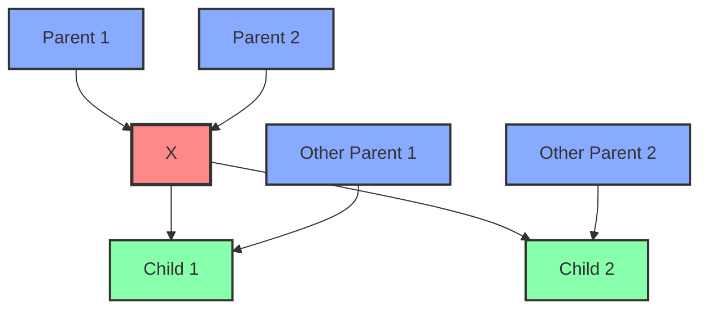

In this diagram, the Markov blanket of X consists of Parent 1, Parent 2, Child 1, Child 2, Other Parent 1, and Other Parent 2.

### Probability Estimation

To estimate $P(X=x|E=e)$ using Gibbs sampling:
1. Run the Gibbs sampling algorithm as described
2. Discard the first M samples (burn-in period)
3. Among the remaining samples, count the proportion where $X=x$

Mathematically: $P(X=x|E=e) \approx \frac{n_x}{N-M}$

Where:
- $n_x$ = number of post-burn-in samples where $X=x$
- $N$ = total number of samples
- $M$ = number of burn-in samples

### Example

Let's see how Gibbs sampling would work in our Rain-Traffic-Late network to estimate P(R=+r|L=+l):

1. Initialize variables, fixing L = +l:
   - R = +r (arbitrary initial value)
   - T = +t (arbitrary initial value)
   - L = +l (fixed evidence)

2. Iteration 1:
   - Sample R from P(R|T=+t, L=+l):
     - P(R=+r|T=+t, L=+l) proportional to P(R=+r) × P(T=+t|R=+r)
     - P(R=-r|T=+t, L=+l) proportional to P(R=-r) × P(T=+t|R=-r)
     - Normalize and sample, say we get R = -r
   - Sample T from P(T|R=-r, L=+l):
     - P(T=+t|R=-r, L=+l) proportional to P(T=+t|R=-r) × P(L=+l|T=+t)
     - P(T=-t|R=-r, L=+l) proportional to P(T=-t|R=-r) × P(L=+l|T=-t)
     - Normalize and sample, say we get T = +t

3. After burn-in, collect samples and calculate:
   $P(R=+r|L=+l) \approx$ fraction of samples where R = +r

### Detailed Calculation for One Step

Let's calculate P(R|T=+t, L=+l) in more detail:

For R = +r:
- Proportional to P(R=+r) × P(T=+t|R=+r)
- = 0.1 × 0.8 = 0.08

For R = -r:
- Proportional to P(R=-r) × P(T=+t|R=-r)
- = 0.9 × 0.1 = 0.09

Normalizing:
- P(R=+r|T=+t, L=+l) = 0.08/(0.08 + 0.09) ≈ 0.47
- P(R=-r|T=+t, L=+l) = 0.09/(0.08 + 0.09) ≈ 0.53

Then we sample from this distribution to get the next value of R.

### Advantages and Limitations

**Advantages:**
- Works well for networks with many variables
- Efficient with evidence (no sample rejection)
- Can handle complex networks where other methods fail
- Scales better to high-dimensional problems

**Limitations:**
- Requires a "burn-in" period to reach the stationary distribution
- Samples are not independent (autocorrelation)
- May get stuck in local modes of the distribution
- Convergence can be slow with highly correlated variables

## Comparison of Sampling Methods

| Method | Good for | Challenges | Implementation Complexity |
|--------|----------|------------|---------------------------|
| Direct Sampling | Marginal probabilities, networks without evidence | Inefficient with evidence, requires many samples for rare events | Simple |
| Rejection Sampling | Networks with limited evidence | Very inefficient when evidence is unlikely | Simple |
| Likelihood Weighting | Networks with evidence | Less accurate with deep evidence | Moderate |
| Gibbs Sampling | Complex networks, high-dimensional problems | Convergence issues, requires burn-in | Complex |

## Practical Considerations

When implementing sampling methods for Bayesian networks, several practical considerations arise:

### Sample Size Determination

The number of samples needed depends on:
- Desired accuracy (more samples = greater accuracy)
- Probability being estimated (rare events require more samples)
- Evidence likelihood (less likely evidence requires more samples)

A common approach is to increase sample size until estimates stabilize.

### Convergence Assessment for MCMC

For Gibbs sampling and other MCMC methods, determining convergence is crucial:
- Run multiple chains with different initializations
- Check if they converge to similar distributions
- Use convergence diagnostics like Gelman-Rubin statistic

### Burn-in Period for MCMC

The burn-in period should be long enough for the chain to reach its stationary distribution:
- Typically 1,000-10,000 iterations depending on network complexity
- Can be determined by plotting sample trajectories and observing when they stabilize

### Handling Zero Probabilities

If CPTs contain zero probabilities, sampling methods can encounter problems:
- Direct and rejection sampling may generate impossible samples
- Likelihood weighting can generate zero-weight samples
- Gibbs sampling can get stuck

Solutions include adding small "smoothing" probabilities or using more sophisticated sampling methods.

Sampling methods provide a powerful alternative to exact inference, particularly for complex networks where exact methods become computationally infeasible. By understanding the strengths and limitations of each sampling approach, we can choose the most appropriate method for a given Bayesian network inference task.

# Network Parameter Analysis

Bayesian networks provide a compact representation of joint probability distributions by leveraging conditional independence relationships. An important aspect of designing these networks is understanding how many parameters are required to fully specify the model. This analysis helps us evaluate the computational feasibility of different network structures and compare alternative models.

## Computing the Number of Parameters Needed

In a Bayesian network, each node represents a random variable that requires a conditional probability distribution given its parents. The number of parameters needed to specify this distribution depends on:

1. The number of states the variable can take
2. The number of different configurations of its parent variables

### The Parameter Calculation Formula

For a node with multiple possible states and multiple parents, the number of parameters required is:

$$(|States| - 1) \times \prod_{i=1}^{n} |P_i|$$

Where:
- $|States|$ is the number of states (possible values) for the node
- $|P_i|$ is the number of states for the $i$-th parent
- $\prod_{i=1}^{n} |P_i|$ is the product of the number of states across all parents

### Why We Use (States - 1)

For any probability distribution, the sum of probabilities must equal 1. This constraint means that for a variable with $k$ states, we only need to specify $k-1$ probabilities, as the last one can be calculated by subtraction.

For example, if a binary variable (with states True and False) has:
- P(True) = 0.3
- Then P(False) = 1 - 0.3 = 0.7

This is why we use $(|States| - 1)$ in our formula instead of simply $|States|$.

### Understanding the Product of Parent States

The product of parent states represents all possible combinations of parent variable values. For each unique combination of parent values, we need a separate conditional probability distribution for the child node.

For example, if a node has two parents:
- Parent 1 with 2 states (True, False)
- Parent 2 with 3 states (Red, Green, Blue)

Then there are $2 \times 3 = 6$ possible parent configurations:
1. (True, Red)
2. (True, Green)
3. (True, Blue)
4. (False, Red)
5. (False, Green)
6. (False, Blue)

For each of these configurations, we need a separate probability distribution for the child node.

## Step-by-Step Parameter Calculation

Let's walk through a complete example calculation for a Bayesian network:

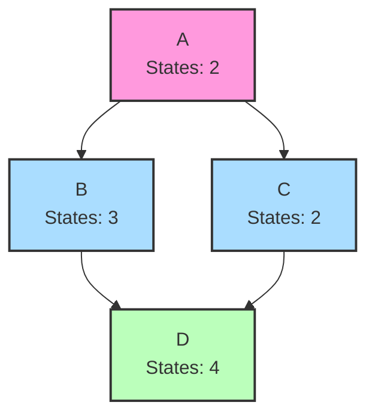

Let's calculate the parameters for each node:

1. **Node A** (Root node with 2 states, no parents):
   - Parameters = (2 - 1) × 1 = 1
   - A root node with 2 states needs just 1 parameter (the probability of one state)

2. **Node B** (3 states, with parent A having 2 states):
   - Parameters = (3 - 1) × 2 = 4
   - For each of A's 2 states, we need 2 parameters to specify B's distribution

3. **Node C** (2 states, with parent A having 2 states):
   - Parameters = (2 - 1) × 2 = 2
   - For each of A's 2 states, we need 1 parameter to specify C's distribution

4. **Node D** (4 states, with parents B having 3 states and C having 2 states):
   - Parameters = (4 - 1) × (3 × 2) = 3 × 6 = 18
   - There are 3 × 2 = 6 possible parent configurations
   - For each configuration, we need 3 parameters to specify D's distribution

**Total parameters for the network:** 1 + 4 + 2 + 18 = 25

## Network Structure Comparison

The structure of a Bayesian network significantly impacts the number of parameters required. Let's compare different structures to understand this impact.

### Example: Alternative Structures for the Same Domain

Consider a domain with four binary variables: A, B, C, and D. Let's compare three different structures:

#### Structure 1: Chain (A → B → C → D)

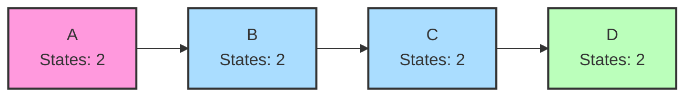

Parameters:
- A: (2 - 1) × 1 = 1
- B: (2 - 1) × 2 = 2
- C: (2 - 1) × 2 = 2
- D: (2 - 1) × 2 = 2
- Total: 7 parameters

#### Structure 2: Star (A → B, A → C, A → D)

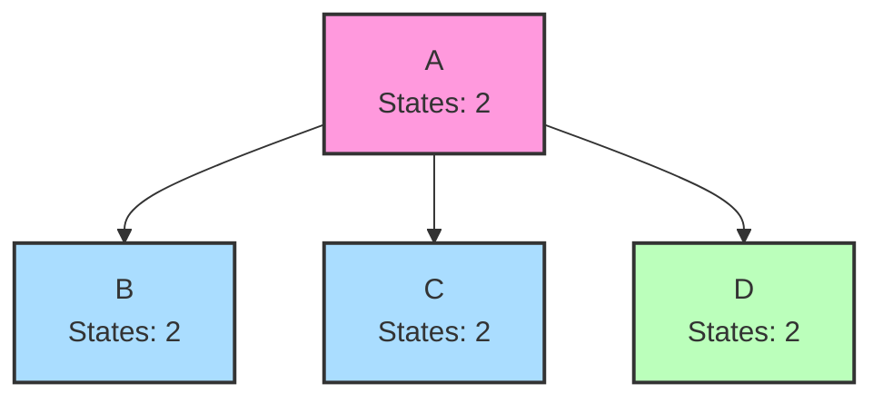

Parameters:
- A: (2 - 1) × 1 = 1
- B: (2 - 1) × 2 = 2
- C: (2 - 1) × 2 = 2
- D: (2 - 1) × 2 = 2
- Total: 7 parameters

#### Structure 3: Fully Connected (A → B → C → D, A → C, A → D, B → D)

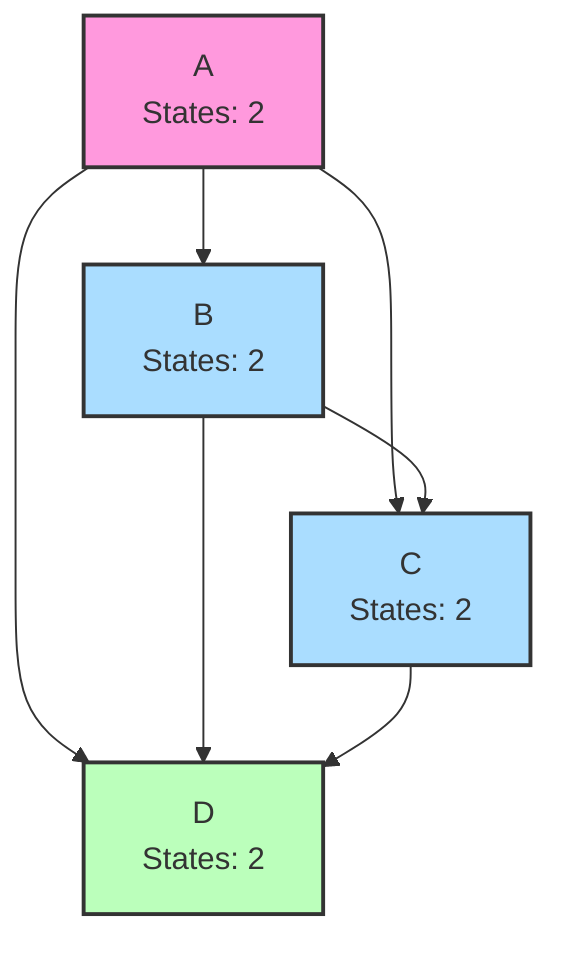

Parameters:
- A: (2 - 1) × 1 = 1
- B: (2 - 1) × 2 = 2
- C: (2 - 1) × (2 × 2) = 4
- D: (2 - 1) × (2 × 2 × 2) = 8
- Total: 15 parameters

We can see that the fully connected structure requires more than twice as many parameters as either the chain or star structure, despite representing the same four variables. This illustrates how network structure choices significantly impact model complexity.

## Case Study: Car Failure Network

Let's analyze a more complex example from the domain of car diagnostics:

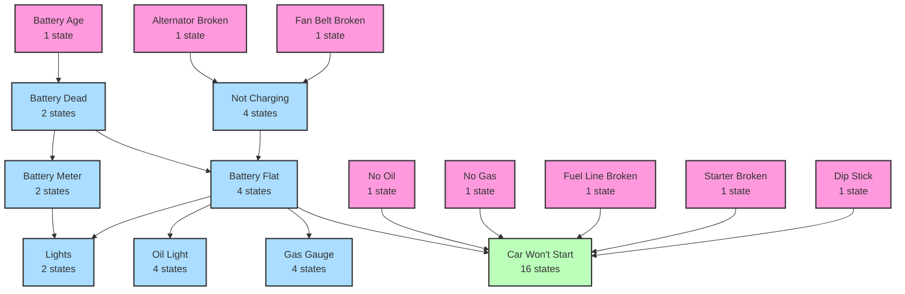

Let's calculate the parameters for some key nodes:

1. **Root Nodes (all with 1 state):**
   - Parameters = (1 - 1) × 1 = 0
   - Nodes with only 1 state have fixed values, requiring no parameters

2. **Battery Dead** (2 states, parent: Battery Age [1 state]):
   - Parameters = (2 - 1) × 1 = 1

3. **Not Charging** (4 states, parents: Alternator Broken [1 state], Fan Belt Broken [1 state]):
   - Parameters = (4 - 1) × (1 × 1) = 3

4. **Battery Flat** (4 states, parents: Battery Dead [2 states], Not Charging [4 states]):
   - Parameters = (4 - 1) × (2 × 4) = 3 × 8 = 24

5. **Car Won't Start** (16 states, parents: No Oil [1 state], No Gas [1 state], Fuel Line Broken [1 state], Starter Broken [1 state], Dip Stick [1 state], Battery Flat [4 states]):
   - Parameters = (16 - 1) × (1 × 1 × 1 × 1 × 1 × 4) = 15 × 4 = 60

The total number of parameters for this network would be the sum across all nodes. This example shows how having variables with many states and many parents can lead to a rapid increase in parameter count.

## Practical Implications

Understanding parameter counts has several practical implications:

### 1. Model Complexity vs. Data Requirements

More parameters require more data for reliable estimation. A rule of thumb is that you need at least several samples per parameter for stable estimates.

### 2. Overfitting Risk

Models with more parameters than justified by available data risk overfitting, capturing noise rather than true patterns.

### 3. Computational Feasibility

Networks with many parameters require more memory and computational resources for both learning and inference.

### 4. Model Selection

When comparing alternative network structures, parameter count provides one measure of model complexity that can be used alongside performance measures for model selection.

### 5. Identifying Simplification Opportunities

Nodes with many parents or states contribute disproportionately to parameter count. These might be candidates for simplification through:
- Reducing the number of states (discretizing differently)
- Rethinking parent-child relationships
- Using alternative parameterizations (e.g., noisy-OR for binary variables)

## Best Practices for Network Design

Based on parameter analysis, here are some guidelines for efficient Bayesian network design:

1. **Start simple**: Begin with a sparse network and add edges only when necessary.

2. **Consider variable discretization**: Fewer states mean fewer parameters.

3. **Use domain knowledge**: Incorporate known independence relationships to avoid unnecessary connections.

4. **Leverage canonical models**: For specific relationship types, specialized models like noisy-OR can reduce parameter counts.

5. **Balance structure complexity against data availability**: More complex structures require more data for reliable parameter estimation.

By carefully analyzing the parameter requirements of different network structures, we can design Bayesian networks that balance expressive power with computational efficiency and reliable parameter estimation from available data.

# Advanced Applications of Bayesian Networks

Bayesian networks provide a powerful framework for modeling complex systems with uncertainty. These advanced applications demonstrate how the theoretical concepts we've covered can be applied to solve real-world problems involving probabilistic reasoning.

## Explaining Away Effect

The explaining away effect is a fascinating phenomenon in probabilistic reasoning that occurs when two independent causes of a common effect become conditionally dependent once the effect is observed. This seemingly counterintuitive behavior is perfectly captured by Bayesian networks and provides deep insight into how we reason about causes and effects.

### Conceptual Understanding

Consider two causes A and B that can independently lead to an effect E. Initially, without any evidence about E, A and B are independent of each other. However, once we observe that E has occurred, A and B become negatively correlated - knowing that one cause is present makes the other cause less likely to be present as well.

This happens because once we know the effect has occurred, finding out that one cause is present partially "explains away" the need for the other cause. In essence, when we have already found one explanation for an observation, alternative explanations become less necessary.

### Mathematical Illustration

Let's formalize this with a simple example. Consider:
- A = "Grass is wet due to rain"
- B = "Grass is wet due to sprinkler"
- E = "Grass is wet"

Initially, rain (A) and sprinkler (B) are independent events:
$P(A,B) = P(A) \times P(B)$

But once we observe the wet grass (E), they become dependent:
$P(A,B|E) \neq P(A|E) \times P(B|E)$

Specifically, if we learn that it rained (A is true), the probability that the sprinkler was on decreases:
$P(B|E,A) < P(B|E)$

The sprinkler becomes less likely to have been on because the rain already explains the wet grass.

### Classic Example: Medical Diagnosis

A classic example comes from medical diagnosis. Consider:
- A = "Patient has tuberculosis"
- B = "Patient has lung cancer"
- E = "Patient has a positive chest X-ray"

Tuberculosis and lung cancer are typically independent conditions (having one doesn't affect the likelihood of having the other). However, if we observe a positive chest X-ray, they become negatively correlated - if we confirm the patient has tuberculosis, it becomes less likely they also have lung cancer, because tuberculosis already explains the observed X-ray result.

### Bayesian Network Representation

The explaining away effect occurs in a converging connection (v-structure) in a Bayesian network:

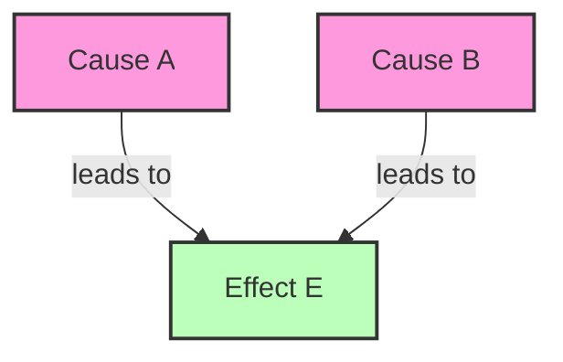

This structure encodes the conditional independence properties that create the explaining away effect: A and B are independent when E is not observed, but become dependent once E is observed.

### Implications

The explaining away effect has important implications for:

1. **Diagnostic reasoning**: Understanding how multiple potential causes interact when reasoning from effects back to causes.

2. **Scientific hypothesis testing**: Evaluating competing hypotheses that could explain the same evidence.

3. **Artificial intelligence**: Building systems that can reason about causes and effects in a manner similar to human cognition.

4. **Risk assessment**: Understanding how different risk factors interact rather than simply adding their effects.

## Alarm System Case Study

The burglary alarm system example is a classic case study in Bayesian networks. It represents a scenario involving uncertainty, multiple causes and effects, and the need to reason both causally and diagnostically.

### Scenario Description

Consider a home alarm system that can be triggered by either a burglary or an earthquake. Two neighbors, John and Mary, might call the police when they hear the alarm. However, the system is not perfectly reliable, and John and Mary might not always hear the alarm or might call for other reasons.

### Network Structure

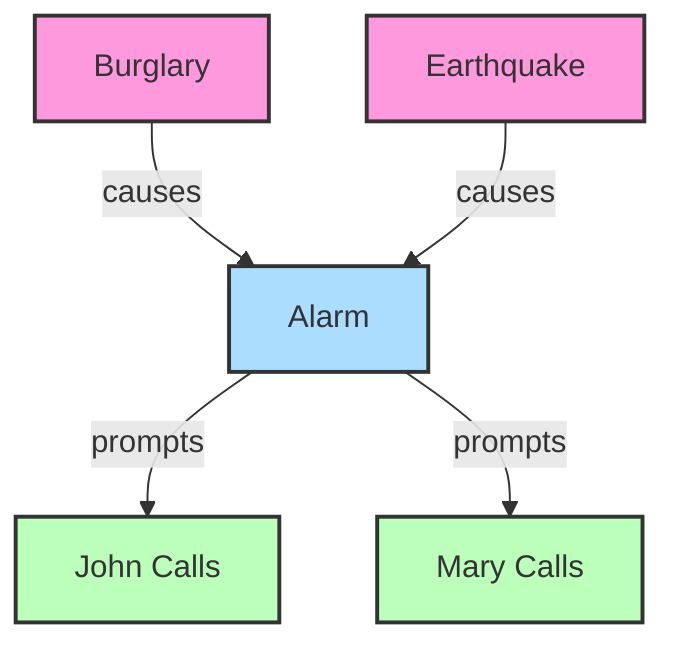

### Probability Tables

1. **Prior Probabilities**:
   - $P(B) = 0.001$ (Burglary is rare: 0.1% chance)
   - $P(E) = 0.002$ (Earthquake is also rare: 0.2% chance)

2. **Alarm Activation**:
   - $P(A|B,E) = 0.95$ (Alarm likely activates with both burglary and earthquake)
   - $P(A|B,\neg E) = 0.94$ (Alarm likely activates with just burglary)
   - $P(A|\neg B,E) = 0.29$ (Alarm sometimes activates with just earthquake)
   - $P(A|\neg B,\neg E) = 0.001$ (Alarm rarely activates with neither cause)

3. **John and Mary's Calling Behavior**:
   - $P(J|A) = 0.9$ (John is fairly reliable at calling when alarm sounds)
   - $P(J|\neg A) = 0.05$ (John occasionally calls even without alarm)
   - $P(M|A) = 0.7$ (Mary sometimes calls when alarm sounds)
   - $P(M|\neg A) = 0.01$ (Mary rarely calls without alarm)

### Inference Questions

This network allows us to answer various questions through probabilistic inference:

1. **Diagnostic reasoning**: "If both John and Mary call, what is the probability of a burglary?"
   - $P(B|J,M) = ?$

2. **Causal reasoning**: "If there is a burglary, what is the probability that John will call?"
   - $P(J|B) = ?$

3. **Intercausal reasoning**: "If the alarm is known to be activated and an earthquake is confirmed, what is the probability of a burglary?"
   - $P(B|A,E) = ?$ (demonstrates explaining away)

Let's solve the first question as an example.

### Solving $P(B|J,M)$ - The Probability of Burglary Given Both Neighbors Call

Using Bayes' theorem and the chain rule of probability:

$P(B|J,M) = \frac{P(J,M|B) \times P(B)}{P(J,M)}$

Because the structure of our network gives us conditional independence properties, we can decompose $P(J,M|B)$:

$P(J,M|B) = \sum_A \sum_E P(J,M|A) \times P(A|B,E) \times P(E)$

Further, John and Mary's calls are conditionally independent given the alarm state:

$P(J,M|A) = P(J|A) \times P(M|A)$

Working through the complete calculation with our probability values:

$P(B|J,M) \approx 0.284$ or 28.4%

This tells us that even though burglaries are rare (prior probability of only 0.1%), when both neighbors call, there's a substantial 28.4% chance that a burglary has occurred. This represents a significant update from our prior belief based on the evidence of the calls.

### Key Insights from the Alarm System

This example demonstrates several important aspects of Bayesian networks:

1. **Belief updating**: How our beliefs about unobserved variables (burglary) change dramatically when we observe evidence (neighbor calls).

2. **Reasoning with uncertain evidence**: The calls are not perfect indicators of an alarm, which itself is not a perfect indicator of a burglary.

3. **Explaining away**: If we knew the alarm had sounded and then learned there was an earthquake, our belief in a burglary would decrease (the earthquake "explains away" the alarm).

4. **Reasoning through an intermediate variable**: The alarm serves as an intermediary between causes (burglary/earthquake) and observed effects (calls).

This case study shows how Bayesian networks provide a principled framework for reasoning under uncertainty, allowing us to combine prior knowledge with evidence to make informed inferences.

## Smart Home Energy Consumption Example

Smart home energy management represents a modern application of Bayesian networks, where multiple interacting factors influence energy consumption in complex ways.

### Scenario Description

Imagine a smart home system that models the relationships between time of day, occupancy, outside temperature, air conditioning (AC) usage, and energy consumption. The goal is to understand these relationships to optimize energy use while maintaining comfort.

### Network Structure

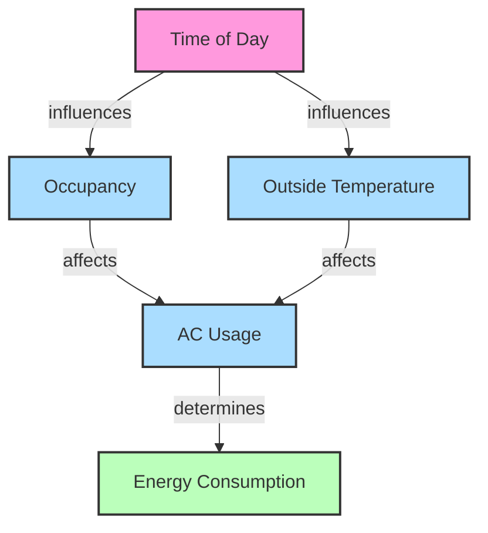

### Variable States

1. **Time of Day (T)**: Morning, Afternoon, Evening
2. **Occupancy (O)**: Occupied, Unoccupied
3. **Outside Temperature (E)**: Hot, Mild, Cold
4. **AC Usage (A)**: On, Off
5. **Energy Consumption (C)**: High, Medium, Low

### Probability Tables (Simplified Example)

1. **Time of Day Distribution**:
   - P(T=Morning) = 0.33
   - P(T=Afternoon) = 0.33
   - P(T=Evening) = 0.34

2. **Occupancy given Time of Day**:
   - P(O=Occupied|T=Morning) = 0.7
   - P(O=Occupied|T=Afternoon) = 0.3
   - P(O=Occupied|T=Evening) = 0.9

3. **Outside Temperature given Time of Day**:
   - P(E=Hot|T=Morning) = 0.2
   - P(E=Hot|T=Afternoon) = 0.7
   - P(E=Hot|T=Evening) = 0.4
   - P(E=Mild|T=Morning) = 0.5
   - P(E=Mild|T=Afternoon) = 0.3
   - P(E=Mild|T=Evening) = 0.4
   - P(E=Cold|T=Morning) = 0.3
   - P(E=Cold|T=Afternoon) = 0
   - P(E=Cold|T=Evening) = 0.2

4. **AC Usage given Occupancy and Outside Temperature**:
   - P(A=On|O=Occupied, E=Hot) = 0.9
   - P(A=On|O=Occupied, E=Mild) = 0.5
   - P(A=On|O=Occupied, E=Cold) = 0.05
   - P(A=On|O=Unoccupied, E=Hot) = 0.3
   - P(A=On|O=Unoccupied, E=Mild) = 0.1
   - P(A=On|O=Unoccupied, E=Cold) = 0.01

5. **Energy Consumption given AC Usage**:
   - P(C=High|A=On) = 0.8
   - P(C=Medium|A=On) = 0.15
   - P(C=Low|A=On) = 0.05
   - P(C=High|A=Off) = 0.05
   - P(C=Medium|A=Off) = 0.3
   - P(C=Low|A=Off) = 0.65

### Inference Examples

This network allows for various types of probabilistic reasoning:

#### 1. Predictive Inference (Causes to Effects)

"What is the probability of high energy consumption in the afternoon?"

We want to calculate P(C=High|T=Afternoon).

Using the structure of the network:
$P(C=High|T=Afternoon) = \sum_O \sum_E \sum_A P(C=High|A) \times P(A|O,E) \times P(O|T=Afternoon) \times P(E|T=Afternoon)$

Working through this calculation (which involves summing over all possible combinations of Occupancy, Temperature, and AC Usage):

$P(C=High|T=Afternoon) \approx 0.42$ or 42%

This indicates a moderate-to-high probability of high energy consumption in the afternoon, primarily due to the tendency for high temperatures in the afternoon leading to AC use.

#### 2. Diagnostic Inference (Effects to Causes)

"If energy consumption is high, what is the probability that the AC is on?"

We want to calculate P(A=On|C=High).

Using Bayes' theorem:
$P(A=On|C=High) = \frac{P(C=High|A=On) \times P(A=On)}{P(C=High)}$

Calculating P(A=On) requires marginalizing over all parent configurations.
Calculating P(C=High) requires marginalizing over both AC states.

After these calculations:
$P(A=On|C=High) \approx 0.95$ or 95%

This high probability makes intuitive sense: high energy consumption is strongly indicative of AC usage.

#### 3. Intercausal Reasoning (Between Causes)

"If the AC is on and it's the evening, how does this affect our belief about occupancy?"

We want to calculate P(O=Occupied|A=On, T=Evening).

Using Bayes' theorem:
$P(O=Occupied|A=On, T=Evening) = \frac{P(A=On|O=Occupied, T=Evening) \times P(O=Occupied|T=Evening)}{P(A=On|T=Evening)}$

After calculating the terms:
$P(O=Occupied|A=On, T=Evening) \approx 0.95$ or 95%

This high probability reflects the fact that AC usage when no one is home is relatively uncommon, so the AC being on strongly suggests occupancy.

### Advanced Applications of This Model

The smart home energy consumption Bayesian network enables several valuable applications:

1. **Anomaly Detection**: Identifying unusual energy consumption patterns that deviate from expectations. For instance, high energy consumption when the home is expected to be unoccupied might indicate an issue.

2. **Automated Control**: Using inference to make optimal decisions about when to turn the AC on or off based on predicted occupancy and temperature.

3. **Energy Forecasting**: Predicting future energy consumption based on weather forecasts and occupancy patterns.

4. **User Behavior Modeling**: Learning the occupancy and temperature preferences of residents over time by updating the network parameters.

5. **Demand Response**: Participating in utility demand response programs by predicting when high energy consumption is likely and identifying opportunities to reduce usage during peak periods.

### Building on the Basic Model

The simple model we've presented could be extended in several ways:

1. **Additional Variables**: Including other energy consumers (lighting, appliances), more detailed time variables (day of week, season), or additional environmental factors.

2. **Continuous Variables**: Representing temperature and energy consumption as continuous rather than discrete variables.

3. **Temporal Dynamics**: Extending to a Dynamic Bayesian Network to capture how the system evolves over time, with current state influencing future states.

4. **Learning from Data**: Using smart home sensor data to learn or refine the parameters of the network.

### Implementation Considerations

When implementing such a Bayesian network for real smart home applications, several practical considerations arise:

1. **Data Collection**: Sensors for temperature, occupancy, and energy usage need to be installed and integrated.

2. **Parameter Learning**: Methods for learning the probability tables from historical data rather than specifying them manually.

3. **Real-Time Inference**: Efficient algorithms for performing inference as new data arrives.

4. **User Interface**: How to present probabilistic insights to users in an intuitive way.

5. **Privacy Concerns**: Balancing the need for detailed data with privacy considerations.

## Synthesis of Advanced Applications

These three advanced applications—explaining away, the alarm system case study, and smart home energy management—demonstrate the versatility and power of Bayesian networks for reasoning under uncertainty in various domains.

Key insights from these applications include:

1. **Encoding Complex Dependencies**: Bayesian networks can represent subtle relationships between variables, like the explaining away effect, that might be counterintuitive but are critical for accurate reasoning.

2. **Bidirectional Reasoning**: The networks support both predictive (causal) and diagnostic (evidential) reasoning, allowing us to answer questions in either direction.

3. **Practical Utility**: From security systems to energy management, Bayesian networks provide a principled foundation for real-world applications involving uncertainty.

4. **Decision Support**: By quantifying uncertainty through probabilities, these models support better decision-making in complex situations.

The application of Bayesian networks continues to expand into new domains, from medical diagnosis and financial risk assessment to environmental monitoring and artificial intelligence systems. As we develop more sophisticated techniques for building, learning, and performing inference in these networks, their utility for modeling complex uncertain systems will only increase.
