# C-5: Hidden Markov Models and Dynamic Time Warping

1. Hidden Markov Models for POS Tagging

    - Hidden States and Observations: The Fundamentals
    - Building the Model: Emission and Transition Probabilities
    - The Viterbi Algorithm: Finding Optimal Tag Sequences
    - Forward-Backward Algorithm and Posterior Probabilities
    - Practical Implementation and Handling of Edge Cases

2. Dynamic Time Warping
    - DTW Algorithm Fundamentals and Mathematical Formulation
    - Computing Optimal Alignment Paths
    - DTW vs. Other Sequence Comparison Methods
    - Applications in Speech, Time Series, and Bioinformatics
    - Limitations, Extensions, and Relationship to Probabilistic Models

#### Hidden Markov Models for POS Tagging

##### Hidden States and Observations: The Fundamentals

Hidden Markov Models (HMMs) represent a powerful statistical approach for modeling sequences, particularly in natural
language processing. In the context of Part-of-Speech (POS) tagging, HMMs provide an elegant framework for connecting
words we observe with their underlying grammatical functions.

At their core, HMMs consist of two layers: a hidden layer of states that we cannot directly observe (the POS tags) and a
visible layer of observations (the words in a sentence). The fundamental insight of HMMs is that while we cannot
directly observe the hidden states, we can infer them from the observable sequence using probability theory.

<div align="center">
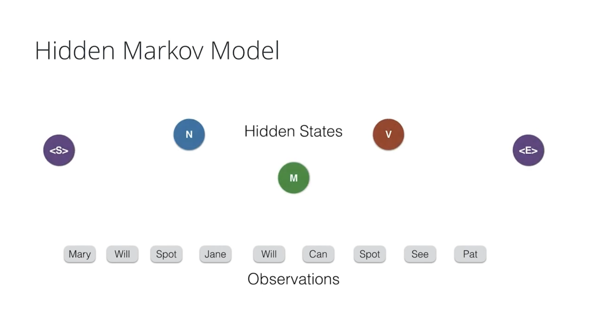
<p style="color: #555;">Figure 1: Showing the relationship between hidden states (POS tags) and observations (words).</p>
</div>

The key components that define an HMM include:

1. **Hidden States**: A finite set of states that the model can be in. In POS tagging, these are the grammatical
   categories like Noun (N), Verb (V), Modal (M), etc.
2. **Observations**: The visible outputs we can directly observe. For POS tagging, these are the words in a sentence.
3. **State Transition Probabilities**: The probability of moving from one state to another. This captures the likelihood
   of one POS tag following another.
4. **Emission Probabilities**: The probability of observing a particular output given the current state. This represents
   the likelihood of a word being used as a particular part of speech.
5. **Initial State Probabilities**: The probability of starting in each state.

The Markov assumption underpinning HMMs states that the probability of being in a current state depends only on the
previous state, not the entire history of states. Mathematically, this means:

$$P(s_t|s_1, s_2, ..., s_{t-1}) = P(s_t|s_{t-1})$$

Where $s_t$ represents the state at time $t$.

For POS tagging applications, we use examples like "Mary will see Jane" to illustrate how HMMs work. In this sentence:

- "Mary" is a Noun (N)
- "will" is a Modal verb (M)
- "see" is a Verb (V)
- "Jane" is a Noun (N)

<div align="center">
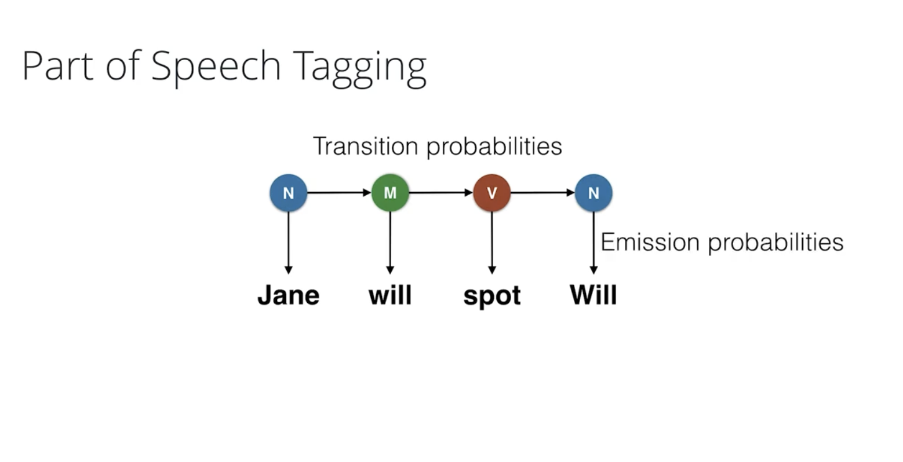
<p style="color: #555;">Figure 2: Example sentences with their corresponding POS tags shown above each word.</p>
</div>
The hidden states (POS tags) follow certain patterns in language. For instance, a modal verb is likely to be followed by
a verb, and a verb is often followed by a noun. These patterns are captured in the transition probabilities of our
model.

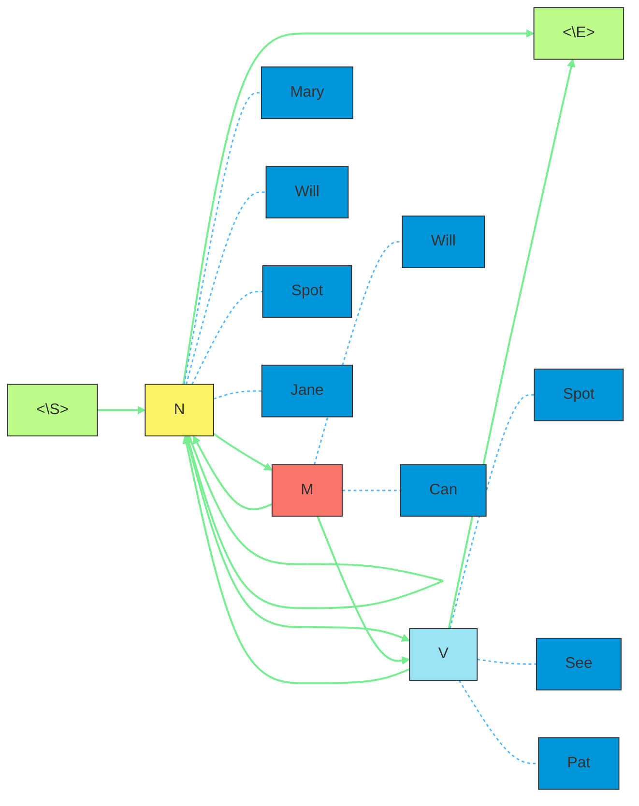
```mermaid
graph LR
    S["<\S>"] -->|" "|N
    N -->|" "|N
    N -->|" "|M
    N -->|" "|V
    N -->|" "|E["<\E>"]
    M -->|" "|N
    M -->|" "|V
    V -->|" "|N
    V -->|" "|E
    %% Emission probabilities shown as dashed lines
    N -.-|" "|Mary
    N -.-|" "|Will1[Will]
    N -.-|" "|Spot1[Spot]
    N -.-|" "|Jane
    M -.-|" "|Will2[Will]
    M -.-|" "|Can
    V -.-|" "|Spot2[Spot]
    V -.-|" "|See
    V -.-|" "|Pat

    %% Node styles
    style S fill:#BCFB89,stroke:#333,stroke-width:1px
    style E fill:#BCFB89,stroke:#333,stroke-width:1px
    style N fill:#FBF266,stroke:#333,stroke-width:1px
    style M fill:#FA756A,stroke:#333,stroke-width:1px
    style V fill:#9AE4F5,stroke:#333,stroke-width:1px
    style Mary fill:#0096D9,stroke:#333,stroke-width:1px
    style Will1 fill:#0096D9,stroke:#333,stroke-width:1px
    style Spot1 fill:#0096D9,stroke:#333,stroke-width:1px
    style Jane fill:#0096D9,stroke:#333,stroke-width:1px
    style Will2 fill:#0096D9,stroke:#333,stroke-width:1px
    style Can fill:#0096D9,stroke:#333,stroke-width:1px
    style Spot2 fill:#0096D9,stroke:#333,stroke-width:1px
    style See fill:#0096D9,stroke:#333,stroke-width:1px
    style Pat fill:#0096D9,stroke:#333,stroke-width:1px

    %% Link styles
    linkStyle 0,1,2,3,4,5,6,7,8 stroke:#79ED91,stroke-width:2px
    linkStyle 9,10,11,12,13,14,15,16,17 stroke:#57B9FF,stroke-width:1.5px,stroke-dasharray:3
```

The diagram above shows both the state transitions (solid lines) between POS tags and the emission relationships (dashed
lines) between tags and words. The structure demonstrates how certain words can only be emitted from specific states,
while transitions between states follow grammatical patterns.

By modeling language this way, we can use HMMs to determine the most likely sequence of POS tags for any given sentence,
even when words have multiple possible interpretations.

###### Understanding POS Tags and States in Hidden Markov Models

###### POS Tags - Parts of Speech Tags

POS tags (Parts of Speech tags) are linguistic labels assigned to words that identify their grammatical categories based
on their function in a sentence. These categories include:

1. **Noun (N)**: Words that represent people, places, things, or ideas (e.g., "Mary", "Jane", "Spot")
2. **Verb (V)**: Words that express actions or states of being (e.g., "see", "pat")
3. **Modal (M)**: A type of auxiliary verb that expresses necessity or possibility (e.g., "will", "can")
4. **Adjective (Adj)**: Words that describe or modify nouns
5. **Adverb (Adv)**: Words that modify verbs, adjectives, or other adverbs
6. **Preposition (Prep)**: Words that show relationships between other words (e.g., "in", "on", "at")

...and many others depending on the tagging scheme being used.

###### States in Hidden Markov Models

In the context of Hidden Markov Models (HMMs) for POS tagging, the "states" refer to the hidden part of the model -
specifically, the POS tags themselves. They are called "states" because:

1. The model transitions between these states according to certain probabilities
2. Each state can emit (or generate) observable outputs (words) with certain probabilities
3. The states themselves are not directly observable in natural language - we only see the words, not their grammatical
   roles

In the example from the document, the states are:

- Starting state `<S>` (special marker for beginning of sentence)
- Noun state (N)
- Modal verb state (M)
- Verb state (V)
- Ending state `<E>` (special marker for end of sentence)

###### The Connection Between POS Tags and States

In POS tagging with HMMs:

- POS tags = states of the HMM
- Words = observations emitted by those states
- The system moves from state to state (from one POS tag to another) based on transition probabilities
- Each state (POS tag) can generate different words based on emission probabilities

This is why the document refers to "emission probability P(w|t)" - it's the probability of a word w being emitted (or
generated) given that we're in state t (which is a specific POS tag).

For example, if we're in the Noun state (N), there might be:

- 4/9 probability of emitting "Mary"
- 2/9 probability of emitting "Jane"
- 2/9 probability of emitting "Spot"
- 1/9 probability of emitting "Will"

###### Transition and Emission Probabilities in Hidden Markov Models

###### Transition Probabilities

Transition probabilities represent the likelihood of moving from one state (POS tag) to another in the sequence.
Formally, the transition probability $P(t_j|t_i)$ is the probability of transitioning to tag $t_j$ given that we were in
tag $t_i$.

We calculate these probabilities from tagged training data using:

$$P(t_j|t_i) = \frac{\text{Count}(t_i \rightarrow t_j)}{\text{Count}(t_i)}$$

Where $\text{Count}(t_i \rightarrow t_j)$ is the number of times tag $t_i$ is followed by tag $t_j$ in the training
corpus, and $\text{Count}(t_i)$ is the total occurrences of tag $t_i$.

These probabilities capture grammatical patterns. For example, in the example:

- After a Noun (N), there's a probability $P(M|N) = \frac{1}{3}$ of transitioning to a Modal verb (M)
- After a Modal verb (M), there's a probability $P(V|M) = \frac{3}{4}$ of transitioning to a Verb (V)

###### Emission Probabilities

Emission probabilities represent how likely each word is to be generated by a particular POS tag or state. Formally, the
emission probability $P(w|t)$ is the probability of observing word $w$ given that we're in state (tag) $t$.

We calculate these from tagged training data using:

$$P(w|t) = \frac{\text{Count}(t, w)}{\text{Count}(t)}$$

Where $\text{Count}(t, w)$ is the number of times word $w$ is tagged as $t$ in the training corpus, and
$\text{Count}(t)$ is the total occurrences of tag $t$.

For instance, in our example, if we're in the Noun state (N), there's:

- Probability $P(\text{Mary}|N) = \frac{4}{9}$ of emitting "Mary"
- Probability $P(\text{Jane}|N) = \frac{2}{9}$ of emitting "Jane"

###### The Complete HMM Model

The full Hidden Markov Model for POS tagging consists of:

1. A set of states $S = {s_1, s_2, ..., s_N}$ (the POS tags)
2. A set of observations $O = {o_1, o_2, ..., o_T}$ (the words in the sentence)
3. Initial state probabilities $\pi = {\pi_i}$ where $\pi_i = P(s_i)$ is the probability of starting in state $s_i$
4. Transition probabilities $A = {a_{ij}}$ where $a_{ij} = P(s_j|s_i)$ is the probability of transitioning from state
   $s_i$ to state $s_j$
5. Emission probabilities $B = {b_i(o_k)}$ where $b_i(o_k) = P(o_k|s_i)$ is the probability of emitting observation
   $o_k$ when in state $s_i$

The joint probability of a particular sequence of states $S = s_1, s_2, ..., s_T$ and observations
$O = o_1, o_2, ..., o_T$ is:

$$P(S, O) = \pi_{s_1} \cdot b_{s_1}(o_1) \cdot \prod_{t=2}^T a_{s_{t-1},s_t} \cdot b_{s_t}(o_t)$$

For POS tagging, this becomes:

$$P(t_1, t_2, ..., t_n, w_1, w_2, ..., w_n) = P(t_1) \times P(w_1|t_1) \times \prod_{i=2}^{n} P(t_i|t_{i-1}) \times P(w_i|t_i)$$

The Viterbi algorithm then efficiently finds the most likely sequence of tags $t_1, t_2, ..., t_n$ that maximizes this
probability for a given sequence of words $w_1, w_2, ..., w_n$.

Understanding both transition probabilities (between states) and emission probabilities (from states to observations) is
essential for grasping how Hidden Markov Models effectively solve the POS tagging problem by capturing both grammatical
patterns and word usage patterns.

##### Building the Model: Emission and Transition Probabilities

To build an effective Hidden Markov Model for POS tagging, we need to estimate two key probability distributions:
emission probabilities and transition probabilities. These are derived from training data—specifically, a corpus of text
that has been manually annotated with the correct POS tags.

**Emission Probabilities**

Emission probabilities represent how likely each word is to be generated by a particular POS tag. Formally, the emission
probability $P(w|t)$ is the probability of observing word $w$ given that we're in state (tag) $t$.

We calculate these probabilities by counting how often each word appears with each tag in our training corpus, then
normalizing these counts:

$$P(w|t) = \frac{\text{Count}(t, w)}{\text{Count}(t)}$$

For example, if we have the following counts from our training data:

<div align="center">
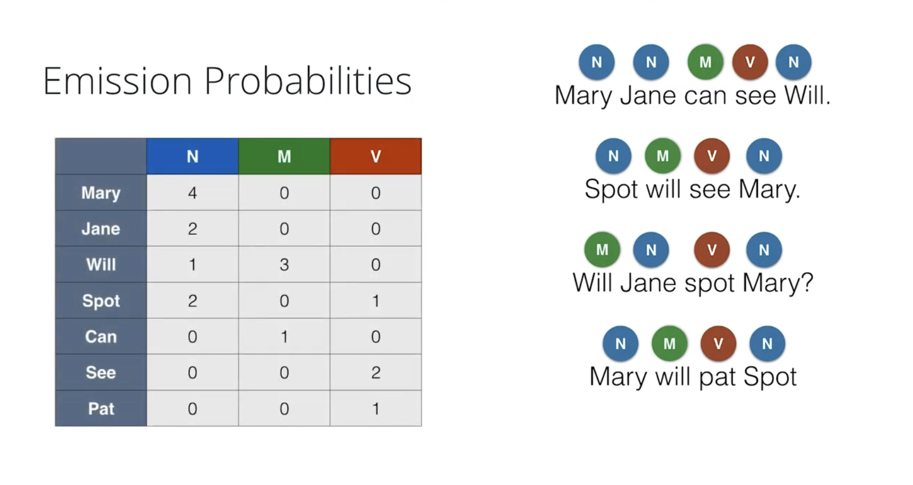
<p style="color: #555;">Figure 3: Raw emission counts showing how many times each word appears with each POS tag.</p>
</div>

We can convert these counts to probabilities by dividing by the total counts for each POS tag:

<div align="center">
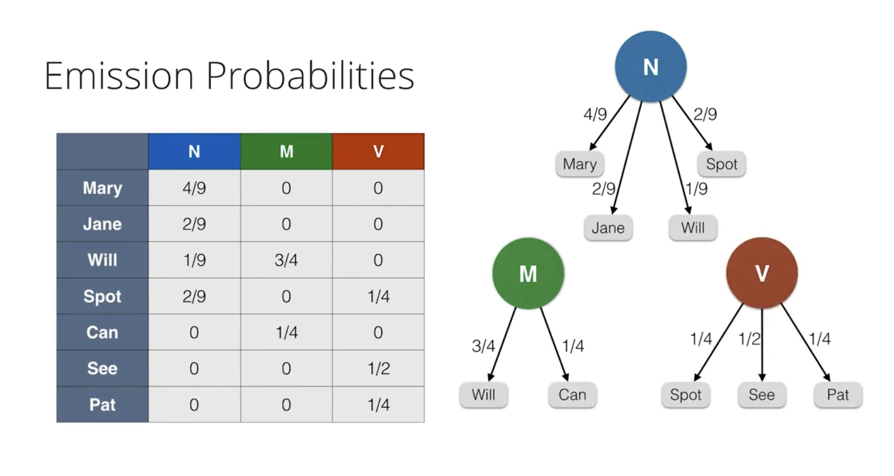
<p style="color: #555;">Figure 4: Emission probabilities calculated from the raw counts.</p>
</div>

The resulting table shows, for example, that when we have a Noun (N) tag, there's a 4/9 probability it will emit "Mary,"
a 2/9 probability for "Jane," and so on. These probabilities give us insights into how words are commonly used in
different grammatical roles.

We can visualize these emission probabilities for each state:

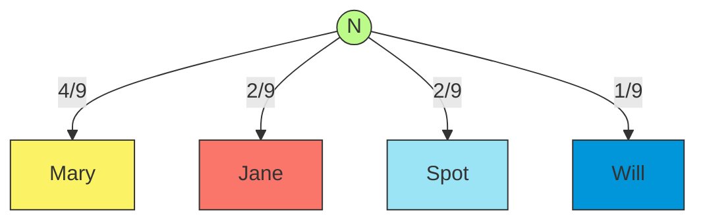
```mermaid
graph TD
    N((N)) --> |4/9| Mary
    N --> |2/9| Jane
    N --> |2/9| Spot
    N --> |1/9| Will

    style N fill:#BCFB89,stroke:#333,stroke-width:1px
    style Mary fill:#FBF266,stroke:#333,stroke-width:1px
    style Jane fill:#FA756A,stroke:#333,stroke-width:1px
    style Spot fill:#9AE4F5,stroke:#333,stroke-width:1px
    style Will fill:#0096D9,stroke:#333,stroke-width:1px
```

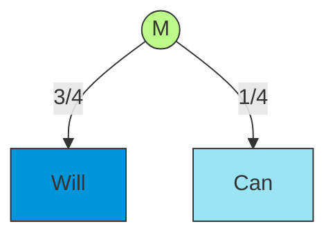
```mermaid
graph TD
    M((M)) --> |3/4| Will
    M --> |1/4| Can

    style M fill:#BCFB89,stroke:#333,stroke-width:1px
    style Can fill:#9AE4F5,stroke:#333,stroke-width:1px
    style Will fill:#0096D9,stroke:#333,stroke-width:1px
```

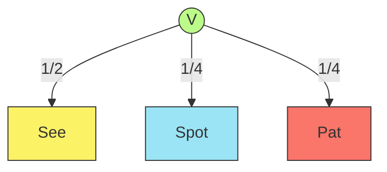
```mermaid
graph TD
    V((V)) --> |1/2| See
    V --> |1/4| Spot
    V --> |1/4| Pat

    style V fill:#BCFB89,stroke:#333,stroke-width:1px
    style See fill:#FBF266,stroke:#333,stroke-width:1px
    style Pat fill:#FA756A,stroke:#333,stroke-width:1px
    style Spot fill:#9AE4F5,stroke:#333,stroke-width:1px

```

**Transition Probabilities**

Transition probabilities capture the likelihood of moving from one POS tag to another. Formally, the transition
probability $P(t_j|t_i)$ is the probability of transitioning to tag $t_j$ given that we were in tag $t_i$.

We calculate these probabilities by counting transitions in our training corpus:

$$P(t_j|t_i) = \frac{\text{Count}(t_i \rightarrow t_j)}{\text{Count}(t_i)}$$

For a complete model, we also need to account for sentence beginnings and endings. We introduce special start `<S>` and
end `<E>` states for this purpose.

<div align="center">
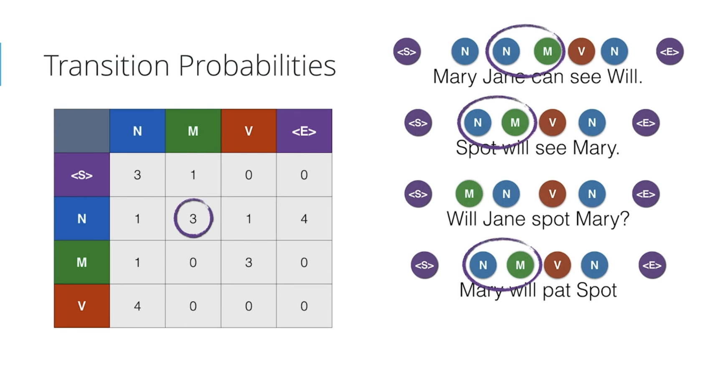
<p style="color: #555;">Figure 5: Raw transition counts between POS tags, including start and end states.</p>
</div>

Converting these counts to probabilities:

<div align="center">
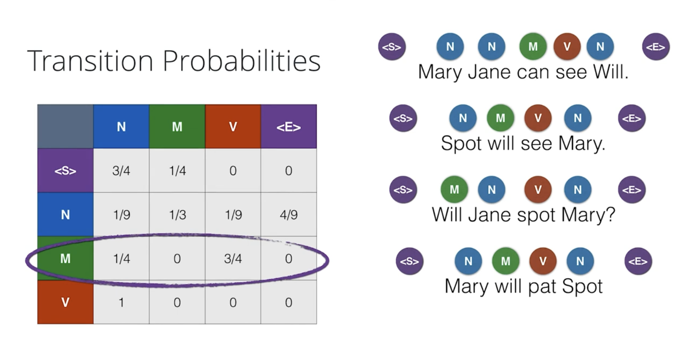
<p style="color: #555;">Figure 6: Transition probabilities calculated from the raw counts.</p>
</div>

For example, this table tells us that after a Noun (N), there's a 1/9 probability of seeing another Noun, a 1/3
probability of seeing a Modal verb (M), and so on.

The transition structure can be visualized as a directed graph:

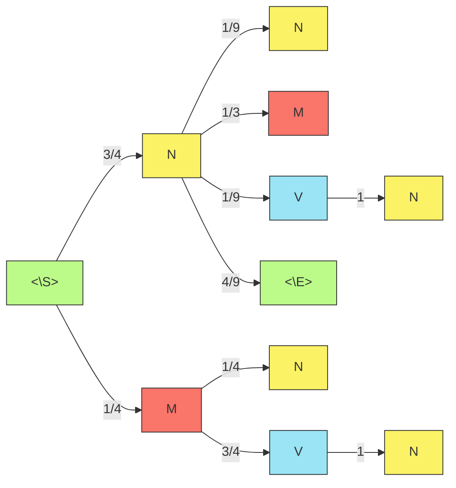
```mermaid
graph LR
    Start["<\S>"] --> |"3/4"| N1[N]
    Start --> |"1/4"| M1[M]
    N1 --> |"1/9"| N2[N]
    N1 --> |"1/3"| M2[M]
    N1 --> |"1/9"| V1[V]
    N1 --> |"4/9"| End["<\E>"]
    M1 --> |"1/4"| N3[N]
    M1 --> |"3/4"| V2[V]
    V1 --> |"1"| N4[N]
    V2 --> |"1"| N5[N]

    style Start fill:#BCFB89,stroke:#333,stroke-width:1px
    style End fill:#BCFB89,stroke:#333,stroke-width:1px
    style N1 fill:#FBF266,stroke:#333,stroke-width:1px
    style N2 fill:#FBF266,stroke:#333,stroke-width:1px
    style N3 fill:#FBF266,stroke:#333,stroke-width:1px
    style N4 fill:#FBF266,stroke:#333,stroke-width:1px
    style N5 fill:#FBF266,stroke:#333,stroke-width:1px
    style M1 fill:#FA756A,stroke:#333,stroke-width:1px
    style M2 fill:#FA756A,stroke:#333,stroke-width:1px
    style V1 fill:#9AE4F5,stroke:#333,stroke-width:1px
    style V2 fill:#9AE4F5,stroke:#333,stroke-width:1px
```

<div align="center">
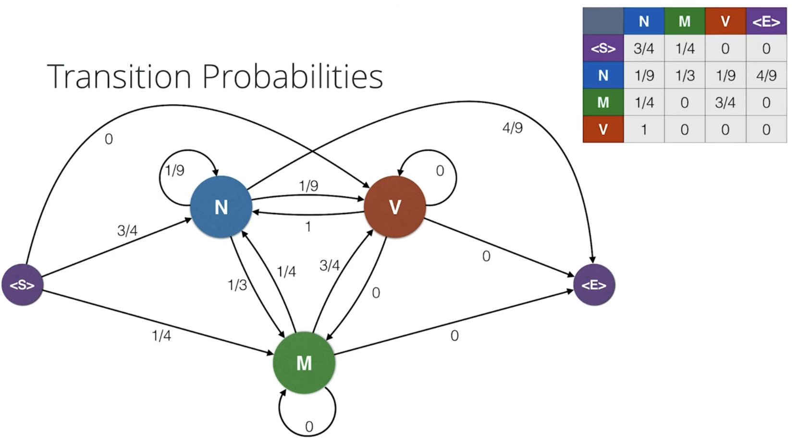
<p style="color: #555;">Figure 7: Transition probability graph showing the likelihood of moving between different POS tags.</p>
</div>

**Complete HMM Representation**

Combining both emission and transition probabilities gives us a complete HMM for POS tagging:

<div align="center">
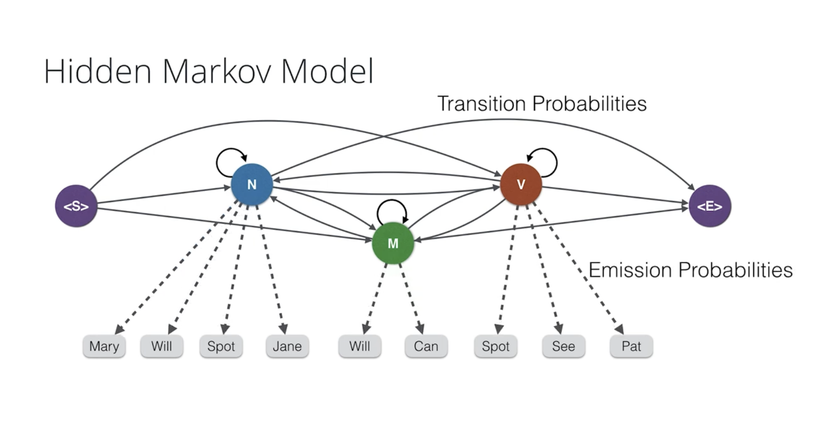
<p style="color: #555;">Figure 8: Complete Hidden Markov Model showing both transition and emission probabilities.</p>
</div>

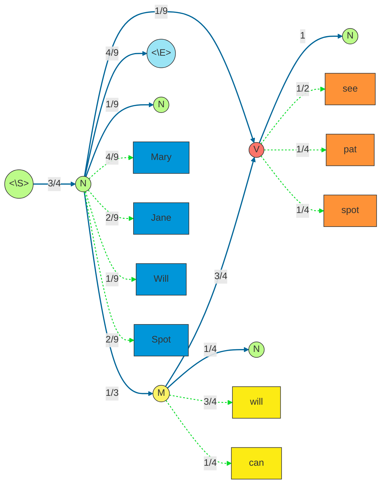
```mermaid
graph LR
    %% States
    Start(("<\S>"))
    N((N))
    M((M))
    V((V))
    End(("<\E>"))
    %% Transitions
    Start -->|"3/4"| N
    N -->|"1/3"| M
    N -->|"1/9"| V
    N -->|"4/9"| End
    N -->|"1/9"| N2((N))
    M -->|"1/4"| N3((N))
    M -->|"3/4"| V
    V -->|"1"| N4((N))
    %% Emissions
    N --> |"4/9"| Mary["Mary"]
    N --> |"2/9"| Jane["Jane"]
    N --> |"1/9"| Will1["Will"]
    N --> |"2/9"| Spot1["Spot"]
    M --> |"3/4"| Will2["will"]
    M --> |"1/4"| Can["can"]
    V --> |"1/2"| See["see"]
    V --> |"1/4"| Pat["pat"]
    V --> |"1/4"| Spot2["spot"]

    style Start fill:#BCFB89,stroke:#333,stroke-width:1px
    style N fill:#BCFB89,stroke:#333,stroke-width:1px
    style M fill:#FBF266,stroke:#333,stroke-width:1px
    style V fill:#FA756A,stroke:#333,stroke-width:1px
    style End fill:#9AE4F5,stroke:#333,stroke-width:1px
    style N2 fill:#BCFB89,stroke:#333,stroke-width:1px
    style N3 fill:#BCFB89,stroke:#333,stroke-width:1px
    style N4 fill:#BCFB89,stroke:#333,stroke-width:1px
    style Mary fill:#0096D9,stroke:#333,stroke-width:1px
    style Jane fill:#0096D9,stroke:#333,stroke-width:1px
    style Will1 fill:#0096D9,stroke:#333,stroke-width:1px
    style Spot1 fill:#0096D9,stroke:#333,stroke-width:1px
    style Will2 fill:#FCEB14,stroke:#333,stroke-width:1px
    style Can fill:#FCEB14,stroke:#333,stroke-width:1px
    style See fill:#FE9237,stroke:#333,stroke-width:1px
    style Pat fill:#FE9237,stroke:#333,stroke-width:1px
    style Spot2 fill:#FE9237,stroke:#333,stroke-width:1px

    %% Link styles
    linkStyle 0,1,2,3,4,5,6,7 stroke:#006699,stroke-width:2px
    linkStyle 8,9,10,11,12,13,14,15,16 stroke:#0CDC2A,stroke-width:1.5px,stroke-dasharray:3
```

This visualization shows both the hidden layer (POS tags) with their transition probabilities and how these hidden
states connect to the observable layer (words) through emission probabilities.

With this model fully defined, we can use it to:

1. Calculate the probability of a given sequence of words and tags
2. Find the most likely sequence of tags for a given sequence of words (the POS tagging task)
3. Learn the model parameters from untagged data

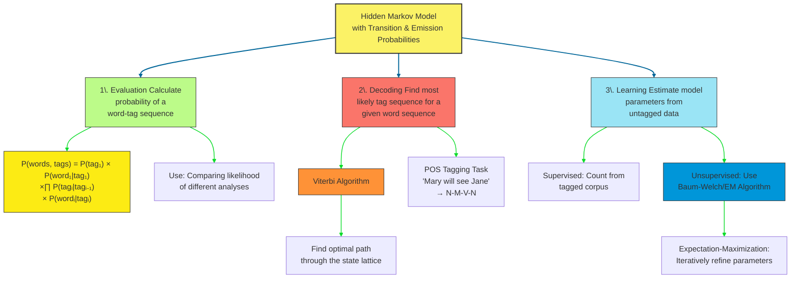
```mermaid
graph TD
    HMM[Hidden Markov Model\nwith Transition & Emission Probabilities]

    %% Three main applications
    HMM --> Eval[1\. Evaluation Calculate <br>probability of a <br>word-tag sequence]
    HMM --> Decode["2\. Decoding Find most <br>likely tag sequence for a <br>given word sequence"]
    HMM --> Learn["3\. Learning Estimate model <br>parameters from <br>untagged data"]

    %% Evaluation details
    Eval --> EvalFormula["P(words, tags) = P(tag₁) × P(word₁|tag₁)<br> ×∏ P(tagᵢ|tagᵢ₋₁) <br>× P(wordᵢ|tagᵢ)"]
    Eval --> EvalUse["Use: Comparing likelihood<br>of different analyses"]

    %% Decoding details
    Decode --> VitAlg[Viterbi Algorithm]
    Decode --> POSTask["POS Tagging Task <br>'Mary will see Jane'<br>→ N-M-V-N"]
    VitAlg --> FindPath[Find optimal path <br>through the state lattice]

    %% Learning details
    Learn --> Supervised[Supervised: Count from<br>tagged corpus]
    Learn --> Unsupervised[Unsupervised: Use<br>Baum-Welch/EM Algorithm]
    Unsupervised --> EM[Expectation-Maximization:<br>Iteratively refine parameters]

    %% Styling
    style HMM fill:#FBF266,stroke:#333,stroke-width:2px
    style Eval fill:#BCFB89,stroke:#333,stroke-width:1px
    style Decode fill:#FA756A,stroke:#333,stroke-width:1px
    style Learn fill:#9AE4F5,stroke:#333,stroke-width:1px
    style EvalFormula fill:#FCEB14,stroke:#333,stroke-width:1px
    style VitAlg fill:#FE9237,stroke:#333,stroke-width:1px
    style Unsupervised fill:#0096D9,stroke:#333,stroke-width:1px

    %% Link styles
    linkStyle 0,1,2 stroke:#006699,stroke-width:2px
    linkStyle 3,4,5,6,7,8,9,10 stroke:#0CDC2A,stroke-width:1.5px
```

For example, we can calculate the probability of the sequence "Mary will see Will" with tags N-M-V-N using:

$$P(\text{Mary, will, see, Will}, \text{N, M, V, N}) = P(S \rightarrow N) \times P(\text{Mary}|N) \times P(N \rightarrow M) \times P(\text{will}|M) \times P(M \rightarrow V) \times P(\text{see}|V) \times P(V \rightarrow N) \times P(\text{Will}|N) \times P(N \rightarrow E)$$

$$= \frac{3}{4} \times \frac{4}{9} \times \frac{1}{3} \times \frac{3}{4} \times \frac{3}{4} \times \frac{1}{2} \times 1 \times \frac{1}{9} \times \frac{4}{9}$$

This approach forms the foundation for using HMMs to automatically tag sentences with their correct parts of speech.

##### The Viterbi Algorithm: Finding Optimal Tag Sequences

While we can calculate the probability of a specific tag sequence given a sentence, the real challenge in POS tagging is
finding the most likely sequence of tags for any given sentence. With multiple possible tags for each word, the number
of potential tag sequences grows exponentially with sentence length. For a sentence with n words and t possible tags for
each word, there are t^n possible tag sequences.

The Viterbi algorithm efficiently solves this problem using dynamic programming, avoiding the need to evaluate all
possible sequences. The algorithm finds the most likely sequence of hidden states (POS tags) that could have generated
the observed sequence of words.

**Problem Formulation**

For a sentence with words [w₁, w₂, ..., wₙ], we want to find the tag sequence [t₁, t₂, ..., tₙ] that maximizes:

$$P(t_1, t_2, ..., t_n | w_1, w_2, ..., w_n)$$

Using Bayes' rule and removing the constant denominator (which doesn't affect which sequence is most probable), we need
to maximize:

$$P(w_1, w_2, ..., w_n | t_1, t_2, ..., t_n) \times P(t_1, t_2, ..., t_n)$$

With the HMM assumptions, this becomes:

$$P(t_1, t_2, ..., t_n, w_1, w_2, ..., w_n) = P(t_1) \times P(w_1|t_1) \times \prod_{i=2}^{n} P(t_i|t_{i-1}) \times P(w_i|t_i)$$

**The Viterbi Algorithm Steps**

The algorithm works as follows:

1. **Initialization**: For each possible POS tag s for the first word:
    - Calculate probability: δ₁(s) = P(start→s) × P(w₁|s)
    - This accounts for the initial transition probability and emission probability
2. **Recursion**: For positions i = 2 to n, and for each possible POS tag s at position i:
    - Calculate: δᵢ(s) = max\_{s'} [δᵢ₋₁(s') × P(s'→s) × P(wᵢ|s)]
    - Where s' ranges over all possible POS tags at position i-1
    - Store the argument that maximizes this value as ψᵢ(s)
    - This represents the most likely previous tag leading to the current tag
3. **Termination**: Find the most likely final state:
    - tₙ = argmax\_{s} [δₙ(s) × P(s→end)]
    - This includes the transition to the end state
4. **Backtracking**: Reconstruct the most likely sequence:
    - Starting from tₙ, use the stored ψᵢ values to trace back the optimal path:
    - tᵢ₋₁ = ψᵢ(tᵢ) for i = n down to 2

<div align="center">
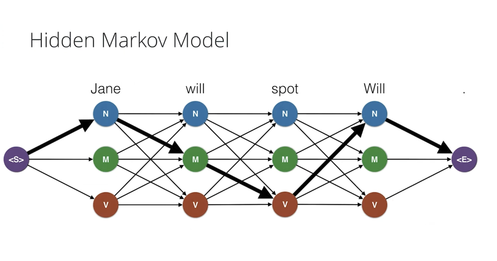
<p style="color: #555;">Figure 9: Viterbi trellis diagram showing all possible paths through the HMM for a given sentence.</p>
</div>

**Example: Tagging "Jane will spot Will"**

Let's apply the Viterbi algorithm to the sentence "Jane will spot Will" using our HMM model from earlier.

First, we consider all possible POS tag combinations for this sentence. With 3 possible tags (N, M, V) and 4 words, we
have 3⁴ = 81 possible tag sequences:

<div align="center">
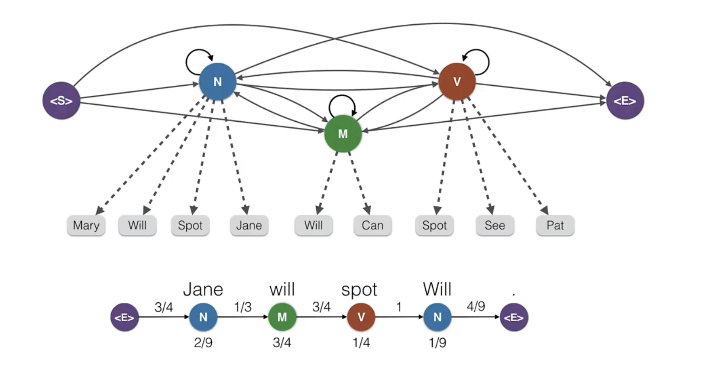
<p style="color: #555;">Figure 10: All 81 possible POS tag combinations for the sentence "Jane will spot Will".</p>
</div>

However, many of these combinations have zero probability because:

1. Some words can only be emitted from certain states (e.g., "Jane" can only be a Noun)
2. Some transitions between tags never occur in our training data

The Viterbi algorithm efficiently finds the most likely path without evaluating all possibilities.

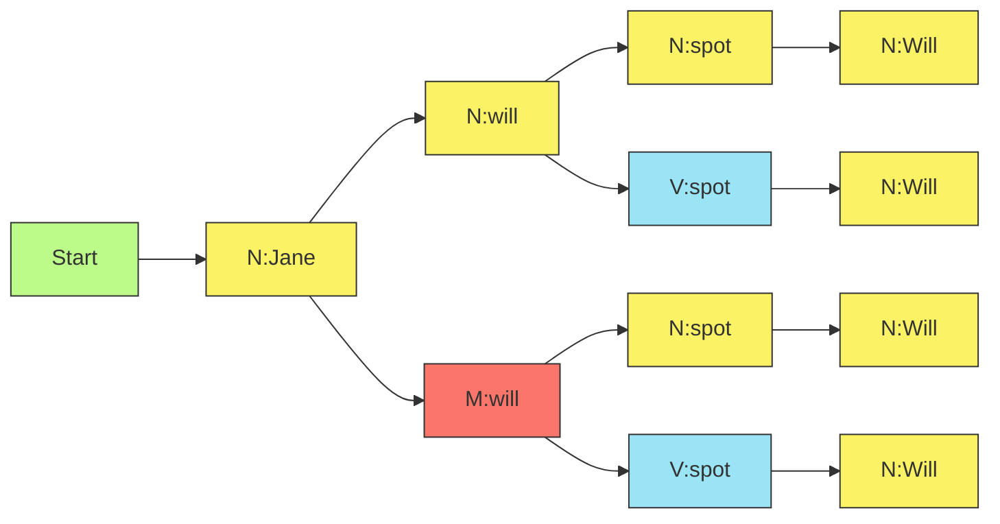
```mermaid
graph LR
    Start --> N1[N:Jane]
    N1 --> N2[N:will]
    N1 --> M1[M:will]
    N2 --> N3[N:spot]
    N2 --> V1[V:spot]
    M1 --> N4[N:spot]
    M1 --> V2[V:spot]
    N3 --> N5[N:Will]
    V1 --> N6[N:Will]
    N4 --> N7[N:Will]
    V2 --> N8[N:Will]

    style Start fill:#BCFB89,stroke:#333,stroke-width:1px
    style N1 fill:#FBF266,stroke:#333,stroke-width:1px
    style N2 fill:#FBF266,stroke:#333,stroke-width:1px
    style M1 fill:#FA756A,stroke:#333,stroke-width:1px
    style N3 fill:#FBF266,stroke:#333,stroke-width:1px
    style V1 fill:#9AE4F5,stroke:#333,stroke-width:1px
    style N4 fill:#FBF266,stroke:#333,stroke-width:1px
    style V2 fill:#9AE4F5,stroke:#333,stroke-width:1px
    style N5 fill:#FBF266,stroke:#333,stroke-width:1px
    style N6 fill:#FBF266,stroke:#333,stroke-width:1px
    style N7 fill:#FBF266,stroke:#333,stroke-width:1px
    style N8 fill:#FBF266,stroke:#333,stroke-width:1px
```

The diagram above shows the possible paths that have non-zero probability. Let's trace through the Viterbi algorithm:

**1. Initialization**: For the first word "Jane":

- δ₁(N) = P(start→N) × P("Jane"|N) = 3/4 × 2/9 = 1/6
- δ₁(M) = P(start→M) × P("Jane"|M) = 1/4 × 0 = 0
- δ₁(V) = P(start→V) × P("Jane"|V) = 0 × 0 = 0

Since "Jane" can only be a Noun, we only have one possibility after the first word.

<div align="center">
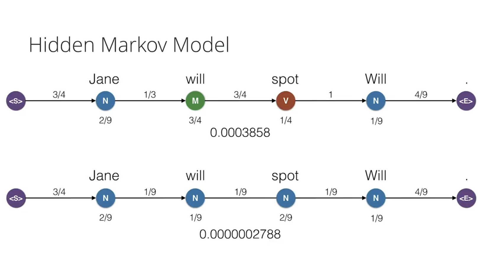
<p style="color: #555;">Figure 11: Starting the Viterbi algorithm with initialization for the first word.</p>
</div>

**2. Recursion**: For the second word "will":

- For tag N:
    - From N: δ₂(N) = δ₁(N) × P(N→N) × P("will"|N) = 1/6 × 1/9 × 0 = 0
    - From M: δ₂(N) = δ₁(M) × P(M→N) × P("will"|N) = 0 × 1/4 × 0 = 0
    - From V: δ₂(N) = δ₁(V) × P(V→N) × P("will"|N) = 0 × 1 × 0 = 0
- For tag M:
    - From N: δ₂(M) = δ₁(N) × P(N→M) × P("will"|M) = 1/6 × 1/3 × 3/4 = 1/24
    - From M: δ₂(M) = δ₁(M) × P(M→M) × P("will"|M) = 0 × 0 × 3/4 = 0
    - From V: δ₂(M) = δ₁(V) × P(V→M) × P("will"|M) = 0 × 0 × 3/4 = 0
- For tag V: All paths have zero probability

After the second word, the only possible path with non-zero probability is N→M.

We continue this process for the words "spot" and "Will" to get the complete trellis:

<div align="center">
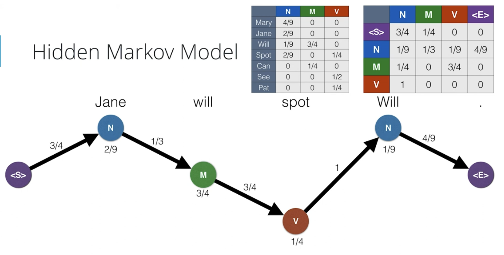
<p style="color: #555;">Figure 12: Complete Viterbi trellis showing the computation of probabilities for all paths.</p>
</div>

**3. Comparing the Final Paths**:

After computing all paths, we have four possible complete tag sequences with non-zero probability:

<div align="center">
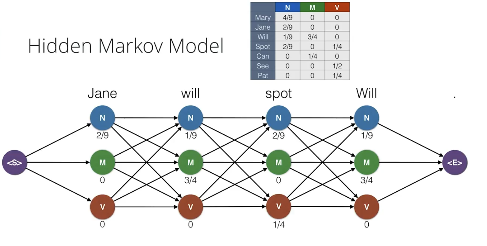
<p style="color: #555;">Figure 13: Final probability calculations for the four viable POS tag sequences.</p>
</div>

1. N → N → N → N (all nouns)
    - Probability = 0.0000002788
2. N → M → N → N (modal for "will")
    - Probability = 0.000127
3. N → N → V → N (verb for "spot")
    - Probability = 0.00000282
4. N → M → V → N (modal for "will", verb for "spot")
    - Probability = 0.000385

<div align="center">
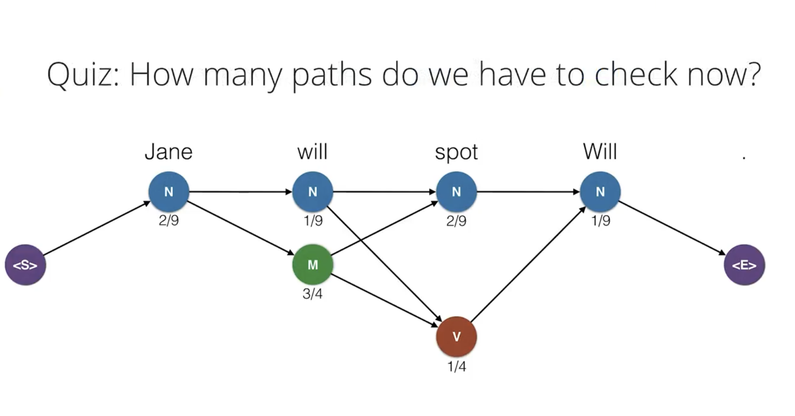
<p style="color: #555;">Figure 14: Comparison of probabilities for the four possible tagging sequences.</p>
</div>

**4. Result**:

The path N → M → V → N has the highest probability (0.000385), so it's our answer:

- "Jane" - Noun (N)
- "will" - Modal verb (M)
- "spot" - Verb (V)
- "Will" - Noun (N)

<div align="center">
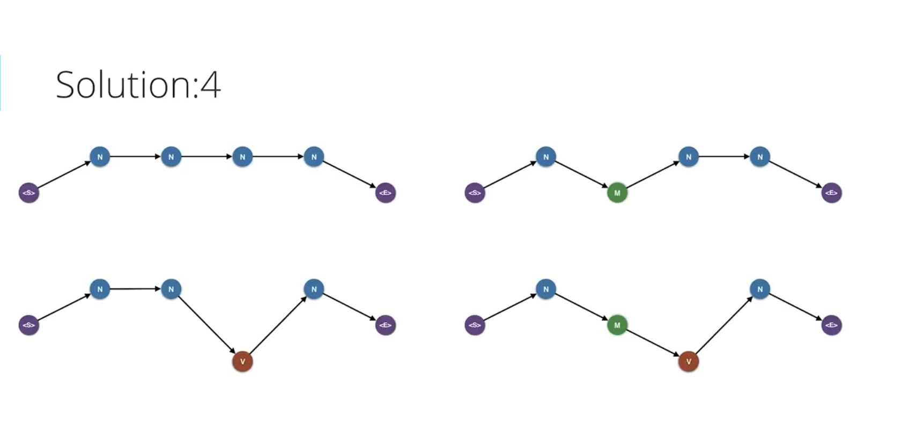
<p style="color: #555;">Figure 15: The final optimal path determined by the Viterbi algorithm.</p>
</div>

This matches our linguistic intuition about the correct POS tags for this sentence.

The Viterbi algorithm demonstrates the power of dynamic programming in solving what would otherwise be an intractable
problem. By keeping track of the most likely path to each state at each position, we avoid the exponential explosion of
having to check all possible tag sequences.

<div align="center">
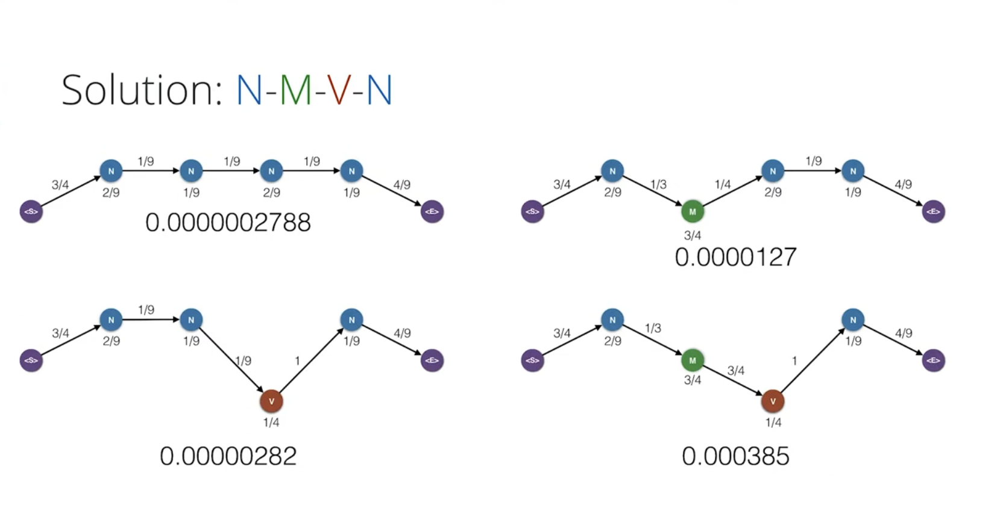
<p style="color: #555;">Figure 16: Visual representation of the Viterbi algorithm's step-by-step process.</p>
</div>

<div align="center">
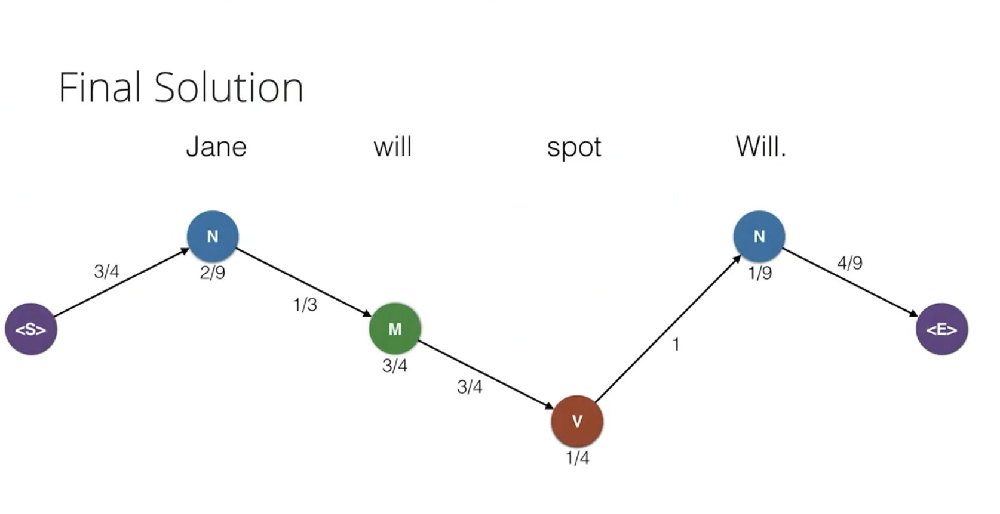
<p style="color: #555;">Figure 17: Detailed probability calculations at each step of the Viterbi algorithm.</p>
</div>

The practical implementation typically uses logarithms of probabilities to avoid numerical underflow issues when
multiplying many small probabilities, but the core algorithm remains the same.

<div align="center">
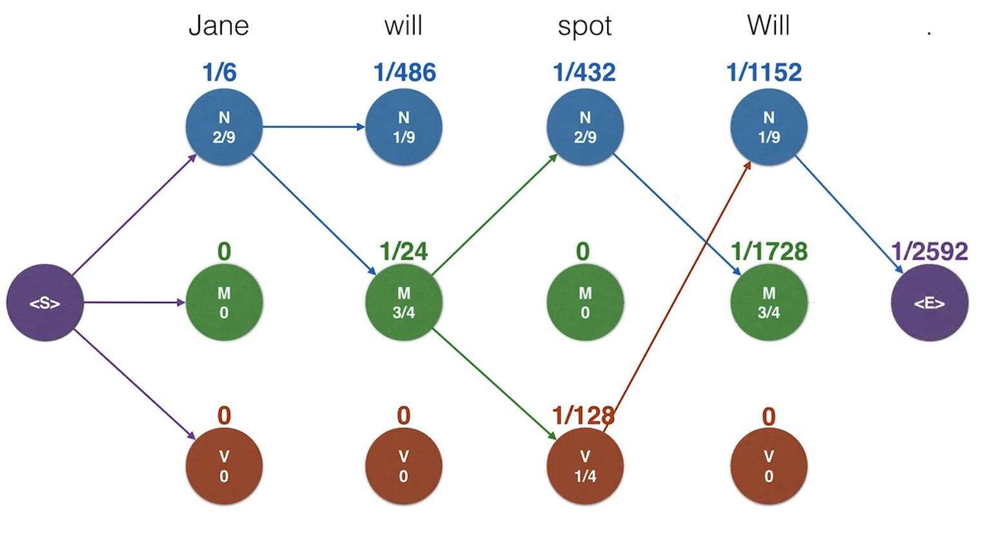
<p style="color: #555;">Figure 18: Complete Hidden Markov Model showing both transition and emission probabilities.</p>
</div>

##### Forward-Backward Algorithm and Posterior Probabilities

While the Viterbi algorithm finds the single most likely sequence of POS tags, it doesn't tell us about the certainty of
each tag assignment or alternative possibilities. The Forward-Backward algorithm addresses this limitation by computing
the probability distribution over all possible tags for each word position.

<div align="center">
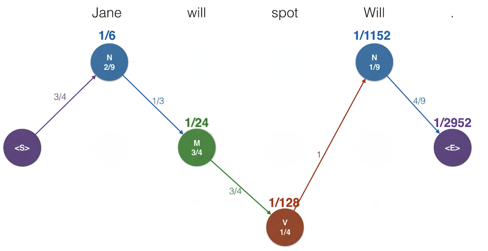
<p style="color: #555;">Figure 19: Complete Hidden Markov Model showing both transition and emission probabilities.</p>
</div>

The Forward-Backward algorithm consists of two main passes through the observation sequence:

1. **Forward Pass (α)**: Computes the probability of observing the partial sequence up to time t and being in a
   particular state at time t.
2. **Backward Pass (β)**: Computes the probability of observing the remainder of the sequence given that we're in a
   particular state at time t.

These two passes are then combined to compute the posterior probability of being in each state at each position,
considering all possible paths through the sequence.

**Forward Pass**

The forward variable α_t(s) represents the probability of observing the sequence w₁, w₂, ..., wₜ and ending in state s
at position t:

$$\alpha_t(s) = P(w_1, w_2, ..., w_t, s_t = s)$$

We calculate it recursively:

1. **Initialization**: $$\alpha_1(s) = P(s|start) \times P(w_1|s)$$
2. **Recursion**: $$\alpha_t(s) = \sum_{s'} \alpha_{t-1}(s') \times P(s|s') \times P(w_t|s)$$
3. **Termination**: $$P(w_1, w_2, ..., w_n) = \sum_s \alpha_n(s) \times P(end|s)$$

The sum in the recursion step is over all possible previous states s'. This differs from the Viterbi algorithm, which
takes the maximum instead of the sum.

**Backward Pass**

The backward variable β_t(s) represents the probability of observing the sequence wₜ₊₁, wₜ₊₂, ..., wₙ given that we're
in state s at position t:

$$\beta_t(s) = P(w_{t+1}, w_{t+2}, ..., w_n | s_t = s)$$

We calculate it recursively, but working backward from the end of the sequence:

1. **Initialization**: $$\beta_n(s) = P(end|s)$$
2. **Recursion**: $$\beta_t(s) = \sum_{s'} P(s'|s) \times P(w_{t+1}|s') \times \beta_{t+1}(s')$$

**Posterior Probability Calculation**

Once we have the forward and backward variables, we can compute the posterior probability of being in state s at
position t, given the entire observation sequence:

$$P(s_t = s | w_1, w_2, ..., w_n) = \frac{\alpha_t(s) \times \beta_t(s)}{P(w_1, w_2, ..., w_n)}$$

Since the denominator is constant for all states at position t, we can normalize the posterior probabilities to ensure
they sum to 1 across all possible states at each position.

<div align="center">
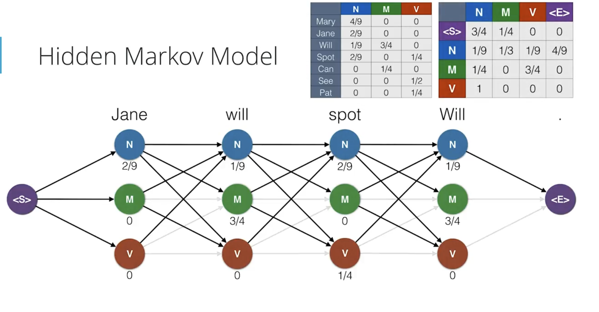
<p style="color: #555;">Figure 20: Forward-Backward algorithm computing posterior probabilities for each position in the sequence.</p>
</div>

**Applications of the Forward-Backward Algorithm**

The Forward-Backward algorithm has several important applications in POS tagging:

1. **Uncertainty Representation**: It provides a complete probability distribution over tags for each word, not just the
   most likely tag. For example, for the word "spot," we might get:
    - P(spot = N | sentence) = 0.15
    - P(spot = V | sentence) = 0.85
    - P(spot = M | sentence) = 0.00
2. **Confidence Estimation**: The posterior probabilities can serve as confidence measures for tag assignments,
   highlighting ambiguous cases that might need further attention.
3. **Parameter Learning**: The Forward-Backward algorithm is a key component of the Baum-Welch algorithm, which can
   learn the transition and emission probabilities from untagged text through an iterative process of
   expectation-maximization.
4. **Smoothing**: In applications where we want to consider alternative interpretations, these probabilities allow us to
   make more nuanced decisions than the single best path from Viterbi.

**Differences from Viterbi**

The key distinction between Viterbi and Forward-Backward is their objective:

- **Viterbi**: Finds the single most likely state sequence by maximizing the joint probability P(states, observations).
- **Forward-Backward**: Computes marginal probabilities P(state_t | observations) for each state at each time.

Mathematically, this is reflected in:

- Viterbi's use of max operations (to find the best single path)
- Forward-Backward's use of sum operations (to account for all possible paths)

While Viterbi answers "What's the most likely sequence of tags?", Forward-Backward answers "What's the probability of
each tag at each position, considering all possible tag sequences?"

<div align="center">
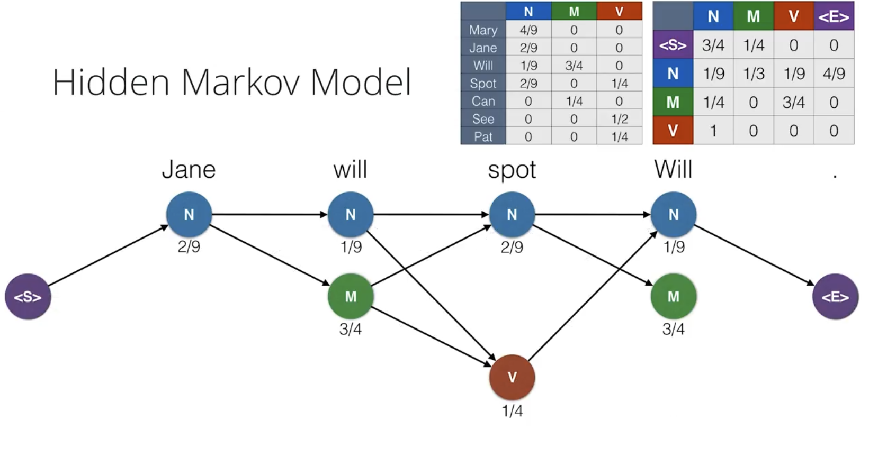
<p style="color: #555;">Figure 21: Comparison between Viterbi (finding best path) and Forward-Backward (computing probabilities).</p>
</div>

Both algorithms share similar dynamic programming structures but serve complementary purposes in POS tagging
applications.

##### Practical Implementation and Handling of Edge Cases

Implementing an HMM-based POS tagger for real-world applications requires addressing several practical challenges beyond
the core algorithms. These include handling unknown words, dealing with sparse data, optimizing performance, and
integrating the tagger into broader NLP pipelines.

**Handling Unknown Words**

One of the most significant challenges in POS tagging is dealing with words that weren't seen during training
(out-of-vocabulary or OOV words). Several strategies can address this:

1. **Feature-Based Approaches**: Extract morphological and orthographic features from unknown words, such as:

    - Prefixes and suffixes (e.g., words ending in "-ly" are often adverbs)
    - Capitalization patterns (capitalized words mid-sentence are likely proper nouns)
    - Presence of numbers or special characters
    - Word shape features (patterns of upper/lowercase, digits, etc.)

    Example implementation:

    ```python
    def extract_word_features(word):
        features = {}
        features["suffix3"] = word[-3:] if len(word) > 3 else word
        features["suffix2"] = word[-2:] if len(word) > 2 else word
        features["prefix2"] = word[:2] if len(word) > 2 else word
        features["isCapitalized"] = word[0].isupper()
        features["hasHyphen"] = "-" in word
        features["hasDigit"] = any(char.isdigit() for char in word)
        return features
    ```

2. **Unknown Word Model**: Create a special "UNK" token during training by replacing infrequent words, then estimate
   emission probabilities for this token.

3. **Open Class Categories**: Assign higher probabilities for unknown words to be open class words (nouns, verbs,
   adjectives, adverbs) than closed class words (determiners, prepositions, conjunctions).

4. **Word Embeddings**: For more advanced systems, use word embeddings to find similar known words and inherit their tag
   distributions.

**Smoothing Techniques**

To address the sparsity problem and avoid zero probabilities, various smoothing techniques are employed:

1. **Laplace (Add-One) Smoothing**: Add one to all counts before normalizing:
   $$P_{smoothed}(w|t) = \frac{Count(t, w) + 1}{Count(t) + V}$$ Where V is the vocabulary size.

2. **Add-k Smoothing**: Similar to Laplace but with a smaller constant:
   $$P_{smoothed}(w|t) = \frac{Count(t, w) + k}{Count(t) + k \times V}$$ Where k is typically a small value like 0.1 or
   0.01.

3. **Good-Turing Smoothing**: Reallocates probability mass based on the frequency of frequencies.

4. **Backoff Models**: When a specific n-gram has insufficient data, back off to a lower-order model:

    ```
    if Count(t1, t2, t3) > threshold:
        use P(t3|t1,t2)
    else:
        use P(t3|t2) with a backoff weight
    ```

5. **Interpolation**: Combine probabilities from higher and lower-order models:
   $$P(t_3|t_1,t_2) = \lambda_1 P(t_3|t_1,t_2) + \lambda_2 P(t_3|t_2) + \lambda_3 P(t_3)$$ Where λ₁ + λ₂ + λ₃ = 1

**Implementation Optimizations**

For large-scale or real-time applications, several optimizations can improve efficiency:

1. Beam Search:

    Instead of tracking all possible state sequences, only maintain the k most probable paths at each step:

```python
     def viterbi_beam_search(sentence, model, beam_width=5):
         paths = [{"tags": ["<START>"], "prob": 1.0}]
         for word in sentence:
             new_paths = []
             for path in paths:
                 last_tag = path["tags"][-1]
                 for next_tag in model.tags:
                     prob = path["prob"] * model.transition_prob(last_tag, next_tag) * model.emission_prob(next_tag, word)
                     new_paths.append({"tags": path["tags"] + [next_tag], "prob": prob})
             # Keep only the top-k paths
             paths = sorted(new_paths, key=lambda x: x["prob"], reverse=True)[:beam_width]
         return paths[0]  # Return the most probable path
```

2. **Log Probabilities**: Work with log probabilities to prevent numerical underflow when multiplying many small
   probabilities:

```python
# Instead of: prob = prob1 * prob2 * prob3
log_prob = log_prob1 + log_prob2 + log_prob3
```

3. **Pruning**: Eliminate paths with probabilities below a certain threshold:

```python
if log_prob < best_log_prob - threshold:
    continue  # Skip this path
```

4. **Sparse Representations**: Use sparse matrices or dictionaries for transition and emission probabilities, storing
   only non-zero values.

**Handling of Edge Cases**

Several edge cases require special attention for robust POS tagging:

1. **Sentence Boundaries**: Special handling for the beginning and end of sentences, which often have unique
   distribution patterns.
2. **Punctuation**: Treating punctuation marks as tokens with their own tag or preprocessing to handle them separately.
3. **Multiword Expressions**: Phrases like "in spite of" or "New York" that function as single units despite comprising
   multiple words.
4. **Ambiguous Words**: Words with multiple possible tags depending on context, such as:
    - "book" (noun: "I read a book" vs. verb: "Book a hotel")
    - "present" (noun, verb, or adjective)
    - Homographs like "lead" (metal vs. to guide)
5. **Domain-Specific Terminology**: Technical terms, slang, or domain-specific usage that doesn't follow typical
   patterns.

**Evaluation and Error Analysis**

For practical POS tagging applications, thorough evaluation is essential:

1. **Accuracy Metrics**: Beyond overall accuracy, analyze performance on:

    - Per-tag precision, recall, and F1 scores
    - Performance on unknown words
    - Accuracy on ambiguous words
    - Specific error patterns

2. **Confusion Matrix**: Identify which tags are frequently confused with each other:

    ```
    Predicted ↓ | Actual →  | Noun | Verb | Adj | ...
    Noun         |  1250  |  78  |  45  | ...
    Verb         |   65   | 1045 |  12  | ...
    Adj          |   42   |  23  | 890  | ...
    ```

3. **Cross-Validation**: Use k-fold cross-validation to ensure model robustness across different data splits.

4. **Error Analysis**: Manually review a sample of errors to identify patterns and potential improvements:

    ```python
    def analyze_errors(gold_tags, predicted_tags, words):
        errors = []
        for i in range(len(gold_tags)):
            if gold_tags[i] != predicted_tags[i]:
                errors.append({
                    "word": words[i],
                    "context": words[max(0, i-2):min(len(words), i+3)],
                    "gold": gold_tags[i],
                    "predicted": predicted_tags[i]
                })
        return errors
    ```

**Integration with NLP Pipelines**

In practical applications, POS taggers are typically part of larger NLP pipelines:

1. **Preprocessing**: Sentence segmentation, tokenization, and normalization before POS tagging.
2. **Postprocessing**: Using POS tags to inform downstream tasks like:
    - Syntactic parsing
    - Named entity recognition
    - Word sense disambiguation
    - Information extraction
3. **Iterative Refinement**: Using feedback from later stages to refine POS tags in an iterative process.

<div align="center">
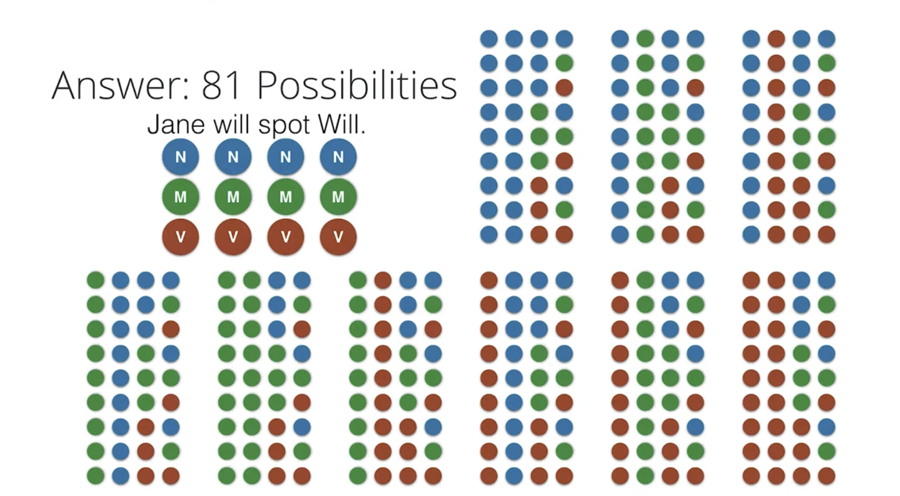
<p style="color: #555;">Figure 22: Example of an NLP pipeline integrating POS tagging with other language processing components.</p>
</div>

**Code Example: Basic HMM POS Tagger Implementation**

Here's a simplified implementation of an HMM-based POS tagger:

```python
class HMMTagger:
    def __init__(self):
        self.tag_set = set()
        self.word_to_idx = {}
        self.tag_to_idx = {}
        self.emission_probs = {}  # P(word|tag)
        self.transition_probs = {}  # P(tag_i|tag_{i-1})
        self.initial_probs = {}  # P(tag|START)
        self.final_probs = {}  # P(END|tag)

    def train(self, tagged_sentences):
        # Count occurrences for emission and transition probabilities
        emission_counts = {}
        transition_counts = {}
        tag_counts = {}
        initial_counts = {}
        final_counts = {}

        # Build vocabulary and count statistics
        for sentence in tagged_sentences:
            prev_tag = "<START>"
            for word, tag in sentence:
                # Update tag set and counts
                self.tag_set.add(tag)
                tag_counts[tag] = tag_counts.get(tag, 0) + 1

                # Update word-to-tag counts (emissions)
                if (tag, word) not in emission_counts:
                    emission_counts[(tag, word)] = 0
                emission_counts[(tag, word)] += 1

                # Update tag transition counts
                if (prev_tag, tag) not in transition_counts:
                    transition_counts[(prev_tag, tag)] = 0
                transition_counts[(prev_tag, tag)] += 1

                # Update initial counts if this is the first word
                if prev_tag == "<START>":
                    initial_counts[tag] = initial_counts.get(tag, 0) + 1

                prev_tag = tag

            # Update final counts for the last tag
            if len(sentence) > 0:
                last_tag = sentence[-1][1]
                final_counts[last_tag] = final_counts.get(last_tag, 0) + 1

        # Convert counts to probabilities with smoothing
        for (tag, word), count in emission_counts.items():
            self.emission_probs[(tag, word)] = count / tag_counts[tag]

        for (prev_tag, tag), count in transition_counts.items():
            prev_tag_count = sum(c for (pt, _), c in transition_counts.items() if pt == prev_tag)
            self.transition_probs[(prev_tag, tag)] = count / prev_tag_count

        total_sentences = len(tagged_sentences)
        for tag, count in initial_counts.items():
            self.initial_probs[tag] = count / total_sentences

        for tag, count in final_counts.items():
            self.final_probs[tag] = count / tag_counts[tag]

    def viterbi_decode(self, sentence):
        # Implementation of the Viterbi algorithm
        V = [{}]  # Viterbi matrix
        path = {}  # Best path for backtracking

        # Initialize base cases (first observation)
        for tag in self.tag_set:
            # Use log probabilities to prevent underflow
            emission_prob = self.emission_probs.get((tag, sentence[0]), 1e-10)
            V[0][tag] = math.log(self.initial_probs.get(tag, 1e-10)) + math.log(emission_prob)
            path[tag] = [tag]

        # Run Viterbi for remaining observations
        for t in range(1, len(sentence)):
            V.append({})
            new_path = {}

            for curr_tag in self.tag_set:
                # Get emission probability for current word and tag
                emission_prob = self.emission_probs.get((curr_tag, sentence[t]), 1e-10)

                # Find the most likely previous tag
                max_prob = float('-inf')
                best_prev_tag = None

                for prev_tag in self.tag_set:
                    # Calculate probability of transitioning from prev_tag to curr_tag
                    trans_prob = self.transition_probs.get((prev_tag, curr_tag), 1e-10)

                    # Calculate total probability
                    prob = V[t-1][prev_tag] + math.log(trans_prob) + math.log(emission_prob)

                    if prob > max_prob:
                        max_prob = prob
                        best_prev_tag = prev_tag

                # Save the best path
                V[t][curr_tag] = max_prob
                new_path[curr_tag] = path[best_prev_tag] + [curr_tag]

            # Update path
            path = new_path

        # Find the best final state
        max_prob = float('-inf')
        best_final_tag = None

        for tag in self.tag_set:
            final_prob = self.final_probs.get(tag, 1e-10)
            prob = V[len(sentence)-1][tag] + math.log(final_prob)

            if prob > max_prob:
                max_prob = prob
                best_final_tag = tag

        # Return the best path
        return path[best_final_tag]

    def tag(self, sentence):
        """Tag a tokenized sentence with POS tags"""
        if not sentence:
            return []

        # Handle unknown words by feature extraction
        for word in sentence:
            if word not in self.word_to_idx:
                # Apply feature extraction for unknown words
                self._handle_unknown_word(word)

        # Apply Viterbi algorithm to find the most likely tag sequence
        best_tags = self.viterbi_decode(sentence)

        return list(zip(sentence, best_tags))

    def _handle_unknown_word(self, word):
        """Apply feature-based estimation for unknown words"""
        # Extract features (simplified)
        is_capitalized = word[0].isupper()
        has_hyphen = '-' in word
        suffix = word[-3:] if len(word) > 3 else word

        # Default probabilities for unknown words based on features
        # These would typically be learned from training data
        if is_capitalized:
            # Likely a proper noun
            for tag in self.tag_set:
                if tag.startswith('N'):  # Noun categories
                    self.emission_probs[(tag, word)] = 0.1
                else:
                    self.emission_probs[(tag, word)] = 0.01
        elif has_hyphen:
            # Often a compound adjective
            for tag in self.tag_set:
                if tag.startswith('J'):  # Adjective categories
                    self.emission_probs[(tag, word)] = 0.1
                else:
                    self.emission_probs[(tag, word)] = 0.01
        else:
            # Generic unknown word - prefer open class categories
            for tag in self.tag_set:
                if tag[0] in 'NVJR':  # Nouns, Verbs, Adjectives, Adverbs
                    self.emission_probs[(tag, word)] = 0.05
                else:
                    self.emission_probs[(tag, word)] = 0.001
```

This implementation includes the core components of an HMM-based POS tagger, including handling of unknown words through
feature extraction, the Viterbi algorithm for decoding, and smoothing techniques to handle sparse data.

By addressing these practical considerations, HMM-based POS taggers can achieve high accuracy (typically 96-97% on
standard English benchmarks) and serve as reliable components in broader NLP systems.

#### Dynamic Time Warping

##### DTW Algorithm Fundamentals and Mathematical Formulation

Dynamic Time Warping (DTW) is a powerful algorithm designed to find the optimal alignment between two temporal sequences
that may vary in speed or timing. Unlike simpler distance metrics such as Euclidean distance that compare points at
identical time indices, DTW can handle sequences where similar features occur at different rates or with delays.

The core insight of DTW is that meaningful comparison of temporal sequences often requires flexibility in how we align
their time dimensions. For example, two people saying the same phrase might speak at different speeds, or someone might
perform the same gesture quickly in one instance and slowly in another. DTW allows us to find the best correspondence
between such sequences despite these temporal variations.

**Mathematical Formulation**

Consider two time series:

- Sequence X = [x₁, x₂, ..., xₙ] of length n
- Sequence Y = [y₁, y₂, ..., yₘ] of length m

The DTW algorithm constructs a path W through a matrix of size n×m, where each element (i,j) of the matrix contains the
distance d(xᵢ, yⱼ) between points xᵢ and yⱼ. This distance is typically the squared Euclidean distance: d(xᵢ, yⱼ) =
(xᵢ - yⱼ)².

The warping path W consists of a sequence of matrix elements (i,j) that defines a mapping between X and Y. This path is
subject to several constraints:

1. **Boundary conditions**: The path starts at (1,1) and ends at (n,m), ensuring that both sequences are fully
   traversed.
2. **Continuity**: The path steps must be adjacent in the matrix (including diagonally), ensuring no elements are
   skipped.
3. **Monotonicity**: The path cannot go backwards in time, meaning i and j never decrease as we move along the path.

Formally, the warping path W is a sequence of K points in the matrix: W = w₁, w₂, ..., wₖ, where wₖ = (i,j)ₖ. The path
minimizes the total distance:

$DTW(X, Y) = \min_{W} \sqrt{\sum_{k=1}^{K} d(w_k)}$

Where d(wₖ) is the distance at point wₖ in the matrix.

To find this optimal path efficiently, DTW uses dynamic programming to build a cumulative distance matrix C, where each
element C(i,j) represents the minimum cumulative distance to reach point (i,j):

$$C(i,j) = d(x_i, y_j) + \min { C(i-1,j), C(i,j-1), C(i-1,j-1) }$$

With the base case:

- C(1,1) = d(x₁, y₁)
- C(i,1) = C(i-1,1) + d(xᵢ, y₁) for i > 1
- C(1,j) = C(1,j-1) + d(x₁, yⱼ) for j > 1

After filling this matrix, the total DTW distance is found at C(n,m), and the optimal path can be reconstructed by
backtracking from this point, always moving to the adjacent cell with the smallest cumulative distance.

**Algorithm Steps**

1. Initialize the distance matrix D where D(i,j) = d(xᵢ, yⱼ) for all possible (i,j)
2. Initialize the cumulative distance matrix C:
    - C(1,1) = D(1,1)
    - Fill the first row and column with cumulative distances
3. Fill the rest of matrix C using the recurrence relation above
4. The DTW distance is C(n,m)
5. Backtrack from C(n,m) to C(1,1) to find the optimal warping path

**Example Code Implementation**

```python
def dtw(x, y, distance=lambda x, y: (x-y)**2):
    """Compute DTW distance between sequences x and y"""
    n, m = len(x), len(y)

    # Initialize the cost matrix
    dtw_matrix = np.zeros((n+1, m+1))
    dtw_matrix[0, :] = np.inf
    dtw_matrix[:, 0] = np.inf
    dtw_matrix[0, 0] = 0

    # Fill the cost matrix
    for i in range(1, n+1):
        for j in range(1, m+1):
            cost = distance(x[i-1], y[j-1])
            dtw_matrix[i, j] = cost + min(
                dtw_matrix[i-1, j],      # insertion
                dtw_matrix[i, j-1],      # deletion
                dtw_matrix[i-1, j-1]     # match
            )

    # Return the DTW distance
    return dtw_matrix[n, m]
```

This dynamic programming approach makes DTW much more efficient than attempting to evaluate all possible paths, though
its O(nm) time complexity can still be a limitation for very long sequences.

##### Computing Optimal Alignment Paths

The optimal alignment path in DTW reveals the correspondence between elements of the two sequences and provides valuable
insights into their temporal relationship. Computing and interpreting this path is a crucial aspect of DTW analysis.

**Path Computation**

After filling the cumulative distance matrix C, we can reconstruct the optimal warping path by backtracking from the end
point C(n,m) to the start point C(1,1). At each step, we move to the adjacent cell (including diagonally) that has the
minimum cumulative distance:

```python
def compute_optimal_path(dtw_matrix):
    """Backtrack to find the optimal path"""
    i, j = dtw_matrix.shape[0]-1, dtw_matrix.shape[1]-1
    path = [(i-1, j-1)]  # Convert to 0-indexed

    while i > 1 and j > 1:
        # Find the minimum of the three adjacent cells
        possible_steps = [
            (i-1, j),    # move up (insertion)
            (i, j-1),    # move left (deletion)
            (i-1, j-1)   # move diagonally (match)
        ]

        # Select the step with minimum cumulative distance
        i, j = min(possible_steps, key=lambda x: dtw_matrix[x])

        # Add to path (convert to 0-indexed)
        if i > 0 and j > 0:
            path.append((i-1, j-1))

    # Reverse the path to start from the beginning
    return path[::-1]
```

**Path Interpretation**

The optimal path provides several valuable insights:

1. **Diagonal movements** (i→i+1, j→j+1) indicate that elements xᵢ and yⱼ are directly matched.
2. **Horizontal movements** (i, j→j+1) indicate that element yⱼ in the second sequence has no direct correspondence in
   the first sequence.
3. **Vertical movements** (i→i+1, j) indicate that element xᵢ in the first sequence has no direct correspondence in the
   second sequence.

The regions where the path runs parallel to the diagonal represent parts of the sequences that unfold at similar rates,
while deviations from the diagonal indicate time warping—sections where one sequence is stretched or compressed relative
to the other.

**Visualization of the Warping Path**

Visualizing the alignment path on top of the distance matrix helps in understanding the relationship between the
sequences:

```python
def visualize_warping_path(x, y, path):
    """Visualize the warping path between two sequences"""
    plt.figure(figsize=(10, 8))

    # Plot the distance matrix as a heatmap
    plt.imshow(dtw_matrix[1:, 1:], origin='lower', cmap='viridis')
    plt.colorbar(label='Cumulative distance')

    # Extract path coordinates for plotting
    i_coords, j_coords = zip(*path)
    plt.plot(j_coords, i_coords, 'w-', linewidth=2)

    plt.title('DTW Alignment Path')
    plt.xlabel('Sequence Y')
    plt.ylabel('Sequence X')
    plt.tight_layout()
    plt.show()

    # Plot the aligned sequences
    plt.figure(figsize=(12, 6))

    # Create a time axis for each sequence based on the warping path
    aligned_idx_x = [i for i, _ in path]
    aligned_idx_y = [j for _, j in path]

    plt.plot(aligned_idx_x, [x[i] for i in aligned_idx_x], 'b-', label='Sequence X')
    plt.plot(aligned_idx_y, [y[j] for j in aligned_idx_y], 'r-', label='Sequence Y')

    for i, j in path:
        plt.plot([i, j], [x[i], y[j]], 'k-', alpha=0.1)

    plt.title('Aligned Sequences')
    plt.legend()
    plt.tight_layout()
    plt.show()
```

**Warping Path Properties**

The optimal warping path has several important properties:

1. **Warping Band Width**: The maximum deviation of the path from the diagonal, indicating the maximum time distortion
   between sequences.
2. **Warping Path Length**: The total number of steps in the path, which is at least max(n,m) and at most n+m-1.
3. **Path Density**: Regions where the path has many steps in a small area indicate significant warping.
4. **Monotonicity**: The path always moves forward in time, reflecting the temporal nature of the sequences.

**Path Constraints**

In many applications, it's useful to constrain the warping path to prevent excessive distortion:

1. **Global Path Constraints**:
    - **Sakoe-Chiba Band**: Restricts the path to lie within a fixed distance from the diagonal.
    - **Itakura Parallelogram**: Constrains the path to a parallelogram around the diagonal, allowing more flexibility
      in the middle.
2. **Local Step Patterns**:
    - **Symmetric steps**: Allow movement in all three directions (horizontal, vertical, diagonal).
    - **Asymmetric steps**: Assign different weights to horizontal, vertical, and diagonal movements.
    - **Slope constraints**: Limit the number of consecutive horizontal or vertical steps.

These constraints not only improve computational efficiency but can also incorporate domain knowledge about the expected
relationship between the sequences.

**Multivariate Time Series**

When aligning multivariate time series (where each point is a vector rather than a scalar), the distance function d(xᵢ,
yⱼ) must be adapted. Common approaches include:

1. **Euclidean distance**: d(xᵢ, yⱼ) = √Σₖ(xᵢₖ - yⱼₖ)²
2. **Manhattan distance**: d(xᵢ, yⱼ) = Σₖ|xᵢₖ - yⱼₖ|
3. **Mahalanobis distance**: d(xᵢ, yⱼ) = √[(xᵢ - yⱼ)ᵀS⁻¹(xᵢ - yⱼ)], where S is the covariance matrix
4. **Custom domain-specific metrics**: For example, in speech recognition, using Mel-frequency cepstral coefficients
   (MFCCs) with specialized distance metrics.

The choice of distance function can significantly impact the resulting alignment and should be selected based on the
specific application domain and the nature of the data.

By computing and analyzing the optimal warping path, DTW provides not just a measure of similarity between sequences but
also a detailed mapping that reveals how they relate to each other in time—a crucial capability for understanding
dynamic processes in numerous domains.

##### DTW vs. Other Sequence Comparison Methods

Dynamic Time Warping is one of several methods for comparing temporal sequences. Understanding how DTW relates to and
differs from other approaches helps in selecting the most appropriate technique for a given application.

**Euclidean Distance**

The simplest approach is to calculate the Euclidean distance between corresponding points in two sequences:

$$D_{Euclidean}(X, Y) = \sqrt{\sum_{i=1}^{n} (x_i - y_i)^2}$$

**Key Comparisons**:

- **Temporal Flexibility**: Euclidean distance requires sequences of identical length and assumes perfect temporal
  alignment. DTW can align sequences of different lengths and handle temporal distortions.
- **Computational Complexity**: Euclidean distance is O(n) whereas DTW is O(nm).
- **Sensitivity to Shifting**: If a pattern in Y is identical to X but shifted in time, Euclidean distance will report a
  large difference, while DTW will recognize the similarity.
- **Applications**: Euclidean distance works well when sequences are perfectly synchronized and of equal length. DTW
  excels when temporal alignment is uncertain or variable.

```python
# Comparison: Euclidean vs. DTW
sequence1 = [1, 2, 3, 4, 5]
sequence2 = [1, 1, 2, 3, 4, 5]  # Same pattern but with delay

# Euclidean (requires equal length, so we'd need to truncate or pad)
# Even if we truncate sequence2, the alignment is wrong
euclidean_dist = np.sqrt(sum((np.array(sequence1) - np.array(sequence2[:5]))**2))

# DTW handles the different lengths and finds the alignment
dtw_dist = dtw(sequence1, sequence2)

print(f"Euclidean distance: {euclidean_dist}")  # Higher despite similar patterns
print(f"DTW distance: {dtw_dist}")              # Lower, recognizing the similarity
```

**Cross-Correlation**

Cross-correlation measures the similarity of two sequences as a function of the displacement of one relative to the
other:

$$R_{xy}(k) = \sum_{i=1}^{n-k} x_i y_{i+k}$$

**Key Comparisons**:

- **Purpose**: Cross-correlation finds linear relationships and time shifts between sequences. DTW finds non-linear
  alignments.
- **Invariance**: Normalized cross-correlation is invariant to scaling but not to non-linear time warping. DTW can
  handle non-linear distortions.
- **Output**: Cross-correlation produces a similarity function across different lags. DTW produces a single distance
  value and an alignment path.
- **Applications**: Cross-correlation is effective for detecting shifts and periodicities. DTW is better for recognizing
  similar patterns with variable timing.

**Edit Distance (Levenshtein Distance)**

Edit distance counts the minimum number of operations (insertions, deletions, substitutions) required to transform one
string into another:

$$D_{Edit}(X, Y) = \min(\text{number of operations to transform X into Y})$$

**Key Comparisons**:

- **Data Type**: Edit distance is designed for discrete sequences (strings). DTW works with both continuous and discrete
  values.
- **Operations**: Edit distance uses a fixed cost for each operation. DTW uses a distance metric between elements.
- **Time Complexity**: Both have O(nm) complexity, but edit distance is typically faster due to simpler operations.
- **Applications**: Edit distance excels for textual data, DNA sequences, or categorical data. DTW is preferred for
  continuous numerical time series.

**Longest Common Subsequence (LCS)**

LCS finds the longest subsequence present in both sequences in the same relative order:

$$LCS(X, Y) = \text{length of the longest common subsequence of X and Y}$$

**Key Comparisons**:

- **Focus**: LCS identifies matching elements while ignoring non-matches. DTW aligns all elements, even if they don't
  match well.
- **Distance Measure**: LCS is based on exact matches (binary comparison). DTW uses a continuous distance measure.
- **Sensitivity**: LCS is less sensitive to noise since it only considers matches. DTW considers all points and their
  distances.
- **Applications**: LCS is valuable for pattern detection in discrete sequences. DTW provides more detailed alignment
  for continuous signals.

**Hidden Markov Models (HMMs)**

HMMs model sequences as being generated by transitions between hidden states:

**Key Comparisons**:

- **Approach**: HMMs are probabilistic models of sequence generation. DTW is a deterministic algorithm for sequence
  alignment.
- **Training**: HMMs require training data to estimate parameters. DTW requires no training.
- **Flexibility**: HMMs can capture complex dependencies and variations. DTW is limited to pairwise alignment.
- **Applications**: HMMs excel in modeling sequence generation and classification. DTW is focused on direct comparison
  and alignment.

**Practical Comparison Example**

Let's consider comparing these methods on a simple example - detecting similarity between two heartbeat patterns:

```python
# Generate two synthetic heartbeat patterns with timing variations
import numpy as np

# First heartbeat pattern
t1 = np.linspace(0, 2*np.pi, 100)
heartbeat1 = np.sin(t1) + 0.5 * np.sin(2*t1)

# Second heartbeat pattern - similar but with non-linear time warping
t2 = np.linspace(0, 2*np.pi, 120)  # Different length
t2_warped = t2 + 0.2 * np.sin(t2)  # Add non-linear warping
heartbeat2 = np.sin(t2_warped) + 0.5 * np.sin(2*t2_warped)

# Add noise to both signals
heartbeat1 += 0.1 * np.random.randn(len(heartbeat1))
heartbeat2 += 0.1 * np.random.randn(len(heartbeat2))

# Method 1: Euclidean Distance (requires equal length, so we resample)
from scipy.interpolate import interp1d
resampled = interp1d(np.linspace(0, 1, len(heartbeat2)), heartbeat2)(np.linspace(0, 1, len(heartbeat1)))
euclidean_dist = np.sqrt(np.sum((heartbeat1 - resampled)**2))

# Method 2: Cross-correlation (maximum correlation value)
from scipy.signal import correlate
correlation = correlate(heartbeat1, heartbeat2, mode='full')
max_corr = np.max(correlation) / (len(heartbeat1) * len(heartbeat2))

# Method 3: DTW
dtw_dist = dtw(heartbeat1, heartbeat2)

print(f"Euclidean distance: {euclidean_dist}")
print(f"Maximum correlation: {max_corr}")
print(f"DTW distance: {dtw_dist}")
```

**Selection Guidelines**

When choosing between sequence comparison methods:

1. **Use Euclidean distance when**:
    - Sequences are aligned and of equal length
    - Computational efficiency is paramount
    - Time warping is not expected or relevant
2. **Use cross-correlation when**:
    - You're looking for linear shifts or delays
    - Periodic patterns are expected
    - You need a measure of similarity at different lags
3. **Use edit distance or LCS when**:
    - Working with discrete symbols or categories
    - Exact matches are more important than degrees of similarity
    - The data represents text, DNA, or other symbolic sequences
4. **Use DTW when**:
    - Sequences may have different speeds or temporal distortions
    - Detailed alignment between sequences is needed
    - The data is continuous and numerical
    - Time warping is an important aspect of the analysis
5. **Use HMMs when**:
    - You need a generative model of sequences
    - You have sufficient training data
    - Probabilistic interpretation is important
    - You want to model the sequence generation process

The choice ultimately depends on the specific characteristics of your data and the goals of your analysis. When temporal
flexibility is important for continuous numerical sequences, DTW often provides the most revealing comparison.

##### Applications in Speech, Time Series, and Bioinformatics

Dynamic Time Warping has found widespread applications across diverse domains due to its ability to handle temporal
variations in sequential data. Here, we explore some of the most significant applications of DTW in various fields.

**Speech Processing and Recognition**

DTW played a foundational role in speech recognition before being largely superseded by statistical and neural network
approaches, though it remains valuable in specific speech applications:

1. **Word and Phrase Recognition**: DTW can match spoken words against templates by aligning their acoustic features
   despite variations in speaking rate. Even though modern speech recognition systems use more sophisticated models, DTW
   remains useful for limited-vocabulary applications.

    ```python
    def recognize_word(unknown_word, templates, feature_extractor=mfcc):
        """Recognize a word by comparing against templates using DTW"""
        # Extract features (e.g., MFCCs) from the unknown word
        unknown_features = feature_extractor(unknown_word)

        best_match = None
        min_distance = float('inf')

        # Compare against each template
        for word, template_features in templates.items():
            distance = dtw(unknown_features, template_features)

            if distance < min_distance:
                min_distance = distance
                best_match = word

        return best_match, min_distance
    ```

2. **Speaker Verification**: DTW can align voice samples from the same speaker despite variations in timing and
   intonation, helping verify speaker identity in security applications.

3. **Speech Alignment for Comparative Analysis**: Researchers use DTW to align multiple utterances of the same text for
   acoustic and phonetic analysis, enabling detailed study of pronunciation variations.

4. **Audiobook-to-Text Alignment**: DTW helps synchronize audiobook recordings with their text transcriptions, useful
   for creating highlighted text that follows along with narration.

**General Time Series Analysis**

In time series analysis, DTW serves as a versatile tool for comparing patterns regardless of timing variations:

1. **Pattern Discovery**: DTW can identify recurring patterns in time series data even when these patterns occur at
   different speeds or with slight variations.

    ```python
    def find_pattern_occurrences(long_series, pattern, threshold=1.0):
        """Find occurrences of a pattern in a longer time series using DTW"""
        occurrences = []
        n, m = len(long_series), len(pattern)

        # Use a sliding window approach
        for i in range(n - m + 1):
            window = long_series[i:i+m]
            distance = dtw(window, pattern)

            if distance < threshold:
                occurrences.append((i, distance))

        return sorted(occurrences, key=lambda x: x[1])  # Sort by similarity
    ```

2. **Anomaly Detection**: By comparing new observations with known normal patterns using DTW, systems can detect
   anomalies in industrial equipment, medical monitoring, or financial transactions.

3. **Classification and Clustering**: DTW distance serves as a similarity measure for clustering time series or as the
   distance metric in k-nearest neighbors classification.

    ```python
    from sklearn.neighbors import KNeighborsClassifier
    from sklearn.preprocessing import LabelEncoder

    class DTWKNNClassifier:
        """K-Nearest Neighbors classifier using DTW distance"""
        def __init__(self, n_neighbors=3):
            self.n_neighbors = n_neighbors
            self.X_train = None
            self.y_train = None
            self.le = LabelEncoder()

        def fit(self, X, y):
            self.X_train = X
            self.y_train = self.le.fit_transform(y)
            return self

        def predict(self, X):
            y_pred = []

            for x in X:
                # Compute DTW distance to all training samples
                distances = [dtw(x, x_train) for x_train in self.X_train]

                # Find k nearest neighbors
                neighbors = np.argsort(distances)[:self.n_neighbors]

                # Majority vote
                vote = np.bincount(self.y_train[neighbors])
                y_pred.append(np.argmax(vote))

            return self.le.inverse_transform(y_pred)
    ```

4. **Data Synchronization**: DTW aligns data from multiple sensors or sources that may operate at different sampling
   rates or experience timing delays.

**Gesture and Movement Recognition**

Human movements naturally vary in speed and execution, making DTW particularly valuable:

1. **Sign Language Recognition**: DTW aligns hand movements against template signs, accommodating variations in signing
   speed while preserving the gesture's shape.

2. **Handwriting Recognition**: By comparing the stroke sequence of handwritten characters against templates using DTW,
   systems can recognize handwriting despite variations in writing speed.

3. **Sports Motion Analysis**: Coaches use DTW to compare an athlete's movements against ideal form, identifying areas
   for improvement despite timing differences.

    ```python
    def analyze_golf_swing(player_swing, ideal_swing, joint_weights=None):
        """Compare a player's golf swing to an ideal model using DTW"""
        # Extract key points from motion capture data
        player_keypoints = extract_keypoints(player_swing)
        ideal_keypoints = extract_keypoints(ideal_swing)

        # Compute DTW distance with weighted joints
        distance, path = dtw_with_path(player_keypoints, ideal_keypoints, weights=joint_weights)

        # Identify segments with largest deviation
        deviations = [(i, j, compute_deviation(player_keypoints[i], ideal_keypoints[j]))
                      for i, j in path]

        largest_deviations = sorted(deviations, key=lambda x: x[2], reverse=True)[:5]

        return {
            "overall_score": 100 * np.exp(-distance/100),  # Convert to 0-100 score
            "problem_areas": largest_deviations,
            "alignment_path": path
        }
    ```

4. **Gait Analysis**: Medical professionals apply DTW to compare walking patterns for diagnosis or to track
   rehabilitation progress, accommodating variations in walking speed.

**Bioinformatics and Genomics**

In biological sequence analysis, DTW and related methods help align and compare sequences:

1. **Protein Structure Alignment**: Modified DTW algorithms align protein structures by comparing their geometry while
   accommodating structural variations.

2. **Gene Expression Analysis**: DTW compares gene expression profiles over time, accounting for different rates of
   biological processes across experiments.

    ```python
    def compare_gene_expression_profiles(profile1, profile2, time_points1, time_points2):
        """Compare gene expression profiles that may have different time scales"""
        # Normalize expression values
        profile1_norm = (profile1 - profile1.mean()) / profile1.std()
        profile2_norm = (profile2 - profile2.mean()) / profile2.std()

        # Calculate DTW distance and alignment path
        distance, path = dtw_with_path(profile1_norm, profile2_norm)

        # Map time points using the alignment path
        aligned_times = [(time_points1[i], time_points2[j]) for i, j in path]

        # Calculate correlation after alignment
        i_indices = [i for i, _ in path]
        j_indices = [j for _, j in path]
        aligned_correlation = np.corrcoef(profile1_norm[i_indices], profile2_norm[j_indices])[0, 1]

        return {
            "distance": distance,
            "aligned_correlation": aligned_correlation,
            "time_mapping": aligned_times
        }
    ```

3. **Chromatogram Alignment**: In mass spectrometry, DTW aligns chromatograms from different samples, helping identify
   and quantify metabolites despite retention time shifts.

4. **ECG and EEG Analysis**: DTW compares cardiac or brain signal patterns to detect anomalies or classify conditions,
   accommodating varying heart rates or neural responses.

**Industrial Applications**

DTW has found numerous applications in industrial settings:

1. **Predictive Maintenance**: By comparing vibration or acoustic signatures against known failure patterns using DTW,
   systems can predict equipment failures before they occur.

    ```python
    def detect_machine_fault(current_vibration, fault_templates):
        """Detect potential machine faults by comparing vibration signatures"""
        results = []

        for fault_type, template in fault_templates.items():
            distance = dtw(current_vibration, template)
            similarity = np.exp(-distance/100)  # Convert distance to similarity score
            results.append((fault_type, similarity))

        # Sort by similarity (highest first)
        results.sort(key=lambda x: x[1], reverse=True)

        return results
    ```

2. **Quality Control**: Manufacturing processes use DTW to compare production cycles against "golden batch" profiles,
   ensuring consistent quality despite variations in process timing.

3. **Power Load Analysis**: Utilities compare electricity consumption patterns across different days or customers using
   DTW, accommodating shifting usage patterns for better forecasting.

**Financial Time Series**

Financial markets exhibit patterns that repeat with variable timing, making DTW valuable for analysis:

1. **Trading Pattern Recognition**: DTW helps identify recurring price patterns despite variations in their duration,
   potentially informing trading strategies.

2. **Market Regime Classification**: By comparing current market behavior to historical periods using DTW, analysts can
   classify the current market regime and adjust strategies accordingly.

    ```python
    def classify_market_regime(current_market, historical_regimes):
        """Classify the current market regime based on historical patterns"""
        # Extract relevant features from market data
        current_features = extract_market_features(current_market)

        regime_scores = []
        for regime_name, regime_features in historical_regimes.items():
            distance = dtw(current_features, regime_features)
            similarity = np.exp(-distance/100)
            regime_scores.append((regime_name, similarity))

        # Return the most similar regime
        return sorted(regime_scores, key=lambda x: x[1], reverse=True)
    ```

3. **Fraud Detection**: DTW compares transaction patterns against known fraud signatures, identifying suspicious
   activity despite timing variations.

These diverse applications highlight DTW's versatility across domains. While newer machine learning approaches have
superseded DTW in some areas, its intuitive nature, lack of training requirements, and ability to provide explicit
alignments ensure it remains an important tool in the sequence analysis toolkit, often complementing more complex
methodologies.

The success of DTW in these applications stems from its core strength: the ability to find meaningful correspondences
between sequences despite variations in timing—a fundamental challenge in analyzing real-world temporal data.

##### Limitations, Extensions, and Relationship to Probabilistic Models

Despite its utility, Dynamic Time Warping has several inherent limitations that have motivated researchers to develop
extensions and alternative approaches. Understanding these limitations and the relationship between DTW and
probabilistic models provides a more complete picture of sequence alignment techniques.

**Core Limitations of DTW**

1. **Computational Complexity**: The standard DTW algorithm has O(nm) time and space complexity, which becomes
   prohibitive for long sequences. This limits its application to real-time or large-scale problems without
   optimization.

2. **Sensitivity to Noise and Outliers**: DTW measures point-to-point distances, so outliers or noise can significantly
   distort the warping path and overall distance calculation.

    ```python
    # Demonstrating DTW's sensitivity to outliers
    sequence1 = [1, 2, 3, 4, 5]
    sequence2 = [1, 2, 50, 4, 5]  # Contains an outlier

    original_dtw = dtw(sequence1, sequence2)

    # Using a more robust distance function
    def robust_distance(x, y, threshold=10):
        return min((x-y)**2, threshold)

    robust_dtw = dtw(sequence1, sequence2, distance=robust_distance)

    print(f"Standard DTW distance: {original_dtw}")  # Heavily affected by outlier
    print(f"Robust DTW distance: {robust_dtw}")      # Less affected
    ```

3. **Global Alignment Requirement**: Standard DTW requires aligning entire sequences from start to finish, which is
   inappropriate when trying to find patterns within longer sequences.

4. **Lack of Statistical Interpretation**: DTW provides a deterministic distance measure without confidence intervals or
   probability distributions, limiting its interpretability in statistical contexts.

5. **Feature Representation Dependency**: The effectiveness of DTW heavily depends on the chosen feature representation
   and distance metric, which must be manually designed for each application.

**Extensions and Variants**

To address these limitations, numerous DTW extensions have been developed:

1. **Computational Efficiency Improvements**:

    - **FastDTW**: Approximates the optimal warping path using a multi-resolution approach.

        ```python
        def fastdtw(x, y, radius=1):
            """O(n) time complexity approximation of DTW"""
            min_ts_size = 50  # Minimum time series length for recursion

            if len(x) <= min_ts_size or len(y) <= min_ts_size:
                return dtw(x, y)  # Base case: use standard DTW

            # Recursively downsample and compute DTW
            x_shrunk = x[::2]
            y_shrunk = y[::2]

            # Recursively compute DTW on coarsened sequences
            distance, low_res_path = fastdtw(x_shrunk, y_shrunk, radius)

            # Expand the path to the higher resolution
            expanded_path = expand_path(low_res_path, len(x), len(y))

            # Refine the path at the higher resolution
            path = refine_warping_path(expanded_path, x, y, radius)

            # Compute final distance along refined path
            final_distance = compute_path_distance(path, x, y)

            return final_distance, path
        ```

    - **PrunedDTW**: Eliminates paths that cannot improve upon the best solution found so far, maintaining exactness
      while improving average-case performance.

    - **SparseDTW**: Computes the warp path using a sparse dynamic programming matrix, focusing computation on promising
      regions.

    - **Lower Bounding Techniques**: LB_Keogh, LB_Kim, and other lower bounds quickly eliminate candidate sequences
      without full DTW computation.

2. **Handling Subsequence Matching**:

- **Subsequence DTW**: Modifies boundary conditions to allow matching a short query against any subsequence of a longer
  time series.

    ```python
    def subsequence_dtw(short_seq, long_seq):
        """Find best matching subsequence of long_seq for short_seq"""
        n, m = len(short_seq), len(long_seq)

        # Initialize cost matrix with modified boundary conditions
        cost = np.zeros((n+1, m+1))
        cost[0, 1:] = 0  # No cost to start anywhere in long_seq
        cost[1:, 0] = np.inf

        # Fill the cost matrix
        for i in range(1, n+1):
            for j in range(1, m+1):
                dist = (short_seq[i-1] - long_seq[j-1])**2
                cost[i, j] = dist + min(cost[i-1, j-1], cost[i-1, j], cost[i, j-1])

        # Find ending position with minimum cost
        j_end = np.argmin(cost[n, :])

        # Backtrack to find the starting position
        i, j = n, j_end
        path = [(i-1, j-1)]

        while i > 1:
            direction = np.argmin([cost[i-1, j-1], cost[i-1, j], cost[i, j-1]])
            if direction == 0:
                i, j = i-1, j-1
            elif direction == 1:
                i = i-1
            else:
                j = j-1
            path.append((i-1, j-1))

        # Reverse path and convert to indices
        path.reverse()
        j_start = path[0][1]

        return j_start, j_end, cost[n, j_end]
    ```

- **Open-End DTW**: Relaxes the endpoint constraint, allowing alignment to end early.

3. **Robustness Improvements**:

- **Derivative DTW**: Uses the first-order derivative of the sequences rather than raw values, making it invariant to
  baseline shifts.

    ```python
    def derivative_dtw(x, y):
        """DTW using derivatives instead of raw values"""
        # Compute derivatives (using simple differences)
        x_deriv = np.diff(x, prepend=x[0])
        y_deriv = np.diff(y, prepend=y[0])

        # Apply standard DTW on derivatives
        return dtw(x_deriv, y_deriv)
    ```

- **Weighted DTW**: Assigns different weights to points based on their importance or reliability.

- **Soft-DTW**: Replaces the min operator with a differentiable softmin function, enabling gradient-based learning.

    ```python
    def softmin(x, gamma=0.1):
        """Differentiable approximation of min operation"""
        return -gamma * np.log(np.sum(np.exp(-x / gamma)))

    def soft_dtw(x, y, gamma=0.1):
        """Differentiable version of DTW"""
        n, m = len(x), len(y)
        D = np.zeros((n+1, m+1))
        D[0, :] = np.inf
        D[:, 0] = np.inf
        D[0, 0] = 0

        for i in range(1, n+1):
            for j in range(1, m+1):
                cost = (x[i-1] - y[j-1])**2
                D[i, j] = cost + softmin([D[i-1, j], D[i, j-1], D[i-1, j-1]], gamma)

        return D[n, m]
    ```

4. **Multidimensional and Multivariate Extensions**:

- **Multidimensional DTW**: Extends DTW to handle multichannel or multivariate time series by defining appropriate
  distance metrics between vector observations.

- **Distance Metric Learning**: Learns optimal distance metrics for multivariate data from training examples.

    ```python
    def multivariate_dtw(X, Y, metric='euclidean'):
        """DTW for multivariate time series"""
        n, m = len(X), len(Y)
        D = np.zeros((n+1, m+1))
        D[0, :] = np.inf
        D[:, 0] = np.inf
        D[0, 0] = 0

        for i in range(1, n+1):
            for j in range(1, m+1):
                # Use distance between multidimensional points
                if metric == 'euclidean':
                    cost = np.sqrt(np.sum((X[i-1] - Y[j-1])**2))
                elif metric == 'manhattan':
                    cost = np.sum(np.abs(X[i-1] - Y[j-1]))
                elif metric == 'mahalanobis':
                    # Would need covariance matrix here
                    cost = mahalanobis(X[i-1], Y[j-1], cov_inv)

                D[i, j] = cost + min(D[i-1, j], D[i, j-1], D[i-1, j-1])

        return D[n, m]
    ```

5. **Learning-Enhanced DTW**:

- **DTWNet**: Neural networks that learn feature representations optimized for DTW alignment.
- **ShapeDTW**: Extracts shape features before applying DTW, focusing on the shape characteristics rather than raw
  values.

**Relationship to Probabilistic Models**

While DTW is deterministic, it shares interesting connections with probabilistic approaches:

1. **DTW as a Special Case of HMM**:

DTW can be formulated as finding the most likely state sequence in a specific type of Hidden Markov Model:

- The states correspond to alignment points (i,j)
- Transition probabilities enforce warping constraints
- Emission probabilities relate to the distance function

Mathematically, if we define:

- A state space consisting of all possible (i,j) index pairs
- Transition probabilities that are non-zero only for allowed moves (horizontal, vertical, diagonal)
- Emission probabilities proportional to exp(-d(x_i, y_j))

Then finding the most likely state sequence with the Viterbi algorithm is equivalent to finding the optimal warping path
in DTW.

```python
def dtw_as_hmm(x, y):
    """Demonstrate equivalence between DTW and Viterbi for a specific HMM"""
    n, m = len(x), len(y)

    # Define log probabilities (to avoid numerical issues)
    log_emission = {}  # Log P(observation | state)
    for i in range(n):
        for j in range(m):
            # Log emission probability proportional to negative distance
            log_emission[(i, j)] = -0.5 * (x[i] - y[j])**2

    # Define log transition probabilities
    log_trans = {}  # Log P(state_t | state_{t-1})
    # Allow only horizontal, vertical, diagonal moves
    moves = [(1, 0), (0, 1), (1, 1)]
    for i in range(n):
        for j in range(m):
            for di, dj in moves:
                if i+di < n and j+dj < m:
                    log_trans[((i, j), (i+di, j+dj))] = 0  # Equal probability for all allowed moves

    # Viterbi algorithm
    V = {(-1, -1): 0}  # Initialize with dummy start state
    backpointer = {}

    for i in range(n):
        for j in range(m):
            max_prob = float('-inf')
            best_prev = None

            # Check all possible previous states
            for pi, pj in [(i-1, j-1), (i-1, j), (i, j-1)]:
                if (pi, pj) in V:
                    # Calculate probability of transition
                    if ((pi, pj), (i, j)) in log_trans:
                        prob = V[(pi, pj)] + log_trans[((pi, pj), (i, j))] + log_emission[(i, j)]
                        if prob > max_prob:
                            max_prob = prob
                            best_prev = (pi, pj)

            if best_prev is not None:
                V[(i, j)] = max_prob
                backpointer[(i, j)] = best_prev

    # Backtrack to find optimal path
    path = []
    curr = (n-1, m-1)
    while curr != (-1, -1):
        path.append(curr)
        curr = backpointer.get(curr, (-1, -1))

    path.reverse()
    return path
```

1. **Probabilistic Interpretation of DTW**:

DTW can be given a probabilistic interpretation where:

- The distance between points relates to negative log-likelihoods
- The optimal warping path maximizes the joint probability of aligned points

1. **Gaussian Process DTW**:

Combines DTW with Gaussian Processes to provide uncertainty estimates for the alignment:

```python
def gp_dtw(x, y, x_times, y_times, kernel=None):
    """DTW combined with Gaussian Process modeling for uncertain alignment"""
    # First, obtain standard DTW alignment
    _, path = dtw_with_path(x, y)

    # Extract aligned time points
    aligned_x_times = [x_times[i] for i, _ in path]
    aligned_y_times = [y_times[j] for _, j in path]

    # Fit Gaussian Process to model the time warping function
    if kernel is None:
        kernel = 1.0 * RBF(length_scale=1.0)

    gp = GaussianProcessRegressor(kernel=kernel)
    gp.fit(np.array(aligned_x_times).reshape(-1, 1), np.array(aligned_y_times))

    # Now we can make probabilistic alignment predictions
    def predict_alignment(t_x, return_std=True):
        return gp.predict(np.array(t_x).reshape(-1, 1), return_std=return_std)

    return predict_alignment
```

1. **Bayesian DTW**:

Places a prior over possible warping paths and uses Bayesian inference to estimate the posterior:

```python
def bayesian_dtw(x, y, prior_fn, likelihood_fn, n_samples=1000):
    """Bayesian estimation of DTW alignment with uncertainty"""
    n, m = len(x), len(y)

    # Sample plausible warping paths according to prior
    paths = []
    for _ in range(n_samples):
        path = sample_path_from_prior(n, m, prior_fn)
        paths.append(path)

    # Calculate likelihood for each path
    log_likelihoods = []
    for path in paths:
        log_likelihood = sum(likelihood_fn(x[i], y[j]) for i, j in path)
        log_likelihoods.append(log_likelihood)

    # Convert to probabilities
    log_likelihoods = np.array(log_likelihoods)
    log_likelihoods -= np.max(log_likelihoods)  # For numerical stability
    likelihoods = np.exp(log_likelihoods)
    posterior_probs = likelihoods / np.sum(likelihoods)

    # Compute statistics from posterior
    expected_path = np.zeros((n, m))
    for path, prob in zip(paths, posterior_probs):
        for i, j in path:
            expected_path[i, j] += prob

    # Extract alignment with uncertainty
    alignment = []
    for i in range(n):
        j_exp = np.sum(np.arange(m) * expected_path[i, :]) / np.sum(expected_path[i, :])
        j_std = np.sqrt(np.sum(expected_path[i, :] * (np.arange(m) - j_exp)**2) / np.sum(expected_path[i, :]))
        alignment.append((i, j_exp, j_std))

    return alignment, expected_path
```

1. **Hidden Semi-Markov Models (HSMMs)**:

Extend HMMs by allowing states to have flexible durations, capturing aspects of time warping:

```python
def hsmm_warping(x, y, max_duration=10):
    """Approximate time warping using Hidden Semi-Markov Models"""
    # In HSMMs, each state can persist for a variable duration
    # This allows modeling temporal stretching and compression

    # Define state space (each state corresponds to a position in y)
    states = list(range(len(y)))

    # Define duration probabilities for each state
    duration_probs = {}
    for state in states:
        # Example: geometrically decreasing probability for longer durations
        duration_probs[state] = [0.5 ** (d-1) * 0.5 for d in range(1, max_duration+1)]
        # Normalize
        duration_probs[state] = [p / sum(duration_probs[state]) for p in duration_probs[state]]

    # Define emission probabilities (likelihood of observing x_i given state j)
    emission_probs = {}
    for i in range(len(x)):
        for state in states:
            # Gaussian emission probability
            emission_probs[(i, state)] = np.exp(-0.5 * (x[i] - y[state])**2)

    # Define transition probabilities (simplified: always advance to next state)
    transition_probs = {}
    for i in range(len(states)-1):
        transition_probs[(states[i], states[i+1])] = 1.0

    # HSMM inference would follow here (complex, beyond scope of example)
    # ...

    return "HSMM alignment would be returned here"
```

**Practical Implications**

These relationships have several practical implications:

1. **Model Selection**:
    - When data volume is small: DTW often outperforms HMMs due to fewer parameters.
    - When training data is abundant: HMMs can capture statistical variations better.
    - When temporal variation is the primary challenge: DTW typically excels.
    - When you need to model the generating process: HMMs provide a generative framework.
2. **Uncertainty Handling**:
    - DTW: Deterministic result with no inherent uncertainty measure.
    - Probabilistic extensions (GP-DTW, Bayesian DTW): Provide confidence intervals and distributions.
    - HMMs: Offer forward probabilities and posterior state distributions.
3. **Hybrid Approaches**:
    - Using DTW for initial alignment before HMM training.
    - HMMs for coarse alignment followed by DTW for fine-tuning.
    - DTW for feature extraction, followed by probabilistic classification.

```python
def hybrid_alignment_classification(training_data, test_sequence):
    """Hybrid approach using DTW for feature extraction and probabilistic classification"""
    # Phase 1: Use DTW to extract alignment features
    dtw_features = []
    for label, sequences in training_data.items():
        # Calculate DTW distance to each training sequence
        distances = [dtw(test_sequence, seq) for seq in sequences]
        # Extract statistics
        dtw_features.extend([
            np.min(distances),  # Closest match
            np.mean(distances),  # Average distance
            np.median(distances),  # Median distance
            np.std(distances)   # Variability
        ])

    # Phase 2: Use probabilistic classifier on DTW features
    # (could be logistic regression, random forest, etc.)
    probability_of_classes = classify_with_probabilities(dtw_features)

    return probability_of_classes
```

1. Computational Considerations

    :

    - DTW's O(nm) complexity can be preferable to HMM's training process for simple applications.
    - HMMs offer more efficient evaluation once trained.
    - Probabilistic DTW extensions typically have higher computational cost than basic DTW.

The relationship between DTW and probabilistic models highlights a broader pattern in sequence analysis: the tension
between exact pattern matching and statistical generalization. By understanding both approaches and their connections,
practitioners can select the most appropriate technique for their specific application or develop hybrid solutions that
leverage the strengths of both paradigms.

**Future Directions**

The evolution of DTW and its relationship with probabilistic models continues along several promising lines:

1. **Deep DTW**: Integration of DTW principles into deep learning architectures.
2. **Online and Streaming DTW**: Incremental algorithms for real-time applications.
3. **Transfer Learning with DTW**: Using DTW to transfer knowledge between domains with different temporal
   characteristics.
4. **Explainable AI**: DTW's explicit alignments provide interpretability that can complement black-box models.
5. **Self-Supervised Learning**: Using DTW to generate alignment-based supervision signals for representation learning.

As both deterministic and probabilistic sequence alignment methods continue to evolve, their complementary strengths
will likely lead to increasingly sophisticated hybrid approaches that offer the best of both worlds: the intuitive and
explicit alignments of DTW combined with the statistical robustness and uncertainty quantification of probabilistic
models.
