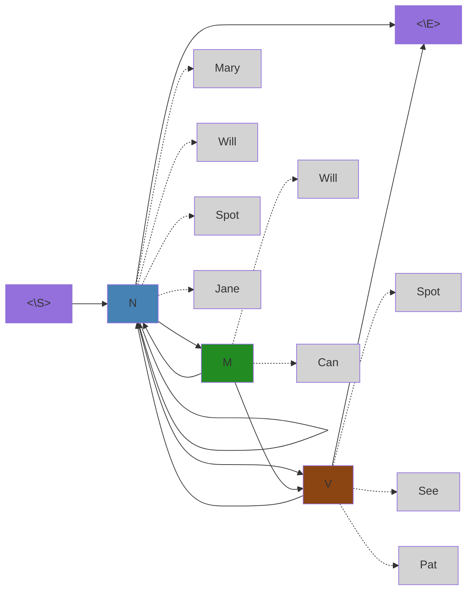
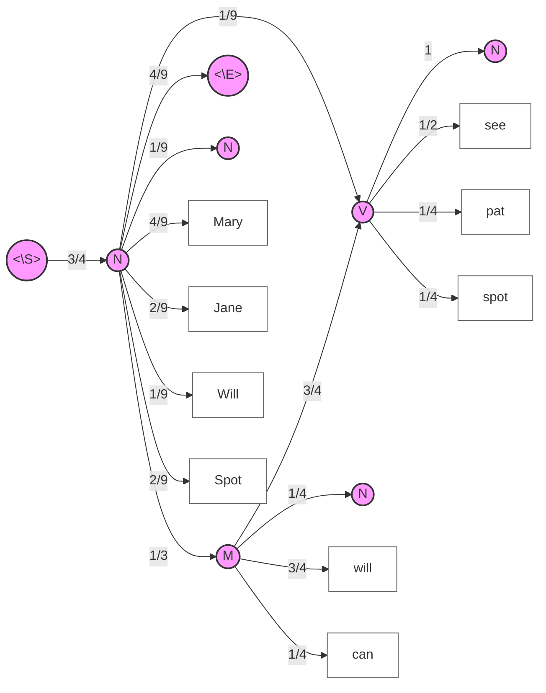
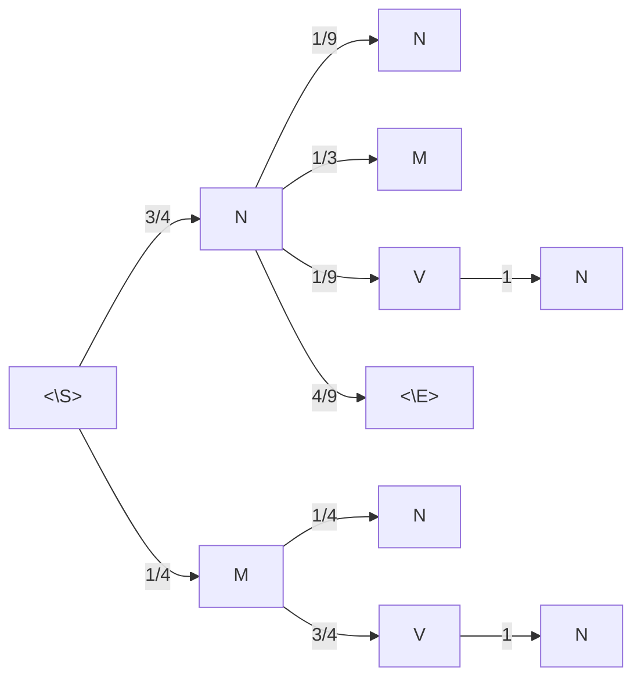
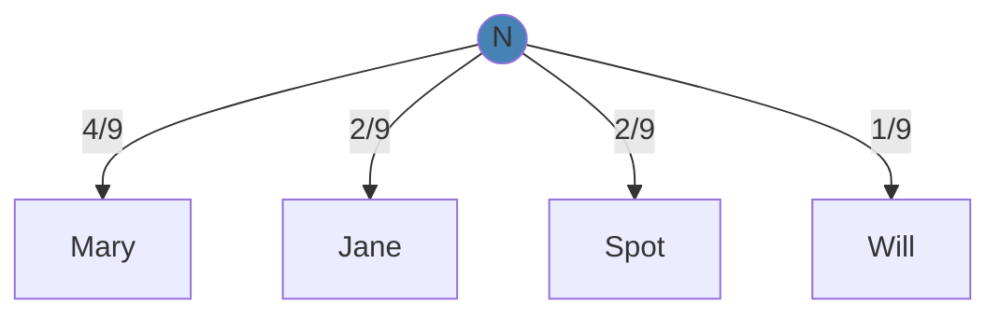
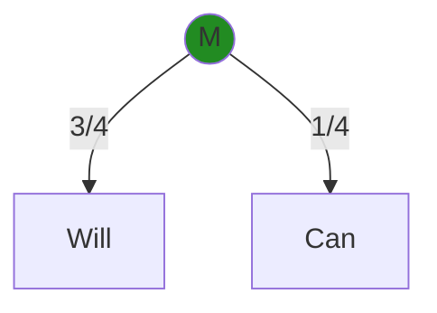
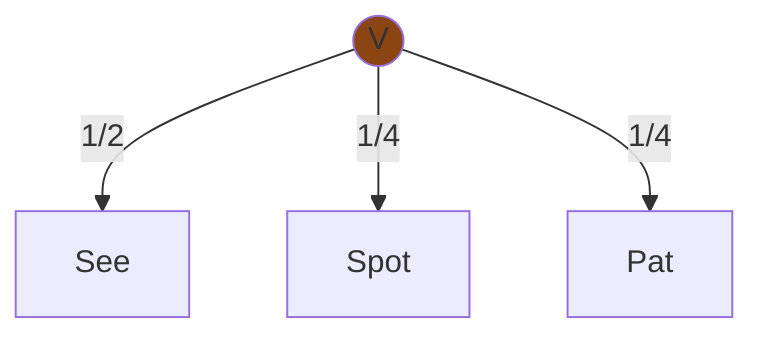
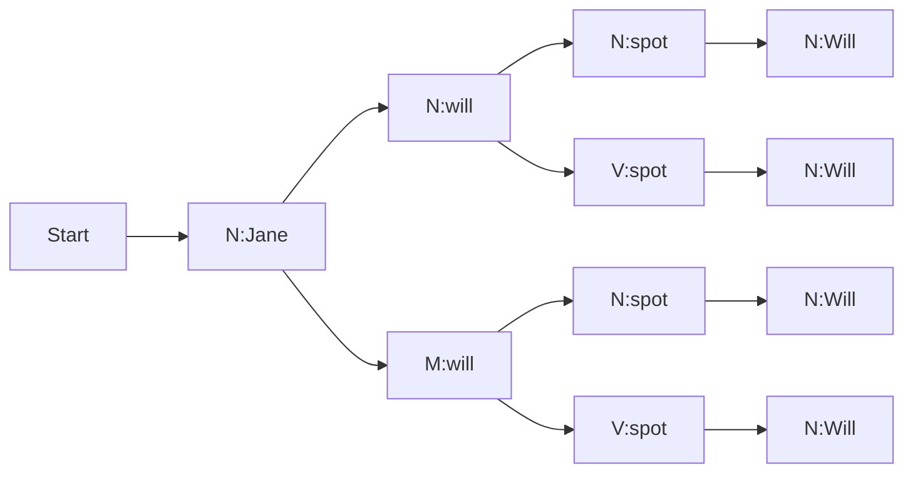
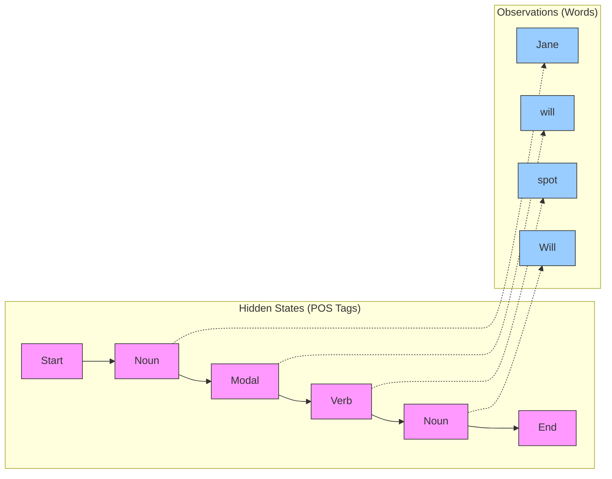
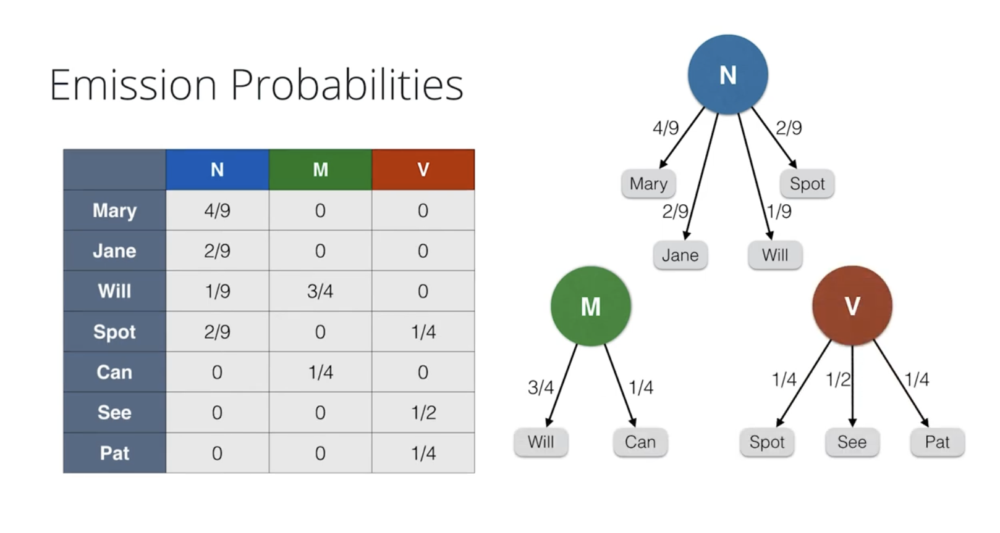
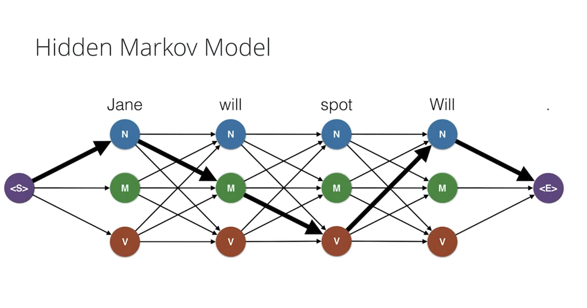

# C-5: Hidden Markov Models and Dynamic Time Warping

1. Hidden Markov Models for POS Tagging

    - Hidden States and Observations
    - Emission vs. Transition Probabilities
    - The Viterbi Algorithm
    - Forward-Backward Algorithm
    - Practical POS Tagging Implementation

2. Dynamic Time Warping
    - DTW Algorithm Fundamentals
    - Sequence Comparison Methods
    - Applications in Time Series Analysis
    - Relationship to Probabilistic Models
    - Limitations and Extensions



















#### Hidden Markov Models for POS Tagging

Hidden Markov Models (HMMs) represent a powerful class of probabilistic models particularly well-suited for sequential
data. In Natural Language Processing, one of their most successful applications is Part-of-Speech (POS) tagging, where
the goal is to assign the correct grammatical category (noun, verb, adjective, etc.) to each word in a sentence.

##### Hidden States and Observations

A Hidden Markov Model consists of two types of variables: hidden states and observations. In the context of POS tagging:

- **Hidden States**: These are the underlying POS tags (Noun, Verb, Modal, etc.) that we cannot directly observe but
  want to infer.
- **Observations**: These are the words in the sentence that we can directly observe.

The fundamental insight of HMMs is modeling the relationship between these two layers. The hidden states form a Markov
chain, where each state depends only on the previous state, not the entire history. Meanwhile, each observation depends
only on the current hidden state.



Consider the sentence "Jane will spot Will." In this example:

- The sequence of words (Jane, will, spot, Will) constitutes our observations.
- The corresponding POS tags (Noun, Modal, Verb, Noun) represent the hidden states we aim to discover.

The power of HMMs lies in their ability to capture two essential types of probabilities that govern language structure.

<div align="center">  <p style="color: #555;">Figure: Visual representation of a Hidden Markov Model showing the relationship between hidden states (POS tags) and observations (words).</p> </div>

##### Emission vs. Transition Probabilities

HMMs rely on two fundamental probability distributions that characterize the relationship between hidden states and
observations:

**Transition Probabilities**

Transition probabilities capture the likelihood of moving from one POS tag to another. They answer questions like: "If
the current word is a noun, what's the probability that the next word will be a verb?"

Formally, transition probabilities are represented as P(s*t | s*{t-1}), where s_t is the state at position t. These
probabilities reflect the grammatical structure of the language—certain tag sequences are more common than others.

For example, in English:

- A determiner (like "the") is likely to be followed by a noun or an adjective.
- A modal verb (like "will") is often followed by a verb.
- A preposition (like "in") is typically followed by a noun phrase.

The transition probabilities are typically organized in a transition matrix, where each entry (i,j) represents the
probability of transitioning from state i to state j.

<div align="center">  <p style="color: #555;">Figure: Transition probability matrix for POS tagging showing probabilities of moving between different parts of speech.</p> </div>

**Emission Probabilities**

Emission probabilities (also called observation probabilities) represent the likelihood of a particular word being
generated by a specific POS tag. They answer questions like: "If a word's POS tag is a noun, what's the probability that
the word is 'Jane'?"

Formally, emission probabilities are denoted as P(o_t | s_t), where o_t is the observation at position t, and s_t is the
corresponding state. These probabilities capture the lexical properties of the language—which words are commonly used as
nouns, verbs, etc.

For instance:

- Words like "Jane", "house", "dog" have high emission probabilities for the Noun tag.
- Words like "run", "jump", "eat" have high emission probabilities for the Verb tag.
- Words like "will", "can", "should" have high emission probabilities for the Modal tag.

<div align="center">  <p style="color: #555;">Figure: Emission probability distribution showing the likelihood of different words being generated by specific POS tags.</p> </div>

**Distinction and Relationship**

The key distinction between transition and emission probabilities is their focus:

- Transition probabilities model the **sequential structure** of POS tags, capturing grammatical patterns.
- Emission probabilities model the **word choices** for each POS tag, capturing lexical patterns.

Together, these probabilities enable an HMM to balance two competing sources of information: the likely sequence of POS
tags based on grammar rules (transition) and the likely POS tag for each observed word (emission). This dual
consideration allows HMMs to achieve accurate POS tagging even for ambiguous words that could have multiple POS
interpretations.

For example, the word "will" could be a modal verb ("I will go") or a noun ("Where there's a will, there's a way"). The
HMM can disambiguate by considering both emission probabilities (how likely "will" is used as each POS) and transition
probabilities (how likely each POS is in the current context).

##### The Viterbi Algorithm

The Viterbi algorithm is a dynamic programming approach that efficiently finds the most likely sequence of hidden states
(POS tags) given a sequence of observations (words). Rather than examining all possible tag sequences (which would be
exponential in the sentence length), Viterbi exploits the Markov property to reduce the complexity significantly.

**Core Intuition**

The key insight of the Viterbi algorithm is that if we know the most likely path to reach each possible state at
position t, we can build on this to find the most likely paths to position t+1. We only need to track one best path to
each state, rather than all possible paths.

**Algorithm Description**

For a sequence of words w₁, w₂, ..., wₙ, the Viterbi algorithm determines the most probable sequence of POS tags t₁, t₂,
..., tₙ in the following steps:

1. **Initialization**: For each possible POS tag s at position 1:
    - Calculate initial probability: δ₁(s) = P(start → s) × P(w₁|s)
    - This accounts for both the transition from the start state and the emission of the first word.
2. **Recursion**: For positions i = 2 to n, and for each possible POS tag s at position i:
    - Calculate: δᵢ(s) = max\_{s'} [δᵢ₋₁(s') × P(s'→s) × P(wᵢ|s)]
    - Where s' ranges over all possible POS tags at position i-1
    - Store the argument that maximizes this value as ψᵢ(s)
    - This represents the most likely previous tag leading to the current tag.
3. **Termination**: Find the most likely final state:
    - tₙ = argmax\_{s} [δₙ(s) × P(s→end)]
    - This includes the transition to the end state.
4. **Backtracking**: Reconstruct the most likely sequence:
    - Starting from tₙ, use the stored ψᵢ values to trace back the optimal path:
    - tᵢ₋₁ = ψᵢ(tᵢ) for i = n down to 2

Mathematically, the Viterbi algorithm computes:

$$\delta_i(s) = \max_{s'} [\delta_{i-1}(s') \times P(s|s') \times P(w_i|s)]$$

Where:

- δᵢ(s) is the probability of the most likely path ending in state s at position i
- P(s|s') is the transition probability from state s' to state s
- P(wᵢ|s) is the emission probability of word wᵢ given state s

**Example: Tagging "Jane will spot Will"**

Let's illustrate the Viterbi algorithm using our example sentence. For simplicity, we'll consider three possible tags: N
(Noun), M (Modal), and V (Verb).

<div align="center">  <p style="color: #555;">Figure: Viterbi trellis for tagging "Jane will spot Will" showing all possible paths and highlighting the most probable path.</p> </div>

1. **Initialization** (Position 1: "Jane")
    - δ₁(N) = P(start→N) × P("Jane"|N) = 3/4 × 2/9 = 1/6
    - δ₁(M) = P(start→M) × P("Jane"|M) = 1/4 × 0 = 0
    - δ₁(V) = P(start→V) × P("Jane"|V) = 0 × 0 = 0
    - Best tag for position 1: N (Noun)
2. **Recursion** (Position 2: "will")
    - For tag N:
        - From N: δ₂(N) = δ₁(N) × P(N→N) × P("will"|N) = 1/6 × 1/9 × 0 = 0
        - From M: δ₂(N) = δ₁(M) × P(M→N) × P("will"|N) = 0 × 1/4 × 0 = 0
        - From V: δ₂(N) = δ₁(V) × P(V→N) × P("will"|N) = 0 × 1 × 0 = 0
    - For tag M:
        - From N: δ₂(M) = δ₁(N) × P(N→M) × P("will"|M) = 1/6 × 1/3 × 3/4 = 1/24
        - From M: δ₂(M) = δ₁(M) × P(M→M) × P("will"|M) = 0 × 0 × 3/4 = 0
        - From V: δ₂(M) = δ₁(V) × P(V→M) × P("will"|M) = 0 × 0 × 3/4 = 0
    - For tag V:
        - All paths have probability 0
    - Best tag for position 2: M (Modal)
3. **Continue recursion** for positions 3 and 4, tracking the best path to each state.
4. **Termination and Backtracking**
    - Find the final tag with highest probability multiplied by its transition to end.
    - Trace back through the optimal path.

The final output would be the sequence: N-M-V-N (Noun-Modal-Verb-Noun), which corresponds to the correct tagging: "Jane
(N) will (M) spot (V) Will (N)."

**Computational Complexity**

The Viterbi algorithm has a time complexity of O(n × k²), where n is the length of the sequence and k is the number of
possible states (POS tags). This is far more efficient than the naive approach of checking all k^n possible tag
sequences.

The space complexity is O(n × k) to store the δ and ψ values for backtracking.

**Practical Considerations**

- **Log Probabilities**: In practice, we often work with log probabilities to avoid numerical underflow when multiplying
  many small probabilities.
- **Beam Search**: For very large state spaces, beam search can further improve efficiency by only considering the most
  promising states at each position.
- **Unknown Words**: Special handling is needed for words not seen during training, typically using features like
  capitalization, suffixes, etc.

The Viterbi algorithm exemplifies how dynamic programming can efficiently solve what would otherwise be an intractable
combinatorial problem, making HMMs practical for real-world POS tagging applications.

##### Forward-Backward Algorithm

While the Viterbi algorithm finds the single most likely sequence of states, the Forward-Backward algorithm computes the
probability of being in each state at each position, considering all possible paths through the sequence. This makes it
useful for tasks requiring probability distributions over states rather than just the most likely sequence.

**Algorithm Components**

The Forward-Backward algorithm consists of two main passes:

1. **Forward Pass (α)**: Computes the probability of being in each state at each position considering all prefixes of
   the observation sequence.
2. **Backward Pass (β)**: Computes the probability of seeing the remaining observations from each state at each
   position.

These two passes are then combined to compute the posterior probabilities of each state at each position.

**Forward Pass**

The forward variable α_t(s) represents the probability of observing the sequence w₁, w₂, ..., wₜ and ending in state s
at position t:

$$\alpha_t(s) = P(w_1, w_2, ..., w_t, s_t = s)$$

We calculate it recursively:

1. **Initialization**: $$\alpha_1(s) = P(s|start) \times P(w_1|s)$$
2. **Recursion**: $$\alpha_t(s) = \sum_{s'} \alpha_{t-1}(s') \times P(s|s') \times P(w_t|s)$$
3. **Termination**: $$P(w_1, w_2, ..., w_n) = \sum_s \alpha_n(s) \times P(end|s)$$

The forward pass not only helps in the overall algorithm but also directly computes the total probability of the
observation sequence given the model, useful for model comparison and evaluation.

**Backward Pass**

The backward variable β_t(s) represents the probability of observing the sequence wₜ₊₁, wₜ₊₂, ..., wₙ given that we're
in state s at position t:

$$\beta_t(s) = P(w_{t+1}, w_{t+2}, ..., w_n | s_t = s)$$

We calculate it recursively, but working backward:

1. **Initialization**: $$\beta_n(s) = P(end|s)$$
2. **Recursion**: $$\beta_t(s) = \sum_{s'} P(s'|s) \times P(w_{t+1}|s') \times \beta_{t+1}(s')$$

**Posterior Probability Calculation**

Once we have the forward and backward variables, we can compute the posterior probability of being in state s at
position t:

$$P(s_t = s | w_1, w_2, ..., w_n) = \frac{\alpha_t(s) \times \beta_t(s)}{P(w_1, w_2, ..., w_n)}$$

Since the denominator is constant for all states at position t, we can simplify to:

$$P(s_t = s | w_1, w_2, ..., w_n) \propto \alpha_t(s) \times \beta_t(s)$$

And then normalize to ensure the probabilities sum to 1 across all possible states at position t.

**Applications in POS Tagging**

In the context of POS tagging, the Forward-Backward algorithm offers several benefits:

1. **Uncertainty Representation**: Rather than just assigning the most likely tag, it provides a probability
   distribution over all possible tags for each word.
2. **Confidence Estimation**: The posterior probabilities can serve as confidence measures for tag assignments,
   highlighting ambiguous cases.
3. **Parameter Learning**: It's a key component of the Baum-Welch algorithm (a special case of the
   Expectation-Maximization algorithm) used to learn the transition and emission probabilities from untagged text.
4. **Smoothing**: The posterior probabilities can be used to develop smoothed tag sequences that account for linguistic
   uncertainty.

**Example Calculation**

For the sentence "Jane will spot Will," we would compute:

1. For each position and possible tag, calculate α_t(s) (forward probability)
2. For each position and possible tag, calculate β_t(s) (backward probability)
3. Combine them to get the posterior probability of each tag at each position

This would give us not just the most likely tag sequence (N-M-V-N) but also the confidence in each tag assignment. For
instance, we might find:

- "Jane": 98% Noun, 1% Verb, 1% other tags
- "will": 95% Modal, 4% Noun, 1% other tags
- "spot": 85% Verb, 10% Noun, 5% other tags
- "Will": 80% Noun, 15% Modal, 5% other tags

These distributions reveal the model's uncertainty, which is particularly valuable for words with multiple possible tags
like "spot" (which could be a noun or verb) and "Will" (which could be a proper noun or modal).

**Relationship to Viterbi**

While Viterbi and Forward-Backward serve different purposes, they share similar dynamic programming structures:

- **Viterbi** finds the single most likely state sequence by taking the maximum over previous states.
- **Forward-Backward** computes probability distributions by summing over all possible previous states.

In POS tagging applications, they can be complementary: Viterbi provides the best single tagging, while Forward-Backward
offers insights into the confidence and alternatives for each tag assignment.

##### Practical POS Tagging Implementation

Implementing a practical POS tagger using Hidden Markov Models involves several steps beyond the core algorithms. This
section covers the practical aspects of building and deploying HMM-based POS taggers, including data preparation,
training, handling edge cases, and evaluation.

**Data Requirements**

To build an effective HMM POS tagger, you typically need:

1. **Tagged Corpus**: A substantial collection of text with correct POS annotations. Common resources include:
    - Penn Treebank (for English)
    - Universal Dependencies project (for multiple languages)
    - Brown Corpus
    - Specialized domain-specific corpora (e.g., biomedical, legal)
2. **Development and Test Sets**: Separate portions of tagged text for:
    - Parameter tuning (development set)
    - Final evaluation (test set)

**Training Process**

The training process involves estimating the transition and emission probabilities from the tagged corpus:

1. **Transition Probabilities**: $$P(t_j|t_i) = \frac{Count(t_i \rightarrow t_j)}{Count(t_i)}$$ Where Count(t_i → t_j)
   is the number of times tag t_j follows tag t_i, and Count(t_i) is the total occurrences of tag t_i.
2. **Emission Probabilities**: $$P(w|t) = \frac{Count(t, w)}{Count(t)}$$ Where Count(t, w) is the number of times word w
   is tagged as t, and Count(t) is the total occurrences of tag t.

<div align="center">  <p style="color: #555;">Figure: Example emission probability table showing word distributions across different POS tags based on corpus statistics.</p> </div>

**Handling Practical Challenges**

Several challenges arise in real-world applications that require special handling:

1. **Unknown Words**: Words not seen during training require special treatment. Approaches include:

    - Using word features (capitalization, prefixes, suffixes)
    - Character-level modeling
    - Assigning a small probability across all possible tags
    - Creating an "UNK" (unknown) pseudo-word during training

    Example implementation:

    ```python
    def get_features(word):
        features = {}
        features["suffix3"] = word[-3:] if len(word) > 3 else word
        features["suffix2"] = word[-2:] if len(word) > 2 else word
        features["prefix2"] = word[:2] if len(word) > 2 else word
        features["isCapitalized"] = word[0].isupper()
        features["hasHyphen"] = "-" in word
        features["hasDigit"] = any(char.isdigit() for char in word)
        return features
    ```

2. **Smoothing Techniques**: To avoid zero probabilities (which would cause the entire path probability to be zero),
   smoothing is essential:

    - **Add-one (Laplace) smoothing**: $$P_{smoothed}(w|t) = \frac{Count(t, w) + 1}{Count(t) + V}$$ Where V is the
      vocabulary size.
    - **Add-k smoothing**: Similar to add-one but with a smaller constant k.
    - **Good-Turing smoothing**: Reallocates probability mass from observed events to unseen events based on the
      frequency of frequencies.
    - **Backoff models**: Fall back to less specific contexts when specific data is sparse.

3. **Tag Set Considerations**: The choice of tag set affects both accuracy and granularity:

    - Coarse tag sets (12-20 tags): Higher accuracy but less detailed
    - Fine-grained tag sets (36-150 tags): More informative but harder to predict
    - Consider task requirements when choosing

4. **Handling Ambiguous Words**: Many words can function as multiple POS:

    - "bank" can be a noun or verb
    - "close" can be verb, adjective, noun, or adverb

    Context-dependent disambiguation is the primary strength of HMMs, but some applications might benefit from:

    - Tag dictionaries for common words
    - Special handling for highly ambiguous words

**Optimization Techniques**

For large-scale applications, several optimizations can improve efficiency:

1. **Beam Search**: Instead of tracking all possible state sequences, only maintain the k most probable paths at each
   step.
2. **Pruning**: Eliminate low-probability transitions (below a threshold) to speed up computation.
3. **Caching**: Store computed values for frequent words or patterns.
4. **Parallel Processing**: Distribute tagging of different sentences or documents across multiple processors.

**Evaluation Metrics**

Performance evaluation uses several metrics:

1. **Accuracy**: Percentage of correctly tagged words
   $$Accuracy = \frac{Number\ of\ correctly\ tagged\ words}{Total\ number\ of\ words}$$
2. **Per-Tag Precision, Recall, and F1-Score**: Particularly useful for imbalanced tag distributions
3. **Confusion Matrix**: Identifies specific tag confusion patterns
4. **Out-of-Vocabulary (OOV) Accuracy**: Measures performance specifically on unknown words

**Example Implementation Structure**

A simplified implementation structure might look like:

```python
class HMMTagger:
    def __init__(self, tag_set):
        self.tag_set = tag_set
        self.transition_probs = {}  # P(tag_i | tag_{i-1})
        self.emission_probs = {}    # P(word | tag)
        self.tag_counts = {}        # Count of each tag in training data

    def train(self, tagged_corpus):
        # Count transitions and emissions
        for sentence in tagged_corpus:
            prev_tag = "<START>"
            for word, tag in sentence:
                # Update transition counts
                self.transition_probs[(prev_tag, tag)] = self.transition_probs.get((prev_tag, tag), 0) + 1
                self.tag_counts[prev_tag] = self.tag_counts.get(prev_tag, 0) + 1

                # Update emission counts
                self.emission_probs[(tag, word)] = self.emission_probs.get((tag, word), 0) + 1
                self.tag_counts[tag] = self.tag_counts.get(tag, 0) + 1

                prev_tag = tag

            # Final transition to END
            self.transition_probs[(prev_tag, "<END>")] = self.transition_probs.get((prev_tag, "<END>"), 0) + 1
            self.tag_counts[prev_tag] = self.tag_counts.get(prev_tag, 0) + 1

        # Normalize to get probabilities
        for (t1, t2), count in self.transition_probs.items():
            self.transition_probs[(t1, t2)] = count / self.tag_counts[t1]

        for (tag, word), count in self.emission_probs.items():
            self.emission_probs[(tag, word)] = count / self.tag_counts[tag]

    def viterbi_decode(self, sentence):
        # Implementation of Viterbi algorithm
        # ...
        return best_tag_sequence

    def tag(self, sentence):
        # Handle unknown words, apply Viterbi, return tagged sentence
        # ...
        return tagged_sentence
```

**Integration with Other NLP Tools**

Modern POS taggers often operate as part of larger NLP pipelines:

1. **Preprocessing**: Tokenization, sentence splitting
2. **POS Tagging**: Using the HMM tagger
3. **Downstream Tasks**: Parsing, named entity recognition, information extraction

This integration may affect design choices like tag set selection and performance requirements.

**Recent Advances and Extensions**

While traditional HMM-based POS taggers are still valuable, several extensions and alternatives have emerged:

1. **Maximum Entropy Markov Models (MEMMs)**: Incorporate arbitrary features beyond previous tags and current word.
2. **Conditional Random Fields (CRFs)**: Address label bias problems in MEMMs and can model longer-range dependencies.
3. **Neural Approaches**: Bidirectional LSTMs and transformer-based models have achieved state-of-the-art results,
   though often at the cost of increased complexity and data requirements.
4. **Hybrid Systems**: Combine rule-based approaches with statistical models, especially useful for morphologically rich
   languages or specialized domains.

These advances build upon the fundamental insights of HMMs while addressing their limitations in handling complex
linguistic phenomena.

#### Dynamic Time Warping

Dynamic Time Warping (DTW) is a powerful algorithm for measuring similarity between two temporal sequences that may vary
in speed or timing. Unlike simple distance metrics like Euclidean distance that compare points at the same time indices,
DTW finds an optimal alignment between sequences by "warping" the time dimension to match corresponding points, even
when they occur at different times or rates.

##### DTW Algorithm Fundamentals

At its core, Dynamic Time Warping solves a fundamental problem in sequence comparison: how to meaningfully compare
sequences when their important features don't align perfectly in time. For example, two people saying the same phrase
might speak at different speeds, or a gesture might be performed slowly in one instance and quickly in another, yet we
want to recognize they represent the same pattern.

**Basic Algorithm**

The DTW algorithm works by constructing a distance matrix between all points of the two sequences and finding the
optimal path through this matrix that minimizes the total distance. This path represents the best alignment between the
sequences.

Let's consider two time series:

- X = [x₁, x₂, ..., xₙ]
- Y = [y₁, y₂, ..., yₘ]

The DTW algorithm proceeds as follows:

1. **Distance Matrix Construction**: Create an n×m matrix D where each element D(i,j) represents the distance (typically
   Euclidean) between points xᵢ and yⱼ: $$D(i,j) = (x_i - y_j)^2$$

2. **Cost Matrix Calculation**: Build a cumulative distance matrix C where each element C(i,j) represents the minimum
   cumulative distance to reach point (i,j): $$C(i,j) = D(i,j) + min(C(i-1,j), C(i,j-1), C(i-1,j-1))$$

    With initialization:

    - C(1,1) = D(1,1)
    - C(i,1) = D(i,1) + C(i-1,1) for i > 1
    - C(1,j) = D(1,j) + C(1,j-1) for j > 1

3. **Path Backtracking**: Starting from C(n,m), trace back the path of minimum cost to C(1,1) by moving to the adjacent
   cell with the smallest value at each step.

4. **Warping Distance Calculation**: The DTW distance is the value of C(n,m), normalized by the path length to account
   for sequences of different lengths.

**Mathematical Formulation**

The DTW distance between sequences X and Y can be formally defined as:

$$DTW(X, Y) = \sqrt{\sum_{(i,j) \in P} w_{i,j} \cdot d(x_i, y_j)^2}$$

Where:

- P is the optimal warping path
- w\_{i,j} are path weights (typically 1)
- d(x_i, y_j) is the distance between points x_i and y_j

**Key Properties**

1. **Boundary Conditions**:
    - The warping path starts at (1,1) and ends at (n,m), ensuring both sequences are completely traversed.
2. **Continuity**:
    - The path progresses in adjacent cells to ensure no elements in either sequence are skipped.
3. **Monotonicity**:
    - The path never goes backward in time, maintaining the relative order of elements.

**Computational Complexity**

The standard DTW algorithm has:

- Time complexity: O(n×m)
- Space complexity: O(n×m)

For long sequences, this can become computationally expensive, leading to various optimization techniques:

- **Constrained Warping Path**: Limiting the path to a band around the diagonal (e.g., Sakoe-Chiba band, Itakura
  parallelogram)
- **Multi-resolution DTW**: Starting with decimated sequences and refining in areas of interest
- **SparseDTW**: Pruning cells with high values to focus on promising regions
- **FastDTW**: Using a coarse-to-fine approach to approximate the optimal path

The power of DTW lies in its ability to find the optimal alignment between sequences regardless of local stretching,
compression, or shifts in time. This makes it particularly valuable for comparing temporal patterns in various domains.

##### Sequence Comparison Methods

While Dynamic Time Warping is a powerful method for sequence comparison, it's important to understand how it relates to
other similarity measures and when each approach is most appropriate. This section compares DTW with alternative
sequence comparison methods, highlighting their strengths and limitations.

**Euclidean Distance**

The simplest approach to comparing sequences of equal length is to calculate the Euclidean distance between
corresponding points:

$$D_{Euclidean}(X, Y) = \sqrt{\sum_{i=1}^{n} (x_i - y_i)^2}$$

**Key characteristics**:

- Fast computation: O(n) time complexity
- Requires sequences of identical length
- Highly sensitive to timing shifts and distortions
- No temporal elasticity; compares points at the same indices only

In the context of time series, Euclidean distance works well when:

- Sequences are perfectly aligned in time
- No phase shifts or time warping exist
- The absolute timing of features is critical to the comparison

**Edit Distance (Levenshtein Distance)**

For discrete sequences like strings or symbolic time series, edit distance measures the minimum number of operations
(insertions, deletions, substitutions) required to transform one sequence into another:

$$D_{Edit}(X, Y) = \min(\text{number of operations to transform X into Y})$$

**Key characteristics**:

- Works on discrete symbols rather than continuous values
- Handles sequences of different lengths naturally
- All operations (insert, delete, substitute) typically have equal weight
- Does not account for the magnitude of differences in numeric sequences

Edit distance is particularly useful for:

- Text similarity (spell checking, DNA sequence matching)
- Discrete state sequence comparison
- Situations where the operation count is more important than the magnitude of differences

**Longest Common Subsequence (LCS)**

LCS finds the longest subsequence common to two sequences, where a subsequence doesn't need to occupy consecutive
positions:

$$LCS(X, Y) = \text{length of longest common subsequence of X and Y}$$

**Key characteristics**:

- Focuses on matching patterns rather than minimizing differences
- Ignores non-matching elements
- Can handle sequences of different lengths
- Does not consider the magnitude of differences

LCS is valuable for:

- Finding shared patterns in sequences
- Bioinformatics (DNA, protein sequence alignment)
- Text comparison where only matching matters

**Correlation-based Measures**

Cross-correlation and Pearson correlation measure the statistical similarity between sequences:

$$r_{xy} = \frac{\sum_{i=1}^{n} (x_i - \bar{x})(y_i - \bar{y})}{\sqrt{\sum_{i=1}^{n} (x_i - \bar{x})^2} \sqrt{\sum_{i=1}^{n} (y_i - \bar{y})^2}}$$

**Key characteristics**:

- Captures linear relationships between sequences
- Invariant to scale and offset (standardized measures)
- Sensitive to timing misalignments
- Requires sequences of equal length (for direct calculation)

Correlation methods excel at:

- Detecting similar patterns regardless of amplitude or baseline
- Signal processing applications
- Situations where the relationship rather than absolute similarity matters

**Comparison with DTW**

DTW differentiates itself from these methods in several key ways:

1. **Temporal Flexibility**: Unlike Euclidean distance, DTW allows for stretching and compressing of the time axis to
   find optimal alignment.
2. **Continuous Values**: Unlike edit distance, DTW works directly with continuous values and considers the magnitude of
   differences.
3. **Comprehensive Mapping**: Unlike LCS, DTW maps every point in both sequences, not just matching segments.
4. **Non-linear Alignment**: Unlike correlation, DTW can capture non-linear alignments between sequences.
5. **Path Constraints**: DTW can incorporate domain knowledge through path constraints that other methods cannot easily
   accommodate.

**Choosing the Right Method**

The selection of a sequence comparison method depends on the specific application requirements:

| Method        | Best When                       | Limitations                      |
| ------------- | ------------------------------- | -------------------------------- |
| DTW           | Time axis distortions exist     | Computationally expensive        |
| Euclidean     | Sequences are perfectly aligned | Fails with temporal shifts       |
| Edit Distance | Working with symbolic sequences | Ignores magnitude of differences |
| LCS           | Finding common patterns         | Disregards non-matching elements |
| Correlation   | Scale and offset are irrelevant | Assumes linear relationships     |

For time series analysis, DTW is often the preferred choice when:

- Sequences may have different speeds or timing variations
- The entire sequence needs to be considered
- The absolute differences between aligned points matter
- Computational complexity is not a critical constraint

However, simpler methods may be more appropriate when:

- Real-time performance is essential
- Sequences are known to be well-aligned
- Only pattern similarity, not exact alignment, is needed
- The dataset is extremely large, making DTW computationally prohibitive

The rich landscape of sequence comparison methods offers a toolkit for addressing different aspects of sequence
similarity, with DTW occupying a central position for applications where temporal elasticity is crucial.

##### Applications in Time Series Analysis

Dynamic Time Warping has found widespread applications across numerous domains where time series data analysis is
essential. Its ability to handle temporal variations makes it a versatile tool for pattern recognition, classification,
and alignment tasks.

**Speech Recognition and Processing**

One of the earliest and most successful applications of DTW was in speech recognition:

1. **Word Recognition**: DTW compares spoken words against templates, accommodating variations in speaking rate.
2. **Speaker Verification**: By comparing speech patterns against stored templates, DTW can verify speaker identity
   despite variations in timing and intonation.
3. **Speech Alignment**: DTW aligns different utterances of the same text, useful for creating parallel corpora for
   speech synthesis or for studying pronunciation variations.
4. **Prosody Analysis**: By aligning speech signals, DTW enables comparison of intonation, rhythm, and stress patterns
   across different speakers or languages.

**Gesture and Motion Recognition**

Human movements naturally vary in speed and execution, making DTW particularly valuable:

1. **Gesture Recognition**: DTW compares sequences of motion features (joint angles, accelerometer data) against known
   gesture templates.
2. **Dance Movement Analysis**: Choreographers and researchers use DTW to compare dance performances against reference
   movements.
3. **Gait Analysis**: Medical researchers apply DTW to compare walking patterns for diagnosis of movement disorders or
   to track rehabilitation progress.
4. **Sports Performance Analysis**: DTW helps analyze and compare athlete movements (golf swings, swimming strokes)
   against ideal form.

**Bioinformatics and Medical Applications**

The flexible alignment properties of DTW are valuable for biological sequence analysis:

1. **ECG/EEG Analysis**: DTW compares cardiac or brain signal patterns to detect anomalies or classify conditions,
   accommodating varying heart rates or neural responses.
2. **Gene Expression Profiling**: Comparing gene expression over time across different experiments, accounting for
   varying rates of biological processes.
3. **Protein Structure Alignment**: DTW can align 3D protein structures by comparing their distance matrices or feature
   vectors.
4. **Disease Progression Monitoring**: Tracking how symptoms or biomarkers change over time across different patients,
   despite individual variations in disease timeline.

**Industrial and IoT Applications**

As sensors become ubiquitous, DTW finds applications in monitoring and anomaly detection:

1. **Predictive Maintenance**: Comparing machinery vibration or acoustic signatures against known failure patterns to
   predict equipment breakdowns.
2. **Quality Control**: Matching production process patterns against "golden batch" profiles to ensure consistent
   manufacturing quality.
3. **Energy Consumption Analysis**: Comparing building energy usage patterns to identify anomalies or efficiency
   opportunities, despite varying occupancy or weather patterns.
4. **Sensor Data Synchronization**: Aligning data from multiple sensors that may have different sampling rates or
   temporal offsets.

**Financial and Economic Analysis**

Time series data in finance often exhibits similar patterns at different time scales:

1. **Stock Market Pattern Detection**: Identifying historical price patterns that match current market conditions,
   despite time scale differences.
2. **Economic Cycle Comparison**: Aligning economic indicators across different time periods or countries to compare
   business cycles.
3. **Trading Strategy Backtesting**: Aligning market conditions to test trading strategies across different historical
   periods.
4. **Credit Card Fraud Detection**: Identifying unusual spending patterns that match known fraud signatures, despite
   timing variations.

**Music and Audio Processing**

Music naturally contains temporal variations that DTW can accommodate:

1. **Query by Humming**: Matching a hummed melody against a music database, despite tempo variations or imperfect pitch.
2. **Music Structure Analysis**: Finding repeated sections (chorus, verse) despite tempo changes or variations in
   performance.
3. **Cover Song Identification**: Recognizing different versions of the same song despite changes in arrangement, tempo,
   or instrumentation.
4. **Audio Synchronization**: Aligning multiple recordings of the same event (e.g., different camera angles at a
   concert).

**Implementation Considerations**

When applying DTW to these domains, several practical considerations enhance its effectiveness:

1. **Feature Selection**:
    - Raw time series data often benefits from preprocessing (normalization, filtering)
    - Domain-specific features (e.g., MFCCs for speech, Fourier transforms for vibration analysis) can improve matching
    - Dimensionality reduction techniques can make DTW more efficient for multivariate time series
2. **Distance Measures**:
    - While Euclidean distance is common, domain-specific distance measures can be more appropriate
    - For periodic data, circular distances may be needed
    - Weighted distances can emphasize important features
3. **Scalability Approaches**:
    - Indexing techniques for large datasets (e.g., DTW-based subsequence matching)
    - Lower-bounding methods to quickly eliminate non-matching candidates
    - Multi-resolution approaches for long sequences
4. **Real-time Applications**:
    - Streaming implementations of DTW for online pattern recognition
    - Early abandoning techniques to stop calculations when a match is unlikely
    - Limited warping constraints to reduce computation time

The widespread adoption of DTW across these diverse domains underscores its versatility and effectiveness for time
series analysis. Its ability to address the fundamental challenge of temporal alignment makes it an essential technique
in the time series analyst's toolkit, complementing statistical and frequency-domain approaches.

##### Relationship to Probabilistic Models

While Dynamic Time Warping is deterministic in nature, it shares interesting connections with probabilistic models,
particularly Hidden Markov Models (HMMs). Understanding these relationships provides deeper insights into both
approaches and enables hybrid methods that leverage the strengths of each.

**DTW vs. HMMs: Conceptual Comparison**

DTW and HMMs represent two different paradigms for sequence analysis:

1. **Deterministic vs. Probabilistic Approach**:
    - DTW is deterministic, finding the optimal alignment between two specific sequences
    - HMMs are probabilistic, modeling the statistical properties and generating process of sequences
2. **Template Matching vs. Generative Modeling**:
    - DTW compares a query sequence against reference templates
    - HMMs learn a generative model of sequence distributions
3. **Distance Minimization vs. Likelihood Maximization**:
    - DTW seeks to minimize the cumulative distance between aligned points
    - HMMs seek to maximize the likelihood of observed sequences given the model
4. **Warping Path vs. State Sequence**:
    - DTW produces a warping path that aligns two sequences
    - HMMs infer a hidden state sequence that explains observations

**Mathematical Connections**

Despite these differences, there are formal connections between DTW and probabilistic models:

1. **DTW as a Special Case of HMM**: DTW can be viewed as finding the most likely state sequence in a specific type of
   HMM:

    - States correspond to alignment points
    - Transition probabilities enforce warping constraints
    - Emission probabilities are related to the distance function

    In this formulation, the negative log-likelihood in the HMM corresponds to the cumulative distance in DTW.

2. **Viterbi Algorithm Similarity**: The dynamic programming approach used in DTW closely resembles the Viterbi
   algorithm used to find the most likely state sequence in HMMs:

    - Both build a trellis of optimal subpaths
    - Both use recurrence relations to extend optimal paths
    - Both perform backtracking to recover the optimal path

3. **Probabilistic Interpretation of DTW**: DTW can be given a probabilistic interpretation where:

    - The distance between points translates to negative log-probabilities
    - The optimal warping path maximizes the joint probability of aligned points
    - Warping constraints represent prior probabilities over alignments

4. **Maximum Likelihood Framework**: In a probabilistic framework, the DTW objective can be reformulated as:
   $$\text{DTW}(X, Y) = -\log \max_P \prod_{(i,j) \in P} \exp(-d(x_i, y_j))$$

    Which shows DTW as maximizing the likelihood under a specific probabilistic model.

**Hybrid Approaches**

The complementary strengths of DTW and probabilistic models have led to various hybrid approaches:

1. **Probabilistic DTW**: Extensions of DTW that incorporate uncertainty:
    - Soft-DTW: Uses a differentiable softmin operation instead of min
    - Gaussian DTW: Models points as distributions rather than fixed values
    - Bayesian DTW: Places a prior distribution over possible warping paths
2. **DTW-Enhanced HMMs**: HMM variants that incorporate DTW concepts:
    - Segmental HMMs: Use DTW-like alignment within HMM segments
    - Path-HMMs: Explicitly model the warping path as part of the state space
    - Hierarchical HMMs with DTW distance metrics
3. **Coupled HMM-DTW Systems**:
    - Using DTW for initial alignment before HMM training
    - HMM for coarse alignment followed by DTW for fine-tuning
    - DTW for template selection, HMM for classification

**Practical Implications**

Understanding the relationship between DTW and probabilistic models has several practical benefits:

1. **Model Selection**:
    - When data volume is small: DTW often outperforms HMMs due to fewer parameters
    - When training data is abundant: HMMs can capture statistical variations better
    - When temporal variation is the primary challenge: DTW typically excels
    - When need to model generating process: HMMs provide a generative framework
2. **Uncertainty Handling**:
    - DTW: Deterministic result with no inherent uncertainty measure
    - HMMs: Provide probabilities and confidence metrics
    - Hybrid approaches: Can offer both optimal alignment and confidence measures
3. **Training Requirements**:
    - DTW: Requires only reference templates, no statistical training
    - HMMs: Require substantial training data to estimate transition and emission probabilities
    - Hybrid models: Can leverage limited templates with statistical refinement
4. **Computational Considerations**:
    - DTW's O(nm) complexity can be preferable to HMM's training process for simple applications
    - HMMs offer more efficient evaluation once trained
    - Hybrid approaches can balance preprocessing effort versus runtime performance

**Example: Speech Recognition Evolution**

The evolution of speech recognition illustrates the relationship between these approaches:

1. **Early Systems (1970s)**: Pure DTW comparing speech against word templates
2. **Middle Era (1980s-1990s)**: HMMs become dominant due to better generalization
3. **Hybrid Era (1990s-2000s)**: DTW used for alignment in HMM training
4. **Modern Systems (2010s+)**: Deep learning with attention mechanisms (which have parallels to DTW alignment) combined
   with HMM-like sequential modeling

The relationship between DTW and probabilistic models highlights a broader pattern in sequence analysis: the tension
between exact pattern matching and statistical generalization. By understanding both approaches and their connections,
practitioners can select the most appropriate technique for their specific application or develop hybrid solutions that
leverage the strengths of both paradigms.

##### Limitations and Extensions

Despite its versatility and effectiveness, Dynamic Time Warping has several inherent limitations. Recognizing these
constraints has led to numerous extensions and variants that address specific shortcomings and expand DTW's
applicability to more complex scenarios.

**Core Limitations of Standard DTW**

1. **Computational Complexity**:
    - O(nm) time and space complexity becomes prohibitive for long sequences
    - Real-time applications may be challenging without optimization
    - Handling large datasets requires efficient indexing or approximation
2. **Global Alignment Requirement**:
    - Standard DTW forces alignment of entire sequences (beginning to end)
    - Cannot inherently handle subsequence matching or partial alignments
    - Problematic for finding patterns within longer sequences
3. **Sensitivity to Noise and Outliers**:
    - Point-to-point distance measures can be heavily influenced by outliers
    - Noisy data points can significantly distort the warping path
    - No inherent mechanism to distinguish between signal and noise
4. **Lack of Interpretability**:
    - The warping path does not directly explain why alignments occur
    - No statistical confidence measures for the quality of alignment
    - Difficult to extract semantic meaning from the warping process
5. **Difficulty with Multi-dimensional Data**:
    - Standard formulation assumes one-dimensional time series
    - Computing distances between multi-dimensional points requires careful consideration
    - Feature weighting becomes important but non-trivial to optimize

**Extensions Addressing Computational Efficiency**

Several approaches have been developed to reduce DTW's computational burden:

1. **FastDTW**:
    - Multi-resolution approach that starts at a coarse resolution and refines
    - Approximates the optimal warping path with near-linear time complexity
    - Trades off some accuracy for dramatic speed improvements
2. **SparseDTW**:
    - Computes DTW only in promising regions of the distance matrix
    - Uses heuristics to identify and focus on areas likely to contain the optimal path
    - Particularly effective for sparse or structured time series
3. **PrunedDTW**:
    - Eliminates candidate alignments that cannot improve upon the best solution found so far
    - Uses lower bounds to prune unpromising paths early
    - Maintains exact results while reducing average-case computation
4. **Constrained DTW Variants**:
    - Sakoe-Chiba Band: Restricts warping to a band around the matrix diagonal
    - Itakura Parallelogram: Uses a parallelogram constraint that allows more warping in the middle
    - These constraints both improve efficiency and can prevent pathological alignments

**Extensions for Partial and Multiple Sequence Alignment**

Standard DTW has been extended to handle more complex alignment scenarios:

1. **Subsequence DTW**:
    - Allows matching a short query against any subsequence of a longer time series
    - Used for pattern discovery in streaming data
    - Modifies boundary conditions to allow optimal alignment without forcing endpoints
2. **Multidimensional DTW**:
    - Handles alignment of multivariate time series
    - Requires careful design of distance metrics between multi-dimensional points
    - Can incorporate feature weighting to emphasize important dimensions
3. **Multiple Sequence Alignment with DTW**:
    - Extends DTW to align more than two sequences simultaneously
    - Can construct a consensus sequence or template from multiple examples
    - Applications in bioinformatics and collective behavior analysis
4. **Open-End DTW**:
    - Relaxes the constraint that both sequences must be fully aligned
    - Useful when end points are unreliable or when comparing incomplete sequences
    - Common in online recognition systems

**Robust and Adaptive Extensions**

To address sensitivity issues, several robust variations have emerged:

1. **Derivative DTW**:
    - Uses the derivative (rate of change) rather than absolute values
    - Makes alignment invariant to baseline shifts
    - More robust against amplitude variations and certain types of noise
2. **Weighted DTW**:
    - Assigns different weights to points based on their reliability or importance
    - Can reduce the influence of outliers or emphasize meaningful features
    - Allows incorporation of domain knowledge into the alignment process
3. **Soft-DTW**:
    - Replaces the hard minimum operation with a differentiable softmin
    - Provides a smooth approximation to DTW distance
    - Enables gradient-based optimization and integration with neural networks
4. **Adaptive DTW**:
    - Automatically adjusts parameters based on the data characteristics
    - Can adapt warping constraints to different regions of the sequences
    - Particularly useful for non-stationary time series

**Learning-Enhanced Extensions**

Modern approaches increasingly combine DTW with machine learning techniques:

1. **Learned Metrics for DTW**:
    - Uses supervised learning to learn optimal distance metrics
    - Can incorporate domain-specific similarity measures
    - Adapts to the specific characteristics of the data type
2. **DTW Kernels**:
    - Transforms DTW distance into a kernel function for use with kernel methods
    - Enables integration with Support Vector Machines and other kernel-based algorithms
    - Preserves DTW's alignment properties while leveraging statistical learning
3. **Neural DTW**:
    - Embeds DTW alignment within neural network architectures
    - Uses learned feature representations instead of raw time series
    - End-to-end training allows optimization for specific tasks
4. **DTW Barycenter Averaging**:
    - Computes an average sequence that minimizes total DTW distance to a set of sequences
    - Useful for clustering, classification, and template extraction
    - Provides more meaningful averages than point-by-point means

**Future Directions**

The evolution of DTW continues along several promising paths:

1. **Interpretable DTW**:
    - Developing methods to extract meaningful patterns from warping paths
    - Visualization techniques for understanding alignment decisions
    - Integration with explainable AI frameworks
2. **Probabilistic DTW Frameworks**:
    - Further development of probabilistic interpretations of DTW
    - Bayesian approaches that quantify uncertainty in alignments
    - Hybrid models combining the strengths of DTW and statistical approaches
3. **Online and Streaming DTW**:
    - Real-time adaptive algorithms for streaming data
    - Incremental computation models for continuous monitoring
    - Anytime algorithms that provide progressively refined alignments
4. **DTW for Complex Data Types**:
    - Extensions to graphs, trees, and other structured data
    - Alignment of heterogeneous data modalities
    - Application to increasingly complex sequential patterns

By addressing the core limitations of DTW through these extensions, researchers and practitioners have significantly
expanded its utility across diverse domains. The ongoing integration of DTW with modern machine learning approaches
promises to further enhance its capabilities while preserving its fundamental insight: that meaningful comparison of
temporal sequences requires flexible alignment of their time dimensions.
