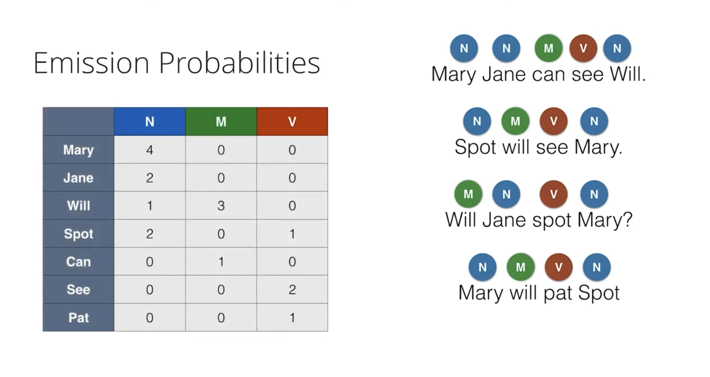
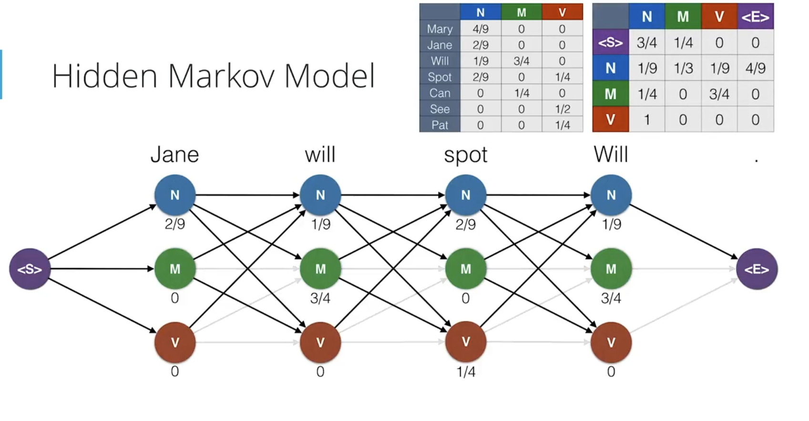
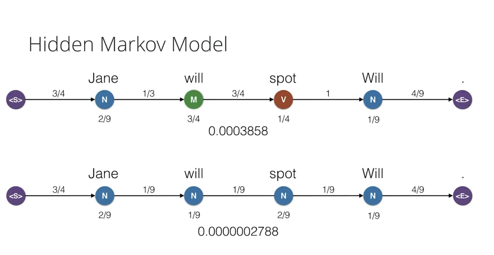
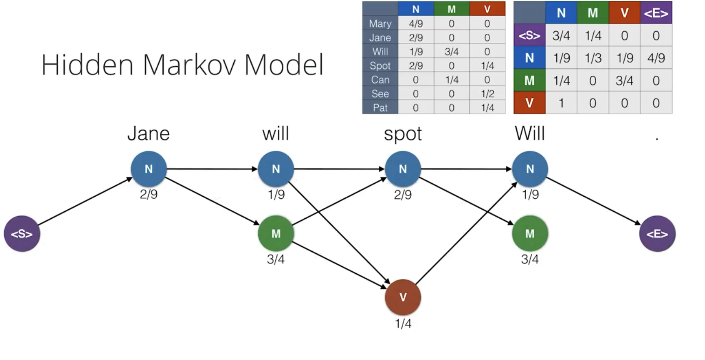

# CHAPTER-6: Part of Speech Tagging with HMMs

<br>
<br>

## Hidden Markov Models (HMMs)

<br>

Hidden Markov Models (HMMs) are used to model sequences (including time-series data). HMMs have been successfully used on both supervised and unsupervised problems with sequence data in applications like speech recognition, bioinformatics, sign language recognition, and gesture recognition.

<br>

1. Definition:
   A Hidden Markov Model is a statistical model used to represent probability distributions over sequences of observations. It consists of hidden states that emit observable outputs.

2. Key Components:

   - Hidden States: Unobservable states (e.g., Parts of Speech)
   - Observations: Visible outputs (e.g., words in a sentence)
   - Transition Probabilities: Likelihood of moving between states
   - Emission Probabilities: Likelihood of an observation given a state
   - Initial State Probabilities: Likelihood of starting in each state

3. Part-of-Speech (POS) Tagging Example:
   The calculations in the Part-of-Speech (POS) tagging example involve determining the probabilities of transitioning between states (POS tags) and the probabilities of emitting specific words from these states.

4. HMM Process:

   - Start in an initial state
   - Emit an observation based on emission probability
   - Transition to next state based on transition probability
   - Repeat b and c until reaching end state

5. Markov Assumption:
   The probability of a state depends only on the previous state, not the entire history.

6. Applications:

   - Speech Recognition
   - Machine Translation
   - Named Entity Recognition
   - Gene Prediction in Bioinformatics

7. Algorithms for HMMs:

   - Forward Algorithm: Computes probability of an observation sequence
   - Viterbi Algorithm: Finds most likely sequence of hidden states
   - Baum-Welch Algorithm: Learns model parameters from data

8. Example: Weather Prediction HMM

   - States: Sunny, Rainy, Cloudy
   - Observations: Dry, Wet

   Transition Probabilities:

   - Sunny → Sunny: 0.7, Sunny → Rainy: 0.2, Sunny → Cloudy: 0.1
   - Rainy → Rainy: 0.6, Rainy → Sunny: 0.3, Rainy → Cloudy: 0.1
   - Cloudy → Cloudy: 0.5, Cloudy → Sunny: 0.3, Cloudy → Rainy: 0.2

   Emission Probabilities:

   - Sunny → Dry: 0.9, Sunny → Wet: 0.1
   - Rainy → Dry: 0.2, Rainy → Wet: 0.8
   - Cloudy → Dry: 0.6, Cloudy → Wet: 0.4

9. Challenges:

   - Computational complexity for large state spaces
   - Handling long-range dependencies
   - Dealing with sparse data

10. Advanced Topics:
    - Higher-Order HMMs
    - Hierarchical HMMs
    - Continuous HMMs

<br>
<br>

Understanding HMMs is crucial for many NLP tasks, as they provide a powerful framework for modeling sequential data with underlying hidden states. They form the basis for more advanced models in machine learning and artificial intelligence.

<br>

## Basic HMM Equations

1. Markov Assumption:
   P(next state | current state) = P(next state | current state, all previous states)

2. Total Probability:
   P(sequence) = P(transitions) × P(emissions)

<br>

**Transition Probabilities** and **Emission Probabilities** are two key components of Hidden Markov Models (HMMs). While they're both types of probabilities, they represent different aspects of the model. Let's break down the differences:

<br>
<br>

1. Transition Probabilities:
   Transition Probability is the probability of moving from one **hidden state** to another.

   Characteristics:

   - Represent the likelihood of state changes over time.
   - Only involve hidden states, not observations.
   - Form a square matrix where rows sum to 1.

   Example (POS tagging):

   - P(Verb | Noun) = 0.3 (probability of a verb following a noun)
   - P(Noun | Verb) = 0.7 (probability of a noun following a verb)

2. Emission Probabilities:
   Emission Probability is the probability of observing a **particular output** given a specific **hidden state**.

   Characteristics:

   - Represent the relationship between hidden states and observable outputs.
   - Involve both hidden states and observations.
   - Each row (corresponding to a state) sums to 1.

   Example (POS tagging):

   - P("run" | Verb) = 0.05 (probability of seeing "run" given the state is Verb)
   - P("cat" | Noun) = 0.02 (probability of seeing "cat" given the state is Noun)

<br>
<br>

**Key Differences:**

1. What they model:

   - Transition: State-to-state relationships
   - Emission: State-to-observation relationships

2. Matrix structure:

   - Transition: Square matrix (state x state)
   - Emission: Rectangular matrix (state x observation)

3. Usage in the model:

   - Transition: Used to predict the next state
   - Emission: Used to predict the observation given a state

4. In the HMM process:

   - Transition: Applied when moving between time steps
   - Emission: Applied at each time step to generate an observation

5. Information they capture:
   - Transition: Temporal dynamics of the hidden process
   - Emission: How hidden states manifest as observable data

Understanding the distinction between these two types of probabilities is crucial for effectively designing, implementing,
and interpreting Hidden Markov Models in various applications.

<br>
<br>

**Part-of-Speech (POS) tags**

<br>

Notations:

- N - Noun
- V - Verb
- Dt - Determiner
- Ad - Adjective

<br>

Example:

N - Noun: house, car, Mary, Bob, etc. <br>
M - Modal verb: can, would, should, may, etc. <br>
V - Verb: run, see, jump, eat, walk, etc. <br>

<br>

N - John <br>
M - can <br>
V - run <br>

<br>

If the full sentence is **"Mary had a little lamb"**, the POS tags are:

N - Mary <br>
V - had <br>
Dt - a <br>
Ad - little <br>
N - lamb <br>

<br>

Say, we have 3 sentences: "Mary will see Jane", "Will will see Mary" and "Jane will see Will." The POS tags are:

<br>
<br>

**POS table:**

```
| Sentence | Parts of Speech (POS) |
|----------|----------------|
| Mary will see Jane. | Noun Modal Verb Noun |
| Will will see Mary | Noun Modal Verb Noun |
| Jane will see Will. | Noun Modal Verb Noun |
```

<br>

**Lookup table:**

```
|      | N | V | M |
|------|---|---|---|
| Mary | 2 | 0 | 0 |
| see  | 0 | 3 | 0 |
| Jane | 2 | 0 | 0 |
| Will | 2 | 0 | 3 |
```

**Big Arms:**

<br>

Bigrams are pairs of consecutive words in a sentence. In the context of POS tagging, we're looking at the transition between parts of speech for consecutive words. The table shows three types of POS transitions:

1. N-M: Noun to Modal (e.g., "Mary will", "Jane will")
2. M-V: Modal to Verb (e.g., "will see")
3. V-N: Verb to Noun (e.g., "see Will", "see Mary")

For example, in "Mary will see Will":

1. "Mary will" is an N-M bigram (Noun-Modal)
2. "will see" is an M-V bigram (Modal-Verb)
3. "see Will" is a V-N bigram (Verb-Noun)

<br>
<br>

```
| Bigram | N-M | M-V | V-N |
|--------|-----|-----|-----|
| mary-will | 1 | 0 | 0 |
| will-see | 0 | 3 | 0 |
| see-jane | 0 | 0 | 1 |
| will-will | 1 | 0 | 0 |
| see-mary | 0 | 0 | 1 |
| jane-will | 1 | 0 | 0 |
| see-will | 0 | 0 | 1 |
```

This table shows the count of occurrences for each part of speech combination (N-M, M-V, V-N) for the various bigrams for the mentioned 3 sentences.

<br>

Mary will see Will. The POS will be:
<br>
**Mary | N -> will | M -> see | V -> Will | N**

Jane will see Will. The POS will be:
<br>
**Jane | N -> will | M -> see | V -> Will | N**

<br>

### Why Bigrams like this Don't Work Well for NLP:

1. **Limited Context**:

   - **Bigrams** only capture immediate word pairs, which limits the context to just two words. Language understanding often requires broader context. For example, understanding sentences or longer phrases needs more than just the immediate next word to predict or infer meanings accurately.

2. **Sparsity**:

   - With bigrams, especially in large vocabularies or languages with many inflections, you might encounter a **sparsity problem**. Many bigrams will occur very infrequently or not at all in training data, making it hard to generalize or predict new text based on this limited pattern. This leads to poor performance when dealing with novel or rare word combinations.

3. **Lack of Hierarchical Structure**:

   - Language has a hierarchical structure (syntax). Bigrams do not capture syntactic dependencies beyond the adjacent word level. For example, knowing that "will-see" is M-V doesn't tell you about the subject of "see" unless you consider even more context.

4. **Ambiguity and Overfitting**:

   - Bigrams might not handle ambiguity well, where words have multiple roles or meanings depending on context. For instance, "will" can be both a noun (as in "last will and testament") or a modal verb. Relying solely on bigrams might lead to overfitting on the specific sequences seen in the training data, reducing the model's ability to generalize.

5. **No Semantic Understanding**:

   - Bigrams focus on word adjacency and POS transitions but do not inherently include semantic understanding. For deeper NLP tasks like sentiment analysis, named entity recognition, or question answering, understanding the meaning or relationship beyond mere adjacency is crucial.

6. **Dependency on Accurate POS Tagging**:

   - The effectiveness of this approach heavily depends on the accuracy of the POS tagging. Any error in tagging can lead to incorrect counts or interpretations in the bigram model.

7. **Scalability Issues**:
   - As the size of the corpus grows or as one deals with languages with rich morphology, the number of unique bigrams can become extremely large, making the approach less practical or computationally intensive.

<br>
<br>

Instead of this simplistic bigram model, modern NLP often employs:

- **N-grams with higher N values** for capturing more context.
- **Recurrent Neural Networks (RNNs)**, **LSTMs**, or **Transformers** which can learn long-range dependencies and contextual relationships within sequences.
- **Dependency parsing** or **syntax trees** to understand sentence structure more comprehensively.
- **Word embeddings** or **contextual embeddings** (like those from BERT or Word2Vec) to capture semantic relationships between words.

These methods provide a richer, more nuanced understanding of language, making them more suitable for complex NLP tasks.

<br>
<br>

<br>

### Creating Probability Tables for Hidden Markov Model (HMM) in POS Tagging

<br>
<br>

**Given Example Sentences:**

1. "Mary Jane can see Will"
2. "Spot will see Mary"
3. "Will Jane spot Mary?"
4. "Mary will pat Spot"

#### Step 1: Initial Count Table for Emissions

First, count how many times each word appears as each part of speech:

<br>

<div style="text-align: center;">Figure: Emmision Probability</div>
<br>

<br>

```
Emission Counts:
+--------+-------+-------+-------+
| Word   |   N   |   M   |   V   |
+--------+-------+-------+-------+
| Mary   |   4   |   0   |   0   |
| Jane   |   2   |   0   |   0   |
| Will   |   1   |   3   |   0   |
| Spot   |   2   |   0   |   1   |
| Can    |   0   |   1   |   0   |
| See    |   0   |   0   |   2   |
| Pat    |   0   |   0   |   1   |
+--------+-------+-------+-------+
```

#### Step 2: Convert to Emission Probabilities

For each POS (column), divide by total words in that POS:

- N total = 9 (4+2+1+2)
- M total = 4 (3+1)
- V total = 4 (1+2+1)

<br>

```
Emission Probabilities:
+--------+-------+-------+-------+
| Word   |   N   |   M   |   V   |
+--------+-------+-------+-------+
| Mary   |  4/9  |   0   |   0   |
| Jane   |  2/9  |   0   |   0   |
| Will   |  1/9  |  3/4  |   0   |
| Spot   |  2/9  |   0   | 1/4   |
| Can    |   0   |  1/4  |   0   |
| See    |   0   |   0   | 1/2   |
| Pat    |   0   |   0   | 1/4   |
+--------+-------+-------+-------+
```

<br>

<br>

<div style="text-align: center;">Figure: Emmision Probability</div>
<br>

<br>
<br>

The transition probability from Start (\<S>) to N will be calculated in the following discussion. First, look at all example sentences and count how each sentence starts:

- "Mary Jane can see Will" - starts with N
- "Spot will see Mary" - starts with N
- "Will Jane spot Mary?" - starts with M
- "Mary will pat Spot" - starts with N

<br>

Count total sentence starts (total transitions from \<S>):

Total sentences = 4

Count times sentences start with N:

Sentences starting with N = 3
(Mary, Spot, Mary)

Calculate probability:

P(\<S> → N) = (Number of N starts) / (Total starts)
P(\<S> → N) = 3/4

So 3/4 represents that out of 4 sentences, 3 of them start with a Noun (N).
So, the transition probability from Start (\<S>) to N will be 3/4.

Now, we can calculate all transitions from N (Noun) state:

1. First, list all instances where we have a Noun and what comes after it:

- Mary Jane (N->N)
- Mary will (N->M)
- Jane can (N->M)
- Will END (N->E)
- Spot will (N->M)
- Jane spot (N->V)
- Mary will (N->M)
- Mary END (N->E)
- Spot END (N->E)

<br>

2. Count total transitions from N (denominators):

- Total transitions from N = 9 occurrences

3. Count each type of transition (numerators):

- N → N: 1 time (Mary Jane)
- N → M: 3 times (Mary will, Jane can, Spot will)
- N → V: 1 time (Jane spot)
- N → END: 4 times (Will, Mary, Spot endings)

4. Calculate probabilities:

- P(N→N) = 1/9
- P(N→M) = 3/9 = 1/3
- P(N→V) = 1/9
- P(N→END) = 4/9 (this was the unidentified probability)

The probabilities sum to 1 (1/9 + 3/9 + 1/9 + 4/9 = 9/9 = 1), which verifies our calculations.

<br>

<br>


<br>

The emmission probability table is again provided for reference:

```
Emission Probabilities:
+--------+-------+-------+-------+
| Word   |   N   |   M   |   V   |
+--------+-------+-------+-------+
| Mary   |  4/9  |   0   |   0   |
| Jane   |  2/9  |   0   |   0   |
| Will   |  1/9  |  3/4  |   0   |
| Spot   |  2/9  |   0   | 1/4   |
| Can    |   0   |  1/4  |   0   |
| See    |   0   |   0   | 1/2   |
| Pat    |   0   |   0   | 1/4   |
+--------+-------+-------+-------+
```

<br>
<br>


<br>

<br>

#### Step 3: Initial Count Table for Transitions

Count transitions from each POS to next POS, including start (\<S>) and end (\<E>):

<br>

<div style="text-align: center;">Figure: Transition Probability</div>
<br>

```
Transition Counts:
+--------+-------+-------+-------+-------+
| From   |   N   |   M   |   V   | <E>  |
+--------+-------+-------+-------+-------+
| <S>    |   3   |   1   |   0   |  0   |
| N      |   1   |   3   |   1   |  4   |
| M      |   1   |   0   |   3   |  0   |
| V      |   4   |   0   |   0   |  0   |
+--------+-------+-------+-------+-------+
```

<br>

#### Step 4: Convert to Transition Probabilities

For each state (row), divide by total transitions from that state:

- \<S> total = 4 (3+1)
- N total = 9 (1+3+1+4)
- M total = 4 (1+3)
- V total = 4 (all to N)

<br>

```
Transition Probabilities:
+--------+-------+-------+-------+-------+
| From   |   N   |   M   |   V   | <E>  |
+--------+-------+-------+-------+-------+
| <S>    |  3/4  |  1/4  |   0   |  0   |
| N      |  1/9  |  1/3  |  1/9  | 4/9  |
| M      |  1/4  |   0   |  3/4  |  0   |
| V      |   1   |   0   |   0   |  0   |
+--------+-------+-------+-------+-------+
```

<br>

<br>

<div style="text-align: center;">Figure: Transition Probability</div>
<br>

<br>


<br>

<br>
<br>

<br>

### Noun (N) Emissions

<br>


<br>
<br>

### Modal (M) Emissions

<br>


<br>
<br>

### Verb (V) Emissions

<br>


<br>
<br>

This represents the emission probabilities from each state (N, M, V) to their respective words, with the probabilities shown in fractions. The diagrams show how each part of speech (N, M, V) can emit different words with their associated probabilities. Note that the probabilities for each state sum to 1, which is a requirement for a valid probability distribution.

<br>
<br>

<br>

<div style="text-align: center;">Figure: Transition Probability Graph</div>
<br>

<br>

<div style="text-align: center;">Figure: Hidden Markov Model</div>
<br>

<br>

<div style="text-align: center;">Figure: Hidden Markov Model</div>
<br>

<br>

<div style="text-align: center;">Figure: Hidden Markov Model</div>
<br>

<br>
<br>

If we consider all possible POS tag combinations for the sentence "Jane will spot Will", without initially considering the transition or emission probabilities, we will have 81 possibilities come from . Here's how:

1. For each word position, we have 3 possible tags:

- N (Noun)
- M (Modal)
- V (Verb)

2. For a sentence with 4 words, the total number of possibilities is:

- 3 (possibilities for 1st word)
- 3 (possibilities for 2nd word)
- 3 (possibilities for 3rd word)
- 3 (possibilities for 4th word)

<br>

Total possibilities = 3⁴ = 81

<br>
<br>

<br>

<div style="text-align: center;">Figure: Total Path Possibilities</div>
<br>

However, most of these 81 possibilities have zero probability because:

Some words can only be emitted from certain states (emission probability = 0)

- "Jane" can only be N (Noun)
- "will" can only be M (Modal)
- "spot" can be N (Noun) or V (Verb)
- "Will" can only be N (Noun)

Some transitions are impossible (transition probability = 0)

- Can't go from M to M
- Can't go from V to V
- Can't go from V to M

This is why we only end up with 4 viable paths after applying our transition and emission probabilities:

```
N → N → N → N
N → M → N → N
N → N → V → N
N → M → V → N
```

<br>
<br>

## Transition Probabilities Analysis

1. From \<S> (Start) State

   - Total probability from \<S> must sum to 1
   - \<S> → N: 3/4 (0.75)
   - \<S> → M: 1/4 (0.25)
   - Verification: 3/4 + 1/4 = 1

2. **From N (Noun) State**

   - N → M: 1/3 (0.33)
   - N → V: 1/9 (0.11)
   - N → N: 1/9 (0.11)
   - N → \<E>: 4/9 (0.44)
   - Verification: 1/3 + 1/9 + 1/9 + 4/9 = 1

3. **From M (Modal) State**

   - M → V: 3/4 (0.75)
   - M → N: 1/4 (0.25)
   - Verification: 3/4 + 1/4 = 1

4. **From V (Verb) State**
   - V → N: 1 (1.0)
   - Verification: 1 = 1

<br>
<br>

<br>

<div style="text-align: center;">Figure: Hidden Markov Model</div>
<br>

## Emission Probabilities Analysis

1. **From N (Noun) State**

   - N → Mary: 4/9 (0.44)
   - N → Jane: 2/9 (0.22)
   - N → Will: 1/9 (0.11)
   - N → Spot: 2/9 (0.22)
   - Verification: 4/9 + 2/9 + 1/9 + 2/9 = 1

2. **From M (Modal) State**

   - M → Will: 3/4 (0.75)
   - M → Can: 1/4 (0.25)
   - Verification: 3/4 + 1/4 = 1

3. **From V (Verb) State**
   - V → Spot: 1/4 (0.25)
   - V → See: 1/2 (0.50)
   - V → Pat: 1/4 (0.25)
   - Verification: 1/4 + 1/2 + 1/4 = 1

<br>

<div style="text-align: center;">Figure: Hidden Markov Model</div>
<br>

<br>
<br>

## Example Calculation

<br>

Let's calculate the probability of the sequence "Mary will see Will":

1. Path: \<S> → N → M → V → N → \<E>

2. Calculation:

   - Transition: \<S> → N (3/4)
   - Emission: N → "Mary" (4/9)
   - Transition: N → M (1/3)
   - Emission: M → "will" (3/4)
   - Transition: M → V (3/4)
   - Emission: V → "see" (1/2)
   - Transition: V → N (1)
   - Emission: N → "Will" (1/9)
   - Transition: N → \<E> (4/9)

3. Total Probability:
   - P = (3/4 × 4/9 × 1/3 × 3/4 × 3/4 × 1/2 × 1 × 1/9 × 4/9)
   - This gives us the probability of this specific sequence occurring in the model.

Each probability represents the likelihood of moving between states (transitions) or generating specific words (emissions), and all probabilities from any state must sum to 1 to maintain a valid probability distribution.

<br>
<br>

## Viterbi Algorithm

<br>

The Viterbi Algorithm is a dynamic programming algorithm used in Hidden Markov Models (HMMs) to find the most likely sequence of hidden states (called the Viterbi path) given a sequence of observations.

In the context of POS tagging:

- Hidden states are the parts of speech (N, V, M, etc.)
- Observations are the actual words in the sentence
- Goal is to find the most probable sequence of POS tags for the words

<br>
<br>

<br>

<div style="text-align: center;">Figure: Hidden Markov Model</div>
<br>

<br>

<div style="text-align: center;">Figure: Hidden Markov Model</div>
<br>

<br>
<br>

## Algorithm Steps

### 1. Initialization

- Start with first word
- Calculate probability for each possible state
- Consider both:
  - Initial state probability
  - Emission probability of the word

<br>

### 2. Recursion

For each subsequent word:

1.  Consider all possible previous states
2.  Calculate probability using:
    - Transition probability from previous state
    - Emission probability of current word
    - Previous state's probability
3.  Keep track of the most likely previous state

### 3. Termination

- Find the final state with highest probability
- Backtrack through saved states to get complete sequence

At each step, Viterbi calculates:

**P(state|word) = P(word|state) × P(state|previous_state) × P(previous_state)**

<br>
<br>

## Efficiency

The algorithm is efficient because it:

1. Only keeps track of the most probable path to each state
2. Uses dynamic programming to avoid recalculating probabilities
3. Has complexity O(N×M²) where N is sequence length and M is number of states

This is much more efficient than checking all possible tag sequences, which would be exponential in complexity.

<br>
<br>

We will use Viterbi to find the most likely sequence of POS tags for a given sentence. We have our Emmision and Transition Probabilities table derived earlier:

<br>
<br>

```
Emission Probabilities:
| Word | N    | M    | V    |
|------|------|------|------|
| Jane | 2/9  | 0    | 0    |
| will | 0    | 3/4  | 0    |
| spot | 2/9  | 0    | 1/4  |
| Will | 1/9  | 3/4  | 0    |
```

<br>
<br>

```
Transition Probabilities:
| From | N    | M    | V    | <E>  |
|------|------|------|------|------|
| <S>  | 3/4  | 1/4  | 0    | 0    |
| N    | 1/9  | 1/3  | 1/9  | 4/9  |
| M    | 1/4  | 0    | 3/4  | 0    |
| V    | 1    | 0    | 0    | 0    |
```

<br>

We can select 4 paths comes from analyzing the possible state transitions at each word, using our transition and emission probability tables. Let's break it down:

1. For "Jane":

- Can only be N (Noun) because emission probability exists only for N (2/9)
- All paths must start with N

2. For "will":

- From N, we can go to:
  - N (Noun): P(N→N) = 1/9
  - M (Modal): P(N→M) = 1/3
- "will" can only be emitted from M (3/4)
- This gives us 2 possibilities: N or M

3. For "spot":
   If previous was N:

- Can go to N: P(N→N) = 1/9
- Can go to V: P(N→V) = 1/9

If previous was M:

- Can go to N: P(M→N) = 1/4
- Can go to V: P(M→V) = 3/4

"spot" can be emitted from N (2/9) or V (1/4)

4. For "Will":

- Must end in N because it's a proper noun here
- All paths must converge to N

Therefore, our possible paths are:

1. N → N → N → N (all nouns)
2. N → M → N → N (modal for "will")
3. N → N → V → N (verb for "spot")
4. N → M → V → N (modal for "will", verb for "spot")

We can visualize this as a tree:

<br>
<br>


<br>

<br>
<br>

<br>

<div style="text-align: center;">Figure: Viterbi Algorithm</div>
<br>

<br>

<div style="text-align: center;">Figure: Viterbi Algorithm</div>
<br>

<br>
<br>

**Path 1: N → N → N → N**

Probability calculation:

1. Start → N: 3/4
2. N("Jane"): 2/9
3. N → N: 1/9
4. N("will"): 0
5. N → N: 1/9
6. N("spot"): 2/9
7. N → N: 1/9
8. N("Will"): 1/9
9. N → : 4/9

Total = (3/4)(2/9)(1/9)(0)(1/9)(2/9)(1/9)(1/9)(4/9) = 0.000000278

<br>

<div style="text-align: center;">Figure: Viterbi Algorithm</div>
<br>

<br>
<br>

**Path 2: N → M → N → N**

Probability calculation:

Start → N: 3/4
N("Jane"): 2/9
N → M: 1/3
M("will"): 3/4
M → N: 1/4
N("spot"): 2/9
N → N: 1/9
N("Will"): 1/9
N → : 4/9

Total = (3/4)(2/9)(1/3)(3/4)(1/4)(2/9)(1/9)(1/9)(4/9) = 0.000127

<br>

<div style="text-align: center;">Figure: Viterbi Algorithm</div>
<br>

<br>
<br>

**Path 3: N → N → V → N**

Probability calculation:

Start → N: 3/4
N("Jane"): 2/9
N → N: 1/9
N("will"): 0
N → V: 1/9
V("spot"): 1/4
V → N: 1
N("Will"): 1/9
N → : 4/9

Total = (3/4)(2/9)(1/9)(0)(1/9)(1/4)(1)(1/9)(4/9) = 0.00000282

<br>

<div style="text-align: center;">Figure: Viterbi Algorithm</div>
<br>

<br>
<br>

**Path 4: N → M → V → N (Winner)**

Probability calculation:

Start → N: 3/4
N("Jane"): 2/9
N → M: 1/3
M("will"): 3/4
M → V: 3/4
V("spot"): 1/4
V → N: 1
N("Will"): 1/9
N → : 4/9

Total = (3/4)(2/9)(1/3)(3/4)(3/4)(1/4)(1)(1/9)(4/9) = 0.000385

<br>
<br>

Final Solution
The path **N → M → V → N** has the highest probability (0.000385), making it the most likely sequence of POS tags for "Jane will spot Will."

This is the correct tagging because:

"Jane" is a noun (N)
"will" is a modal verb (M)
"spot" is a verb (V)
"Will" is a noun (N)

<br>
<br>

The Viterbi algorithm efficiently finds this optimal path by keeping track of the maximum probability path to each state at each step, eliminating the need to calculate all possible paths.

<br>

<div style="text-align: center;">Figure: Viterbi Algorithm</div>
<br>

<br>

<div style="text-align: center;">Figure: Viterbi Algorithm</div>
<br>

<br>
<br>

Suppose we have a Hidden Markov Model for predicting weather conditions (Sunny, Rainy) based on observed activities (Walk, Shop, Clean).

States: Sunny (S), Rainy (R)
Observations: Walk (W), Shop (H), Clean (C)

Given:

1. Initial Probabilities:
   P(S) = 0.6, P(R) = 0.4

2. Transition Probabilities:
   P(S|S) = 0.7, P(R|S) = 0.3
   P(S|R) = 0.4, P(R|R) = 0.6

3. Emission Probabilities:
   P(W|S) = 0.1, P(H|S) = 0.4, P(C|S) = 0.5
   P(W|R) = 0.6, P(H|R) = 0.3, P(C|R) = 0.1

Observed sequence: Walk, Shop, Clean

Viterbi Algorithm Steps:

1. Initialization:
   Create a matrix with states as rows and observations as columns.
   Initialize the first column with initial probabilities \* emission probabilities:

   V(S,1) = 0.6 _ 0.1 = 0.06
   V(R,1) = 0.4 _ 0.6 = 0.24

2. Recursion:
   For each subsequent observation, calculate:
   V(s,t) = max[V(s',t-1) * P(s|s') * P(o|s)]
   where s is the current state, s' is the previous state, t is the time step, and o is the observation.

   For t=2 (Shop):
   V(S,2) = max(0.06 _ 0.7 _ 0.4, 0.24 _ 0.4 _ 0.4) = 0.0168
   V(R,2) = max(0.06 _ 0.3 _ 0.3, 0.24 _ 0.6 _ 0.3) = 0.0432

   For t=3 (Clean):
   V(S,3) = max(0.0168 _ 0.7 _ 0.5, 0.0432 _ 0.4 _ 0.5) = 0.00588
   V(R,3) = max(0.0168 _ 0.3 _ 0.1, 0.0432 _ 0.6 _ 0.1) = 0.00259

3. Path Tracking:
   Keep track of which previous state led to each current state.

4. Termination:
   The most likely final state is the one with the highest probability in the last column.
   Here, it's Sunny with 0.00588.

5. Backtracking:
   Trace back from the final state to find the most likely sequence of states.

Final Result:
Most likely weather sequence: Rainy, Rainy, Sunny

Explanation:

- Day 1: It was most likely Rainy when the person Walked.
- Day 2: It was most likely still Rainy when they went Shopping.
- Day 3: It most likely became Sunny when they Cleaned.

<br>
<br>

This example demonstrates how the Viterbi algorithm efficiently computes the most likely sequence of hidden states (weather
conditions) given a sequence of observations (activities), taking into account both transition and emission probabilities
at each step.

<br>
<br>
