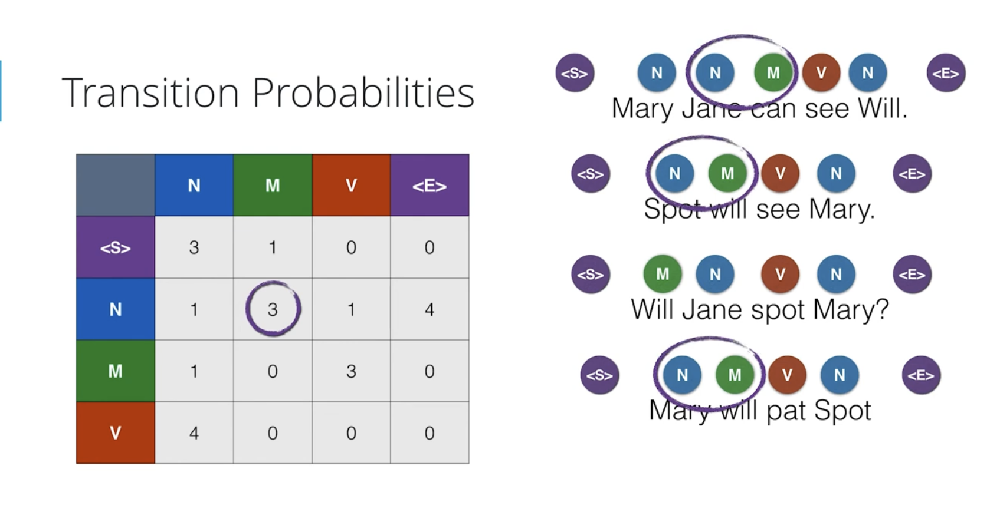
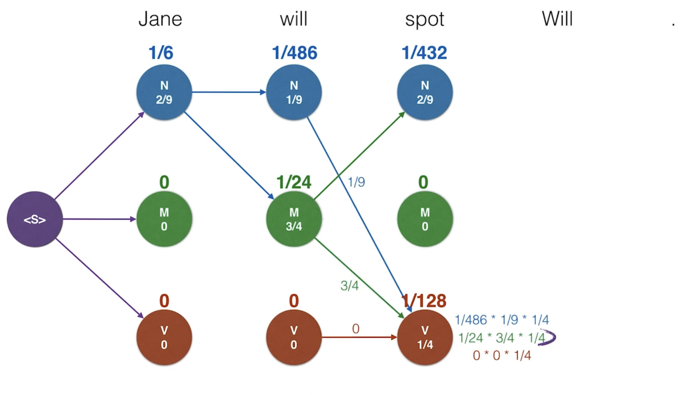
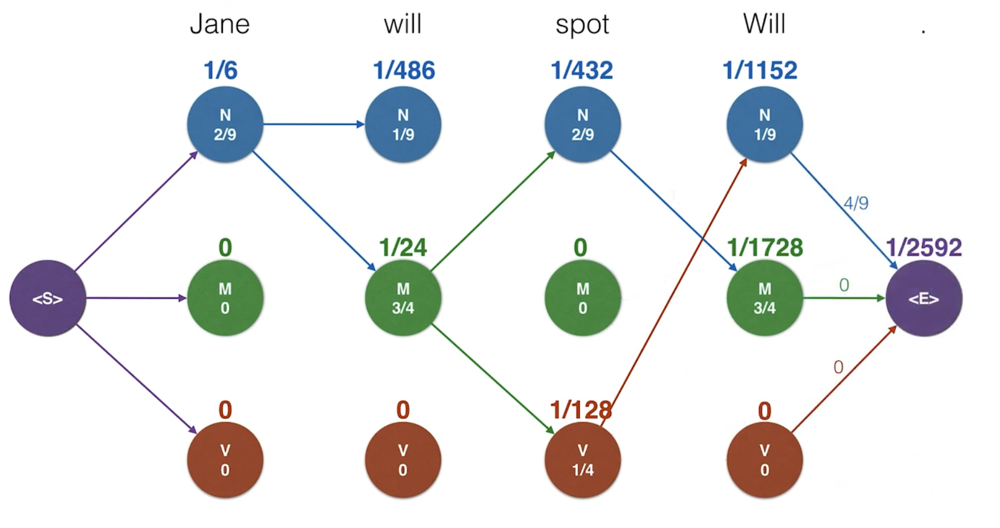

<br>
<br>


# Fundamentals ofProbabilistic Graphical Model

<br>
<br>


# CHAPTER-1: Introduction to Probabilistic Models

<br>
<br>


## Why Use Probabilistic Models?

Knowledge-based AI agents utilize belief state to reason and plan under uncertainty.
They use Probabilistic Models and Bayes Networks as the tools for these AI agents to quantify and act under the uncertainty of the surrounding world. Unlike the logical assertions, which see the possible worlds in a set of strict rules, the probabilistic assertions quantify how probable the various worlds are.


### Bayesian Networks (Bayes Nets)

Bayesian Networks are probabilistic graphical models that represent dependencies among variables using a directed acyclic graph (DAG). Think of it as a family tree of probabilities, where each node's probability depends only on its parent nodes, making complex probability calculations much more manageable.

## Detailed Explanation

### Core Components

1. Network Structure

   - Directed Acyclic Graph (DAG)
   - Nodes represent random variables
   - Edges represent direct dependencies
   - Conditional Independence relationships

2. Probability Tables

   - Each node has CPT (Conditional Probability Table)
   - P(X|Parents(X)) for each node X
   - Root nodes have prior probabilities


### Mathematical Foundation

1. Chain Rule

   P(X₁,...,Xₙ) = ∏ᵢ P(Xᵢ|Parents(Xᵢ))


2. Conditional Independence

   P(X|Y,Z) = P(X|Z) if X ⊥ Y|Z


## Key Features

1. Compact Representation
   - Reduces complexity from O(2ⁿ) to O(2ᵏ)
   - k = maximum number of parents

2. Inference Types
   - Exact inference
   - Approximate inference
   - Most Probable Explanation (MPE)


## Common Applications

1. Medical Diagnosis
   - Symptoms → Diseases
   - Risk factors → Conditions

2. Decision Support
   - Expert systems
   - Risk assessment
   - Fault diagnosis

## Building Bayes Nets

1. Structure Learning
   - Expert knowledge
   - Data-driven approaches
   - Hybrid methods

2. Parameter Learning
   - Maximum Likelihood Estimation
   - Bayesian Estimation
   - EM Algorithm for hidden variables

## Inference Methods

1. Variable Elimination
   - Factor multiplication
   - Marginalization
   - Ordered elimination

2. Sampling Methods
   - Forward sampling
   - Likelihood weighting
   - Gibbs sampling

## Limitations

1. Computational Complexity
   - Exact inference is NP-hard
   - Structure learning is complex

2. Data Requirements
   - Large datasets needed
   - Quality of probability estimates

## Best Practices

1. Network Design
   - Keep structure simple
   - Use expert knowledge
   - Validate independence assumptions

2. Inference Choice
   - Consider problem size
   - Balance accuracy vs speed
   - Use approximations when appropriate


<br>
<br>

# CHAPTER-2: Probability

<br>

Key concepts in probability including:

- Discrete distributions
- Joint probabilities
- Conditional probabilities

We make inferences (query) from Bayes Nets based on the evidence variables and the conditional probabilities as configured in the Bayes Nets. of the evidence variables as defined in the network.


## Law of Conditional Probability

<br>

For any two events A and B:

**P(A|B) = P(A, B)/P(B)**
**P(A, B)=P(A|B)P(B)**

Where:

- P(A|B) is the probability of event A occurring given that event B has occurred
- P(A, B) or P(A ∩ B) is the probability of both events A and B occurring (intersection)
- P(B) is the probability of event B occurring

This can be rearranged to give us the multiplication rule: P(A ∩ B) = P(A|B) × P(B)

Key properties:

0 ≤ P(A|B) ≤ 1
P(B) must be > 0
P(A|B) ≠ P(B|A) in general

When A and B are independent event,  P(A ∩ B) = P(A)P(B)

**P(A|B) = P(A)**

For three events A, B, and C, we use the same principle twice:

P(A|B,C) = P(A,B,C)/P(B,C)
P(A|B,C)P(B,C) = P(A,B,C)

**P(A,B,C) = P(A|B,C)P(B|C)P(C)** [Note: Use P(B,C) = P(B|C)P(C)]


<br>

## Law of Total Probability

<br>

For any events A and B, and a set of mutually exclusive and exhaustive events {C, ¬C}:

**P(A|B) = P(A|C,B)P(C|B) + P(A|¬C,B)P(¬C|B)**

Where:

- P(A|B) is the total conditional probability of A given B
- {C, ¬C} form a partition of the sample space (meaning C and ¬C are:)
- Mutually exclusive: P(C ∩ ¬C) = 0
- Exhaustive: P(C) + P(¬C) = 1
- P(C|B) + P(¬C|B) = 1

This is a special case of the more general Law of Total Probability: For any event A and a partition {C₁, C₂, ..., Cₙ}: 

**P(A) = ∑ᵢ P(A|Cᵢ)P(Cᵢ)**

<br>

We start with the definition of conditional probability for P(A|B):

**P(A|B) = P(A,B)/P(B)**

Since C and ¬C partition the sample space, we can split P(A,B):

P(A,B) = P(A,B,C) + P(A,B,¬C)
P(A|B) = [P(A,B,C) + P(A,B,¬C)]/P(B)

Use the chain rule on each term:

P(A,B,C) = P(A|B,C)P(B,C) = P(A|B,C)P(C|B)P(B) = P(B)P(C|B)P(A| B,C)
P(A,B,¬C) = P(A|B,¬C)P(B,¬C) = P(A|B,¬C)P(¬C|B)P(B) = P(B)P(¬C|B)P(A| B,¬C)

Substituting back:

P(A|B) = [P(A|B,C)P(C|B)P(B) + P(A|B,¬C)P(¬C|B)P(B)]/P(B)
P(A|B) = P(A|C,B)P(C|B) + P(A|¬C,B)P(¬C|B)

This shows how we can express P(A|B) in terms of the conditional probabilities involving C and ¬C.

<br>

## Chain Rule of Probability

<br>

The general formula for the joint probability of multiple events is known as the chain rule of probability or the general 
product rule. For n events A₁, A₂, ..., Aₙ, the general formula is:

   **P(A₁, A₂, ..., Aₙ) = P(A₁) * P(A₂|A₁) * P(A₃|A₁,A₂) * ... * P(Aₙ|A₁,A₂,...,Aₙ₋₁)**


**We can prove this rule using law of conditional probability:**

<br>

1. Start with two variables (law of conditional probability):

P(A|B) = P(A,B)/P(B)
Therefore: P(A,B) = P(A|B)P(B)


2. For three variables, start with:

P(A,B,C) = P(A|B,C)P(B,C)

This is using the same rule as step 1, but with B,C treated as one event

3. Now expand P(B,C) using the rule from step 1:

P(B,C) = P(B|C)P(C)


4. Substitute this back into the equation from step 2:

P(A,B,C) = P(A|B,C)P(B,C)
         = P(A|B,C)P(B|C)P(C)


This gives us the Chain Rule for three variables:

P(A,B,C) = P(A|B,C)P(B|C)P(C)


This can be extended to n variables by continuing the same process:

**P(A₁,A₂,...,Aₙ) = P(A₁|A₂,...,Aₙ)P(A₂|A₃,...,Aₙ)...P(Aₙ₋₁|Aₙ)P(Aₙ)**

<br>
<br>

**For 4 events A, B, C, and D, start with:**

**P(A, B, C | D)** 
using the chain rule, we condition each event on the previous ones given 
**D**. Here's how it looks step by step:

**P(A, B, C | D) = P(A | B, C, D) × P(B | C, D) × P(C | D)**

Here's the detailed breakdown:

- **First Event (C):**
  - **P(C | D)** - The probability of **C** given **D**.

- **Second Event (B):**
  - **P(B | C, D)** - The probability of **B** given both **C** and **D**.

- **Third Event (A):**
  - **P(A | B, C, D)** - The probability of **A** given **B**, **C**, and **D**.

So, the full expansion by the chain rule is:

**P(A, B, C | D) = P(A | B, C, D) × P(B | C, D) × P(C | D)**

This equation shows how we sequentially condition each event on all previous events and the given condition **D**. Here's what it means in words:

- Given **D**, we first consider the probability of **C**.
- Then, given **D** and **C**, we look at the probability of **B**.
- Finally, given **D**, **C**, and **B**, we evaluate the probability of **A**.

This method allows us to break down complex joint conditional probabilities into simpler conditional probabilities, making it easier to compute or estimate when the individual conditional probabilities are known or can be determined.


<br>
<br>


<br>
<br>

# CHAPTER-3: Spam Classifier with Naive Bayes


### Problem: Alex comes to the office 3 days a week and Brenda comes to the office 1 day a week. We saw a Person had red sweater. Alex wears red 2 times a week and Brenda wears red 3 times a week.

The scenario is they work remotely from home rest of the days and they can wear red even when working from home. Let me break this down:

For Alex:
- Comes to office 3/5 days = 0.75 (Prior P(A))
- Wears red 2/5 times = 0.4 (P(R|A))
- Red wearing is independent of office attendance

For Brenda:
- Comes to office 1/5 days = 0.25 (Prior P(B))
- Wears red 3/5 times = 0.6 (P(R|B))
- Red wearing is independent of office attendance

Using Bayes Theorem to find P(A|R) - probability it was Alex given we saw red:

<br>

```math
\begin{align*}
P(A|R) &= P(R|A) \times P(A) / P(R) \\\\
\text{where }P(R) &= P(R|A) \times P(A) + P(R|B) \times P(B) \\
          &= 0.4 \times 0.75 + 0.6 \times 0.25 \\
          &= 0.3 + 0.15 \\
          &= 0.45 \\\\
P(A|R) &= (0.4 \times 0.75) / 0.45 \\
      &= 0.3 / 0.45 \\
      &= 0.667 \\
      &\approx 66.7\%
\end{align*}
```

Now the numbers make sense because:

1. They can wear red while working remotely
2. Red sweater wearing is independent of office attendance
3. The probabilities reflect their overall red-wearing pattern, not just office days


<br>

```asciiarmor
                  P(R|A)
       P(A) ─→ A ─┬─→ R     P(R∩A)
Event ─┤          └─→ Rᶜ    P(Rᶜ∩A)
      │
      │            P(R|B)
       P(B) ─→ B ─┬─→ R     P(R∩B)
                  └─→ Rᶜ    P(Rᶜ∩B)

                   P(R|A)
      P(A) ─→ A ────→ R     P(A)P(R|A)
Event ─┤          
     │
     │            P(R|B)
      P(B) ─→ B ────→ R     P(B)P(R|B)
```

<br>

```math
P(A|R) = P(A)P(R|A) / [P(A)P(R|A) + P(B)P(R|B)]\\
P(B|R) = P(B)P(R|B) / [P(A)P(R|A) + P(B)P(R|B)]
```


### Problem: Say, a diagnostic test for a disease has a 99% accuracy and 1 out of 10,000 people are sick. What is the probability that a person is sick (has disease) if the test says positive?

S: sick
H: healthy
+: positive

Given probabilities:

P(S) = 0.0001
P(H) = 0.9999
P(+|S) = 0.99
P(+|H) = 0.01


Total: 1,000,000


```

                              (+) Test
                           ┌─→ 99    (True +)
                     ┌─ 100 ┤
            Sick     │      └─→ 1     (False -)
1000000 ──┤          │
            Healthy  │              ┌─→ 9,999  (False +)
                     └─ 999,900 ─┤
                                 └─→ 989,901 (True -)

```

1 out of every 10,000 patients is sick, Test has 99% accuracy

Patient tested positive =
P(sick|+) = 99/(9,999 + 99)
         = 0.0098
         < 1

P(S|+) = P(S)P(+|S) / [P(S)P(+|S) + P(H)P(+|H)]
       = 0.0001 * 0.99 / (0.0001 * 0.99 + 0.9999 * 0.01)
       = 0.0098
       < 1%


### Problem: Spam Classifier

```

Spam:
Win money now!
Make cash easy!
Cheap money, reply.

Ham:
How are you?
There you are!
Can I borrow money?
Say hi to grandma.
Was the exam easy?

P(spam | 'easy')

Email ─┬─→ Spam (3/8) ─┬─→ 'easy' (1/3)
       │              └─→ no (2/3)
       │
       └─→ Ham (5/8) ──┬─→ 'easy' (1/5)
                       └─→ no (4/5)

```


This diagram shows:

1. Prior Probabilities:
   - P(Spam) = 3/8
   - P(Ham) = 5/8

2. Conditional Probabilities:
   For Spam:
   - P('easy'|Spam) = 1/3
   - P(no|Spam) = 2/3

   For Ham:
   - P('easy'|Ham) = 1/5
   - P(no|Ham) = 4/5

This can be used to calculate P(spam|'easy') using Bayes' Theorem:

P(spam|'easy') = P(spam)P('easy'|spam) / [P(spam)P('easy'|spam) + P(ham)P('easy'|ham)]
                = (3/8 × 1/3) / [(3/8 × 1/3) + (5/8 × 1/5)]


P(spam | 'money')

```

Email ─┬─→ Spam (3/8) ─┬─→ 'money' (2/3)   1/4
       │              └─→ no (1/3)         1/4
       │
       └─→ Ham (5/8) ──┬─→ 'money' (1/5)   1/8
                       └─→ no (4/5)         1/2
```


This shows the probability breakdown for emails containing 'money':

1. Prior Probabilities:
   - P(Spam) = 3/8
   - P(Ham) = 5/8

2. Conditional Probabilities:
   For Spam:
   - P('money'|Spam) = 2/3
   - P(no|Spam) = 1/3

   For Ham:
   - P('money'|Ham) = 1/5
   - P(no|Ham) = 4/5

3. Joint Probabilities (shown on right):
   - P(Spam ∩ 'money') = 1/4
   - P(Spam ∩ no) = 1/4
   - P(Ham ∩ 'money') = 1/8
   - P(Ham ∩ no) = 1/2


These are the Bayes' Theorem formulas for calculating:

1. P(A|R): Probability of A given R occurred
2. P(B|R): Probability of B given R occurred

The denominator [P(A)P(R|A) + P(B)P(R|B)] represents P(R), the total probability of R occurring, which can happen through either path A or path B.

These formulas allow us to update our prior probabilities P(A) and P(B) to posterior probabilities P(A|R) and P(B|R) after observing evidence R.


This tree diagram shows:

1. Initial probabilities: P(A) and P(B)
2. Conditional probabilities: P(R|A) and P(R|B)
3. Complementary events: R and Rᶜ (not R)
4. Joint probabilities: P(R∩A), P(Rᶜ∩A), P(R∩B), P(Rᶜ∩B)

The structure illustrates how Bayes Theorem decomposes conditional probabilities in a hierarchical manner.


## Naive Bayes Algorithm

Bayes Theorem transfers from what we know to what we infer. Naive Bayes is a probabilistic algorithm based on Bayes' Theorem that assumes all features are independent of each other. This "naive" assumption makes the calculations much simpler but isn't always realistic in real-world situations.

## Why "Naive"?

Consider spam detection example:

- If we see "money" and "easy" in an email:
  * Algorithm assumes these words appear independently
  * In reality, "easy money" is a common spam phrase
  * Words in real text are often related

This independence assumption is what makes it "naive", but surprisingly effective!

Being able to identify spam messages is a binary classification problem as messages are classified as either 'Spam' or 'Not Spam' and nothing else. Also, this is a supervised learning problem, as we know what we are trying to predict. We will be feeding a labeled dataset into the model, that it can learn from, to make future predictions.


P(spam | 'easy', 'money') ∝ P('easy', 'money' | spam)P(spam)
P(spam | 'easy', 'money') ∝ P('easy' | spam)P('money' | spam)P(spam) [Note: P(A & B) = P(A)P(B)]


Let me explain these two forms:

1. Full Bayes' Theorem:

P(A|B) = P(B|A)P(A)/P(B)

This can be rewritten as:

P(A|B)P(B) = P(B|A)P(A)


2. Proportional Form (∝):

P(A|B) ∝ P(B|A)P(A)


Why use proportional form?

1. Often we don't need exact probabilities, just relative ones
2. We can skip calculating P(B) which is often complex
3. P(B) acts as a normalizing constant

In spam example:

P(spam|words) ∝ P(words|spam)P(spam)

Instead of:

P(spam|words) = P(words|spam)P(spam)/P(words)


Advantages:

- Simpler calculations
- Same classification results
- Avoid computing denominator P(words)
- Can normalize at the end if needed

The ∝ symbol basically means "proportional to" - the relative relationships stay the same even without the denominator.


## Bayes' Theorem Applied

Given an email with word "money":

P(spam|money) = P(money|spam) × P(spam) / P(money)

Where:
- P(spam|money): Probability it's spam given it has "money"
- P(money|spam): Probability of "money" appearing in spam
- P(spam): Prior probability of any email being spam
- P(money): Total probability of word "money" appearing


## Example from Data

Using numbers from example:
1. Prior Probabilities:
   - P(spam) = 3/8
   - P(ham) = 5/8

2. Conditional Probabilities:
   
   For word "money":
   - P(money|spam) = 2/3
   - P(money|ham) = 1/5


3. When multiple words appear:
   
   P(spam|money,easy) ∝ P(money|spam) × P(easy|spam) × P(spam)

   * The ∝ symbol means "proportional to"
   * We multiply because of independence assumption

## Why It Works

1. Despite naive assumptions:
   - Fast and simple calculations
   - Works well for text classification
   - Easy to understand and implement

2. Advantages:
   - Requires small training data
   - Handles multiple classes well
   - Real-time prediction

## Common Applications

1. Text Classification:
   - Spam detection
   - Document categorization
   - Sentiment analysis

2. Medical Diagnosis:
   - Symptom independence assumption
   - Quick preliminary diagnosis

<br>
<br>

# CHAPTER-4 Bayes Nets

<br>

Probabilistic graphical models expands on Bayes Networks (also known as Bayes Nets), which explicitly encode the dependencies between variables to model joint probability distributions. They are particularly useful because they provide a compact representation for practically arbitrary distributions, and efficient algorithms exist to sample and perform inference over the joint distribution.

Bayes Nets is a graph that has no directed cycles, also known as a directed acyclic graph, or DAG. To build Bayes Nets, we need to specify the following:

1. Random Variables: Each node corresponds to a random variable.
2. Conditional Relations: A set of directed links or arrows connects pairs of nodes.
3. Probability Distributions: Each node has a conditional probability distribution that quantifies the effect of the parents on the node.


<br>

<br>


**Bayes Rule**


```

P(A|B) = P(B|A)P(A)/P(B)

P(¬A|B) = P(B|¬A)P(¬A)/P(B)

P'(A|B) = P(B|A)P(A)
P'(¬A|B) = P(B|¬A)P(¬A)

P(A|B) + P(¬A|B) = 1

P(A|B) = η P'(A|B) [Note: η=1/P(B)]
P(¬A|B) = η P'(¬A|B)

η P'(A|B) + η P'(¬A|B) = 1
η = (P'(A|B) + P'(¬A|B))⁻¹

P(B) = (P'(A|B) + P'(¬A|B))

```


This shows:

1. Standard Bayes Rule equation
2. Complementary form for ¬A (not A)
3. Unnormalized forms (P')
4. Normalization constraint
5. Relationship between normalized and unnormalized probabilities
6. Definition of normalization constant η (eta)

The prime notation (P') indicates unnormalized probabilities, and η is used to normalize them to proper probabilities that sum to 1.

Let me substitute step by step:

1. Given: P(A|B) = η P'(A|B) and η = (P'(A|B) + P'(¬A|B))⁻¹

2. Substitute η:

P(A|B) = P'(A|B)/(P'(A|B) + P'(¬A|B))


3. Now substitute P'(A|B) and P'(¬A|B):

P'(A|B) = P(B|A)P(A)
P'(¬A|B) = P(B|¬A)P(¬A)

P(A|B) = [P(B|A)P(A)]/[P(B|A)P(A) + P(B|¬A)P(¬A)]
[P(B|A)P(A) + P(B|¬A)P(¬A)] = [P(B|A)P(A)]/P(A|B)


P(A|B)P(B)=[P(B|A)P(A)]
P(B) = [P(B|A)P(A)]/P(A|B)


4. This is equivalent to the original Bayes' Rule because:

**P(B) = P(B|A)P(A) + P(B|¬A)P(¬A)**


So we've shown that:

**P(A|B) = P(B|A)P(A)/P(B) = P(B|A)P(A)/[P(B|A)P(A) + P(B|¬A)P(¬A)]**


This demonstrates why η is called the normalization constant - it ensures the probabilities sum to 1.


<br>
<br>


### Two Test Cancer Example

<br>

```
C           P(C) = 0.01    P(¬C) = 0.99
T₁ T₂       P(+|C) = 0.9   P(-|C) = 0.1
           P(-|¬C) = 0.8   P(+|¬C) = 0.2

P(C|T₁=+,T₂=+) = P(C|++) = 0.1698
P(C|T₁=+,T₂=-) = P(C|+-) = [blank]

Table:
     prior   +     -      P'    P(C|+-)
C     0.01   0.9   0.1   0.0009  0.0056
¬C    0.99   0.2   0.8   0.1584  0.9943
                         0.1593

```

<br>


This shows a cancer testing scenario with:

1. Prior probabilities of having cancer (C) or not (¬C)
2. Test accuracies for positive (+) and negative (-) results
3. Calculations for probability of having cancer given test results
4. Shows how combining two test results affects the posterior probability


Let me break down this cancer testing example step by step:

1. Prior Probabilities:
- P(C) = 0.01 (1% chance of having cancer)
- P(¬C) = 0.99 (99% chance of not having cancer)

2. Test Accuracies:

- P(+|C) = 0.9 (90% chance of positive test if you have cancer)
- P(-|C) = 0.1 (10% chance of negative test if you have cancer)
- P(-|¬C) = 0.8 (80% chance of negative test if you don't have cancer)
- P(+|¬C) = 0.2 (20% chance of positive test if you don't have cancer)

3. Calculating P(C|++)

Let me explain using Bayes' Theorem and the normalization formula:

P(C|T₁=+,T₂=+) = P'(C)/(P'(C) + P'(¬C))

This is equivalent to:

P(C|++) = P(C)P(+|C)P(+|C)/[P(C)P(+|C)P(+|C) + P(¬C)P(+|¬C)P(+|¬C)]


The naive assumption allows us to multiply the individual test probabilities because we assume the tests are independent:

- P(T₁=+,T₂=+|C) = P(T₁=+|C) × P(T₂=+|C)
- P(T₁=+,T₂=+|¬C) = P(T₁=+|¬C) × P(T₂=+|¬C)

When both tests are positive:

P'(C) = P(C)xP(+|C)xP(+|C)= 0.01 × 0.9 × 0.9 = 0.0081
P'(¬C) = P(¬C)xP(+|¬C)xP(+|¬C)= 0.99 × 0.2 × 0.2 = 0.0396

Normalize: 0.0081/(0.0081 + 0.0396) = 0.1698


4. Calculating P(C|+-):
When first test positive, second negative:

P'(C) = P(C)xP(+|C)xP(-|C) = 0.01 × 0.9 × 0.1 = 0.0009
P'(¬C) = P(¬C)xP(+|¬C)xP(-|¬C) = 0.99 × 0.2 × 0.8 = 0.1584

Normalize: 0.0009/(0.0009 + 0.1584) = 0.0056


This shows how:

- Two positive tests increase cancer probability from 1% to 17%
- Mixed results (+ and -) decrease cancer probability to 0.56%
- Even with positive test(s), cancer probability remains relatively low due to low prior probability

This is a classic example of why medical tests need to be interpreted in context of prior probabilities.

<br>
<br>

These formulas come from applying Bayes' Theorem and the Naive assumption. Let me break it down:

1. Original Bayes' Theorem:

**P(C|T₁,T₂) = P(T₁,T₂|C)P(C)/P(T₁,T₂)**


2. Naive Assumption (independence):

**P(T₁,T₂|C) = P(T₁|C) × P(T₂|C)**


3. Total Probability for denominator:

**P(T₁,T₂) = P(T₁,T₂|C)P(C) + P(T₁,T₂|¬C)P(¬C)**


4. Putting it together:

**P(C|T₁=+,T₂=+) = [P(+|C)×P(+|C)×P(C)] / [P(+|C)×P(+|C)×P(C) + P(+|¬C)×P(+|¬C)×P(¬C)]**


5. To simplify notation:

- Let P'(C) = P(+|C)×P(+|C)xP(C)
- Let P'(¬C) = P(+|¬C)×P(+|¬C)xP(¬C)

Therefore:

**P(C|T₁=+,T₂=+) = P'(C)/(P'(C) + P'(¬C))**


The P' notation is just a shorthand for the unnormalized probabilities before we divide by their sum. This formula shows the probability of the second test being positive given that the first test was positive. Let's break it down:

**P(T₂=+ | T₁=+) = P(T₂|+₁,C)P(C|+₁) + P(T₂|+₁,¬C)P(¬C|+₁)**

1. Total Probability Theorem:

- It splits the probability into two cases:
  * When cancer is present (C)
  * When cancer is absent (¬C)

2. Components:

- P(T₂|+₁,C): Probability of second test positive given first test positive and cancer
- P(C|+₁): Probability of cancer given first test positive
- P(T₂|+₁,¬C): Probability of second test positive given first test positive and no cancer
- P(¬C|+₁): Probability of no cancer given first test positive

3. Due to Naive Independence Assumption:

**P(T₂|+₁,C) = P(T₂|C) = 0.9**
**P(T₂|+₁,¬C) = P(T₂|¬C) = 0.2**


This formula helps understand how the result of the first test affects the probability of the second test being positive, taking into account both cancer and no-cancer scenarios.

Let me solve this step by step:

P(T₂=+ | T₁=+) = P(T₂|+₁,C)P(C|+₁) + P(T₂|+₁,¬C)P(¬C|+₁)

1. First we need P(C|+₁) - probability of cancer given first positive test:

P(C|+₁) = P(+₁|C)P(C)/[P(+₁|C)P(C) + P(+₁|¬C)P(¬C)]
        = (0.9 × 0.01)/[(0.9 × 0.01) + (0.2 × 0.99)]
        = 0.009/[0.009 + 0.198]
        = 0.009/0.207
        ≈ 0.0435 (4.35%)


2. Then P(¬C|+₁) = 1 - P(C|+₁) = 0.9565

3. Due to naive independence:

- P(T₂|+₁,C) = P(T₂|C) = 0.9
- P(T₂|+₁,¬C) = P(T₂|¬C) = 0.2

4. Now plug everything into original formula:

P(T₂=+ | T₁=+) = (0.9 × 0.0435) + (0.2 × 0.9565)
                = 0.03915 + 0.1913
                = 0.23045
                ≈ 0.23 (23%)


This means there's about a 23% chance the second test will be positive if we know the first test was positive. This is higher than the baseline rate because positive tests increase the probability of cancer, and cancer increases the probability of positive tests.


### Absolute And Conditional

A ⊥ B
A ⊥ B|C

A ⊥ B → A ⊥ B|C   False [X]
A ⊥ B|C → A ⊥ B   False [X]


The symbol ⊥ (inverted T) represents "independence" in probability theory. So:

1. A ⊥ B means "A is independent of B"
   - P(A|B) = P(A) or equivalently P(A,B) = P(A)P(B)

Example: Consider a simple case where:

A = "Taking an umbrella"
B = "Wearing a raincoat"
C = "It's raining"

Initially, your choice of taking an umbrella might be independent of wearing a raincoat (A ⊥ B). But if you know it's raining (conditioning on C), these choices become dependent because people tend to use either one or both when it rains
This phenomenon is known as "explaining away"


2. A ⊥ B|C means "A is conditionally independent of B given C"
   - P(A|B,C) = P(A|C) or P(A,B|C) = P(A|C)P(B|C)


Example:

A = "Fire alarm going off"
B = "Sprinklers activated"
C = "Fire in building"

Given that we know there's a fire (C), the fire alarm and sprinklers might activate independently (A ⊥ B|C). But without knowing about the fire, seeing the sprinklers on makes the fire alarm more likely (and vice versa), so A and B are not independent

The diagram shows that:

- A and B by themselves are independent (top row)
- A and B are conditionally independent given C (common cause)

The False statements indicate that:

1. Absolute independence doesn't imply conditional independence
2. Conditional independence doesn't imply absolute independence

This is important in Bayesian networks where:
- Variables can be dependent but conditionally independent
- Variables can be independent but conditionally dependent
- Having a common cause (C) can create dependencies between otherwise independent variables


There are two algorithms that to compute exact inferences:

   1. Enumeration: the query’s conditional probability is computed by summing the terms from the full joint distribution.
   2. Variable Elimination: an algorithm to reduce the enumeration computation by doing the repeated calculations once and 
      store the results for later re-use.

However, it is computationally expensive to make exact inference from a large and highly connected Bayes Network. In these 
cases, we can approximate inferences by sampling. Sampling is a technique to select and count the occurances of the query 
and evidence variables to estimate the probability distributions in the network. We looked at four sampling techniques as 
follows:

   1. Direct sampling: the simplest form of samples generation from a known probability distribution. For example, to sample the 
      odds of Head or Tail in a coin flip, we can randomly generate the events based on uniform probability distribution (assuming 
      we use a non-bias coin).
   2. Rejection sampling: generates samples from the known distribution in the network and rejects the non-matching evidence.
   3. Likelihood sampling: is similar to rejection sampling but generating only events that are consistent with the evidence.
   4. Gibbs sampling: initiates an arbitrary state and generates the next state by randomly sampling a non-evidence variable, 
      while keeping all evidence variables fixed.


In our specific case with cancer (C) and two test results (T1 and T2), we have using chgain rule of probability:

   P(C, T1=+, T2=+) = P(C) * P(T1=+|C) * P(T2=+|C,T1=+)

However, we typically assume that the test results are conditionally independent given the disease status. This means that 
knowing the result of one test doesn't affect the probability of the result of the other test, given that we know whether 
the person has cancer or not. Under this assumption:

   P(T2=+|C,T1=+) = P(T2=+|C)

Which is why we can simplify to:

   **P(C, T1=+, T2=+) = P(C) * P(T1=+|C) * P(T2=+|C)**

This assumption of conditional independence is common in many probabilistic models, including Naive Bayes classifiers, but 
it's important to recognize that it's an assumption that may not always hold in real-world scenarios.


General form of Bayes' theorem:

   **P(A|B) = P(B|A) * P(A) / P(B)**

In our specific case:

   **P(C|T1=+,T2=+) = [P(T1=+,T2=+|C) * P(C)] / P(T1=+,T2=+)**

Where:
- A is C (having cancer)
- B is (T1=+,T2=+) (both tests being positive)

Breaking it down further:

1. P(T1=+,T2=+|C) * P(C) is equivalent to P(C,T1=+,T2=+), by the chain rule of probability:

   **P(C,T1=+,T2=+) = P(T1=+,T2=+|C) * P(C)**

2. P(T1=+,T2=+) in the denominator can be expanded using the law of total probability. The Law of Total Probability states that for any 
   event B and a set of mutually exclusive and exhaustive events A₁, A₂, ..., Aₙ:

   **P(B) = P(B|A₁)P(A₁) + P(B|A₂)P(A₂) + ... + P(B|Aₙ)P(Aₙ)**
   
   So, we find:

   **P(T1=+,T2=+) = P(T1=+,T2=+|C) * P(C) + P(T1=+,T2=+|¬C) * P(¬C)**

So, the full expansion of the formula in terms of the general Bayes' theorem would be:

   P(C|T1=+,T2=+) = [P(T1=+,T2=+|C) * P(C)] / P(T1=+,T2=+)

   **P(C|T1=+,T2=+) = P(C,T1=+,T2=+) / P(T1=+,T2=+)**


This is a direct application of the definition of conditional probability:

For any events X and Y: P(X|Y) = P(X,Y)/P(Y)

In our case:

X is the event C (having cancer)
Y is the joint event (A,B)

We can rewrite the equation for 3 events A, B, and C as:

   **P (C| A, B) = P (C, A, B) / P (A, B)**

This form directly shows how we're updating our prior belief P(C) based on the likelihood of the test results given cancer 
P(T1=+,T2=+|C) and normalizing it by the total probability of getting these test results.


<br>

## Summary: Probability Theory

<br>

   1. Bayesian Inference:
      - Uses Bayes' theorem to update probabilities based on new evidence.
      - P(A|B) = P(B|A) * P(A) / P(B)

   2. Probabilistic Graphical Models:
      - Represent dependencies between variables (Cancer -> Test1, Test2).
      - Allows for intuitive visualization of the problem structure.

   3. Conditional Independence:
      - Assume T1 and T2 are conditionally independent given C.
      - P(T1,T2|C) = P(T1|C) * P(T2|C)

   4. Chain Rule of Probability:
      - P(A,B,C) = P(A) * P(B|A) * P(C|A,B)

   5. Law of Total Probability:
      - P(B) = P(B|A) * P(A) + P(B|¬A) * P(¬A)


P(A | X, Y) is read as "the probability of A given X and Y" or "the probability of A in the presence of both X and Y."

**More specifically:**

1. P(A | X, Y) represents the conditional probability of event A occurring, given that both events X and Y have occurred.

2. It means we're considering the probability of A in the subset of scenarios where both X and Y are true or have happened.

3. This notation is used when the probability of A depends on or is influenced by the joint occurrence of X and Y.

4. In practical terms, it could represent situations like:
   - The probability of a certain medical condition (A) given two specific symptoms (X and Y)
   - The likelihood of a stock price increase (A) given both positive market trends (X) and good company earnings (Y)

5. It's important to note that P(A | X, Y) may be different from P(A | X) or P(A | Y) individually, as the combination of 
X and Y together might affect the probability of A in ways that X or Y alone do not.

6. In some cases, if X and Y are independent with respect to A, then P(A | X, Y) might equal P(A | X) or P(A | Y), but 
this is not generally assumed without evidence.

This concept is crucial in probability theory, especially in complex scenarios where multiple conditions or events can 
influence the outcome we're interested in.


### Problem: Conditional Probability (Happiness and Raise)

R = Raise (at work)
S = Sunny
H = Happy 


1. Start with Bayes' Theorem for multiple conditions for someone is happy in a sunny day, the probability of getting a raise is:

   P(R|H,S) = P(R,H,S) / P(H,S)

2. For the numerator P(R,H,S), use the chain rule:

   P(R,H,S) = P(H|R,S) × P(R,S)
   P(R,S) = P(R|S) × P(S)

Therefore: 

   **P(R,H,S) = P(H|R,S) × P(R|S) × P(S)**


3. For the denominator P(H,S), use the law of total probability:

   P(H,S) = P(H|S) × P(S)

4. Putting it all together:

P(R|H,S) = P(R,H,S) / P(H,S)
          = [P(H|R,S) × P(R|S) × P(S)] / [P(H|S) × P(S)]
          = P(H|R,S) × P(R|S) / P(H|S)

5. The Law of Total Probability states that for any events A and B, and a complete set of mutually exclusive events C and ¬C:

   **P(A|B) = P(A|C,B)P(C|B) + P(A|¬C,B)P(¬C|B)**

So: 

   P(H|S) = P(H|R,S)P(R|S) + P(H|¬R,S)P(¬R|S)
   **P(H|S) = P(H|R,S)P(R) + P(H|¬R,S)P(¬R)** [Note: R and S are independent]

6. Finally it becomes:

   P(R|H,S) = P(H|R,S) × P(R|S) / P(H|S)
            = P(H|R,S) × P(R) / [P(H|R,S)P(R) + P(H|¬R,S)P(¬R)]

   **P(R|H,S) = P(H|R,S) × P(R) / [P(H|R,S)P(R) + P(H|¬R,S)P(¬R)]**

<br>


Given probabilities:

P(S) = 0.7
P(R) = 0.01
P(R|S) = 0.01
P(R|H,S) = 0.0142

Conditional probabilities:

P(H|S,R) = 1
P(H|¬S,R) = 0.9  
P(H|S,¬R) = 0.7
P(H|¬S,¬R) = 0.1


P(R|H,S) = P(H|R,S) × P(R) / [P(H|R,S)P(R) + P(H|¬R,S)P(¬R)]

= (1 × 0.01) / [1 × 0.01 + 0.7 × 0.99]
= 0.01 / (0.01 + 0.693)
= 0.0142

If someone is happy on a sunny day, the probability they got a raise is 0.0142, which is **1.42%**


## The probability of a raise given I’m happy with no information about the weather:


This is an application of the Law of Total Probability across two independent variables (S and R). Let me explain how we get this:

For any event A and a partition of the sample space into mutually exclusive and exhaustive events, the Law of Total Probability states: 

   **P(A) = ∑ᵢ P(A|Cᵢ)P(Cᵢ)**

In this case:

We want P(H) (probability of being happy) and We have two binary variables S and R, creating four mutually exclusive and exhaustive events:

1. (S,R): Sunny and Raise
2. (¬S,R): Not Sunny and Raise
3. (S,¬R): Sunny and No Raise
4. (¬S,¬R): Not Sunny and No Raise

Applying the Law of Total Probability across all four possibilities: 

   **P(H) = P(H|S,R)P(S,R) + P(H|¬S,R)P(¬S,R) + P(H|S,¬R)P(S,¬R) + P(H|¬S,¬R)P(¬S,¬R)**

This formula accounts for all possible ways someone could be happy:

1. Happy when sunny and got raise: P(H|S,R)P(S,R)
2. Happy when not sunny but got raise: P(H|¬S,R)P(¬S,R)
3. Happy when sunny but no raise: P(H|S,¬R)P(S,¬R)
4. Happy when not sunny and no raise: P(H|¬S,¬R)P(¬S,¬R)


1. Calculate P(S,R):

   Since S and R are independent (given P(R|S) = P(R) = 0.01)
   P(S,R) = P(S)P(R) = 0.7 × 0.01 = 0.007

2. Calculate P(¬S,R):

   P(¬S) = 1 - P(S) = 1 - 0.7 = 0.3
   P(¬S,R) = P(¬S)P(R) = 0.3 × 0.01 = 0.003

3. Calculate P(S,¬R):

   P(¬R) = 1 - P(R) = 1 - 0.01 = 0.99
   P(S,¬R) = P(S)P(¬R) = 0.7 × 0.99 = 0.693

4. Calculate P(¬S,¬R):

   P(¬S,¬R) = P(¬S)P(¬R) = 0.3 × 0.99 = 0.297

Now plug everything into the formula: 

   P(H) = (1 × 0.007) + (0.9 × 0.003) + (0.7 × 0.693) + (0.1 × 0.297) = 0.007 + 0.0027 + 0.4851 + 0.0297 = 0.5245

Therefore, **P(H) = 0.5245 or about 52.45%**, 

This means there's about a 52.45% chance of being happy overall, considering all possible combinations of weather (sunny/not sunny) and raise status (raise/no raise).

To find probability of raise when I'm happy P(R|H), we use Bayes' Theorem:

P(R|H) = P(H|R)P(R)/P(H)
       = 0.97 × 0.01/0.5245
       = 0.0097/0.5245
       = 0.0185 


Therefore, if you're happy, the probability you got a raise is about **1.85%**, which is higher than the base rate of 1% but still quite low - suggesting happiness often comes from factors other than raises!. 


**Key Insights:**
   - Being happy slightly increases the probability of having received a raise (from 1% to 1.85%).
   - Sunny weather and happiness together only marginally increase the probability of a raise (to 1.42%).
   - The overall probability of happiness (52.45%) is influenced more by sunny weather than by getting a raise, due to the 
      low probability of getting a raise.


### Probability of a raise given that I look happy and it’s not sunny:


1. Applying Bayes' Theorem:

   P(R|H,¬S) = P(H,¬S|R)P(R)/P(H,¬S)


2. The Chain Rule states that for any events A, B, and C: 

   P(A,B|C) = P(A|B,C)P(B|C)

So: 

   P(H,¬S|R) = P(H|¬S,R)P(¬S|R)
   P(H,¬S|R) = P(H|¬S,R)P(¬S) [Note: Since R and S are independent, P(¬S|R) = P(¬S)]


3. Therefore:

   P(R|H,¬S) = [P(H|R,¬S)P(¬S)P(R)]/[P(H,¬S)]

4. For denominator P(H,¬S):

   P(H,¬S) = P(H|¬S)P(¬S)

5. Substituting:

   P(R|H,¬S) = [P(H|R,¬S)P(¬S)P(R)]/[P(H|¬S)P(¬S)]

6. The P(¬S) terms cancel out:

   P(R|H,¬S) = P(H|R,¬S)P(R)/P(H|¬S)

7. Since R and S are independent:

   P(R) = P(R|¬S) = P(R|S)
   P(R|H,¬S) = P(H|R,¬S)P(R|¬S)/P(H|¬S)

8. For P(H|¬S), we use the Law of Total Probability:

   P(H|¬S) = P(H|R,¬S)P(R|¬S) + P(H|¬R,¬S)P(¬R|¬S)

9. Substituting:

   **P(R|H,¬S) = P(H|R,¬S)P(R|¬S)/[P(H|R,¬S)P(R|¬S) + P(H|¬R,¬S)P(¬R|¬S)]**

<br>

Our values:

   P(S) = 0.7        P(H|S,R) = 1
   P(R) = 0.01       P(H|¬S,R) = 0.9
   P(R|S) = 0.01     P(H|S,¬R) = 0.7
                     P(H|¬S,¬R) = 0.1

So, probability of a raise given that I look happy and it’s not sunny:

P(H|R,¬S)P(R|¬S)/P(H|¬S) 
   = 0.9x0.01/[0.9x0.01 + 0.1x0.99]
   = 0.009/(0.009 + 0.099)
   = 0.0833


This means if you're happy when it's not sunny, there's about an 8.33% chance you got a raise. This is higher than:
   - Base rate of raises (1%)
   - Probability of raise given just happiness (1.85%)

This makes sense because being happy on a non-sunny day is more likely to be due to something like a raise rather than the weather.

<br>
<br>


## Bayesian Network

<br>

A Bayesian Network (Bayes Net) is a probabilistic graphical model that represents a set of variables and their conditional 
dependencies via a directed acyclic graph (DAG). Based on the information you've shared and the image, let's explain the 
Bayes Net concept in more detail:

1. Components of a Bayes Net:
   - Random variables (In this case: S, R, H)
   - Conditional independence relationships (shown by the graph structure)
   - Probability distributions (given in the image)

2. Structure:
   The graph shows S (Sunny) and R (Raise) as parent nodes to H (Happiness), indicating that H is directly influenced by both S and R.

3. Conditional Independence:
   S and R are not connected, implying they are independent. However, they become conditionally dependent when we observe H (explaining away effect).

4. Probability Distributions:
   - Prior probabilities: P(S), P(R)
   - Conditional probabilities: P(H|S,R), P(H|¬S,R), P(H|S,¬R), P(H|¬S,¬R)

5. Inference:
   The image shows calculations of P(R|H,S) and P(R|H,¬S), demonstrating how we can infer the probability of a raise given happiness and weather conditions.

6. Normalization Constant:
   While not explicitly shown in the image, the concept of normalization constant (α) is used in Bayes Net calculations to simplify computations.

7. Explaining Away:
   The difference between P(R|H,S) and P(R|H,¬S) demonstrates the explaining away effect. The probability of a raise is higher when happy on a non-sunny day because the raise better explains the happiness in the absence of sun.

8. Value of the Network:
   This Bayes Net allows us to model complex relationships and make inferences about unobserved variables based on observed evidence.

9. D-Separation:
   While not directly addressed in the image, d-separation is a concept used in Bayes Nets to determine conditional independence relationships.

This Bayes Net example demonstrates how we can model real-world scenarios with multiple interacting factors, represent their relationships 
probabilistically, and make inferences based on observed evidence. It's a powerful tool for reasoning under uncertainty in AI and machine 
learning applications.

<br>

Let me break this down with examples:

1. **States**: These are the possible values a node can take.
   * Example 1: A "Weather" node might have 3 states: **[Sunny, Rainy, Cloudy]**
   * Example 2: A "Temperature" node might have 2 states: **[Hot, Cold]**

2. **Parents**: These are nodes that directly influence another node.
   * Example: If "Weather" affects "Mood", then Weather is a parent of Mood

Let's work through a concrete example:
Imagine a simple Bayesian network about ice cream sales with these nodes:

1. "Weather" (Parent 1): **[Sunny, Rainy, Cloudy]** (3 states)
2. "Temperature" (Parent 2): **[Hot, Cold]** (2 states)
3. "Ice Cream Sales" (Child node): **[High, Medium, Low]** (3 states)

Let's calculate the parameters needed for "Ice Cream Sales":

1. Number of states - 1 = 3 - 1 = 2 parameters per combination
2. Product of parent states = 3 (Weather states) × 2 (Temperature states) = 6 combinations
3. Total parameters = 2 × 6 = 12 parameters

Why 12 parameters? Because:

For each combination of Weather and Temperature (6 combinations):
   - Sunny & Hot
   - Sunny & Cold
   - Rainy & Hot
   - Rainy & Cold
   - Cloudy & Hot
   - Cloudy & Cold

You need to specify probabilities for 2 of the 3 states (High, Medium) for each combination. The third state (Low) can be calculated since probabilities must sum to 1.

For example, given Sunny & Hot:

   P(Sales=High | Sunny, Hot) = 0.7
   P(Sales=Medium | Sunny, Hot) = 0.2
   P(Sales=Low | Sunny, Hot) = 0.1 (calculated: 1 - 0.7 - 0.2)

This is why we need (states-1) parameters for each combination of parent states. The formula ensures we capture all necessary probabilities while avoiding redundancy.


<br>
<br>

1. **(Number of states - 1)** Let's say we have a node representing "Weather" with 3 states: **[Sunny, Rainy, Cloudy]**

For any given situation, these probabilities must sum to 1.0
If we know:
   P(Sunny) = 0.6
   P(Rainy) = 0.3
Then we can automatically calculate:
   P(Cloudy) = 1 - 0.6 - 0.3 = 0.1
This is why we only need (states - 1) parameters. The last one is determined by the others.

2. **(Product of parent states)** Imagine "Ice Cream Sales" with two parent nodes:

   Weather: [Sunny, Rainy] (2 states)
   Temperature: [Hot, Cold] (2 states)

We need different probabilities for EACH combination:

```
Weather    Temperature    Need probabilities for Ice Cream Sales
Sunny      Hot           Set 1 of probabilities
Sunny      Cold          Set 2 of probabilities
Rainy      Hot           Set 3 of probabilities
Rainy      Cold          Set 4 of probabilities
```

Total combinations = 2 (Weather states) × 2 (Temperature states) = 4

3. **Putting it all together:** If Ice Cream Sales has 3 states **[High, Medium, Low]**:

We need (3-1) = 2 parameters for each combination
We have 4 combinations from parents

Total parameters = 2 × 4 = 8 parameters

This is why we multiply: (Number of states - 1) × (Product of parent states)
The formula ensures we have enough parameters to specify all probabilities while avoiding redundancy, as the last probability in each case can be calculated from the others.


# Bayes Network Parameter Computation

Each node in a Bayesian network needs a set of parameters to define its conditional probability distribution. The number of parameters needed follows this formula:

**Parameters = (|S| - 1) × ∏ᵢ |Pᵢ|**

Where:
- |S| = Number of states for the node
- |Pᵢ| = Number of states for the i-th parent
- ∏ᵢ = Product over all parents

Generally:

 **Parameters = (Number of states - 1) × (Product of parent states)**

<br>

## Common Cases

1. Root nodes (no parents):
   - Only need (states - 1) parameters
   - Single state root nodes need 0 parameters

2. Binary nodes (2 states):
   - Need 1 parameter per parent combination
   - Common in real-world applications

3. Multiple parents:
   - Parameters grow exponentially with parent count
   - Shows why network structure matters


### Quiz: How many probability values are required to specify this Bayes Network?

<br>

**Graph:**
      
```      
A(1)
   2/  |2  \2
  B(2) C(2) D(2)
   |     \   /
  2|      \ /
   E(2)   F(4)
```

<br>


<br>

# Parameter Calculation for Bayesian Network


Each node is labeled with its number of states in parentheses, e.g., A(1) means node A has 1 state.

### 1. Root Node
**Node A (1 state)**:
* Formula: states - 1
* Calculation: 1 - 1 = 0 parameters

### 2. Single Parent Nodes
**Nodes B, C, D (each 2 states)**:
* Formula: (states - 1) × parent states
* For each node: (2 - 1) × 1 = 1 parameter
* Total for single parent nodes: 3 × 1 = 3 parameters

### 3. Node E
**Node E (2 states, parent B has 2 states)**:
* Formula: (states - 1) × parent states
* Calculation: (2 - 1) × 2 = 2 parameters

### 4. Node F
**Node F (4 states, parents C and D each have 2 states)**:
* Formula: (states - 1) × (product of parent states)
* Calculation: (4 - 1) × (2 × 2) = 3 × 4 = 12 parameters

## Total Network Parameters
* Root Node: 0
* Single Parent Nodes: 3
* Node E: 2
* Node F: 12
* Total: 0 + 3 + 2 + 12 = 17 parameters

This network requires 17 parameters to be fully specified, with each node's parameter count determined by its number of states and the states of its parent nodes.


Answer: 13 parameters are needed to specify this network fully.


<br>

```
Node | States | Parents | Calculation | Parameters
-----|---------|---------------------|-------------------|------------
A    | 1       | None                | 1-1 = 0          | 0
B    | 2       | A(1)                | (2-1)×1 = 1      | 1
C    | 2       | A(1)                | (2-1)×1 = 1      | 1
D    | 2       | A(1)                | (2-1)×1 = 1      | 1
E    | 2       | B(2)                | (2-1)×2 = 2      | 2
F    | 4       | C(2),D(2)           | (4-1)×(2×2) = 12 | 12
-----|---------|---------------------|-------------------|------------
Total Parameters: 17
```

### Quiz: How many probability values are required to specify this Bayes Network?

<br>

**Graph:**

```
A(1)   B(1)   C(1)
   \     |     /  |
   \    |    /   |
   \   |   /    |
      D(2)       |
   /    \   \   |
   /      \   \  |
   E(2)    F(2)  G(4)
```

<br>


<br>
Parameter Calculation Table:

```
Node | States | Parents              | Calculation        | Parameters
-----|---------|---------------------|-------------------|------------
A    | 1       | None                | 1-1 = 0           | 0
B    | 1       | None                | 1-1 = 0           | 0
C    | 1       | None                | 1-1 = 0           | 0
D    | 2       | A(1),B(1),C(1)      | (2-1)×(1×1×1) = 1 | 1
E    | 2       | D(2)                | (2-1)×2 = 2       | 2
F    | 2       | D(2)                | (2-1)×2 = 2       | 2
G    | 4       | D(2),C(1)           | (4-1)×(2×1) = 14  | 14
-----|---------|---------------------|-------------------|------------
Total Parameters:                                          19
```

## Parameter Calculation for Bayesian Network (Total: 19)

### 1. Root Nodes
**Nodes A, B, C (each 1 state)**:
* Formula: states - 1
* Calculation: 1 - 1 = 0 parameters each
* Total root parameters: 3 × 0 = 0

### 2. Node D (2 states)
**Parents: A(1), B(1), C(1)**
* Formula: (states - 1) × (product of parent states)
* Calculation: (2 - 1) × (1 × 1 × 1) = 1 parameter

### 3. Nodes E and F (each 2 states)
**Parent: D(2)**
* Formula: (states - 1) × parent states
* For each node: (2 - 1) × 2 = 2 parameters
* Total for E and F: 2 × 2 = 4 parameters

### 4. Node G (4 states)
**Parents: D(2), C(1)**
* Formula: (states - 1) × (product of parent states)
* Calculation: (4 - 1) × (2 × 1) = 14 parameters

## Total Network Parameters
* Root Nodes (A, B, C): 0
* Node D: 1
* Nodes E and F: 4
* Node G: 14
* Total: 0 + 1 + 4 + 14 = 19 parameters

This breakdown shows how the network's 19 parameters are distributed across different node types, with more complex nodes (multiple states and parents) requiring more parameters.


### Car Start Failure Analysis

<br>


<br>

This diagram includes:

1. All nodes with their states
2. All connections between nodes
3. Color coding:
   - Root nodes in light blue
   - Intermediate nodes in light orange
   - Target node (car won't start) in light red
4. States for each node shown in the node label

<br>

## Car Start Failure Network Description

This Bayesian network models the various factors that can cause a car not to start, organized in a hierarchical structure:

### 1. Battery System Chain
- **Battery Age** (1 state) influences:
  - **Battery Dead** (2 states), which affects:
    - **Battery Meter** (2 states) → controls **Lights** (2 states)
    - **Battery Flat** (4 states) → influences multiple indicators

### 2. Charging System Chain
- **Alternator Broken** (1 state) and **Fan Belt Broken** (1 state) both affect:
  - **Not Charging** (4 states) → leads to **Battery Flat**

### 3. Indicator Systems
- **Battery Flat** influences multiple indicators:
  - **Lights** (2 states)
  - **Oil Light** (4 states)
  - **Gas Gauge** (4 states)

### 4. Direct Failure Causes
Multiple components directly affect **Car Won't Start** (16 states):
- **Battery Flat** (4 states)
- **No Oil** (1 state)
- **No Gas** (1 state)
- **Fuel Line Broken** (1 state)
- **Starter Broken** (1 state)
- **Dip Stick** (1 state)

### Network Structure
- **Root Nodes** (8): Components that can fail independently
- **Intermediate Nodes** (7): System states and indicators
- **Target Node** (1): Final outcome (Car Won't Start)

This network captures both:
1. Direct causes of failure (like starter or fuel line problems)
2. Indirect causes through the battery and charging systems
3. Observable indicators (lights, gauges) that can help diagnose the problem


This network effectively models how different car components interact and how their failures propagate through the system to ultimately cause the car not to start, while also including observable symptoms that can help in diagnosis.


### Naive Join Calculation (Incorrect Approach)

The naive join approach incorrectly assumes we need to consider every possible combination of every state of every node:

### 1. Node State Count (Total: 16 nodes)
- Root Nodes (8):
  * Battery Age (1 state)
  * Alternator Broken (1 state)
  * Fan Belt Broken (1 state)
  * Fuel Line Broken (1 state)
  * Starter Broken (1 state)
  * Dip Stick (1 state)
  * No Oil (1 state)
  * No Gas (1 state)

- Intermediate Nodes (7):
  * Battery Dead (2 states)
  * Not Charging (4 states)
  * Battery Meter (2 states)
  * Battery Flat (4 states)
  * Lights (2 states)
  * Oil Light (4 states)
  * Gas Gauge (4 states)

- Target Node (1):
  * Car Won't Start (16 states)

### Naive Join Calculation
2¹⁶ - 1 = 65,535 combinations

This calculation is incorrect because:
1. It treats every node as binary (2 states) when many nodes have 1, 4, or 16 states
2. It ignores the network structure and dependencies
3. It calculates ALL possible combinations rather than just the necessary conditional probabilities
4. It doesn't follow the Bayesian network parameter formula: (States-1) × (Product of parent states)

### Correct Approach
The proper calculation gives us 47 parameters total by:
1. Only considering direct parent-child relationships
2. Using the actual number of states for each node
3. Applying the formula (States-1) × (Product of parent states) for each node
4. Summing up the parameters needed for each node individually


### Conditional Probability Table (CPT) Calculation

The formula Parameters = (States-1) × (Product of parent states) is used to calculate the number of parameters needed in a Conditional Probability Table (CPT) for each node. 

A CPT:
1. Represents the conditional probability distribution for each node
2. Shows the probability of a node being in each state given its parents' states
3. Requires fewer parameters than a naive join because:
   - It only considers direct parent-child relationships
   - Uses the fact that probabilities must sum to 1 (hence the States-1)
   - Follows the Markov assumption that a node only depends on its direct parents


### CPT Parameter Calculation

### 1. Root Nodes (all 1 state):
All have (1-1) = 0 parameters each
- Battery Age (1): 0
- Alternator Broken (1): 0
- Fan Belt Broken (1): 0
- Starter Broken (1): 0
- Fuel Line Broken (1): 0
- Dip Stick (1): 0
Total: 0

### 2. Chain from Battery Age:
- Battery Dead (2 states, parent: Battery Age[1]):
  * (2-1) × 1 = 1
- Battery Meter (2 states, parent: Battery Dead[2]):
  * (2-1) × 2 = 2

### 3. Charging Chain:
- Not Charging (4 states, parents: Alternator[1], Fan Belt[1]):
  * (4-1) × (1 × 1) = 3
- Battery Flat (4 states, parent: Not Charging[4]):
  * (4-1) × 4 = 12

### 4. Indicator Nodes:
- Lights (2 states, parents: Battery Meter[2], Battery Flat[4]):
  * (2-1) × (2 × 4) = 8
- Oil Light (4 states, parent: Battery Flat[4]):
  * (4-1) × 4 = 12
- Gas Gauge (4 states, parent: Battery Flat[4]):
  * (4-1) × 4 = 12

### 5. Target Node:
- Car Won't Start (16 states, parents: Battery Flat[4], No Oil[1], No Gas[1], Fuel Line[1], Starter[1], Dip Stick[2]):
  * (16-1) × (4 × 1 × 1 × 1 × 1 × 2) = 15 × 8 = 47

### Total Parameters:
Root nodes: 0
Battery chain: 1 + 2 = 3
Charging chain: 3 + 12 = 15
Indicators: 8 + 12 + 12 = 32
Target node: 47
Total: 47 parameters


<br>
<br>


# D-Separation (Directional Separation)

D-separation is a criterion that determines whether two variables in a Bayesian network are conditionally independent given observed variables. It helps us understand information flow in the network.

## Three Fundamental Connection Types:

### 1. Serial Connection (Chain)

**A → B → C**

- If B is observed: A and C are D-separated (conditionally independent)
- If B is not observed: A and C are D-connected (dependent)
- Example: Battery Dead → Lights Dim → Visibility Poor
  * If we know Lights are Dim (B), Battery Dead (A) doesn't give extra info about Visibility (C)

### 2. Diverging Connection (Common Cause)


  B
 ↙ ↘
A   C

- If B is observed: A and C are D-separated
- If B is not observed: A and C are D-connected
- Example: Battery Dead → Lights Off, Battery Dead → Radio Off
  * If we know Battery is Dead (B), Lights Off (A) doesn't tell us anything new about Radio (C)

### 3. Converging Connection (V-structure)


A   C
 ↘ ↙
  B


- If B or any of B's descendants are observed: A and C are D-connected
- If B and its descendants are not observed: A and C are D-separated
- Example: Battery Dead → Car Won't Start ← Out of Gas
  * If we know Car Won't Start (B), Battery Dead (A) tells us something about Gas (C)

## Key Rules:
1. Two variables are D-separated if ALL paths between them are blocked
2. A path is blocked if it contains:
   - A serial or diverging connection where the middle node is observed
   - A converging connection where neither the middle node nor its descendants are observed
3. Variables that are not D-separated are D-connected


This concept is crucial for:

1. Understanding independence relationships in the network
2. Efficient inference by identifying relevant variables
3. Reducing computational complexity by ignoring irrelevant variables


### Active/Blocked Paths

- A path is active if it can transmit information
- A path is blocked if:
  * Observed variable in serial/diverging connection
  * Unobserved variable (and descendants) in converging connection

### D-separation Rules

Two variables X and Y are d-separated by Z if:
1. All paths between X and Y are blocked by Z
2. No information can flow between X and Y given Z

## Applications

1. Understanding independence relationships
2. Simplifying probability calculations
3. Improving inference efficiency
4. Structure learning in Bayesian networks

<br>

**Independence Checks**

<br>

```
Tree structure:
A
├── B
│   └── C
└── D
    └── E
```

### 1. C ⊥ A (No) - Not D-separated
Path: C ← B ← A
- This is a serial connection (chain)
- B is not observed
- Therefore, information can flow from A to C through B
- Result: C and A are NOT D-separated (dependent)

### 2. C ⊥ A|B (Yes) - D-separated
Path: C ← B ← A
- This is a serial connection
- B is observed (given in the condition)
- B blocks the path between A and C when observed
- Result: C and A are D-separated given B (conditionally independent)

### 3. C ⊥ D (No) - Not D-separated
Path: C ← B ← A → D
- This is a diverging connection at A
- A is not observed
- Information can flow from C to D through their common ancestor A
- Result: C and D are NOT D-separated (dependent)

### 4. C ⊥ D|A (Yes) - D-separated
Path: C ← B ← A → D
- This is a diverging connection at A
- A is observed (given in the condition)
- A blocks the path when observed in a diverging connection
- Result: C and D are D-separated given A (conditionally independent)

### 5. E ⊥ C|D (Yes) - D-separated
Path: E ← D ← A → B → C
- This path contains both diverging (at A) and serial (through B) connections
- D is observed (given in the condition)
- D blocks the path in the serial connection
- Result: E and C are D-separated given D (conditionally independent)


The key concept is that variables become conditionally independent when all paths between them are "blocked" by observed variables.

<br>

# V-Structure D-Separation Analysis


```
Graph structure:
   A   B
    \ /
     C
    / \
   D   E
```

<br>

This is a classic v-structure (converging connection) at C with extensions.

### 1. A ⊥ E (No) - Not D-separated
Path: A → C → E
- This is a serial connection through C
- C is not observed
- Information can flow from A to E through C
- Result: A and E are NOT D-separated (dependent)

### 2. A ⊥ E|B (No) - Not D-separated
Path: A → C → E
- B is observed but not on the path between A and E
- C is still not observed
- Information can still flow from A to E through C
- Result: A and E are NOT D-separated given B (dependent)

### 3. A ⊥ E|C (Yes) - D-separated
Path: A → C → E
- This is a serial connection
- C is observed (given in the condition)
- C blocks the path when observed in a serial connection
- Result: A and E are D-separated given C (conditionally independent)

### 4. A ⊥ B (No) - Not D-separated
Path: A → C ← B
- This is a converging connection (v-structure) at C
- C is not observed
- Even though it's a v-structure, there are active paths through C's descendants (D and E)
- Result: A and B are NOT D-separated (dependent)

### 5. A ⊥ B|C (Yes) - D-separated
Path: A → C ← B
- This is a converging connection at C
- C is observed (given in the condition)
- In a v-structure, observing C blocks the path between A and B
- Result: A and B are D-separated given C (conditionally independent)

Note: In this v-structure:
- Observing C makes its parents (A and B) independent
- Not observing C but observing its descendants (D or E) would make its parents dependent

<br>

### D-Separation with Passive Observation Graph structure

<br>

```
A   C     F
 \ /      |
  B       E
   \     /
    D   /
     \ /
      G
      ↑
      H
```

<br>


This is a complex network with multiple paths and a mix of serial, diverging, and converging connections.

### 1. F ⊥ A (No) - Not D-separated
Possible paths:
1. F → E → G ← D ← B ← A
2. F → E → G ← H
- Multiple paths exist between F and A
- Contains both serial connections and v-structures
- Neither D nor G (the intermediate nodes) are observed
- Information can flow through the path F → E → G ← D ← B ← A
- Result: F and A are NOT D-separated (dependent)

### 2. F ⊥ A|D (Yes) - D-separated
Paths to consider:
1. F → E → G ← D ← B ← A
2. F → E → G ← H
- D is observed (given in the condition)
- D blocks the path in the serial connection
- The path through H is still blocked at G (converging connection)
- Result: F and A are D-separated given D (conditionally independent)

### 3. F ⊥ A|G (No) - Not D-separated
Paths to consider:
1. F → E → G ← D ← B ← A
2. F → E → G ← H
- G is observed (given in the condition)
- G is a converging node (v-structure)
- When G is observed, it activates the path between its parents (D and E)
- This creates an active path between F and A
- Result: F and A are NOT D-separated given G (dependent)

### 4. F ⊥ A|H (No) - Not D-separated
Paths to consider:
1. F → E → G ← D ← B ← A
2. F → E → G ← H
- H is observed (given in the condition)
- H is a parent of G (converging node)
- Observing H doesn't block the path F → E → G ← D ← B ← A
- The path remains active through the other route
- Result: F and A are NOT D-separated given H (dependent)

Key Points:
- Observing D blocks information flow in serial connections
- Observing G (v-structure) activates paths between its parents
- Observing H doesn't help create independence because multiple paths exist


This example shows how complex networks can have multiple paths of information flow, and how d-separation depends on which nodes are observed and the types of connections (serial, diverging, or converging) along these paths. The "passive" marking on D indicates it's not actively transmitting information, but can still be part of active paths.

<br>
<br>

# CHAPTER-5: Inference in Bayes Nets

<br>


## Inference in Bayesian Networks

Inference is the process of calculating the probability of some variables given evidence about other variables in the network.

### Types of Inference Questions

### 1. Probability Queries
- **P(Effect | Cause)**: What's the probability of an effect given its causes?
  * Example: P(CarWontStart | BatteryDead)
- **P(Cause | Effect)**: What's the probability of a cause given its effects?
  * Example: P(BatteryDead | CarWontStart)

### 2. Most Likely Explanation (MLE)
- Finding the most probable assignment to all variables
- Example: What's the most likely combination of problems if the car won't start?

## Common Inference Tasks

1. **Causal Inference**
   - Reasoning from cause to effect
   - Example: If the battery is dead, what's the probability the lights won't work?
   
2. **Diagnostic Inference**
   - Reasoning from effect to cause
   - Example: If the car won't start, what's the probability the battery is dead?

3. **Intercausal Inference**
   - Reasoning between causes of a common effect
   - Example: If the car won't start and we know the battery is good, what's the probability the starter is broken?

## Inference Methods

1. **Exact Inference**
   - Variable elimination
   - Junction tree algorithms
   - Gives precise probabilities
   - Can be computationally expensive for large networks

2. **Approximate Inference**
   - Monte Carlo sampling
   - Belief propagation
   - Used when exact inference is too costly
   - Trades accuracy for computational efficiency

## Challenges in Inference

1. **Computational Complexity**
   - Exact inference is NP-hard in general
   - Network size and structure affect complexity

2. **Uncertainty Management**
   - Dealing with incomplete or noisy evidence
   - Handling conflicting evidence

3. **Real-time Requirements**
   - Many applications need quick responses
   - Trade-off between accuracy and speed

The key point about inference is that it allows us to:

1. Use the network to answer probabilistic queries
2. Update beliefs based on new evidence
3. Make predictions about unobserved variables
4. Understand cause-and-effect relationships in the system

### enumeration algorithm

The enumeration algorithm takes query and Bayes network as the inputs and outputs a probability distribution after computing the sums of products of conditional probabilities from the network. However, enumeration is hard to compute on large networks and we can use  variable elimination algorithm to reduce the computations.

However, computing exact inferences by enumeration and variable elimination can be computationally expensive in large and well-connected networks. We can use samplings to approximate inferences instead. We will cover different sampling techniques, such as:

1. Direct sampling
2. Rejection sampling
3. Likelihood weighting
4. Gibbs sampling

### Probabilistic inference

1. Probability theory
2. Bayes net
3. Independence
4. Inference

<br>
<br>

## Burglar Alarm Bayesian Network

This network models a home security scenario with five variables:

### Variables
1. **Burglary (B)**: Whether a burglary is occurring
   - States: True (burglary), False (no burglary)
   - Root node (no parents)

2. **Earthquake (E)**: Whether an earthquake is occurring
   - States: True (earthquake), False (no earthquake)
   - Root node (no parents)

3. **Alarm (A)**: Whether the alarm is sounding
   - States: True (alarm on), False (alarm off)
   - Has two parents: Burglary and Earthquake
   - Can be triggered by either a burglary OR an earthquake

4. **John Calls (J)**: Whether John calls to report the alarm
   - States: True (calls), False (doesn't call)
   - Parent: Alarm
   - John calls when he hears the alarm (with some probability)

5. **Mary Calls (M)**: Whether Mary calls to report the alarm
   - States: True (calls), False (doesn't call)
   - Parent: Alarm
   - Mary calls when she hears the alarm (with some probability)

### Network Structure
- **V-structure**: Burglary → Alarm ← Earthquake (converging connection)
- **Serial connections**: Alarm → John Calls, Alarm → Mary Calls

### Inference Examples
1. **Causal Reasoning**: 
   - P(Alarm | Burglary): If there's a burglary, will the alarm sound?

2. **Diagnostic Reasoning**:
   - P(Burglary | John Calls, Mary Calls): If both John and Mary call, what's the probability of a burglary?

3. **Intercausal Reasoning**:
   - P(Earthquake | Burglary, Alarm): If the alarm is on and we know there's a burglary, what's the probability of an earthquake?

### Key Features
1. Shows both direct and indirect causation
2. Demonstrates explaining away (if alarm is on and we know there's an earthquake, burglary becomes less likely)
3. Models how multiple causes can lead to the same effect
4. Shows how evidence (calls) can help infer causes (burglary or earthquake)


<br>


<br>

Types of variables:

1. Evidence variables: Variables with known values
2. Query variables: Variables whose values we want to determine
3. Hidden variables: Variables that are neither evidence nor query

In this network:

- Root nodes: Burglary, Earthquake
- Middle node: Alarm
- Leaf nodes: John calls, Mary calls

This is a classic example of a Bayesian network showing an alarm system that can be triggered by either a burglary or an earthquake, and two people (John and Mary) who might call when they hear the alarm.

This network demonstrates:
- Multiple causes (Burglary, Earthquake)
- Common effect (Alarm)
- Multiple effects (John calls, Mary calls)
- Causal relationships (arrows)

It's commonly used to explain probabilistic inference, where we might know some variables (evidence) and want to determine the probability of others (query), while some remain unknown (hidden).

<br>
<br>

<br>

## Enumeration in Probabilistic Reasoning

## Overview
Enumeration is a fundamental exact inference algorithm used in probabilistic reasoning and Bayesian networks. It provides a systematic way to compute exact probability distributions by considering all possible combinations of random variables.

## Core Concepts
Enumeration is fundamentally about:
* Summing over all possible values of hidden variables
* Computing joint probabilities for each combination
* Using these to calculate the posterior probability distribution

## How It Works

### Basic Principle
* Applies Bayes' rule: `P(X|e) = αP(X,e)`
* Computes joint probability `P(X,e)` by summing over all hidden variables
* Uses the chain rule to decompose complex probabilities
* Normalizes results using normalization constant α

### Process Steps
1. **Variable Enumeration**
   * List all possible values for hidden variables
   * Consider each possible combination systematically

2. **Probability Computation**
   * For each combination:
      * Calculate probability using joint distribution
      * Multiply relevant conditional probabilities
   * Sum probabilities for matching query values
   * Normalize the final distribution

## Advantages and Limitations

### Advantages
* Guarantees exact results
* Conceptually straightforward
* Effective for small networks

### Limitations
* Computationally expensive
* Exponential time complexity
* Impractical for large networks

## Example
Consider computing `P(A|B=true)`:
1. Enumerate all possible values of hidden variable C
2. Calculate `P(A,B=true,C)` for each value of C
3. Sum these probabilities
4. Normalize to obtain final probability

## Practical Significance
While enumeration serves as a foundational concept in probabilistic reasoning, it's often replaced by more efficient methods in practical applications. However, understanding enumeration is crucial for grasping more advanced inference algorithms.

<br>
<br>

## Bayes' Theorem Application in Burglary Detection System Analysis

<br>

In this analysis, we explore the application of Bayes' Theorem to calculate the probability of a burglary given evidence from two observers (John and Mary calling). The derivation breaks down the complex conditional probability P(+b|+j,+m) into more manageable components using the joint probability rule and chain rule of conditional probability, factoring in additional variables like earthquake occurrence and alarm status to create a comprehensive probability model for the burglary detection system.

<br>

<br>


<br>

P(+b|+j,+m) represents the posterior probability of a burglary occurring (+b) given that both John called (+j) and Mary called (+m).

Let's break down what this notation means:

1. P(+b|+j,+m) reads as "probability of burglary given John called AND Mary called"
2. +b means "burglary occurred" (positive case of burglary)
3. +j means "John called" (positive case of John calling)
4. +m means "Mary called" (positive case of Mary calling)
5. The vertical bar | means "given that" or "conditional on"


The variables in this equation are:

**b = Burglary**
**e = Earthquake**
**a = Alarm**
**j = John Calls**
**m = Mary Calls**

<br>
<br>

The equation we want to calculate is:

**P(+b|+j,+m) = P(+b,+j,+m) / P(+j,+m)**

<br>

We have hidden variables e (earthquake) and a (alarm) and to get joint probability without these variables, we sum over all their possible values, 

P(+b,+j,+m) = P(+b,+j,+m,+e,+a) + P(+b,+j,+m,+e,¬a) + 
               P(+b,+j,+m,¬e,+a) + P(+b,+j,+m,¬e,¬a) 

            = ∑ₑ∑ₐ P(+b,+j,+m,e,a)

Let's break down the joint probability **P(+b, +j, +m, e, a)** into conditional probabilities:

P(+b, +j, +m, e, a) = P(+b) × P(+j, +m, e, a | +b)
                    = P(+b) × P(e|+b) × P(+j, +m, a | +b, e)
                    = P(+b) × P(e|+b) × P(a|+b, e) × P(+j, +m | +b, e, a)
                    = P(+b) × P(e|+b) × P(a|+b, e) × P(+m|+b, e, a) × P(+j | +b, e, a, +m)

**P(+b, +j, +m, e, a) = P(+b) × P(e|+b) × P(a|+b, e) × P(+m|+b, e, a) × P(+j | +b, e, a, +m)**

Assumptions:

1. Earthquake, **e** is independent of Burglary, **+b**, hence P(e|+b) = P(e)
2. Mary's call **+m** is conditionally independent of burglary **+b** given the alarm **a** and earthquake **e** states. This means once we know the state of the alarm **a** and earthquake **e** and whether or not there was a burglary **+b** doesn't provide any additional information about whether Mary will call. This is because Mary only calls based on hearing the alarm. She doesn't have direct knowledge of whether there's a burglary. Once we know if the alarm is on/off (a) and if there's an earthquake (e). The burglary state (+b) doesn't influence her decision to call. **+m** is conditionally independent of **+b** given **a** and **e** and we can simplify the equation,

   **P(+m|+b, e, a) = P(+m|a, +b, e)**

This equality shows that Mary's probability of calling depends only on the alarm state. 

3. For John's call P(+j|a, +b, e, +m), only depends on the alarm state. It's independent of burglary, earthquake, and Mary's call. Therefore, P(+j|a, +b, e, +m) simplifies to P(+j|a). For Mary's call P(+m|a, +b, e) simplifies to P(+m|a).

Thus, under these assumptions, the given equation:

P(+b, +j, +m, e, a) = P(+b) × P(e|+b) × P(a|+b, e) × P(+m|+b, e, a) × P(+j|+b, e, a, +m)
                    = P(+b) × P(e) × P(a|+b, e) × P(+m|a, +b, e) x P(+j|a, +b, e, +m) 
                    = P(+b) × P(e) × P(a|+b, e) × P(+m|a) x P(+j|a)

Finally, the given equation is correctly decomposed using the chain rule of probability and the given conditional independences:

**P(+b, +j, +m, e, a) = P(+b) × P(e) × P(a|+b, e) × P(+m|a) x P(+j|a)**

So, 

P(+b,+j,+m) = ∑ₑ∑ₐ P(+b,+j,+m,e,a)
            = ∑ₑ∑ₐ P(+b) × P(e) × P(a|+b, e) × P(+m|a) x P(+j|a)

To find the joint probability of a specific combination of all variables (burglary, earthquake, alarm, John's call, and Mary's call) under different states of earthquake (e) and alarm (a):

   1. f(+e,+a): Joint probability when earthquake occurs and alarm is on
   2. f(+e,¬a): Joint probability when earthquake occurs and alarm is off
   3. f(¬e,+a): Joint probability when no earthquake and alarm is on
   4. f(¬e,¬a): Joint probability when no earthquake and alarm is off

Together, they represent all possible scenarios or configurations of the hidden variables (earthquake and alarm) in our Bayesian network. When summed together, they form the normalization constant f(e,a), which ensures our final probability distribution is properly normalized.

f(+e,+a) = P(+b)P(+e)P(+a|+b,+e)P(+j|+a)P(+m|+a)
f(+e,¬a) = P(+b)P(+e)P(¬a|+b,+e)P(+j|¬a)P(+m|¬a)
f(¬e,+a) = P(+b)P(¬e)P(+a|+b,¬e)P(+j|+a)P(+m|+a)
f(¬e,¬a) = P(+b)P(¬e)P(¬a|+b,¬e)P(+j|¬a)P(+m|¬a)

The sum of all these terms, each divided by f(e,a), gives us our final probability.
= f(+e,+a) + f(+e,¬a) + f(¬e,+a) + f(¬e,¬a)

f(e,a)= f(+e,+a) + f(+e,¬a) + f(¬e,+a) + f(¬e,¬a)


The probability P(+j,+m) is equivalent to f(e,a) because, f(e,a) is the sum of all joint probability terms. This sum represents all possible ways John and Mary could have called, and It's exactly what P(+j,+m) represents - the total probability of observing John and Mary's calls
Therefore, 

   **P(+j,+m) = f(e,a)**


Posterior probability of a burglary occurring (+b) given that both John called (+j) and Mary called (+m):

P(+b|+j,+m) = P(+b,+j,+m) / P(+j,+m)
            = ∑ₑ∑ₐ [P(+b) × P(e) × P(a|+b, e) × P(+m|a) x P(+j|a)]/P(+j,+m)
            = ∑ₑ∑ₐ [P(+b) × P(e) × P(a|+b, e) × P(+m|a) x P(+j|a)]/f(e,a)
            = P(+b) ∑ₑ P(e) ∑ₐ P(a|+b,e) P(+j|a) P(+m|a) x P(+j|a)]/f(e,a)


The f(e,a) in denominator is a normalizing factor to ensure probabilities sum to 1.

So, finally, the posterior probability of burglary (+b) given John calls (+j) and Mary calls (+m) is:


**P(+b|+j,+m) = P(+b) ∑ₑ P(e) ∑ₐ P(a|+b,e) P(+j|a) P(+m|a) x P(+j|a)]/f(e,a)**

<br>
<br>

## Probability Tables for Burglar Alarm System

## Prior Probabilities

```
| B    | P(B)   | E    | P(E)   |
|------|---------|------|---------|
| +b   | 0.001   | +e   | 0.002   |
| ¬b   | 0.999   | ¬e   | 0.998   |
```

## Conditional Probabilities for Calls

```
| A    | J    | P(J\|A) | A    | M    | P(M\|A) |
|------|------|---------|------|------|---------|
| +a   | +j   | 0.9     | +a   | +m   | 0.7     |
| +a   | ¬j   | 0.1     | +a   | ¬m   | 0.3     |
| ¬a   | +j   | 0.05    | ¬a   | +m   | 0.01    |
| ¬a   | ¬j   | 0.95    | ¬a   | ¬m   | 0.99    |
```

## Conditional Probabilities for Alarm

```
| B    | E    | A    | P(A\|B,E) |
|------|------|------|-----------|
| +b   | +e   | +a   | 0.95      |
| +b   | +e   | ¬a   | 0.05      |
| +b   | ¬e   | +a   | 0.94      |
| +b   | ¬e   | ¬a   | 0.06      |
| ¬b   | +e   | +a   | 0.29      |
| ¬b   | +e   | ¬a   | 0.71      |
| ¬b   | ¬e   | +a   | 0.001     |
| ¬b   | ¬e   | ¬a   | 0.999     |
```

P(+b) = 0.001
P(+e) = 0.002
P(+a|+b,+e) = 0.95
P(+j|+a) = 0.9
P(+m|+a) = 0.7

<br>

∑ₑ ∑ₐ P(+b) P(e) P(a|+b,e) P(+j|a) P(+m|a) = P(+b) ∑ₑ P(e) ∑ₐ P(a|+b,e) P(+j|a) P(+m|a)
                                           = 0.001 × 0.002 × 0.95 × 0.9 × 0.7

<br>
<br>


## Variable Elimination in Bayesian Networks

Variable Elimination is a technique for computing conditional probabilities in Bayesian Networks by progressively summing out (eliminating) variables that aren't part of the query. It's like solving a complex probability problem by breaking it down and removing unnecessary variables one at a time.

## Core Concepts

### 1. Basic Process
1. Factor Creation
   - Convert conditional probability tables to factors
   - Each factor represents part of the joint distribution
   - Example: P(T|R) becomes factor f(R,T)

2. Variable Elimination
   - Choose an elimination ordering
   - Sum out variables one by one
   - Multiply relevant factors before summing

## Advantages
1. Efficiency
   - More efficient than full joint probability table
   - Avoids computing entire joint distribution

2. Space Complexity
   - Only stores necessary factors
   - Intermediate results typically smaller than full joint

## Best Practices
1. Elimination Order
   - Choose order that minimizes intermediate factor size
   - Consider network structure

2. Factor Operations
   - Multiply only necessary factors
   - Sum out variables as soon as possible

## Applications
1. Probabilistic Inference
   - Computing marginal probabilities
   - Finding conditional probabilities

2. Decision Support
   - Medical diagnosis
   - Fault diagnosis
   - Risk assessment

<br>
<br>

### 2. Example (Rain-Traffic-Late Network)

<br>

R = Rain 
T = Traffic 
L = Late

Bayesian Network: ```R → T → L```

<br>

This shows a simple Bayes Network with three nodes in a chain:
- R (root node) with prior probabilities
- T (depends on R) with conditional probabilities given R
- L (depends on T) with conditional probabilities given T


<br>

**Probability Tables**

<br>

## Prior Probability P(R)

```
| R    | P(R) |
|------|-------|
| +r   | 0.1   |
| -r   | 0.9   |
```

<br>

## Conditional Probability P(T|R)

```
| R    | T    | P(T|R) |
|------|------|---------|
| +r   | +t   | 0.8     |
| +r   | -t   | 0.2     |
| -r   | +t   | 0.1     |
| -r   | -t   | 0.9     |
```

## Joint Probability Table P(R,T)

```
| R    | T    | P(R,T) |
|------|------|---------|
| +r   | +t   | 0.08    |
| +r   | -t   | 0.02    |
| -r   | +t   | 0.09    |
| -r   | -t   | 0.81    |
```

The joint probability table shows all possible combinations of R and T variables and their probabilities, with all values summing to 1.


<br>

## Conditional Probability P(L|T)

```
| T    | L    | P(L|T) |
|------|------|---------|
| +t   | +l   | 0.3     |
| +t   | -l   | 0.7     |
| -t   | +l   | 0.1     |
| -t   | -l   | 0.9     |
```

<br>

### 3. Worked Example


The marginalization formula that calculates the probability of being late P(+l) by summing over all possible values of rain (r) and traffic (t). The double summation (∑ᵣ ∑ₜ) means we're summing over all possible values of both rain and traffic variables, which is necessary to marginalize out these variables to get P(+l):

P(+L) = ∑ᵣ ∑ₜ P(R)P(T|R)P(+L|T)
      = ∑ᵣ ∑ₜ P(R,T)P(+L|T) [Note: P(R,T) = P(R)P(T|R)]
      = ∑ₜ [∑ᵣP(R,T)]xP(+L|T) 
      = ∑ₜ P(T)P(+L|T) 
      = ∑ₜ P(T,+L)
      = P(+T,+L) + P(-T,+L)
      = 0.051 + 0.083
      = 0.134

Each node is binary (+ or -) and the probabilities for each condition sum to 1:

- For P(R): 0.1 + 0.9 = 1
- For P(T|R) given +r: 0.8 + 0.2 = 1
- For P(T|R) given -r: 0.1 + 0.9 = 1
- For P(L|T) given +t: 0.3 + 0.7 = 1
- For P(L|T) given -t: 0.1 + 0.9 = 1

<br>
<br>


## Network Structure Comparison and Parameter Analysis in Bayesian Networks

<br>
<br>

## Law of Total Probability in Bayesian Networks

## 1. Probability Sum for P(R) = 1
* Rain has two states: raining (+r) or not raining (-r)
* States are mutually exclusive and exhaustive
* P(+r) + P(-r) = 0.1 + 0.9 = 1

## 2. Conditional Probability P(T|R) Given Rain
* When raining (+r), traffic states must sum to 1
  * P(+t|+r) = 0.8 (heavy traffic given rain)
  * P(-t|+r) = 0.2 (no heavy traffic given rain)
  * Total: 0.8 + 0.2 = 1

## 3. Conditional Probability P(T|R) Given No Rain
* When not raining (-r), traffic states sum to 1
  * P(+t|-r) = 0.1 (heavy traffic given no rain)
  * P(-t|-r) = 0.9 (no heavy traffic given no rain)
  * Total: 0.1 + 0.9 = 1

## 4. Conditional Probability P(L|T) Given Heavy Traffic
* With heavy traffic (+t), lateness states sum to 1
  * P(+l|+t) = 0.3 (late given heavy traffic)
  * P(-l|+t) = 0.7 (not late given heavy traffic)
  * Total: 0.3 + 0.7 = 1

## 5. Conditional Probability P(L|T) Given No Heavy Traffic
* Without heavy traffic (-t), lateness states sum to 1
  * P(+l|-t) = 0.1 (late given no heavy traffic)
  * P(-l|-t) = 0.9 (not late given no heavy traffic)
  * Total: 0.1 + 0.9 = 1

## Importance of Sum to 1
* Ensures all possible outcomes are accounted for
* Maintains proper probability normalization
* Validates the probability distribution model

## Warning Signs if Sum ≠ 1
* Missing possible outcomes
* Double-counting outcomes
* Invalid probability assignments


## 1. Alternative Network Structures

### Chain Structure (R → T → L)
* Rain affects Traffic, which affects being Late
* Exhibits conditional independence: P(L|T,R) = P(L|T)
* Requires fewer parameters (total: 5)
  * P(R): 1 parameter
  * P(T|R): 2 parameters
  * P(L|T): 2 parameters

### Combined Structure (RT → L)
* Both Rain and Traffic directly affect being Late
* No conditional independence
* Requires more parameters (total: 7)
  * P(R): 1 parameter
  * P(T|R): 2 parameters
  * P(L|R,T): 4 parameters

## 2. Parameter Calculation Details

### Basic Rule for Binary Variables
* For a binary variable (with states + and -), only one parameter needed
* Probabilities must sum to 1, so P(-) = 1 - P(+)

### Chain Structure Parameter Breakdown
1. **P(R)**: 1 parameter
   * Binary variable (+r, -r)
   * Only need P(+r) as P(-r) = 1 - P(+r)

2. **P(T|R)**: 2 parameters
   * For each R state (+r, -r):
     * T is binary, needs one parameter
   * Total = 2 × (2-1) = 2

3. **P(L|T)**: 2 parameters
   * For each T state (+t, -t):
     * L is binary, needs one parameter
   * Total = 2 × (2-1) = 2

### Combined Structure Parameter Breakdown
1. **P(R)**: 1 parameter (same as chain)
2. **P(T|R)**: 2 parameters (same as chain)
3. **P(L|R,T)**: 4 parameters
   * Four combinations of R and T
   * For each combination, L is binary
   * Total = 4 × (2-1) = 4

## 3. Example Calculations

```
For P(T|R):
P(+t|+r) = 0.8, P(-t|+r) = 0.2 (only need 0.8)
P(+t|-r) = 0.1, P(-t|-r) = 0.9 (only need 0.1)
```

This structure explains why the combined structure requires more parameters (7) than the chain structure (5), due to the additional conditional probabilities needed for L depending on both R and T.


<br>
<br>


## Approximate Inference through Sampling

Approximate Inference uses sampling methods to estimate probabilities in Bayesian networks when exact inference is computationally expensive. Instead of calculating exact probabilities, we generate random samples and use their frequencies to approximate the true probabilities.

## Main Sampling Methods

### 1. Prior (Forward) Sampling
- Sample variables in topological order
- Start from root nodes and follow network structure
- Easy to implement but inefficient for evidence

Example:

For Rain → Traffic → Late:
1. Sample Rain based on P(R)
2. Sample Traffic based on sampled Rain value: P(T|R)
3. Sample Late based on sampled Traffic value: P(L|T)


### 2. Rejection Sampling
- Like prior sampling but:
  * Generate samples as in forward sampling
  * Reject samples inconsistent with evidence
  * Count only accepted samples

Drawbacks:
- Wastes samples that don't match evidence
- Very inefficient with unlikely evidence

### 3. Likelihood Weighting
- Fix evidence variables to observed values
- Weight samples by likelihood of evidence
- More efficient than rejection sampling
- Every sample contributes to final result

### 4. Gibbs Sampling
- Start with arbitrary assignment to non-evidence variables
- Repeatedly resample one variable given others
- More sophisticated but handles complex networks better

## Trade-offs
1. Accuracy vs Speed
   - More samples = better accuracy
   - Fewer samples = faster but less accurate

2. Method Selection
   - Simple networks: Prior sampling
   - Evidence: Likelihood weighting
   - Complex networks: Gibbs sampling

<br>
<br>

## Bayesian Network: Cloudy → (Sprinkler, Rain) → WetGrass

<br>

```
Cloudy
   /       \
  /         \
 v           v
Sprinkler    Rain
 \           /
  \         /
   v       v
   WetGrass
```

<br>
<br>

**Probability Tables**

<br>

```
P(S|C) - Sprinkler given Cloudy:
+C +S | 0.1    +C -S | 0.9
-C +S | 0.5    -C -S | 0.5
```

<br>

```
P(R|C) - Rain given Cloudy:
+C +r | 0.8    +C -r | 0.2
-C +r | 0.2    -C -r | 0.8
```

<br>

```
P(W|S,R) - WetGrass given Sprinkler and Rain:
+S +r +w | 0.99    +S +r -w | 0.01
+S -r +w | 0.90    +S -r -w | 0.10
-S +r +w | 0.90    -S +r -w | 0.10
-S -r +w | 0.01    -S -r -w | 0.99
```

<br>

```
P(C) - Cloudy prior:
+C | 0.5
-C | 0.5
```

<br>

```
Sample shown:
+C, -S, +r, +w
```

<br>
<br>

This seems to be showing a sampling example for wet grass caused by either rain or sprinkler, with cloudiness affecting both. The dots to the right appear to indicate observations or samples, with filled dots representing wet grass (+w) and empty dots representing dry grass (-w).

<br>
<br>

### Rejection Sampling

Rejection sampling is a technique where:
1. Generate samples using prior sampling
2. Reject samples that don't match evidence
3. Count only accepted samples

## Example using Wet Grass Network

Given Evidence: WetGrass = True (+w)

Process:
1. Sample Cloudy (C) using P(C)
2. Sample Rain (R) using P(R|C)
3. Sample Sprinkler (S) using P(S|C)
4. Sample WetGrass (W) using P(W|S,R)
5. If sampled W ≠ evidence (+w), reject sample

Example Sample:

Sample 1: +C, -S, +r, +w ✓ (Accept)
Sample 2: -C, -S, -r, -w ✗ (Reject)
Sample 3: +C, +S, -r, +w ✓ (Accept)


## Pros and Cons

Advantages:
- Simple to implement
- Unbiased estimates
- Samples are independent

Disadvantages:
- Inefficient with unlikely evidence
- Many samples may be rejected
- Computation time wasted on rejected samples

If evidence probability is low (e.g., 1%), approximately 99% of samples will be rejected.


### Likelihood Weighting

Likelihood Weighting is an improvement over rejection sampling where:

1. Evidence variables are fixed to their observed values
2. Non-evidence variables are sampled normally
3. Each sample is weighted by probability of evidence given parents

## How It Works

### Sample Generation Process:
1. Fix evidence variables to observed values
2. Sample non-evidence variables following network order
3. Weight = product of probabilities of evidence values

Example using Wet Grass Network:

Evidence: W = +w (wet grass)

Sample Generation:
1. Sample C using P(C)
2. Sample R using P(R|C)
3. Sample S using P(S|C)
4. Fix W = +w
5. Weight = P(W=+w|sampled S, sampled R)


### Weight Calculation

For sample {+C, -S, +r, +w}:
Weight = P(W=+w|S=-s, R=+r)
       = 0.90 (from P(W|S,R) table)


## Advantages
1. No samples rejected
2. More efficient than rejection sampling
3. Handles multiple evidence variables
4. Works well with unlikely evidence

## Disadvantages
1. Samples not independent
2. Can perform poorly with long sequences
3. May need more samples for accurate results


<br>
<br>

## Bayesian Network for Smart Home Energy Consumption

<br>
<br>


**Network Structure:**

<br>

Bayesian Network diagram showing the relationships between Time of Day, Occupancy, Outside Temperature, AC Usage, and Energy Consumption:


<br>

**Nodes:**

<br>

1. **Time of Day (T)**: Morning, Afternoon, Evening
2. **Occupancy (O)**: Occupied, Unoccupied
3. **Outside Temperature (E)**: Hot, Mild, Cold
4. **AC Usage (A)**: On, Off
5. **Energy Consumption (C)**: High, Medium, Low

<br>
<br>

**Edges:**

<br>
This diagram shows:
1. Time of Day (T) influences both:
   - Occupancy (O)
   - Outside Temperature (E)
2. AC Usage (A) depends on:
   - Occupancy (O)
   - Outside Temperature (E)
3. Energy Consumption (C) depends directly on:
   - AC Usage (A)

Considering the following relationships:

1. Time of Day → Occupancy
2. Time of Day → Outside Temperature
3. Occupancy → AC Usage
4. Outside Temperature → AC Usage
5. AC Usage → Energy Consumption

The arrows represent direct causal relationships and conditional dependencies between variables in the smart building energy management system.


<br>
<br>

### Inference in the AC Usage Bayesian Network:

<br>

1. Types of Inference:

   a) Predictive Inference: Reasoning from causes to effects.
      Example: What's the probability of high energy consumption given that it's a hot afternoon?

   b) Diagnostic Inference: Reasoning from effects to causes.
      Example: If energy consumption is high, what's the probability that the AC is on?

   c) Intercausal Inference: Reasoning between causes of a common effect.
      Example: If energy consumption is high and it's occupied, how does this affect the probability of it being hot outside?

2. Inference Methods:

   a) Exact Inference:
      - Variable Elimination: Systematically "sum out" variables not involved in the query.
      - Junction Tree Algorithm: Create a tree structure for efficient exact inference.

   b) Approximate Inference:
      - Monte Carlo methods: Use random sampling to estimate probabilities.
      - Variational methods: Approximate complex distributions with simpler ones.

3. Example Inference Task:

   Query: P(A = On | T = Afternoon, C = High)
   "What's the probability the AC is on given it's afternoon and energy consumption is high?"

   Steps:
   1. Apply Bayes' Rule: P(A|T,C) = P(C|A,T) * P(A|T) / P(C|T)
   2. Expand using marginalization:
      P(A|T,C) = Σ[O,E] P(C|A) * P(A|O,E) * P(O|T) * P(E|T) / P(C|T)
   3. Use probability tables to compute each term.
   4. Sum over all possible values of O and E.

4. Challenges in Inference:

   - Computational Complexity: As the network grows, exact inference can become intractable.
   - Continuous Variables: Many algorithms are designed for discrete variables; continuous variables may require discretization 
     or special techniques.
   - Incomplete Data: Handling missing values in the evidence.

5. Applications of Inference:

   - Prediction: Estimating future energy consumption based on current conditions.
   - Diagnosis: Identifying potential causes of unexpected energy usage patterns.
   - Decision Making: Determining optimal AC settings to balance comfort and energy efficiency.

<br>
<br>

<br>
<br>

## Probability of AC Usage Given Time of Day and Energy Consumption

<br>
<br>

**P(A|T,C)** represents the probability of AC Usage (A) given Time of Day (T) and Energy Consumption (C). The formula uses marginalization over hidden variables Occupancy (O) and Outside Temperature (E).


P(A|T,C) = P(C|A,T) * P(A|T) / P(C|T) [Note: Bayes Theorem]


According to the Law of Total Probability, for any events X and Y, where Y₁, Y₂, ..., Yₙ form a partition of the sample space:

**P(X) = Σᵢ P(X|Yᵢ)P(Yᵢ)**

In our case, we want P(A|T), and we have two hidden variables O and E:

1. Each combination of O and E values forms a partition
2. For example, if O is binary (occupied/unoccupied) and E is ternary (hot/mild/cold), we have 6 possible combinations


P(A|T) = Σ[O,E] P(A|O,E,T)P(O,E|T)
       = Σ[O,E] P(A,O,E|T) [Note: Law of Conditional Probability]

This is marginalization - we're "summing out" the variables O and E to get the probability of A given T. It's like saying: "To find the probability of AC usage at a given time, consider all possible combinations of occupancy and temperature at that time, and sum their contributions". For example, if O = {0,1} and E = {hot,mild,cold}:

P(A|T) = P(A,O=0,E=hot|T) + P(A,O=0,E=mild|T) + P(A,O=0,E=cold|T) +
         P(A,O=1,E=hot|T) + P(A,O=1,E=mild|T) + P(A,O=1,E=cold|T)


Hence, our formula becomes:

P(A|T,C) = P(C|A,T) * P(A|T) / P(C|T)
         = P(C|A,T) * Σ[O,E] P(A,O,E|T) / P(C|T)
         
According to the Chain Law of Probability, 

   **P(A,O,E|T) = P(A|O,E,T) * P(O,E|T)**


P(A|T,C) = P(C|A,T) * Σ[O,E] P(A,O,E|T) / P(C|T)
         = P(C|A,T) * Σ[O,E] P(A|O,E,T) * P(O,E|T) / P(C|T) 


<br>


<br>

Due to conditional independence in the Bayesian network:
1. A is conditionally independent of T given O and E
2. O and E are conditionally independent given T

Hence, we have:

P(A|O,E,T) = P(A|O,E)
P(O,E|T) = P(O|T) * P(E|T)

Substituting back:

P(A|T,C) = P(C|A,T) * Σ[O,E] P(A|O,E,T) * P(O,E|T) / P(C|T) 
         = P(C|A,T) * Σ[O,E] P(A|O,E) * P(O|T) * P(E|T) / P(C|T) 

Now for P(C|A,T), by conditional independence, C depends only on A in the network structure. Specifically, 

   **P(C|A,T) = P(C|A)**

Putting it all together:

P(A|T,C) = P(C|A) * [Σ[O,E] P(A|O,E) * P(O|T) * P(E|T)] / P(C|T)
         = Σ[O,E] P(C|A) * P(A|O,E) * P(O|T) * P(E|T) / P(C|T)

So, our final equation becomes:

   **P(A|T,C) = Σ[O,E] P(C|A) * P(A|O,E) * P(O|T) * P(E|T) / P(C|T)**


This equation calculates "the probability of AC being ON given the Time of Day and Energy Consumption" where:

## Probability Terms

1. **P(C|A)**: Probability of seeing this Energy Consumption given AC state
   * Example: P(Energy=High | AC=ON)

2. **P(A|O,E)**: Probability of AC being ON given Occupancy and Temperature
   * Example: P(AC=ON | Room=Occupied, Temp=Hot)

3. **P(O|T)**: Probability of Occupancy at given Time
   * Example: P(Room=Occupied | Time=Afternoon)

4. **P(E|T)**: Probability of Temperature at given Time
   * Example: P(Temp=Hot | Time=Afternoon)

5. **P(C|T)**: Normalization term (probability of Energy Consumption at Time)

## Summation Explanation

The Σ[O,E] means we sum over all possible combinations of:
* Occupancy (O): {Occupied, Unoccupied}
* Temperature (E): {Hot, Mild, Cold}

## Real-World Example

If we want to know P(AC=ON | Time=Afternoon, Energy=High), we:
1. Consider every possible combination of occupancy and temperature
2. Multiply the probabilities for each combination
3. Sum all these products
4. Divide by the normalization term

This accounts for all possible scenarios that could lead to the AC being ON at that time with high energy consumption.


<br>
<br>

### Likelihood Weighting

<br>

Likelihood Weighting is an approximate inference technique used in Bayesian networks. It's a type of importance sampling method that's particularly useful for networks with evidence. Let's break it down:

Key Concept:
Likelihood Weighting generates weighted samples from the network, where the weights are determined by how well each sample matches the observed evidence.

How it works:

   1. Evidence Fixing:
      - Set the evidence variables to their observed values.
      - These values remain fixed for all samples.

   2. Sampling:
      - For each non-evidence variable, in topological order:
        - If the variable is an ancestor of an evidence variable, sample it from its conditional probability distribution.
        - If not, set its value based on its parents (as per the network structure).

   3. Weight Calculation:
      - Start with a weight of 1.
      - For each evidence variable, multiply the weight by the probability of observing that evidence given its parents' values in the current sample.

   4. Repeat:
      - Generate multiple samples, each with its associated weight.

   5. Estimation:
      - Use the weighted samples to estimate probabilities of query variables.

Advantages:
   1. More efficient than rejection sampling, especially with unlikely evidence.
   2. Easy to implement.
   3. Handles multiple evidence variables well.

Disadvantages:

   1. Can be less accurate for unlikely evidence scenarios.
   2. May require many samples for good accuracy in complex networks.

Example (using the R→T→L network from the image):

Let's say we want to estimate P(R|L=+l) (probability of rain given we're late).

   1. Fix L=+l for all samples.
   2. For each sample:
      - Sample R from P(R)
      - Sample T from P(T|R)
      - Set L=+l
      - Calculate weight: w = P(L=+l|T)
   3. Repeat for many samples.
   4. Estimate P(R=+r|L=+l) as:
      (sum of weights where R=+r) / (total sum of weights)

Likelihood Weighting is particularly useful in this network because it ensures that every sample is consistent with the 
evidence (L=+l), making it more efficient than methods that might generate inconsistent samples and reject them.

<br>
<br>

## Gibbs sampling

<br>

Gibbs sampling is another method of approximate inference in Bayesian networks. It's a Markov Chain Monte Carlo (MCMC) technique that's particularly useful for high-dimensional problems. Let's break it down with an example.

Gibbs Sampling Concept:
The idea is to sample each variable in turn, conditioned on the current values of all other variables in the network.

Using our R (Rain) → T (Traffic) → L (Late) network as an example:

Step 1: Initialize
Start with arbitrary values for all variables. Let's say:
R = +r (Raining)
T = -t (No traffic)
L = +l (Late)

Step 2: Sampling Process
1. Sample R given T and L:
   P(R | T=-t, L=+l) ∝ P(R) * P(T=-t | R) * P(L=+l | T=-t)
   Calculate this for R=+r and R=-r, normalize, then sample.

2. Sample T given new R and L:
   P(T | R, L=+l) ∝ P(T | R) * P(L=+l | T)
   Calculate for T=+t and T=-t, normalize, then sample.

3. Sample L given new R and T:
   P(L | R, T) ∝ P(L | T)
   Calculate for L=+l and L=-l, normalize, then sample.

Step 3: Repeat
Repeat this process many times (e.g., 1000 iterations).

Step 4: Analysis
After the "burn-in" period (initial samples we discard), count the frequency of each state to estimate probabilities.

Example Iteration:
Let's say we want to estimate P(R | L=+l)

1. Start: R=+r, T=-t, L=+l

2. Sample R:
   P(R=+r | T=-t, L=+l) ∝ 0.1 * 0.2 * 0.1 = 0.002
   P(R=-r | T=-t, L=+l) ∝ 0.9 * 0.9 * 0.1 = 0.081
   Normalize: P(R=+r) ≈ 0.024, P(R=-r) ≈ 0.976
   Sample new R, let's say we get R=-r

3. Sample T:
   P(T=+t | R=-r, L=+l) ∝ 0.1 * 0.3 = 0.03
   P(T=-t | R=-r, L=+l) ∝ 0.9 * 0.1 = 0.09
   Normalize: P(T=+t) ≈ 0.25, P(T=-t) ≈ 0.75
   Sample new T, let's say we get T=-t

4. Sample L:
   Here, L is fixed to +l as it's our evidence.

5. New state: R=-r, T=-t, L=+l

Repeat this process many times. After the burn-in period, the proportion of samples where R=+r will approximate P(R=+r | L=+l).

Advantages of Gibbs Sampling:
1. Works well in high-dimensional spaces.
2. Can be more efficient than other sampling methods for certain types of networks.
3. Relatively easy to implement.

Challenges:
1. May converge slowly if variables are highly correlated.
2. Needs to run for many iterations to get accurate results.
3. Requires ability to sample from conditional distributions.

Gibbs sampling is particularly useful in complex networks where direct probability calculations are intractable, allowing 
us to approximate probabilities through this iterative sampling process.


<br>
<br>

## SUMMARY: Inference Methods in Bayesian Networks

## Exact Inference Algorithms

### 1. Enumeration
* Computes query's conditional probability by summing terms from full joint distribution
* Uses complete probability distribution

### 2. Variable Elimination
* Reduces enumeration computation complexity
* Stores intermediate results for reuse
* More efficient than pure enumeration

## Approximate Inference through Sampling
For large, highly connected networks where exact inference is computationally expensive

### 1. Direct Sampling
* Simplest form of sample generation
* Uses known probability distributions
* Example: Coin flip sampling using uniform distribution

### 2. Rejection Sampling
* Generates samples from known network distribution
* Rejects samples that don't match evidence
* More selective than direct sampling

### 3. Likelihood Sampling
* Similar to rejection sampling
* Only generates events consistent with evidence
* More efficient than rejection sampling

### 4. Gibbs Sampling
* Starts with arbitrary state
* Generates next state by randomly sampling non-evidence variables
* Keeps evidence variables fixed
* Useful for complex networks


<br>
<br>

# CHAPTER-6: Part of Speech Tagging with HMMs

<br>
<br>

## Hidden Markov Models (HMMs) in Natural Language Processing

<br>

Hidden Markov Models (HMMs) are used to model sequences (including time-series data). HMMs have been successfully used on both supervised and unsupervised problems with sequence data in applications like speech recognition, bioinformatics, sign language recognition, and gesture recognition.

<br>

1. Definition:
   A Hidden Markov Model is a statistical model used to represent probability distributions over sequences of observations. It consists of hidden states that emit observable outputs.

2. Key Components:
   a. Hidden States: Unobservable states (e.g., Parts of Speech)
   b. Observations: Visible outputs (e.g., words in a sentence)
   c. Transition Probabilities: Likelihood of moving between states
   d. Emission Probabilities: Likelihood of an observation given a state
   e. Initial State Probabilities: Likelihood of starting in each state

3. Part-of-Speech (POS) Tagging Example:
   States: N (Noun), M (Modal), V (Verb)
   Observations: Words in a sentence
   
   Sample sentence: "Jane will spot Will."
   
   Transition Probabilities:
   - Start → N: 3/4
   - N → M: 1/3
   - M → V: 3/4
   - V → N: 1
   - N → End: 4/9

   Emission Probabilities:
   - N → "Jane": 2/9
   - M → "will": 3/4
   - V → "spot": 1/4
   - N → "Will": 1/9

4. HMM Process:
   a. Start in an initial state
   b. Emit an observation based on emission probability
   c. Transition to next state based on transition probability
   d. Repeat b and c until reaching end state

5. Markov Assumption:
   The probability of a state depends only on the previous state, not the entire history.

6. Applications:
   - Speech Recognition
   - Machine Translation
   - Named Entity Recognition
   - Gene Prediction in Bioinformatics

7. Algorithms for HMMs:
   a. Forward Algorithm: Computes probability of an observation sequence
   b. Viterbi Algorithm: Finds most likely sequence of hidden states
   c. Baum-Welch Algorithm: Learns model parameters from data

8. Example: Weather Prediction HMM
   States: Sunny, Rainy, Cloudy
   Observations: Dry, Wet

   Transition Probabilities:
   Sunny → Sunny: 0.7, Sunny → Rainy: 0.2, Sunny → Cloudy: 0.1
   Rainy → Rainy: 0.6, Rainy → Sunny: 0.3, Rainy → Cloudy: 0.1
   Cloudy → Cloudy: 0.5, Cloudy → Sunny: 0.3, Cloudy → Rainy: 0.2

   Emission Probabilities:
   Sunny → Dry: 0.9, Sunny → Wet: 0.1
   Rainy → Dry: 0.2, Rainy → Wet: 0.8
   Cloudy → Dry: 0.6, Cloudy → Wet: 0.4

9. Challenges:
   - Computational complexity for large state spaces
   - Handling long-range dependencies
   - Dealing with sparse data

10. Advanced Topics:
    - Higher-Order HMMs
    - Hierarchical HMMs
    - Continuous HMMs

Understanding HMMs is crucial for many NLP tasks, as they provide a powerful framework for modeling sequential data with underlying hidden states. They form the basis for more advanced models in machine learning and artificial intelligence.


Transition Probabilities and Emission Probabilities are two key components of Hidden Markov Models (HMMs). While they're both types of probabilities, they represent different aspects of the model. Let's break down the differences:

1. Transition Probabilities:

   Definition: The probability of moving from one hidden state to another.
   
   Characteristics:
   - Represent the likelihood of state changes over time.
   - Only involve hidden states, not observations.
   - Form a square matrix where rows sum to 1.
   
   Example (POS tagging):
   - P(Verb | Noun) = 0.3 (probability of a verb following a noun)
   - P(Noun | Verb) = 0.7 (probability of a noun following a verb)

2. Emission Probabilities:

   Definition: The probability of observing a particular output given a specific hidden state.
   
   Characteristics:
   - Represent the relationship between hidden states and observable outputs.
   - Involve both hidden states and observations.
   - Each row (corresponding to a state) sums to 1.
   
   Example (POS tagging):
   - P("run" | Verb) = 0.05 (probability of seeing "run" given the state is Verb)
   - P("cat" | Noun) = 0.02 (probability of seeing "cat" given the state is Noun)

Key Differences:

1. What they model:
   - Transition: State-to-state relationships
   - Emission: State-to-observation relationships

2. Matrix structure:
   - Transition: Square matrix (state x state)
   - Emission: Rectangular matrix (state x observation)

3. Usage in the model:
   - Transition: Used to predict the next state
   - Emission: Used to predict the observation given a state

4. In the HMM process:
   - Transition: Applied when moving between time steps
   - Emission: Applied at each time step to generate an observation

5. Information they capture:
   - Transition: Temporal dynamics of the hidden process
   - Emission: How hidden states manifest as observable data

Understanding the distinction between these two types of probabilities is crucial for effectively designing, implementing, 
and interpreting Hidden Markov Models in various applications.


<br>
<br>

**Part-of-Speech (POS) tags**

<br>

N - Noun
V - Verb
Dt - Determiner
Ad - Adjective

<br>

Example:

N - Noun: house, car, Mary, Bob, etc.
M - Modal verb: can, would, should, may, etc.
V - Verb: run, see, jump, eat, walk, etc.

N - John
M - can
V - run

<br>

If the full sentence is "Mary had a little lamb", the POS tags are:

N - Mary
V - had
Dt - a
Ad - little
N - lamb

<br>

```
| Sentence | Parts of Speech |
|----------|----------------|
| Mary saw Will. | Noun Verb Noun |
| Data: Mary saw Jane. | Noun Verb Noun |
| Jane saw Will. | Noun Verb Noun |
```

<br>

```
|      | N | V |
|------|---|---|
| Mary | 1 | 0 |
| saw  | 0 | 2 |
| Jane | 2 | 0 |
| Will | 1 | 0 |
```

<br>

<br>


```
| Sentence | Parts of Speech |
|----------|----------------|
| Mary will see Will. | Noun Modal Verb Modal |
| Data: Mary will see Jane. | Noun Modal Verb Noun |
| Will will see Mary | Noun Modal Verb Noun |
| Jane will see Will. | Noun Modal Verb Noun |
```


#### Lookup table

```
|      | N | V | M |
|------|---|---|---|
| Mary | 2 | 0 | 0 |
| see  | 0 | 3 | 0 |
| Jane | 2 | 0 | 0 |
| Will | 2 | 0 | 3 |
```

This lookup table shows the count of occurrences for each part of speech (N - Noun, V - Verb, M - Modal) for the words "Mary", "see", "Jane", and "Will".


### Big Arms

<br>

Bigrams are pairs of consecutive words in a sentence. In the context of POS tagging, we're looking at the transition between parts of speech for consecutive words. The table shows three types of POS transitions:

1. N-M: Noun to Modal (e.g., "Mary will", "Jane will")
2. M-V: Modal to Verb (e.g., "will see")
3. V-N: Verb to Noun (e.g., "see Will", "see Mary")

For example, in "Mary will see Will":

1. "Mary will" is an N-M bigram (Noun-Modal)
2. "will see" is an M-V bigram (Modal-Verb)
3. "see Will" is a V-N bigram (Verb-Noun)

<br>
<br>

```
| Bigram | N-M | M-V | V-N |
|--------|-----|-----|-----|
| mary-will | 1 | 0 | 0 |
| will-see | 0 | 3 | 0 |
| see-jane | 0 | 0 | 1 |
| will-will | 1 | 0 | 0 |
| see-mary | 0 | 0 | 1 |
| jane-will | 1 | 0 | 0 |
| see-will | 0 | 0 | 1 |
```

This table shows the count of occurrences for each part of speech combination (N-M, M-V, V-N) for the various bigrams presented in the image.

Mary will see Will.
**Mary | N  -> will | M  -> see | V  -> Will | N**

Jane will see Will.
**Jane | N  -> will | M  -> see | V  -> Will | N**


### Why Bigrams like this Don't Work Well for NLP:

1. **Limited Context**:
   - **Bigrams** only capture immediate word pairs, which limits the context to just two words. Language understanding often requires broader context. For example, understanding sentences or longer phrases needs more than just the immediate next word to predict or infer meanings accurately.

2. **Sparsity**:
   - With bigrams, especially in large vocabularies or languages with many inflections, you might encounter a **sparsity problem**. Many bigrams will occur very infrequently or not at all in training data, making it hard to generalize or predict new text based on this limited pattern. This leads to poor performance when dealing with novel or rare word combinations.

3. **Lack of Hierarchical Structure**:
   - Language has a hierarchical structure (syntax). Bigrams do not capture syntactic dependencies beyond the adjacent word level. For example, knowing that "will-see" is M-V doesn't tell you about the subject of "see" unless you consider even more context.

4. **Ambiguity and Overfitting**:
   - Bigrams might not handle ambiguity well, where words have multiple roles or meanings depending on context. For instance, "will" can be both a noun (as in "last will and testament") or a modal verb. Relying solely on bigrams might lead to overfitting on the specific sequences seen in the training data, reducing the model's ability to generalize.

5. **No Semantic Understanding**:
   - Bigrams focus on word adjacency and POS transitions but do not inherently include semantic understanding. For deeper NLP tasks like sentiment analysis, named entity recognition, or question answering, understanding the meaning or relationship beyond mere adjacency is crucial.

6. **Dependency on Accurate POS Tagging**:
   - The effectiveness of this approach heavily depends on the accuracy of the POS tagging. Any error in tagging can lead to incorrect counts or interpretations in the bigram model.

7. **Scalability Issues**:
   - As the size of the corpus grows or as one deals with languages with rich morphology, the number of unique bigrams can become extremely large, making the approach less practical or computationally intensive.

Instead of this simplistic bigram model, modern NLP often employs:

- **N-grams with higher N values** for capturing more context.
- **Recurrent Neural Networks (RNNs)**, **LSTMs**, or **Transformers** which can learn long-range dependencies and contextual relationships within sequences.
- **Dependency parsing** or **syntax trees** to understand sentence structure more comprehensively.
- **Word embeddings** or **contextual embeddings** (like those from BERT or Word2Vec) to capture semantic relationships between words.

These methods provide a richer, more nuanced understanding of language, making them more suitable for complex NLP tasks.


## Hidden Markov Models


<br>

<br>

<br>

<br>

<br>

<br>

<br>

<br>

<br>

<br>

<br>

<br>

<br>

<br>


<br>

<br>

<br>

<br>

<br>

<br>


<br>

<br>


<br>

<br>

<br>

<br>

<br>

<br>

<br>

<br>

<br>

<br>

<br>

<br>

<br>

<br>

<br>

<br>

<br>

<br>


```
N → M → V → N
↓   ↓   ↓   ↓
Jane will spot Will
```

<br>

Based on the provided images, Hidden Markov Models (HMMs) are statistical models used for sequence labeling tasks like part-of-speech tagging. The images demonstrate an example of tagging sentences like "Mary Jane can see Will" and "Spot will see Mary."

## Key Components 

The HMM structure shows:
1. Hidden States (N, M, V) - Representing parts of speech
2. Start State (\<S>) and End State (\<E>)
3. Transition Probabilities (solid arrows)
4. Emission Probabilities (dotted arrows)
5. Observations (words in gray boxes)

## Transition Probabilities

From Images 4, 5, and 6, we can see the transition probability matrix showing:
- From \<S> to N: 3/4
- From \<S> to M: 1/4
- From N to M: 1/3
- From M to V: 3/4
- From V to N: 1

## Emission Probabilities
Images 2 and 3 show emission probability examples:
- N can emit: Mary (4/9), Jane (2/9), Will (1/9), Spot (2/9)
- M can emit: Will (3/4), Can (1/4)
- V can emit: Spot (1/4), See (1/2), Pat (1/4)

## Example Applications
Using Images 1 and 2, we can see example sentences:
1. "Mary Jane can see Will"
2. "Spot will see Mary"
3. "Will Jane spot Mary?"
4. "Mary will pat Spot"

## Basic HMM Equations
Important equations (in plain text):
1. Markov Assumption:
   P(next state | current state) = P(next state | current state, all previous states)

2. Total Probability:
   P(sequence) = P(transitions) × P(emissions)

## Path Generation
From Image 1, we can see how paths are generated:
N → M → V → N
Creating sequences like "Jane will spot Will"

## Practical Applications
The model can be used for:
- Part-of-speech tagging
- Named entity recognition
- Speech recognition
- Sequence labeling tasks

## Model Performance

The model uses:
1. Forward algorithm for sequence probability
2. Viterbi algorithm for best path
3. Baum-Welch algorithm for parameter learning

Understanding these concepts is crucial for applications in natural language processing and sequential data analysis.


## Transition Probabilities Analysis:

1. From \<S> (Start) State
   * Total probability from \<S> must sum to 1
   * \<S> → N: 3/4 (0.75)
   * \<S> → M: 1/4 (0.25)
   * Verification: 3/4 + 1/4 = 1

2. **From N (Noun) State**
   * N → M: 1/3 (0.33)
   * N → V: 1/9 (0.11)
   * N → N: 1/9 (0.11)
   * N → \<E>: 4/9 (0.44)
   * Verification: 1/3 + 1/9 + 1/9 + 4/9 = 1

3. **From M (Modal) State**
   * M → V: 3/4 (0.75)
   * M → N: 1/4 (0.25)
   * Verification: 3/4 + 1/4 = 1

4. **From V (Verb) State**
   * V → N: 1 (1.0)
   * Verification: 1 = 1

## Emission Probabilities Analysis:

1. **From N (Noun) State**
   * N → Mary: 4/9 (0.44)
   * N → Jane: 2/9 (0.22)
   * N → Will: 1/9 (0.11)
   * N → Spot: 2/9 (0.22)
   * Verification: 4/9 + 2/9 + 1/9 + 2/9 = 1

2. **From M (Modal) State**
   * M → Will: 3/4 (0.75)
   * M → Can: 1/4 (0.25)
   * Verification: 3/4 + 1/4 = 1

3. **From V (Verb) State**
   * V → Spot: 1/4 (0.25)
   * V → See: 1/2 (0.50)
   * V → Pat: 1/4 (0.25)
   * Verification: 1/4 + 1/2 + 1/4 = 1

## Example Calculation:
Let's calculate the probability of the sequence "Mary will see Will":

1. Path: \<S> → N → M → V → N → \<E>

2. Calculation:
   * Transition: \<S> → N (3/4)
   * Emission: N → "Mary" (4/9)
   * Transition: N → M (1/3)
   * Emission: M → "will" (3/4)
   * Transition: M → V (3/4)
   * Emission: V → "see" (1/2)
   * Transition: V → N (1)
   * Emission: N → "Will" (1/9)
   * Transition: N → \<E> (4/9)

3. Total Probability:
   * P = (3/4 × 4/9 × 1/3 × 3/4 × 3/4 × 1/2 × 1 × 1/9 × 4/9)
   * This gives us the probability of this specific sequence occurring in the model.

Each probability represents the likelihood of moving between states (transitions) or generating specific words (emissions), and all probabilities from any state must sum to 1 to maintain a valid probability distribution.

## Emission Probabilities Table

```
| Word | N | M | V |
|------|---|---|---|
| Mary | 4 | 0 | 0 |
| Jane | 2 | 0 | 0 |
| Will | 1 | 3 | 0 |
| Spot | 2 | 0 | 1 |
| Can  | 0 | 1 | 0 |
| See  | 0 | 0 | 2 |
| Pat  | 0 | 0 | 1 |
```

<br>

## Example Sentences

1. "Mary Jane can see Will" (N N M V N)
2. "Spot will see Mary" (N M V N)
3. "Will Jane spot Mary?" (M N V N)
4. "Mary will pat Spot" (N M V N)

Each example sentence is shown with its corresponding part-of-speech tags represented by colored circles:
- N (blue) = Noun
- M (green) = Modal
- V (brown) = Verb

The table shows how many times each word appears as a particular part of speech in the training data, which is then used to calculate emission probabilities.


### Emission Probabilities Table

```
+---------+-------+-------+-------+
| Word    |   N   |   M   |   V   |
+---------+-------+-------+-------+
| Mary    |  4/9  |   0   |   0   |
| Jane    |  2/9  |   0   |   0   |
| Will    |  1/9  |  3/4  |   0   |
| Spot    |  2/9  |   0   | 1/4   |
| Can     |   0   |  1/4  |   0   |
| See     |   0   |   0   | 1/2   |
| Pat     |   0   |   0   | 1/4   |
+---------+-------+-------+-------+
```

### Diagram 1: Noun (N) Emissions


# Diagram 2: Modal (M) Emissions


# Diagram 3: Verb (V) Emissions


This represents the emission probabilities from each state (N, M, V) to their respective words, with the probabilities shown in fractions. The diagrams show how each part of speech (N, M, V) can emit different words with their associated probabilities. Note that the probabilities for each state sum to 1, which is a requirement for a valid probability distribution.


### Transition Probabilities Table


```
+--------+-----+-----+-----+-------+
| From   |  N  |  M  |  V  | <E>  |
+--------+-----+-----+-----+-------+
| <S>    |  3  |  1  |  0  |  0   |
| N      |  1  |  3  |  1  |  4   |
| M      |  1  |  0  |  3  |  0   |
| V      |  4  |  0  |  0  |  0   |
+--------+-----+-----+-----+-------+
```


# Example Sentences with POS Tags

```
1. `<S> N N M V N <E>`
   "Mary Jane can see Will."

2. `<S> N M V N <E>`
   "Spot will see Mary."

3. `<S> M N V N <E>`
   "Will Jane spot Mary?"

4. `<S> N M V N <E>`
   "Mary will pat Spot"
```

Each sentence shows the tag sequence:
- N = Noun (blue)
- M = Modal (green)
- V = Verb (brown)
- \<S> = Start tag (purple)
- \<E> = End tag (purple)

The table shows the transition counts between different parts of speech, where each row represents the "from" state and each column represents the "to" state.


# Transition Probabilities Table

```
+--------+-------+-------+-------+-------+
| From   |   N   |   M   |   V   | <E>  |
+--------+-------+-------+-------+-------+
| <S>    |  3/4  |  1/4  |   0   |  0   |
| N      |  1/9  |  1/3  |  1/9  |  4/9 |
| M      |  1/4  |   0   |  3/4  |  0   |
| V      |   1   |   0   |   0   |  0   |
+--------+-------+-------+-------+-------+
```

# Example Sentences with POS Tags

```
1. <S> N N M V N <E>
   "Mary Jane can see Will."

2. <S> N M V N <E>
   "Spot will see Mary."

3. <S> M N V N <E>
   "Will Jane spot Mary?"

4. <S> N M V N <E>
   "Mary will pat Spot"
```

Note: The purple circle in the image highlights the row for Modal (M) transitions, showing:
- M → N: 1/4 probability
- M → M: 0 probability
- M → V: 3/4 probability
- M → \<E>: 0 probability

This table shows the normalized transition probabilities between different parts of speech, where each row sums to 1.


# Transition Probabilities Table

```
+--------+-------+-------+-------+-------+
| From   |   N   |   M   |   V   | <E>  |
+--------+-------+-------+-------+-------+
| <S>    |  3/4  |  1/4  |   0   |  0   |
| N      |  1/9  |  1/3  |  1/9  |  4/9 |
| M      |  1/4  |   0   |  3/4  |  0   |
| V      |   1   |   0   |   0   |  0   |
+--------+-------+-------+-------+-------+
```

# State Transition Graph


The graph shows all possible transitions between states:
- \<S>: Start state (purple)
- N: Noun state (blue)
- M: Modal state (green)
- V: Verb state (brown)
- \<E>: End state (purple)

Each arrow is labeled with its transition probability, and all outgoing probabilities from each state sum to 1. Self-loops (transitions to the same state) are also shown.

<br>

```mermaid
graph LR
    S[<S>] --> N
    N --> N
    N --> M
    N --> V
    N --> E[<E>]
    M --> N
    M --> V
    V --> N
    V --> E

    %% Emission probabilities shown as dashed lines
    N -.-> Mary
    N -.-> Will1[Will]
    N -.-> Spot1[Spot]
    N -.-> Jane
    M -.-> Will2[Will]
    M -.-> Can
    V -.-> Spot2[Spot]
    V -.-> See
    V -.-> Pat

    %% Styling
    classDef start fill:#9370DB
    classDef noun fill:#4682B4
    classDef modal fill:#228B22
    classDef verb fill:#8B4513
    classDef end fill:#9370DB
    classDef word fill:#D3D3D3

    class S start
    class E end
    class N noun
    class M modal
    class V verb
    class Mary,Will1,Will2,Spot1,Spot2,Jane,Can,See,Pat word
```

Hidden Markov Model Structure:

States and Transitions (Solid Lines):

\<S> → N → M → V → \<E>

Emission Probabilities (Dashed Lines):
N (Noun) -----> Mary, Will, Spot, Jane
M (Modal) ----> Will, Can
V (Verb) -----> Spot, See, Pat

Color Key:
- Purple: \<S>, \<E> (Start/End)
- Blue: N (Noun)
- Green: M (Modal)
- Brown: V (Verb)
- Gray: Emitted Words


This diagram shows:
1. State transitions (solid lines)
2. Emission probabilities (dashed lines)
3. All possible words that can be emitted from each state
4. The hierarchical structure of the HMM with different parts of speech

All state transitions and emissions follow the probability tables we discussed earlier, though they're not shown in the visualization for clarity.

<br>
<br>

## Viterbi Algorithm

<br>

The Viterbi Algorithm is a dynamic programming algorithm used in Hidden Markov Models (HMMs) to find the most likely sequence of hidden states (called the Viterbi path) given a sequence of observations.

In the context of POS tagging:
* Hidden states are the parts of speech (N, V, M, etc.)
* Observations are the actual words in the sentence
* Goal is to find the most probable sequence of POS tags for the words

## Algorithm Steps

### 1. Initialization
* Start with first word
* Calculate probability for each possible state
* Consider both:
    * Initial state probability
    * Emission probability of the word

### 2. Recursion
* For each subsequent word:
    * Consider all possible previous states
    * Calculate probability using:
        * Transition probability from previous state
        * Emission probability of current word
        * Previous state's probability
    * Keep track of the most likely previous state

### 3. Termination
* Find the final state with highest probability
* Backtrack through saved states to get complete sequence

## Example

Consider the sentence "Mary will see":

```
Word sequence: Mary -> will -> see

Possible tags:   N   ->  M   ->  V
```

At each step, Viterbi calculates:
* P(state|word) = P(word|state) × P(state|previous_state) × P(previous_state)

## Efficiency

The algorithm is efficient because it:
* Only keeps track of the most probable path to each state
* Uses dynamic programming to avoid recalculating probabilities
* Has complexity O(N×M²) where N is sequence length and M is number of states

This is much more efficient than checking all possible tag sequences, which would be exponential in complexity.


<br>
<br>

<br>

<br>

<br>

<br>

<br>

<br>

<br>

<br>

<br>

<br>


<br>

<br>

<br>

<br>

<br>

<br>

<br>

<br>

<br>

<br>

<br>

<br>

<br>

<br>

<br>

<br>

<br>

<br>

<br>

<br>

<br>
<br>

Suppose we have a Hidden Markov Model for predicting weather conditions (Sunny, Rainy) based on observed activities (Walk, Shop, Clean).

States: Sunny (S), Rainy (R)
Observations: Walk (W), Shop (H), Clean (C)

Given:
1. Initial Probabilities:
   P(S) = 0.6, P(R) = 0.4

2. Transition Probabilities:
   P(S|S) = 0.7, P(R|S) = 0.3
   P(S|R) = 0.4, P(R|R) = 0.6

3. Emission Probabilities:
   P(W|S) = 0.1, P(H|S) = 0.4, P(C|S) = 0.5
   P(W|R) = 0.6, P(H|R) = 0.3, P(C|R) = 0.1

Observed sequence: Walk, Shop, Clean

Viterbi Algorithm Steps:

1. Initialization:
   Create a matrix with states as rows and observations as columns.
   Initialize the first column with initial probabilities * emission probabilities:
   
   V(S,1) = 0.6 * 0.1 = 0.06
   V(R,1) = 0.4 * 0.6 = 0.24

2. Recursion:
   For each subsequent observation, calculate:
   V(s,t) = max[V(s',t-1) * P(s|s') * P(o|s)]
   where s is the current state, s' is the previous state, t is the time step, and o is the observation.

   For t=2 (Shop):
   V(S,2) = max(0.06 * 0.7 * 0.4, 0.24 * 0.4 * 0.4) = 0.0168
   V(R,2) = max(0.06 * 0.3 * 0.3, 0.24 * 0.6 * 0.3) = 0.0432

   For t=3 (Clean):
   V(S,3) = max(0.0168 * 0.7 * 0.5, 0.0432 * 0.4 * 0.5) = 0.00588
   V(R,3) = max(0.0168 * 0.3 * 0.1, 0.0432 * 0.6 * 0.1) = 0.00259

3. Path Tracking:
   Keep track of which previous state led to each current state.

4. Termination:
   The most likely final state is the one with the highest probability in the last column.
   Here, it's Sunny with 0.00588.

5. Backtracking:
   Trace back from the final state to find the most likely sequence of states.

Final Result:
Most likely weather sequence: Rainy, Rainy, Sunny

Explanation:
- Day 1: It was most likely Rainy when the person Walked.
- Day 2: It was most likely still Rainy when they went Shopping.
- Day 3: It most likely became Sunny when they Cleaned.

This example demonstrates how the Viterbi algorithm efficiently computes the most likely sequence of hidden states (weather 
conditions) given a sequence of observations (activities), taking into account both transition and emission probabilities 
at each step.


<br>
<br>

# CHAPTER-7: Dynamic Time Warping

<br>
<br>

Dynamic Time Warping (DTW) is not typically associated with Probabilistic Graphical Models (PGMs), but it is an important 
algorithm in time series analysis and pattern recognition. Let me explain DTW and then clarify its relationship to PGMs:

Dynamic Time Warping (DTW):

1. Definition:
   DTW is an algorithm for measuring similarity between two temporal sequences which may vary in speed or length.

2. Purpose:
   To align two time series by warping the time axis iteratively until an optimal match between the two sequences is found.

3. Applications:
   - Speech recognition
   - Gesture recognition
   - Data mining
   - Time series classification

4. How it works:
   a. Create a distance matrix between all points of two sequences.
   b. Find an optimal path through this matrix that minimizes the total distance between the sequences.
   c. This path represents the best alignment of the two sequences.

5. Key features:
   - Can handle sequences of different lengths
   - Allows for non-linear alignment
   - More robust than Euclidean distance for comparing time series

Relationship to PGMs:

While DTW itself is not a PGM, it can be used in conjunction with PGMs in certain applications:

1. Feature Extraction:
   DTW can be used to extract features from time series data, which can then be used as inputs to PGMs like Hidden Markov 
   Models (HMMs).

2. Sequence Alignment:
   In some PGM applications involving time series, DTW might be used as a preprocessing step to align sequences before 
   modeling with PGMs.

3. Distance Metric:
   In probabilistic models that require a distance metric between sequences (e.g., some variants of Gaussian Process models), 
   DTW distance could be used instead of Euclidean distance.

4. HMM Alternatives:
   In some cases, DTW might be used as an alternative to HMMs for sequence classification tasks, especially when the temporal 
   warping of the signal is more important than its probabilistic generation process.

5. Hybrid Models:
   Some research has explored combining DTW with probabilistic models to create hybrid approaches that leverage the strengths 
   of both techniques.

Example in Speech Recognition:
In speech recognition, DTW might be used to align a spoken word with a template, and then the aligned features could be fed 
into an HMM for classification.

While DTW is a powerful tool for sequence alignment and comparison, it's important to note that it's deterministic and doesn't 
provide probabilistic interpretations like PGMs do. In many modern applications, especially those involving large datasets, 
probabilistic methods like HMMs or more advanced deep learning techniques have largely supplanted DTW. However, DTW remains 
useful in certain domains and can complement probabilistic approaches in some scenarios.


<br>
<br>


