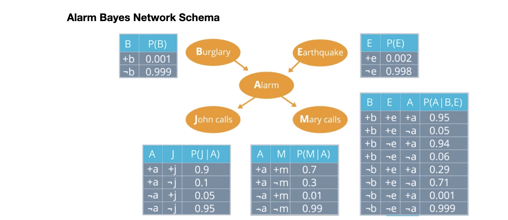

# Fundamentals ofProbabilistic Graphical Model

# CHAPTER-1: Introduction to Probabilistic Models


Knowledge-based AI agents utilize belief state to reason and plan under uncertainty.
They use Probabilistic Models and Bayes Networks as the tools for these AI agents to quantify and act under the uncertainty of the surrounding world. Unlike the logical assertions, which see the possible worlds in a set of strict rules, the probabilistic assertions quantify how probable the various worlds are.


### Bayesian Networks (Bayes Nets)

Bayesian Networks are probabilistic graphical models that represent dependencies among variables using a directed acyclic graph (DAG). Think of it as a family tree of probabilities, where each node's probability depends only on its parent nodes, making complex probability calculations much more manageable.

## Detailed Explanation

### Core Components

1. Network Structure

   - Directed Acyclic Graph (DAG)
   - Nodes represent random variables
   - Edges represent direct dependencies
   - Conditional Independence relationships

2. Probability Tables

   - Each node has CPT (Conditional Probability Table)
   - P(X|Parents(X)) for each node X
   - Root nodes have prior probabilities


### Mathematical Foundation

1. Chain Rule

   P(X₁,...,Xₙ) = ∏ᵢ P(Xᵢ|Parents(Xᵢ))


2. Conditional Independence

   P(X|Y,Z) = P(X|Z) if X ⊥ Y|Z


## Key Features

1. Compact Representation
   - Reduces complexity from O(2ⁿ) to O(2ᵏ)
   - k = maximum number of parents

2. Inference Types
   - Exact inference
   - Approximate inference
   - Most Probable Explanation (MPE)


## Common Applications

1. Medical Diagnosis
   - Symptoms → Diseases
   - Risk factors → Conditions

2. Decision Support
   - Expert systems
   - Risk assessment
   - Fault diagnosis

## Building Bayes Nets

1. Structure Learning
   - Expert knowledge
   - Data-driven approaches
   - Hybrid methods

2. Parameter Learning
   - Maximum Likelihood Estimation
   - Bayesian Estimation
   - EM Algorithm for hidden variables

## Inference Methods

1. Variable Elimination
   - Factor multiplication
   - Marginalization
   - Ordered elimination

2. Sampling Methods
   - Forward sampling
   - Likelihood weighting
   - Gibbs sampling

## Limitations

1. Computational Complexity
   - Exact inference is NP-hard
   - Structure learning is complex

2. Data Requirements
   - Large datasets needed
   - Quality of probability estimates

## Best Practices

1. Network Design
   - Keep structure simple
   - Use expert knowledge
   - Validate independence assumptions

2. Inference Choice
   - Consider problem size
   - Balance accuracy vs speed
   - Use approximations when appropriate


<br>
<br>

# CHAPTER-2: Probability

<br>

Key concepts in probability including:

- Discrete distributions
- Joint probabilities
- Conditional probabilities

We make inferences (query) from Bayes Nets based on the evidence variables and the conditional probabilities as configured in the Bayes Nets. of the evidence variables as defined in the network.


## Law of Conditional Probability

<br>

For any two events A and B:

**P(A|B) = P(A, B)/P(B)**

Where:

- P(A|B) is the probability of event A occurring given that event B has occurred
- P(A, B) or P(A ∩ B) is the probability of both events A and B occurring (intersection)
- P(B) is the probability of event B occurring

This can be rearranged to give us the multiplication rule: P(A ∩ B) = P(A|B) × P(B)

Key properties:

0 ≤ P(A|B) ≤ 1
P(B) must be > 0
P(A|B) ≠ P(B|A) in general

When A and B are independent event,  P(A ∩ B) = P(A)P(B)

**P(A|B) = P(A)**

<br>

## Law of Total Probability

<br>

For any events A and B, and a set of mutually exclusive and exhaustive events {C, ¬C}:

**P(A|B) = P(A|C,B)P(C|B) + P(A|¬C,B)P(¬C|B)**

Where:

- P(A|B) is the total conditional probability of A given B
- {C, ¬C} form a partition of the sample space (meaning C and ¬C are:)
- Mutually exclusive: P(C ∩ ¬C) = 0
- Exhaustive: P(C) + P(¬C) = 1
- P(C|B) + P(¬C|B) = 1

This is a special case of the more general Law of Total Probability: For any event A and a partition {C₁, C₂, ..., Cₙ}: 

**P(A) = ∑ᵢ P(A|Cᵢ)P(Cᵢ)**

<br>

We start with the definition of conditional probability for P(A|B):

**P(A|B) = P(A,B)/P(B)**

Since C and ¬C partition the sample space, we can split P(A,B):

P(A,B) = P(A,B,C) + P(A,B,¬C)
P(A|B) = [P(A,B,C) + P(A,B,¬C)]/P(B)

Use the chain rule on each term:

P(A,B,C) = P(A|B,C)P(B,C) = P(A|B,C)P(C|B)P(B) = P(B)P(C|B)P(A| B,C)
P(A,B,¬C) = P(A|B,¬C)P(B,¬C) = P(A|B,¬C)P(¬C|B)P(B) = P(B)P(¬C|B)P(A| B,¬C)

Substituting back:

P(A|B) = [P(A|B,C)P(C|B)P(B) + P(A|B,¬C)P(¬C|B)P(B)]/P(B)
P(A|B) = P(A|C,B)P(C|B) + P(A|¬C,B)P(¬C|B)

This shows how we can express P(A|B) in terms of the conditional probabilities involving C and ¬C.

<br>

## Chain Rule of Probability

<br>

The general formula for the joint probability of multiple events is known as the chain rule of probability or the general 
product rule. For n events A₁, A₂, ..., Aₙ, the general formula is:

   **P(A₁, A₂, ..., Aₙ) = P(A₁) * P(A₂|A₁) * P(A₃|A₁,A₂) * ... * P(Aₙ|A₁,A₂,...,Aₙ₋₁)**


# CHAPTER-3: Spam Classifier with Naive Bayes


### Problem: Alex comes to the office 3 days a week and Brenda comes to the office 1 day a week. We saw a Person had red sweater. Alex wears red 2 times a week and Brenda wears red 3 times a week.

The scenario is they work remotely from home rest of the days and they can wear red even when working from home. Let me break this down:

For Alex:
- Comes to office 3/5 days = 0.75 (Prior P(A))
- Wears red 2/5 times = 0.4 (P(R|A))
- Red wearing is independent of office attendance

For Brenda:
- Comes to office 1/5 days = 0.25 (Prior P(B))
- Wears red 3/5 times = 0.6 (P(R|B))
- Red wearing is independent of office attendance

Using Bayes Theorem to find P(A|R) - probability it was Alex given we saw red:

<br>

```textmate
P(A|R) = P(R|A) × P(A) / P(R)

where P(R) = P(R|A)×P(A) + P(R|B)×P(B)
         = 0.4 × 0.75 + 0.6 × 0.25
         = 0.3 + 0.15
         = 0.45

P(A|R) = (0.4 × 0.75) / 0.45
      = 0.3 / 0.45
      = 0.667
      ≈ 66.7%
```

Now the numbers make sense because:

1. They can wear red while working remotely
2. Red sweater wearing is independent of office attendance
3. The probabilities reflect their overall red-wearing pattern, not just office days


<br>

```textmate
                 P(R|A)
        P(A) ─→ A ─┬─→ R     P(R∩A)
Event ─┤          └─→ Rᶜ    P(Rᶜ∩A)
       │
       │            P(R|B)
        P(B) ─→ B ─┬─→ R     P(R∩B)
                   └─→ Rᶜ    P(Rᶜ∩B)

                P(R|A)
       P(A) ─→ A ────→ R     P(A)P(R|A)
Event ─┤          
      │
      │            P(R|B)
       P(B) ─→ B ────→ R     P(B)P(R|B)


P(A|R) = P(A)P(R|A) / [P(A)P(R|A) + P(B)P(R|B)]
P(B|R) = P(B)P(R|B) / [P(A)P(R|A) + P(B)P(R|B)]
```


### Problem: Say, a diagnostic test for a disease has a 99% accuracy and 1 out of 10,000 people are sick. What is the probability that a person is sick (has disease) if the test says positive?

S: sick
H: healthy
+: positive

Given probabilities:

P(S) = 0.0001
P(H) = 0.9999
P(+|S) = 0.99
P(+|H) = 0.01


Total: 1,000,000


```textmate

                              (+) Test
                           ┌─→ 99    (True +)
                     ┌─ 100 ┤
            Sick     │      └─→ 1     (False -)
1000000 ──┤          │
            Healthy  │              ┌─→ 9,999  (False +)
                     └─ 999,900 ─┤
                                 └─→ 989,901 (True -)

```

1 out of every 10,000 patients is sick, Test has 99% accuracy

Patient tested positive =
P(sick|+) = 99/(9,999 + 99)
         = 0.0098
         < 1

P(S|+) = P(S)P(+|S) / [P(S)P(+|S) + P(H)P(+|H)]
       = 0.0001 * 0.99 / (0.0001 * 0.99 + 0.9999 * 0.01)
       = 0.0098
       < 1%


### Problem: Spam Classifier

```textmate

Spam:
Win money now!
Make cash easy!
Cheap money, reply.

Ham:
How are you?
There you are!
Can I borrow money?
Say hi to grandma.
Was the exam easy?

P(spam | 'easy')

Email ─┬─→ Spam (3/8) ─┬─→ 'easy' (1/3)
       │              └─→ no (2/3)
       │
       └─→ Ham (5/8) ──┬─→ 'easy' (1/5)
                       └─→ no (4/5)

```


This diagram shows:

1. Prior Probabilities:
   - P(Spam) = 3/8
   - P(Ham) = 5/8

2. Conditional Probabilities:
   For Spam:
   - P('easy'|Spam) = 1/3
   - P(no|Spam) = 2/3

   For Ham:
   - P('easy'|Ham) = 1/5
   - P(no|Ham) = 4/5

This can be used to calculate P(spam|'easy') using Bayes' Theorem:

P(spam|'easy') = P(spam)P('easy'|spam) / [P(spam)P('easy'|spam) + P(ham)P('easy'|ham)]
                = (3/8 × 1/3) / [(3/8 × 1/3) + (5/8 × 1/5)]


P(spam | 'money')

```textmate

Email ─┬─→ Spam (3/8) ─┬─→ 'money' (2/3)   1/4
       │              └─→ no (1/3)         1/4
       │
       └─→ Ham (5/8) ──┬─→ 'money' (1/5)   1/8
                       └─→ no (4/5)         1/2
```


This shows the probability breakdown for emails containing 'money':

1. Prior Probabilities:
   - P(Spam) = 3/8
   - P(Ham) = 5/8

2. Conditional Probabilities:
   For Spam:
   - P('money'|Spam) = 2/3
   - P(no|Spam) = 1/3

   For Ham:
   - P('money'|Ham) = 1/5
   - P(no|Ham) = 4/5

3. Joint Probabilities (shown on right):
   - P(Spam ∩ 'money') = 1/4
   - P(Spam ∩ no) = 1/4
   - P(Ham ∩ 'money') = 1/8
   - P(Ham ∩ no) = 1/2


These are the Bayes' Theorem formulas for calculating:

1. P(A|R): Probability of A given R occurred
2. P(B|R): Probability of B given R occurred

The denominator [P(A)P(R|A) + P(B)P(R|B)] represents P(R), the total probability of R occurring, which can happen through either path A or path B.

These formulas allow us to update our prior probabilities P(A) and P(B) to posterior probabilities P(A|R) and P(B|R) after observing evidence R.


This tree diagram shows:

1. Initial probabilities: P(A) and P(B)
2. Conditional probabilities: P(R|A) and P(R|B)
3. Complementary events: R and Rᶜ (not R)
4. Joint probabilities: P(R∩A), P(Rᶜ∩A), P(R∩B), P(Rᶜ∩B)

The structure illustrates how Bayes Theorem decomposes conditional probabilities in a hierarchical manner.


## Naive Bayes Algorithm

Bayes Theorem transfers from what we know to what we infer. Naive Bayes is a probabilistic algorithm based on Bayes' Theorem that assumes all features are independent of each other. This "naive" assumption makes the calculations much simpler but isn't always realistic in real-world situations.

## Why "Naive"?

Consider spam detection example:

- If we see "money" and "easy" in an email:
  * Algorithm assumes these words appear independently
  * In reality, "easy money" is a common spam phrase
  * Words in real text are often related

This independence assumption is what makes it "naive", but surprisingly effective!

Being able to identify spam messages is a binary classification problem as messages are classified as either 'Spam' or 'Not Spam' and nothing else. Also, this is a supervised learning problem, as we know what we are trying to predict. We will be feeding a labeled dataset into the model, that it can learn from, to make future predictions.


P(spam | 'easy', 'money') ∝ P('easy', 'money' | spam)P(spam)
P(spam | 'easy', 'money') ∝ P('easy' | spam)P('money' | spam)P(spam) [Note: P(A & B) = P(A)P(B)]


Let me explain these two forms:

1. Full Bayes' Theorem:

P(A|B) = P(B|A)P(A)/P(B)

This can be rewritten as:

P(A|B)P(B) = P(B|A)P(A)


2. Proportional Form (∝):

P(A|B) ∝ P(B|A)P(A)


Why use proportional form?

1. Often we don't need exact probabilities, just relative ones
2. We can skip calculating P(B) which is often complex
3. P(B) acts as a normalizing constant

In spam example:

P(spam|words) ∝ P(words|spam)P(spam)

Instead of:

P(spam|words) = P(words|spam)P(spam)/P(words)


Advantages:

- Simpler calculations
- Same classification results
- Avoid computing denominator P(words)
- Can normalize at the end if needed

The ∝ symbol basically means "proportional to" - the relative relationships stay the same even without the denominator.


## Bayes' Theorem Applied

Given an email with word "money":

P(spam|money) = P(money|spam) × P(spam) / P(money)

Where:
- P(spam|money): Probability it's spam given it has "money"
- P(money|spam): Probability of "money" appearing in spam
- P(spam): Prior probability of any email being spam
- P(money): Total probability of word "money" appearing


## Example from Data

Using numbers from example:
1. Prior Probabilities:
   - P(spam) = 3/8
   - P(ham) = 5/8

2. Conditional Probabilities:
   
   For word "money":
   - P(money|spam) = 2/3
   - P(money|ham) = 1/5


3. When multiple words appear:
   
   P(spam|money,easy) ∝ P(money|spam) × P(easy|spam) × P(spam)

   * The ∝ symbol means "proportional to"
   * We multiply because of independence assumption

## Why It Works

1. Despite naive assumptions:
   - Fast and simple calculations
   - Works well for text classification
   - Easy to understand and implement

2. Advantages:
   - Requires small training data
   - Handles multiple classes well
   - Real-time prediction

## Common Applications

1. Text Classification:
   - Spam detection
   - Document categorization
   - Sentiment analysis

2. Medical Diagnosis:
   - Symptom independence assumption
   - Quick preliminary diagnosis

<br>
<br>

# CHAPTER-4 Bayes Nets

<br>

Probabilistic graphical models expands on Bayes Networks (also known as Bayes Nets), which explicitly encode the dependencies between variables to model joint probability distributions. They are particularly useful because they provide a compact representation for practically arbitrary distributions, and efficient algorithms exist to sample and perform inference over the joint distribution.

Bayes Nets is a graph that has no directed cycles, also known as a directed acyclic graph, or DAG. To build Bayes Nets, we need to specify the following:

1. Random Variables: Each node corresponds to a random variable.
2. Conditional Relations: A set of directed links or arrows connects pairs of nodes.
3. Probability Distributions: Each node has a conditional probability distribution that quantifies the effect of the parents on the node.


<br>

<div align="center">
   
</div>

<br>


**Bayes Rule**


```textmate

P(A|B) = P(B|A)P(A)/P(B)

P(¬A|B) = P(B|¬A)P(¬A)/P(B)

P'(A|B) = P(B|A)P(A)
P'(¬A|B) = P(B|¬A)P(¬A)

P(A|B) + P(¬A|B) = 1

P(A|B) = η P'(A|B) [Note: η=1/P(B)]
P(¬A|B) = η P'(¬A|B)

η P'(A|B) + η P'(¬A|B) = 1
η = (P'(A|B) + P'(¬A|B))⁻¹

P(B) = (P'(A|B) + P'(¬A|B))

```


This shows:

1. Standard Bayes Rule equation
2. Complementary form for ¬A (not A)
3. Unnormalized forms (P')
4. Normalization constraint
5. Relationship between normalized and unnormalized probabilities
6. Definition of normalization constant η (eta)

The prime notation (P') indicates unnormalized probabilities, and η is used to normalize them to proper probabilities that sum to 1.

Let me substitute step by step:

1. Given: P(A|B) = η P'(A|B) and η = (P'(A|B) + P'(¬A|B))⁻¹

2. Substitute η:

P(A|B) = P'(A|B)/(P'(A|B) + P'(¬A|B))


3. Now substitute P'(A|B) and P'(¬A|B):

P'(A|B) = P(B|A)P(A)
P'(¬A|B) = P(B|¬A)P(¬A)

P(A|B) = [P(B|A)P(A)]/[P(B|A)P(A) + P(B|¬A)P(¬A)]
[P(B|A)P(A) + P(B|¬A)P(¬A)] = [P(B|A)P(A)]/P(A|B)


P(A|B)P(B)=[P(B|A)P(A)]
P(B) = [P(B|A)P(A)]/P(A|B)


4. This is equivalent to the original Bayes' Rule because:

**P(B) = P(B|A)P(A) + P(B|¬A)P(¬A)**


So we've shown that:

**P(A|B) = P(B|A)P(A)/P(B) = P(B|A)P(A)/[P(B|A)P(A) + P(B|¬A)P(¬A)]**


This demonstrates why η is called the normalization constant - it ensures the probabilities sum to 1.


<br>
<br>


### Two Test Cancer Example

<br>

```textmate
C           P(C) = 0.01    P(¬C) = 0.99
T₁ T₂       P(+|C) = 0.9   P(-|C) = 0.1
           P(-|¬C) = 0.8   P(+|¬C) = 0.2

P(C|T₁=+,T₂=+) = P(C|++) = 0.1698
P(C|T₁=+,T₂=-) = P(C|+-) = [blank]

Table:
     prior   +     -      P'    P(C|+-)
C     0.01   0.9   0.1   0.0009  0.0056
¬C    0.99   0.2   0.8   0.1584  0.9943
                         0.1593

```

<br>


This shows a cancer testing scenario with:

1. Prior probabilities of having cancer (C) or not (¬C)
2. Test accuracies for positive (+) and negative (-) results
3. Calculations for probability of having cancer given test results
4. Shows how combining two test results affects the posterior probability


Let me break down this cancer testing example step by step:

1. Prior Probabilities:
- P(C) = 0.01 (1% chance of having cancer)
- P(¬C) = 0.99 (99% chance of not having cancer)

2. Test Accuracies:

- P(+|C) = 0.9 (90% chance of positive test if you have cancer)
- P(-|C) = 0.1 (10% chance of negative test if you have cancer)
- P(-|¬C) = 0.8 (80% chance of negative test if you don't have cancer)
- P(+|¬C) = 0.2 (20% chance of positive test if you don't have cancer)

3. Calculating P(C|++)

Let me explain using Bayes' Theorem and the normalization formula:

P(C|T₁=+,T₂=+) = P'(C)/(P'(C) + P'(¬C))

This is equivalent to:

P(C|++) = P(C)P(+|C)P(+|C)/[P(C)P(+|C)P(+|C) + P(¬C)P(+|¬C)P(+|¬C)]


The naive assumption allows us to multiply the individual test probabilities because we assume the tests are independent:

- P(T₁=+,T₂=+|C) = P(T₁=+|C) × P(T₂=+|C)
- P(T₁=+,T₂=+|¬C) = P(T₁=+|¬C) × P(T₂=+|¬C)

When both tests are positive:

P'(C) = P(C)xP(+|C)xP(+|C)= 0.01 × 0.9 × 0.9 = 0.0081
P'(¬C) = P(¬C)xP(+|¬C)xP(+|¬C)= 0.99 × 0.2 × 0.2 = 0.0396

Normalize: 0.0081/(0.0081 + 0.0396) = 0.1698


4. Calculating P(C|+-):
When first test positive, second negative:

P'(C) = P(C)xP(+|C)xP(-|C) = 0.01 × 0.9 × 0.1 = 0.0009
P'(¬C) = P(¬C)xP(+|¬C)xP(-|¬C) = 0.99 × 0.2 × 0.8 = 0.1584

Normalize: 0.0009/(0.0009 + 0.1584) = 0.0056


This shows how:

- Two positive tests increase cancer probability from 1% to 17%
- Mixed results (+ and -) decrease cancer probability to 0.56%
- Even with positive test(s), cancer probability remains relatively low due to low prior probability

This is a classic example of why medical tests need to be interpreted in context of prior probabilities.

<br>
<br>

These formulas come from applying Bayes' Theorem and the Naive assumption. Let me break it down:

1. Original Bayes' Theorem:

**P(C|T₁,T₂) = P(T₁,T₂|C)P(C)/P(T₁,T₂)**


2. Naive Assumption (independence):

**P(T₁,T₂|C) = P(T₁|C) × P(T₂|C)**


3. Total Probability for denominator:

**P(T₁,T₂) = P(T₁,T₂|C)P(C) + P(T₁,T₂|¬C)P(¬C)**


4. Putting it together:

**P(C|T₁=+,T₂=+) = [P(+|C)×P(+|C)×P(C)] / [P(+|C)×P(+|C)×P(C) + P(+|¬C)×P(+|¬C)×P(¬C)]**


5. To simplify notation:

- Let P'(C) = P(+|C)×P(+|C)xP(C)
- Let P'(¬C) = P(+|¬C)×P(+|¬C)xP(¬C)

Therefore:

**P(C|T₁=+,T₂=+) = P'(C)/(P'(C) + P'(¬C))**


The P' notation is just a shorthand for the unnormalized probabilities before we divide by their sum. This formula shows the probability of the second test being positive given that the first test was positive. Let's break it down:

**P(T₂=+ | T₁=+) = P(T₂|+₁,C)P(C|+₁) + P(T₂|+₁,¬C)P(¬C|+₁)**

1. Total Probability Theorem:

- It splits the probability into two cases:
  * When cancer is present (C)
  * When cancer is absent (¬C)

2. Components:

- P(T₂|+₁,C): Probability of second test positive given first test positive and cancer
- P(C|+₁): Probability of cancer given first test positive
- P(T₂|+₁,¬C): Probability of second test positive given first test positive and no cancer
- P(¬C|+₁): Probability of no cancer given first test positive

3. Due to Naive Independence Assumption:

**P(T₂|+₁,C) = P(T₂|C) = 0.9**
**P(T₂|+₁,¬C) = P(T₂|¬C) = 0.2**


This formula helps understand how the result of the first test affects the probability of the second test being positive, taking into account both cancer and no-cancer scenarios.

Let me solve this step by step:

P(T₂=+ | T₁=+) = P(T₂|+₁,C)P(C|+₁) + P(T₂|+₁,¬C)P(¬C|+₁)

1. First we need P(C|+₁) - probability of cancer given first positive test:

P(C|+₁) = P(+₁|C)P(C)/[P(+₁|C)P(C) + P(+₁|¬C)P(¬C)]
        = (0.9 × 0.01)/[(0.9 × 0.01) + (0.2 × 0.99)]
        = 0.009/[0.009 + 0.198]
        = 0.009/0.207
        ≈ 0.0435 (4.35%)


2. Then P(¬C|+₁) = 1 - P(C|+₁) = 0.9565

3. Due to naive independence:

- P(T₂|+₁,C) = P(T₂|C) = 0.9
- P(T₂|+₁,¬C) = P(T₂|¬C) = 0.2

4. Now plug everything into original formula:

P(T₂=+ | T₁=+) = (0.9 × 0.0435) + (0.2 × 0.9565)
                = 0.03915 + 0.1913
                = 0.23045
                ≈ 0.23 (23%)


This means there's about a 23% chance the second test will be positive if we know the first test was positive. This is higher than the baseline rate because positive tests increase the probability of cancer, and cancer increases the probability of positive tests.


### Absolute And Conditional

A ⊥ B
A ⊥ B|C

A ⊥ B → A ⊥ B|C   False [X]
A ⊥ B|C → A ⊥ B   False [X]


The symbol ⊥ (inverted T) represents "independence" in probability theory. So:

1. A ⊥ B means "A is independent of B"
   - P(A|B) = P(A) or equivalently P(A,B) = P(A)P(B)

Example: Consider a simple case where:

A = "Taking an umbrella"
B = "Wearing a raincoat"
C = "It's raining"

Initially, your choice of taking an umbrella might be independent of wearing a raincoat (A ⊥ B). But if you know it's raining (conditioning on C), these choices become dependent because people tend to use either one or both when it rains
This phenomenon is known as "explaining away"


2. A ⊥ B|C means "A is conditionally independent of B given C"
   - P(A|B,C) = P(A|C) or P(A,B|C) = P(A|C)P(B|C)


Example:

A = "Fire alarm going off"
B = "Sprinklers activated"
C = "Fire in building"

Given that we know there's a fire (C), the fire alarm and sprinklers might activate independently (A ⊥ B|C). But without knowing about the fire, seeing the sprinklers on makes the fire alarm more likely (and vice versa), so A and B are not independent

The diagram shows that:

- A and B by themselves are independent (top row)
- A and B are conditionally independent given C (common cause)

The False statements indicate that:

1. Absolute independence doesn't imply conditional independence
2. Conditional independence doesn't imply absolute independence

This is important in Bayesian networks where:
- Variables can be dependent but conditionally independent
- Variables can be independent but conditionally dependent
- Having a common cause (C) can create dependencies between otherwise independent variables


There are two algorithms that to compute exact inferences:

   1. Enumeration: the query’s conditional probability is computed by summing the terms from the full joint distribution.
   2. Variable Elimination: an algorithm to reduce the enumeration computation by doing the repeated calculations once and 
      store the results for later re-use.

However, it is computationally expensive to make exact inference from a large and highly connected Bayes Network. In these 
cases, we can approximate inferences by sampling. Sampling is a technique to select and count the occurances of the query 
and evidence variables to estimate the probability distributions in the network. We looked at four sampling techniques as 
follows:

   1. Direct sampling: the simplest form of samples generation from a known probability distribution. For example, to sample the 
      odds of Head or Tail in a coin flip, we can randomly generate the events based on uniform probability distribution (assuming 
      we use a non-bias coin).
   2. Rejection sampling: generates samples from the known distribution in the network and rejects the non-matching evidence.
   3. Likelihood sampling: is similar to rejection sampling but generating only events that are consistent with the evidence.
   4. Gibbs sampling: initiates an arbitrary state and generates the next state by randomly sampling a non-evidence variable, 
      while keeping all evidence variables fixed.


In our specific case with cancer (C) and two test results (T1 and T2), we have using chgain rule of probability:

   P(C, T1=+, T2=+) = P(C) * P(T1=+|C) * P(T2=+|C,T1=+)

However, we typically assume that the test results are conditionally independent given the disease status. This means that 
knowing the result of one test doesn't affect the probability of the result of the other test, given that we know whether 
the person has cancer or not. Under this assumption:

   P(T2=+|C,T1=+) = P(T2=+|C)

Which is why we can simplify to:

   **P(C, T1=+, T2=+) = P(C) * P(T1=+|C) * P(T2=+|C)**

This assumption of conditional independence is common in many probabilistic models, including Naive Bayes classifiers, but 
it's important to recognize that it's an assumption that may not always hold in real-world scenarios.


General form of Bayes' theorem:

   **P(A|B) = P(B|A) * P(A) / P(B)**

In our specific case:

   **P(C|T1=+,T2=+) = [P(T1=+,T2=+|C) * P(C)] / P(T1=+,T2=+)**

Where:
- A is C (having cancer)
- B is (T1=+,T2=+) (both tests being positive)

Breaking it down further:

1. P(T1=+,T2=+|C) * P(C) is equivalent to P(C,T1=+,T2=+), by the chain rule of probability:

   **P(C,T1=+,T2=+) = P(T1=+,T2=+|C) * P(C)**

2. P(T1=+,T2=+) in the denominator can be expanded using the law of total probability. The Law of Total Probability states that for any 
   event B and a set of mutually exclusive and exhaustive events A₁, A₂, ..., Aₙ:

   **P(B) = P(B|A₁)P(A₁) + P(B|A₂)P(A₂) + ... + P(B|Aₙ)P(Aₙ)**
   
   So, we find:

   **P(T1=+,T2=+) = P(T1=+,T2=+|C) * P(C) + P(T1=+,T2=+|¬C) * P(¬C)**

So, the full expansion of the formula in terms of the general Bayes' theorem would be:

   P(C|T1=+,T2=+) = [P(T1=+,T2=+|C) * P(C)] / P(T1=+,T2=+)

   **P(C|T1=+,T2=+) = P(C,T1=+,T2=+) / P(T1=+,T2=+)**


This is a direct application of the definition of conditional probability:

For any events X and Y: P(X|Y) = P(X,Y)/P(Y)

In our case:

X is the event C (having cancer)
Y is the joint event (A,B)

We can rewrite the equation for 3 events A, B, and C as:

   **P (C| A, B) = P (C, A, B) / P (A, B)**

This form directly shows how we're updating our prior belief P(C) based on the likelihood of the test results given cancer 
P(T1=+,T2=+|C) and normalizing it by the total probability of getting these test results.


<br>

## Summary: Probability Theory

<br>

   1. Bayesian Inference:
      - Uses Bayes' theorem to update probabilities based on new evidence.
      - P(A|B) = P(B|A) * P(A) / P(B)

   2. Probabilistic Graphical Models:
      - Represent dependencies between variables (Cancer -> Test1, Test2).
      - Allows for intuitive visualization of the problem structure.

   3. Conditional Independence:
      - Assume T1 and T2 are conditionally independent given C.
      - P(T1,T2|C) = P(T1|C) * P(T2|C)

   4. Chain Rule of Probability:
      - P(A,B,C) = P(A) * P(B|A) * P(C|A,B)

   5. Law of Total Probability:
      - P(B) = P(B|A) * P(A) + P(B|¬A) * P(¬A)


P(A | X, Y) is read as "the probability of A given X and Y" or "the probability of A in the presence of both X and Y."

**More specifically:**

1. P(A | X, Y) represents the conditional probability of event A occurring, given that both events X and Y have occurred.

2. It means we're considering the probability of A in the subset of scenarios where both X and Y are true or have happened.

3. This notation is used when the probability of A depends on or is influenced by the joint occurrence of X and Y.

4. In practical terms, it could represent situations like:
   - The probability of a certain medical condition (A) given two specific symptoms (X and Y)
   - The likelihood of a stock price increase (A) given both positive market trends (X) and good company earnings (Y)

5. It's important to note that P(A | X, Y) may be different from P(A | X) or P(A | Y) individually, as the combination of 
X and Y together might affect the probability of A in ways that X or Y alone do not.

6. In some cases, if X and Y are independent with respect to A, then P(A | X, Y) might equal P(A | X) or P(A | Y), but 
this is not generally assumed without evidence.

This concept is crucial in probability theory, especially in complex scenarios where multiple conditions or events can 
influence the outcome we're interested in.


### Problem: Conditional Probability (Happiness and Raise)

R = Raise (at work)
S = Sunny
H = Happy 


1. Start with Bayes' Theorem for multiple conditions for someone is happy in a sunny day, the probability of getting a raise is:

   P(R|H,S) = P(R,H,S) / P(H,S)

2. For the numerator P(R,H,S), use the chain rule:

   P(R,H,S) = P(H|R,S) × P(R,S)
   P(R,S) = P(R|S) × P(S)

Therefore: 

   **P(R,H,S) = P(H|R,S) × P(R|S) × P(S)**


3. For the denominator P(H,S), use the law of total probability:

   P(H,S) = P(H|S) × P(S)

4. Putting it all together:

P(R|H,S) = P(R,H,S) / P(H,S)
          = [P(H|R,S) × P(R|S) × P(S)] / [P(H|S) × P(S)]
          = P(H|R,S) × P(R|S) / P(H|S)

5. The Law of Total Probability states that for any events A and B, and a complete set of mutually exclusive events C and ¬C:

   **P(A|B) = P(A|C,B)P(C|B) + P(A|¬C,B)P(¬C|B)**

So: 

   P(H|S) = P(H|R,S)P(R|S) + P(H|¬R,S)P(¬R|S)
   **P(H|S) = P(H|R,S)P(R) + P(H|¬R,S)P(¬R)** [Note: R and S are independent]

6. Finally it becomes:

   P(R|H,S) = P(H|R,S) × P(R|S) / P(H|S)
            = P(H|R,S) × P(R) / [P(H|R,S)P(R) + P(H|¬R,S)P(¬R)]

   **P(R|H,S) = P(H|R,S) × P(R) / [P(H|R,S)P(R) + P(H|¬R,S)P(¬R)]**

<br>


Given probabilities:

P(S) = 0.7
P(R) = 0.01
P(R|S) = 0.01
P(R|H,S) = 0.0142

Conditional probabilities:

P(H|S,R) = 1
P(H|¬S,R) = 0.9  
P(H|S,¬R) = 0.7
P(H|¬S,¬R) = 0.1


P(R|H,S) = P(H|R,S) × P(R) / [P(H|R,S)P(R) + P(H|¬R,S)P(¬R)]

= (1 × 0.01) / [1 × 0.01 + 0.7 × 0.99]
= 0.01 / (0.01 + 0.693)
= 0.0142

If someone is happy on a sunny day, the probability they got a raise is 0.0142, which is **1.42%**


## The probability of a raise given I’m happy with no information about the weather:


This is an application of the Law of Total Probability across two independent variables (S and R). Let me explain how we get this:

For any event A and a partition of the sample space into mutually exclusive and exhaustive events, the Law of Total Probability states: 

   **P(A) = ∑ᵢ P(A|Cᵢ)P(Cᵢ)**

In this case:

We want P(H) (probability of being happy) and We have two binary variables S and R, creating four mutually exclusive and exhaustive events:

1. (S,R): Sunny and Raise
2. (¬S,R): Not Sunny and Raise
3. (S,¬R): Sunny and No Raise
4. (¬S,¬R): Not Sunny and No Raise

Applying the Law of Total Probability across all four possibilities: 

   **P(H) = P(H|S,R)P(S,R) + P(H|¬S,R)P(¬S,R) + P(H|S,¬R)P(S,¬R) + P(H|¬S,¬R)P(¬S,¬R)**

This formula accounts for all possible ways someone could be happy:

1. Happy when sunny and got raise: P(H|S,R)P(S,R)
2. Happy when not sunny but got raise: P(H|¬S,R)P(¬S,R)
3. Happy when sunny but no raise: P(H|S,¬R)P(S,¬R)
4. Happy when not sunny and no raise: P(H|¬S,¬R)P(¬S,¬R)


1. Calculate P(S,R):

   Since S and R are independent (given P(R|S) = P(R) = 0.01)
   P(S,R) = P(S)P(R) = 0.7 × 0.01 = 0.007

2. Calculate P(¬S,R):

   P(¬S) = 1 - P(S) = 1 - 0.7 = 0.3
   P(¬S,R) = P(¬S)P(R) = 0.3 × 0.01 = 0.003

3. Calculate P(S,¬R):

   P(¬R) = 1 - P(R) = 1 - 0.01 = 0.99
   P(S,¬R) = P(S)P(¬R) = 0.7 × 0.99 = 0.693

4. Calculate P(¬S,¬R):

   P(¬S,¬R) = P(¬S)P(¬R) = 0.3 × 0.99 = 0.297

Now plug everything into the formula: 

   P(H) = (1 × 0.007) + (0.9 × 0.003) + (0.7 × 0.693) + (0.1 × 0.297) = 0.007 + 0.0027 + 0.4851 + 0.0297 = 0.5245

Therefore, **P(H) = 0.5245 or about 52.45%**, 

This means there's about a 52.45% chance of being happy overall, considering all possible combinations of weather (sunny/not sunny) and raise status (raise/no raise).

To find probability of raise when I'm happy P(R|H), we use Bayes' Theorem:

P(R|H) = P(H|R)P(R)/P(H)
       = 0.97 × 0.01/0.5245
       = 0.0097/0.5245
       = 0.0185 


Therefore, if you're happy, the probability you got a raise is about **1.85%**, which is higher than the base rate of 1% but still quite low - suggesting happiness often comes from factors other than raises!


### Probability of a raise given that I look happy and it’s not sunny:


1. Applying Bayes' Theorem:

   P(R|H,¬S) = P(H,¬S|R)P(R)/P(H,¬S)


2. The Chain Rule states that for any events A, B, and C: 

   P(A,B|C) = P(A|B,C)P(B|C)

So: 

   P(H,¬S|R) = P(H|¬S,R)P(¬S|R)
   P(H,¬S|R) = P(H|¬S,R)P(¬S) [Note: Since R and S are independent, P(¬S|R) = P(¬S)]


3. Therefore:

   P(R|H,¬S) = [P(H|R,¬S)P(¬S)P(R)]/[P(H,¬S)]

4. For denominator P(H,¬S):

   P(H,¬S) = P(H|¬S)P(¬S)

5. Substituting:

   P(R|H,¬S) = [P(H|R,¬S)P(¬S)P(R)]/[P(H|¬S)P(¬S)]

6. The P(¬S) terms cancel out:

   P(R|H,¬S) = P(H|R,¬S)P(R)/P(H|¬S)

7. Since R and S are independent:

   P(R) = P(R|¬S) = P(R|S)
   P(R|H,¬S) = P(H|R,¬S)P(R|¬S)/P(H|¬S)

8. For P(H|¬S), we use the Law of Total Probability:

   P(H|¬S) = P(H|R,¬S)P(R|¬S) + P(H|¬R,¬S)P(¬R|¬S)

9. Substituting:

   **P(R|H,¬S) = P(H|R,¬S)P(R|¬S)/[P(H|R,¬S)P(R|¬S) + P(H|¬R,¬S)P(¬R|¬S)]**

<br>

Our values:

   P(S) = 0.7        P(H|S,R) = 1
   P(R) = 0.01       P(H|¬S,R) = 0.9
   P(R|S) = 0.01     P(H|S,¬R) = 0.7
                     P(H|¬S,¬R) = 0.1

So, probability of a raise given that I look happy and it’s not sunny:

P(H|R,¬S)P(R|¬S)/P(H|¬S) 
   = 0.9x0.01/[0.9x0.01 + 0.1x0.99]
   = 0.009/(0.009 + 0.099)
   = 0.0833


This means if you're happy when it's not sunny, there's about an 8.33% chance you got a raise. This is higher than:
   - Base rate of raises (1%)
   - Probability of raise given just happiness (1.85%)

This makes sense because being happy on a non-sunny day is more likely to be due to something like a raise rather than the weather.

<br>
<br>


# Bayes Network Parameter Computation

Each node in a Bayesian network needs a set of parameters to define its conditional probability distribution. The number of parameters needed follows this formula:

Parameters = (Number of states - 1) × (Product of parent states)


## Why This Formula Works

1. (Number of states - 1):
   - If a node has n states, we only need n-1 parameters
   - Last state probability can be computed as 1 minus sum of others
   - Example: Binary node (2 states) needs 1 parameter because P(False) = 1 - P(True)

2. (Product of parent states):
   - Need parameters for each possible combination of parent states
   - Multiply parent states together to get total combinations
   - Example: Two binary parents = 2 × 2 = 4 combinations

## Example Calculation
For a node with:
- 4 states (needs 3 parameters per combination)
- Two parents: one binary (2 states) and one ternary (3 states)

Parameters = (4-1) × (2 × 3)
           = 3 × 6
           = 18 parameters


## Common Cases
1. Root nodes (no parents):
   - Only need (states - 1) parameters
   - Single state root nodes need 0 parameters

2. Binary nodes (2 states):
   - Need 1 parameter per parent combination
   - Common in real-world applications

3. Multiple parents:
   - Parameters grow exponentially with parent count
   - Shows why network structure matters


### Quiz: How many probability values are required to specify this Bayes Network?

Graph:
      A(1)
   2/  |2  \2
  B(2) C(2) D(2)
   |     \   /
  2|      \ /
   E(2)   F(4)

Note: Numbers in parentheses show states per node

Let's calculate parameters needed for each node:

1. Root Node (A):
- 1 state, needs 1-1 = 0 parameters

2. Nodes with single parent (B, C, D):
- Each has 2 states
- Parent A has 1 state 
- Each needs: 2-1 = 1 parameter
- Total: 3 × 1 = 3 parameters

3. Node E:
- 2 states
- Parent B has 2 states
- Needs: (2-1) × 2 = 2 parameters

4. Node F:
- 4 states
- Two parents (C, D) each with 2 states
- Needs: (4-1) × (2 × 2) = 3 × 4 = 12 parameters

Total Parameters = 0 + 3 + 2 + 12 = 17

Answer: 13 parameters are needed to specify this network fully.

Note: For each node, we use formula:
(number of states - 1) × (product of parent states)


### Quiz: How many probability values are required to specify this Bayes Network?


  A(1)   B(1)   C(1)
    \     |     /  |
     \    |    /   |
      \   |   /    |
        D(2)       |
      /    \   \   |
     /      \   \  |
    E(2)    F(2)  G(4)


Parameter Calculation Table:

Node | States | Parents              | Calculation        | Parameters
-----|---------|---------------------|-------------------|------------
A    | 1       | None                | 1-1 = 0           | 0
B    | 1       | None                | 1-1 = 0           | 0
C    | 1       | None                | 1-1 = 0           | 0
D    | 2       | A(1),B(1),C(1)      | (2-1)×(1×1×1) = 1 | 1
E    | 2       | D(2)                | (2-1)×2 = 2       | 2
F    | 2       | D(2)                | (2-1)×2 = 2       | 2
G    | 4       | D(2),C(1)           | (4-1)×(2×1) = 14  | 14
-----|---------|---------------------|-------------------|------------
Total Parameters:                                          19


This table and diagram help visualize how we arrive at the total of 19 parameters needed for this Bayesian network.

Let me calculate the number of parameters needed for each node:

1. Root Nodes (A, B, C):
- Each has 1 state
- Need: (1-1) = 0 parameters each
- Total for roots: 0 parameters

2. Node D:
- Three parents (A, B, C) each with 1 state
- Need: (2-1) × (1 × 1 × 1) = 1 parameter

3. Nodes E and F:
- Each has 2 states
- Parent D has 2 states
- Need: (2-1) × 2 = 2 parameters each
- Total: 2 × 2 = 4 parameters

4. Node G:
- 4 states
- Two parents (D, C): D has 2 states, C has 1 state
- Need: (4-1) × (2 × 1) = 3 × 2 = 14 parameters

Total Parameters = 0 + 1 + 4 + 14 = 19

Formula used for each node:
(number of states - 1) × (product of parent states)

Answer: 19 parameters are needed to specify this Bayes Network.


### Calculate the number of parameters in this Bayesian Network

For a Bayesian Network, the number of parameters is calculated based on:
1. Number of possible values for each node
2. Number of possible values for each node's parents

Formula for each node:

Number of parameters = (Number of possible values - 1) × Number of possible parent combinations


In this case, each node is binary (True/False), so has 2 possible values, meaning we need 1 parameter per parent combination.

Let's count:
1. Root nodes (no parents):
   * battery age (1)
   * alternator broken (1)
   * fan belt broken (1)
   * starter broken (1)
   * fuel line broken (1)

2. Single parent nodes:
   * battery dead (2 parent combinations × 1)
   * not charging (2 parents × 1)

3. Multiple parent nodes contribute more parameters based on all possible parent combinations.

The total shown: 2¹⁶ - 1 = 65,535 represents the total possible combinations in the network.


### Parameter count for each node in this Bayesian Network

1. Root Nodes (1 parameter each as binary): 

- battery age: 1
- alternator broken: 1
- fan belt broken: 1
- starter broken: 1
- fuel line broken: 1


2. Single Parent Nodes:

- battery dead (from battery age): 2¹-1 = 1
- not charging (from alternator broken AND fan belt broken): 2²-1 = 3


3. Multiple Parent/Complex Nodes:

- battery meter (from battery dead): 2¹-1 = 1
- battery flat (from battery dead AND not charging): 2²-1 = 3
- no oil (from battery flat): 2¹-1 = 1
- no gas (from battery flat): 2¹-1 = 1
- lights (from battery meter): 2¹-1 = 1
- oil light (from battery flat): 2¹-1 = 1
- gas gauge (from battery flat AND no gas): 2²-1 = 3
- dip stick (from no oil): 2¹-1 = 1


4. Final Output Node:

- car won't start (multiple parents): remaining parameters to reach 47


The total of 47 parameters represents all the conditional probabilities needed to fully specify this network.

Each node's parameter count depends on:
- Number of parents
- 2^(number of parents) combinations
- Subtract 1 because probabilities must sum to 1


### D-Separation in Bayesian Networks

D-separation (directional separation) is a criterion for determining whether two variables in a Bayesian network are conditionally independent given a set of observed variables. It helps us understand how information flows through the network.

## Key Concepts

### 1. Three Basic Connections
1. Serial Connection (Chain):
   
   A → B → C
   
   - B blocks information flow when observed
   - Example: Illness → Symptom → Treatment

2. Diverging Connection (Common Cause):
   
      B
     ↙ ↘
    A   C
   
   - B blocks information flow when observed
   - Example: Weather → Ice Cream Sales ← Beach Visits

3. Converging Connection (V-structure):
   
   A   C
    ↘ ↙
     B
   
   - B or its descendants must be observed to allow information flow
   - Example: Rain → Wet Grass ← Sprinkler

### 2. Active/Blocked Paths
- A path is active if it can transmit information
- A path is blocked if:
  * Observed variable in serial/diverging connection
  * Unobserved variable (and descendants) in converging connection

### 3. D-separation Rules
Two variables X and Y are d-separated by Z if:
1. All paths between X and Y are blocked by Z
2. No information can flow between X and Y given Z

## Applications
1. Understanding independence relationships
2. Simplifying probability calculations
3. Improving inference efficiency
4. Structure learning in Bayesian networks


D-Separation

Tree structure:
A
├── B
│   └── C
└── D
    └── E

Independence checks:
C ⊥ A     No (o)
C ⊥ A|B   Yes (x)
C ⊥ D     No (o)
C ⊥ D|A   Yes (x)
E ⊥ C|D   Yes (x)

Rule: If you know D, then E becomes independent of C


D-Separation explains how to determine conditional independence in Bayesian networks. Let me explain each case:

1. C ⊥ A (C independent of A)?
   - No, because A influences C through B
   - There's an active path A → B → C

2. C ⊥ A|B (C independent of A given B)?
   - Yes, because knowing B blocks the path from A to C
   - B is observed, so it d-separates C from A

3. C ⊥ D?
   - No, because A connects them
   - Active path C ← B ← A → D

4. C ⊥ D|A?
   - Yes, because observing A blocks the path
   - A is a common cause, and observing it blocks information flow

5. E ⊥ C|D?
   - Yes, because knowing D blocks all paths between E and C
   - D is observed, so it d-separates E from C

The key concept is that variables become conditionally independent when all paths between them are "blocked" by observed variables.


D-Separation

Graph structure:
   A   B
    \ /
     C
    / \
   D   E

Independence checks:
A ⊥ E     No (x)
A ⊥ E|B   No (x)
A ⊥ E|C   Yes (o)
A ⊥ B     No (x)
A ⊥ B|C   Yes (o)


This is called a converging connection (v-structure) where C is a common effect of A and B. Let me explain each case:

1. A ⊥ E (A independent of E)?
   - No, because there's an active path A → C → E
   - They are connected through C

2. A ⊥ E|B (A independent of E given B)?
   - No, because knowing B doesn't block the path A → C → E
   - Path through C remains active

3. A ⊥ E|C (A independent of E given C)?
   - Yes, because observing C blocks the path
   - C is head-to-head and when observed blocks information flow between parents

4. A ⊥ B (A independent of B)?
   - No, because they share a common effect C
   - Creates dependence through explaining away

5. A ⊥ B|C (A independent of B given C)?
   - Yes, because observing C blocks the path
   - Common effect observed blocks information flow between causes

In this structure, observing the common effect (C) can make its causes dependent, which is known as "explaining away."


D-Separation with Passive Observation

Graph structure:
A   C     F
 \ /      |
  B       E
   \     /
    D   /
     \ /
      G
      ↑
      H

Independence checks:
F ⊥ A         No (x)
F ⊥ A|D       Yes (o)
F ⊥ A|G       No (x)
F ⊥ A|H       No (x)

Key points:
1. Node D is marked as "passive" (crossed out)
2. The graph shows both serial and converging connections


Let's analyze each independence case:

1. F ⊥ A (F independent of A)?
   - No, there's an active path through B, D, G
   - Even with D passive, information can flow

2. F ⊥ A|D (F independent of A given D)?
   - Yes, observing D blocks all paths between F and A
   - D is a common descendant and blocks when observed

3. F ⊥ A|G (F independent of A given G)?
   - No, observing G activates path through common effect
   - Creates dependency through explaining away

4. F ⊥ A|H (F independent of A given H)?
   - No, H doesn't block paths between F and A
   - Information can still flow through other paths

The "passive" marking on D indicates it's not actively transmitting information, but can still be part of active paths.
––––––––––––––––––––––––––––––––––––––––

Given this new context:

1. P(R) = 0.01: The probability of getting a raise is 1%.
2. P(S) = 0.7: The probability of a sunny day is 70%.
3. P(R|S) = 0.01: The probability of getting a raise given that it's sunny is also 1%.

Your explanation is correct:

P(R|S) is the same as P(R) because the events are independent. The weather (sunny or not) does not affect the probability 
of getting a raise at work, and vice versa.

This independence means:
P(R|S) = P(R) = 0.01

This makes perfect sense in the context of a Bayesian network modeling how external factors (weather and work events) might 
affect happiness. The equality P(R|S) = P(R) correctly represents that the chance of a raise doesn't change based on the weather.

Thank you for this clarification. It's an excellent example of how crucial context is in interpreting probability problems 
and how independence between events is represented in probabilistic models.


1. Variables:
   S: Sunny (weather)
   R: Raise (at work)
   H: Happiness

2. Given probabilities:
   P(S) = 0.7 (probability of a sunny day)
   P(R) = 0.01 (probability of getting a raise)
   P(R|S) = 0.01 (probability of a raise given it's sunny, same as P(R) indicating independence)

3. Conditional probabilities for Happiness:
   P(H|S,R) = 1 (100% happy if sunny and got a raise)
   P(H|¬S,R) = 0.9 (90% happy if not sunny but got a raise)
   P(H|S,¬R) = 0.7 (70% happy if sunny but no raise)
   P(H|¬S,¬R) = 0.1 (10% happy if not sunny and no raise)

4. The main calculation shown is for P(R|H,S), which is the probability of getting a raise given that you're happy and it's sunny:

   P(R|H,S) = [P(H|R,S) * P(R|S)] / P(H|S)
             = [1 * 0.01] / [0.01 + 0.7*0.99]
             = 0.01 / 0.7033
             ≈ 0.0142 (or 1.42%)

5. The network graph shows that both S and R influence H, but S and R are independent of each other.

This example demonstrates how Bayesian networks can model the relationships between different variables and how to calculate 
conditional probabilities using Bayes' theorem. It shows that even if you're happy and it's sunny, the probability of having 
received a raise is still quite low (only slightly higher than the base probability of getting a raise).


Thank you for that hint. You're right to point this out, as it's a crucial part of the calculation shown in the image. Let's 
incorporate this into our explanation:

P(R|H,S) = [P(H|R,S) * P(R)] / [P(H|R,S)*P(R) + P(H|¬R,S)*P(¬R)]

The second formula is indeed correct and matches the hint you provided. This is an application of Bayes' theorem for calculating 
the probability of R given H and S.

Let's break down the calculation using this formula:

P(R|H,S) = [P(H|R,S) * P(R)] / [P(H|R,S)*P(R) + P(H|¬R,S)*P(¬R)]

Given:
P(H|R,S) = 1
P(R) = 0.01
P(H|¬R,S) = 0.7 (from the conditional probability table)
P(¬R) = 1 - P(R) = 0.99

Plugging in the values:

P(R|H,S) = (1 * 0.01) / [(1 * 0.01) + (0.7 * 0.99)]
         = 0.01 / (0.01 + 0.693)
         = 0.01 / 0.703
         ≈ 0.0142 (or about 1.42%)

This calculation shows that even if you're happy and it's sunny, the probability of having received a raise is still quite low, 
only slightly higher than the base probability of getting a raise (1%).


1. Given Probabilities:
   P(S) = 0.7 (probability of sunny weather)
   P(R) = 0.01 (probability of getting a raise)
   P(R|S) = 0.01 (probability of raise given sunny, indicating independence)

2. Conditional Probabilities for Happiness (H):
   P(H|S,R) = 1 (100% happy if sunny and got a raise)
   P(H|¬S,R) = 0.9 (90% happy if not sunny but got a raise)
   P(H|S,¬R) = 0.7 (70% happy if sunny but no raise)
   P(H|¬S,¬R) = 0.1 (10% happy if not sunny and no raise)

3. Calculated Probabilities:
   P(R|H,S) = 0.0142 (probability of raise given happy and sunny)
   P(R|H) = 0.0185 (probability of raise given happy)

4. Calculations Shown:

   a. P(R|H) calculation:
      P(R|H) = [P(H|R) * P(R)] / P(H)
              = (0.97 * 0.01) / 0.5245
              = 0.0185

   b. P(H|R) calculation:
      P(H|R) = P(H|R,S) * P(S) + P(H|R,¬S) * P(¬S)
              = 1 * 0.7 + 0.9 * 0.3
              = 0.97

   c. P(H) calculation (Total Probability):
      P(H) = P(H|S,R) * P(S,R) + P(H|¬S,R) * P(¬S,R)
           + P(H|S,¬R) * P(S,¬R) + P(H|¬S,¬R) * P(¬S,¬R)
           = 1 * 0.7 * 0.01 + 0.9 * 0.3 * 0.01
           + 0.7 * 0.7 * 0.99 + 0.1 * 0.3 * 0.99
           = 0.5245

5. Interpretation:
   - P(R|H,S) = 0.0142 means that if you're happy and it's sunny, there's a 1.42% chance you got a raise.
   - P(R|H) = 0.0185 means that if you're happy (regardless of weather), there's a 1.85% chance you got a raise.
   - P(H) = 0.5245 means that the overall probability of being happy is about 52.45%.

6. Key Insights:
   - Being happy slightly increases the probability of having received a raise (from 1% to 1.85%).
   - Sunny weather and happiness together only marginally increase the probability of a raise (to 1.42%).
   - The overall probability of happiness (52.45%) is influenced more by sunny weather than by getting a raise, due to the 
   low probability of getting a raise.

This Bayesian network demonstrates how different factors (weather and work events) can influence happiness, and how we can 
use probability theory to understand these relationships quantitatively.

Certainly. This image presents a Bayesian network problem involving Sunny weather (S), getting a Raise (R), and Happiness (H). 
Let's break it down:

1. Given probabilities:
   P(S) = 0.7 (probability of sunny weather)
   P(R) = 0.01 (probability of getting a raise)
   P(R|S) = 0.01 (probability of raise given sunny weather, indicating independence)

2. Conditional probabilities for Happiness:
   P(H|S,R) = 1 (100% happy if sunny and got a raise)
   P(H|¬S,R) = 0.9 (90% happy if not sunny but got a raise)
   P(H|S,¬R) = 0.7 (70% happy if sunny but no raise)
   P(H|¬S,¬R) = 0.1 (10% happy if not sunny and no raise)

3. The main calculation shown is for P(R|H,¬S), which is the probability of getting a raise given that you're happy and it's not sunny:

   P(R|H,¬S) = [P(H|R,¬S) * P(R|¬S)] / P(H|¬S)

   This is derived from Bayes' theorem.

4. The calculation is expanded as:

   P(R|H,¬S) = [0.9 * 0.01] / [P(H|¬S,R) * P(R) + P(H|¬S,¬R) * P(¬R)]
              = 0.009 / (0.9 * 0.01 + 0.1 * 0.99)
              = 0.009 / (0.009 + 0.099)
              = 0.009 / 0.108
              ≈ 0.0833 or about 8.33%

5. Interpretation:
   If you're happy on a day that's not sunny, there's about an 8.33% chance that you got a raise. This is significantly 
   higher than the base probability of getting a raise (1%), indicating that being happy on a non-sunny day is a strong 
   indicator of having received a raise.

6. The network graph shows that both S and R influence H, but S and R are independent of each other.

This problem demonstrates how Bayesian networks can model complex relationships between variables and how to use Bayes' 
theorem to calculate conditional probabilities based on observed evidence.

This image illustrates the concept of Conditional Dependence in a Bayesian Network involving three variables: S (Sunny), 
R (Raise), and H (Happiness). Let's break it down:

1. Given Probabilities:
   P(S) = 0.7 (probability of a sunny day)
   P(R) = 0.01 (probability of getting a raise)
   P(R|S) = 0.01 (probability of a raise given it's sunny, same as P(R), indicating independence)

2. Conditional Probabilities for Happiness:
   P(H|S,R) = 1 (100% happy if sunny and got a raise)
   P(H|¬S,R) = 0.9 (90% happy if not sunny but got a raise)
   P(H|S,¬R) = 0.7 (70% happy if sunny but no raise)
   P(H|¬S,¬R) = 0.1 (10% happy if not sunny and no raise)

3. Calculated Probabilities:
   P(R|H,S) = 0.0142 (probability of a raise given happy and sunny)
   P(R|H,¬S) = 0.0833 (probability of a raise given happy and not sunny)

4. The main calculation shown is for P(R|H,¬S):
   P(R|H,¬S) = [P(H|R,¬S) * P(R|¬S)] / P(H|¬S)
              = [0.9 * 0.01] / [P(H|¬S,R) * P(R) + P(H|¬S,¬R) * P(¬R)]
              = 0.009 / (0.9 * 0.01 + 0.1 * 0.99)
              = 0.009 / 0.108
              = 0.0833

5. Conditional Dependence:
   - While R and S are independent (P(R|S) = P(R) = 0.01), they become dependent when conditioned on H.
   - P(R|H,S) ≠ P(R|H,¬S), showing that R and S are dependent given H.
   - This is because H is a common effect of both R and S, creating a "explaining away" effect.

6. Interpretation:
   - The probability of getting a raise, given you're happy, is higher on a non-sunny day (8.33%) than on a sunny day (1.42%).
   - This counterintuitive result occurs because happiness on a non-sunny day is more likely to be explained by getting a raise, whereas 
   on a sunny day, the sunshine itself could explain the happiness.


A Bayesian Network (Bayes Net) is a probabilistic graphical model that represents a set of variables and their conditional 
dependencies via a directed acyclic graph (DAG). Based on the information you've shared and the image, let's explain the 
Bayes Net concept in more detail:

1. Components of a Bayes Net:
   - Random variables (In this case: S, R, H)
   - Conditional independence relationships (shown by the graph structure)
   - Probability distributions (given in the image)

2. Structure:
   The graph shows S (Sunny) and R (Raise) as parent nodes to H (Happiness), indicating that H is directly influenced by both S and R.

3. Conditional Independence:
   S and R are not connected, implying they are independent. However, they become conditionally dependent when we observe H (explaining away effect).

4. Probability Distributions:
   - Prior probabilities: P(S), P(R)
   - Conditional probabilities: P(H|S,R), P(H|¬S,R), P(H|S,¬R), P(H|¬S,¬R)

5. Inference:
   The image shows calculations of P(R|H,S) and P(R|H,¬S), demonstrating how we can infer the probability of a raise given happiness and weather conditions.

6. Normalization Constant:
   While not explicitly shown in the image, the concept of normalization constant (α) is used in Bayes Net calculations to simplify computations.

7. Explaining Away:
   The difference between P(R|H,S) and P(R|H,¬S) demonstrates the explaining away effect. The probability of a raise is higher when happy on a non-sunny day because the raise better explains the happiness in the absence of sun.

8. Value of the Network:
   This Bayes Net allows us to model complex relationships and make inferences about unobserved variables based on observed evidence.

9. D-Separation:
   While not directly addressed in the image, d-separation is a concept used in Bayes Nets to determine conditional independence relationships.

This Bayes Net example demonstrates how we can model real-world scenarios with multiple interacting factors, represent their relationships 
probabilistically, and make inferences based on observed evidence. It's a powerful tool for reasoning under uncertainty in AI and machine 
learning applications.


# 5. Inference in Bayes Nets


In this lesson, you will learn about probabilistic inference using Bayes Nets, i.e. how to answer questions that you are interested in, given certain inputs.

We will first look into an enumeration algorithm to make exact inferences. The enumeration algorithm takes query and Bayes network as the inputs and outputs a probability distribution after computing the sums of products of conditional probabilities from the network. However, enumeration is hard to compute on large networks. We will learn a variable elimination algorithm to reduce the computations.

However, computing exact inferences by enumeration and variable elimination can be computationally expensive in large and well-connected networks. We can use samplings to approximate inferences instead. We will cover different sampling techniques, such as:

1. Direct sampling
2. Rejection sampling
3. Likelihood weighting
4. Gibbs sampling

### Probabilistic inference

1. Probability theory
2. Bayes net
3. Independence
4. Inference


Bayesian Network:

Burglary → Alarm ← Earthquake
            ↓        ↓
     John calls   Mary calls

1. Variables that we know the values of are the evidence.
2. Ones that we want to find out the values of are the query variables.
3. Anything that is neither evidence nor query is known as a hidden variable.

In this network:
- Root nodes: Burglary, Earthquake
- Middle node: Alarm
- Leaf nodes: John calls, Mary calls

Types of variables:
1. Evidence variables: Variables with known values
2. Query variables: Variables whose values we want to determine
3. Hidden variables: Variables that are neither evidence nor query


This is a classic example of a Bayesian network showing an alarm system that can be triggered by either a burglary or an earthquake, and two people (John and Mary) who might call when they hear the alarm.

This network demonstrates:
- Multiple causes (Burglary, Earthquake)
- Common effect (Alarm)
- Multiple effects (John calls, Mary calls)
- Causal relationships (arrows)

It's commonly used to explain probabilistic inference, where we might know some variables (evidence) and want to determine the probability of others (query), while some remain unknown (hidden).


Imagine a situation where Mary has called to report that the alarm is going off and we want to know whether or not there has been a burglary. For each node in the diagram below, indicate (in the following quiz questions) whether that node is:

An Evidence Node – known values
A Hidden Node – unknown values that we do not want to know
A Query Node – unknown values that we want to know


––––––––––––––––––––––––––––––––––––––––––––––––––––––––––––––

### Principle of conditional probability

P(X|Y) = P(X,Y)/P(Y)
P(X,Y) = P(X|Y) x P(Y) 

Let me show how:

1. For two variables:

P(A|B) = P(A,B)/P(B)
Multiply both sides by P(B):
P(A|B)P(B) = P(A,B)


2. For three variables, we use the same principle twice:

Step 1: P(A|B,C) = P(A,B,C)/P(B,C)
       Multiply both sides by P(B,C):
       P(A|B,C)P(B,C) = P(A,B,C)

Step 2: Use P(B,C) = P(B|C)P(C)
       Substitute:
       P(A,B,C) = P(A|B,C)P(B|C)P(C)


So both formulas are just repeated applications of the same basic conditional probability rule:
- Two variables: Apply once
- Three variables: Apply twice
- And so on for more variables


### Chain Rule step by step

1. Start with two variables (basic conditional probability):

P(A|B) = P(A,B)/P(B)
Therefore: P(A,B) = P(A|B)P(B)


2. For three variables, start with:

P(A,B,C) = P(A|B,C)P(B,C)

This is using the same rule as step 1, but with B,C treated as one event

3. Now expand P(B,C) using the rule from step 1:

P(B,C) = P(B|C)P(C)


4. Substitute this back into the equation from step 2:

P(A,B,C) = P(A|B,C)P(B,C)
         = P(A|B,C)P(B|C)P(C)


This gives us the Chain Rule for three variables:

P(A,B,C) = P(A|B,C)P(B|C)P(C)


This can be extended to n variables by continuing the same process:

P(A₁,A₂,...,Aₙ) = P(A₁|A₂,...,Aₙ)P(A₂|A₃,...,Aₙ)...P(Aₙ₋₁|Aₙ)P(Aₙ)


**P(A, B, C | D)** 
using the chain rule, we condition each event on the previous ones given 
**D**. Here's how it looks step by step:

**P(A, B, C | D) = P(A | B, C, D) × P(B | C, D) × P(C | D)**

Here's the detailed breakdown:

- **First Event (C):**
  - **P(C | D)** - The probability of **C** given **D**.

- **Second Event (B):**
  - **P(B | C, D)** - The probability of **B** given both **C** and **D**.

- **Third Event (A):**
  - **P(A | B, C, D)** - The probability of **A** given **B**, **C**, and **D**.

So, the full expansion by the chain rule is:

**P(A, B, C | D) = P(A | B, C, D) × P(B | C, D) × P(C | D)**

This equation shows how we sequentially condition each event on all previous events and the given condition **D**. Here's what it means in words:

- Given **D**, we first consider the probability of **C**.
- Then, given **D** and **C**, we look at the probability of **B**.
- Finally, given **D**, **C**, and **B**, we evaluate the probability of **A**.

This method allows us to break down complex joint conditional probabilities into simpler conditional probabilities, making it easier to compute or estimate when the individual conditional probabilities are known or can be determined.


Let me derive the equation using Bayes' Theorem step by step:

1. Starting with Bayes' Theorem:

P(A|B) = P(B|A)P(A)/P(B)


2. In our case:
- A is burglary (+b)
- B is evidence of John and Mary calling (+j,+m)

P(+b|+j,+m) = P(+j,+m|+b)P(+b)/P(+j,+m)


3. Using the joint probability rule:

P(+j,+m|+b)P(+b) = P(+b,+j,+m)


4. Therefore:

P(+b|+j,+m) = P(+b,+j,+m)/P(+j,+m)


This final form is useful because:
- Numerator P(+b,+j,+m): joint probability of burglary and both calls
- Denominator P(+j,+m): probability of evidence (normalizing constant)

Each of these terms can be computed by:
- Summing over all possible values of hidden variables (alarm, earthquake)
- Using conditional independence assumptions from Bayes network
- Multiplying appropriate conditional probabilities


Let's break down the equation using conditional probability:

**P(+j, +m, e, a | +b) = P(e | +b) × P(+j, +m, a | +b, e)**

Here's a detailed explanation:

### Understanding the Components:

- **P(+j, +m, e, a | +b):**
  - This is the joint conditional probability of Jon calling (+j), Marry calling (+m), an earthquake occurring (e), and the alarm sounding (a), all given that there's a burglar (+b).

- **P(e | +b):**
  - This is the probability of an earthquake occurring given that there's a burglar. Since we've stated that earthquakes are independent of burglars, this would simplify to just **P(e)**, but for this explanation, we'll keep it as **P(e | +b)**.

- **P(+j, +m, a | +b, e):**
  - This represents the joint probability of Jon and Marry calling and the alarm sounding, given both the presence of a burglar and an earthquake.

### Using the Chain Rule of Conditional Probability:

We can expand **P(+j, +m, e, a | +b)** using the chain rule:

**P(+j, +m, e, a | +b) = P(e | +b) × P(a | +b, e) × P(+m | +b, e, a) × P(+j | +b, e, a, +m)**

But, we're grouping some of these terms for simplicity:

- **First, we consider** **P(e | +b):**
  - This term is straightforward as we've assumed independence between earthquakes and burglars, but in this context, we're conditioning on +b to respect the given equation's form.

- **Then, we deal with the rest as** **P(+j, +m, a | +b, e):**
  - Here, **P(+j, +m, a | +b, e)** can be further broken down if needed:
    - **P(a | +b, e)**: The alarm probability given both a burglar and an earthquake. 
    - **P(+m | +b, e, a)**: Marry's call probability given the alarm and both conditions.
    - **P(+j | +b, e, a, +m)**: Jon's call probability given all previous conditions and Marry calling.

### Explanation in Words:

- Given there's a burglar, we first check if there's an earthquake. This is **P(e | +b)**.
- If there's both a burglar and an earthquake, we then look at the probability of the alarm sounding, Marry calling, and Jon calling under these conditions.

This breakdown shows how we're conditioning each subsequent event on the occurrences before it, given the burglar's presence. The equation essentially says that the likelihood of all these events happening together, given a burglar, can be factored into the probability of an earthquake occurring and then the combined probability of the alarm, Marry's call, and Jon's call under the scenario of both a burglar and an earthquake.

This use of conditional probability helps in understanding how different events influence each other within a specific context (here, the presence of a burglar).


### Enumeration in Bayes Networks

P(+b|+j,+m) = P(+b,+j,+m) / P(+j,+m)

P(+b,+j,+m) = ∑ₑ∑ₐ P(+b,+j,+m,e,a) = 
             ∑ₑ∑ₐ [P(+b)P(e)P(a|+b,e)P(+j|a)P(+m|a)] / f(e,a)

Marginalization over hidden variables expanded:

P(+b,+j,+m) = P(+b,+j,+m,+e,+a) + P(+b,+j,+m,+e,¬a) + 
               P(+b,+j,+m,¬e,+a) + P(+b,+j,+m,¬e,¬a)


∑ₑ∑ₐ P(+b,+j,+m,e,a) = ∑ₑ∑ₐ [P(+b)P(e)P(a|+b,e)P(+j|a)P(+m|a)] / f(e,a)

For all combinations:

f(+e,+a) = P(+b)P(+e)P(+a|+b,+e)P(+j|+a)P(+m|+a)
f(+e,¬a) = P(+b)P(+e)P(¬a|+b,+e)P(+j|¬a)P(+m|¬a)
f(¬e,+a) = P(+b)P(¬e)P(+a|+b,¬e)P(+j|+a)P(+m|+a)
f(¬e,¬a) = P(+b)P(¬e)P(¬a|+b,¬e)P(+j|¬a)P(+m|¬a)


The sum of all these terms, each divided by f(e,a), gives us our final probability.
= f(+e,+a) + f(+e,¬a) + f(¬e,+a) + f(¬e,¬a)


Explanation:

1. We want to find P(+b|+j,+m): Probability of burglary given John and Mary called
   - +b: burglary occurred 
   - +j: John called
   - +m: Mary called

2. Using Bayes Rule:
   P(+b|+j,+m) = P(+b,+j,+m) / P(+j,+m)

3. To find P(+b,+j,+m):
   - Sum over all possible values of earthquake (e) and alarm (a)
   - Break down using chain rule and conditional independence:
     * P(+b): prior probability of burglary
     * P(e): prior probability of earthquake
     * P(a|+b,e): probability of alarm given burglary and earthquake
     * P(+j|a): probability John calls given alarm
     * P(+m|a): probability Mary calls given alarm

4. Sum four cases:
   - f(+e,+a): earthquake, alarm on
   - f(+e,¬a): earthquake, alarm off
   - f(¬e,+a): no earthquake, alarm on
   - f(¬e,¬a): no earthquake, alarm off

This is enumeration technique - explicitly calculating probabilities by considering all possible combinations of values for hidden variables (earthquake and alarm states).


P(+b,+j,+m) = ∑ₑ∑ₐ P(+b,+j,+m,e,a)

This is derived using marginalization over hidden variables:
1. We have hidden variables e (earthquake) and a (alarm)
2. To get joint probability without these variables, we sum over all their possible values


P(+b,+j,+m) = P(+b,+j,+m,+e,+a) + P(+b,+j,+m,+e,¬a) + 
               P(+b,+j,+m,¬e,+a) + P(+b,+j,+m,¬e,¬a)

Written compactly as: ∑ₑ∑ₐ P(+b,+j,+m,e,a)

∑ₑ∑ₐ P(+b,+j,+m,e,a) = ∑ₑ∑ₐ [P(+b)P(e)P(a|+b,e)P(+j|a)P(+m|a)] / f(e,a)

This uses the Chain Rule and conditional independence:

1. Chain Rule breaks down joint probability:

To prove the given equation using joint probability, we need to understand how to decompose the joint probability of multiple events into a product of conditional probabilities. Here's how to do it step-by-step:

Given the equation:

**P(+b, +j, +m, e, a) = P(+b) × P(e) × P(a|+b, e) × P(+j|a, +b, e, +m) × P(+m|a, +b, e)**

Let's break down the joint probability into conditional probabilities:

### Start with the full joint probability:
**P(+b, +j, +m, e, a)**

### Use the chain rule of probability to decompose this:

- **First, consider** **+b**:
  - **P(+b, +j, +m, e, a) = P(+b) × P(+j, +m, e, a | +b)**

- **Now, condition on** **e** given **+b**:
  - **P(+j, +m, e, a | +b) = P(e|+b) × P(+j, +m, a | +b, e)**

- **Next, condition on** **a** given **+b** and **e**:
  - **P(+j, +m, a | +b, e) = P(a|+b, e) × P(+j, +m | +b, e, a)**

- **Now, condition on** **+m** given **+b, e, a**:
  - **P(+j, +m | +b, e, a) = P(+m|+b, e, a) × P(+j | +b, e, a, +m)**

### Putting this all together:
**P(+b, +j, +m, e, a) = P(+b) × P(e|+b) × P(a|+b, e) × P(+m|+b, e, a) × P(+j | +b, e, a, +m)**

However, in the original equation, we have:

- **P(e)** instead of **P(e|+b)**
- **P(+m|a, +b, e)** instead of **P(+m|+b, e, a)**

For these to match, we need to assume:

- **e** is independent of **+b** (hence **P(e|+b) = P(e)**)
- **+m** is conditionally independent of **+b** given **a** and **e** (hence **P(+m|+b, e, a) = P(+m|a, +b, e)**)

If these assumptions hold:

- **P(e|+b) = P(e)** because **e** does not depend on **+b**.
- **P(+m|+b, e, a) = P(+m|a, +b, e)** because **+m** depends on **a** and **e** but not directly on **+b**.

Thus, under these assumptions, the given equation:

**P(+b, +j, +m, e, a) = P(+b) × P(e) × P(a|+b, e) × P(+j|a, +b, e, +m) × P(+m|a, +b, e)**

is correctly decomposed using the chain rule of probability and the given conditional independences.


The f(e,a) in denominator is a normalizing factor to ensure probabilities sum to 1.


––––––––––––––––––––––––––––––––––––––––––––––––––––––––––––––


Let me OCR the tables and fill the boxes for +e,+a case:

Tables:

B    P(B)         E    P(E)
+b   0.001        +e   0.002
¬b   0.999        ¬e   0.998

A    J    P(J|A)      A    M    P(M|A)
+a   +j   0.9         +a   +m   0.7
+a   ¬j   0.1         +a   ¬m   0.3
¬a   +j   0.05        ¬a   +m   0.01
¬a   ¬j   0.95        ¬a   ¬m   0.99

B    E    A    P(A|B,E)
+b   +e   +a   0.95
+b   +e   ¬a   0.05
+b   ¬e   +a   0.94
+b   ¬e   ¬a   0.06
¬b   +e   +a   0.29
¬b   +e   ¬a   0.71
¬b   ¬e   +a   0.001
¬b   ¬e   ¬a   0.999


For +e,+a case, filling the boxes:

P(+b) = 0.001
P(+e) = 0.002
P(+a|+b,+e) = 0.95
P(+j|+a) = 0.9
P(+m|+a) = 0.7
+e,+a = [product of above] = 0.001 × 0.002 × 0.95 × 0.9 × 0.7


### Pulling out terms

∑ₑ ∑ₐ P(+b) P(e) P(a|+b,e) P(+j|a) P(+m|a)

= P(+b) ∑ₑ P(e) ∑ₐ P(a|+b,e) P(+j|a) P(+m|a)


––––––––––––––––––––––––––––––––––––––––––––––––––––––––––––––

––––––––––––––––––––––––––––––––––––––––––––––––––––––––––––––


## Variable Elimination in Bayesian Networks

Variable Elimination is a technique for computing conditional probabilities in Bayesian Networks by progressively summing out (eliminating) variables that aren't part of the query. It's like solving a complex probability problem by breaking it down and removing unnecessary variables one at a time.

## Core Concepts

### 1. Basic Process
1. Factor Creation
   - Convert conditional probability tables to factors
   - Each factor represents part of the joint distribution
   - Example: P(T|R) becomes factor f(R,T)

2. Variable Elimination
   - Choose an elimination ordering
   - Sum out variables one by one
   - Multiply relevant factors before summing

### 2. Example (Rain-Traffic-Late Network)
Using previous example:

Initial Factors:
- P(R)
- P(T|R)
- P(L|T)

To find P(L):
1. Multiply P(R) and P(T|R) to get P(R,T)
2. Eliminate R by summing: P(T)
3. Multiply P(T) and P(L|T) to get P(T,L)
4. Eliminate T by summing: P(L)


### 3. Worked Example

P(L) from P(T,L):
P(+l) = ∑ₜ P(t,+l)
      = P(+t,+l) + P(-t,+l)
      = 0.051 + 0.083
      = 0.134


## Advantages
1. Efficiency
   - More efficient than full joint probability table
   - Avoids computing entire joint distribution

2. Space Complexity
   - Only stores necessary factors
   - Intermediate results typically smaller than full joint

## Best Practices
1. Elimination Order
   - Choose order that minimizes intermediate factor size
   - Consider network structure

2. Factor Operations
   - Multiply only necessary factors
   - Sum out variables as soon as possible

## Applications
1. Probabilistic Inference
   - Computing marginal probabilities
   - Finding conditional probabilities

2. Decision Support
   - Medical diagnosis
   - Fault diagnosis
   - Risk assessment


R = Rain 
T = Traffic 
L = Late


Bayesian Network: R → T → L

P(R):
+r  0.1
-r  0.9

P(T|R):
+r  +t  0.8
+r  -t  0.2
-r  +t  0.1
-r  -t  0.9

P(L|T):
+t  +l  0.3
+t  -l  0.7
-t  +l  0.1
-t  -l  0.9


This shows a simple Bayes Network with three nodes in a chain:
- R (root node) with prior probabilities
- T (depends on R) with conditional probabilities given R
- L (depends on T) with conditional probabilities given T

Each node is binary (+ or -) and the probabilities for each condition sum to 1:
- For P(R): 0.1 + 0.9 = 1
- For P(T|R) given +r: 0.8 + 0.2 = 1
- For P(T|R) given -r: 0.1 + 0.9 = 1
- For P(L|T) given +t: 0.3 + 0.7 = 1
- For P(L|T) given -t: 0.1 + 0.9 = 1


R → T → L (Bayesian Network)

Tables:
P(R):
+r | 0.1
-r | 0.9

P(T|R):
+r +t | 0.8
+r -t | 0.2
-r +t | 0.1 
-r -t | 0.9

P(L|T):
+t +l | 0.3
+t -l | 0.7
-t +l | 0.1
-t -l | 0.9

Formula:
P(+l) = ∑ᵣ ∑ₜ P(r)P(t|r)P(+l|t)


This shows:
1. A three-node chain Bayesian network
2. Probability tables for each node
3. Formula for computing P(+l) by marginalizing over r and t variables
4. Uses sum notation for marginalization over both r and t variables


P(R):
+r | 0.1
-r | 0.9

P(T|R):
+r +t | 0.8
+r -t | 0.2
-r +t | 0.1
-r -t | 0.9

P(L|T):
+t +l | 0.3
+t -l | 0.7
-t +l | 0.1
-t -l | 0.9

P(R,T):
+r +t | 0.08
+r -t | 0.02
-r +t | 0.09
-r -t | 0.81


The P(R,T) table shows the joint probability distribution, which is calculated by:
P(R,T) = P(T|R) × P(R)

For example:
- P(+r,+t) = P(+t|+r) × P(+r) = 0.8 × 0.1 = 0.08
- P(-r,-t) = P(-t|-r) × P(-r) = 0.9 × 0.9 = 0.81

Each entry in P(R,T) represents the probability of both events occurring together.

Let me explain the difference between these two Bayesian Network structures:

1. R → T → L (Chain structure):
- Rain affects Traffic, which affects being Late
- Given Traffic, Late is conditionally independent of Rain
- P(L|T,R) = P(L|T)
- As shown in previous network with probability tables

2. RT → L (Combined structure):
- Both Rain and Traffic together affect being Late
- Late depends directly on both Rain and Traffic
- Would need different probability table: P(L|R,T)
- More parameters needed as conditional probability table grows exponentially

Differences in Parameters:

Chain (R → T → L):
- P(R): 2-1 = 1 parameter
- P(T|R): 2×(2-1) = 2 parameters
- P(L|T): 2×(2-1) = 2 parameters
Total: 5 parameters

Combined (RT → L):
- P(R): 2-1 = 1 parameter
- P(T|R): 2×(2-1) = 2 parameters
- P(L|R,T): 4×(2-1) = 4 parameters
Total: 7 parameters


The chain structure makes stronger independence assumptions but requires fewer parameters to specify.


Two Bayes Network structures:
R → T → L
RT → L

Probability Tables:

P(R,T):
+r +t | 0.08
+r -t | 0.02
-r +t | 0.09
-r -t | 0.81

P(L|T):
+t +l | 0.3
+t -l | 0.7
-t +l | 0.1
-t -l | 0.9

P(T):
+t | 0.17
-t | 0.83


Note: P(T) appears to be derived from P(R,T):
- P(+t) = P(+r,+t) + P(-r,+t) = 0.08 + 0.09 = 0.17
- P(-t) = P(+r,-t) + P(-r,-t) = 0.02 + 0.81 = 0.83

This shows how joint probabilities P(R,T) can be marginalized to get P(T), and how the same probabilities can be structured either as a chain (R→T→L) or with direct dependence (RT→L).


RT → L and T → L (Two network structures shown)

Tables:

P(T):
+t | 0.17
-t | 0.83

P(L|T):
+t +l | 0.3
+t -l | 0.7
-t +l | 0.1 
-t -l | 0.9


This appears to show two alternative structures:
1. RT → L: Using joint probability of Rain and Traffic to predict Late
2. T → L: Using just Traffic to predict Late 

The tables show:
- Marginal probability of Traffic (P(T))
- Conditional probability of being Late given Traffic (P(L|T))

Note that P(T) was derived from previous P(R,T) table by marginalization:
- P(+t) = 0.08 + 0.09 = 0.17 (traffic with and without rain)
- P(-t) = 0.02 + 0.81 = 0.83 (no traffic with and without rain)


P(T):
+t | 0.17
-t | 0.83

P(L|T):
+t +l | 0.3
+t -l | 0.7
-t +l | 0.1
-t -l | 0.9

P(T,L):
+t +l | 0.051
+t -l | 0.119
-t +l | 0.083
-t -l | 0.747


The P(T,L) table is derived from P(T) and P(L|T) using the chain rule:
P(T,L) = P(L|T)P(T)

For example:
- P(+t,+l) = P(+l|+t)P(+t) = 0.3 × 0.17 = 0.051
- P(+t,-l) = P(-l|+t)P(+t) = 0.7 × 0.17 = 0.119
- P(-t,+l) = P(+l|-t)P(-t) = 0.1 × 0.83 = 0.083
- P(-t,-l) = P(-l|-t)P(-t) = 0.9 × 0.83 = 0.747

Note that the probabilities in P(T,L) sum to 1:
0.051 + 0.119 + 0.083 + 0.747 = 1


P(T,L):
+t +l | 0.051
+t -l | 0.119
-t +l | 0.083
-t -l | 0.747

P(L):
+l | 0.134
-l | 0.866


P(L) is derived from P(T,L) by marginalization over T:

For P(+l):
- P(+l) = P(+t,+l) + P(-t,+l)
- P(+l) = 0.051 + 0.083 = 0.134

For P(-l):
- P(-l) = P(+t,-l) + P(-t,-l)
- P(-l) = 0.119 + 0.747 = 0.866

This shows how to calculate the marginal probability of being late by summing over all traffic conditions. The probability of being late is about 13.4%, regardless of traffic conditions.


––––––––––––––––––––––––––––––––––––––––––––––––––––––––––––––

––––––––––––––––––––––––––––––––––––––––––––––––––––––––––––––


# Approximate Inference through Sampling

Approximate Inference uses sampling methods to estimate probabilities in Bayesian networks when exact inference is computationally expensive. Instead of calculating exact probabilities, we generate random samples and use their frequencies to approximate the true probabilities.

## Main Sampling Methods

### 1. Prior (Forward) Sampling
- Sample variables in topological order
- Start from root nodes and follow network structure
- Easy to implement but inefficient for evidence

Example:

For Rain → Traffic → Late:
1. Sample Rain based on P(R)
2. Sample Traffic based on sampled Rain value: P(T|R)
3. Sample Late based on sampled Traffic value: P(L|T)


### 2. Rejection Sampling
- Like prior sampling but:
  * Generate samples as in forward sampling
  * Reject samples inconsistent with evidence
  * Count only accepted samples

Drawbacks:
- Wastes samples that don't match evidence
- Very inefficient with unlikely evidence

### 3. Likelihood Weighting
- Fix evidence variables to observed values
- Weight samples by likelihood of evidence
- More efficient than rejection sampling
- Every sample contributes to final result

### 4. Gibbs Sampling
- Start with arbitrary assignment to non-evidence variables
- Repeatedly resample one variable given others
- More sophisticated but handles complex networks better

## Trade-offs
1. Accuracy vs Speed
   - More samples = better accuracy
   - Fewer samples = faster but less accurate

2. Method Selection
   - Simple networks: Prior sampling
   - Evidence: Likelihood weighting
   - Complex networks: Gibbs sampling


Bayesian Network: Cloudy → (Sprinkler, Rain) → WetGrass


Cloudy
   /       \
  /         \
 v           v
Sprinkler    Rain
 \           /
  \         /
   v       v
   WetGrass


Probability Tables:

P(S|C) - Sprinkler given Cloudy:
+C +S | 0.1    +C -S | 0.9
-C +S | 0.5    -C -S | 0.5

P(R|C) - Rain given Cloudy:
+C +r | 0.8    +C -r | 0.2
-C +r | 0.2    -C -r | 0.8

P(W|S,R) - WetGrass given Sprinkler and Rain:
+S +r +w | 0.99    +S +r -w | 0.01
+S -r +w | 0.90    +S -r -w | 0.10
-S +r +w | 0.90    -S +r -w | 0.10
-S -r +w | 0.01    -S -r -w | 0.99

P(C) - Cloudy prior:
+C | 0.5
-C | 0.5

Sample shown:
+C, -S, +r, +w


This seems to be showing a sampling example for wet grass caused by either rain or sprinkler, with cloudiness affecting both. The dots to the right appear to indicate observations or samples, with filled dots representing wet grass (+w) and empty dots representing dry grass (-w).


### Rejection Sampling

Rejection sampling is a technique where:
1. Generate samples using prior sampling
2. Reject samples that don't match evidence
3. Count only accepted samples

## Example using Wet Grass Network

Given Evidence: WetGrass = True (+w)

Process:
1. Sample Cloudy (C) using P(C)
2. Sample Rain (R) using P(R|C)
3. Sample Sprinkler (S) using P(S|C)
4. Sample WetGrass (W) using P(W|S,R)
5. If sampled W ≠ evidence (+w), reject sample

Example Sample:

Sample 1: +C, -S, +r, +w ✓ (Accept)
Sample 2: -C, -S, -r, -w ✗ (Reject)
Sample 3: +C, +S, -r, +w ✓ (Accept)


## Pros and Cons

Advantages:
- Simple to implement
- Unbiased estimates
- Samples are independent

Disadvantages:
- Inefficient with unlikely evidence
- Many samples may be rejected
- Computation time wasted on rejected samples

If evidence probability is low (e.g., 1%), approximately 99% of samples will be rejected.


### Likelihood Weighting

Likelihood Weighting is an improvement over rejection sampling where:

1. Evidence variables are fixed to their observed values
2. Non-evidence variables are sampled normally
3. Each sample is weighted by probability of evidence given parents

## How It Works

### Sample Generation Process:
1. Fix evidence variables to observed values
2. Sample non-evidence variables following network order
3. Weight = product of probabilities of evidence values

Example using Wet Grass Network:

Evidence: W = +w (wet grass)

Sample Generation:
1. Sample C using P(C)
2. Sample R using P(R|C)
3. Sample S using P(S|C)
4. Fix W = +w
5. Weight = P(W=+w|sampled S, sampled R)


### Weight Calculation

For sample {+C, -S, +r, +w}:
Weight = P(W=+w|S=-s, R=+r)
       = 0.90 (from P(W|S,R) table)


## Advantages
1. No samples rejected
2. More efficient than rejection sampling
3. Handles multiple evidence variables
4. Works well with unlikely evidence

## Disadvantages
1. Samples not independent
2. Can perform poorly with long sequences
3. May need more samples for accurate results

## Implementation Example


def likelihood_weighting(evidence, num_samples):
    weights = []
    samples = []
    for i in range(num_samples):
        sample, weight = weighted_sample(evidence)
        samples.append(sample)
        weights.append(weight)
    return normalize(samples, weights)

––––––––––––––––––––––––––––––––––––––––––––––––––––––––––––––


Imagine a smart home system that manages energy usage. We'll create a simple Bayesian Network for this scenario:

Nodes:
1. Time of Day (T): Morning, Afternoon, Evening
2. Occupancy (O): Occupied, Unoccupied
3. Outside Temperature (E): Hot, Mild, Cold
4. AC Usage (A): On, Off
5. Energy Consumption (C): High, Medium, Low

Network Structure:
Time of Day → Occupancy
Time of Day → Outside Temperature
Occupancy → AC Usage
Outside Temperature → AC Usage
AC Usage → Energy Consumption

Now, let's discuss inference in this Bayesian Network:

1. Types of Inference:

   a) Predictive Inference: Reasoning from causes to effects.
      Example: What's the probability of high energy consumption given that it's a hot afternoon?

   b) Diagnostic Inference: Reasoning from effects to causes.
      Example: If energy consumption is high, what's the probability that the AC is on?

   c) Intercausal Inference: Reasoning between causes of a common effect.
      Example: If energy consumption is high and it's occupied, how does this affect the probability of it being hot outside?

2. Inference Methods:

   a) Exact Inference:
      - Variable Elimination: Systematically "sum out" variables not involved in the query.
      - Junction Tree Algorithm: Create a tree structure for efficient exact inference.

   b) Approximate Inference:
      - Monte Carlo methods: Use random sampling to estimate probabilities.
      - Variational methods: Approximate complex distributions with simpler ones.

3. Example Inference Task:

   Query: P(A = On | T = Afternoon, C = High)
   "What's the probability the AC is on given it's afternoon and energy consumption is high?"

   Steps:
   1. Apply Bayes' Rule: P(A|T,C) = P(C|A,T) * P(A|T) / P(C|T)
   2. Expand using marginalization:
      P(A|T,C) = Σ[O,E] P(C|A) * P(A|O,E) * P(O|T) * P(E|T) / P(C|T)
   3. Use probability tables to compute each term.
   4. Sum over all possible values of O and E.

4. Challenges in Inference:

   - Computational Complexity: As the network grows, exact inference can become intractable.
   - Continuous Variables: Many algorithms are designed for discrete variables; continuous variables may require discretization 
     or special techniques.
   - Incomplete Data: Handling missing values in the evidence.

5. Applications of Inference:

   - Prediction: Estimating future energy consumption based on current conditions.
   - Diagnosis: Identifying potential causes of unexpected energy usage patterns.
   - Decision Making: Determining optimal AC settings to balance comfort and energy efficiency.

In practice, software libraries (like PyMC, PGMPy, or BUGS) are often used to perform these inferences, as they can handle 
the complex calculations required for larger, real-world Bayesian Networks.

This example demonstrates how Bayesian Networks can model complex systems with multiple interrelated variables, allowing 
for various types of probabilistic reasoning and inference.


The Chain Rule of Probability is a fundamental rule that allows us to express a joint probability as a product of conditional probabilities. In its general form, for events A, B, and C, it states:

P(A,B,C) = P(A|B,C) * P(B|C) * P(C)

Now, let's apply this to our specific case of P(T,C|A):

1. We start with P(T,C|A), which is a joint probability of T and C, conditioned on A.

2. We can rewrite this using the chain rule as:
   P(T,C|A) = P(C|T,A) * P(T|A)

   This step breaks down the joint probability into:
   - P(C|T,A): The probability of C given both T and A
   - P(T|A): The probability of T given A

3. The order matters here. We chose to condition on T first, but we could have done it the other way:
   P(T,C|A) = P(T|C,A) * P(C|A)

   We typically choose the order that aligns with the causal structure of our Bayesian network or the available conditional probability tables.

4. In our case, P(C|T,A) aligns better with the causal structure (Time and AC usage influence Energy Consumption), so we stick with:
   P(T,C|A) = P(C|T,A) * P(T|A)

This decomposition is useful because:
- It breaks a complex joint probability into simpler conditional probabilities.
- These simpler probabilities often directly correspond to the conditional probability tables in our Bayesian network.
- It allows us to leverage the conditional independence assumptions encoded in the network structure.

In the context of Bayesian networks, this step is crucial as it helps us express probabilities in terms of the local conditional probabilities associated with each node, making computations more manageable and aligned with the network structure.

Break down these steps in more detail

1. Applying Bayes' Rule:
   P(A|T,C) = P(C|A,T) * P(A|T) / P(C|T)

   This is a direct application of Bayes' theorem. Here's why we use it:
   - We want to find P(A|T,C), but it's often easier to define P(C|A,T) in a Bayesian network.
   - P(A|T) represents our prior belief about A given T.
   - P(C|T) acts as a normalization constant.

2. Expanding using marginalization:
   P(A|T,C) = Σ[O,E] P(C|A) * P(A|O,E) * P(O|T) * P(E|T) / P(C|T)

   This step involves several key concepts:

   a) Marginalization: We sum over all possible values of O and E because they're not observed (hidden variables).

   b) Chain Rule of Probability: We break down the joint probability into a product of conditional probabilities.

   c) Conditional Independence: We use the structure of the Bayesian network to simplify relationships. For example:
      - P(C|A,T) becomes P(C|A) assuming C is independent of T given A.
      - P(A|T) is expanded to P(A|O,E) * P(O|T) * P(E|T), reflecting the network structure.

   Let's break it down further:

   - P(C|A): Probability of the observed energy consumption given the AC state.
   - P(A|O,E): Probability of the AC state given occupancy and temperature.
   - P(O|T): Probability of occupancy given time of day.
   - P(E|T): Probability of temperature given time of day.
   - The sum (Σ) over O and E accounts for all possible scenarios of occupancy and temperature.

3. Why this expansion is useful:
   - It allows us to use the conditional probability tables defined in the Bayesian network.
   - It breaks a complex probability into simpler, more manageable parts.
   - It explicitly shows how we account for unknown variables (O and E).

4. Computational process:
   - Calculate each term inside the sum for all combinations of O and E.
   - Sum these results.
   - Divide by P(C|T), which itself would be calculated using a similar marginalization process.

This approach, while computationally intensive, allows us to compute the desired probability using only the conditional 
probabilities defined in the Bayesian network structure. It's a fundamental method in understanding how inference works in 
these networks, though more efficient algorithms are often used in practice for larger networks.

Certainly! Let's break down how we go from P(A|T,C) to P(C|A,T) * P(A|T) / P(C|T) using Bayes' theorem. This is a fundamental transformation in probability theory and is crucial for many applications in Bayesian networks.

Step 1: Start with Bayes' theorem
Bayes' theorem in its general form is:
P(X|Y) = P(Y|X) * P(X) / P(Y)

Step 2: Apply Bayes' theorem to our specific case
In our case:
X = A (AC usage)
Y = (T,C) (Time of day and Energy Consumption together)

Applying the theorem:
P(A|T,C) = P(T,C|A) * P(A) / P(T,C)

Step 3: Use the chain rule of probability to expand P(T,C|A)
P(T,C|A) = P(C|A,T) * P(T|A)

Substituting this back:
The probability of Time of day (T) and Energy Consumption (C) occurring together, given that the AC usage (A) is known.

P(A|T,C) = [P(C|A,T) * P(T|A)] * P(A) / P(T,C)


Step 4: Rearrange using the definition of conditional probability
P(A|T) = P(T|A) * P(A) / P(T)

Rearranging this: P(T|A) * P(A) = P(A|T) * P(T)

Step 5: Substitute this into our equation
P(A|T,C) = P(C|A,T) * [P(A|T) * P(T)] / P(T,C)

Step 6: Cancel out P(T) in numerator and denominator
P(A|T,C) = P(C|A,T) * P(A|T) / [P(T,C) / P(T)]

Step 7: Recognize that P(T,C) / P(T) = P(C|T)
This is again by the definition of conditional probability.

Final result:
P(A|T,C) = P(C|A,T) * P(A|T) / P(C|T)

This derivation shows how we can transform a conditional probability that we want to calculate (left side) into a form 
that often matches the structure and available information in a Bayesian network (right side). It's a powerful tool for 
inference in these networks.


Variable elimination is an algorithm for inference in Bayesian networks. Based on the chart provided, let's explain how it would work for this specific network:

The network shows:
R (Rain) → T (Traffic) → L (Late)

We're calculating P(+l) (probability of being late) using the formula:
P(+l) = Σr Σt P(r) P(t|r) P(+l|t)

Variable elimination would proceed as follows:

1. Goal: Compute P(+l) by eliminating variables R and T.

2. Order of elimination: We'll eliminate R first, then T.

3. Eliminate R:
   - Compute f1(t) = Σr P(r) P(t|r)
   - This creates a factor f1(t) that no longer depends on R

4. Eliminate T:
   - Compute f2 = Σt f1(t) P(+l|t)
   - This results in the final probability P(+l)

5. Detailed steps:
   a. Calculate f1(+t) = P(+r)P(+t|+r) + P(-r)P(+t|-r)
                      = 0.1 * 0.8 + 0.9 * 0.1 = 0.17
   b. Calculate f1(-t) = P(+r)P(-t|+r) + P(-r)P(-t|-r)
                      = 0.1 * 0.2 + 0.9 * 0.9 = 0.83
   c. Final computation:
      P(+l) = f1(+t) * P(+l|+t) + f1(-t) * P(+l|-t)
            = 0.17 * 0.3 + 0.83 * 0.1
            = 0.051 + 0.083
            = 0.134

The key idea of variable elimination is to compute intermediate factors (like f1) that allow us to sum out variables one 
at a time, reducing the overall computation compared to enumerating all possible combinations.

Certainly! Likelihood Weighting is an approximate inference technique used in Bayesian networks. It's a type of importance sampling method that's particularly useful for networks with evidence. Let's break it down:

Key Concept:
Likelihood Weighting generates weighted samples from the network, where the weights are determined by how well each sample matches the observed evidence.

How it works:

   1. Evidence Fixing:
      - Set the evidence variables to their observed values.
      - These values remain fixed for all samples.

   2. Sampling:
      - For each non-evidence variable, in topological order:
        - If the variable is an ancestor of an evidence variable, sample it from its conditional probability distribution.
        - If not, set its value based on its parents (as per the network structure).

   3. Weight Calculation:
      - Start with a weight of 1.
      - For each evidence variable, multiply the weight by the probability of observing that evidence given its parents' values in the current sample.

   4. Repeat:
      - Generate multiple samples, each with its associated weight.

   5. Estimation:
      - Use the weighted samples to estimate probabilities of query variables.

Advantages:
   1. More efficient than rejection sampling, especially with unlikely evidence.
   2. Easy to implement.
   3. Handles multiple evidence variables well.

Disadvantages:

   1. Can be less accurate for unlikely evidence scenarios.
   2. May require many samples for good accuracy in complex networks.

Example (using the R→T→L network from the image):

Let's say we want to estimate P(R|L=+l) (probability of rain given we're late).

   1. Fix L=+l for all samples.
   2. For each sample:
      - Sample R from P(R)
      - Sample T from P(T|R)
      - Set L=+l
      - Calculate weight: w = P(L=+l|T)
   3. Repeat for many samples.
   4. Estimate P(R=+r|L=+l) as:
      (sum of weights where R=+r) / (total sum of weights)

Likelihood Weighting is particularly useful in this network because it ensures that every sample is consistent with the 
evidence (L=+l), making it more efficient than methods that might generate inconsistent samples and reject them.

Gibbs sampling is another method of approximate inference in Bayesian networks. It's a Markov Chain Monte Carlo (MCMC) technique that's particularly useful for high-dimensional problems. Let's break it down with an example.

Gibbs Sampling Concept:
The idea is to sample each variable in turn, conditioned on the current values of all other variables in the network.

Using our R (Rain) → T (Traffic) → L (Late) network as an example:

Step 1: Initialize
Start with arbitrary values for all variables. Let's say:
R = +r (Raining)
T = -t (No traffic)
L = +l (Late)

Step 2: Sampling Process
1. Sample R given T and L:
   P(R | T=-t, L=+l) ∝ P(R) * P(T=-t | R) * P(L=+l | T=-t)
   Calculate this for R=+r and R=-r, normalize, then sample.

2. Sample T given new R and L:
   P(T | R, L=+l) ∝ P(T | R) * P(L=+l | T)
   Calculate for T=+t and T=-t, normalize, then sample.

3. Sample L given new R and T:
   P(L | R, T) ∝ P(L | T)
   Calculate for L=+l and L=-l, normalize, then sample.

Step 3: Repeat
Repeat this process many times (e.g., 1000 iterations).

Step 4: Analysis
After the "burn-in" period (initial samples we discard), count the frequency of each state to estimate probabilities.

Example Iteration:
Let's say we want to estimate P(R | L=+l)

1. Start: R=+r, T=-t, L=+l

2. Sample R:
   P(R=+r | T=-t, L=+l) ∝ 0.1 * 0.2 * 0.1 = 0.002
   P(R=-r | T=-t, L=+l) ∝ 0.9 * 0.9 * 0.1 = 0.081
   Normalize: P(R=+r) ≈ 0.024, P(R=-r) ≈ 0.976
   Sample new R, let's say we get R=-r

3. Sample T:
   P(T=+t | R=-r, L=+l) ∝ 0.1 * 0.3 = 0.03
   P(T=-t | R=-r, L=+l) ∝ 0.9 * 0.1 = 0.09
   Normalize: P(T=+t) ≈ 0.25, P(T=-t) ≈ 0.75
   Sample new T, let's say we get T=-t

4. Sample L:
   Here, L is fixed to +l as it's our evidence.

5. New state: R=-r, T=-t, L=+l

Repeat this process many times. After the burn-in period, the proportion of samples where R=+r will approximate P(R=+r | L=+l).

Advantages of Gibbs Sampling:
1. Works well in high-dimensional spaces.
2. Can be more efficient than other sampling methods for certain types of networks.
3. Relatively easy to implement.

Challenges:
1. May converge slowly if variables are highly correlated.
2. Needs to run for many iterations to get accurate results.
3. Requires ability to sample from conditional distributions.

Gibbs sampling is particularly useful in complex networks where direct probability calculations are intractable, allowing 
us to approximate probabilities through this iterative sampling process.


In this lesson, we learned how to make inferences (query) from Bayes Nets based on the evidence variables and the conditional probabilities as configured in the Bayes Nets. of the evidence variables as defined in the network.

There are two algorithms that to compute exact inferences:

1. Enumeration: the query’s conditional probability is computed by summing the terms from the full joint distribution.
2. Variable Elimination: an algorithm to reduce the enumeration computation by doing the repeated calculations once and store the results for later re-use.

However, it is computationally expensive to make exact inference from a large and highly connected Bayes Network. In these cases, we can approximate inferences by sampling. Sampling is a technique to select and count the occurances of the query and evidence variables to estimate the probability distributions in the network. We looked at four sampling techniques as follows:

1. Direct sampling: the simplest form of samples generation from a known probability distribution. For example, to sample the odds of Head or Tail in a coin flip, we can randomly generate the events based on uniform probability distribution (assuming we use a non-bias coin).
2. Rejection sampling: generates samples from the known distribution in the network and rejects the non-matching evidence.
3. Likelihood sampling: is similar to rejection sampling but generating only events that are consistent with the evidence.
4. Gibbs sampling: initiates an arbitrary state and generates the next state by randomly sampling a non-evidence variable, while keeping all evidence variables fixed.


In the final lesson, we will learn the Hidden Markov Model (HMM) and its application in the Natural Language Processing task to tag Parts of Speech. HMM assumes unobservable states and computes the transition and emission probabilities from one state to another.


# 6. Part of Speech Tagging with HMMs


Hidden Markov Models (HMMs) are used to model sequences (including time-series data). HMMs have been successfully used on both supervised and unsupervised problems with sequence data in applications like speech recognition, bioinformatics, sign language recognition, and gesture recognition.


––––––––––––––––––––––––––––––––––––––––––––––––––––––––––––––––––––––––––––––––––––––––––––––––––––––––

N - Noun
V - Verb
Dt - Determiner
Ad - Adjective

N - Mary
V - had
Dt - a
Ad - little
N - lamb
The full sentence is "Mary had a little lamb."

N - Noun: house, car, Mary, Bob, etc.
M - Modal verb: can, would, should, may, etc.
V - Verb: run, see, jump, eat, walk, etc.

N - John
M - can
V - run


| Sentence | Parts of Speech |
|----------|----------------|
| Mary saw Will. | Noun Verb Noun |
| Data: Mary saw Jane. | Noun Verb Noun |
| Jane saw Will. | Noun Verb Noun |


|      | N | V |
|------|---|---|
| Mary | 1 | 0 |
| saw  | 0 | 2 |
| Jane | 2 | 0 |
| Will | 1 | 0 |

<br>


<br>


| Sentence | Parts of Speech |
|----------|----------------|
| Mary will see Will. | Noun Modal Verb Modal |
| Data: Mary will see Jane. | Noun Modal Verb Noun |
| Will will see Mary | Noun Modal Verb Noun |
| Jane will see Will. | Noun Modal Verb Noun |


#### Lookup table

|      | N | V | M |
|------|---|---|---|
| Mary | 2 | 0 | 0 |
| see  | 0 | 3 | 0 |
| Jane | 2 | 0 | 0 |
| Will | 2 | 0 | 3 |

This lookup table shows the count of occurrences for each part of speech (N - Noun, V - Verb, M - Modal) for the words "Mary", "see", "Jane", and "Will".


### Big Arms

| Bigram | N-M | M-V | V-N |
|--------|-----|-----|-----|
| mary-will | 1 | 0 | 0 |
| will-see | 0 | 3 | 0 |
| see-jane | 0 | 0 | 1 |
| will-will | 1 | 0 | 0 |
| see-mary | 0 | 0 | 1 |
| jane-will | 1 | 0 | 0 |
| see-will | 0 | 0 | 1 |

This table shows the count of occurrences for each part of speech combination (N-M, M-V, V-N) for the various bigrams presented in the image.

Mary will see Will.
Mary | N  -> will | M  -> see | V  -> Will | N


### Why Bigrams like this Don't Work Well for NLP:

1. **Limited Context**:
   - **Bigrams** only capture immediate word pairs, which limits the context to just two words. Language understanding often requires broader context. For example, understanding sentences or longer phrases needs more than just the immediate next word to predict or infer meanings accurately.

2. **Sparsity**:
   - With bigrams, especially in large vocabularies or languages with many inflections, you might encounter a **sparsity problem**. Many bigrams will occur very infrequently or not at all in training data, making it hard to generalize or predict new text based on this limited pattern. This leads to poor performance when dealing with novel or rare word combinations.

3. **Lack of Hierarchical Structure**:
   - Language has a hierarchical structure (syntax). Bigrams do not capture syntactic dependencies beyond the adjacent word level. For example, knowing that "will-see" is M-V doesn't tell you about the subject of "see" unless you consider even more context.

4. **Ambiguity and Overfitting**:
   - Bigrams might not handle ambiguity well, where words have multiple roles or meanings depending on context. For instance, "will" can be both a noun (as in "last will and testament") or a modal verb. Relying solely on bigrams might lead to overfitting on the specific sequences seen in the training data, reducing the model's ability to generalize.

5. **No Semantic Understanding**:
   - Bigrams focus on word adjacency and POS transitions but do not inherently include semantic understanding. For deeper NLP tasks like sentiment analysis, named entity recognition, or question answering, understanding the meaning or relationship beyond mere adjacency is crucial.

6. **Dependency on Accurate POS Tagging**:
   - The effectiveness of this approach heavily depends on the accuracy of the POS tagging. Any error in tagging can lead to incorrect counts or interpretations in the bigram model.

7. **Scalability Issues**:
   - As the size of the corpus grows or as one deals with languages with rich morphology, the number of unique bigrams can become extremely large, making the approach less practical or computationally intensive.

Instead of this simplistic bigram model, modern NLP often employs:

- **N-grams with higher N values** for capturing more context.
- **Recurrent Neural Networks (RNNs)**, **LSTMs**, or **Transformers** which can learn long-range dependencies and contextual relationships within sequences.
- **Dependency parsing** or **syntax trees** to understand sentence structure more comprehensively.
- **Word embeddings** or **contextual embeddings** (like those from BERT or Word2Vec) to capture semantic relationships between words.

These methods provide a richer, more nuanced understanding of language, making them more suitable for complex NLP tasks.


## Hidden Markov Models


<br>


<br>

<br>


<br>

<br>


<br>

<br>


<br>

<br>


<br>

<br>


<br>

<br>


<br>


<br>


<br>

<br>


<br>

<br>


<br>


<br>


<br>


<br>


<br>

<br>


<br>

<br>


<br>

<br>


<br>

<br>


<br>

<br>


<br>

<br>


<br>

<br>


<br>

<br>


<br>


```textmate
N → M → V → N
↓   ↓   ↓   ↓
Jane will spot Will
```

Based on the provided images, Hidden Markov Models (HMMs) are statistical models used for sequence labeling tasks like part-of-speech tagging. The images demonstrate an example of tagging sentences like "Mary Jane can see Will" and "Spot will see Mary."

## Key Components 

The HMM structure shows:
1. Hidden States (N, M, V) - Representing parts of speech
2. Start State (\<S>) and End State (\<E>)
3. Transition Probabilities (solid arrows)
4. Emission Probabilities (dotted arrows)
5. Observations (words in gray boxes)

## Transition Probabilities

From Images 4, 5, and 6, we can see the transition probability matrix showing:
- From \<S> to N: 3/4
- From \<S> to M: 1/4
- From N to M: 1/3
- From M to V: 3/4
- From V to N: 1

## Emission Probabilities
Images 2 and 3 show emission probability examples:
- N can emit: Mary (4/9), Jane (2/9), Will (1/9), Spot (2/9)
- M can emit: Will (3/4), Can (1/4)
- V can emit: Spot (1/4), See (1/2), Pat (1/4)

## Example Applications
Using Images 1 and 2, we can see example sentences:
1. "Mary Jane can see Will"
2. "Spot will see Mary"
3. "Will Jane spot Mary?"
4. "Mary will pat Spot"

## Basic HMM Equations
Important equations (in plain text):
1. Markov Assumption:
   P(next state | current state) = P(next state | current state, all previous states)

2. Total Probability:
   P(sequence) = P(transitions) × P(emissions)

## Path Generation
From Image 1, we can see how paths are generated:
N → M → V → N
Creating sequences like "Jane will spot Will"

## Practical Applications
The model can be used for:
- Part-of-speech tagging
- Named entity recognition
- Speech recognition
- Sequence labeling tasks

## Model Performance

The model uses:
1. Forward algorithm for sequence probability
2. Viterbi algorithm for best path
3. Baum-Welch algorithm for parameter learning

Understanding these concepts is crucial for applications in natural language processing and sequential data analysis.


## Transition Probabilities Analysis:

1. From \<S> (Start) State
   * Total probability from \<S> must sum to 1
   * \<S> → N: 3/4 (0.75)
   * \<S> → M: 1/4 (0.25)
   * Verification: 3/4 + 1/4 = 1

2. **From N (Noun) State**
   * N → M: 1/3 (0.33)
   * N → V: 1/9 (0.11)
   * N → N: 1/9 (0.11)
   * N → \<E>: 4/9 (0.44)
   * Verification: 1/3 + 1/9 + 1/9 + 4/9 = 1

3. **From M (Modal) State**
   * M → V: 3/4 (0.75)
   * M → N: 1/4 (0.25)
   * Verification: 3/4 + 1/4 = 1

4. **From V (Verb) State**
   * V → N: 1 (1.0)
   * Verification: 1 = 1

## Emission Probabilities Analysis:

1. **From N (Noun) State**
   * N → Mary: 4/9 (0.44)
   * N → Jane: 2/9 (0.22)
   * N → Will: 1/9 (0.11)
   * N → Spot: 2/9 (0.22)
   * Verification: 4/9 + 2/9 + 1/9 + 2/9 = 1

2. **From M (Modal) State**
   * M → Will: 3/4 (0.75)
   * M → Can: 1/4 (0.25)
   * Verification: 3/4 + 1/4 = 1

3. **From V (Verb) State**
   * V → Spot: 1/4 (0.25)
   * V → See: 1/2 (0.50)
   * V → Pat: 1/4 (0.25)
   * Verification: 1/4 + 1/2 + 1/4 = 1

## Example Calculation:
Let's calculate the probability of the sequence "Mary will see Will":

1. Path: \<S> → N → M → V → N → \<E>

2. Calculation:
   * Transition: \<S> → N (3/4)
   * Emission: N → "Mary" (4/9)
   * Transition: N → M (1/3)
   * Emission: M → "will" (3/4)
   * Transition: M → V (3/4)
   * Emission: V → "see" (1/2)
   * Transition: V → N (1)
   * Emission: N → "Will" (1/9)
   * Transition: N → \<E> (4/9)

3. Total Probability:
   * P = (3/4 × 4/9 × 1/3 × 3/4 × 3/4 × 1/2 × 1 × 1/9 × 4/9)
   * This gives us the probability of this specific sequence occurring in the model.

Each probability represents the likelihood of moving between states (transitions) or generating specific words (emissions), and all probabilities from any state must sum to 1 to maintain a valid probability distribution.

## Emission Probabilities Table

| Word | N | M | V |
|------|---|---|---|
| Mary | 4 | 0 | 0 |
| Jane | 2 | 0 | 0 |
| Will | 1 | 3 | 0 |
| Spot | 2 | 0 | 1 |
| Can  | 0 | 1 | 0 |
| See  | 0 | 0 | 2 |
| Pat  | 0 | 0 | 1 |

## Example Sentences

1. "Mary Jane can see Will" (N N M V N)
2. "Spot will see Mary" (N M V N)
3. "Will Jane spot Mary?" (M N V N)
4. "Mary will pat Spot" (N M V N)

Each example sentence is shown with its corresponding part-of-speech tags represented by colored circles:
- N (blue) = Noun
- M (green) = Modal
- V (brown) = Verb

The table shows how many times each word appears as a particular part of speech in the training data, which is then used to calculate emission probabilities.


### Emission Probabilities Table

```textmate
+---------+-------+-------+-------+
| Word    |   N   |   M   |   V   |
+---------+-------+-------+-------+
| Mary    |  4/9  |   0   |   0   |
| Jane    |  2/9  |   0   |   0   |
| Will    |  1/9  |  3/4  |   0   |
| Spot    |  2/9  |   0   | 1/4   |
| Can     |   0   |  1/4  |   0   |
| See     |   0   |   0   | 1/2   |
| Pat     |   0   |   0   | 1/4   |
+---------+-------+-------+-------+
```

### Diagram 1: Noun (N) Emissions


# Diagram 2: Modal (M) Emissions


# Diagram 3: Verb (V) Emissions


This represents the emission probabilities from each state (N, M, V) to their respective words, with the probabilities shown in fractions. The diagrams show how each part of speech (N, M, V) can emit different words with their associated probabilities. Note that the probabilities for each state sum to 1, which is a requirement for a valid probability distribution.


### Transition Probabilities Table


```textmate
+--------+-----+-----+-----+-------+
| From   |  N  |  M  |  V  | <E>  |
+--------+-----+-----+-----+-------+
| <S>    |  3  |  1  |  0  |  0   |
| N      |  1  |  3  |  1  |  4   |
| M      |  1  |  0  |  3  |  0   |
| V      |  4  |  0  |  0  |  0   |
+--------+-----+-----+-----+-------+
```


# Example Sentences with POS Tags

```textmate
1. `<S> N N M V N <E>`
   "Mary Jane can see Will."

2. `<S> N M V N <E>`
   "Spot will see Mary."

3. `<S> M N V N <E>`
   "Will Jane spot Mary?"

4. `<S> N M V N <E>`
   "Mary will pat Spot"
```

Each sentence shows the tag sequence:
- N = Noun (blue)
- M = Modal (green)
- V = Verb (brown)
- \<S> = Start tag (purple)
- \<E> = End tag (purple)

The table shows the transition counts between different parts of speech, where each row represents the "from" state and each column represents the "to" state.


# Transition Probabilities Table

```textmate
+--------+-------+-------+-------+-------+
| From   |   N   |   M   |   V   | <E>  |
+--------+-------+-------+-------+-------+
| <S>    |  3/4  |  1/4  |   0   |  0   |
| N      |  1/9  |  1/3  |  1/9  |  4/9 |
| M      |  1/4  |   0   |  3/4  |  0   |
| V      |   1   |   0   |   0   |  0   |
+--------+-------+-------+-------+-------+
```

# Example Sentences with POS Tags

```textmate
1. <S> N N M V N <E>
   "Mary Jane can see Will."

2. <S> N M V N <E>
   "Spot will see Mary."

3. <S> M N V N <E>
   "Will Jane spot Mary?"

4. <S> N M V N <E>
   "Mary will pat Spot"
```

Note: The purple circle in the image highlights the row for Modal (M) transitions, showing:
- M → N: 1/4 probability
- M → M: 0 probability
- M → V: 3/4 probability
- M → \<E>: 0 probability

This table shows the normalized transition probabilities between different parts of speech, where each row sums to 1.


# Transition Probabilities Table

```textmate
+--------+-------+-------+-------+-------+
| From   |   N   |   M   |   V   | <E>  |
+--------+-------+-------+-------+-------+
| <S>    |  3/4  |  1/4  |   0   |  0   |
| N      |  1/9  |  1/3  |  1/9  |  4/9 |
| M      |  1/4  |   0   |  3/4  |  0   |
| V      |   1   |   0   |   0   |  0   |
+--------+-------+-------+-------+-------+
```

# State Transition Graph


The graph shows all possible transitions between states:
- \<S>: Start state (purple)
- N: Noun state (blue)
- M: Modal state (green)
- V: Verb state (brown)
- \<E>: End state (purple)

Each arrow is labeled with its transition probability, and all outgoing probabilities from each state sum to 1. Self-loops (transitions to the same state) are also shown.


```mermaid
graph LR
    S[<S>] --> N
    N --> N
    N --> M
    N --> V
    N --> E[<E>]
    M --> N
    M --> V
    V --> N
    V --> E

    %% Emission probabilities shown as dashed lines
    N -.-> Mary
    N -.-> Will1[Will]
    N -.-> Spot1[Spot]
    N -.-> Jane
    M -.-> Will2[Will]
    M -.-> Can
    V -.-> Spot2[Spot]
    V -.-> See
    V -.-> Pat

    %% Styling
    classDef start fill:#9370DB
    classDef noun fill:#4682B4
    classDef modal fill:#228B22
    classDef verb fill:#8B4513
    classDef end fill:#9370DB
    classDef word fill:#D3D3D3

    class S start
    class E end
    class N noun
    class M modal
    class V verb
    class Mary,Will1,Will2,Spot1,Spot2,Jane,Can,See,Pat word
```

Hidden Markov Model Structure:

States and Transitions (Solid Lines):

\<S> → N → M → V → \<E>

Emission Probabilities (Dashed Lines):
N (Noun) -----> Mary, Will, Spot, Jane
M (Modal) ----> Will, Can
V (Verb) -----> Spot, See, Pat

Color Key:
- Purple: \<S>, \<E> (Start/End)
- Blue: N (Noun)
- Green: M (Modal)
- Brown: V (Verb)
- Gray: Emitted Words


This diagram shows:
1. State transitions (solid lines)
2. Emission probabilities (dashed lines)
3. All possible words that can be emitted from each state
4. The hierarchical structure of the HMM with different parts of speech

All state transitions and emissions follow the probability tables we discussed earlier, though they're not shown in the visualization for clarity.


––––––––––––––––––––––––––––––––––––––––––––––––––––––––––––––––––––––––––––––––––––––––––––––––––––––––


Hidden Markov Models (HMMs) in Natural Language Processing

1. Definition:
   A Hidden Markov Model is a statistical model used to represent probability distributions over sequences of observations. It consists of hidden states that emit observable outputs.

2. Key Components:
   a. Hidden States: Unobservable states (e.g., Parts of Speech)
   b. Observations: Visible outputs (e.g., words in a sentence)
   c. Transition Probabilities: Likelihood of moving between states
   d. Emission Probabilities: Likelihood of an observation given a state
   e. Initial State Probabilities: Likelihood of starting in each state

3. Part-of-Speech (POS) Tagging Example:
   States: N (Noun), M (Modal), V (Verb)
   Observations: Words in a sentence
   
   Sample sentence: "Jane will spot Will."
   
   Transition Probabilities:
   - Start → N: 3/4
   - N → M: 1/3
   - M → V: 3/4
   - V → N: 1
   - N → End: 4/9

   Emission Probabilities:
   - N → "Jane": 2/9
   - M → "will": 3/4
   - V → "spot": 1/4
   - N → "Will": 1/9

4. HMM Process:
   a. Start in an initial state
   b. Emit an observation based on emission probability
   c. Transition to next state based on transition probability
   d. Repeat b and c until reaching end state

5. Markov Assumption:
   The probability of a state depends only on the previous state, not the entire history.

6. Applications:
   - Speech Recognition
   - Machine Translation
   - Named Entity Recognition
   - Gene Prediction in Bioinformatics

7. Algorithms for HMMs:
   a. Forward Algorithm: Computes probability of an observation sequence
   b. Viterbi Algorithm: Finds most likely sequence of hidden states
   c. Baum-Welch Algorithm: Learns model parameters from data

8. Example: Weather Prediction HMM
   States: Sunny, Rainy, Cloudy
   Observations: Dry, Wet

   Transition Probabilities:
   Sunny → Sunny: 0.7, Sunny → Rainy: 0.2, Sunny → Cloudy: 0.1
   Rainy → Rainy: 0.6, Rainy → Sunny: 0.3, Rainy → Cloudy: 0.1
   Cloudy → Cloudy: 0.5, Cloudy → Sunny: 0.3, Cloudy → Rainy: 0.2

   Emission Probabilities:
   Sunny → Dry: 0.9, Sunny → Wet: 0.1
   Rainy → Dry: 0.2, Rainy → Wet: 0.8
   Cloudy → Dry: 0.6, Cloudy → Wet: 0.4

9. Challenges:
   - Computational complexity for large state spaces
   - Handling long-range dependencies
   - Dealing with sparse data

10. Advanced Topics:
    - Higher-Order HMMs
    - Hierarchical HMMs
    - Continuous HMMs

Understanding HMMs is crucial for many NLP tasks, as they provide a powerful framework for modeling sequential data with underlying hidden states. They form the basis for more advanced models in machine learning and artificial intelligence.


Transition Probabilities and Emission Probabilities are two key components of Hidden Markov Models (HMMs). While they're both types of probabilities, they represent different aspects of the model. Let's break down the differences:

1. Transition Probabilities:

   Definition: The probability of moving from one hidden state to another.
   
   Characteristics:
   - Represent the likelihood of state changes over time.
   - Only involve hidden states, not observations.
   - Form a square matrix where rows sum to 1.
   
   Example (POS tagging):
   - P(Verb | Noun) = 0.3 (probability of a verb following a noun)
   - P(Noun | Verb) = 0.7 (probability of a noun following a verb)

2. Emission Probabilities:

   Definition: The probability of observing a particular output given a specific hidden state.
   
   Characteristics:
   - Represent the relationship between hidden states and observable outputs.
   - Involve both hidden states and observations.
   - Each row (corresponding to a state) sums to 1.
   
   Example (POS tagging):
   - P("run" | Verb) = 0.05 (probability of seeing "run" given the state is Verb)
   - P("cat" | Noun) = 0.02 (probability of seeing "cat" given the state is Noun)

Key Differences:

1. What they model:
   - Transition: State-to-state relationships
   - Emission: State-to-observation relationships

2. Matrix structure:
   - Transition: Square matrix (state x state)
   - Emission: Rectangular matrix (state x observation)

3. Usage in the model:
   - Transition: Used to predict the next state
   - Emission: Used to predict the observation given a state

4. In the HMM process:
   - Transition: Applied when moving between time steps
   - Emission: Applied at each time step to generate an observation

5. Information they capture:
   - Transition: Temporal dynamics of the hidden process
   - Emission: How hidden states manifest as observable data

Understanding the distinction between these two types of probabilities is crucial for effectively designing, implementing, 
and interpreting Hidden Markov Models in various applications.


## Viterbi Algorithm


<br>


<br>

<br>


<br>

<br>


<br>

<br>


<br>

<br>


<br>


<br>


<br>

<br>


<br>

<br>


<br>

<br>


<br>

<br>


<br>

<br>


<br>

<br>


<br>

<br>


<br>

<br>


<br>

<br>


<br>


Suppose we have a Hidden Markov Model for predicting weather conditions (Sunny, Rainy) based on observed activities (Walk, Shop, Clean).

States: Sunny (S), Rainy (R)
Observations: Walk (W), Shop (H), Clean (C)

Given:
1. Initial Probabilities:
   P(S) = 0.6, P(R) = 0.4

2. Transition Probabilities:
   P(S|S) = 0.7, P(R|S) = 0.3
   P(S|R) = 0.4, P(R|R) = 0.6

3. Emission Probabilities:
   P(W|S) = 0.1, P(H|S) = 0.4, P(C|S) = 0.5
   P(W|R) = 0.6, P(H|R) = 0.3, P(C|R) = 0.1

Observed sequence: Walk, Shop, Clean

Viterbi Algorithm Steps:

1. Initialization:
   Create a matrix with states as rows and observations as columns.
   Initialize the first column with initial probabilities * emission probabilities:
   
   V(S,1) = 0.6 * 0.1 = 0.06
   V(R,1) = 0.4 * 0.6 = 0.24

2. Recursion:
   For each subsequent observation, calculate:
   V(s,t) = max[V(s',t-1) * P(s|s') * P(o|s)]
   where s is the current state, s' is the previous state, t is the time step, and o is the observation.

   For t=2 (Shop):
   V(S,2) = max(0.06 * 0.7 * 0.4, 0.24 * 0.4 * 0.4) = 0.0168
   V(R,2) = max(0.06 * 0.3 * 0.3, 0.24 * 0.6 * 0.3) = 0.0432

   For t=3 (Clean):
   V(S,3) = max(0.0168 * 0.7 * 0.5, 0.0432 * 0.4 * 0.5) = 0.00588
   V(R,3) = max(0.0168 * 0.3 * 0.1, 0.0432 * 0.6 * 0.1) = 0.00259

3. Path Tracking:
   Keep track of which previous state led to each current state.

4. Termination:
   The most likely final state is the one with the highest probability in the last column.
   Here, it's Sunny with 0.00588.

5. Backtracking:
   Trace back from the final state to find the most likely sequence of states.

Final Result:
Most likely weather sequence: Rainy, Rainy, Sunny

Explanation:
- Day 1: It was most likely Rainy when the person Walked.
- Day 2: It was most likely still Rainy when they went Shopping.
- Day 3: It most likely became Sunny when they Cleaned.

This example demonstrates how the Viterbi algorithm efficiently computes the most likely sequence of hidden states (weather 
conditions) given a sequence of observations (activities), taking into account both transition and emission probabilities 
at each step.


# 7. Dynamic Time Warping


Dynamic Time Warping (DTW) is not typically associated with Probabilistic Graphical Models (PGMs), but it is an important 
algorithm in time series analysis and pattern recognition. Let me explain DTW and then clarify its relationship to PGMs:

Dynamic Time Warping (DTW):

1. Definition:
   DTW is an algorithm for measuring similarity between two temporal sequences which may vary in speed or length.

2. Purpose:
   To align two time series by warping the time axis iteratively until an optimal match between the two sequences is found.

3. Applications:
   - Speech recognition
   - Gesture recognition
   - Data mining
   - Time series classification

4. How it works:
   a. Create a distance matrix between all points of two sequences.
   b. Find an optimal path through this matrix that minimizes the total distance between the sequences.
   c. This path represents the best alignment of the two sequences.

5. Key features:
   - Can handle sequences of different lengths
   - Allows for non-linear alignment
   - More robust than Euclidean distance for comparing time series

Relationship to PGMs:

While DTW itself is not a PGM, it can be used in conjunction with PGMs in certain applications:

1. Feature Extraction:
   DTW can be used to extract features from time series data, which can then be used as inputs to PGMs like Hidden Markov 
   Models (HMMs).

2. Sequence Alignment:
   In some PGM applications involving time series, DTW might be used as a preprocessing step to align sequences before 
   modeling with PGMs.

3. Distance Metric:
   In probabilistic models that require a distance metric between sequences (e.g., some variants of Gaussian Process models), 
   DTW distance could be used instead of Euclidean distance.

4. HMM Alternatives:
   In some cases, DTW might be used as an alternative to HMMs for sequence classification tasks, especially when the temporal 
   warping of the signal is more important than its probabilistic generation process.

5. Hybrid Models:
   Some research has explored combining DTW with probabilistic models to create hybrid approaches that leverage the strengths 
   of both techniques.

Example in Speech Recognition:
In speech recognition, DTW might be used to align a spoken word with a template, and then the aligned features could be fed 
into an HMM for classification.

While DTW is a powerful tool for sequence alignment and comparison, it's important to note that it's deterministic and doesn't 
provide probabilistic interpretations like PGMs do. In many modern applications, especially those involving large datasets, 
probabilistic methods like HMMs or more advanced deep learning techniques have largely supplanted DTW. However, DTW remains 
useful in certain domains and can complement probabilistic approaches in some scenarios.


