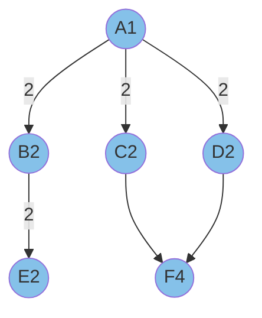
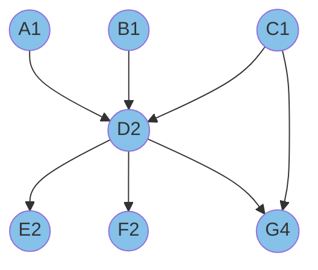
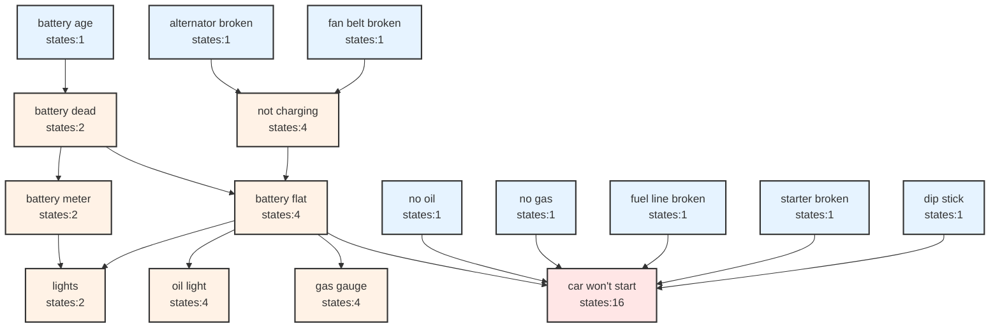
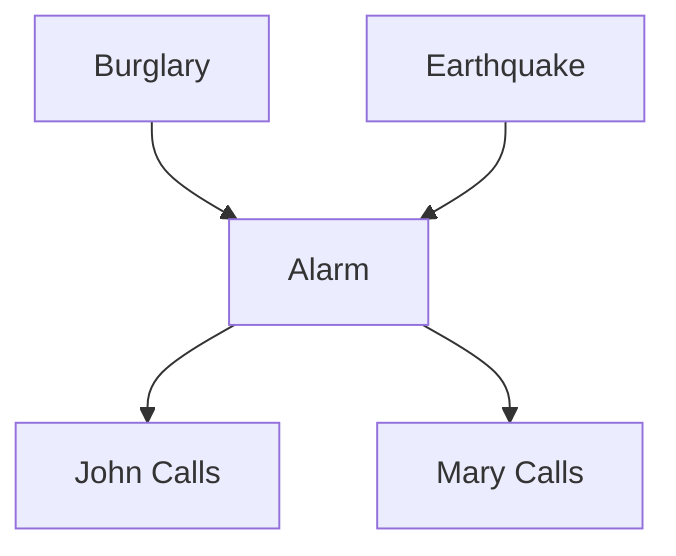
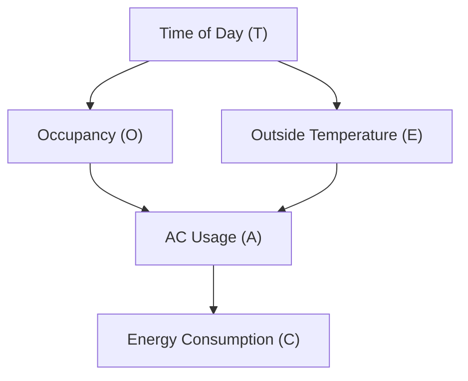

## Bayesian Network

<br>

A Bayesian Network (Bayes Net) is a probabilistic graphical model that represents a set of variables and their conditional
dependencies via a directed acyclic graph (DAG). Based on the information you've shared and the image, let's explain the
Bayes Net concept in more detail:

1. Components of a Bayes Net:
   - Random variables (In this case: S, R, H)
   - Conditional independence relationships (shown by the graph structure)
   - Probability distributions (given in the image)

2. Structure:
   The graph shows S (Sunny) and R (Raise) as parent nodes to H (Happiness), indicating that H is directly influenced by both S and R.

3. Conditional Independence:
   S and R are not connected, implying they are independent. However, they become conditionally dependent when we observe H (explaining away effect).

4. Probability Distributions:
   - Prior probabilities: P(S), P(R)
   - Conditional probabilities: P(H|S,R), P(H|¬S,R), P(H|S,¬R), P(H|¬S,¬R)

5. Inference:
   The image shows calculations of P(R|H,S) and P(R|H,¬S), demonstrating how we can infer the probability of a raise given happiness and weather conditions.

6. Normalization Constant:
   While not explicitly shown in the image, the concept of normalization constant (α) is used in Bayes Net calculations to simplify computations.

7. Explaining Away:
   The difference between P(R|H,S) and P(R|H,¬S) demonstrates the explaining away effect. The probability of a raise is higher when happy on a non-sunny day because the raise better explains the happiness in the absence of sun.

8. Value of the Network:
   This Bayes Net allows us to model complex relationships and make inferences about unobserved variables based on observed evidence.

9. D-Separation:
   While not directly addressed in the image, d-separation is a concept used in Bayes Nets to determine conditional independence relationships.

This Bayes Net example demonstrates how we can model real-world scenarios with multiple interacting factors, represent their relationships
probabilistically, and make inferences based on observed evidence. It's a powerful tool for reasoning under uncertainty in AI and machine
learning applications.

<br>

Let me break this down with examples:

1. **States**: These are the possible values a node can take.
   * Example 1: A "Weather" node might have 3 states: **[Sunny, Rainy, Cloudy]**
   * Example 2: A "Temperature" node might have 2 states: **[Hot, Cold]**

2. **Parents**: These are nodes that directly influence another node.
   * Example: If "Weather" affects "Mood", then Weather is a parent of Mood

Let's work through a concrete example:
Imagine a simple Bayesian network about ice cream sales with these nodes:

1. "Weather" (Parent 1): **[Sunny, Rainy, Cloudy]** (3 states)
2. "Temperature" (Parent 2): **[Hot, Cold]** (2 states)
3. "Ice Cream Sales" (Child node): **[High, Medium, Low]** (3 states)

Let's calculate the parameters needed for "Ice Cream Sales":

1. Number of states - 1 = 3 - 1 = 2 parameters per combination
2. Product of parent states = 3 (Weather states) × 2 (Temperature states) = 6 combinations
3. Total parameters = 2 × 6 = 12 parameters

Why 12 parameters? Because:

For each combination of Weather and Temperature (6 combinations):
   - Sunny & Hot
   - Sunny & Cold
   - Rainy & Hot
   - Rainy & Cold
   - Cloudy & Hot
   - Cloudy & Cold

You need to specify probabilities for 2 of the 3 states (High, Medium) for each combination. The third state (Low) can be calculated since probabilities must sum to 1.

For example, given Sunny & Hot:

   P(Sales=High | Sunny, Hot) = 0.7
   P(Sales=Medium | Sunny, Hot) = 0.2
   P(Sales=Low | Sunny, Hot) = 0.1 (calculated: 1 - 0.7 - 0.2)

This is why we need (states-1) parameters for each combination of parent states. The formula ensures we capture all necessary probabilities while avoiding redundancy.


<br>
<br>

1. **(Number of states - 1)** Let's say we have a node representing "Weather" with 3 states: **[Sunny, Rainy, Cloudy]**

For any given situation, these probabilities must sum to 1.0
If we know:
   P(Sunny) = 0.6
   P(Rainy) = 0.3
Then we can automatically calculate:
   P(Cloudy) = 1 - 0.6 - 0.3 = 0.1
This is why we only need (states - 1) parameters. The last one is determined by the others.

2. **(Product of parent states)** Imagine "Ice Cream Sales" with two parent nodes:

   Weather: [Sunny, Rainy] (2 states)
   Temperature: [Hot, Cold] (2 states)

We need different probabilities for EACH combination:

```
Weather    Temperature    Need probabilities for Ice Cream Sales
Sunny      Hot           Set 1 of probabilities
Sunny      Cold          Set 2 of probabilities
Rainy      Hot           Set 3 of probabilities
Rainy      Cold          Set 4 of probabilities
```

Total combinations = 2 (Weather states) × 2 (Temperature states) = 4

3. **Putting it all together:** If Ice Cream Sales has 3 states **[High, Medium, Low]**:

We need (3-1) = 2 parameters for each combination
We have 4 combinations from parents

Total parameters = 2 × 4 = 8 parameters

This is why we multiply: (Number of states - 1) × (Product of parent states)
The formula ensures we have enough parameters to specify all probabilities while avoiding redundancy, as the last probability in each case can be calculated from the others.


# Bayes Network Parameter Computation

Each node in a Bayesian network needs a set of parameters to define its conditional probability distribution. The number of parameters needed follows this formula:

**Parameters = (|S| - 1) × ∏ᵢ |Pᵢ|**

Where:
- |S| = Number of states for the node
- |Pᵢ| = Number of states for the i-th parent
- ∏ᵢ = Product over all parents

Generally:

 **Parameters = (Number of states - 1) × (Product of parent states)**

<br>

## Common Cases

1. Root nodes (no parents):
   - Only need (states - 1) parameters
   - Single state root nodes need 0 parameters

2. Binary nodes (2 states):
   - Need 1 parameter per parent combination
   - Common in real-world applications

3. Multiple parents:
   - Parameters grow exponentially with parent count
   - Shows why network structure matters


### Quiz: How many probability values are required to specify this Bayes Network?

<br>

**Graph:**

```
A(1)
   2/  |2  \2
  B(2) C(2) D(2)
   |     \   /
  2|      \ /
   E(2)   F(4)
```

<br>



<br>

# Parameter Calculation for Bayesian Network


Each node is labeled with its number of states in parentheses, e.g., A(1) means node A has 1 state.

### 1. Root Node
**Node A (1 state)**:
* Formula: states - 1
* Calculation: 1 - 1 = 0 parameters

### 2. Single Parent Nodes
**Nodes B, C, D (each 2 states)**:
* Formula: (states - 1) × parent states
* For each node: (2 - 1) × 1 = 1 parameter
* Total for single parent nodes: 3 × 1 = 3 parameters

### 3. Node E
**Node E (2 states, parent B has 2 states)**:
* Formula: (states - 1) × parent states
* Calculation: (2 - 1) × 2 = 2 parameters

### 4. Node F
**Node F (4 states, parents C and D each have 2 states)**:
* Formula: (states - 1) × (product of parent states)
* Calculation: (4 - 1) × (2 × 2) = 3 × 4 = 12 parameters

## Total Network Parameters
* Root Node: 0
* Single Parent Nodes: 3
* Node E: 2
* Node F: 12
* Total: 0 + 3 + 2 + 12 = 17 parameters

This network requires 17 parameters to be fully specified, with each node's parameter count determined by its number of states and the states of its parent nodes.


Answer: 13 parameters are needed to specify this network fully.


<br>

```
Node | States | Parents | Calculation | Parameters
-----|---------|---------------------|-------------------|------------
A    | 1       | None                | 1-1 = 0          | 0
B    | 2       | A(1)                | (2-1)×1 = 1      | 1
C    | 2       | A(1)                | (2-1)×1 = 1      | 1
D    | 2       | A(1)                | (2-1)×1 = 1      | 1
E    | 2       | B(2)                | (2-1)×2 = 2      | 2
F    | 4       | C(2),D(2)           | (4-1)×(2×2) = 12 | 12
-----|---------|---------------------|-------------------|------------
Total Parameters: 17
```

### Quiz: How many probability values are required to specify this Bayes Network?

<br>

**Graph:**

```
A(1)   B(1)   C(1)
   \     |     /  |
   \    |    /   |
   \   |   /    |
      D(2)       |
   /    \   \   |
   /      \   \  |
   E(2)    F(2)  G(4)
```

<br>



<br>
Parameter Calculation Table:

```
Node | States | Parents              | Calculation        | Parameters
-----|---------|---------------------|-------------------|------------
A    | 1       | None                | 1-1 = 0           | 0
B    | 1       | None                | 1-1 = 0           | 0
C    | 1       | None                | 1-1 = 0           | 0
D    | 2       | A(1),B(1),C(1)      | (2-1)×(1×1×1) = 1 | 1
E    | 2       | D(2)                | (2-1)×2 = 2       | 2
F    | 2       | D(2)                | (2-1)×2 = 2       | 2
G    | 4       | D(2),C(1)           | (4-1)×(2×1) = 14  | 14
-----|---------|---------------------|-------------------|------------
Total Parameters:                                          19
```

## Parameter Calculation for Bayesian Network (Total: 19)

### 1. Root Nodes
**Nodes A, B, C (each 1 state)**:
* Formula: states - 1
* Calculation: 1 - 1 = 0 parameters each
* Total root parameters: 3 × 0 = 0

### 2. Node D (2 states)
**Parents: A(1), B(1), C(1)**
* Formula: (states - 1) × (product of parent states)
* Calculation: (2 - 1) × (1 × 1 × 1) = 1 parameter

### 3. Nodes E and F (each 2 states)
**Parent: D(2)**
* Formula: (states - 1) × parent states
* For each node: (2 - 1) × 2 = 2 parameters
* Total for E and F: 2 × 2 = 4 parameters

### 4. Node G (4 states)
**Parents: D(2), C(1)**
* Formula: (states - 1) × (product of parent states)
* Calculation: (4 - 1) × (2 × 1) = 14 parameters

## Total Network Parameters
* Root Nodes (A, B, C): 0
* Node D: 1
* Nodes E and F: 4
* Node G: 14
* Total: 0 + 1 + 4 + 14 = 19 parameters

This breakdown shows how the network's 19 parameters are distributed across different node types, with more complex nodes (multiple states and parents) requiring more parameters.


### Car Start Failure Analysis

<br>



<br>

This diagram includes:

1. All nodes with their states
2. All connections between nodes
3. Color coding:
   - Root nodes in light blue
   - Intermediate nodes in light orange
   - Target node (car won't start) in light red
4. States for each node shown in the node label

<br>

## Car Start Failure Network Description

This Bayesian network models the various factors that can cause a car not to start, organized in a hierarchical structure:

### 1. Battery System Chain
- **Battery Age** (1 state) influences:
  - **Battery Dead** (2 states), which affects:
    - **Battery Meter** (2 states) → controls **Lights** (2 states)
    - **Battery Flat** (4 states) → influences multiple indicators

### 2. Charging System Chain
- **Alternator Broken** (1 state) and **Fan Belt Broken** (1 state) both affect:
  - **Not Charging** (4 states) → leads to **Battery Flat**

### 3. Indicator Systems
- **Battery Flat** influences multiple indicators:
  - **Lights** (2 states)
  - **Oil Light** (4 states)
  - **Gas Gauge** (4 states)

### 4. Direct Failure Causes
Multiple components directly affect **Car Won't Start** (16 states):
- **Battery Flat** (4 states)
- **No Oil** (1 state)
- **No Gas** (1 state)
- **Fuel Line Broken** (1 state)
- **Starter Broken** (1 state)
- **Dip Stick** (1 state)

### Network Structure
- **Root Nodes** (8): Components that can fail independently
- **Intermediate Nodes** (7): System states and indicators
- **Target Node** (1): Final outcome (Car Won't Start)

This network captures both:
1. Direct causes of failure (like starter or fuel line problems)
2. Indirect causes through the battery and charging systems
3. Observable indicators (lights, gauges) that can help diagnose the problem


This network effectively models how different car components interact and how their failures propagate through the system to ultimately cause the car not to start, while also including observable symptoms that can help in diagnosis.


### Naive Join Calculation (Incorrect Approach)

The naive join approach incorrectly assumes we need to consider every possible combination of every state of every node:

### 1. Node State Count (Total: 16 nodes)
- Root Nodes (8):
  * Battery Age (1 state)
  * Alternator Broken (1 state)
  * Fan Belt Broken (1 state)
  * Fuel Line Broken (1 state)
  * Starter Broken (1 state)
  * Dip Stick (1 state)
  * No Oil (1 state)
  * No Gas (1 state)

- Intermediate Nodes (7):
  * Battery Dead (2 states)
  * Not Charging (4 states)
  * Battery Meter (2 states)
  * Battery Flat (4 states)
  * Lights (2 states)
  * Oil Light (4 states)
  * Gas Gauge (4 states)

- Target Node (1):
  * Car Won't Start (16 states)

### Naive Join Calculation
2¹⁶ - 1 = 65,535 combinations

This calculation is incorrect because:
1. It treats every node as binary (2 states) when many nodes have 1, 4, or 16 states
2. It ignores the network structure and dependencies
3. It calculates ALL possible combinations rather than just the necessary conditional probabilities
4. It doesn't follow the Bayesian network parameter formula: (States-1) × (Product of parent states)

### Correct Approach
The proper calculation gives us 47 parameters total by:
1. Only considering direct parent-child relationships
2. Using the actual number of states for each node
3. Applying the formula (States-1) × (Product of parent states) for each node
4. Summing up the parameters needed for each node individually


### Conditional Probability Table (CPT) Calculation

The formula Parameters = (States-1) × (Product of parent states) is used to calculate the number of parameters needed in a Conditional Probability Table (CPT) for each node.

A CPT:
1. Represents the conditional probability distribution for each node
2. Shows the probability of a node being in each state given its parents' states
3. Requires fewer parameters than a naive join because:
   - It only considers direct parent-child relationships
   - Uses the fact that probabilities must sum to 1 (hence the States-1)
   - Follows the Markov assumption that a node only depends on its direct parents


### CPT Parameter Calculation

### 1. Root Nodes (all 1 state):
All have (1-1) = 0 parameters each
- Battery Age (1): 0
- Alternator Broken (1): 0
- Fan Belt Broken (1): 0
- Starter Broken (1): 0
- Fuel Line Broken (1): 0
- Dip Stick (1): 0
Total: 0

### 2. Chain from Battery Age:
- Battery Dead (2 states, parent: Battery Age[1]):
  * (2-1) × 1 = 1
- Battery Meter (2 states, parent: Battery Dead[2]):
  * (2-1) × 2 = 2

### 3. Charging Chain:
- Not Charging (4 states, parents: Alternator[1], Fan Belt[1]):
  * (4-1) × (1 × 1) = 3
- Battery Flat (4 states, parent: Not Charging[4]):
  * (4-1) × 4 = 12

### 4. Indicator Nodes:
- Lights (2 states, parents: Battery Meter[2], Battery Flat[4]):
  * (2-1) × (2 × 4) = 8
- Oil Light (4 states, parent: Battery Flat[4]):
  * (4-1) × 4 = 12
- Gas Gauge (4 states, parent: Battery Flat[4]):
  * (4-1) × 4 = 12

### 5. Target Node:
- Car Won't Start (16 states, parents: Battery Flat[4], No Oil[1], No Gas[1], Fuel Line[1], Starter[1], Dip Stick[2]):
  * (16-1) × (4 × 1 × 1 × 1 × 1 × 2) = 15 × 8 = 47

### Total Parameters:
Root nodes: 0
Battery chain: 1 + 2 = 3
Charging chain: 3 + 12 = 15
Indicators: 8 + 12 + 12 = 32
Target node: 47
Total: 47 parameters


<br>
<br>


# D-Separation (Directional Separation)

D-separation is a criterion that determines whether two variables in a Bayesian network are conditionally independent given observed variables. It helps us understand information flow in the network.

## Three Fundamental Connection Types:

### 1. Serial Connection (Chain)

**A → B → C**

- If B is observed: A and C are D-separated (conditionally independent)
- If B is not observed: A and C are D-connected (dependent)
- Example: Battery Dead → Lights Dim → Visibility Poor
  * If we know Lights are Dim (B), Battery Dead (A) doesn't give extra info about Visibility (C)

### 2. Diverging Connection (Common Cause)


  B
 ↙ ↘
A   C

- If B is observed: A and C are D-separated
- If B is not observed: A and C are D-connected
- Example: Battery Dead → Lights Off, Battery Dead → Radio Off
  * If we know Battery is Dead (B), Lights Off (A) doesn't tell us anything new about Radio (C)

### 3. Converging Connection (V-structure)


A   C
 ↘ ↙
  B


- If B or any of B's descendants are observed: A and C are D-connected
- If B and its descendants are not observed: A and C are D-separated
- Example: Battery Dead → Car Won't Start ← Out of Gas
  * If we know Car Won't Start (B), Battery Dead (A) tells us something about Gas (C)

## Key Rules:
1. Two variables are D-separated if ALL paths between them are blocked
2. A path is blocked if it contains:
   - A serial or diverging connection where the middle node is observed
   - A converging connection where neither the middle node nor its descendants are observed
3. Variables that are not D-separated are D-connected


This concept is crucial for:

1. Understanding independence relationships in the network
2. Efficient inference by identifying relevant variables
3. Reducing computational complexity by ignoring irrelevant variables


### Active/Blocked Paths

- A path is active if it can transmit information
- A path is blocked if:
  * Observed variable in serial/diverging connection
  * Unobserved variable (and descendants) in converging connection

### D-separation Rules

Two variables X and Y are d-separated by Z if:
1. All paths between X and Y are blocked by Z
2. No information can flow between X and Y given Z

## Applications

1. Understanding independence relationships
2. Simplifying probability calculations
3. Improving inference efficiency
4. Structure learning in Bayesian networks

<br>

**Independence Checks**

<br>

```
Tree structure:
A
├── B
│   └── C
└── D
    └── E
```

### 1. C ⊥ A (No) - Not D-separated
Path: C ← B ← A
- This is a serial connection (chain)
- B is not observed
- Therefore, information can flow from A to C through B
- Result: C and A are NOT D-separated (dependent)

### 2. C ⊥ A|B (Yes) - D-separated
Path: C ← B ← A
- This is a serial connection
- B is observed (given in the condition)
- B blocks the path between A and C when observed
- Result: C and A are D-separated given B (conditionally independent)

### 3. C ⊥ D (No) - Not D-separated
Path: C ← B ← A → D
- This is a diverging connection at A
- A is not observed
- Information can flow from C to D through their common ancestor A
- Result: C and D are NOT D-separated (dependent)

### 4. C ⊥ D|A (Yes) - D-separated
Path: C ← B ← A → D
- This is a diverging connection at A
- A is observed (given in the condition)
- A blocks the path when observed in a diverging connection
- Result: C and D are D-separated given A (conditionally independent)

### 5. E ⊥ C|D (Yes) - D-separated
Path: E ← D ← A → B → C
- This path contains both diverging (at A) and serial (through B) connections
- D is observed (given in the condition)
- D blocks the path in the serial connection
- Result: E and C are D-separated given D (conditionally independent)


The key concept is that variables become conditionally independent when all paths between them are "blocked" by observed variables.

<br>

# V-Structure D-Separation Analysis


```
Graph structure:
   A   B
    \ /
     C
    / \
   D   E
```

<br>

This is a classic v-structure (converging connection) at C with extensions.

### 1. A ⊥ E (No) - Not D-separated
Path: A → C → E
- This is a serial connection through C
- C is not observed
- Information can flow from A to E through C
- Result: A and E are NOT D-separated (dependent)

### 2. A ⊥ E|B (No) - Not D-separated
Path: A → C → E
- B is observed but not on the path between A and E
- C is still not observed
- Information can still flow from A to E through C
- Result: A and E are NOT D-separated given B (dependent)

### 3. A ⊥ E|C (Yes) - D-separated
Path: A → C → E
- This is a serial connection
- C is observed (given in the condition)
- C blocks the path when observed in a serial connection
- Result: A and E are D-separated given C (conditionally independent)

### 4. A ⊥ B (No) - Not D-separated
Path: A → C ← B
- This is a converging connection (v-structure) at C
- C is not observed
- Even though it's a v-structure, there are active paths through C's descendants (D and E)
- Result: A and B are NOT D-separated (dependent)

### 5. A ⊥ B|C (Yes) - D-separated
Path: A → C ← B
- This is a converging connection at C
- C is observed (given in the condition)
- In a v-structure, observing C blocks the path between A and B
- Result: A and B are D-separated given C (conditionally independent)

Note: In this v-structure:
- Observing C makes its parents (A and B) independent
- Not observing C but observing its descendants (D or E) would make its parents dependent

<br>

### D-Separation with Passive Observation Graph structure

<br>

```
A   C     F
 \ /      |
  B       E
   \     /
    D   /
     \ /
      G
      ↑
      H
```

<br>


This is a complex network with multiple paths and a mix of serial, diverging, and converging connections.

### 1. F ⊥ A (No) - Not D-separated
Possible paths:
1. F → E → G ← D ← B ← A
2. F → E → G ← H
- Multiple paths exist between F and A
- Contains both serial connections and v-structures
- Neither D nor G (the intermediate nodes) are observed
- Information can flow through the path F → E → G ← D ← B ← A
- Result: F and A are NOT D-separated (dependent)

### 2. F ⊥ A|D (Yes) - D-separated
Paths to consider:
1. F → E → G ← D ← B ← A
2. F → E → G ← H
- D is observed (given in the condition)
- D blocks the path in the serial connection
- The path through H is still blocked at G (converging connection)
- Result: F and A are D-separated given D (conditionally independent)

### 3. F ⊥ A|G (No) - Not D-separated
Paths to consider:
1. F → E → G ← D ← B ← A
2. F → E → G ← H
- G is observed (given in the condition)
- G is a converging node (v-structure)
- When G is observed, it activates the path between its parents (D and E)
- This creates an active path between F and A
- Result: F and A are NOT D-separated given G (dependent)

### 4. F ⊥ A|H (No) - Not D-separated
Paths to consider:
1. F → E → G ← D ← B ← A
2. F → E → G ← H
- H is observed (given in the condition)
- H is a parent of G (converging node)
- Observing H doesn't block the path F → E → G ← D ← B ← A
- The path remains active through the other route
- Result: F and A are NOT D-separated given H (dependent)

Key Points:
- Observing D blocks information flow in serial connections
- Observing G (v-structure) activates paths between its parents
- Observing H doesn't help create independence because multiple paths exist


This example shows how complex networks can have multiple paths of information flow, and how d-separation depends on which nodes are observed and the types of connections (serial, diverging, or converging) along these paths. The "passive" marking on D indicates it's not actively transmitting information, but can still be part of active paths.

<br>
<br>

# CHAPTER-5: Inference in Bayes Nets

<br>


## Inference in Bayesian Networks

Inference is the process of calculating the probability of some variables given evidence about other variables in the network.

### Types of Inference Questions

### 1. Probability Queries
- **P(Effect | Cause)**: What's the probability of an effect given its causes?
  * Example: P(CarWontStart | BatteryDead)
- **P(Cause | Effect)**: What's the probability of a cause given its effects?
  * Example: P(BatteryDead | CarWontStart)

### 2. Most Likely Explanation (MLE)
- Finding the most probable assignment to all variables
- Example: What's the most likely combination of problems if the car won't start?

## Common Inference Tasks

1. **Causal Inference**
   - Reasoning from cause to effect
   - Example: If the battery is dead, what's the probability the lights won't work?

2. **Diagnostic Inference**
   - Reasoning from effect to cause
   - Example: If the car won't start, what's the probability the battery is dead?

3. **Intercausal Inference**
   - Reasoning between causes of a common effect
   - Example: If the car won't start and we know the battery is good, what's the probability the starter is broken?

## Inference Methods

1. **Exact Inference**
   - Variable elimination
   - Junction tree algorithms
   - Gives precise probabilities
   - Can be computationally expensive for large networks

2. **Approximate Inference**
   - Monte Carlo sampling
   - Belief propagation
   - Used when exact inference is too costly
   - Trades accuracy for computational efficiency

## Challenges in Inference

1. **Computational Complexity**
   - Exact inference is NP-hard in general
   - Network size and structure affect complexity

2. **Uncertainty Management**
   - Dealing with incomplete or noisy evidence
   - Handling conflicting evidence

3. **Real-time Requirements**
   - Many applications need quick responses
   - Trade-off between accuracy and speed

The key point about inference is that it allows us to:

1. Use the network to answer probabilistic queries
2. Update beliefs based on new evidence
3. Make predictions about unobserved variables
4. Understand cause-and-effect relationships in the system

### enumeration algorithm

The enumeration algorithm takes query and Bayes network as the inputs and outputs a probability distribution after computing the sums of products of conditional probabilities from the network. However, enumeration is hard to compute on large networks and we can use  variable elimination algorithm to reduce the computations.

However, computing exact inferences by enumeration and variable elimination can be computationally expensive in large and well-connected networks. We can use samplings to approximate inferences instead. We will cover different sampling techniques, such as:

1. Direct sampling
2. Rejection sampling
3. Likelihood weighting
4. Gibbs sampling

### Probabilistic inference

1. Probability theory
2. Bayes net
3. Independence
4. Inference

<br>
<br>

## Burglar Alarm Bayesian Network

This network models a home security scenario with five variables:

### Variables
1. **Burglary (B)**: Whether a burglary is occurring
   - States: True (burglary), False (no burglary)
   - Root node (no parents)

2. **Earthquake (E)**: Whether an earthquake is occurring
   - States: True (earthquake), False (no earthquake)
   - Root node (no parents)

3. **Alarm (A)**: Whether the alarm is sounding
   - States: True (alarm on), False (alarm off)
   - Has two parents: Burglary and Earthquake
   - Can be triggered by either a burglary OR an earthquake

4. **John Calls (J)**: Whether John calls to report the alarm
   - States: True (calls), False (doesn't call)
   - Parent: Alarm
   - John calls when he hears the alarm (with some probability)

5. **Mary Calls (M)**: Whether Mary calls to report the alarm
   - States: True (calls), False (doesn't call)
   - Parent: Alarm
   - Mary calls when she hears the alarm (with some probability)

### Network Structure
- **V-structure**: Burglary → Alarm ← Earthquake (converging connection)
- **Serial connections**: Alarm → John Calls, Alarm → Mary Calls

### Inference Examples
1. **Causal Reasoning**:
   - P(Alarm | Burglary): If there's a burglary, will the alarm sound?

2. **Diagnostic Reasoning**:
   - P(Burglary | John Calls, Mary Calls): If both John and Mary call, what's the probability of a burglary?

3. **Intercausal Reasoning**:
   - P(Earthquake | Burglary, Alarm): If the alarm is on and we know there's a burglary, what's the probability of an earthquake?

### Key Features
1. Shows both direct and indirect causation
2. Demonstrates explaining away (if alarm is on and we know there's an earthquake, burglary becomes less likely)
3. Models how multiple causes can lead to the same effect
4. Shows how evidence (calls) can help infer causes (burglary or earthquake)


<br>



<br>

Types of variables:

1. Evidence variables: Variables with known values
2. Query variables: Variables whose values we want to determine
3. Hidden variables: Variables that are neither evidence nor query

In this network:

- Root nodes: Burglary, Earthquake
- Middle node: Alarm
- Leaf nodes: John calls, Mary calls

This is a classic example of a Bayesian network showing an alarm system that can be triggered by either a burglary or an earthquake, and two people (John and Mary) who might call when they hear the alarm.

This network demonstrates:
- Multiple causes (Burglary, Earthquake)
- Common effect (Alarm)
- Multiple effects (John calls, Mary calls)
- Causal relationships (arrows)

It's commonly used to explain probabilistic inference, where we might know some variables (evidence) and want to determine the probability of others (query), while some remain unknown (hidden).

<br>
<br>

<br>

## Enumeration in Probabilistic Reasoning

## Overview
Enumeration is a fundamental exact inference algorithm used in probabilistic reasoning and Bayesian networks. It provides a systematic way to compute exact probability distributions by considering all possible combinations of random variables.

## Core Concepts
Enumeration is fundamentally about:
* Summing over all possible values of hidden variables
* Computing joint probabilities for each combination
* Using these to calculate the posterior probability distribution

## How It Works

### Basic Principle
* Applies Bayes' rule: `P(X|e) = αP(X,e)`
* Computes joint probability `P(X,e)` by summing over all hidden variables
* Uses the chain rule to decompose complex probabilities
* Normalizes results using normalization constant α

### Process Steps
1. **Variable Enumeration**
   * List all possible values for hidden variables
   * Consider each possible combination systematically

2. **Probability Computation**
   * For each combination:
      * Calculate probability using joint distribution
      * Multiply relevant conditional probabilities
   * Sum probabilities for matching query values
   * Normalize the final distribution

## Advantages and Limitations

### Advantages
* Guarantees exact results
* Conceptually straightforward
* Effective for small networks

### Limitations
* Computationally expensive
* Exponential time complexity
* Impractical for large networks

## Example
Consider computing `P(A|B=true)`:
1. Enumerate all possible values of hidden variable C
2. Calculate `P(A,B=true,C)` for each value of C
3. Sum these probabilities
4. Normalize to obtain final probability

## Practical Significance
While enumeration serves as a foundational concept in probabilistic reasoning, it's often replaced by more efficient methods in practical applications. However, understanding enumeration is crucial for grasping more advanced inference algorithms.

<br>
<br>

## Bayes' Theorem Application in Burglary Detection System Analysis

<br>

In this analysis, we explore the application of Bayes' Theorem to calculate the probability of a burglary given evidence from two observers (John and Mary calling). The derivation breaks down the complex conditional probability P(+b|+j,+m) into more manageable components using the joint probability rule and chain rule of conditional probability, factoring in additional variables like earthquake occurrence and alarm status to create a comprehensive probability model for the burglary detection system.

<br>

<br>


<br>

P(+b|+j,+m) represents the posterior probability of a burglary occurring (+b) given that both John called (+j) and Mary called (+m).

Let's break down what this notation means:

1. P(+b|+j,+m) reads as "probability of burglary given John called AND Mary called"
2. +b means "burglary occurred" (positive case of burglary)
3. +j means "John called" (positive case of John calling)
4. +m means "Mary called" (positive case of Mary calling)
5. The vertical bar | means "given that" or "conditional on"


The variables in this equation are:

**b = Burglary**
**e = Earthquake**
**a = Alarm**
**j = John Calls**
**m = Mary Calls**

<br>
<br>

The equation we want to calculate is:

**P(+b|+j,+m) = P(+b,+j,+m) / P(+j,+m)**

<br>

We have hidden variables e (earthquake) and a (alarm) and to get joint probability without these variables, we sum over all their possible values,

P(+b,+j,+m) = P(+b,+j,+m,+e,+a) + P(+b,+j,+m,+e,¬a) +
               P(+b,+j,+m,¬e,+a) + P(+b,+j,+m,¬e,¬a)

            = ∑ₑ∑ₐ P(+b,+j,+m,e,a)

Let's break down the joint probability **P(+b, +j, +m, e, a)** into conditional probabilities:

P(+b, +j, +m, e, a) = P(+b) × P(+j, +m, e, a | +b)
                    = P(+b) × P(e|+b) × P(+j, +m, a | +b, e)
                    = P(+b) × P(e|+b) × P(a|+b, e) × P(+j, +m | +b, e, a)
                    = P(+b) × P(e|+b) × P(a|+b, e) × P(+m|+b, e, a) × P(+j | +b, e, a, +m)

**P(+b, +j, +m, e, a) = P(+b) × P(e|+b) × P(a|+b, e) × P(+m|+b, e, a) × P(+j | +b, e, a, +m)**

Assumptions:

1. Earthquake, **e** is independent of Burglary, **+b**, hence P(e|+b) = P(e)
2. Mary's call **+m** is conditionally independent of burglary **+b** given the alarm **a** and earthquake **e** states. This means once we know the state of the alarm **a** and earthquake **e** and whether or not there was a burglary **+b** doesn't provide any additional information about whether Mary will call. This is because Mary only calls based on hearing the alarm. She doesn't have direct knowledge of whether there's a burglary. Once we know if the alarm is on/off (a) and if there's an earthquake (e). The burglary state (+b) doesn't influence her decision to call. **+m** is conditionally independent of **+b** given **a** and **e** and we can simplify the equation,

   **P(+m|+b, e, a) = P(+m|a, +b, e)**

This equality shows that Mary's probability of calling depends only on the alarm state.

3. For John's call P(+j|a, +b, e, +m), only depends on the alarm state. It's independent of burglary, earthquake, and Mary's call. Therefore, P(+j|a, +b, e, +m) simplifies to P(+j|a). For Mary's call P(+m|a, +b, e) simplifies to P(+m|a).

Thus, under these assumptions, the given equation:

P(+b, +j, +m, e, a) = P(+b) × P(e|+b) × P(a|+b, e) × P(+m|+b, e, a) × P(+j|+b, e, a, +m)
                    = P(+b) × P(e) × P(a|+b, e) × P(+m|a, +b, e) x P(+j|a, +b, e, +m)
                    = P(+b) × P(e) × P(a|+b, e) × P(+m|a) x P(+j|a)

Finally, the given equation is correctly decomposed using the chain rule of probability and the given conditional independences:

**P(+b, +j, +m, e, a) = P(+b) × P(e) × P(a|+b, e) × P(+m|a) x P(+j|a)**

So,

P(+b,+j,+m) = ∑ₑ∑ₐ P(+b,+j,+m,e,a)
            = ∑ₑ∑ₐ P(+b) × P(e) × P(a|+b, e) × P(+m|a) x P(+j|a)

To find the joint probability of a specific combination of all variables (burglary, earthquake, alarm, John's call, and Mary's call) under different states of earthquake (e) and alarm (a):

   1. f(+e,+a): Joint probability when earthquake occurs and alarm is on
   2. f(+e,¬a): Joint probability when earthquake occurs and alarm is off
   3. f(¬e,+a): Joint probability when no earthquake and alarm is on
   4. f(¬e,¬a): Joint probability when no earthquake and alarm is off

Together, they represent all possible scenarios or configurations of the hidden variables (earthquake and alarm) in our Bayesian network. When summed together, they form the normalization constant f(e,a), which ensures our final probability distribution is properly normalized.

f(+e,+a) = P(+b)P(+e)P(+a|+b,+e)P(+j|+a)P(+m|+a)
f(+e,¬a) = P(+b)P(+e)P(¬a|+b,+e)P(+j|¬a)P(+m|¬a)
f(¬e,+a) = P(+b)P(¬e)P(+a|+b,¬e)P(+j|+a)P(+m|+a)
f(¬e,¬a) = P(+b)P(¬e)P(¬a|+b,¬e)P(+j|¬a)P(+m|¬a)

The sum of all these terms, each divided by f(e,a), gives us our final probability.
= f(+e,+a) + f(+e,¬a) + f(¬e,+a) + f(¬e,¬a)

f(e,a)= f(+e,+a) + f(+e,¬a) + f(¬e,+a) + f(¬e,¬a)


The probability P(+j,+m) is equivalent to f(e,a) because, f(e,a) is the sum of all joint probability terms. This sum represents all possible ways John and Mary could have called, and It's exactly what P(+j,+m) represents - the total probability of observing John and Mary's calls
Therefore,

   **P(+j,+m) = f(e,a)**


Posterior probability of a burglary occurring (+b) given that both John called (+j) and Mary called (+m):

P(+b|+j,+m) = P(+b,+j,+m) / P(+j,+m)
            = ∑ₑ∑ₐ [P(+b) × P(e) × P(a|+b, e) × P(+m|a) x P(+j|a)]/P(+j,+m)
            = ∑ₑ∑ₐ [P(+b) × P(e) × P(a|+b, e) × P(+m|a) x P(+j|a)]/f(e,a)
            = P(+b) ∑ₑ P(e) ∑ₐ P(a|+b,e) P(+j|a) P(+m|a) x P(+j|a)]/f(e,a)


The f(e,a) in denominator is a normalizing factor to ensure probabilities sum to 1.

So, finally, the posterior probability of burglary (+b) given John calls (+j) and Mary calls (+m) is:


**P(+b|+j,+m) = P(+b) ∑ₑ P(e) ∑ₐ P(a|+b,e) P(+j|a) P(+m|a) x P(+j|a)]/f(e,a)**

<br>
<br>

## Probability Tables for Burglar Alarm System

## Prior Probabilities

```
| B    | P(B)   | E    | P(E)   |
|------|---------|------|---------|
| +b   | 0.001   | +e   | 0.002   |
| ¬b   | 0.999   | ¬e   | 0.998   |
```

## Conditional Probabilities for Calls

```
| A    | J    | P(J\|A) | A    | M    | P(M\|A) |
|------|------|---------|------|------|---------|
| +a   | +j   | 0.9     | +a   | +m   | 0.7     |
| +a   | ¬j   | 0.1     | +a   | ¬m   | 0.3     |
| ¬a   | +j   | 0.05    | ¬a   | +m   | 0.01    |
| ¬a   | ¬j   | 0.95    | ¬a   | ¬m   | 0.99    |
```

## Conditional Probabilities for Alarm

```
| B    | E    | A    | P(A\|B,E) |
|------|------|------|-----------|
| +b   | +e   | +a   | 0.95      |
| +b   | +e   | ¬a   | 0.05      |
| +b   | ¬e   | +a   | 0.94      |
| +b   | ¬e   | ¬a   | 0.06      |
| ¬b   | +e   | +a   | 0.29      |
| ¬b   | +e   | ¬a   | 0.71      |
| ¬b   | ¬e   | +a   | 0.001     |
| ¬b   | ¬e   | ¬a   | 0.999     |
```

P(+b) = 0.001
P(+e) = 0.002
P(+a|+b,+e) = 0.95
P(+j|+a) = 0.9
P(+m|+a) = 0.7

<br>

∑ₑ ∑ₐ P(+b) P(e) P(a|+b,e) P(+j|a) P(+m|a) = P(+b) ∑ₑ P(e) ∑ₐ P(a|+b,e) P(+j|a) P(+m|a)
                                           = 0.001 × 0.002 × 0.95 × 0.9 × 0.7

<br>
<br>


## Variable Elimination in Bayesian Networks

Variable Elimination is a technique for computing conditional probabilities in Bayesian Networks by progressively summing out (eliminating) variables that aren't part of the query. It's like solving a complex probability problem by breaking it down and removing unnecessary variables one at a time.

## Core Concepts

### 1. Basic Process
1. Factor Creation
   - Convert conditional probability tables to factors
   - Each factor represents part of the joint distribution
   - Example: P(T|R) becomes factor f(R,T)

2. Variable Elimination
   - Choose an elimination ordering
   - Sum out variables one by one
   - Multiply relevant factors before summing

## Advantages
1. Efficiency
   - More efficient than full joint probability table
   - Avoids computing entire joint distribution

2. Space Complexity
   - Only stores necessary factors
   - Intermediate results typically smaller than full joint

## Best Practices
1. Elimination Order
   - Choose order that minimizes intermediate factor size
   - Consider network structure

2. Factor Operations
   - Multiply only necessary factors
   - Sum out variables as soon as possible

## Applications
1. Probabilistic Inference
   - Computing marginal probabilities
   - Finding conditional probabilities

2. Decision Support
   - Medical diagnosis
   - Fault diagnosis
   - Risk assessment

<br>
<br>

### 2. Example (Rain-Traffic-Late Network)

<br>

R = Rain
T = Traffic
L = Late

Bayesian Network: ```R → T → L```

<br>

This shows a simple Bayes Network with three nodes in a chain:
- R (root node) with prior probabilities
- T (depends on R) with conditional probabilities given R
- L (depends on T) with conditional probabilities given T


<br>

**Probability Tables**

<br>

## Prior Probability P(R)

```
| R    | P(R) |
|------|-------|
| +r   | 0.1   |
| -r   | 0.9   |
```

<br>

## Conditional Probability P(T|R)

```
| R    | T    | P(T|R) |
|------|------|---------|
| +r   | +t   | 0.8     |
| +r   | -t   | 0.2     |
| -r   | +t   | 0.1     |
| -r   | -t   | 0.9     |
```

## Joint Probability Table P(R,T)

```
| R    | T    | P(R,T) |
|------|------|---------|
| +r   | +t   | 0.08    |
| +r   | -t   | 0.02    |
| -r   | +t   | 0.09    |
| -r   | -t   | 0.81    |
```

The joint probability table shows all possible combinations of R and T variables and their probabilities, with all values summing to 1.


<br>

## Conditional Probability P(L|T)

```
| T    | L    | P(L|T) |
|------|------|---------|
| +t   | +l   | 0.3     |
| +t   | -l   | 0.7     |
| -t   | +l   | 0.1     |
| -t   | -l   | 0.9     |
```

<br>

### 3. Worked Example


The marginalization formula that calculates the probability of being late P(+l) by summing over all possible values of rain (r) and traffic (t). The double summation (∑ᵣ ∑ₜ) means we're summing over all possible values of both rain and traffic variables, which is necessary to marginalize out these variables to get P(+l):

P(+L) = ∑ᵣ ∑ₜ P(R)P(T|R)P(+L|T)
      = ∑ᵣ ∑ₜ P(R,T)P(+L|T) [Note: P(R,T) = P(R)P(T|R)]
      = ∑ₜ [∑ᵣP(R,T)]xP(+L|T)
      = ∑ₜ P(T)P(+L|T)
      = ∑ₜ P(T,+L)
      = P(+T,+L) + P(-T,+L)
      = 0.051 + 0.083
      = 0.134

Each node is binary (+ or -) and the probabilities for each condition sum to 1:

- For P(R): 0.1 + 0.9 = 1
- For P(T|R) given +r: 0.8 + 0.2 = 1
- For P(T|R) given -r: 0.1 + 0.9 = 1
- For P(L|T) given +t: 0.3 + 0.7 = 1
- For P(L|T) given -t: 0.1 + 0.9 = 1

<br>
<br>


## Network Structure Comparison and Parameter Analysis in Bayesian Networks

<br>
<br>

## Law of Total Probability in Bayesian Networks

## 1. Probability Sum for P(R) = 1
* Rain has two states: raining (+r) or not raining (-r)
* States are mutually exclusive and exhaustive
* P(+r) + P(-r) = 0.1 + 0.9 = 1

## 2. Conditional Probability P(T|R) Given Rain
* When raining (+r), traffic states must sum to 1
  * P(+t|+r) = 0.8 (heavy traffic given rain)
  * P(-t|+r) = 0.2 (no heavy traffic given rain)
  * Total: 0.8 + 0.2 = 1

## 3. Conditional Probability P(T|R) Given No Rain
* When not raining (-r), traffic states sum to 1
  * P(+t|-r) = 0.1 (heavy traffic given no rain)
  * P(-t|-r) = 0.9 (no heavy traffic given no rain)
  * Total: 0.1 + 0.9 = 1

## 4. Conditional Probability P(L|T) Given Heavy Traffic
* With heavy traffic (+t), lateness states sum to 1
  * P(+l|+t) = 0.3 (late given heavy traffic)
  * P(-l|+t) = 0.7 (not late given heavy traffic)
  * Total: 0.3 + 0.7 = 1

## 5. Conditional Probability P(L|T) Given No Heavy Traffic
* Without heavy traffic (-t), lateness states sum to 1
  * P(+l|-t) = 0.1 (late given no heavy traffic)
  * P(-l|-t) = 0.9 (not late given no heavy traffic)
  * Total: 0.1 + 0.9 = 1

## Importance of Sum to 1
* Ensures all possible outcomes are accounted for
* Maintains proper probability normalization
* Validates the probability distribution model

## Warning Signs if Sum ≠ 1
* Missing possible outcomes
* Double-counting outcomes
* Invalid probability assignments


## 1. Alternative Network Structures

### Chain Structure (R → T → L)
* Rain affects Traffic, which affects being Late
* Exhibits conditional independence: P(L|T,R) = P(L|T)
* Requires fewer parameters (total: 5)
  * P(R): 1 parameter
  * P(T|R): 2 parameters
  * P(L|T): 2 parameters

### Combined Structure (RT → L)
* Both Rain and Traffic directly affect being Late
* No conditional independence
* Requires more parameters (total: 7)
  * P(R): 1 parameter
  * P(T|R): 2 parameters
  * P(L|R,T): 4 parameters

## 2. Parameter Calculation Details

### Basic Rule for Binary Variables
* For a binary variable (with states + and -), only one parameter needed
* Probabilities must sum to 1, so P(-) = 1 - P(+)

### Chain Structure Parameter Breakdown
1. **P(R)**: 1 parameter
   * Binary variable (+r, -r)
   * Only need P(+r) as P(-r) = 1 - P(+r)

2. **P(T|R)**: 2 parameters
   * For each R state (+r, -r):
     * T is binary, needs one parameter
   * Total = 2 × (2-1) = 2

3. **P(L|T)**: 2 parameters
   * For each T state (+t, -t):
     * L is binary, needs one parameter
   * Total = 2 × (2-1) = 2

### Combined Structure Parameter Breakdown
1. **P(R)**: 1 parameter (same as chain)
2. **P(T|R)**: 2 parameters (same as chain)
3. **P(L|R,T)**: 4 parameters
   * Four combinations of R and T
   * For each combination, L is binary
   * Total = 4 × (2-1) = 4

## 3. Example Calculations

```
For P(T|R):
P(+t|+r) = 0.8, P(-t|+r) = 0.2 (only need 0.8)
P(+t|-r) = 0.1, P(-t|-r) = 0.9 (only need 0.1)
```

This structure explains why the combined structure requires more parameters (7) than the chain structure (5), due to the additional conditional probabilities needed for L depending on both R and T.


<br>
<br>


## Approximate Inference through Sampling

Approximate Inference uses sampling methods to estimate probabilities in Bayesian networks when exact inference is computationally expensive. Instead of calculating exact probabilities, we generate random samples and use their frequencies to approximate the true probabilities.

## Main Sampling Methods

### 1. Prior (Forward) Sampling
- Sample variables in topological order
- Start from root nodes and follow network structure
- Easy to implement but inefficient for evidence

Example:

For Rain → Traffic → Late:
1. Sample Rain based on P(R)
2. Sample Traffic based on sampled Rain value: P(T|R)
3. Sample Late based on sampled Traffic value: P(L|T)


### 2. Rejection Sampling
- Like prior sampling but:
  * Generate samples as in forward sampling
  * Reject samples inconsistent with evidence
  * Count only accepted samples

Drawbacks:
- Wastes samples that don't match evidence
- Very inefficient with unlikely evidence

### 3. Likelihood Weighting
- Fix evidence variables to observed values
- Weight samples by likelihood of evidence
- More efficient than rejection sampling
- Every sample contributes to final result

### 4. Gibbs Sampling
- Start with arbitrary assignment to non-evidence variables
- Repeatedly resample one variable given others
- More sophisticated but handles complex networks better

## Trade-offs
1. Accuracy vs Speed
   - More samples = better accuracy
   - Fewer samples = faster but less accurate

2. Method Selection
   - Simple networks: Prior sampling
   - Evidence: Likelihood weighting
   - Complex networks: Gibbs sampling

<br>
<br>

## Bayesian Network: Cloudy → (Sprinkler, Rain) → WetGrass

<br>

```
Cloudy
   /       \
  /         \
 v           v
Sprinkler    Rain
 \           /
  \         /
   v       v
   WetGrass
```

<br>
<br>

**Probability Tables**

<br>

```
P(S|C) - Sprinkler given Cloudy:
+C +S | 0.1    +C -S | 0.9
-C +S | 0.5    -C -S | 0.5
```

<br>

```
P(R|C) - Rain given Cloudy:
+C +r | 0.8    +C -r | 0.2
-C +r | 0.2    -C -r | 0.8
```

<br>

```
P(W|S,R) - WetGrass given Sprinkler and Rain:
+S +r +w | 0.99    +S +r -w | 0.01
+S -r +w | 0.90    +S -r -w | 0.10
-S +r +w | 0.90    -S +r -w | 0.10
-S -r +w | 0.01    -S -r -w | 0.99
```

<br>

```
P(C) - Cloudy prior:
+C | 0.5
-C | 0.5
```

<br>

```
Sample shown:
+C, -S, +r, +w
```

<br>
<br>

This seems to be showing a sampling example for wet grass caused by either rain or sprinkler, with cloudiness affecting both. The dots to the right appear to indicate observations or samples, with filled dots representing wet grass (+w) and empty dots representing dry grass (-w).

<br>
<br>

### Rejection Sampling

Rejection sampling is a technique where:
1. Generate samples using prior sampling
2. Reject samples that don't match evidence
3. Count only accepted samples

## Example using Wet Grass Network

Given Evidence: WetGrass = True (+w)

Process:
1. Sample Cloudy (C) using P(C)
2. Sample Rain (R) using P(R|C)
3. Sample Sprinkler (S) using P(S|C)
4. Sample WetGrass (W) using P(W|S,R)
5. If sampled W ≠ evidence (+w), reject sample

Example Sample:

Sample 1: +C, -S, +r, +w ✓ (Accept)
Sample 2: -C, -S, -r, -w ✗ (Reject)
Sample 3: +C, +S, -r, +w ✓ (Accept)


## Pros and Cons

Advantages:
- Simple to implement
- Unbiased estimates
- Samples are independent

Disadvantages:
- Inefficient with unlikely evidence
- Many samples may be rejected
- Computation time wasted on rejected samples

If evidence probability is low (e.g., 1%), approximately 99% of samples will be rejected.


### Likelihood Weighting

Likelihood Weighting is an improvement over rejection sampling where:

1. Evidence variables are fixed to their observed values
2. Non-evidence variables are sampled normally
3. Each sample is weighted by probability of evidence given parents

## How It Works

### Sample Generation Process:
1. Fix evidence variables to observed values
2. Sample non-evidence variables following network order
3. Weight = product of probabilities of evidence values

Example using Wet Grass Network:

Evidence: W = +w (wet grass)

Sample Generation:
1. Sample C using P(C)
2. Sample R using P(R|C)
3. Sample S using P(S|C)
4. Fix W = +w
5. Weight = P(W=+w|sampled S, sampled R)


### Weight Calculation

For sample {+C, -S, +r, +w}:
Weight = P(W=+w|S=-s, R=+r)
       = 0.90 (from P(W|S,R) table)


## Advantages
1. No samples rejected
2. More efficient than rejection sampling
3. Handles multiple evidence variables
4. Works well with unlikely evidence

## Disadvantages
1. Samples not independent
2. Can perform poorly with long sequences
3. May need more samples for accurate results


<br>
<br>

## Bayesian Network for Smart Home Energy Consumption

<br>
<br>


**Network Structure:**

<br>

Bayesian Network diagram showing the relationships between Time of Day, Occupancy, Outside Temperature, AC Usage, and Energy Consumption:




<br>

**Nodes:**

<br>

1. **Time of Day (T)**: Morning, Afternoon, Evening
2. **Occupancy (O)**: Occupied, Unoccupied
3. **Outside Temperature (E)**: Hot, Mild, Cold
4. **AC Usage (A)**: On, Off
5. **Energy Consumption (C)**: High, Medium, Low

<br>
<br>

**Edges:**

<br>
This diagram shows:
1. Time of Day (T) influences both:
   - Occupancy (O)
   - Outside Temperature (E)
2. AC Usage (A) depends on:
   - Occupancy (O)
   - Outside Temperature (E)
3. Energy Consumption (C) depends directly on:
   - AC Usage (A)

Considering the following relationships:

1. Time of Day → Occupancy
2. Time of Day → Outside Temperature
3. Occupancy → AC Usage
4. Outside Temperature → AC Usage
5. AC Usage → Energy Consumption

The arrows represent direct causal relationships and conditional dependencies between variables in the smart building energy management system.


<br>
<br>

### Inference in the AC Usage Bayesian Network:

<br>

1. Types of Inference:

   a) Predictive Inference: Reasoning from causes to effects.
      Example: What's the probability of high energy consumption given that it's a hot afternoon?

   b) Diagnostic Inference: Reasoning from effects to causes.
      Example: If energy consumption is high, what's the probability that the AC is on?

   c) Intercausal Inference: Reasoning between causes of a common effect.
      Example: If energy consumption is high and it's occupied, how does this affect the probability of it being hot outside?

2. Inference Methods:

   a) Exact Inference:
      - Variable Elimination: Systematically "sum out" variables not involved in the query.
      - Junction Tree Algorithm: Create a tree structure for efficient exact inference.

   b) Approximate Inference:
      - Monte Carlo methods: Use random sampling to estimate probabilities.
      - Variational methods: Approximate complex distributions with simpler ones.

3. Example Inference Task:

   Query: P(A = On | T = Afternoon, C = High)
   "What's the probability the AC is on given it's afternoon and energy consumption is high?"

   Steps:
   1. Apply Bayes' Rule: P(A|T,C) = P(C|A,T) * P(A|T) / P(C|T)
   2. Expand using marginalization:
      P(A|T,C) = Σ[O,E] P(C|A) * P(A|O,E) * P(O|T) * P(E|T) / P(C|T)
   3. Use probability tables to compute each term.
   4. Sum over all possible values of O and E.

4. Challenges in Inference:

   - Computational Complexity: As the network grows, exact inference can become intractable.
   - Continuous Variables: Many algorithms are designed for discrete variables; continuous variables may require discretization
     or special techniques.
   - Incomplete Data: Handling missing values in the evidence.

5. Applications of Inference:

   - Prediction: Estimating future energy consumption based on current conditions.
   - Diagnosis: Identifying potential causes of unexpected energy usage patterns.
   - Decision Making: Determining optimal AC settings to balance comfort and energy efficiency.

<br>
<br>

<br>
<br>

## Probability of AC Usage Given Time of Day and Energy Consumption

<br>
<br>

**P(A|T,C)** represents the probability of AC Usage (A) given Time of Day (T) and Energy Consumption (C). The formula uses marginalization over hidden variables Occupancy (O) and Outside Temperature (E).


P(A|T,C) = P(C|A,T) * P(A|T) / P(C|T) [Note: Bayes Theorem]


According to the Law of Total Probability, for any events X and Y, where Y₁, Y₂, ..., Yₙ form a partition of the sample space:

**P(X) = Σᵢ P(X|Yᵢ)P(Yᵢ)**

In our case, we want P(A|T), and we have two hidden variables O and E:

1. Each combination of O and E values forms a partition
2. For example, if O is binary (occupied/unoccupied) and E is ternary (hot/mild/cold), we have 6 possible combinations


P(A|T) = Σ[O,E] P(A|O,E,T)P(O,E|T)
       = Σ[O,E] P(A,O,E|T) [Note: Law of Conditional Probability]

This is marginalization - we're "summing out" the variables O and E to get the probability of A given T. It's like saying: "To find the probability of AC usage at a given time, consider all possible combinations of occupancy and temperature at that time, and sum their contributions". For example, if O = {0,1} and E = {hot,mild,cold}:

P(A|T) = P(A,O=0,E=hot|T) + P(A,O=0,E=mild|T) + P(A,O=0,E=cold|T) +
         P(A,O=1,E=hot|T) + P(A,O=1,E=mild|T) + P(A,O=1,E=cold|T)


Hence, our formula becomes:

P(A|T,C) = P(C|A,T) * P(A|T) / P(C|T)
         = P(C|A,T) * Σ[O,E] P(A,O,E|T) / P(C|T)

According to the Chain Law of Probability,

   **P(A,O,E|T) = P(A|O,E,T) * P(O,E|T)**


P(A|T,C) = P(C|A,T) * Σ[O,E] P(A,O,E|T) / P(C|T)
         = P(C|A,T) * Σ[O,E] P(A|O,E,T) * P(O,E|T) / P(C|T)


<br>


<br>

Due to conditional independence in the Bayesian network:
1. A is conditionally independent of T given O and E
2. O and E are conditionally independent given T

Hence, we have:

P(A|O,E,T) = P(A|O,E)
P(O,E|T) = P(O|T) * P(E|T)

Substituting back:

P(A|T,C) = P(C|A,T) * Σ[O,E] P(A|O,E,T) * P(O,E|T) / P(C|T)
         = P(C|A,T) * Σ[O,E] P(A|O,E) * P(O|T) * P(E|T) / P(C|T)

Now for P(C|A,T), by conditional independence, C depends only on A in the network structure. Specifically,

   **P(C|A,T) = P(C|A)**

Putting it all together:

P(A|T,C) = P(C|A) * [Σ[O,E] P(A|O,E) * P(O|T) * P(E|T)] / P(C|T)
         = Σ[O,E] P(C|A) * P(A|O,E) * P(O|T) * P(E|T) / P(C|T)

So, our final equation becomes:

   **P(A|T,C) = Σ[O,E] P(C|A) * P(A|O,E) * P(O|T) * P(E|T) / P(C|T)**


This equation calculates "the probability of AC being ON given the Time of Day and Energy Consumption" where:

## Probability Terms

1. **P(C|A)**: Probability of seeing this Energy Consumption given AC state
   * Example: P(Energy=High | AC=ON)

2. **P(A|O,E)**: Probability of AC being ON given Occupancy and Temperature
   * Example: P(AC=ON | Room=Occupied, Temp=Hot)

3. **P(O|T)**: Probability of Occupancy at given Time
   * Example: P(Room=Occupied | Time=Afternoon)

4. **P(E|T)**: Probability of Temperature at given Time
   * Example: P(Temp=Hot | Time=Afternoon)

5. **P(C|T)**: Normalization term (probability of Energy Consumption at Time)

## Summation Explanation

The Σ[O,E] means we sum over all possible combinations of:
* Occupancy (O): {Occupied, Unoccupied}
* Temperature (E): {Hot, Mild, Cold}

## Real-World Example

If we want to know P(AC=ON | Time=Afternoon, Energy=High), we:
1. Consider every possible combination of occupancy and temperature
2. Multiply the probabilities for each combination
3. Sum all these products
4. Divide by the normalization term

This accounts for all possible scenarios that could lead to the AC being ON at that time with high energy consumption.


<br>
<br>

### Likelihood Weighting

<br>

Likelihood Weighting is an approximate inference technique used in Bayesian networks. It's a type of importance sampling method that's particularly useful for networks with evidence. Let's break it down:

Key Concept:
Likelihood Weighting generates weighted samples from the network, where the weights are determined by how well each sample matches the observed evidence.

How it works:

   1. Evidence Fixing:
      - Set the evidence variables to their observed values.
      - These values remain fixed for all samples.

   2. Sampling:
      - For each non-evidence variable, in topological order:
        - If the variable is an ancestor of an evidence variable, sample it from its conditional probability distribution.
        - If not, set its value based on its parents (as per the network structure).

   3. Weight Calculation:
      - Start with a weight of 1.
      - For each evidence variable, multiply the weight by the probability of observing that evidence given its parents' values in the current sample.

   4. Repeat:
      - Generate multiple samples, each with its associated weight.

   5. Estimation:
      - Use the weighted samples to estimate probabilities of query variables.

Advantages:
   1. More efficient than rejection sampling, especially with unlikely evidence.
   2. Easy to implement.
   3. Handles multiple evidence variables well.

Disadvantages:

   1. Can be less accurate for unlikely evidence scenarios.
   2. May require many samples for good accuracy in complex networks.

Example (using the R→T→L network from the image):

Let's say we want to estimate P(R|L=+l) (probability of rain given we're late).

   1. Fix L=+l for all samples.
   2. For each sample:
      - Sample R from P(R)
      - Sample T from P(T|R)
      - Set L=+l
      - Calculate weight: w = P(L=+l|T)
   3. Repeat for many samples.
   4. Estimate P(R=+r|L=+l) as:
      (sum of weights where R=+r) / (total sum of weights)

Likelihood Weighting is particularly useful in this network because it ensures that every sample is consistent with the
evidence (L=+l), making it more efficient than methods that might generate inconsistent samples and reject them.

<br>
<br>

## Gibbs sampling

<br>

Gibbs sampling is another method of approximate inference in Bayesian networks. It's a Markov Chain Monte Carlo (MCMC) technique that's particularly useful for high-dimensional problems. Let's break it down with an example.

Gibbs Sampling Concept:
The idea is to sample each variable in turn, conditioned on the current values of all other variables in the network.

Using our R (Rain) → T (Traffic) → L (Late) network as an example:

Step 1: Initialize
Start with arbitrary values for all variables. Let's say:
R = +r (Raining)
T = -t (No traffic)
L = +l (Late)

Step 2: Sampling Process
1. Sample R given T and L:
   P(R | T=-t, L=+l) ∝ P(R) * P(T=-t | R) * P(L=+l | T=-t)
   Calculate this for R=+r and R=-r, normalize, then sample.

2. Sample T given new R and L:
   P(T | R, L=+l) ∝ P(T | R) * P(L=+l | T)
   Calculate for T=+t and T=-t, normalize, then sample.

3. Sample L given new R and T:
   P(L | R, T) ∝ P(L | T)
   Calculate for L=+l and L=-l, normalize, then sample.

Step 3: Repeat
Repeat this process many times (e.g., 1000 iterations).

Step 4: Analysis
After the "burn-in" period (initial samples we discard), count the frequency of each state to estimate probabilities.

Example Iteration:
Let's say we want to estimate P(R | L=+l)

1. Start: R=+r, T=-t, L=+l

2. Sample R:
   P(R=+r | T=-t, L=+l) ∝ 0.1 * 0.2 * 0.1 = 0.002
   P(R=-r | T=-t, L=+l) ∝ 0.9 * 0.9 * 0.1 = 0.081
   Normalize: P(R=+r) ≈ 0.024, P(R=-r) ≈ 0.976
   Sample new R, let's say we get R=-r

3. Sample T:
   P(T=+t | R=-r, L=+l) ∝ 0.1 * 0.3 = 0.03
   P(T=-t | R=-r, L=+l) ∝ 0.9 * 0.1 = 0.09
   Normalize: P(T=+t) ≈ 0.25, P(T=-t) ≈ 0.75
   Sample new T, let's say we get T=-t

4. Sample L:
   Here, L is fixed to +l as it's our evidence.

5. New state: R=-r, T=-t, L=+l

Repeat this process many times. After the burn-in period, the proportion of samples where R=+r will approximate P(R=+r | L=+l).

Advantages of Gibbs Sampling:
1. Works well in high-dimensional spaces.
2. Can be more efficient than other sampling methods for certain types of networks.
3. Relatively easy to implement.

Challenges:
1. May converge slowly if variables are highly correlated.
2. Needs to run for many iterations to get accurate results.
3. Requires ability to sample from conditional distributions.

Gibbs sampling is particularly useful in complex networks where direct probability calculations are intractable, allowing
us to approximate probabilities through this iterative sampling process.


<br>
<br>

## SUMMARY: Inference Methods in Bayesian Networks

## Exact Inference Algorithms

### 1. Enumeration
* Computes query's conditional probability by summing terms from full joint distribution
* Uses complete probability distribution

### 2. Variable Elimination
* Reduces enumeration computation complexity
* Stores intermediate results for reuse
* More efficient than pure enumeration

## Approximate Inference through Sampling
For large, highly connected networks where exact inference is computationally expensive

### 1. Direct Sampling
* Simplest form of sample generation
* Uses known probability distributions
* Example: Coin flip sampling using uniform distribution

### 2. Rejection Sampling
* Generates samples from known network distribution
* Rejects samples that don't match evidence
* More selective than direct sampling

### 3. Likelihood Sampling
* Similar to rejection sampling
* Only generates events consistent with evidence
* More efficient than rejection sampling

### 4. Gibbs Sampling
* Starts with arbitrary state
* Generates next state by randomly sampling non-evidence variables
* Keeps evidence variables fixed
* Useful for complex networks
