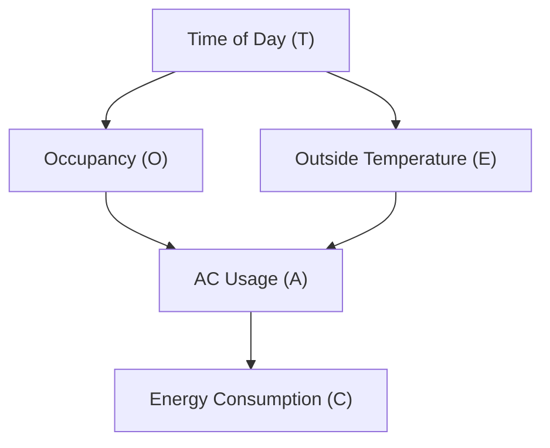

### Likelihood Weighting

Likelihood Weighting is an improvement over rejection sampling where:

1. Evidence variables are fixed to their observed values
2. Non-evidence variables are sampled normally
3. Each sample is weighted by probability of evidence given parents

## How It Works

### Sample Generation Process:
1. Fix evidence variables to observed values
2. Sample non-evidence variables following network order
3. Weight = product of probabilities of evidence values

Example using Wet Grass Network:

Evidence: W = +w (wet grass)

Sample Generation:
1. Sample C using P(C)
2. Sample R using P(R|C)
3. Sample S using P(S|C)
4. Fix W = +w
5. Weight = P(W=+w|sampled S, sampled R)

### Weight Calculation

For sample {+C, -S, +r, +w}:
Weight = P(W=+w|S=-s, R=+r)
       = 0.90 (from P(W|S,R) table)

## Advantages
1. No samples rejected
2. More efficient than rejection sampling
3. Handles multiple evidence variables
4. Works well with unlikely evidence

## Disadvantages
1. Samples not independent
2. Can perform poorly with long sequences
3. May need more samples for accurate results

 
 

## Bayesian Network for Smart Home Energy Consumption

 
 

**Network Structure:**

 

Bayesian Network diagram showing the relationships between Time of Day, Occupancy, Outside Temperature, AC Usage, and Energy Consumption:

 

**Nodes:**

 

1. **Time of Day (T)**: Morning, Afternoon, Evening
2. **Occupancy (O)**: Occupied, Unoccupied
3. **Outside Temperature (E)**: Hot, Mild, Cold
4. **AC Usage (A)**: On, Off
5. **Energy Consumption (C)**: High, Medium, Low

 
 

**Edges:**

 
This diagram shows:
1. Time of Day (T) influences both:
   - Occupancy (O)
   - Outside Temperature (E)
2. AC Usage (A) depends on:
   - Occupancy (O)
   - Outside Temperature (E)
3. Energy Consumption (C) depends directly on:
   - AC Usage (A)

Considering the following relationships:

1. Time of Day → Occupancy
2. Time of Day → Outside Temperature
3. Occupancy → AC Usage
4. Outside Temperature → AC Usage
5. AC Usage → Energy Consumption

The arrows represent direct causal relationships and conditional dependencies between variables in the smart building energy management system.

 
 

### Inference in the AC Usage Bayesian Network:

 

1. Types of Inference:

   a) Predictive Inference: Reasoning from causes to effects.
      Example: What's the probability of high energy consumption given that it's a hot afternoon?

   b) Diagnostic Inference: Reasoning from effects to causes.
      Example: If energy consumption is high, what's the probability that the AC is on?

   c) Intercausal Inference: Reasoning between causes of a common effect.
      Example: If energy consumption is high and it's occupied, how does this affect the probability of it being hot outside?

2. Inference Methods:

   a) Exact Inference:
      - Variable Elimination: Systematically "sum out" variables not involved in the query.
      - Junction Tree Algorithm: Create a tree structure for efficient exact inference.

   b) Approximate Inference:
      - Monte Carlo methods: Use random sampling to estimate probabilities.
      - Variational methods: Approximate complex distributions with simpler ones.

3. Example Inference Task:

   Query: P(A = On | T = Afternoon, C = High)
   "What's the probability the AC is on given it's afternoon and energy consumption is high?"

   Steps:
   1. Apply Bayes' Rule: P(A|T,C) = P(C|A,T) * P(A|T) / P(C|T)
   2. Expand using marginalization:
      P(A|T,C) = Σ[O,E] P(C|A) * P(A|O,E) * P(O|T) * P(E|T) / P(C|T)
   3. Use probability tables to compute each term.
   4. Sum over all possible values of O and E.

4. Challenges in Inference:

   - Computational Complexity: As the network grows, exact inference can become intractable.
   - Continuous Variables: Many algorithms are designed for discrete variables; continuous variables may require discretization
     or special techniques.
   - Incomplete Data: Handling missing values in the evidence.

5. Applications of Inference:

   - Prediction: Estimating future energy consumption based on current conditions.
   - Diagnosis: Identifying potential causes of unexpected energy usage patterns.
   - Decision Making: Determining optimal AC settings to balance comfort and energy efficiency.

 
 

 
 

## Probability of AC Usage Given Time of Day and Energy Consumption

 
 

**P(A|T,C)** represents the probability of AC Usage (A) given Time of Day (T) and Energy Consumption (C). The formula uses marginalization over hidden variables Occupancy (O) and Outside Temperature (E).

P(A|T,C) = P(C|A,T) * P(A|T) / P(C|T) [Note: Bayes Theorem]

According to the Law of Total Probability, for any events X and Y, where Y₁, Y₂, ..., Yₙ form a partition of the sample space:

**P(X) = Σᵢ P(X|Yᵢ)P(Yᵢ)**

In our case, we want P(A|T), and we have two hidden variables O and E:

1. Each combination of O and E values forms a partition
2. For example, if O is binary (occupied/unoccupied) and E is ternary (hot/mild/cold), we have 6 possible combinations

P(A|T) = Σ[O,E] P(A|O,E,T)P(O,E|T)
       = Σ[O,E] P(A,O,E|T) [Note: Law of Conditional Probability]

This is marginalization - we're "summing out" the variables O and E to get the probability of A given T. It's like saying: "To find the probability of AC usage at a given time, consider all possible combinations of occupancy and temperature at that time, and sum their contributions". For example, if O = {0,1} and E = {hot,mild,cold}:

P(A|T) = P(A,O=0,E=hot|T) + P(A,O=0,E=mild|T) + P(A,O=0,E=cold|T) +
         P(A,O=1,E=hot|T) + P(A,O=1,E=mild|T) + P(A,O=1,E=cold|T)

Hence, our formula becomes:

P(A|T,C) = P(C|A,T) * P(A|T) / P(C|T)
         = P(C|A,T) * Σ[O,E] P(A,O,E|T) / P(C|T)

According to the Chain Law of Probability,

   **P(A,O,E|T) = P(A|O,E,T) * P(O,E|T)**

P(A|T,C) = P(C|A,T) * Σ[O,E] P(A,O,E|T) / P(C|T)
         = P(C|A,T) * Σ[O,E] P(A|O,E,T) * P(O,E|T) / P(C|T)

 

 

Due to conditional independence in the Bayesian network:
1. A is conditionally independent of T given O and E
2. O and E are conditionally independent given T

Hence, we have:

P(A|O,E,T) = P(A|O,E)
P(O,E|T) = P(O|T) * P(E|T)

Substituting back:

P(A|T,C) = P(C|A,T) * Σ[O,E] P(A|O,E,T) * P(O,E|T) / P(C|T)
         = P(C|A,T) * Σ[O,E] P(A|O,E) * P(O|T) * P(E|T) / P(C|T)

Now for P(C|A,T), by conditional independence, C depends only on A in the network structure. Specifically,

   **P(C|A,T) = P(C|A)**

Putting it all together:

P(A|T,C) = P(C|A) * [Σ[O,E] P(A|O,E) * P(O|T) * P(E|T)] / P(C|T)
         = Σ[O,E] P(C|A) * P(A|O,E) * P(O|T) * P(E|T) / P(C|T)

So, our final equation becomes:

   **P(A|T,C) = Σ[O,E] P(C|A) * P(A|O,E) * P(O|T) * P(E|T) / P(C|T)**

This equation calculates "the probability of AC being ON given the Time of Day and Energy Consumption" where:

## Probability Terms

1. **P(C|A)**: Probability of seeing this Energy Consumption given AC state
   * Example: P(Energy=High | AC=ON)

2. **P(A|O,E)**: Probability of AC being ON given Occupancy and Temperature
   * Example: P(AC=ON | Room=Occupied, Temp=Hot)

3. **P(O|T)**: Probability of Occupancy at given Time
   * Example: P(Room=Occupied | Time=Afternoon)

4. **P(E|T)**: Probability of Temperature at given Time
   * Example: P(Temp=Hot | Time=Afternoon)

5. **P(C|T)**: Normalization term (probability of Energy Consumption at Time)

## Summation Explanation

The Σ[O,E] means we sum over all possible combinations of:
* Occupancy (O): {Occupied, Unoccupied}
* Temperature (E): {Hot, Mild, Cold}

## Real-World Example

If we want to know P(AC=ON | Time=Afternoon, Energy=High), we:
1. Consider every possible combination of occupancy and temperature
2. Multiply the probabilities for each combination
3. Sum all these products
4. Divide by the normalization term

This accounts for all possible scenarios that could lead to the AC being ON at that time with high energy consumption.

 
 

### Likelihood Weighting

 

Likelihood Weighting is an approximate inference technique used in Bayesian networks. It's a type of importance sampling method that's particularly useful for networks with evidence. Let's break it down:

Key Concept:
Likelihood Weighting generates weighted samples from the network, where the weights are determined by how well each sample matches the observed evidence.

How it works:

   1. Evidence Fixing:
      - Set the evidence variables to their observed values.
      - These values remain fixed for all samples.

   2. Sampling:
      - For each non-evidence variable, in topological order:
        - If the variable is an ancestor of an evidence variable, sample it from its conditional probability distribution.
        - If not, set its value based on its parents (as per the network structure).

   3. Weight Calculation:
      - Start with a weight of 1.
      - For each evidence variable, multiply the weight by the probability of observing that evidence given its parents' values in the current sample.

   4. Repeat:
      - Generate multiple samples, each with its associated weight.

   5. Estimation:
      - Use the weighted samples to estimate probabilities of query variables.

Advantages:
   1. More efficient than rejection sampling, especially with unlikely evidence.
   2. Easy to implement.
   3. Handles multiple evidence variables well.

Disadvantages:

   1. Can be less accurate for unlikely evidence scenarios.
   2. May require many samples for good accuracy in complex networks.

Example (using the R→T→L network from the image):

Let's say we want to estimate P(R|L=+l) (probability of rain given we're late).

   1. Fix L=+l for all samples.
   2. For each sample:
      - Sample R from P(R)
      - Sample T from P(T|R)
      - Set L=+l
      - Calculate weight: w = P(L=+l|T)
   3. Repeat for many samples.
   4. Estimate P(R=+r|L=+l) as:
      (sum of weights where R=+r) / (total sum of weights)

Likelihood Weighting is particularly useful in this network because it ensures that every sample is consistent with the
evidence (L=+l), making it more efficient than methods that might generate inconsistent samples and reject them.

 
 

## Gibbs sampling

 

Gibbs sampling is another method of approximate inference in Bayesian networks. It's a Markov Chain Monte Carlo (MCMC) technique that's particularly useful for high-dimensional problems. Let's break it down with an example.

Gibbs Sampling Concept:
The idea is to sample each variable in turn, conditioned on the current values of all other variables in the network.

Using our R (Rain) → T (Traffic) → L (Late) network as an example:

Step 1: Initialize
Start with arbitrary values for all variables. Let's say:
R = +r (Raining)
T = -t (No traffic)
L = +l (Late)

Step 2: Sampling Process
1. Sample R given T and L:
   P(R | T=-t, L=+l) ∝ P(R) * P(T=-t | R) * P(L=+l | T=-t)
   Calculate this for R=+r and R=-r, normalize, then sample.

2. Sample T given new R and L:
   P(T | R, L=+l) ∝ P(T | R) * P(L=+l | T)
   Calculate for T=+t and T=-t, normalize, then sample.

3. Sample L given new R and T:
   P(L | R, T) ∝ P(L | T)
   Calculate for L=+l and L=-l, normalize, then sample.

Step 3: Repeat
Repeat this process many times (e.g., 1000 iterations).

Step 4: Analysis
After the "burn-in" period (initial samples we discard), count the frequency of each state to estimate probabilities.

Example Iteration:
Let's say we want to estimate P(R | L=+l)

1. Start: R=+r, T=-t, L=+l

2. Sample R:
   P(R=+r | T=-t, L=+l) ∝ 0.1 * 0.2 * 0.1 = 0.002
   P(R=-r | T=-t, L=+l) ∝ 0.9 * 0.9 * 0.1 = 0.081
   Normalize: P(R=+r) ≈ 0.024, P(R=-r) ≈ 0.976
   Sample new R, let's say we get R=-r

3. Sample T:
   P(T=+t | R=-r, L=+l) ∝ 0.1 * 0.3 = 0.03
   P(T=-t | R=-r, L=+l) ∝ 0.9 * 0.1 = 0.09
   Normalize: P(T=+t) ≈ 0.25, P(T=-t) ≈ 0.75
   Sample new T, let's say we get T=-t

4. Sample L:
   Here, L is fixed to +l as it's our evidence.

5. New state: R=-r, T=-t, L=+l

Repeat this process many times. After the burn-in period, the proportion of samples where R=+r will approximate P(R=+r | L=+l).

